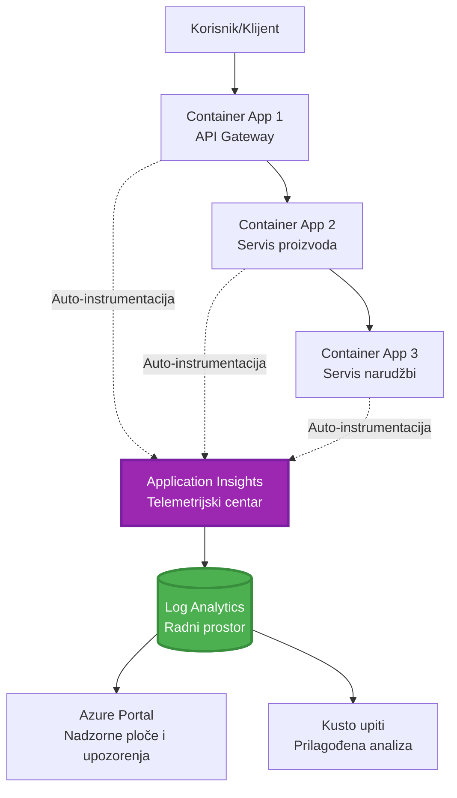
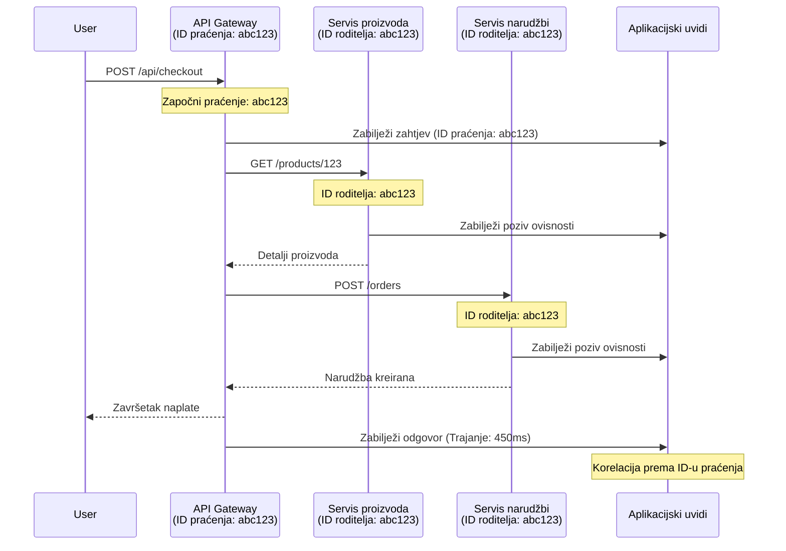

# Integracija Application Insights s AZD-om

⏱️ **Procijenjeno vrijeme**: 40-50 minuta | 💰 **Trošak**: ~5-15 USD/mjesečno | ⭐ **Složenost**: Srednja

**📚 Put učenja:**
- ← Prethodno: [Preflight Checks](preflight-checks.md) - Provjera prije implementacije
- 🎯 **Trenutno ste ovdje**: Integracija Application Insights (Praćenje, telemetrija, otklanjanje pogrešaka)
- → Sljedeće: [Vodič za implementaciju](../deployment/deployment-guide.md) - Implementacija na Azure
- 🏠 [Početna stranica tečaja](../../README.md)

---

## Što ćete naučiti

Završetkom ove lekcije, naučit ćete:
- Automatski integrirati **Application Insights** u AZD projekte
- Konfigurirati **distribuirano praćenje** za mikroservise
- Implementirati **prilagođenu telemetriju** (metrike, događaje, ovisnosti)
- Postaviti **live metrics** za praćenje u stvarnom vremenu
- Kreirati **upozorenja i nadzorne ploče** iz AZD implementacija
- Otklanjati probleme u produkciji pomoću **upita za telemetriju**
- Optimizirati **troškove i strategije uzorkovanja**
- Pratiti **AI/LLM aplikacije** (tokeni, kašnjenje, troškovi)

## Zašto je Application Insights važan za AZD

### Izazov: Vidljivost u produkciji

**Bez Application Insights:**
```
❌ No visibility into production behavior
❌ Manual log aggregation across services
❌ Reactive debugging (wait for customer complaints)
❌ No performance metrics
❌ Cannot trace requests across services
❌ Unknown failure rates and bottlenecks
```

**S Application Insights + AZD:**
```
✅ Automatic telemetry collection
✅ Centralized logs from all services
✅ Proactive issue detection
✅ End-to-end request tracing
✅ Performance metrics and insights
✅ Real-time dashboards
✅ AZD provisions everything automatically
```

**Analogija**: Application Insights je poput "crne kutije" za snimanje leta + kokpitske nadzorne ploče za vašu aplikaciju. Vidite sve što se događa u stvarnom vremenu i možete reproducirati bilo koji incident.

---

## Pregled arhitekture

### Application Insights u AZD arhitekturi


### Što se automatski prati

| Vrsta telemetrije | Što bilježi | Primjena |
|-------------------|-------------|----------|
| **Zahtjevi** | HTTP zahtjevi, statusni kodovi, trajanje | Praćenje performansi API-ja |
| **Ovisnosti** | Vanjski pozivi (DB, API-ji, pohrana) | Identifikacija uskih grla |
| **Izuzeci** | Neobrađene pogreške sa stogovima | Otklanjanje pogrešaka |
| **Prilagođeni događaji** | Poslovni događaji (registracija, kupnja) | Analitika i tokovi |
| **Metrike** | Brojači performansi, prilagođene metrike | Planiranje kapaciteta |
| **Tragovi** | Poruke dnevnika s razinom ozbiljnosti | Otklanjanje pogrešaka i revizija |
| **Dostupnost** | Testovi dostupnosti i vremena odziva | Praćenje SLA-a |

---

## Preduvjeti

### Potrebni alati

```bash
# Provjerite Azure Developer CLI
azd version
# ✅ Očekivano: azd verzija 1.0.0 ili novija

# Provjerite Azure CLI
az --version
# ✅ Očekivano: azure-cli 2.50.0 ili novija
```

### Azure zahtjevi

- Aktivna Azure pretplata
- Dozvole za kreiranje:
  - Resursa Application Insights
  - Log Analytics radnih prostora
  - Container Apps
  - Resource groups

### Prethodno znanje

Trebali biste završiti:
- [Osnove AZD-a](../getting-started/azd-basics.md) - Osnovni koncepti AZD-a
- [Konfiguracija](../getting-started/configuration.md) - Postavljanje okruženja
- [Prvi projekt](../getting-started/first-project.md) - Osnovna implementacija

---

## Lekcija 1: Automatski Application Insights s AZD-om

### Kako AZD postavlja Application Insights

AZD automatski kreira i konfigurira Application Insights prilikom implementacije. Pogledajmo kako to funkcionira.

### Struktura projekta

```
monitored-app/
├── azure.yaml                     # AZD configuration
├── infra/
│   ├── main.bicep                # Main infrastructure
│   ├── core/
│   │   └── monitoring.bicep      # Application Insights + Log Analytics
│   └── app/
│       └── api.bicep             # Container App with monitoring
└── src/
    ├── app.py                    # Application with telemetry
    ├── requirements.txt
    └── Dockerfile
```

---

### Korak 1: Konfigurirajte AZD (azure.yaml)

**Datoteka: `azure.yaml`**

```yaml
name: monitored-app
metadata:
  template: monitored-app@1.0.0

services:
  api:
    project: ./src
    language: python
    host: containerapp

# AZD automatically provisions monitoring!
```

**To je to!** AZD će automatski kreirati Application Insights. Nije potrebna dodatna konfiguracija za osnovno praćenje.

---

### Korak 2: Infrastruktura za praćenje (Bicep)

**Datoteka: `infra/core/monitoring.bicep`**

```bicep
param logAnalyticsName string
param applicationInsightsName string
param location string = resourceGroup().location
param tags object = {}

// Log Analytics Workspace (required for Application Insights)
resource logAnalytics 'Microsoft.OperationalInsights/workspaces@2022-10-01' = {
  name: logAnalyticsName
  location: location
  tags: tags
  properties: {
    sku: {
      name: 'PerGB2018'  // Pay-as-you-go pricing
    }
    retentionInDays: 30  // Keep logs for 30 days
    features: {
      enableLogAccessUsingOnlyResourcePermissions: true
    }
  }
}

// Application Insights
resource applicationInsights 'Microsoft.Insights/components@2020-02-02' = {
  name: applicationInsightsName
  location: location
  tags: tags
  kind: 'web'
  properties: {
    Application_Type: 'web'
    WorkspaceResourceId: logAnalytics.id
    IngestionMode: 'LogAnalytics'
    publicNetworkAccessForIngestion: 'Enabled'
    publicNetworkAccessForQuery: 'Enabled'
  }
}

// Outputs for Container Apps
output logAnalyticsWorkspaceId string = logAnalytics.id
output logAnalyticsWorkspaceName string = logAnalytics.name
output applicationInsightsConnectionString string = applicationInsights.properties.ConnectionString
output applicationInsightsInstrumentationKey string = applicationInsights.properties.InstrumentationKey
output applicationInsightsName string = applicationInsights.name
```

---

### Korak 3: Povezivanje Container App-a s Application Insights

**Datoteka: `infra/app/api.bicep`**

```bicep
param name string
param location string
param tags object = {}
param containerAppsEnvironmentName string
param applicationInsightsConnectionString string

resource containerApp 'Microsoft.App/containerApps@2023-05-01' = {
  name: name
  location: location
  tags: tags
  properties: {
    configuration: {
      ingress: {
        external: true
        targetPort: 8000
      }
      secrets: [
        {
          name: 'appinsights-connection-string'
          value: applicationInsightsConnectionString
        }
      ]
    }
    template: {
      containers: [
        {
          name: 'api'
          image: 'myregistry.azurecr.io/api:latest'
          resources: {
            cpu: json('0.5')
            memory: '1Gi'
          }
          env: [
            {
              name: 'APPLICATIONINSIGHTS_CONNECTION_STRING'
              secretRef: 'appinsights-connection-string'
            }
            {
              name: 'APPLICATIONINSIGHTS_ENABLED'
              value: 'true'
            }
          ]
        }
      ]
    }
  }
}

output uri string = 'https://${containerApp.properties.configuration.ingress.fqdn}'
```

---

### Korak 4: Kod aplikacije s telemetrijom

**Datoteka: `src/app.py`**

```python
from flask import Flask, request, jsonify
from opencensus.ext.azure.log_exporter import AzureLogHandler
from opencensus.ext.azure.trace_exporter import AzureExporter
from opencensus.ext.flask.flask_middleware import FlaskMiddleware
from opencensus.trace.samplers import ProbabilitySampler
import logging
import os

app = Flask(__name__)

# Dohvati vezni niz za Application Insights
connection_string = os.environ.get('APPLICATIONINSIGHTS_CONNECTION_STRING')

if connection_string:
    # Konfiguriraj distribuirano praćenje
    middleware = FlaskMiddleware(
        app,
        exporter=AzureExporter(connection_string=connection_string),
        sampler=ProbabilitySampler(rate=1.0)  # 100% uzorkovanje za razvoj
    )
    
    # Konfiguriraj zapisivanje
    logger = logging.getLogger(__name__)
    logger.addHandler(AzureLogHandler(connection_string=connection_string))
    logger.setLevel(logging.INFO)
    
    print("✅ Application Insights enabled")
else:
    logger = logging.getLogger(__name__)
    logger.setLevel(logging.INFO)
    print("⚠️ Application Insights not configured")

@app.route('/health')
def health():
    logger.info('Health check endpoint called')
    return jsonify({'status': 'healthy', 'monitoring': 'enabled'})

@app.route('/api/products')
def get_products():
    logger.info('Fetching products')
    
    # Simuliraj poziv baze podataka (automatski praćen kao ovisnost)
    products = [
        {'id': 1, 'name': 'Laptop', 'price': 999.99},
        {'id': 2, 'name': 'Mouse', 'price': 29.99},
        {'id': 3, 'name': 'Keyboard', 'price': 79.99}
    ]
    
    logger.info(f'Returned {len(products)} products')
    return jsonify(products)

@app.route('/api/error-test')
def error_test():
    """Test error tracking"""
    logger.error('Testing error tracking')
    try:
        raise ValueError('This is a test exception')
    except Exception as e:
        logger.exception('Exception occurred in error-test endpoint')
        return jsonify({'error': str(e)}), 500

@app.route('/api/slow')
def slow_endpoint():
    """Test performance tracking"""
    import time
    logger.info('Slow endpoint called')
    time.sleep(3)  # Simuliraj sporu operaciju
    logger.warning('Endpoint took 3 seconds to respond')
    return jsonify({'message': 'Slow operation completed'})

if __name__ == '__main__':
    app.run(host='0.0.0.0', port=8000)
```

**Datoteka: `src/requirements.txt`**

```txt
Flask==3.0.0
opencensus-ext-azure==1.1.13
opencensus-ext-flask==0.8.1
gunicorn==21.2.0
```

---

### Korak 5: Implementacija i provjera

```bash
# Inicijaliziraj AZD
azd init

# Implementiraj (automatski osigurava Application Insights)
azd up

# Dohvati URL aplikacije
APP_URL=$(azd env get-values | grep API_URL | cut -d '=' -f2 | tr -d '"')

# Generiraj telemetriju
curl $APP_URL/health
curl $APP_URL/api/products
curl $APP_URL/api/error-test
curl $APP_URL/api/slow
```

**✅ Očekivani rezultat:**
```json
{
  "status": "healthy",
  "monitoring": "enabled"
}
```

---

### Korak 6: Pregled telemetrije u Azure portalu

```bash
# Dohvati detalje Application Insights
azd env get-values | grep APPLICATIONINSIGHTS

# Otvori u Azure Portalu
az monitor app-insights component show \
  --app $(azd env get-values | grep APPLICATIONINSIGHTS_NAME | cut -d '=' -f2 | tr -d '"') \
  --resource-group $(azd env get-values | grep AZURE_RESOURCE_GROUP | cut -d '=' -f2 | tr -d '"') \
  --query "appId" -o tsv
```

**Idite na Azure Portal → Application Insights → Transaction Search**

Trebali biste vidjeti:
- ✅ HTTP zahtjeve sa statusnim kodovima
- ✅ Trajanje zahtjeva (3+ sekunde za `/api/slow`)
- ✅ Detalje o izuzecima iz `/api/error-test`
- ✅ Prilagođene poruke dnevnika

---

## Lekcija 2: Prilagođena telemetrija i događaji

### Praćenje poslovnih događaja

Dodajmo prilagođenu telemetriju za poslovno kritične događaje.

**Datoteka: `src/telemetry.py`**

```python
from opencensus.ext.azure import metrics_exporter
from opencensus.stats import aggregation as aggregation_module
from opencensus.stats import measure as measure_module
from opencensus.stats import stats as stats_module
from opencensus.stats import view as view_module
from opencensus.tags import tag_map as tag_map_module
from opencensus.ext.azure.log_exporter import AzureLogHandler
from opencensus.ext.azure.trace_exporter import AzureExporter
from opencensus.trace import tracer as tracer_module
import logging
import os

class TelemetryClient:
    """Custom telemetry client for Application Insights"""
    
    def __init__(self, connection_string=None):
        self.connection_string = connection_string or os.environ.get('APPLICATIONINSIGHTS_CONNECTION_STRING')
        
        if not self.connection_string:
            print("⚠️ Application Insights connection string not found")
            return
        
        # Postavljanje zapisivača
        self.logger = logging.getLogger(__name__)
        self.logger.addHandler(AzureLogHandler(connection_string=self.connection_string))
        self.logger.setLevel(logging.INFO)
        
        # Postavljanje izvoznika metrika
        self.stats = stats_module.stats
        self.view_manager = self.stats.view_manager
        self.stats_recorder = self.stats.stats_recorder
        
        exporter = metrics_exporter.new_metrics_exporter(
            connection_string=self.connection_string
        )
        self.view_manager.register_exporter(exporter)
        
        # Postavljanje tragača
        self.tracer = tracer_module.Tracer(
            exporter=AzureExporter(connection_string=self.connection_string)
        )
        
        print("✅ Custom telemetry client initialized")
    
    def track_event(self, event_name: str, properties: dict = None):
        """Track custom business event"""
        properties = properties or {}
        self.logger.info(
            f"CustomEvent: {event_name}",
            extra={
                'custom_dimensions': {
                    'event_name': event_name,
                    **properties
                }
            }
        )
    
    def track_metric(self, metric_name: str, value: float, properties: dict = None):
        """Track custom metric"""
        properties = properties or {}
        self.logger.info(
            f"CustomMetric: {metric_name} = {value}",
            extra={
                'custom_dimensions': {
                    'metric_name': metric_name,
                    'value': value,
                    **properties
                }
            }
        )
    
    def track_dependency(self, name: str, dependency_type: str, duration: float, success: bool):
        """Track external dependency call"""
        with self.tracer.span(name=name) as span:
            span.add_attribute('dependency.type', dependency_type)
            span.add_attribute('duration', duration)
            span.add_attribute('success', success)

# Globalni klijent za telemetriju
telemetry = TelemetryClient()
```

### Ažuriranje aplikacije s prilagođenim događajima

**Datoteka: `src/app.py` (proširena)**

```python
from flask import Flask, request, jsonify
from telemetry import telemetry
import time
import random

app = Flask(__name__)

@app.route('/api/purchase', methods=['POST'])
def purchase():
    """Track purchase event with custom telemetry"""
    data = request.json
    product_id = data.get('product_id')
    quantity = data.get('quantity', 1)
    price = data.get('price', 0)
    
    # Prati poslovni događaj
    telemetry.track_event('Purchase', {
        'product_id': product_id,
        'quantity': quantity,
        'total_amount': price * quantity,
        'user_id': request.headers.get('X-User-Id', 'anonymous')
    })
    
    # Prati metriku prihoda
    telemetry.track_metric('Revenue', price * quantity, {
        'product_id': product_id,
        'currency': 'USD'
    })
    
    return jsonify({
        'order_id': f'ORD-{random.randint(1000, 9999)}',
        'status': 'confirmed',
        'total': price * quantity
    })

@app.route('/api/search')
def search():
    """Track search queries"""
    query = request.args.get('q', '')
    
    start_time = time.time()
    
    # Simuliraj pretraživanje (bila bi stvarna upit prema bazi podataka)
    results = [{'id': 1, 'name': f'Result for {query}'}]
    
    duration = (time.time() - start_time) * 1000  # Pretvori u ms
    
    # Prati događaj pretraživanja
    telemetry.track_event('Search', {
        'query': query,
        'results_count': len(results),
        'duration_ms': duration
    })
    
    # Prati metriku performansi pretraživanja
    telemetry.track_metric('SearchDuration', duration, {
        'query_length': len(query)
    })
    
    return jsonify({'results': results, 'count': len(results)})

@app.route('/api/external-call')
def external_call():
    """Track external API dependency"""
    import requests
    
    start_time = time.time()
    success = True
    
    try:
        # Simuliraj vanjski API poziv
        response = requests.get('https://api.example.com/data', timeout=5)
        result = response.json()
    except Exception as e:
        success = False
        result = {'error': str(e)}
    
    duration = (time.time() - start_time) * 1000
    
    # Prati ovisnost
    telemetry.track_dependency(
        name='ExternalAPI',
        dependency_type='HTTP',
        duration=duration,
        success=success
    )
    
    return jsonify(result)

if __name__ == '__main__':
    app.run(host='0.0.0.0', port=8000)
```

### Testiranje prilagođene telemetrije

```bash
# Prati događaj kupnje
curl -X POST $APP_URL/api/purchase \
  -H "Content-Type: application/json" \
  -H "X-User-Id: user123" \
  -d '{"product_id": 1, "quantity": 2, "price": 29.99}'

# Prati događaj pretraživanja
curl "$APP_URL/api/search?q=laptop"

# Prati vanjsku ovisnost
curl $APP_URL/api/external-call
```

**Pregled u Azure portalu:**

Idite na Application Insights → Logs, zatim pokrenite:

```kusto
// View purchase events
traces
| where customDimensions.event_name == "Purchase"
| project 
    timestamp,
    product_id = tostring(customDimensions.product_id),
    total_amount = todouble(customDimensions.total_amount),
    user_id = tostring(customDimensions.user_id)
| order by timestamp desc

// View revenue metrics
traces
| where customDimensions.metric_name == "Revenue"
| summarize TotalRevenue = sum(todouble(customDimensions.value)) by bin(timestamp, 1h)
| render timechart

// View search performance
traces
| where customDimensions.event_name == "Search"
| summarize 
    AvgDuration = avg(todouble(customDimensions.duration_ms)),
    SearchCount = count()
  by bin(timestamp, 5m)
| render timechart
```

---

## Lekcija 3: Distribuirano praćenje za mikroservise

### Omogućavanje praćenja između servisa

Za mikroservise, Application Insights automatski povezuje zahtjeve između servisa.

**Datoteka: `infra/main.bicep`**

```bicep
targetScope = 'subscription'

param environmentName string
param location string = 'eastus'

var tags = { 'azd-env-name': environmentName }

resource rg 'Microsoft.Resources/resourceGroups@2021-04-01' = {
  name: 'rg-${environmentName}'
  location: location
  tags: tags
}

// Monitoring (shared by all services)
module monitoring './core/monitoring.bicep' = {
  name: 'monitoring'
  scope: rg
  params: {
    logAnalyticsName: 'log-${environmentName}'
    applicationInsightsName: 'appi-${environmentName}'
    location: location
    tags: tags
  }
}

// API Gateway
module apiGateway './app/api-gateway.bicep' = {
  name: 'api-gateway'
  scope: rg
  params: {
    name: 'ca-gateway-${environmentName}'
    location: location
    tags: union(tags, { 'azd-service-name': 'gateway' })
    applicationInsightsConnectionString: monitoring.outputs.applicationInsightsConnectionString
  }
}

// Product Service
module productService './app/product-service.bicep' = {
  name: 'product-service'
  scope: rg
  params: {
    name: 'ca-products-${environmentName}'
    location: location
    tags: union(tags, { 'azd-service-name': 'products' })
    applicationInsightsConnectionString: monitoring.outputs.applicationInsightsConnectionString
  }
}

// Order Service
module orderService './app/order-service.bicep' = {
  name: 'order-service'
  scope: rg
  params: {
    name: 'ca-orders-${environmentName}'
    location: location
    tags: union(tags, { 'azd-service-name': 'orders' })
    applicationInsightsConnectionString: monitoring.outputs.applicationInsightsConnectionString
  }
}

output APPLICATIONINSIGHTS_CONNECTION_STRING string = monitoring.outputs.applicationInsightsConnectionString
output GATEWAY_URL string = apiGateway.outputs.uri
```

### Pregled transakcije od početka do kraja


**Upit za praćenje od početka do kraja:**

```kusto
// Find complete request flow
let traceId = "abc123...";  // Get from response header
dependencies
| union requests
| where operation_Id == traceId
| project 
    timestamp,
    type = itemType,
    name,
    duration,
    success,
    cloud_RoleName
| order by timestamp asc
```

---

## Lekcija 4: Live Metrics i praćenje u stvarnom vremenu

### Omogućavanje Live Metrics Stream-a

Live Metrics pruža telemetriju u stvarnom vremenu s kašnjenjem manjim od 1 sekunde.

**Pristup Live Metrics:**

```bash
# Dohvati resurs Application Insights
APPI_NAME=$(azd env get-values | grep APPLICATIONINSIGHTS_NAME | cut -d '=' -f2 | tr -d '"')

# Dohvati grupu resursa
RG_NAME=$(azd env get-values | grep AZURE_RESOURCE_GROUP | cut -d '=' -f2 | tr -d '"')

echo "Navigate to: Azure Portal → Resource Groups → $RG_NAME → $APPI_NAME → Live Metrics"
```

**Što vidite u stvarnom vremenu:**
- ✅ Stopa dolaznih zahtjeva (zahtjevi/sekundi)
- ✅ Izlazni pozivi ovisnosti
- ✅ Broj izuzetaka
- ✅ Korištenje CPU-a i memorije
- ✅ Broj aktivnih servera
- ✅ Uzorci telemetrije

### Generiranje opterećenja za testiranje

```bash
# Generirajte opterećenje za prikaz uživo metrike
for i in {1..100}; do
  curl $APP_URL/api/products &
  curl $APP_URL/api/search?q=test$i &
done

# Pratite metrike uživo u Azure Portalu
# Trebali biste vidjeti porast stope zahtjeva
```

---

## Praktične vježbe

### Vježba 1: Postavljanje upozorenja ⭐⭐ (Srednje)

**Cilj**: Kreirajte upozorenja za visoke stope pogrešaka i spore odgovore.

**Koraci:**

1. **Kreirajte upozorenje za stopu pogrešaka:**

```bash
# Dohvati ID resursa za Application Insights
APPI_ID=$(az monitor app-insights component show \
  --app $APPI_NAME \
  --resource-group $RG_NAME \
  --query "id" -o tsv)

# Kreiraj upozorenje za metriku neuspjelih zahtjeva
az monitor metrics alert create \
  --name "High-Error-Rate" \
  --resource-group $RG_NAME \
  --scopes $APPI_ID \
  --condition "count requests/failed > 10" \
  --window-size 5m \
  --evaluation-frequency 1m \
  --description "Alert when error rate exceeds 10 per 5 minutes"
```

2. **Kreirajte upozorenje za spore odgovore:**

```bash
az monitor metrics alert create \
  --name "Slow-Responses" \
  --resource-group $RG_NAME \
  --scopes $APPI_ID \
  --condition "avg requests/duration > 3000" \
  --window-size 5m \
  --evaluation-frequency 1m \
  --description "Alert when average response time exceeds 3 seconds"
```

3. **Kreirajte upozorenje putem Bicep-a (preporučeno za AZD):**

**Datoteka: `infra/core/alerts.bicep`**

```bicep
param applicationInsightsId string
param actionGroupId string = ''
param location string = resourceGroup().location

// High error rate alert
resource errorRateAlert 'Microsoft.Insights/metricAlerts@2018-03-01' = {
  name: 'high-error-rate'
  location: 'global'
  properties: {
    description: 'Alert when error rate exceeds threshold'
    severity: 2
    enabled: true
    scopes: [
      applicationInsightsId
    ]
    evaluationFrequency: 'PT1M'
    windowSize: 'PT5M'
    criteria: {
      'odata.type': 'Microsoft.Azure.Monitor.SingleResourceMultipleMetricCriteria'
      allOf: [
        {
          name: 'Error rate'
          metricName: 'requests/failed'
          operator: 'GreaterThan'
          threshold: 10
          timeAggregation: 'Count'
        }
      ]
    }
    actions: actionGroupId != '' ? [
      {
        actionGroupId: actionGroupId
      }
    ] : []
  }
}

// Slow response alert
resource slowResponseAlert 'Microsoft.Insights/metricAlerts@2018-03-01' = {
  name: 'slow-responses'
  location: 'global'
  properties: {
    description: 'Alert when response time is too high'
    severity: 3
    enabled: true
    scopes: [
      applicationInsightsId
    ]
    evaluationFrequency: 'PT1M'
    windowSize: 'PT5M'
    criteria: {
      'odata.type': 'Microsoft.Azure.Monitor.SingleResourceMultipleMetricCriteria'
      allOf: [
        {
          name: 'Response duration'
          metricName: 'requests/duration'
          operator: 'GreaterThan'
          threshold: 3000
          timeAggregation: 'Average'
        }
      ]
    }
  }
}

output errorAlertId string = errorRateAlert.id
output slowResponseAlertId string = slowResponseAlert.id
```

4. **Testirajte upozorenja:**

```bash
# Generiraj pogreške
for i in {1..20}; do
  curl $APP_URL/api/error-test
done

# Generiraj spore odgovore
for i in {1..10}; do
  curl $APP_URL/api/slow
done

# Provjeri status upozorenja (pričekaj 5-10 minuta)
az monitor metrics alert list \
  --resource-group $RG_NAME \
  --query "[].{Name:name, Enabled:enabled, State:properties.enabled}" \
  --output table
```

**✅ Kriteriji uspjeha:**
- ✅ Upozorenja uspješno kreirana
- ✅ Upozorenja se aktiviraju kada se prekorače pragovi
- ✅ Povijest upozorenja vidljiva u Azure portalu
- ✅ Integrirano s AZD implementacijom

**Vrijeme**: 20-25 minuta

---

### Vježba 2: Kreiranje prilagođene nadzorne ploče ⭐⭐ (Srednje)

**Cilj**: Izradite nadzornu ploču koja prikazuje ključne metrike aplikacije.

**Koraci:**

1. **Kreirajte nadzornu ploču putem Azure portala:**

Idite na: Azure Portal → Dashboards → New Dashboard

2. **Dodajte pločice za ključne metrike:**

- Broj zahtjeva (posljednja 24 sata)
- Prosječno vrijeme odgovora
- Stopa pogrešaka
- Top 5 najsporijih operacija
- Geografska distribucija korisnika

3. **Kreirajte nadzornu ploču putem Bicep-a:**

**Datoteka: `infra/core/dashboard.bicep`**

```bicep
param dashboardName string
param applicationInsightsId string
param location string = resourceGroup().location

resource dashboard 'Microsoft.Portal/dashboards@2020-09-01-preview' = {
  name: dashboardName
  location: location
  properties: {
    lenses: [
      {
        order: 0
        parts: [
          // Request count
          {
            position: { x: 0, y: 0, rowSpan: 4, colSpan: 6 }
            metadata: {
              type: 'Extension/Microsoft_OperationsManagementSuite_Workspace/PartType/LogsDashboardPart'
              inputs: [
                {
                  name: 'resourceId'
                  value: applicationInsightsId
                }
                {
                  name: 'query'
                  value: '''
                    requests
                    | summarize RequestCount = count() by bin(timestamp, 1h)
                    | render timechart
                  '''
                }
              ]
            }
          }
          // Error rate
          {
            position: { x: 6, y: 0, rowSpan: 4, colSpan: 6 }
            metadata: {
              type: 'Extension/Microsoft_OperationsManagementSuite_Workspace/PartType/LogsDashboardPart'
              inputs: [
                {
                  name: 'resourceId'
                  value: applicationInsightsId
                }
                {
                  name: 'query'
                  value: '''
                    requests
                    | summarize 
                        Total = count(),
                        Failed = countif(success == false)
                    | extend ErrorRate = (Failed * 100.0) / Total
                    | project ErrorRate
                  '''
                }
              ]
            }
          }
        ]
      }
    ]
  }
}

output dashboardId string = dashboard.id
```

4. **Implementirajte nadzornu ploču:**

```bash
# Dodaj u main.bicep
module dashboard './core/dashboard.bicep' = {
  name: 'dashboard'
  scope: rg
  params: {
    dashboardName: 'dashboard-${environmentName}'
    applicationInsightsId: monitoring.outputs.applicationInsightsId
    location: location
  }
}

# Implementiraj
azd up
```

**✅ Kriteriji uspjeha:**
- ✅ Nadzorna ploča prikazuje ključne metrike
- ✅ Može se prikvačiti na početnu stranicu Azure portala
- ✅ Ažurira se u stvarnom vremenu
- ✅ Implementabilna putem AZD-a

**Vrijeme**: 25-30 minuta

---

### Vježba 3: Praćenje AI/LLM aplikacije ⭐⭐⭐ (Napredno)

**Cilj**: Pratite korištenje Azure OpenAI (tokeni, troškovi, kašnjenje).

**Koraci:**

1. **Kreirajte omot za praćenje AI-ja:**

**Datoteka: `src/ai_telemetry.py`**

```python
from telemetry import telemetry
from openai import AzureOpenAI
import time

class MonitoredAzureOpenAI:
    """Azure OpenAI client with automatic telemetry"""
    
    def __init__(self, api_key, endpoint, api_version="2024-02-01"):
        self.client = AzureOpenAI(
            api_key=api_key,
            api_version=api_version,
            azure_endpoint=endpoint
        )
    
    def chat_completion(self, model: str, messages: list, **kwargs):
        """Track chat completion with telemetry"""
        start_time = time.time()
        
        try:
            # Pozovi Azure OpenAI
            response = self.client.chat.completions.create(
                model=model,
                messages=messages,
                **kwargs
            )
            
            duration = (time.time() - start_time) * 1000  # ms
            
            # Izvuci upotrebu
            usage = response.usage
            prompt_tokens = usage.prompt_tokens
            completion_tokens = usage.completion_tokens
            total_tokens = usage.total_tokens
            
            # Izračunaj trošak (GPT-4 cijene)
            prompt_cost = (prompt_tokens / 1000) * 0.03  # $0.03 po 1K tokena
            completion_cost = (completion_tokens / 1000) * 0.06  # $0.06 po 1K tokena
            total_cost = prompt_cost + completion_cost
            
            # Prati prilagođeni događaj
            telemetry.track_event('OpenAI_Request', {
                'model': model,
                'prompt_tokens': prompt_tokens,
                'completion_tokens': completion_tokens,
                'total_tokens': total_tokens,
                'duration_ms': duration,
                'cost_usd': total_cost,
                'success': True
            })
            
            # Prati metrike
            telemetry.track_metric('OpenAI_Tokens', total_tokens, {
                'model': model,
                'type': 'total'
            })
            
            telemetry.track_metric('OpenAI_Cost', total_cost, {
                'model': model,
                'currency': 'USD'
            })
            
            telemetry.track_metric('OpenAI_Duration', duration, {
                'model': model
            })
            
            return response
            
        except Exception as e:
            duration = (time.time() - start_time) * 1000
            
            telemetry.track_event('OpenAI_Request', {
                'model': model,
                'duration_ms': duration,
                'success': False,
                'error': str(e)
            })
            
            raise
```

2. **Koristite klijent za praćenje:**

```python
from flask import Flask, request, jsonify
from ai_telemetry import MonitoredAzureOpenAI
import os

app = Flask(__name__)

# Inicijaliziraj praćeni OpenAI klijent
openai_client = MonitoredAzureOpenAI(
    api_key=os.environ['AZURE_OPENAI_API_KEY'],
    endpoint=os.environ['AZURE_OPENAI_ENDPOINT']
)

@app.route('/api/chat', methods=['POST'])
def chat():
    data = request.json
    user_message = data.get('message')
    
    # Pozovi s automatskim praćenjem
    response = openai_client.chat_completion(
        model='gpt-4',
        messages=[
            {'role': 'user', 'content': user_message}
        ]
    )
    
    return jsonify({
        'response': response.choices[0].message.content,
        'tokens': response.usage.total_tokens
    })
```

3. **Upit za AI metrike:**

```kusto
// Total AI spend over time
traces
| where customDimensions.event_name == "OpenAI_Request"
| where customDimensions.success == "True"
| summarize TotalCost = sum(todouble(customDimensions.cost_usd)) by bin(timestamp, 1h)
| render timechart

// Token usage by model
traces
| where customDimensions.event_name == "OpenAI_Request"
| summarize 
    TotalTokens = sum(toint(customDimensions.total_tokens)),
    RequestCount = count()
  by Model = tostring(customDimensions.model)

// Average latency
traces
| where customDimensions.event_name == "OpenAI_Request"
| summarize AvgDuration = avg(todouble(customDimensions.duration_ms))
| project AvgDurationSeconds = AvgDuration / 1000

// Cost per request
traces
| where customDimensions.event_name == "OpenAI_Request"
| extend Cost = todouble(customDimensions.cost_usd)
| summarize 
    TotalCost = sum(Cost),
    RequestCount = count(),
    AvgCostPerRequest = avg(Cost)
```

**✅ Kriteriji uspjeha:**
- ✅ Svaki OpenAI poziv automatski praćen
- ✅ Vidljivo korištenje tokena i troškovi
- ✅ Praćeno kašnjenje
- ✅ Mogućnost postavljanja upozorenja za budžet

**Vrijeme**: 35-45 minuta

---

## Optimizacija troškova

### Strategije uzorkovanja

Kontrolirajte troškove uzorkovanjem telemetrije:

```python
from opencensus.trace.samplers import ProbabilitySampler

# Razvoj: 100% uzorkovanje
sampler = ProbabilitySampler(rate=1.0)

# Proizvodnja: 10% uzorkovanje (smanjuje troškove za 90%)
sampler = ProbabilitySampler(rate=0.1)

# Prilagodljivo uzorkovanje (automatski se prilagođava)
from opencensus.trace.samplers import AdaptiveSampler
sampler = AdaptiveSampler()
```

**U Bicep-u:**

```bicep
resource applicationInsights 'Microsoft.Insights/components@2020-02-02' = {
  name: applicationInsightsName
  properties: {
    SamplingPercentage: 10  // 10% sampling
  }
}
```

### Zadržavanje podataka

```bicep
resource logAnalytics 'Microsoft.OperationalInsights/workspaces@2022-10-01' = {
  name: logAnalyticsName
  properties: {
    retentionInDays: 30  // Minimum (cheapest)
    // Options: 30, 31, 60, 90, 120, 180, 270, 365, 550, 730
  }
}
```

### Procjene mjesečnih troškova

| Količina podataka | Zadržavanje | Mjesečni trošak |
|-------------------|-------------|-----------------|
| 1 GB/mjesečno | 30 dana | ~2-5 USD |
| 5 GB/mjesečno | 30 dana | ~10-15 USD |
| 10 GB/mjesečno | 90 dana | ~25-40 USD |
| 50 GB/mjesečno | 90 dana | ~100-150 USD |

**Besplatni plan**: 5 GB/mjesečno uključeno

---

## Provjera znanja

### 1. Osnovna integracija ✓

Provjerite svoje razumijevanje:

- [ ] **P1**: Kako AZD postavlja Application Insights?
  - **O**: Automatski putem Bicep predložaka u `infra/core/monitoring.bicep`

- [ ] **P2**: Koja varijabla okruženja omogućuje Application Insights?
  - **O**: `APPLICATIONINSIGHTS_CONNECTION_STRING`

- [ ] **P3**: Koje su tri glavne vrste telemetrije?
  - **O**: Zahtjevi (HTTP pozivi), Ovisnosti (vanjski pozivi), Izuzeci (pogreške)

**Praktična provjera:**
```bash
# Provjerite je li Application Insights konfiguriran
azd env get-values | grep APPLICATIONINSIGHTS

# Provjerite teče li telemetrija
az monitor app-insights metrics show \
  --app $APPI_NAME \
  --resource-group $RG_NAME \
  --metric "requests/count"
```

---

### 2. Prilagođena telemetrija ✓

Provjerite svoje razumijevanje:

- [ ] **P1**: Kako pratiti prilagođene poslovne događaje?
  - **O**: Koristite logger s `custom_dimensions` ili `TelemetryClient.track_event()`

- [ ] **P2**: Koja je razlika između događaja i metrika?
  - **O**: Događaji su diskretni događaji, metrike su numerička mjerenja

- [ ] **P3**: Kako povezati telemetriju između servisa?
  - **O**: Application Insights automatski koristi `operation_Id` za povezivanje

**Praktična provjera:**
```kusto
// Verify custom events
traces
| where customDimensions.event_name != ""
| summarize count() by tostring(customDimensions.event_name)
```

---

### 3. Praćenje u produkciji ✓

Provjerite svoje razumijevanje:

- [ ] **P1**: Što je uzorkovanje i zašto ga koristiti?
  - **O**: Uzorkovanje smanjuje količinu podataka (i troškove) bilježenjem samo postotka telemetrije

- [ ] **P2**: Kako postaviti upozorenja?
  - **O**: Koristite metric alerts u Bicep-u ili Azure portalu na temelju metrika Application Insights

- [ ] **P3**: Koja je razlika između Log Analytics i Application Insights?
  - **O**: Application Insights pohranjuje podatke u Log Analytics radni prostor; App Insights pruža specifične prikaze za aplikacije

**Praktična provjera:**
```bash
# Provjerite konfiguraciju uzorkovanja
az monitor app-insights component show \
  --app $APPI_NAME \
  --resource-group $RG_NAME \
  --query "properties.SamplingPercentage"
```

---

## Najbolje prakse

### ✅ UČINITE:

1. **Koristite ID-ove za povezivanje**
   ```python
   logger.info('Processing order', extra={
       'custom_dimensions': {
           'order_id': order_id,
           'user_id': user_id
       }
   })
   ```

2. **Postavite upozorenja za ključne metrike**
   ```bicep
   // Error rate, slow responses, availability
   ```

3. **Koristite strukturirano logiranje**
   ```python
   # ✅ DOBRO: Strukturirano
   logger.info('User signup', extra={'custom_dimensions': {'user_id': 123}})
   
   # ❌ LOŠE: Nestrukturirano
   logger.info(f'User 123 signed up')
   ```

4. **Pratite ovisnosti**
   ```python
   # Automatski prati pozive baze podataka, HTTP zahtjeve, itd.
   ```

5. **Koristite Live Metrics tijekom implementacija**

### ❌ NEMOJTE:

1. **Nemojte bilježiti osjetljive podatke**
   ```python
   # ❌ LOŠE
   logger.info(f'Login: {username}:{password}')
   
   # ✅ DOBRO
   logger.info('Login attempt', extra={'custom_dimensions': {'username': username}})
   ```

2. **Nemojte koristiti 100% uzorkovanje u produkciji**
   ```python
   # ❌ Skupo
   sampler = ProbabilitySampler(rate=1.0)
   
   # ✅ Isplativo
   sampler = ProbabilitySampler(rate=0.1)
   ```

3. **Nemojte ignorirati redove za neuspjele poruke**

4. **Nemojte zaboraviti postaviti ograničenja zadržavanja podataka**

---

## Otklanjanje problema

### Problem: Nema telemetrije

**Dijagnoza:**
```bash
# Provjerite je li postavljen niz za povezivanje
azd env get-values | grep APPLICATIONINSIGHTS

# Provjerite zapisnike aplikacije
azd logs api --tail 50
```

**Rješenje:**
```bash
# Provjerite niz za povezivanje u aplikaciji Container
az containerapp show \
  --name $APP_NAME \
  --resource-group $RG_NAME \
  --query "properties.template.containers[0].env" \
  | grep -i applicationinsights
```

---

### Problem: Visoki troškovi

**Dijagnoza:**
```bash
# Provjeri unos podataka
az monitor app-insights metrics show \
  --app $APPI_NAME \
  --resource-group $RG_NAME \
  --metric "availabilityResults/count"
```

**Rješenje:**
- Smanjite stopu uzorkovanja
- Smanjite razdoblje zadržavanja
- Uklonite opsežno logiranje

---

## Saznajte više

### Službena dokumentacija
- [Pregled Application Insights](https://learn.microsoft.com/azure/azure-monitor/app/app-insights-overview)
- [Application Insights za Python](https://learn.microsoft.com/azure/azure-monitor/app/opencensus-python)
- [Kusto Query Language](https://learn.microsoft.com/azure/data-explorer/kusto/query/)
- [AZD Monitoring](https://learn.microsoft.com/azure/developer/azure-developer-cli/monitor-your-app)

### Sljedeći koraci u ovom tečaju
- ← Prethodno: [Preflight Checks](preflight-checks.md)
- → Sljedeće: [Vodič za implementaciju](../deployment/deployment-guide.md)
- 🏠 [Početna stranica tečaja](../../README.md)

### Povezani primjeri
- [Primjer Azure OpenAI](../../../../examples/azure-openai-chat) - Telemetrija za AI
- [Primjer mikroservisa](../../../../examples/microservices) - Distribuirano praćenje

---

## Sažetak

**Naučili ste:**
- ✅ Automatsko postavljanje Application Insights s AZD-om
- ✅ Prilagođenu telemetriju (događaji, metrike, ovisnosti)
- ✅ Distribuirano praćenje između mikroservisa
- ✅ Live metrics i praćenje u stvarnom vremenu
- ✅ Upozorenja i nadzorne ploče
- ✅ Praćenje AI/LLM aplikacija
- ✅ Strategije optimizacije troškova

**Ključne točke:**
1. **AZD automatski postavlja praćenje** - Nema ručnog postavljanja
2. **Koristite strukturirano logiranje** - Olakšava pretraživanje
3. **Pratite poslovne događaje** - Ne samo tehničke metrike
4. **Pratite AI troškove** - Pratite tokene i potrošnju
5. **Postavite upozorenja** - Budite proaktivni, ne reaktivni
6. **Optimizirajte troškove** - Koristite uzorkovanje i ograničenja zadržavanja

**Sljedeći koraci:**
1. Dovršite praktične vježbe
2. Dodajte Application Insights u svoje AZD projekte
3. Kreirajte prilagođene nadzorne ploče za svoj tim
4. Naučite [Vodič za implementaciju](../deployment/deployment-guide.md)

---

<!-- CO-OP TRANSLATOR DISCLAIMER START -->
**Odricanje od odgovornosti**:  
Ovaj dokument je preveden pomoću AI usluge za prevođenje [Co-op Translator](https://github.com/Azure/co-op-translator). Iako nastojimo osigurati točnost, imajte na umu da automatski prijevodi mogu sadržavati pogreške ili netočnosti. Izvorni dokument na izvornom jeziku treba smatrati autoritativnim izvorom. Za ključne informacije preporučuje se profesionalni prijevod od strane čovjeka. Ne preuzimamo odgovornost za nesporazume ili pogrešna tumačenja koja proizlaze iz korištenja ovog prijevoda.
<!-- CO-OP TRANSLATOR DISCLAIMER END -->