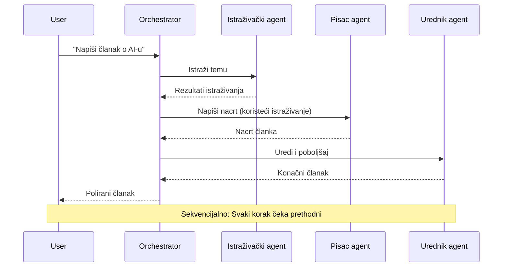
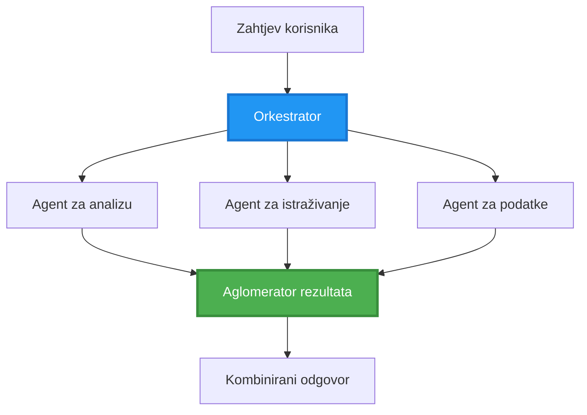
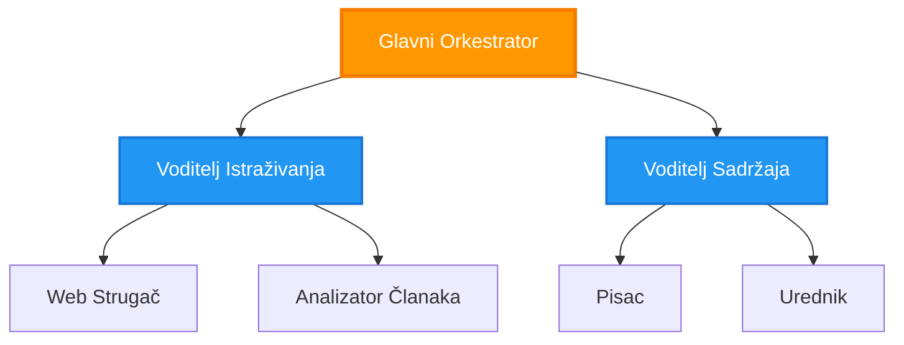
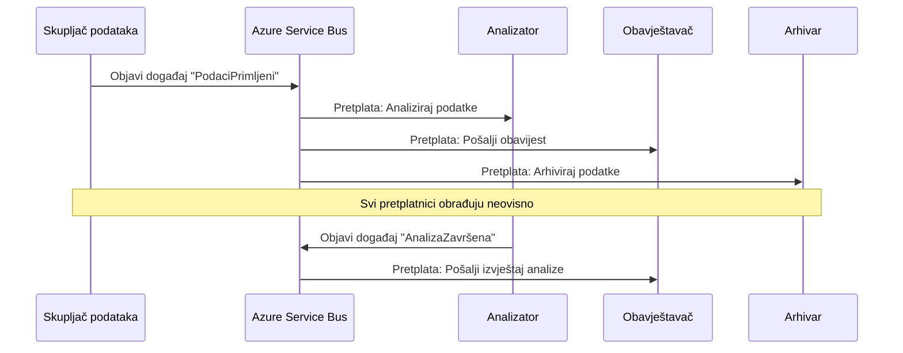
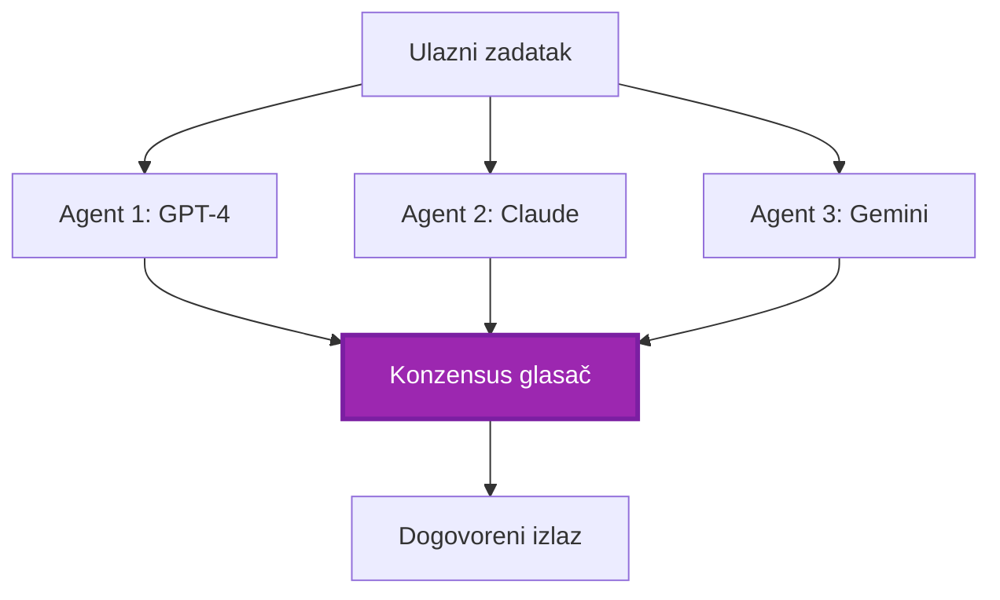
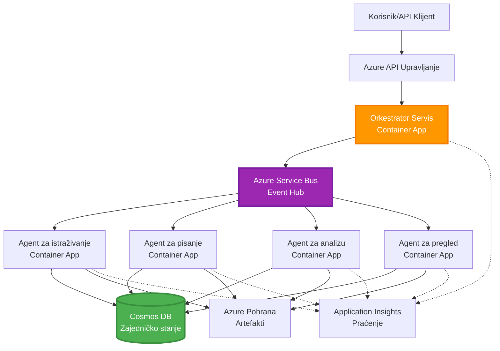

# Obrasci koordinacije više agenata

⏱️ **Procijenjeno vrijeme**: 60-75 minuta | 💰 **Procijenjeni trošak**: ~$100-300/mjesečno | ⭐ **Složenost**: Napredno

**📚 Put učenja:**
- ← Prethodno: [Planiranje kapaciteta](capacity-planning.md) - Strategije dimenzioniranja i skaliranja resursa
- 🎯 **Ovdje ste**: Obrasci koordinacije više agenata (Orkestracija, komunikacija, upravljanje stanjem)
- → Sljedeće: [Odabir SKU-a](sku-selection.md) - Odabir pravih Azure usluga
- 🏠 [Početna stranica tečaja](../../README.md)

---

## Što ćete naučiti

Završetkom ove lekcije, naučit ćete:
- Razumjeti **arhitekturu više agenata** i kada je koristiti
- Implementirati **obrasce orkestracije** (centralizirani, decentralizirani, hijerarhijski)
- Dizajnirati strategije **komunikacije agenata** (sinkrono, asinkrono, vođeno događajima)
- Upravljati **zajedničkim stanjem** među distribuiranim agentima
- Implementirati **sustave više agenata** na Azureu s AZD-om
- Primijeniti **obrasce koordinacije** za stvarne AI scenarije
- Pratiti i otklanjati pogreške u distribuiranim sustavima agenata

## Zašto je koordinacija više agenata važna

### Evolucija: Od jednog agenta do sustava više agenata

**Jedan agent (Jednostavno):**
```
User → Agent → Response
```
- ✅ Jednostavno za razumjeti i implementirati
- ✅ Brzo za jednostavne zadatke
- ❌ Ograničeno sposobnostima jednog modela
- ❌ Ne može paralelno obavljati složene zadatke
- ❌ Nema specijalizacije

**Sustav više agenata (Napredno):**
```
           ┌─────────────┐
           │ Orchestrator│
           └──────┬──────┘
        ┌─────────┼─────────┐
        │         │         │
    ┌───▼──┐  ┌──▼───┐  ┌──▼────┐
    │Agent1│  │Agent2│  │Agent3 │
    │(Plan)│  │(Code)│  │(Review)│
    └──────┘  └──────┘  └───────┘
```
- ✅ Specijalizirani agenti za određene zadatke
- ✅ Paralelno izvršavanje za brzinu
- ✅ Modularno i održivo
- ✅ Bolje za složene tijekove rada
- ⚠️ Zahtijeva logiku koordinacije

**Analogija**: Jedan agent je poput jedne osobe koja obavlja sve zadatke. Sustav više agenata je poput tima gdje svaki član ima specijalizirane vještine (istraživač, programer, recenzent, pisac) i rade zajedno.

---

## Osnovni obrasci koordinacije

### Obrazac 1: Sekvencijalna koordinacija (Lanac odgovornosti)

**Kada koristiti**: Zadaci se moraju izvršiti određenim redoslijedom, svaki agent se oslanja na izlaz prethodnog.


**Prednosti:**
- ✅ Jasno kretanje podataka
- ✅ Jednostavno za otklanjanje pogrešaka
- ✅ Predvidljiv redoslijed izvršavanja

**Ograničenja:**
- ❌ Sporije (nema paralelizma)
- ❌ Jedan neuspjeh blokira cijeli lanac
- ❌ Ne može obraditi međusobno ovisne zadatke

**Primjeri upotrebe:**
- Proces stvaranja sadržaja (istraživanje → pisanje → uređivanje → objava)
- Generiranje koda (planiranje → implementacija → testiranje → implementacija)
- Generiranje izvještaja (prikupljanje podataka → analiza → vizualizacija → sažetak)

---

### Obrazac 2: Paralelna koordinacija (Fan-Out/Fan-In)

**Kada koristiti**: Neovisni zadaci mogu se izvršavati istovremeno, rezultati se kombiniraju na kraju.


**Prednosti:**
- ✅ Brzo (paralelno izvršavanje)
- ✅ Otporno na greške (djelomični rezultati su prihvatljivi)
- ✅ Horizontalno skalabilno

**Ograničenja:**
- ⚠️ Rezultati mogu stići neuredno
- ⚠️ Potrebna logika agregacije
- ⚠️ Složenije upravljanje stanjem

**Primjeri upotrebe:**
- Prikupljanje podataka iz više izvora (API-ji + baze podataka + web scraping)
- Konkurentna analiza (više modela generira rješenja, bira se najbolje)
- Usluge prevođenja (istovremeno prevođenje na više jezika)

---

### Obrazac 3: Hijerarhijska koordinacija (Menadžer-Radnik)

**Kada koristiti**: Složeni tijekovi rada s podzadacima, potrebna delegacija.


**Prednosti:**
- ✅ Rješava složene tijekove rada
- ✅ Modularno i održivo
- ✅ Jasne granice odgovornosti

**Ograničenja:**
- ⚠️ Složenija arhitektura
- ⚠️ Veća latencija (više slojeva koordinacije)
- ⚠️ Zahtijeva sofisticiranu orkestraciju

**Primjeri upotrebe:**
- Obrada dokumenata u poduzeću (klasifikacija → usmjeravanje → obrada → arhiviranje)
- Višestupanjski podatkovni tijekovi (unos → čišćenje → transformacija → analiza → izvještavanje)
- Složeni automatizirani tijekovi rada (planiranje → dodjela resursa → izvršenje → praćenje)

---

### Obrazac 4: Koordinacija vođena događajima (Publish-Subscribe)

**Kada koristiti**: Agenti trebaju reagirati na događaje, poželjna je labava povezanost.


**Prednosti:**
- ✅ Labava povezanost između agenata
- ✅ Jednostavno dodavanje novih agenata (samo se pretplate)
- ✅ Asinkrono procesiranje
- ✅ Otporno (postojanost poruka)

**Ograničenja:**
- ⚠️ Konačna konzistentnost
- ⚠️ Složenije otklanjanje pogrešaka
- ⚠️ Izazovi s redoslijedom poruka

**Primjeri upotrebe:**
- Sustavi za praćenje u stvarnom vremenu (upozorenja, nadzorne ploče, logovi)
- Obavijesti na više kanala (e-mail, SMS, push, Slack)
- Tijekovi obrade podataka (više potrošača istih podataka)

---

### Obrazac 5: Koordinacija temeljena na konsenzusu (Glasanje/Kvorum)

**Kada koristiti**: Potrebna je suglasnost više agenata prije nastavka.


**Prednosti:**
- ✅ Veća točnost (više mišljenja)
- ✅ Otporno na greške (manjinski neuspjesi su prihvatljivi)
- ✅ Ugrađena kontrola kvalitete

**Ograničenja:**
- ❌ Skupo (više poziva modela)
- ❌ Sporije (čekanje svih agenata)
- ⚠️ Potrebno rješavanje sukoba

**Primjeri upotrebe:**
- Moderacija sadržaja (više modela pregledava sadržaj)
- Pregled koda (više lintera/analizatora)
- Medicinska dijagnoza (više AI modela, validacija stručnjaka)

---

## Pregled arhitekture

### Kompletan sustav više agenata na Azureu


**Ključne komponente:**

| Komponenta | Svrha | Azure usluga |
|------------|-------|--------------|
| **API Gateway** | Ulazna točka, ograničavanje brzine, autentifikacija | API Management |
| **Orkestrator** | Koordinira tijekove rada agenata | Container Apps |
| **Red poruka** | Asinkrona komunikacija | Service Bus / Event Hubs |
| **Agenti** | Specijalizirani AI radnici | Container Apps / Functions |
| **Spremište stanja** | Zajedničko stanje, praćenje zadataka | Cosmos DB |
| **Spremište artefakata** | Dokumenti, rezultati, logovi | Blob Storage |
| **Praćenje** | Distribuirano praćenje, logovi | Application Insights |

---

## Preduvjeti

### Potrebni alati

```bash
# Provjerite Azure Developer CLI
azd version
# ✅ Očekivano: azd verzija 1.0.0 ili novija

# Provjerite Azure CLI
az --version
# ✅ Očekivano: azure-cli 2.50.0 ili novija

# Provjerite Docker (za lokalno testiranje)
docker --version
# ✅ Očekivano: Docker verzija 20.10 ili novija
```

### Azure zahtjevi

- Aktivna Azure pretplata
- Dozvole za kreiranje:
  - Container Apps
  - Service Bus prostora imena
  - Cosmos DB računa
  - Storage računa
  - Application Insights

### Preduvjeti znanja

Trebali biste završiti:
- [Upravljanje konfiguracijom](../getting-started/configuration.md)
- [Autentifikacija i sigurnost](../getting-started/authsecurity.md)
- [Primjer mikroservisa](../../../../examples/microservices)

---

## Vodič za implementaciju

### Struktura projekta

```
multi-agent-system/
├── azure.yaml                    # AZD configuration
├── infra/
│   ├── main.bicep               # Main infrastructure
│   ├── core/
│   │   ├── servicebus.bicep     # Message queue
│   │   ├── cosmos.bicep         # State store
│   │   ├── storage.bicep        # Artifact storage
│   │   └── monitoring.bicep     # Application Insights
│   └── app/
│       ├── orchestrator.bicep   # Orchestrator service
│       └── agent.bicep          # Agent template
└── src/
    ├── orchestrator/            # Orchestration logic
    │   ├── app.py
    │   ├── workflows.py
    │   └── Dockerfile
    ├── agents/
    │   ├── research/            # Research agent
    │   ├── writer/              # Writer agent
    │   ├── analyst/             # Analyst agent
    │   └── reviewer/            # Reviewer agent
    └── shared/
        ├── state_manager.py     # Shared state logic
        └── message_handler.py   # Message handling
```

---

## Lekcija 1: Obrazac sekvencijalne koordinacije

### Implementacija: Proces stvaranja sadržaja

Izgradimo sekvencijalni tijek: Istraživanje → Pisanje → Uređivanje → Objavljivanje

### 1. AZD konfiguracija

**Datoteka: `azure.yaml`**

```yaml
name: content-pipeline
metadata:
  template: multi-agent-sequential@1.0.0

services:
  orchestrator:
    project: ./src/orchestrator
    language: python
    host: containerapp
  
  research-agent:
    project: ./src/agents/research
    language: python
    host: containerapp
  
  writer-agent:
    project: ./src/agents/writer
    language: python
    host: containerapp
  
  editor-agent:
    project: ./src/agents/editor
    language: python
    host: containerapp
```

### 2. Infrastruktura: Service Bus za koordinaciju

**Datoteka: `infra/core/servicebus.bicep`**

```bicep
param name string
param location string
param tags object = {}

resource serviceBusNamespace 'Microsoft.ServiceBus/namespaces@2022-10-01-preview' = {
  name: name
  location: location
  tags: tags
  sku: {
    name: 'Standard'
    tier: 'Standard'
  }
  properties: {
    minimumTlsVersion: '1.2'
  }
}

// Queue for orchestrator → research agent
resource researchQueue 'Microsoft.ServiceBus/namespaces/queues@2022-10-01-preview' = {
  parent: serviceBusNamespace
  name: 'research-tasks'
  properties: {
    maxDeliveryCount: 3
    lockDuration: 'PT5M'
    deadLetteringOnMessageExpiration: true
  }
}

// Queue for research agent → writer agent
resource writerQueue 'Microsoft.ServiceBus/namespaces/queues@2022-10-01-preview' = {
  parent: serviceBusNamespace
  name: 'writer-tasks'
  properties: {
    maxDeliveryCount: 3
    lockDuration: 'PT5M'
  }
}

// Queue for writer agent → editor agent
resource editorQueue 'Microsoft.ServiceBus/namespaces/queues@2022-10-01-preview' = {
  parent: serviceBusNamespace
  name: 'editor-tasks'
  properties: {
    maxDeliveryCount: 3
    lockDuration: 'PT5M'
  }
}

output namespace string = serviceBusNamespace.name
output connectionString string = listKeys('${serviceBusNamespace.id}/AuthorizationRules/RootManageSharedAccessKey', serviceBusNamespace.apiVersion).primaryConnectionString
```

### 3. Upravitelj zajedničkog stanja

**Datoteka: `src/shared/state_manager.py`**

```python
from azure.cosmos import CosmosClient, PartitionKey
from datetime import datetime
import os

class StateManager:
    """Manages shared state across agents using Cosmos DB"""
    
    def __init__(self):
        endpoint = os.environ['COSMOS_ENDPOINT']
        key = os.environ['COSMOS_KEY']
        
        self.client = CosmosClient(endpoint, key)
        self.database = self.client.get_database_client('agent-state')
        self.container = self.database.get_container_client('tasks')
    
    def create_task(self, task_id: str, task_type: str, input_data: dict):
        """Create a new task"""
        task = {
            'id': task_id,
            'type': task_type,
            'status': 'pending',
            'input': input_data,
            'created_at': datetime.utcnow().isoformat(),
            'steps': []
        }
        self.container.create_item(task)
        return task
    
    def update_task_step(self, task_id: str, step_name: str, result: dict):
        """Update task with completed step"""
        task = self.container.read_item(task_id, partition_key=task_id)
        
        task['steps'].append({
            'name': step_name,
            'completed_at': datetime.utcnow().isoformat(),
            'result': result
        })
        
        self.container.replace_item(task_id, task)
        return task
    
    def complete_task(self, task_id: str, final_result: dict):
        """Mark task as complete"""
        task = self.container.read_item(task_id, partition_key=task_id)
        task['status'] = 'completed'
        task['result'] = final_result
        task['completed_at'] = datetime.utcnow().isoformat()
        self.container.replace_item(task_id, task)
        return task
    
    def get_task(self, task_id: str):
        """Retrieve task state"""
        return self.container.read_item(task_id, partition_key=task_id)
```

### 4. Servis orkestratora

**Datoteka: `src/orchestrator/app.py`**

```python
from flask import Flask, request, jsonify
from azure.servicebus import ServiceBusClient, ServiceBusMessage
import json
import uuid
import os
from shared.state_manager import StateManager

app = Flask(__name__)
state_manager = StateManager()

# Povezivanje s Service Busom
servicebus_connection_str = os.environ['SERVICEBUS_CONNECTION_STRING']
servicebus_client = ServiceBusClient.from_connection_string(servicebus_connection_str)

@app.route('/health', methods=['GET'])
def health():
    return jsonify({'status': 'healthy', 'service': 'orchestrator'})

@app.route('/create-content', methods=['POST'])
def create_content():
    """
    Sequential workflow: Research → Write → Edit → Publish
    """
    data = request.json
    topic = data.get('topic')
    
    if not topic:
        return jsonify({'error': 'Topic required'}), 400
    
    # Kreiraj zadatak u spremištu stanja
    task_id = str(uuid.uuid4())
    task = state_manager.create_task(
        task_id=task_id,
        task_type='content_creation',
        input_data={'topic': topic}
    )
    
    # Pošalji poruku istraživačkom agentu (prvi korak)
    sender = servicebus_client.get_queue_sender('research-tasks')
    message = ServiceBusMessage(
        body=json.dumps({
            'task_id': task_id,
            'topic': topic,
            'next_queue': 'writer-tasks'  # Gdje poslati rezultate
        }),
        content_type='application/json'
    )
    
    with sender:
        sender.send_messages(message)
    
    return jsonify({
        'task_id': task_id,
        'status': 'started',
        'workflow': 'sequential',
        'steps': ['research', 'write', 'edit', 'publish'],
        'message': 'Content creation pipeline initiated'
    }), 202

@app.route('/task/<task_id>', methods=['GET'])
def get_task_status(task_id):
    """Check task status"""
    try:
        task = state_manager.get_task(task_id)
        return jsonify(task)
    except Exception as e:
        return jsonify({'error': str(e)}), 404

if __name__ == '__main__':
    app.run(host='0.0.0.0', port=8080)
```

### 5. Agent za istraživanje

**Datoteka: `src/agents/research/app.py`**

```python
from azure.servicebus import ServiceBusClient, ServiceBusMessage
from openai import AzureOpenAI
import json
import os
import time
from shared.state_manager import StateManager

# Inicijaliziraj klijente
state_manager = StateManager()
servicebus_client = ServiceBusClient.from_connection_string(
    os.environ['SERVICEBUS_CONNECTION_STRING']
)

openai_client = AzureOpenAI(
    api_key=os.environ['AZURE_OPENAI_API_KEY'],
    api_version="2024-02-01",
    azure_endpoint=os.environ['AZURE_OPENAI_ENDPOINT']
)

def process_research_task(message_data):
    """Process research request and pass to writer"""
    task_id = message_data['task_id']
    topic = message_data['topic']
    next_queue = message_data['next_queue']
    
    print(f"🔬 Researching: {topic}")
    
    # Pozovi Azure OpenAI za istraživanje
    response = openai_client.chat.completions.create(
        model="gpt-4",
        messages=[
            {"role": "system", "content": "You are a research assistant. Provide comprehensive research on the given topic."},
            {"role": "user", "content": f"Research this topic thoroughly: {topic}"}
        ],
        max_tokens=1500
    )
    
    research_results = response.choices[0].message.content
    
    # Ažuriraj stanje
    state_manager.update_task_step(
        task_id=task_id,
        step_name='research',
        result={'research': research_results}
    )
    
    # Pošalji sljedećem agentu (piscu)
    sender = servicebus_client.get_queue_sender(next_queue)
    message = ServiceBusMessage(
        body=json.dumps({
            'task_id': task_id,
            'topic': topic,
            'research': research_results,
            'next_queue': 'editor-tasks'
        }),
        content_type='application/json'
    )
    
    with sender:
        sender.send_messages(message)
    
    print(f"✅ Research complete for task {task_id}")

def main():
    """Listen to research queue"""
    receiver = servicebus_client.get_queue_receiver('research-tasks')
    
    print("🔬 Research Agent started, listening for tasks...")
    
    with receiver:
        while True:
            messages = receiver.receive_messages(max_wait_time=5)
            for message in messages:
                try:
                    message_data = json.loads(str(message))
                    process_research_task(message_data)
                    receiver.complete_message(message)
                except Exception as e:
                    print(f"❌ Error processing message: {e}")
                    receiver.abandon_message(message)

if __name__ == '__main__':
    main()
```

### 6. Agent za pisanje

**Datoteka: `src/agents/writer/app.py`**

```python
from azure.servicebus import ServiceBusClient, ServiceBusMessage
from openai import AzureOpenAI
import json
import os
from shared.state_manager import StateManager

state_manager = StateManager()
servicebus_client = ServiceBusClient.from_connection_string(
    os.environ['SERVICEBUS_CONNECTION_STRING']
)

openai_client = AzureOpenAI(
    api_key=os.environ['AZURE_OPENAI_API_KEY'],
    api_version="2024-02-01",
    azure_endpoint=os.environ['AZURE_OPENAI_ENDPOINT']
)

def process_writing_task(message_data):
    """Write article based on research"""
    task_id = message_data['task_id']
    topic = message_data['topic']
    research = message_data['research']
    next_queue = message_data['next_queue']
    
    print(f"✍️ Writing article: {topic}")
    
    # Pozovi Azure OpenAI za pisanje članka
    response = openai_client.chat.completions.create(
        model="gpt-4",
        messages=[
            {"role": "system", "content": "You are a professional writer. Write engaging, well-structured articles."},
            {"role": "user", "content": f"Based on this research:\n\n{research}\n\nWrite a comprehensive article about: {topic}"}
        ],
        max_tokens=2000
    )
    
    article_draft = response.choices[0].message.content
    
    # Ažuriraj stanje
    state_manager.update_task_step(
        task_id=task_id,
        step_name='writing',
        result={'draft': article_draft}
    )
    
    # Pošalji uredniku
    sender = servicebus_client.get_queue_sender(next_queue)
    message = ServiceBusMessage(
        body=json.dumps({
            'task_id': task_id,
            'topic': topic,
            'draft': article_draft
        }),
        content_type='application/json'
    )
    
    with sender:
        sender.send_messages(message)
    
    print(f"✅ Article draft complete for task {task_id}")

def main():
    """Listen to writer queue"""
    receiver = servicebus_client.get_queue_receiver('writer-tasks')
    
    print("✍️ Writer Agent started, listening for tasks...")
    
    with receiver:
        while True:
            messages = receiver.receive_messages(max_wait_time=5)
            for message in messages:
                try:
                    message_data = json.loads(str(message))
                    process_writing_task(message_data)
                    receiver.complete_message(message)
                except Exception as e:
                    print(f"❌ Error: {e}")
                    receiver.abandon_message(message)

if __name__ == '__main__':
    main()
```

### 7. Agent za uređivanje

**Datoteka: `src/agents/editor/app.py`**

```python
from azure.servicebus import ServiceBusClient
from openai import AzureOpenAI
import json
import os
from shared.state_manager import StateManager

state_manager = StateManager()
servicebus_client = ServiceBusClient.from_connection_string(
    os.environ['SERVICEBUS_CONNECTION_STRING']
)

openai_client = AzureOpenAI(
    api_key=os.environ['AZURE_OPENAI_API_KEY'],
    api_version="2024-02-01",
    azure_endpoint=os.environ['AZURE_OPENAI_ENDPOINT']
)

def process_editing_task(message_data):
    """Edit and finalize article"""
    task_id = message_data['task_id']
    topic = message_data['topic']
    draft = message_data['draft']
    
    print(f"📝 Editing article: {topic}")
    
    # Pozovi Azure OpenAI za uređivanje
    response = openai_client.chat.completions.create(
        model="gpt-4",
        messages=[
            {"role": "system", "content": "You are an expert editor. Improve grammar, clarity, and structure."},
            {"role": "user", "content": f"Edit and improve this article:\n\n{draft}"}
        ],
        max_tokens=2000
    )
    
    final_article = response.choices[0].message.content
    
    # Označi zadatak kao dovršen
    state_manager.complete_task(
        task_id=task_id,
        final_result={
            'topic': topic,
            'final_article': final_article,
            'word_count': len(final_article.split())
        }
    )
    
    print(f"✅ Article finalized for task {task_id}")

def main():
    """Listen to editor queue"""
    receiver = servicebus_client.get_queue_receiver('editor-tasks')
    
    print("📝 Editor Agent started, listening for tasks...")
    
    with receiver:
        while True:
            messages = receiver.receive_messages(max_wait_time=5)
            for message in messages:
                try:
                    message_data = json.loads(str(message))
                    process_editing_task(message_data)
                    receiver.complete_message(message)
                except Exception as e:
                    print(f"❌ Error: {e}")
                    receiver.abandon_message(message)

if __name__ == '__main__':
    main()
```

### 8. Implementacija i testiranje

```bash
# Inicijaliziraj i implementiraj
azd init
azd up

# Dohvati URL orkestratora
ORCHESTRATOR_URL=$(azd env get-values | grep ORCHESTRATOR_URL | cut -d '=' -f2 | tr -d '"')

# Kreiraj sadržaj
curl -X POST $ORCHESTRATOR_URL/create-content \
  -H "Content-Type: application/json" \
  -d '{"topic": "The Future of AI in Healthcare"}'
```

**✅ Očekivani izlaz:**
```json
{
  "task_id": "a1b2c3d4-e5f6-7890-abcd-ef1234567890",
  "status": "started",
  "workflow": "sequential",
  "steps": ["research", "write", "edit", "publish"],
  "message": "Content creation pipeline initiated"
}
```

**Provjera napretka zadatka:**
```bash
TASK_ID="a1b2c3d4-e5f6-7890-abcd-ef1234567890"
curl $ORCHESTRATOR_URL/task/$TASK_ID
```

**✅ Očekivani izlaz (završeno):**
```json
{
  "id": "a1b2c3d4-e5f6-7890-abcd-ef1234567890",
  "type": "content_creation",
  "status": "completed",
  "steps": [
    {
      "name": "research",
      "completed_at": "2025-11-19T10:30:00Z",
      "result": {"research": "..."}
    },
    {
      "name": "writing",
      "completed_at": "2025-11-19T10:32:00Z",
      "result": {"draft": "..."}
    }
  ],
  "result": {
    "topic": "The Future of AI in Healthcare",
    "final_article": "...",
    "word_count": 1500
  }
}
```

---

## Lekcija 2: Obrazac paralelne koordinacije

### Implementacija: Agregator za istraživanje iz više izvora

Izgradimo paralelni sustav koji istovremeno prikuplja informacije iz više izvora.

### Paralelni orkestrator

**Datoteka: `src/orchestrator/parallel_workflow.py`**

```python
from flask import Flask, request, jsonify
from azure.servicebus import ServiceBusClient, ServiceBusMessage
import json
import uuid
import os
from shared.state_manager import StateManager

app = Flask(__name__)
state_manager = StateManager()

servicebus_client = ServiceBusClient.from_connection_string(
    os.environ['SERVICEBUS_CONNECTION_STRING']
)

@app.route('/research-parallel', methods=['POST'])
def research_parallel():
    """
    Parallel workflow: Multiple agents work simultaneously
    """
    data = request.json
    query = data.get('query')
    
    task_id = str(uuid.uuid4())
    task = state_manager.create_task(
        task_id=task_id,
        task_type='parallel_research',
        input_data={
            'query': query,
            'agents': ['web', 'academic', 'news', 'social']
        }
    )
    
    # Fan-out: Pošalji svim agentima istovremeno
    agents = [
        ('web-research-queue', 'web'),
        ('academic-research-queue', 'academic'),
        ('news-research-queue', 'news'),
        ('social-research-queue', 'social')
    ]
    
    for queue_name, agent_type in agents:
        sender = servicebus_client.get_queue_sender(queue_name)
        message = ServiceBusMessage(
            body=json.dumps({
                'task_id': task_id,
                'query': query,
                'agent_type': agent_type,
                'result_queue': 'aggregation-queue'
            }),
            content_type='application/json'
        )
        
        with sender:
            sender.send_messages(message)
    
    return jsonify({
        'task_id': task_id,
        'status': 'started',
        'workflow': 'parallel',
        'agents_dispatched': 4,
        'message': 'Parallel research initiated'
    }), 202

if __name__ == '__main__':
    app.run(host='0.0.0.0', port=8080)
```

### Logika agregacije

**Datoteka: `src/agents/aggregator/app.py`**

```python
from azure.servicebus import ServiceBusClient
import json
import os
from collections import defaultdict
from shared.state_manager import StateManager

state_manager = StateManager()
servicebus_client = ServiceBusClient.from_connection_string(
    os.environ['SERVICEBUS_CONNECTION_STRING']
)

# Pratiti rezultate po zadatku
task_results = defaultdict(list)
expected_agents = 4  # web, akademski, vijesti, društveno

def process_result(message_data):
    """Aggregate results from parallel agents"""
    task_id = message_data['task_id']
    agent_type = message_data['agent_type']
    result = message_data['result']
    
    # Pohraniti rezultat
    task_results[task_id].append({
        'agent': agent_type,
        'data': result
    })
    
    print(f"📊 Received result from {agent_type} agent ({len(task_results[task_id])}/{expected_agents})")
    
    # Provjeriti jesu li svi agenti završili (fan-in)
    if len(task_results[task_id]) == expected_agents:
        print(f"✅ All agents completed for task {task_id}. Aggregating...")
        
        # Kombinirati rezultate
        aggregated = {
            'query': message_data['query'],
            'sources': task_results[task_id],
            'summary': generate_summary(task_results[task_id])
        }
        
        # Označiti kao završeno
        state_manager.complete_task(task_id, aggregated)
        
        # Očistiti
        del task_results[task_id]
        
        print(f"✅ Aggregation complete for task {task_id}")

def generate_summary(results):
    """Generate summary from all sources"""
    summaries = [r['data'].get('summary', '') for r in results]
    return '\n\n'.join(summaries)

def main():
    """Listen to aggregation queue"""
    receiver = servicebus_client.get_queue_receiver('aggregation-queue')
    
    print("📊 Aggregator started, listening for results...")
    
    with receiver:
        while True:
            messages = receiver.receive_messages(max_wait_time=5)
            for message in messages:
                try:
                    message_data = json.loads(str(message))
                    process_result(message_data)
                    receiver.complete_message(message)
                except Exception as e:
                    print(f"❌ Error: {e}")
                    receiver.abandon_message(message)

if __name__ == '__main__':
    main()
```

**Prednosti paralelnog obrasca:**
- ⚡ **4x brže** (agenti rade istovremeno)
- 🔄 **Otporno na greške** (djelomični rezultati su prihvatljivi)
- 📈 **Skalabilno** (jednostavno dodavanje više agenata)

---

## Praktične vježbe

### Vježba 1: Dodavanje logike za vremensko ograničenje ⭐⭐ (Srednje)

**Cilj**: Implementirati logiku vremenskog ograničenja kako agregator ne bi čekao zauvijek na spore agente.

**Koraci**:

1. **Dodajte praćenje vremenskog ograničenja u agregator:**

```python
from datetime import datetime, timedelta

task_timeouts = {}  # task_id -> vrijeme_isteka

def process_result(message_data):
    task_id = message_data['task_id']
    
    # Postavite vremensko ograničenje na prvi rezultat
    if task_id not in task_timeouts:
        task_timeouts[task_id] = datetime.utcnow() + timedelta(seconds=30)
    
    task_results[task_id].append({
        'agent': message_data['agent_type'],
        'data': message_data['result']
    })
    
    # Provjerite je li dovršeno ILI isteklo vrijeme
    if len(task_results[task_id]) == expected_agents or \
       datetime.utcnow() > task_timeouts[task_id]:
        
        print(f"📊 Aggregating with {len(task_results[task_id])}/{expected_agents} results")
        
        aggregated = {
            'query': message_data['query'],
            'sources': task_results[task_id],
            'completed_agents': len(task_results[task_id]),
            'timed_out': len(task_results[task_id]) < expected_agents
        }
        
        state_manager.complete_task(task_id, aggregated)
        
        # Čišćenje
        del task_results[task_id]
        del task_timeouts[task_id]
```

2. **Testirajte s umjetnim kašnjenjima:**

```python
# U jednom agentu dodajte kašnjenje za simulaciju sporog procesiranja
import time
time.sleep(35)  # Prekoračuje vremensko ograničenje od 30 sekundi
```

3. **Implementirajte i provjerite:**

```bash
azd deploy aggregator

# Predaj zadatak
curl -X POST $ORCHESTRATOR_URL/research-parallel \
  -H "Content-Type: application/json" \
  -d '{"query": "AI safety research"}'

# Provjeri rezultate nakon 30 sekundi
curl $ORCHESTRATOR_URL/task/$TASK_ID
```

**✅ Kriteriji uspjeha:**
- ✅ Zadatak se završava nakon 30 sekundi čak i ako agenti nisu završili
- ✅ Odgovor ukazuje na djelomične rezultate (`"timed_out": true`)
- ✅ Dostupni rezultati se vraćaju (3 od 4 agenta)

**Vrijeme**: 20-25 minuta

---

### Vježba 2: Implementacija logike ponovnog pokušaja ⭐⭐⭐ (Napredno)

**Cilj**: Automatski ponovno pokušati zadatke agenata koji su neuspjeli prije odustajanja.

**Koraci**:

1. **Dodajte praćenje ponovnih pokušaja u orkestrator:**

```python
from dataclasses import dataclass
from typing import Dict

@dataclass
class RetryConfig:
    max_retries: int = 3
    backoff_seconds: int = 5

retry_counts: Dict[str, int] = {}  # message_id -> broj_ponavljanja

def send_with_retry(queue_name: str, message_data: dict, retry_config: RetryConfig):
    """Send message with retry metadata"""
    message_id = message_data.get('message_id', str(uuid.uuid4()))
    message_data['message_id'] = message_id
    message_data['retry_count'] = retry_counts.get(message_id, 0)
    message_data['max_retries'] = retry_config.max_retries
    
    sender = servicebus_client.get_queue_sender(queue_name)
    message = ServiceBusMessage(
        body=json.dumps(message_data),
        content_type='application/json',
        message_id=message_id
    )
    
    with sender:
        sender.send_messages(message)
```

2. **Dodajte rukovatelj za ponovne pokušaje u agente:**

```python
def process_with_retry(message, receiver, process_func):
    """Process message with automatic retry on failure"""
    try:
        message_data = json.loads(str(message))
        
        # Obradi poruku
        process_func(message_data)
        
        # Uspjeh - dovršeno
        receiver.complete_message(message)
        
    except Exception as e:
        message_id = message.message_id
        retry_count = message_data.get('retry_count', 0)
        max_retries = message_data.get('max_retries', 3)
        
        if retry_count < max_retries:
            # Pokušaj ponovo: odustani i ponovno stavi u red s povećanim brojem
            print(f"⚠️ Retry {retry_count + 1}/{max_retries} for message {message_id}")
            
            message_data['retry_count'] = retry_count + 1
            
            # Pošalji natrag u isti red s odgodom
            time.sleep(5 * (retry_count + 1))  # Eksponencijalno povlačenje
            send_with_retry(queue_name, message_data, RetryConfig())
            
            receiver.complete_message(message)  # Ukloni original
        else:
            # Maksimalan broj pokušaja premašen - premjesti u red za neisporučene poruke
            print(f"❌ Max retries exceeded for message {message_id}")
            receiver.dead_letter_message(
                message,
                reason="MaxRetriesExceeded",
                error_description=str(e)
            )
```

3. **Pratite red za neuspjele poruke:**

```python
def monitor_dead_letters():
    """Check dead letter queue for failed messages"""
    receiver = servicebus_client.get_queue_receiver(
        'research-queue',
        sub_queue='deadletter'
    )
    
    with receiver:
        messages = receiver.receive_messages(max_wait_time=5)
        for message in messages:
            print(f"☠️ Dead letter: {message.message_id}")
            print(f"Reason: {message.dead_letter_reason}")
            print(f"Description: {message.dead_letter_error_description}")
```

**✅ Kriteriji uspjeha:**
- ✅ Neuspjeli zadaci se automatski ponovno pokušavaju (do 3 puta)
- ✅ Eksponencijalno povećanje vremena između pokušaja (5s, 10s, 15s)
- ✅ Nakon maksimalnog broja pokušaja, poruke idu u red za neuspjele poruke
- ✅ Red za neuspjele poruke može se pratiti i ponovno obraditi

**Vrijeme**: 30-40 minuta

---

### Vježba 3: Implementacija prekidača kruga ⭐⭐⭐ (Napredno)

**Cilj**: Spriječiti kaskadne neuspjehe zaustavljanjem zahtjeva prema neuspjelim agentima.

**Koraci**:

1. **Kreirajte klasu prekidača kruga:**

```python
from enum import Enum
from datetime import datetime, timedelta

class CircuitState(Enum):
    CLOSED = "closed"      # Normalan rad
    OPEN = "open"          # Neuspjeh, odbij zahtjeve
    HALF_OPEN = "half_open"  # Testiranje je li se oporavio

class CircuitBreaker:
    def __init__(self, failure_threshold=5, timeout_seconds=60):
        self.failure_threshold = failure_threshold
        self.timeout_seconds = timeout_seconds
        self.failure_count = 0
        self.last_failure_time = None
        self.state = CircuitState.CLOSED
    
    def call(self, func):
        """Execute function with circuit breaker protection"""
        if self.state == CircuitState.OPEN:
            # Provjeri je li vrijeme isteklo
            if datetime.utcnow() - self.last_failure_time > timedelta(seconds=self.timeout_seconds):
                self.state = CircuitState.HALF_OPEN
                print("🔄 Circuit breaker: HALF_OPEN (testing)")
            else:
                raise Exception(f"Circuit breaker OPEN for agent. Try again in {self.timeout_seconds}s")
        
        try:
            result = func()
            
            # Uspjeh
            if self.state == CircuitState.HALF_OPEN:
                self.state = CircuitState.CLOSED
                self.failure_count = 0
                print("✅ Circuit breaker: CLOSED (recovered)")
            
            return result
            
        except Exception as e:
            self.failure_count += 1
            self.last_failure_time = datetime.utcnow()
            
            if self.failure_count >= self.failure_threshold:
                self.state = CircuitState.OPEN
                print(f"🔴 Circuit breaker: OPEN (too many failures)")
            
            raise e
```

2. **Primijenite na pozive agenata:**

```python
# U orkestratoru
agent_circuits = {
    'web': CircuitBreaker(failure_threshold=5, timeout_seconds=60),
    'academic': CircuitBreaker(failure_threshold=5, timeout_seconds=60),
    'news': CircuitBreaker(failure_threshold=5, timeout_seconds=60),
    'social': CircuitBreaker(failure_threshold=5, timeout_seconds=60)
}

def send_to_agent(agent_type, message_data):
    """Send with circuit breaker protection"""
    circuit = agent_circuits[agent_type]
    
    try:
        circuit.call(lambda: send_message(agent_type, message_data))
    except Exception as e:
        print(f"⚠️ Skipping {agent_type} agent: {e}")
        # Nastavi s drugim agentima
```

3. **Testirajte prekidač kruga:**

```bash
# Simuliraj ponovljene neuspjehe (zaustavi jednog agenta)
az containerapp stop --name web-research-agent --resource-group rg-agents

# Pošalji više zahtjeva
for i in {1..10}; do
  curl -X POST $ORCHESTRATOR_URL/research-parallel \
    -H "Content-Type: application/json" \
    -d '{"query": "test query '$i'"}'
  sleep 2
done

# Provjeri logove - trebali biste vidjeti da je krug otvoren nakon 5 neuspjeha
azd logs orchestrator --tail 50
```

**✅ Kriteriji uspjeha:**
- ✅ Nakon 5 neuspjeha, prekidač se otvara (odbija zahtjeve)
- ✅ Nakon 60 sekundi, prekidač prelazi u poluotvoreno stanje (testira oporavak)
- ✅ Ostali agenti nastavljaju normalno raditi
- ✅ Prekidač se automatski zatvara kada se agent oporavi

**Vrijeme**: 40-50 minuta

---

## Praćenje i otklanjanje pogrešaka

### Distribuirano praćenje s Application Insights

**Datoteka: `src/shared/tracing.py`**

```python
from opencensus.ext.azure.log_exporter import AzureLogHandler
from opencensus.ext.azure.trace_exporter import AzureExporter
from opencensus.trace import config_integration
from opencensus.trace.tracer import Tracer
from opencensus.trace.samplers import AlwaysOnSampler
import logging
import os

# Konfiguriraj praćenje
config_integration.trace_integrations(['requests', 'logging'])

connection_string = os.environ.get('APPLICATIONINSIGHTS_CONNECTION_STRING')

# Kreiraj tragač
tracer = Tracer(
    exporter=AzureExporter(connection_string=connection_string),
    sampler=AlwaysOnSampler()
)

# Konfiguriraj zapisivanje
logger = logging.getLogger(__name__)
logger.addHandler(AzureLogHandler(connection_string=connection_string))
logger.setLevel(logging.INFO)

def trace_agent_call(agent_name, task_id, operation):
    """Trace agent operations"""
    with tracer.span(name=f'{agent_name}.{operation}') as span:
        span.add_attribute('agent', agent_name)
        span.add_attribute('task_id', task_id)
        span.add_attribute('operation', operation)
        
        try:
            result = operation()
            span.add_attribute('status', 'success')
            return result
        except Exception as e:
            span.add_attribute('status', 'error')
            span.add_attribute('error', str(e))
            raise
```

### Upiti za Application Insights

**Praćenje tijekova rada više agenata:**

```kusto
// Trace complete workflow for a task
traces
| where customDimensions.task_id == "a1b2c3d4-..."
| project timestamp, message, customDimensions.agent, customDimensions.operation
| order by timestamp asc
```

**Usporedba performansi agenata:**

```kusto
// Compare agent execution times
dependencies
| where name contains "agent"
| summarize 
    avg_duration = avg(duration),
    p95_duration = percentile(duration, 95),
    count = count()
  by agent = tostring(customDimensions.agent)
| order by avg_duration desc
```

**Analiza neuspjeha:**

```kusto
// Find which agents fail most
exceptions
| where customDimensions.agent != ""
| summarize 
    failure_count = count(),
    unique_errors = dcount(outerMessage)
  by agent = tostring(customDimensions.agent)
| order by failure_count desc
```

---

## Analiza troškova

### Troškovi sustava više agenata (mjesečne procjene)

| Komponenta | Konfiguracija | Trošak |
|------------|---------------|--------|
| **Orkestrator** | 1 Container App (1 vCPU, 2GB) | $30-50 |
| **4 Agenta** | 4 Container Apps (0.5 vCPU, 1GB svaki) | $60-120 |
| **Service Bus** | Standardni nivo, 10M poruka | $10-20 |
| **Cosmos DB** | Serverless, 5GB prostora, 1M RUs | $25-50 |
| **Blob Storage** | 10GB prostora, 100K operacija | $5-10 |
| **Application Insights** | 5GB unosa | $10-15 |
| **Azure OpenAI** | GPT-4, 10M tokena | $100-300 |
| **Ukupno** | | **$240-565/mjesečno** |

### Strategije optimizacije troškova

1. **Koristite serverless gdje je moguće:**
   ```bicep
   // Cosmos DB serverless (no minimum cost)
   properties: {
     databaseAccountOfferType: 'Standard'
     capabilities: [{ name: 'EnableServerless' }]
   }
   ```

2. **Skalirajte agente na nulu kada su neaktivni:**
   ```bicep
   scale: {
     minReplicas: 0  // Scale to zero when no messages
     maxReplicas: 10
   }
   ```

3. **Koristite grupiranje za Service Bus:**
   ```python
   # Pošaljite poruke u serijama (jeftinije)
   sender.send_messages([message1, message2, message3])
   ```

4. **Keširajte često korištene rezultate:**
   ```python
   # Koristite Azure Cache za Redis
   if cache.exists(query_hash):
       return cache.get(query_hash)
   ```

---

## Najbolje prakse

### ✅ RADITI:

1. **Koristite idempotentne operacije**
   ```python
   # Agent može sigurno obraditi istu poruku više puta
   def process_task(task_id):
       if state_manager.task_exists(task_id):
           print(f"Task {task_id} already processed, skipping")
           return
       # Obrada zadatka...
   ```

2. **Implementirajte sveobuhvatno logiranje**
   ```python
   logger.info(f"Agent: {agent_name}, Task: {task_id}, Action: {action}")
   ```

3. **Koristite ID-ove za korelaciju**
   ```python
   # Proslijedi task_id kroz cijeli tijek rada
   message_data = {
       'task_id': task_id,  # ID korelacije
       'timestamp': datetime.utcnow().isoformat()
   }
   ```

4. **Postavite TTL (vrijeme trajanja) poruka**
   ```bicep
   properties: {
     defaultMessageTimeToLive: 'PT1H'  // 1 hour max
   }
   ```

5. **Pratite redove za neuspjele poruke**
   ```python
   # Redovito praćenje neuspjelih poruka
   monitor_dead_letters()
   ```

### ❌ NE RADITI:

1. **Nemojte stvarati kružne ovisnosti**
   ```python
   # ❌ LOŠE: Agent A → Agent B → Agent A (beskonačna petlja)
   # ✅ DOBRO: Definirajte jasan usmjeren aciklički graf (DAG)
   ```

2. **Nemojte blokirati niti agenata**
   ```python
   # ❌ LOŠE: Sinkrono čekanje
   while not task_complete:
       time.sleep(1)
   
   # ✅ DOBRO: Koristite povratne pozive reda poruka
   ```

3. **Nemojte ignorirati djelomične neuspjehe**
   ```python
   # ❌ LOŠE: Neuspjeh cijelog tijeka rada ako jedan agent ne uspije
   # ✅ DOBRO: Vratite djelomične rezultate s pokazateljima pogreške
   ```

4. **Nemojte koristiti beskonačne ponovne pokušaje**
   ```python
   # ❌ LOŠE: pokušavaj zauvijek
   # ✅ DOBRO: max_retries = 3, zatim mrtvo slovo
   ```

---
## Vodič za rješavanje problema

### Problem: Poruke zaglavljene u redu

**Simptomi:**
- Poruke se gomilaju u redu
- Agenti ne obrađuju
- Status zadatka ostaje na "na čekanju"

**Dijagnoza:**
```bash
# Provjeri dubinu reda čekanja
az servicebus queue show \
  --namespace-name mybus \
  --name research-tasks \
  --query "countDetails"

# Provjeri stanje agenta
azd logs research-agent --tail 50
```

**Rješenja:**

1. **Povećajte broj replika agenata:**
   ```bash
   az containerapp update \
     --name research-agent \
     --min-replicas 3 \
     --max-replicas 10
   ```

2. **Provjerite red za neuspjele poruke:**
   ```bash
   az servicebus queue show \
     --namespace-name mybus \
     --name research-tasks \
     --query "countDetails.deadLetterMessageCount"
   ```

---

### Problem: Zadatak istječe ili se nikad ne dovrši

**Simptomi:**
- Status zadatka ostaje "u tijeku"
- Neki agenti završe, drugi ne
- Nema poruka o grešci

**Dijagnoza:**
```bash
# Provjeri stanje zadatka
curl $ORCHESTRATOR_URL/task/$TASK_ID

# Provjeri Application Insights
# Pokreni upit: traces | where customDimensions.task_id == "..."
```

**Rješenja:**

1. **Implementirajte vremensko ograničenje u agregatoru (Vježba 1)**

2. **Provjerite neuspjehe agenata:**
   ```bash
   azd logs --follow | grep "ERROR\|FAIL"
   ```

3. **Provjerite rade li svi agenti:**
   ```bash
   az containerapp list \
     --resource-group rg-agents \
     --query "[].{name:name, status:properties.runningStatus}"
   ```

---

## Saznajte više

### Službena dokumentacija
- [Azure Service Bus](https://learn.microsoft.com/azure/service-bus-messaging/service-bus-messaging-overview)
- [Cosmos DB](https://learn.microsoft.com/azure/cosmos-db/introduction)
- [Container Apps DAPR](https://learn.microsoft.com/azure/container-apps/dapr-overview)
- [Višeagentski dizajnerski obrasci](https://learn.microsoft.com/azure/architecture/guide/ai/multi-agent-systems)

### Sljedeći koraci u ovom tečaju
- ← Prethodno: [Planiranje kapaciteta](capacity-planning.md)
- → Sljedeće: [Odabir SKU-a](sku-selection.md)
- 🏠 [Početna stranica tečaja](../../README.md)

### Povezani primjeri
- [Primjer mikroservisa](../../../../examples/microservices) - Obrasci komunikacije servisa
- [Primjer Azure OpenAI](../../../../examples/azure-openai-chat) - Integracija umjetne inteligencije

---

## Sažetak

**Naučili ste:**
- ✅ Pet obrazaca koordinacije (sekvencijalni, paralelni, hijerarhijski, vođen događajima, konsenzus)
- ✅ Višeagentsku arhitekturu na Azureu (Service Bus, Cosmos DB, Container Apps)
- ✅ Upravljanje stanjem među distribuiranim agentima
- ✅ Rukovanje vremenskim ograničenjima, ponovnim pokušajima i prekidačima
- ✅ Praćenje i otklanjanje pogrešaka u distribuiranim sustavima
- ✅ Strategije optimizacije troškova

**Ključne točke:**
1. **Odaberite pravi obrazac** - Sekvencijalni za uređene tijekove rada, paralelni za brzinu, vođen događajima za fleksibilnost
2. **Pažljivo upravljajte stanjem** - Koristite Cosmos DB ili slično za zajedničko stanje
3. **Rukujte neuspjesima pažljivo** - Vremenska ograničenja, ponovni pokušaji, prekidači, redovi za neuspjele poruke
4. **Pratite sve** - Distribuirano praćenje je ključno za otklanjanje pogrešaka
5. **Optimizirajte troškove** - Skalirajte na nulu, koristite serverless, implementirajte predmemoriranje

**Sljedeći koraci:**
1. Dovršite praktične vježbe
2. Izgradite višeagentski sustav za svoj slučaj upotrebe
3. Proučite [Odabir SKU-a](sku-selection.md) za optimizaciju performansi i troškova

---

<!-- CO-OP TRANSLATOR DISCLAIMER START -->
**Odricanje od odgovornosti**:  
Ovaj dokument je preveden pomoću AI usluge za prevođenje [Co-op Translator](https://github.com/Azure/co-op-translator). Iako nastojimo osigurati točnost, imajte na umu da automatski prijevodi mogu sadržavati pogreške ili netočnosti. Izvorni dokument na izvornom jeziku treba smatrati autoritativnim izvorom. Za ključne informacije preporučuje se profesionalni prijevod od strane čovjeka. Ne preuzimamo odgovornost za nesporazume ili pogrešna tumačenja koja proizlaze iz korištenja ovog prijevoda.
<!-- CO-OP TRANSLATOR DISCLAIMER END -->