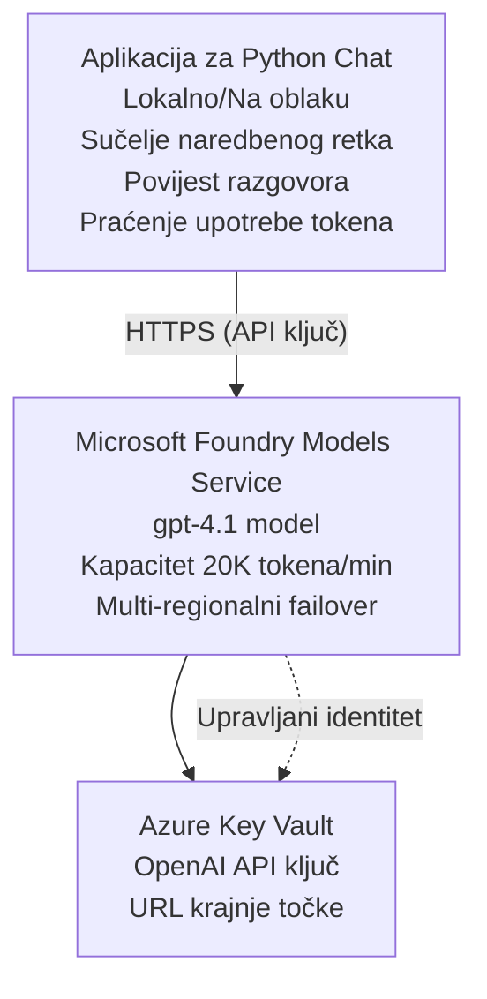

# Microsoft Foundry Models Chat aplikacija

**Put učenja:** Srednja razina ⭐⭐ | **Vrijeme:** 35-45 minuta | **Trošak:** 50-200 $/mjesec

Potpuna Microsoft Foundry Models chat aplikacija implementirana pomoću Azure Developer CLI (azd). Ovaj primjer prikazuje implementaciju gpt-4.1, sigurni pristup API-ju i jednostavno chat sučelje.

## 🎯 Što ćete naučiti

- Implementirati Microsoft Foundry Models servis s modelom gpt-4.1  
- Sigurno čuvati OpenAI API ključeve pomoću Key Vaulta  
- Izgraditi jednostavno chat sučelje u Pythonu  
- Pratiti potrošnju tokena i troškove  
- Implementirati ograničenje brzine i obradu pogrešaka  

## 📦 Što je uključeno

✅ **Microsoft Foundry Models servis** - implementacija modela gpt-4.1  
✅ **Python Chat aplikacija** - Jednostavno chat sučelje u komandnoj liniji  
✅ **Integracija s Key Vaultom** - Sigurno spremanje API ključeva  
✅ **ARM predlošci** - Potpuna infrastruktura kao kod  
✅ **Praćenje troškova** - Evidencija potrošnje tokena  
✅ **Ograničenje brzine** - Sprječavanje iscrpljivanja kvote  

## Arhitektura


## Preduvjeti

### Potrebno

- **Azure Developer CLI (azd)** - [Upute za instalaciju](https://learn.microsoft.com/azure/developer/azure-developer-cli/install-azd)  
- **Azure pretplata** s pristupom OpenAI-ju - [Zatraži pristup](https://aka.ms/oai/access)  
- **Python 3.9+** - [Instaliraj Python](https://www.python.org/downloads/)  

### Provjera preduvjeta

```bash
# Provjerite verziju azd (potrebno 1.5.0 ili više)
azd version

# Provjerite Azure prijavu
azd auth login

# Provjerite verziju Pythona
python --version  # ili python3 --version

# Provjerite pristup OpenAI-u (provjerite u Azure Portalu)
az cognitiveservices account list-skus \
  --kind OpenAI \
  --location eastus
```

> **⚠️ Važno:** Microsoft Foundry Models zahtijeva odobrenje aplikacije. Ako niste podnijeli zahtjev, posjetite [aka.ms/oai/access](https://aka.ms/oai/access). Odobrenje obično traje 1-2 radna dana.

## ⏱️ Vremenski plan implementacije

| Faza | Trajanje | Što se događa |
|-------|----------|--------------|
| Provjera preduvjeta | 2-3 minute | Provjera dostupnosti OpenAI kvote |
| Implementacija infrastrukture | 8-12 minuta | Kreiranje OpenAI servisa, Key Vaulta, model implementacije |
| Konfiguracija aplikacije | 2-3 minute | Postavljanje okruženja i ovisnosti |
| **Ukupno** | **12-18 minuta** | Spremno za chat s gpt-4.1 |

**Napomena:** Prva implementacija OpenAI-ja može trajati dulje zbog provisioniranja modela.

## Brzi početak

```bash
# Navigirajte do primjera
cd examples/azure-openai-chat

# Inicijalizirajte okruženje
azd env new myopenai

# Postavite sve (infrastruktura + konfiguracija)
azd up
# Bit ćete upitani da:
# 1. Odaberete Azure pretplatu
# 2. Izaberete lokaciju s dostupnošću OpenAI (npr. eastus, eastus2, westus)
# 3. Pričekate 12-18 minuta za postavljanje

# Instalirajte Python ovisnosti
pip install -r requirements.txt

# Počnite razgovarati!
python chat.py
```

**Očekivani izlaz:**
```
🤖 Microsoft Foundry Models Chat Application
Connected to: gpt-4.1 (eastus)
Type your message (or 'quit' to exit)

You: Hello! Tell me about Microsoft Foundry Models.
Assistant: Microsoft Foundry Models Service provides REST API access to OpenAI's powerful language models including gpt-4.1, GPT-3.5-Turbo, and Embeddings...

[Tokens used: 145 | Estimated cost: $0.0044]
```

## ✅ Provjera implementacije

### Korak 1: Pregled Azure resursa

```bash
# Pregledan implementirani resursi
azd show

# Očekivani izlaz prikazuje:
# - OpenAI usluga: (ime resursa)
# - Key Vault: (ime resursa)
# - Implementacija: gpt-4.1
# - Lokacija: eastus (ili odabrana regija)
```

### Korak 2: Testiranje OpenAI API-ja

```bash
# Dohvati OpenAI krajnju točku i ključ
OPENAI_ENDPOINT=$(azd env get-value AZURE_OPENAI_ENDPOINT)
OPENAI_KEY=$(azd env get-value AZURE_OPENAI_API_KEY)

# Testiraj API poziv
curl "$OPENAI_ENDPOINT/openai/deployments/gpt-4.1/chat/completions?api-version=2024-08-01-preview" \
  -H "Content-Type: application/json" \
  -H "api-key: $OPENAI_KEY" \
  -d '{
    "messages": [{"role": "user", "content": "Say hello!"}],
    "max_tokens": 50
  }'
```

**Očekivani odgovor:**
```json
{
  "choices": [
    {
      "message": {
        "role": "assistant",
        "content": "Hello! How can I assist you today?"
      }
    }
  ],
  "usage": {
    "prompt_tokens": 8,
    "completion_tokens": 9,
    "total_tokens": 17
  }
}
```

### Korak 3: Provjera pristupa Key Vaultu

```bash
# Popis tajni u Key Vaultu
KV_NAME=$(azd env get-value AZURE_KEY_VAULT_NAME)

az keyvault secret list \
  --vault-name $KV_NAME \
  --query "[].name" \
  --output table
```

**Očekivane tajne:**
- `openai-api-key`  
- `openai-endpoint`  

**Kriteriji uspjeha:**
- ✅ OpenAI servis implementiran s gpt-4.1  
- ✅ Poziv API-ja vraća valjan odgovor  
- ✅ Tajne pohranjene u Key Vault  
- ✅ Praćenje potrošnje tokena radi  

## Struktura projekta

```
azure-openai-chat/
├── README.md                   ✅ This guide
├── azure.yaml                  ✅ AZD configuration
├── infra/                      ✅ Infrastructure as Code
│   ├── main.bicep             ✅ Main Bicep template
│   ├── main.parameters.json   ✅ Parameters
│   └── openai.bicep           ✅ OpenAI resource definition
├── src/                        ✅ Application code
│   ├── chat.py                ✅ Chat interface
│   ├── config.py              ✅ Configuration loader
│   └── requirements.txt       ✅ Python dependencies
└── .gitignore                  ✅ Git ignore rules
```

## Značajke aplikacije

### Chat sučelje (`chat.py`)

Chat aplikacija uključuje:

- **Povijest razgovora** - Održava kontekst između poruka  
- **Brojanje tokena** - Prati potrošnju i procjenjuje troškove  
- **Obrada pogrešaka** - Uljudno rukovanje ograničenjima brzine i API pogreškama  
- **Procjena troškova** - Izračun troškova po poruci u stvarnom vremenu  
- **Podrška za streaming** - Opcionalni streaming odgovora  

### Komande

Tijekom razgovora možete koristiti:
- `quit` ili `exit` - Prekida sesiju  
- `clear` - Briše povijest razgovora  
- `tokens` - Prikazuje ukupnu potrošnju tokena  
- `cost` - Prikazuje procijenjeni ukupni trošak  

### Konfiguracija (`config.py`)

Učitava konfiguraciju iz varijabli okoline:  
```python
AZURE_OPENAI_ENDPOINT  # Iz Key Vaulta
AZURE_OPENAI_API_KEY   # Iz Key Vaulta
AZURE_OPENAI_MODEL     # Zadano: gpt-4.1
AZURE_OPENAI_MAX_TOKENS # Zadano: 800
```

## Primjeri korištenja

### Osnovni chat

```bash
python chat.py
```

### Chat s prilagođenim modelom

```bash
export AZURE_OPENAI_MODEL=gpt-35-turbo
python chat.py
```

### Chat sa streamingom

```bash
python chat.py --stream
```

### Primjer razgovora

```
You: Explain Microsoft Foundry Models Service in 3 sentences.
Assistant: Microsoft Foundry Models Service is Microsoft Azure's cloud platform offering 
that provides access to OpenAI's powerful language models. It enables developers 
to integrate capabilities like gpt-4.1 into their applications with enterprise-grade 
security and compliance. The service includes features for content filtering, 
abuse monitoring, and responsible AI practices.

[Tokens used: 89 | Estimated cost: $0.0027]

You: What models are available?
Assistant: Microsoft Foundry Models Service offers several model families including gpt-4.1 
(most capable), GPT-3.5-Turbo (faster and cost-effective), and Embeddings models 
for vector search. Each model has different capabilities, pricing, and token limits.

[Tokens used: 67 | Estimated cost: $0.0020]

Total session: 156 tokens | $0.0047
```

## Upravljanje troškovima

### Cijene tokena (gpt-4.1)

| Model | Ulaz (po 1K tokena) | Izlaz (po 1K tokena) |
|-------|---------------------|-----------------------|
| gpt-4.1 | 0,03 $ | 0,06 $ |
| GPT-3.5-Turbo | 0,0015 $ | 0,002 $ |

### Procijenjeni mjesečni troškovi

Prema obrascima korištenja:

| Razina korištenja | Poruke/dan | Tokeni/dan | Mjesečni trošak |
|-------------|--------------|------------|--------------|
| **Lagani** | 20 poruka | 3.000 tokena | 3-5 $ |
| **Umjereni** | 100 poruka | 15.000 tokena | 15-25 $ |
| **Teški** | 500 poruka | 75.000 tokena | 75-125 $ |

**Osnovni trošak infrastrukture:** 1-2 $/mjesec (Key Vault + minimalni računalni kapacitet)

### Savjeti za optimizaciju troškova

```bash
# 1. Koristite GPT-3.5-Turbo za jednostavnije zadatke (20x jeftinije)
export AZURE_OPENAI_MODEL=gpt-35-turbo

# 2. Smanjite maksimalni broj tokena za kraće odgovore
export AZURE_OPENAI_MAX_TOKENS=400

# 3. Pratite upotrebu tokena
python chat.py --show-tokens

# 4. Postavite upozorenja za proračun
az consumption budget create \
  --budget-name "openai-budget" \
  --amount 50 \
  --time-grain Monthly
```

## Praćenje

### Pregled potrošnje tokena

```bash
# U Azure Portalu:
# OpenAI resurs → Metrike → Odaberite "Token Transakcija"

# Ili putem Azure CLI:
az monitor metrics list \
  --resource $(azd env get-value AZURE_OPENAI_RESOURCE_ID) \
  --metric "TokenTransaction" \
  --start-time $(date -u -d '1 hour ago' '+%Y-%m-%dT%H:%M:%S') \
  --interval PT1M
```

### Pregled API logova

```bash
# Strimaj dijagnostičke zapise
az monitor diagnostic-settings create \
  --resource $(azd env get-value AZURE_OPENAI_RESOURCE_ID) \
  --name openai-logs \
  --logs '[{"category": "Audit", "enabled": true}]' \
  --workspace $(azd env get-value LOG_ANALYTICS_WORKSPACE_ID)

# Upitni zapisi
az monitor log-analytics query \
  --workspace $(azd env get-value LOG_ANALYTICS_WORKSPACE_ID) \
  --analytics-query "AzureDiagnostics | where Category == 'Audit' | top 10 by TimeGenerated"
```

## Rješavanje problema

### Problem: "Access Denied" pogreška

**Simptomi:** 403 Forbidden kod poziva API-ja

**Rješenja:**  
```bash
# 1. Provjerite je li pristup OpenAI odobren
az cognitiveservices account show \
  --name $(azd env get-value AZURE_OPENAI_NAME) \
  --resource-group $(azd env get-value AZURE_RESOURCE_GROUP)

# 2. Provjerite je li API ključ točan
azd env get-value AZURE_OPENAI_API_KEY

# 3. Provjerite format URL-a krajnje točke
azd env get-value AZURE_OPENAI_ENDPOINT
# Trebalo bi biti: https://[name].openai.azure.com/
```

### Problem: "Rate Limit Exceeded"

**Simptomi:** 429 Too Many Requests

**Rješenja:**  
```bash
# 1. Provjerite trenutni kvota
az cognitiveservices account deployment show \
  --name $(azd env get-value AZURE_OPENAI_NAME) \
  --resource-group $(azd env get-value AZURE_RESOURCE_GROUP) \
  --deployment-name gpt-4.1

# 2. Zatražite povećanje kvote (ako je potrebno)
# Idite na Azure Portal → OpenAI resurs → Kvote → Zatražite povećanje

# 3. Implementirajte logiku ponovnog pokušaja (već u chat.py)
# Aplikacija automatski ponavlja pokušaje s eksponencijalnim odgodama
```

### Problem: "Model Not Found"

**Simptomi:** 404 pogreška kod implementacije

**Rješenja:**  
```bash
# 1. Nabroji dostupne implementacije
az cognitiveservices account deployment list \
  --name $(azd env get-value AZURE_OPENAI_NAME) \
  --resource-group $(azd env get-value AZURE_RESOURCE_GROUP)

# 2. Provjeri naziv modela u okruženju
echo $AZURE_OPENAI_MODEL

# 3. Ažuriraj na ispravan naziv implementacije
export AZURE_OPENAI_MODEL=gpt-4.1  # ili gpt-35-turbo
```

### Problem: Velika latencija

**Simptomi:** Spori odgovori (>5 sekundi)

**Rješenja:**  
```bash
# 1. Provjerite regionalnu latenciju
# Implementirajte u regiju najbližu korisnicima

# 2. Smanjite max_tokens za brže odgovore
export AZURE_OPENAI_MAX_TOKENS=400

# 3. Koristite streaming za bolje korisničko iskustvo
python chat.py --stream
```

## Najbolje sigurnosne prakse

### 1. Zaštitite API ključeve

```bash
# Nikada ne predajte ključeve u upravljanje izvornim kodom
# Koristite Key Vault (već konfiguriran)

# Redovito rotirajte ključeve
az cognitiveservices account keys regenerate \
  --name $(azd env get-value AZURE_OPENAI_NAME) \
  --resource-group $(azd env get-value AZURE_RESOURCE_GROUP) \
  --key-name key1
```

### 2. Implementirajte filtriranje sadržaja

```python
# Microsoft Foundry Models uključuje ugrađenu filtraciju sadržaja
# Konfigurirajte u Azure Portalu:
# OpenAI resurs → Filtri sadržaja → Kreiraj prilagođeni filter

# Kategorije: Mržnja, Seksualni, Nasilje, Samoozljeđivanje
# Razine: Niska, Srednja, Visoka filtracija
```

### 3. Koristite Managed Identity (za produkciju)

```bash
# Za produkcijska izdavanja, koristite upravljani identitet
# umjesto API ključeva (zahtijeva hosting aplikacije na Azureu)

# Ažurirajte infra/openai.bicep da uključuje:
# identity: { type: 'SystemAssigned' }
```

## Razvoj

### Pokretanje lokalno

```bash
# Instalirajte ovisnosti
pip install -r src/requirements.txt

# Postavite varijable okoline
export AZURE_OPENAI_ENDPOINT="https://[name].openai.azure.com/"
export AZURE_OPENAI_API_KEY="your-api-key"
export AZURE_OPENAI_MODEL="gpt-4.1"

# Pokrenite aplikaciju
python src/chat.py
```

### Pokreni testove

```bash
# Instalirajte testne ovisnosti
pip install pytest pytest-cov

# Pokreni testove
pytest tests/ -v

# Sa pokrivenošću
pytest tests/ --cov=src --cov-report=html
```

### Ažuriranje model implementacije

```bash
# Rasporedi različitu verziju modela
az cognitiveservices account deployment create \
  --name $(azd env get-value AZURE_OPENAI_NAME) \
  --resource-group $(azd env get-value AZURE_RESOURCE_GROUP) \
  --deployment-name gpt-35-turbo \
  --model-name gpt-35-turbo \
  --model-version "0613" \
  --model-format OpenAI \
  --sku-capacity 20 \
  --sku-name "Standard"
```

## Čišćenje

```bash
# Izbriši sve Azure resurse
azd down --force --purge

# Ovo uklanja:
# - OpenAI uslugu
# - Key Vault (s 90-dnevnim soft delete)
# - Grupu resursa
# - Sve implementacije i konfiguracije
```

## Sljedeći koraci

### Proširite ovaj primjer

1. **Dodaj web sučelje** - Izgradite React/Vue frontend  
   ```bash
   # Dodajte frontend uslugu u azure.yaml
   # Postavite na Azure Static Web Apps
   ```

2. **Implementiraj RAG** - Dodaj pretraživanje dokumenata s Azure AI Search  
   ```python
   # Integrirajte Azure Cognitive Search
   # Učitajte dokumente i kreirajte vektorski indeks
   ```

3. **Dodaj pozive funkcija** - Omogući korištenje alata  
   ```python
   # Definirajte funkcije u chat.py
   # Dopustite gpt-4.1 da poziva vanjske API-jeve
   ```

4. **Podrška za više modela** - Implementiraj više modela  
   ```bash
   # Dodajte gpt-35-turbo, modele za ugradnju
   # Implementirajte logiku usmjeravanja modela
   ```

### Povezani primjeri

- **[Retail Multi-Agent](../retail-scenario.md)** - Napredna multi-agent arhitektura  
- **[Database App](../../../../examples/database-app)** - Dodaj trajno spremište  
- **[Container Apps](../../../../examples/container-app)** - Implementiraj kao uslugu u kontejneru  

### Resursi za učenje

- 📚 [AZD za početnike tečaj](../../README.md) - Glavna početna stranica  
- 📚 [Microsoft Foundry Models dokumentacija](https://learn.microsoft.com/azure/ai-services/openai/) - Službena dokumentacija  
- 📚 [OpenAI API referenca](https://platform.openai.com/docs/api-reference) - Detalji o API-ju  
- 📚 [Odgovorni AI](https://www.microsoft.com/ai/responsible-ai) - Najbolje prakse  

## Dodatni resursi

### Dokumentacija
- **[Microsoft Foundry Models servis](https://learn.microsoft.com/azure/ai-services/openai/)** - Potpuni vodič  
- **[gpt-4.1 modeli](https://learn.microsoft.com/azure/ai-services/openai/concepts/models)** - Mogućnosti modela  
- **[Filtriranje sadržaja](https://learn.microsoft.com/azure/ai-services/openai/concepts/content-filter)** - Sigurnosne značajke  
- **[Azure Developer CLI](https://learn.microsoft.com/azure/developer/azure-developer-cli/)** - azd referenca  

### Tutorijali
- **[OpenAI Brzi početak](https://learn.microsoft.com/azure/ai-services/openai/quickstart)** - Prva implementacija  
- **[Chat dovršetci](https://learn.microsoft.com/azure/ai-services/openai/how-to/chatgpt)** - Izgradnja chat aplikacija  
- **[Pozivi funkcija](https://learn.microsoft.com/azure/ai-services/openai/how-to/function-calling)** - Napredne značajke  

### Alati
- **[Microsoft Foundry Models Studio](https://oai.azure.com/)** - Playground baziran na webu  
- **[Vodič za prompt inženjering](https://platform.openai.com/docs/guides/prompt-engineering)** - Pisanje boljih promptova  
- **[Kalkulator tokena](https://platform.openai.com/tokenizer)** - Procjena potrošnje tokena  

### Zajednica
- **[Azure AI Discord](https://discord.gg/azure)** - Pomoć zajednice  
- **[GitHub diskusije](https://github.com/Azure-Samples/openai/discussions)** - Forum za pitanja i odgovore  
- **[Azure Blog](https://azure.microsoft.com/blog/tag/azure-openai-service/)** - Najnovija ažuriranja  

---

**🎉 Uspjeh!** Implementirali ste Microsoft Foundry Models i izgradili radnu chat aplikaciju. Počnite istraživati mogućnosti gpt-4.1 i eksperimentirajte s različitim upitima i scenarijima korištenja.

**Imate pitanja?** [Otvorite issue](https://github.com/microsoft/AZD-for-beginners/issues) ili pogledajte [FAQ](../../resources/faq.md)

**Upozorenje za troškove:** Ne zaboravite pokrenuti `azd down` nakon testiranja da biste izbjegli stalne troškove (~50-100 $/mjesec za aktivnu upotrebu).

---

<!-- CO-OP TRANSLATOR DISCLAIMER START -->
**Odricanje od odgovornosti**:
Ovaj dokument preveden je korištenjem AI usluge prevođenja [Co-op Translator](https://github.com/Azure/co-op-translator). Iako nastojimo osigurati točnost, imajte na umu da automatski prijevodi mogu sadržavati pogreške ili netočnosti. Izvorni dokument na njegovom izvornom jeziku treba smatrati autentičnim izvorom. Za kritične informacije preporučuje se profesionalni ljudski prijevod. Ne snosimo odgovornost za bilo kakva nesporazuma ili pogrešna tumačenja koja proizlaze iz korištenja ovog prijevoda.
<!-- CO-OP TRANSLATOR DISCLAIMER END -->