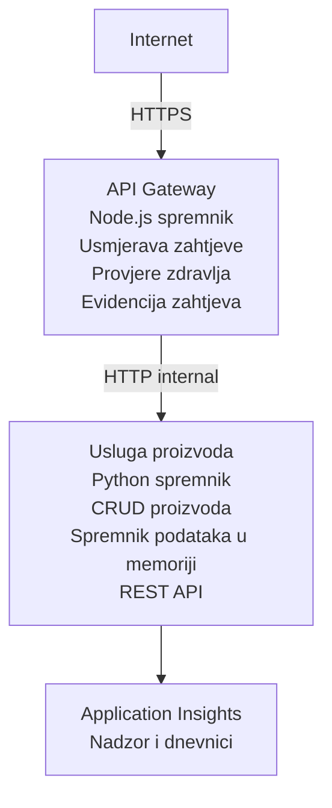

# Arhitektura mikroservisa - Primjer Container App

⏱️ **Procijenjeno vrijeme**: 25-35 minuta | 💰 **Procijenjeni trošak**: ~$50-100/mjesečno | ⭐ **Kompleksnost**: Napredno

**Pojednostavljena, ali funkcionalna** arhitektura mikroservisa implementirana u Azure Container Apps koristeći AZD CLI. Ovaj primjer pokazuje komunikaciju između servisa, orkestraciju kontejnera i nadzor s praktičnim postavom od 2 servisa.

> **📚 Pristup učenju**: Ovaj primjer započinje sa minimalnom arhitekturom od 2 servisa (API Gateway + Backend servis) koju zapravo možete implementirati i naučiti. Nakon savladavanja ove osnove, pružamo smjernice za proširenje na cjelokupni ekosustav mikroservisa.

## Što ćete naučiti

Kroz dovršetak ovog primjera, naučit ćete:
- Postaviti više kontejnera u Azure Container Apps
- Implementirati komunikaciju između servisa pomoću internog umrežavanja
- Konfigurirati skaliranje i provjere zdravlja ovisno o okruženju
- Nadzirati distribuirane aplikacije preko Application Insights
- Razumjeti obrasce i najbolje prakse u implementaciji mikroservisa
- Naučiti progresivno širenje od jednostavne do složene arhitekture

## Arhitektura

### Faza 1: Što gradimo (uključeno u ovaj primjer)


**Zašto početi jednostavno?**
- ✅ Brza implementacija i razumijevanje (25-35 minuta)
- ✅ Učenje ključnih obrazaca mikroservisa bez složenosti
- ✅ Radni kod koji možete modificirati i isprobavati
- ✅ Niži troškovi za učenje (~$50-100/mjesečno u odnosu na $300-1400/mjesečno)
- ✅ Izgradnja samopouzdanja prije dodavanja baza podataka i redova poruka

**Analogija**: Zamislite to kao učenje vožnje. Počinjete s praznim parkiralištem (2 servisa), savladavate osnove, a zatim prelazite na gradski promet (5+ servisa s bazama podataka).

### Faza 2: Buduće proširenje (Referentna arhitektura)

Nakon što savladate arhitekturu od 2 servisa, možete proširiti na:

```
Full Architecture (Not Included - For Reference)
├── API Gateway (✅ Included)
├── Product Service (✅ Included)
├── Order Service (🔜 Add next)
├── User Service (🔜 Add next)
├── Notification Service (🔜 Add last)
├── Azure Service Bus (🔜 For async communication)
├── Cosmos DB (🔜 For product persistence)
├── Azure SQL (🔜 For order management)
└── Azure Storage (🔜 For file storage)
```
  
Pogledajte odjeljak "Expansion Guide" na kraju za korak-po-korak upute.

## Uključene značajke

✅ **Otkriće servisa**: Automatsko DNS temeljeno otkrivanje između kontejnera  
✅ **Balansiranje opterećenja**: Ugrađeno balansiranje opterećenja preko replika  
✅ **Automatsko skaliranje**: Nezavisno skaliranje po servisu ovisno o HTTP zahtjevima  
✅ **Praćenje zdravlja**: Liveness i readiness probe za oba servisa  
✅ **Distribuirano logiranje**: Centralizirano logiranje s Application Insights  
✅ **Interna mreža**: Sigurna komunikacija između servisa  
✅ **Orkestracija kontejnera**: Automatska implementacija i skaliranje  
✅ **Ažuriranja bez zastoja**: Redovita ažuriranja s upravljanjem revizijama  

## Preduvjeti

### Potrebni alati

Prije početka, provjerite imate li instalirane ove alate:

1. **[Azure Developer CLI (azd)](https://learn.microsoft.com/azure/developer/azure-developer-cli/install-azd)** (verzija 1.0.0 ili novija)  
   ```bash
   azd version
   # Očekivani izlaz: azd verzija 1.0.0 ili viša
   ```
  
2. **[Azure CLI](https://learn.microsoft.com/cli/azure/install-azure-cli)** (verzija 2.50.0 ili novija)  
   ```bash
   az --version
   # Očekivani izlaz: azure-cli 2.50.0 ili noviji
   ```
  
3. **[Docker](https://www.docker.com/get-started)** (za lokalni razvoj/testiranje - opcionalno)  
   ```bash
   docker --version
   # Očekivani izlaz: Docker verzija 20.10 ili novija
   ```
  

### Azure zahtjevi

- Aktivna **Azure pretplata** ([kreirajte besplatan račun](https://azure.microsoft.com/free/))  
- Dozvole za kreiranje resursa u vašoj pretplati  
- Uloga **Contributor** na pretplati ili skupini resursa  

### Znanja potrebna

Ovo je **napredni** primjer. Trebali biste imati:
- Završeni [Jednostavni Flask API primjer](../../../../../examples/container-app/simple-flask-api)  
- Osnovno razumijevanje arhitekture mikroservisa  
- Poznavanje REST API-ja i HTTP-a  
- Razumijevanje kontejnerskih koncepata  

**Niste upoznati s Container Apps?** Započnite s [Jednostavnim Flask API primjerom](../../../../../examples/container-app/simple-flask-api) za učenje osnova.

## Brzi početak (korak-po-korak)

### Korak 1: Klonirajte i uđite u direktorij

```bash
git clone https://github.com/microsoft/AZD-for-beginners.git
cd AZD-for-beginners/examples/container-app/microservices
```
  
**✓ Provjera uspjeha**: Provjerite da vidite `azure.yaml`:  
```bash
ls
# Očekivano: README.md, azure.yaml, infra/, src/
```
  

### Korak 2: Autentifikacija s Azure

```bash
azd auth login
```
  
Otvara se vaš preglednik za autentifikaciju u Azure. Prijavite se sa svojim Azure vjerodajnicama.

**✓ Provjera uspjeha**: Trebali biste vidjeti:  
```
Logged in to Azure.
```
  

### Korak 3: Inicijalizirajte okruženje

```bash
azd init
```
  
**Upiti koje ćete vidjeti**:  
- **Naziv okruženja**: Unesite kratki naziv (npr. `microservices-dev`)  
- **Azure pretplata**: Odaberite svoju pretplatu  
- **Azure lokacija**: Izaberite regiju (npr. `eastus`, `westeurope`)

**✓ Provjera uspjeha**: Trebali biste vidjeti:  
```
SUCCESS: New project initialized!
```
  

### Korak 4: Implementacija infrastrukture i servisa

```bash
azd up
```
  
**Što se događa** (trajanje 8-12 minuta):  
1. Kreira se Container Apps okruženje  
2. Kreira se Application Insights za nadzor  
3. Gradnja API Gateway kontejnera (Node.js)  
4. Gradnja Product Service kontejnera (Python)  
5. Implementacija oba kontejnera u Azure  
6. Konfiguracija mreže i provjere zdravlja  
7. Postavljanje nadzora i logiranja  

**✓ Provjera uspjeha**: Trebali biste vidjeti:  
```
SUCCESS: Your application was deployed to Azure in X minutes Y seconds.
Endpoint: https://api-gateway-<unique-id>.azurecontainerapps.io
```
  
**⏱️ Vrijeme**: 8-12 minuta

### Korak 5: Testirajte implementaciju

```bash
# Dohvati odredišnu točku gatewaya
GATEWAY_URL=$(azd env get-values | grep API_GATEWAY_URL | cut -d '=' -f2 | tr -d '"')

# Testiraj zdravlje API Gatewaya
curl $GATEWAY_URL/health

# Očekivani ishod:
# {"status":"zdravo","service":"api-gateway","timestamp":"2025-11-19T10:30:00Z"}
```
  
**Testirajte product service preko gateway-a**:  
```bash
# Popis proizvoda
curl $GATEWAY_URL/api/products

# Očekivani rezultat:
# [
#   {"id":1,"name":"Laptop","price":999.99,"stock":50},
#   {"id":2,"name":"Miš","price":29.99,"stock":200},
#   {"id":3,"name":"Tipkovnica","price":79.99,"stock":150}
# ]
```
  
**✓ Provjera uspjeha**: Oba endpointa vraćaju JSON podatke bez grešaka.

---

**🎉 Čestitamo!** Implementirali ste mikroservisnu arhitekturu u Azure!

## Struktura projekta

Svi implementacijski fajlovi su uključeni—ovo je potpuni, radni primjer:

```
microservices/
│
├── README.md                         # This file
├── azure.yaml                        # AZD configuration
├── .gitignore                        # Git ignore patterns
│
├── infra/                           # Infrastructure as Code (Bicep)
│   ├── main.bicep                   # Main orchestration
│   ├── abbreviations.json           # Naming conventions
│   ├── core/                        # Shared infrastructure
│   │   ├── container-apps-environment.bicep  # Container environment + registry
│   │   └── monitor.bicep            # Application Insights + Log Analytics
│   └── app/                         # Service definitions
│       ├── api-gateway.bicep        # API Gateway container app
│       └── product-service.bicep    # Product Service container app
│
└── src/                             # Application source code
    ├── api-gateway/                 # Node.js API Gateway
    │   ├── app.js                   # Express server with routing
    │   ├── package.json             # Node dependencies
    │   └── Dockerfile               # Container definition
    └── product-service/             # Python Product Service
        ├── main.py                  # Flask API with product data
        ├── requirements.txt         # Python dependencies
        └── Dockerfile               # Container definition
```
  
**Što svaki komponenta radi:**

**Infrastruktura (infra/)**:  
- `main.bicep`: Orkestrira sve Azure resurse i njihove ovisnosti  
- `core/container-apps-environment.bicep`: Kreira Container Apps okruženje i Azure Container Registry  
- `core/monitor.bicep`: Postavlja Application Insights za distribuirano logiranje  
- `app/*.bicep`: Definicije pojedinačnih container app s konfiguracijom skaliranja i provjeri zdravlja  

**API Gateway (src/api-gateway/)**:  
- Javni servis koji usmjerava zahtjeve na backend servise  
- Implementira logiranje, rukovanje greškama i prosljeđivanje zahtjeva  
- Pokazuje komunikaciju između servisa preko HTTP-a

**Product Service (src/product-service/)**:  
- Interni servis s katalogom proizvoda (u memoriji radi jednostavnosti)  
- REST API s health check endpointima  
- Primjer backend mikroservisnog obrasca  

## Pregled servisa

### API Gateway (Node.js/Express)

**Port**: 8080  
**Pristup**: Javni (vanjski ingress)  
**Namjena**: Usmjerava dolazne zahtjeve na odgovarajuće backend servise  

**Endpointi**:  
- `GET /` - Informacije o servisu  
- `GET /health` - Endpoint za provjeru zdravlja  
- `GET /api/products` - Prosljeđuje product serviceu (svi proizvodi)  
- `GET /api/products/:id` - Prosljeđuje product serviceu (po ID-u)  

**Ključne značajke**:  
- Usmjeravanje zahtjeva s axiosom  
- Centralizirano logiranje  
- Rukovanje greškama i timeout  
- Otkriće servisa preko varijabli okruženja  
- Integracija s Application Insights  

**Istaknuti kod** (`src/api-gateway/app.js`):  
```javascript
// Interna komunikacija usluga
app.get('/api/products', async (req, res) => {
  const response = await axios.get(`${PRODUCT_SERVICE_URL}/products`);
  res.json(response.data);
});
```
  

### Product Service (Python/Flask)

**Port**: 8000  
**Pristup**: Samo interno (bez vanjskog ingresa)  
**Namjena**: Upravljanje katalogom proizvoda u memoriji  

**Endpointi**:  
- `GET /` - Informacije o servisu  
- `GET /health` - Endpoint za provjeru zdravlja  
- `GET /products` - Popis svih proizvoda  
- `GET /products/<id>` - Dohvati proizvod po ID-u  

**Ključne značajke**:  
- RESTful API s Flaskom  
- Pohrana proizvoda u memoriji (jednostavno, bez baze podataka)  
- Nadgledanje zdravlja pomoću probe  
- Strukturirano logiranje  
- Integracija s Application Insights  

**Model podataka**:  
```python
{
  "id": 1,
  "name": "Laptop",
  "description": "High-performance laptop",
  "price": 999.99,
  "stock": 50
}
```
  
**Zašto samo interno?**  
Product service nije javno izložen. Svi zahtjevi moraju ići kroz API Gateway koji pruža:  
- Sigurnost: Kontrolirana pristupna točka  
- Fleksibilnost: Mogućnost promjene backend-a bez utjecaja na klijente  
- Nadzor: Centralizirano logiranje zahtjeva  

## Razumijevanje komunikacije između servisa

### Kako servisi međusobno komuniciraju

U ovom primjeru, API Gateway komunicira s Product Service pomoću **internih HTTP poziva**:

```javascript
// API Gateway (src/api-gateway/app.js)
const PRODUCT_SERVICE_URL = process.env.PRODUCT_SERVICE_URL;

// Izvrši unutarnji HTTP zahtjev
const response = await axios.get(`${PRODUCT_SERVICE_URL}/products`);
```
  
**Ključne točke**:

1. **DNS-based otkrivanje**: Container Apps automatski osigurava DNS za interne servise  
   - FQDN Product Servicea: `product-service.internal.<environment>.azurecontainerapps.io`  
   - Pojednostavljeno kao: `http://product-service` (Container Apps to razrješava)

2. **Nema javne izloženosti**: Product Service ima `external: false` u Bicepu  
   - Dostupan samo unutar Container Apps okruženja  
   - Nije dostupan s interneta  

3. **Varijable okruženja**: URL-ovi servisa se ubacuju prilikom implementacije  
   - Bicep predaje interni FQDN gatewayu  
   - Nema hardkodiranih URL-ova u aplikaciji  

**Analogija**: Zamislite to kao uredske prostorije. API Gateway je recepcija (javni servis), a Product Service je ured (samo interno). Posjetitelji moraju proći recepciju da dođu do ureda.

## Mogućnosti implementacije

### Potpuna implementacija (preporučeno)

```bash
# Implementirajte infrastrukturu i obje usluge
azd up
```
  
Implementira:  
1. Okruženje Container Apps  
2. Application Insights  
3. Container Registry  
4. API Gateway kontejner  
5. Product Service kontejner  

**Vrijeme**: 8-12 minuta

### Implementacija pojedinog servisa

```bash
# Implementirajte samo jednu uslugu (nakon početnog azd up)
azd deploy api-gateway

# Ili implementirajte uslugu proizvoda
azd deploy product-service
```
  
**Primjer upotrebe**: Kada ste promijenili kod u jednom servisu i želite ponovo implementirati samo taj servis.

### Ažuriranje konfiguracije

```bash
# Promijeni parametre skaliranja
azd env set GATEWAY_MAX_REPLICAS 30

# Ponovno implementiraj s novom konfiguracijom
azd up
```
  
## Konfiguracija

### Konfiguracija skaliranja

Oba servisa su konfigurirana s HTTP-based autoscalingom u njihovim Bicep fajlovima:

**API Gateway**:  
- Min broj replika: 2 (uvijek barem 2 radi dostupnosti)  
- Maks broj replika: 20  
- Okidač za skaliranje: 50 istodobnih zahtjeva po replici  

**Product Service**:  
- Min broj replika: 1 (može se skalirati na 0 ako je potrebno)  
- Maks broj replika: 10  
- Okidač za skaliranje: 100 istodobnih zahtjeva po replici  

**Prilagodba skaliranja** (u `infra/app/*.bicep`):  
```bicep
scale: {
  minReplicas: 1
  maxReplicas: 10
  rules: [
    {
      name: 'http-scale-rule'
      http: {
        metadata: {
          concurrentRequests: '100'  // Adjust this
        }
      }
    }
  ]
}
```
  

### Dodjela resursa

**API Gateway**:  
- CPU: 1.0 vCPU  
- Memorija: 2 GiB  
- Razlog: Obradjuje sav vanjski promet  

**Product Service**:  
- CPU: 0.5 vCPU  
- Memorija: 1 GiB  
- Razlog: Lagane operacije u memoriji  

### Provjere zdravlja

Oba servisa uključuju liveness i readiness probe:

```bicep
probes: [
  {
    type: 'Liveness'
    httpGet: {
      path: '/health'
      port: 8080
    }
    initialDelaySeconds: 10
    periodSeconds: 30
  }
  {
    type: 'Readiness'
    httpGet: {
      path: '/health'
      port: 8080
    }
    initialDelaySeconds: 5
    periodSeconds: 10
  }
]
```
  
**Što to znači**:  
- **Liveness**: Ako provjera zdravlja zakaže, Container Apps restartuje kontejner  
- **Readiness**: Ako servis nije spreman, Container Apps zaustavlja usmjeravanje prometa toj replici  

## Nadzor i vidljivost

### Pregledajte zapise servisa

```bash
# Pregledajte zapise pomoću azd monitor
azd monitor --logs

# Ili koristite Azure CLI za određene Container Apps:
# Emitirajte zapise s API Gateway-a
az containerapp logs show --name api-gateway --resource-group $RG_NAME --follow

# Pregledajte nedavne zapise servisnih proizvoda
az containerapp logs show --name product-service --resource-group $RG_NAME --tail 100
```
  
**Očekivani ispis**:  
```
[api-gateway] API Gateway listening on port 8080
[api-gateway] Product Service URL: http://product-service
[api-gateway] GET /api/products 200 - 45ms
[product-service] Retrieved 5 products
```
  

### Upiti za Application Insights

Pristupite Application Insights u Azure portalu i pokrenite ove upite:

**Pronađi spore zahtjeve**:  
```kusto
requests
| where timestamp > ago(1h)
| where duration > 1000  // Requests taking >1 second
| summarize count() by name, cloud_RoleName
| order by count_ desc
```
  
**Praćenje poziva između servisa**:  
```kusto
dependencies
| where timestamp > ago(1h)
| where type == "Http"
| project timestamp, name, target, duration, success
| order by timestamp desc
```
  
**Stope grešaka po servisu**:  
```kusto
exceptions
| where timestamp > ago(24h)
| summarize errorCount = count() by cloud_RoleName, type
| order by errorCount desc
```
  
**Volumen zahtjeva kroz vrijeme**:  
```kusto
requests
| where timestamp > ago(1h)
| summarize requestCount = count() by bin(timestamp, 5m), cloud_RoleName
| render timechart
```
  

### Pristup nadzornoj ploči

```bash
# Dohvati detalje aplikacijskog uvida
azd env get-values | grep APPLICATIONINSIGHTS

# Otvori Azure Portal za nadzor
az monitor app-insights component show \
  --app $(azd env get-values | grep APPLICATIONINSIGHTS_CONNECTION_STRING | cut -d '=' -f2) \
  --resource-group $(azd env get-values | grep AZURE_RESOURCE_GROUP | cut -d '=' -f2) \
  --query "appId" -o tsv
```
  

### Live Metrics

1. Otvorite Application Insights u Azure portalu  
2. Kliknite "Live Metrics"  
3. Pratite real-time zahtjeve, greške i performanse  
4. Testirajte izvođenjem: `curl $(azd env get-values | grep API_GATEWAY_URL | cut -d '=' -f2 | tr -d '"')/api/products`

## Praktične vježbe

[Napomena: Pogledajte cjelovite vježbe gore u odjeljku "Praktične vježbe" za detaljne korake uključujući provjeru implementacije, modifikaciju podataka, testove autskaliranja, rukovanje greškama i dodavanje trećeg servisa.]

## Analiza troškova

### Procijenjeni mjesečni troškovi (za ovaj primjer s 2 servisa)

| Resurs           | Konfiguracija                  | Procijenjeni trošak |
|------------------|-------------------------------|---------------------|
| API Gateway      | 2-20 replika, 1 vCPU, 2GB RAM | $30-150             |
| Product Service  | 1-10 replika, 0.5 vCPU, 1GB RAM| $15-75              |
| Container Registry | Osnovni plan                  | $5                  |
| Application Insights | 1-2 GB/mjesečno             | $5-10               |
| Log Analytics    | 1 GB/mjesečno                  | $3                  |
| **Ukupno**       |                               | **$58-243/mjesečno** |

**Raspodjela troškova po korištenju**:  
- **Mali promet** (test/učiti): ~$60/mjesečno  
- **Umjeren promet** (mala produkcija): ~$120/mjesečno  
- **Visok promet** (zauzeta razdoblja): ~$240/mjesečno  

### Savjeti za optimizaciju troškova

1. **Skalirajte na nulu tijekom razvoja**:  
   ```bicep
   scale: {
     minReplicas: 0  // Save $30-40/month when not in use
     maxReplicas: 10
   }
   ```
  
2. **Koristite Consumption Plan za Cosmos DB** (kada ga dodate):  
   - Plaćajte samo ono što koristite  
   - Nema minimalne naknade  

3. **Postavite Application Insights sampling**:  
   ```javascript
   appInsights.defaultClient.config.samplingPercentage = 50; // Uzmite uzorak od 50% zahtjeva
   ```
  
4. **Očistite kada nije potrebno**:  
   ```bash
   azd down
   ```
  

### Besplatne opcije

Za učenje i testiranje razmislite o:
- Koristite Azure besplatne kredite (prvih 30 dana)
- Ograničite broj replika na minimum
- Izbrišite nakon testiranja (bez stalnih troškova)

---

## Čišćenje

Da biste izbjegli stalne troškove, izbrišite sve resurse:

```bash
azd down --force --purge
```

**Potvrda**:
```
? Total resources to delete: 6, are you sure you want to continue? (y/N)
```

Upišite `y` za potvrdu.

**Što se briše**:
- Okruženje Container Apps
- Oba Container Apps (gateway i proizvodna usluga)
- Container Registry
- Application Insights
- Log Analytics Workspace
- Resource Group

**✓ Provjera čišćenja**:
```bash
az group list --query "[?starts_with(name,'rg-microservices')]" --output table
```

Trebao bi vratiti prazan rezultat.

---

## Vodič za proširenje: Od 2 do 5+ usluga

Nakon što savladate ovu arhitekturu s 2 usluge, evo kako proširiti:

### Faza 1: Dodavanje baze podataka (sljedeći korak)

**Dodajte Cosmos DB za proizvodnu uslugu**:

1. Napravite `infra/core/cosmos.bicep`:
   ```bicep
   resource cosmosAccount 'Microsoft.DocumentDB/databaseAccounts@2023-04-15' = {
     name: name
     location: location
     kind: 'GlobalDocumentDB'
     properties: {
       databaseAccountOfferType: 'Standard'
       locations: [{ locationName: location, failoverPriority: 0 }]
     }
   }
   ```

2. Ažurirajte proizvodnu uslugu da koristi Cosmos DB umjesto pohrane u memoriji

3. Procijenjeni dodatni trošak: ~25 USD mjesečno (serverless)

### Faza 2: Dodavanje treće usluge (upravljanje narudžbama)

**Napravite uslugu narudžbi**:

1. Nova mapa: `src/order-service/` (Python/Node.js/C#)
2. Novi Bicep: `infra/app/order-service.bicep`
3. Ažurirajte API gateway da usmjerava `/api/orders`
4. Dodajte Azure SQL Database za pohranu narudžbi

**Arhitektura postaje**:
```
API Gateway → Product Service (Cosmos DB)
           → Order Service (Azure SQL)
```

### Faza 3: Dodavanje asinkrone komunikacije (Service Bus)

**Implementirajte arhitekturu vođenu događajima**:

1. Dodajte Azure Service Bus: `infra/core/servicebus.bicep`
2. Proizvodna usluga objavljuje događaje "ProductCreated"
3. Usluga narudžbi se pretplaćuje na događaje o proizvodima
4. Dodajte uslugu za obavijesti koja obrađuje događaje

**Uzorkovanje**: Zahtjev/Odgovor (HTTP) + arhitektura vođena događajima (Service Bus)

### Faza 4: Dodavanje autentifikacije korisnika

**Implementirajte uslugu korisnika**:

1. Napravite `src/user-service/` (Go/Node.js)
2. Dodajte Azure AD B2C ili prilagođenu JWT autentifikaciju
3. API Gateway provjerava tokene
4. Usluge provjeravaju dozvole korisnika

### Faza 5: Priprema za produkciju

**Dodajte ove komponente**:
- Azure Front Door (globalno balansiranje opterećenja)
- Azure Key Vault (upravljanje tajnama)
- Azure Monitor Workbooks (prilagođene nadzorne ploče)
- CI/CD pipeline (GitHub Actions)
- Blue-Green deploymenti
- Managed Identity za sve usluge

**Ukupni trošak za produkcijsku arhitekturu**: ~300-1,400 USD mjesečno

---

## Saznajte više

### Povezana dokumentacija
- [Azure Container Apps Dokumentacija](https://learn.microsoft.com/azure/container-apps/)
- [Vodič za mikroservisnu arhitekturu](https://learn.microsoft.com/azure/architecture/guide/architecture-styles/microservices)
- [Application Insights za distribuirano praćenje](https://learn.microsoft.com/azure/azure-monitor/app/distributed-tracing)
- [Azure Developer CLI Dokumentacija](https://learn.microsoft.com/azure/developer/azure-developer-cli/)

### Sljedeći koraci u ovom tečaju
- ← Prethodno: [Jednostavan Flask API](../../../../../examples/container-app/simple-flask-api) - Primjer početničkog pojedinačnog kontejnera
- → Sljedeće: [Vodič za AI integraciju](../../../../../examples/docs/ai-foundry) - Dodajte AI mogućnosti
- 🏠 [Početna stranica tečaja](../../README.md)

### Usporedba: Kada koristiti što

**Pojedinačna Container App** (primjer jednostavnog Flask API-ja):
- ✅ Jednostavne aplikacije
- ✅ Monolitna arhitektura
- ✅ Brza implementacija
- ❌ Ograničena skalabilnost
- **Trošak**: ~15-50 USD mjesečno

**Mikroservisi** (ovaj primjer):
- ✅ Složene aplikacije
- ✅ Nezavisno skaliranje po uslugama
- ✅ Samostalnost timova (različite usluge, različiti timovi)
- ❌ Složeno upravljanje
- **Trošak**: ~60-250 USD mjesečno

**Kubernetes (AKS)**:
- ✅ Maksimalna kontrola i fleksibilnost
- ✅ Višestruka podrška za oblake
- ✅ Napredna mrežna infrastruktura
- ❌ Zahtijeva stručnost za Kubernetes
- **Trošak**: ~150-500 USD mjesečno minimalno

**Preporuka**: Počnite s Container Apps (ovaj primjer), prijeđite na AKS samo ako trebate specifične mogućnosti Kubernetesa.

---

## Često postavljana pitanja

**P: Zašto samo 2 usluge umjesto 5+?**  
O: Edukacijski progres. Savladajte osnove (komunikaciju usluga, nadzor, skaliranje) s jednostavnim primjerom prije dodavanja složenosti. Obrasci koje ovdje učite primjenjuju se i na arhitekture s 100 usluga.

**P: Mogu li sam dodati više usluga?**  
O: Naravno! Slijedite gornji vodič za proširenje. Svaka nova usluga slijedi isti uzorak: napravite src mapu, Bicep datoteku, ažurirajte azure.yaml, implementirajte.

**P: Je li ovo spremno za produkciju?**  
O: Dobar je temelj. Za produkciju dodajte: managed identity, Key Vault, trajne baze podataka, CI/CD pipeline, nadzorne alarme i strategiju backupiranja.

**P: Zašto ne koristiti Dapr ili drugi service mesh?**  
O: Držite stvari jednostavnima za učenje. Kada razumijete nativno mreženje Container Apps, možete dodati Dapr za napredne scenarije.

**P: Kako debugirati lokalno?**  
O: Pokrenite usluge lokalno s Dockerom:
```bash
cd src/api-gateway
docker build -t local-gateway .
docker run -p 8080:8080 -e PRODUCT_SERVICE_URL=http://localhost:8000 local-gateway
```

**P: Mogu li koristiti različite programske jezike?**  
O: Da! Ovaj primjer pokazuje Node.js (gateway) + Python (proizvodna usluga). Možete kombinirati bilo koje jezike koji rade u kontejnerima.

**P: Što ako nemam Azure kredite?**  
O: Iskoristite besplatni Azure sloj (prvih 30 dana za nove račune) ili implementirajte za kratko testiranje i odmah izbrišite.

---

> **🎓 Sažetak puta učenja**: Naučili ste kako implementirati višeservisnu arhitekturu s automatskim skaliranjem, unutarnjim mreženjem, centraliziranim nadzorom i obrascima spremnim za produkciju. Ovaj temelj vas priprema za složene distribuirane sustave i enterprise mikroservisne arhitekture.

**📚 Navigacija tečajem:**
- ← Prethodno: [Jednostavan Flask API](../../../../../examples/container-app/simple-flask-api)
- → Sljedeće: [Primjer integracije baze podataka](../../../../../examples/database-app)
- 🏠 [Početna stranica tečaja](../../../README.md)
- 📖 [Najbolje prakse za Container Apps](../../../docs/chapter-04-infrastructure/deployment-guide.md)

---

<!-- CO-OP TRANSLATOR DISCLAIMER START -->
**Izjava o odricanju od odgovornosti**:  
Ovaj dokument je preveden korištenjem AI prevoditeljskog servisa [Co-op Translator](https://github.com/Azure/co-op-translator). Iako težimo točnosti, molimo imajte na umu da automatski prijevodi mogu sadržavati pogreške ili netočnosti. Izvorni dokument na njegovom izvornom jeziku treba se smatrati autoritativnim izvorom. Za kritične informacije preporučuje se profesionalni ljudski prijevod. Ne snosimo odgovornost za bilo kakve nesporazume ili pogrešna tumačenja koja proizlaze iz upotrebe ovog prijevoda.
<!-- CO-OP TRANSLATOR DISCLAIMER END -->