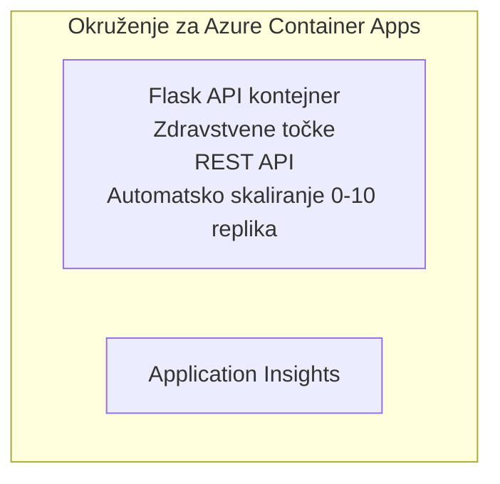

# Jednostavan Flask API - Primjer Container App

**Put učenja:** Početnik ⭐ | **Vrijeme:** 25-35 minuta | **Trošak:** 0-15 USD/mjesečno

Potpuni, funkcionalni Python Flask REST API implementiran u Azure Container Apps koristeći Azure Developer CLI (azd). Ovaj primjer prikazuje osnove implementacije kontejnera, automatskog skaliranja i nadzora.

## 🎯 Što ćete naučiti

- Implementirati kontejneriziranu Python aplikaciju u Azure
- Konfigurirati automatsko skaliranje sa skaliranjem na nulu
- Implementirati health probe i provjere spremnosti
- Pratiti dnevnike aplikacije i metrike
- Koristiti Azure Developer CLI za brzu implementaciju

## 📦 Što je uključeno

✅ **Flask aplikacija** - Potpuni REST API s CRUD operacijama (`src/app.py`)  
✅ **Dockerfile** - Konfiguracija kontejnera spremna za produkciju  
✅ **Bicep infrastruktura** - Okruženje Container Apps i implementacija API-ja  
✅ **AZD konfiguracija** - Postavljanje implementacije jednom naredbom  
✅ **Health probe** - Konfigurirane provjere liveness i readiness  
✅ **Automatsko skaliranje** - 0-10 replika ovisno o HTTP opterećenju  

## Arhitektura


## Preduvjeti

### Potrebno
- **Azure Developer CLI (azd)** - [Vodič za instalaciju](https://learn.microsoft.com/azure/developer/azure-developer-cli/install-azd)
- **Azure pretplata** - [Besplatan račun](https://azure.microsoft.com/free/)
- **Docker Desktop** - [Instalirajte Docker](https://www.docker.com/products/docker-desktop/) (za lokalno testiranje)

### Provjera preduvjeta

```bash
# Provjeri verziju azd-a (potreban 1.5.0 ili viši)
azd version

# Provjeri prijavu na Azure
azd auth login

# Provjeri Docker (nije obvezno, za lokalno testiranje)
docker --version
```

## ⏱️ Vremenski okvir implementacije

| Faza | Trajanje | Što se događa |
|-------|----------|--------------||
| Postavljanje okruženja | 30 sekundi | Kreiranje azd okruženja |
| Izgradnja kontejnera | 2-3 minute | Docker build Flask aplikacije |
| Postavljanje infrastrukture | 3-5 minuta | Kreiranje Container Apps, registar, nadzor |
| Implementacija aplikacije | 2-3 minute | Push slike i implementacija u Container Apps |
| **Ukupno** | **8-12 minuta** | Potpuna implementacija spremna za rad |

## Brzi početak

```bash
# Navigirajte do primjera
cd examples/container-app/simple-flask-api

# Inicijalizirajte okruženje (odaberite jedinstveni naziv)
azd env new myflaskapi

# Implementirajte sve (infrastrukturu + aplikaciju)
azd up
# Bit ćete upitani da:
# 1. Odaberete Azure pretplatu
# 2. Izaberete lokaciju (npr. eastus2)
# 3. Pričekate 8-12 minuta za implementaciju

# Dohvatite svoj API endpoint
azd env get-values

# Testirajte API
curl $(azd env get-value API_ENDPOINT)/health
```

**Očekivani rezultat:**
```json
{
  "status": "healthy",
  "timestamp": "2025-11-19T10:30:00Z",
  "service": "simple-flask-api",
  "version": "1.0.0"
}
```

## ✅ Provjera implementacije

### Korak 1: Provjerite status implementacije

```bash
# Pregledajte raspoređene usluge
azd show

# Očekivani ispis prikazuje:
# - Usluga: api
# - Krajnja točka: https://ca-api-[env].xxx.azurecontainerapps.io
# - Status: Radi
```

### Korak 2: Testirajte API krajnje točke

```bash
# Dohvati API endpoint
API_URL=$(azd env get-value API_ENDPOINT)

# Testiraj stanje
curl $API_URL/health

# Testiraj root endpoint
curl $API_URL/

# Kreiraj stavku
curl -X POST $API_URL/api/items \
  -H "Content-Type: application/json" \
  -d '{"name": "Test Item", "description": "My first item"}'

# Dohvati sve stavke
curl $API_URL/api/items
```

**Kriteriji uspjeha:**
- ✅ /health endpoint vraća HTTP 200
- ✅ Root endpoint prikazuje informacije o API-ju
- ✅ POST kreira stavku i vraća HTTP 201
- ✅ GET vraća kreirane stavke

### Korak 3: Pregledajte dnevnike

```bash
# Strimajte žive zapise pomoću azd monitor
azd monitor --logs

# Ili koristite Azure CLI:
az containerapp logs show --name api --resource-group $RG_NAME --follow

# Trebali biste vidjeti:
# - Poruke o pokretanju Gunicorn-a
# - Zapisi HTTP zahtjeva
# - Zapisi informacija o aplikaciji
```

## Struktura projekta

```
simple-flask-api/
├── azure.yaml              # AZD configuration
├── infra/
│   ├── main.bicep         # Main infrastructure
│   ├── main.parameters.json
│   └── app/
│       ├── container-env.bicep
│       └── api.bicep
└── src/
    ├── app.py             # Flask application
    ├── requirements.txt
    └── Dockerfile
```

## API krajnje točke

| Krajnja točka | Metoda | Opis |
|----------|--------|-------------|
| `/health` | GET | Provjera zdravstvenog stanja |
| `/api/items` | GET | Popis svih stavki |
| `/api/items` | POST | Kreiranje nove stavke |
| `/api/items/{id}` | GET | Dohvati određenu stavku |
| `/api/items/{id}` | PUT | Ažuriraj stavku |
| `/api/items/{id}` | DELETE | Izbriši stavku |

## Konfiguracija

### Varijable okruženja

```bash
# Postavi prilagođenu konfiguraciju
azd env set PORT 8000
azd env set LOG_LEVEL info
azd env set MAX_REPLICAS 20
```

### Konfiguracija skaliranja

API se automatski skalira ovisno o HTTP prometu:
- **Minimalan broj replika**: 0 (skalira se na nulu kad je bez aktivnosti)
- **Maksimalan broj replika**: 10
- **Istovremeni zahtjevi po replici**: 50

## Razvoj

### Pokretanje lokalno

```bash
# Instalirajte ovisnosti
cd src
pip install -r requirements.txt

# Pokrenite aplikaciju
python app.py

# Testirajte lokalno
curl http://localhost:8000/health
```

### Izgradnja i testiranje kontejnera

```bash
# Izgradi Docker sliku
docker build -t flask-api:local ./src

# Pokreni kontejner lokalno
docker run -p 8000:8000 flask-api:local

# Testiraj kontejner
curl http://localhost:8000/health
```

## Implementacija

### Potpuna implementacija

```bash
# Implementirajte infrastrukturu i aplikaciju
azd up
```

### Implementacija samo koda

```bash
# Implementirajte samo kod aplikacije (infrastruktura nepromijenjena)
azd deploy api
```

### Ažuriranje konfiguracije

```bash
# Ažuriraj varijable okoline
azd env set API_KEY "new-api-key"

# Ponovno implementiraj s novom konfiguracijom
azd deploy api
```

## Nadzor

### Pregled dnevnika

```bash
# Prenos emitiranih dnevnika uživo koristeći azd monitor
azd monitor --logs

# Ili koristite Azure CLI za Container Apps:
az containerapp logs show --name api --resource-group $RG_NAME --follow

# Pogledajte posljednjih 100 redaka
az containerapp logs show --name api --resource-group $RG_NAME --tail 100
```

### Praćenje metrika

```bash
# Otvori Azure Monitor nadzornu ploču
azd monitor --overview

# Pregledaj specifične metrike
az monitor metrics list \
  --resource $(azd show --output json | jq -r '.services.api.resourceId') \
  --metric "Requests,ResponseTime"
```

## Testiranje

### Provjera zdravstvenog stanja

```bash
curl $(azd show --output json | jq -r '.services.api.endpoint')/health
```

Očekivani odgovor:
```json
{
  "status": "healthy",
  "timestamp": "2025-11-19T10:30:00Z"
}
```

### Kreiranje stavke

```bash
curl -X POST $(azd show --output json | jq -r '.services.api.endpoint')/api/items \
  -H "Content-Type: application/json" \
  -d '{"name": "Test Item", "description": "A test item"}'
```

### Dohvati sve stavke

```bash
curl $(azd show --output json | jq -r '.services.api.endpoint')/api/items
```

## Optimizacija troškova

Ova implementacija koristi skaliranje na nulu, tako da plaćate samo kada API procesira zahtjeve:

- **Trošak u mirovanju**: ~0 USD/mjesečno (skalirano na nulu)
- **Aktivni trošak**: ~0,000024 USD/sekundi po replici
- **Očekivani mjesečni trošak** (lagana upotreba): 5-15 USD

### Dodatno smanjenje troškova

```bash
# Smanji maksimalni broj replika za razvoj
azd env set MAX_REPLICAS 3

# Koristi kraći vremenski prekid mirovanja
azd env set SCALE_TO_ZERO_TIMEOUT 300  # 5 minuta
```

## Otklanjanje poteškoća

### Kontejner se ne pokreće

```bash
# Provjerite zapise spremnika pomoću Azure CLI
az containerapp logs show --name api --resource-group $RG_NAME --tail 100

# Provjerite lokalnu izgradnju Docker slike
docker build -t test ./src
```

### API nije dostupan

```bash
# Provjerite je li ulaz eksterni
az containerapp show --name api --resource-group rg-simple-flask-api \
  --query properties.configuration.ingress.external
```

### Visoka vremena odziva

```bash
# Provjerite korištenje CPU-a/memorije
az monitor metrics list \
  --resource $(azd show --output json | jq -r '.services.api.resourceId') \
  --metric "CPUPercentage,MemoryPercentage"

# Povećajte resurse ako je potrebno
az containerapp update --name api --resource-group rg-simple-flask-api \
  --cpu 1.0 --memory 2Gi
```

## Čišćenje

```bash
# Izbriši sve resurse
azd down --force --purge
```

## Sljedeći koraci

### Proširite ovaj primjer

1. **Dodajte bazu podataka** - Integrirajte Azure Cosmos DB ili SQL bazu podataka
   ```bash
   # Dodajte Cosmos DB modul u infra/main.bicep
   # Ažurirajte app.py s vezom na bazu podataka
   ```

2. **Dodajte autentikaciju** - Implementirajte Azure AD ili API ključeve
   ```python
   # Dodajte autentifikacijski middleware u app.py
   from functools import wraps
   ```

3. **Postavite CI/CD** - GitHub Actions workflow
   ```yaml
   # Create .github/workflows/deploy.yml
   name: Deploy to Azure
   on: [push]
   ```

4. **Dodajte upravljani identitet** - Siguran pristup Azure servisima
   ```bicep
   # Update infra/app/api.bicep
   identity: { type: 'SystemAssigned' }
   ```

### Povezani primjeri

- **[Database App](../../../../../examples/database-app)** - Potpuni primjer s SQL bazom podataka
- **[Mikroservisi](../../../../../examples/container-app/microservices)** - Arhitektura višeslojnih servisa
- **[Vodič za Container Apps](../README.md)** - Svi uzorci kontejnera

### Resursi za učenje

- 📚 [AZD za početnike](../../../README.md) - Glavni tečaj
- 📚 [Container Apps obrasci](../README.md) - Više obrazaca implementacije
- 📚 [Galerija AZD predložaka](https://azure.github.io/awesome-azd/) - Predlošci zajednice

## Dodatni resursi

### Dokumentacija
- **[Flask dokumentacija](https://flask.palletsprojects.com/)** - Vodič za Flask framework
- **[Azure Container Apps](https://learn.microsoft.com/azure/container-apps/)** - Službena Azure dokumentacija
- **[Azure Developer CLI](https://learn.microsoft.com/azure/developer/azure-developer-cli/)** - Referenca za azd naredbe

### Tutorijali
- **[Container Apps Quickstart](https://learn.microsoft.com/azure/container-apps/quickstart-portal)** - Implementirajte svoju prvu aplikaciju
- **[Python na Azure](https://learn.microsoft.com/azure/developer/python/)** - Vodič za razvoj u Pythonu
- **[Bicep jezik](https://learn.microsoft.com/azure/azure-resource-manager/bicep/)** - Infrastruktura kao kod

### Alati
- **[Azure Portal](https://portal.azure.com)** - Vizualno upravljanje resursima
- **[VS Code Azure ekstenzija](https://marketplace.visualstudio.com/items?itemName=ms-azuretools.vscode-azurecontainerapps)** - Integracija za IDE

---

**🎉 Čestitamo!** Implementirali ste produkcijski spreman Flask API u Azure Container Apps s automatskim skaliranjem i nadzorom.

**Imate pitanja?** [Otvorite issue](https://github.com/microsoft/AZD-for-beginners/issues) ili pogledajte [FAQ](../../../resources/faq.md)

---

<!-- CO-OP TRANSLATOR DISCLAIMER START -->
**Odricanje od odgovornosti**:  
Ovaj dokument preveden je pomoću AI prevoditeljskog servisa [Co-op Translator](https://github.com/Azure/co-op-translator). Iako nastojimo postići točnost, molimo imajte na umu da automatizirani prijevodi mogu sadržavati pogreške ili netočnosti. Izvorni dokument na njegovom izvornom jeziku treba smatrati službenim i obvezatnim izvorom. Za kritične informacije preporučuje se stručni ljudski prijevod. Nismo odgovorni za bilo kakva nesporazumevanja ili pogrešne interpretacije koje proizlaze iz korištenja ovog prijevoda.
<!-- CO-OP TRANSLATOR DISCLAIMER END -->