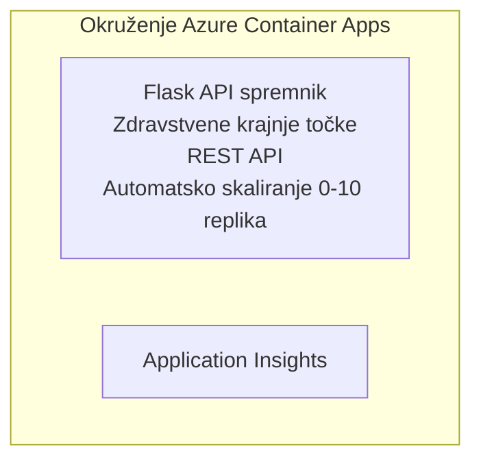

# Jednostavan Flask API - Primjer Container App

**Put učenja:** Početnik ⭐ | **Vrijeme:** 25-35 minuta | **Cijena:** 0-15 $/mjesec

Potpuni, funkcionalni Python Flask REST API implementiran na Azure Container Apps pomoću Azure Developer CLI (azd). Ovaj primjer pokazuje osnovne korake implementacije kontejnera, automatsko skaliranje i nadzor.

## 🎯 Što ćete naučiti

- Implementirati Python aplikaciju u kontejneru na Azure
- Konfigurirati automatsko skaliranje sa scale-to-zero
- Implementirati health probe i provjere spremnosti
- Nadzirati dnevnike i metrike aplikacije
- Koristiti Azure Developer CLI za brzu implementaciju

## 📦 Što je uključeno

✅ **Flask aplikacija** - Potpuni REST API s CRUD operacijama (`src/app.py`)  
✅ **Dockerfile** - Konfiguracija kontejnera spremna za produkciju  
✅ **Bicep infrastruktura** - Okruženje Container Apps i implementacija API-ja  
✅ **AZD konfiguracija** - Jedan naredbeni setup za implementaciju  
✅ **Health Probes** - Konfigurirane provjere liveness i readiness  
✅ **Automatsko skaliranje** - 0-10 replika prema HTTP opterećenju  

## Arhitektura



## Preduvjeti

### Potrebno
- **Azure Developer CLI (azd)** - [Vodič za instalaciju](https://learn.microsoft.com/azure/developer/azure-developer-cli/install-azd)
- **Azure pretplata** - [Besplatan račun](https://azure.microsoft.com/free/)
- **Docker Desktop** - [Instaliraj Docker](https://www.docker.com/products/docker-desktop/) (za lokalno testiranje)

### Provjera preduvjeta

```bash
# Provjerite verziju azd (potreban 1.5.0 ili viši)
azd version

# Provjerite Azure prijavu
azd auth login

# Provjerite Docker (neobavezno, za lokalno testiranje)
docker --version
```

## ⏱️ Vrijeme implementacije

| Faza | Trajanje | Što se događa |
|-------|----------|--------------||
| Postavljanje okruženja | 30 sekundi | Kreiranje azd okruženja |
| Izgradnja kontejnera | 2-3 minute | Docker build Flask aplikacije |
| Provisioniranje infrastrukture | 3-5 minuta | Kreiranje Container Apps, registara, monitoringa |
| Implementacija aplikacije | 2-3 minute | Slanje slike i implementacija u Container Apps |
| **Ukupno** | **8-12 minuta** | Spremna kompletna implementacija |

## Brzi početak

```bash
# Navigirajte do primjera
cd examples/container-app/simple-flask-api

# Inicijalizirajte okruženje (odaberite jedinstveno ime)
azd env new myflaskapi

# Postavite sve (infrastruktura + aplikacija)
azd up
# Bit ćete upitani da:
# 1. Odaberete Azure pretplatu
# 2. Odaberete lokaciju (npr. eastus2)
# 3. Pričekate 8-12 minuta za postavljanje

# Dohvatite svoj API endpoint
azd env get-values

# Testirajte API
curl $(azd env get-value API_ENDPOINT)/health
```

**Očekivani rezultat:**
```json
{
  "status": "healthy",
  "timestamp": "2025-11-19T10:30:00Z",
  "service": "simple-flask-api",
  "version": "1.0.0"
}
```

## ✅ Provjera implementacije

### Korak 1: Provjeri status implementacije

```bash
# Pogledajte implementirane usluge
azd show

# Očekivani izlaz pokazuje:
# - Usluga: api
# - Krajnja točka: https://ca-api-[env].xxx.azurecontainerapps.io
# - Status: Radi
```

### Korak 2: Testiraj API krajnje točke

```bash
# Dohvati API krajnju točku
API_URL=$(azd env get-value API_ENDPOINT)

# Testiraj status
curl $API_URL/health

# Testiraj početnu krajnju točku
curl $API_URL/

# Kreiraj stavku
curl -X POST $API_URL/api/items \
  -H "Content-Type: application/json" \
  -d '{"name": "Test Item", "description": "My first item"}'

# Dohvati sve stavke
curl $API_URL/api/items
```

**Kriteriji uspješnosti:**
- ✅ Health endpoint vraća HTTP 200
- ✅ Root endpoint prikazuje informacije o API-ju
- ✅ POST kreira stavku i vraća HTTP 201
- ✅ GET vraća kreirane stavke

### Korak 3: Pregledaj dnevnike

```bash
# Prikaz uživo logova pomoću azd monitor
azd monitor --logs

# Ili upotrijebite Azure CLI:
az containerapp logs show --name api --resource-group $RG_NAME --follow

# Trebali biste vidjeti:
# - Poruke o pokretanju Gunicorna
# - Zapise HTTP zahtjeva
# - Informacije o aplikaciji u zapisima
```

## Struktura projekta

```
simple-flask-api/
├── azure.yaml              # AZD configuration
├── infra/
│   ├── main.bicep         # Main infrastructure
│   ├── main.parameters.json
│   └── app/
│       ├── container-env.bicep
│       └── api.bicep
└── src/
    ├── app.py             # Flask application
    ├── requirements.txt
    └── Dockerfile
```

## API krajnje točke

| Krajnja točka | Metoda | Opis |
|----------|--------|-------------|
| `/health` | GET | Provjera zdravlja |
| `/api/items` | GET | Dohvat svih stavki |
| `/api/items` | POST | Kreiranje nove stavke |
| `/api/items/{id}` | GET | Dohvat određene stavke |
| `/api/items/{id}` | PUT | Ažuriranje stavke |
| `/api/items/{id}` | DELETE | Brisanje stavke |

## Konfiguracija

### Varijable okruženja

```bash
# Postavi prilagođene postavke
azd env set PORT 8000
azd env set LOG_LEVEL info
azd env set MAX_REPLICAS 20
```

### Konfiguracija skaliranja

API se automatski skalira prema HTTP prometu:
- **Minimalni broj replika**: 0 (scale-to-zero kad je neaktivan)
- **Maksimalni broj replika**: 10
- **Istovremeni zahtjevi po replici**: 50

## Razvoj

### Pokreni lokalno

```bash
# Instalirajte ovisnosti
cd src
pip install -r requirements.txt

# Pokrenite aplikaciju
python app.py

# Testirajte lokalno
curl http://localhost:8000/health
```

### Izgradi i testiraj kontejner

```bash
# Izradi Docker sliku
docker build -t flask-api:local ./src

# Pokreni spremnik lokalno
docker run -p 8000:8000 flask-api:local

# Testiraj spremnik
curl http://localhost:8000/health
```

## Implementacija

### Potpuna implementacija

```bash
# Implementirajte infrastrukturu i aplikaciju
azd up
```

### Implementacija samo koda

```bash
# Implementirajte samo kod aplikacije (infrastruktura nepromijenjena)
azd deploy api
```

### Ažuriraj konfiguraciju

```bash
# Ažuriraj varijable okoline
azd env set API_KEY "new-api-key"

# Ponovno implementiraj s novom konfiguracijom
azd deploy api
```

## Nadzor

### Pregled dnevnika

```bash
# Prikaz uživo dnevnika pomoću azd monitor
azd monitor --logs

# Ili koristite Azure CLI za Container Apps:
az containerapp logs show --name api --resource-group $RG_NAME --follow

# Prikaži zadnjih 100 linija
az containerapp logs show --name api --resource-group $RG_NAME --tail 100
```

### Praćenje metrika

```bash
# Otvori Azure Monitor nadzornu ploču
azd monitor --overview

# Pregledaj određene metrike
az monitor metrics list \
  --resource $(azd show --output json | jq -r '.services.api.resourceId') \
  --metric "Requests,ResponseTime"
```

## Testiranje

### Health Check

```bash
curl $(azd show --output json | jq -r '.services.api.endpoint')/health
```

Očekivani odgovor:
```json
{
  "status": "healthy",
  "timestamp": "2025-11-19T10:30:00Z"
}
```

### Kreiranje stavke

```bash
curl -X POST $(azd show --output json | jq -r '.services.api.endpoint')/api/items \
  -H "Content-Type: application/json" \
  -d '{"name": "Test Item", "description": "A test item"}'
```

### Dohvat svih stavki

```bash
curl $(azd show --output json | jq -r '.services.api.endpoint')/api/items
```

## Optimizacija troškova

Ova implementacija koristi scale-to-zero, tako da plaćate samo kad API obrađuje zahtjeve:

- **Trošak pri mirovanju**: ~0 $/mjesec (skalirano na nulu)
- **Aktivni trošak**: ~0.000024 $/sekundi po replici
- **Očekivani mjesečni trošak** (lagana upotreba): 5-15 $

### Daljnje smanjenje troškova

```bash
# Smanji maksimalni broj replika za razvoj
azd env set MAX_REPLICAS 3

# Koristi kraći vremenski period neaktivnosti
azd env set SCALE_TO_ZERO_TIMEOUT 300  # 5 minuta
```

## Rješavanje problema

### Kontejner se ne pokreće

```bash
# Provjerite zapise spremnika pomoću Azure CLI
az containerapp logs show --name api --resource-group $RG_NAME --tail 100

# Provjerite lokalnu izgradnju Docker slike
docker build -t test ./src
```

### API nije dostupan

```bash
# Provjerite je li ulaz vanjski
az containerapp show --name api --resource-group rg-simple-flask-api \
  --query properties.configuration.ingress.external
```

### Visoka vremena odziva

```bash
# Provjerite upotrebu CPU-a/podatkovne memorije
az monitor metrics list \
  --resource $(azd show --output json | jq -r '.services.api.resourceId') \
  --metric "CPUPercentage,MemoryPercentage"

# Povećajte resurse ako je potrebno
az containerapp update --name api --resource-group rg-simple-flask-api \
  --cpu 1.0 --memory 2Gi
```

## Čišćenje

```bash
# Izbrišite sve resurse
azd down --force --purge
```

## Sljedeći koraci

### Proširite ovaj primjer

1. **Dodajte bazu podataka** - Integrirajte Azure Cosmos DB ili SQL bazu
   ```bash
   # Dodajte Cosmos DB modul u infra/main.bicep
   # Ažurirajte app.py s povezom na bazu podataka
   ```

2. **Dodajte autentifikaciju** - Implementirajte Microsoft Entra ID ili API ključeve
   ```python
   # Dodajte middleware za autentifikaciju u app.py
   from functools import wraps
   ```

3. **Postavite CI/CD** - GitHub Actions workflow
   ```yaml
   # Create .github/workflows/deploy.yml
   name: Deploy to Azure
   on: [push]
   ```

4. **Dodajte upravljani identitet** - Siguran pristup Azure uslugama
   ```bicep
   # Update infra/app/api.bicep
   identity: { type: 'SystemAssigned' }
   ```

### Povezani primjeri

- **[Database App](../../../../../examples/database-app)** - Potpuni primjer s SQL bazom
- **[Microservices](../../../../../examples/container-app/microservices)** - Arhitektura s više servisa
- **[Container Apps Master Guide](../README.md)** - Svi obrasci za kontejnere

### Resursi za učenje

- 📚 [AZD za početnike tečaj](../../../README.md) - Glavna početna stranica tečaja
- 📚 [Container Apps obrasci](../README.md) - Više obrazaca implementacije
- 📚 [AZD galerija predložaka](https://azure.github.io/awesome-azd/) - Zajednički predlošci

## Dodatni resursi

### Dokumentacija
- **[Flask dokumentacija](https://flask.palletsprojects.com/)** - Vodič za Flask framework
- **[Azure Container Apps](https://learn.microsoft.com/azure/container-apps/)** - Službeni Azure dokumenti
- **[Azure Developer CLI](https://learn.microsoft.com/azure/developer/azure-developer-cli/)** - Referenca naredbi azd

### Tutorijali
- **[Container Apps Quickstart](https://learn.microsoft.com/azure/container-apps/quickstart-portal)** - Implementirajte svoju prvu aplikaciju
- **[Python na Azure](https://learn.microsoft.com/azure/developer/python/)** - Vodič za razvoj u Pythonu
- **[Bicep jezik](https://learn.microsoft.com/azure/azure-resource-manager/bicep/)** - Infrastruktura kao kod

### Alati
- **[Azure Portal](https://portal.azure.com)** - Vizualno upravljanje resursima
- **[VS Code Azure ekstenzija](https://marketplace.visualstudio.com/items?itemName=ms-azuretools.vscode-azurecontainerapps)** - Integracija s IDE-om

---

**🎉 Čestitamo!** Implementirali ste Flask API spreman za produkciju u Azure Container Apps s automatskim skaliranjem i nadzorom.

**Imate pitanja?** [Otvorite problem](https://github.com/microsoft/AZD-for-beginners/issues) ili provjerite [FAQ](../../../resources/faq.md)

---

<!-- CO-OP TRANSLATOR DISCLAIMER START -->
**Napomena**:
Ovaj dokument je preveden korištenjem AI prevoditeljskog servisa [Co-op Translator](https://github.com/Azure/co-op-translator). Iako težimo točnosti, imajte na umu da automatski prijevodi mogu sadržavati greške ili netočnosti. Izvorni dokument na izvornom jeziku treba smatrati autoritativnim izvorom. Za važne informacije preporuča se profesionalni ljudski prijevod. Nismo odgovorni za bilo kakva nesporazumevanja ili pogrešne interpretacije koje proizlaze iz korištenja ovog prijevoda.
<!-- CO-OP TRANSLATOR DISCLAIMER END -->