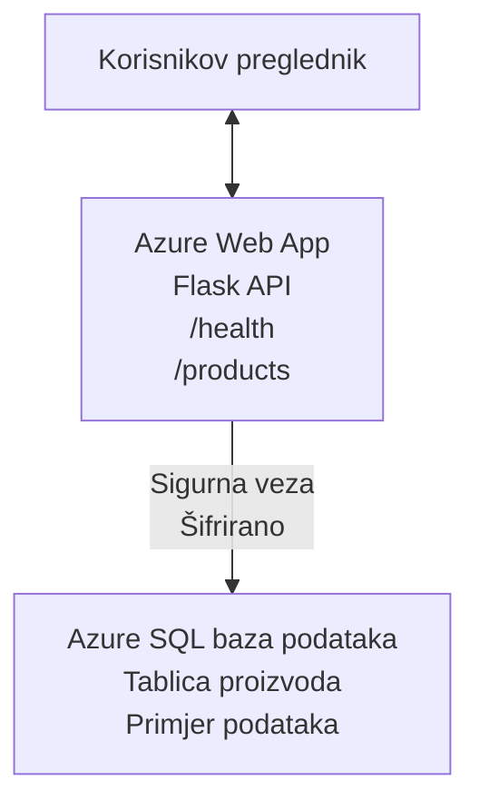

# Deployanje Microsoft SQL baze podataka i web aplikacije s AZD-om

⏱️ **Procijenjeno vrijeme**: 20-30 minuta | 💰 **Procijenjeni trošak**: ~15-25 USD/mjesečno | ⭐ **Složenost**: Srednja razina

Ovaj **kompletan, radni primjer** pokazuje kako koristiti [Azure Developer CLI (azd)](https://learn.microsoft.com/azure/developer/azure-developer-cli/) za deployanje Python Flask web aplikacije s Microsoft SQL bazom podataka na Azure. Sav kod je uključen i testiran—nema potrebe za vanjskim ovisnostima.

## Što ćete naučiti

Dovršetkom ovog primjera ćete:
- Deployati višeslojnu aplikaciju (web app + baza podataka) koristeći infrastrukturu kao kod
- Konfigurirati sigurne veze prema bazi podataka bez hardkodiranih tajni
- Nadzirati zdravlje aplikacije s Application Insights
- Učinkovito upravljati Azure resursima korištenjem AZD CLI-a
- Slijediti Azure najbolje prakse za sigurnost, optimizaciju troškova i promatranje

## Pregled scenarija
- **Web aplikacija**: Python Flask REST API s povezanošću na bazu podataka
- **Baza podataka**: Azure SQL baza s uzorčnim podacima
- **Infrastruktura**: Provisioniramo pomoću Bicep-a (modularni, višekratni predlošci)
- **Deploy**: Potpuno automatiziran s `azd` naredbama
- **Nadzor**: Application Insights za zapise i telemetriju

## Preduvjeti

### Potrebni alati

Prije početka, provjerite imate li instalirane sljedeće alate:

1. **[Azure CLI](https://learn.microsoft.com/cli/azure/install-azure-cli)** (verzija 2.50.0 ili novija)
   ```sh
   az --version
   # Očekivani izlaz: azure-cli 2.50.0 ili viša verzija
   ```

2. **[Azure Developer CLI (azd)](https://learn.microsoft.com/azure/developer/azure-developer-cli/install-azd)** (verzija 1.0.0 ili novija)
   ```sh
   azd version
   # Očekivani izlaz: azd verzija 1.0.0 ili viša
   ```

3. **[Python 3.8+](https://www.python.org/downloads/)** (za lokalni razvoj)
   ```sh
   python --version
   # Očekivani rezultat: Python 3.8 ili noviji
   ```

4. **[Docker](https://www.docker.com/get-started)** (opcionalno, za lokalni razvoj s kontejnerima)
   ```sh
   docker --version
   # Očekivani izlaz: Docker verzija 20.10 ili novija
   ```

### Azure zahtjevi

- Aktivna **Azure pretplata** ([kreirajte besplatan račun](https://azure.microsoft.com/free/))
- Dozvole za kreiranje resursa u vašoj pretplati
- Uloga **Owner** ili **Contributor** na pretplati ili resource group

### Potrebno predznanje

Ovo je primjer **srednje razine**. Trebali biste biti upoznati s:
- Osnovnim radom u komandnoj liniji
- Temeljima cloud koncepta (resursi, resource grupe)
- Osnovnim razumijevanjem web aplikacija i baza podataka

**Novi ste u AZD-u?** Počnite s [Vodičem za početnike](../../docs/chapter-01-foundation/azd-basics.md).

## Arhitektura

Ovaj primjer deploya dvoslojnu arhitekturu s web aplikacijom i SQL bazom:



**Deployanje resursa:**
- **Resource Group**: Kontejner za sve resurse
- **App Service Plan**: Linux hosting (B1 tier radi učinkovitosti troškova)
- **Web App**: Python 3.11 runtime s Flask aplikacijom
- **SQL Server**: Managed server s TLS 1.2 minimum
- **SQL baza podataka**: Basic tier (2GB, prikladno za razvoj/testiranje)
- **Application Insights**: Nadzor i logiranje
- **Log Analytics Workspace**: Centralizirano spremište zapisa

**Analogiija**: Zamislite ovo kao restoran (web app) s hladnjakom (baza podataka). Kupci naručuju iz menija (API endpointi), a kuhinja (Flask app) uzima sastojke (podatke) iz hladnjaka. Menadžer restorana (Application Insights) prati sve što se događa.

## Struktura direktorija

Svi su fajlovi uključeni—nema potrebe za vanjskim ovisnostima:

```
examples/database-app/
│
├── README.md                    # This file
├── azure.yaml                   # AZD configuration file
├── .env.sample                  # Sample environment variables
├── .gitignore                   # Git ignore patterns
│
├── infra/                       # Infrastructure as Code (Bicep)
│   ├── main.bicep              # Main orchestration template
│   ├── abbreviations.json      # Azure naming conventions
│   └── resources/              # Modular resource templates
│       ├── sql-server.bicep    # SQL Server configuration
│       ├── sql-database.bicep  # Database configuration
│       ├── app-service-plan.bicep  # Hosting plan
│       ├── app-insights.bicep  # Monitoring setup
│       └── web-app.bicep       # Web application
│
└── src/
    └── web/                    # Application source code
        ├── app.py              # Flask REST API
        ├── requirements.txt    # Python dependencies
        └── Dockerfile          # Container definition
```

**Što svaki fajl radi:**
- **azure.yaml**: Kaže AZD-u što i gdje deployati
- **infra/main.bicep**: Orkestrira sve Azure resurse
- **infra/resources/*.bicep**: Definicije pojedinačnih resursa (modularno za ponovno korištenje)
- **src/web/app.py**: Flask aplikacija s logikom baze podataka
- **requirements.txt**: Python ovisnosti
- **Dockerfile**: Upute za kontejnerizaciju i deploy

## Quickstart (Korak po korak)

### Korak 1: Klonirajte i uđite u direktorij

```sh
git clone https://github.com/microsoft/AZD-for-beginners.git
cd AZD-for-beginners/examples/database-app
```

**✓ Provjera uspjeha**: Potvrdite da vidite `azure.yaml` i mapu `infra/`:
```sh
ls
# Očekivano: README.md, azure.yaml, infra/, src/
```

### Korak 2: Autentikacija na Azure

```sh
azd auth login
```

Ovo otvara vaš preglednik za Azure prijavu. Prijavite se Azure korisničkim podacima.

**✓ Provjera uspjeha**: Trebali biste vidjeti:
```
Logged in to Azure.
```

### Korak 3: Inicijalizacija okoline

```sh
azd init
```

**Što se događa**: AZD kreira lokalnu konfiguraciju za vaš deploy.

**Unosi koje ćete vidjeti**:
- **Ime okoline**: Unesite kratko ime (npr. `dev`, `myapp`)
- **Azure pretplata**: Odaberite pretplatu s liste
- **Azure lokacija**: Odaberite regiju (npr. `eastus`, `westeurope`)

**✓ Provjera uspjeha**: Trebali biste vidjeti:
```
SUCCESS: New project initialized!
```

### Korak 4: Provisioniranje Azure resursa

```sh
azd provision
```

**Što se događa**: AZD deploya svu infrastrukturu (traje 5-8 minuta):
1. Kreira resource group
2. Kreira SQL Server i bazu
3. Kreira App Service Plan
4. Kreira Web App
5. Kreira Application Insights
6. Konfigurira mrežu i sigurnost

**Tražit će od vas**:
- **SQL admin korisničko ime**: Unesite korisničko ime (npr. `sqladmin`)
- **SQL admin lozinku**: Unesite snažnu lozinku (spremite je!)

**✓ Provjera uspjeha**: Trebali biste vidjeti:
```
SUCCESS: Your application was provisioned in Azure in X minutes Y seconds.
You can view the resources created under the resource group rg-<env-name> in Azure Portal:
https://portal.azure.com/#@/resource/subscriptions/.../resourceGroups/rg-<env-name>
```

**⏱️ Vrijeme**: 5-8 minuta

### Korak 5: Deploy aplikacije

```sh
azd deploy
```

**Što se događa**: AZD gradi i deploya vašu Flask aplikaciju:
1. Paketira Python aplikaciju
2. Gradi Docker container
3. Push-a na Azure Web App
4. Inicijalizira bazu uzorčnim podacima
5. Pokreće aplikaciju

**✓ Provjera uspjeha**: Trebali biste vidjeti:
```
SUCCESS: Your application was deployed to Azure in X minutes Y seconds.
You can view the resources created under the resource group rg-<env-name> in Azure Portal:
https://portal.azure.com/#@/resource/subscriptions/.../resourceGroups/rg-<env-name>
```

**⏱️ Vrijeme**: 3-5 minuta

### Korak 6: Otvorite aplikaciju u pregledniku

```sh
azd browse
```

Ovo otvara vašu deployanu web aplikaciju u pregledniku na adresi `https://app-<unique-id>.azurewebsites.net`

**✓ Provjera uspjeha**: Trebali biste vidjeti JSON izlaz:
```json
{
  "message": "Welcome to the Database App API",
  "endpoints": {
    "/": "This help message",
    "/health": "Health check endpoint",
    "/products": "List all products",
    "/products/<id>": "Get product by ID"
  }
}
```

### Korak 7: Testirajte API endpoint-e

**Provjera zdravlja** (provjera povezivanja na bazu):
```sh
curl https://app-<your-id>.azurewebsites.net/health
```

**Očekivani odgovor**:
```json
{
  "status": "healthy",
  "database": "connected"
}
```

**Popis proizvoda** (uzorčni podaci):
```sh
curl https://app-<your-id>.azurewebsites.net/products
```

**Očekivani odgovor**:
```json
[
  {
    "id": 1,
    "name": "Laptop",
    "description": "High-performance laptop",
    "price": 1299.99,
    "created_at": "2025-11-19T10:30:00"
  },
  ...
]
```

**Detalji pojedinog proizvoda**:
```sh
curl https://app-<your-id>.azurewebsites.net/products/1
```

**✓ Provjera uspjeha**: Svi endpointi vraćaju JSON podatke bez grešaka.

---

**🎉 Čestitamo!** Uspješno ste deployali web aplikaciju s bazom podataka na Azure koristeći AZD.

## Dubinska konfiguracija

### Varijable okoline

Tajne se sigurno upravljaju putem Azure App Service konfiguracije—**nikada nisu hardkodirane u izvorni kod**.

**Automatski konfigurirano od strane AZD-a**:
- `SQL_CONNECTION_STRING`: Veza prema bazi s enkriptiranim vjerodajnicama
- `APPLICATIONINSIGHTS_CONNECTION_STRING`: Endpoint za telemetriju nadzora
- `SCM_DO_BUILD_DURING_DEPLOYMENT`: Omogućava automatsku instalaciju ovisnosti

**Gdje se pohranjuju tajne**:
1. Tijekom `azd provision` unosite SQL vjerodajnice kroz sigurne upite
2. AZD ih sprema u lokalnu `.azure/<env-name>/.env` datoteku (ignorirano u Gitu)
3. AZD ubacuje te vrijednosti u konfiguraciju Azure App Service-a (šifrirano u mirovanju)
4. Aplikacija čita varijable preko `os.getenv()` za vrijeme izvođenja

### Lokalni razvoj

Za lokalno testiranje kreirajte `.env` datoteku iz predloška:

```sh
cp .env.sample .env
# Uredite .env s vezom na lokalnu bazu podataka
```

**Radni tok lokalnog razvoja**:
```sh
# Instalirajte ovisnosti
cd src/web
pip install -r requirements.txt

# Postavite varijable okoline
export SQL_CONNECTION_STRING="your-local-connection-string"

# Pokrenite aplikaciju
python app.py
```

**Testirajte lokalno**:
```sh
curl http://localhost:8000/health
# Očekivano: {"status": "zdrav", "baza podataka": "povezana"}
```

### Infrastruktura kao kod

Svi Azure resursi definirani su u **Bicep predlošcima** (`infra/` direktorij):

- **Modularni dizajn**: Svaka vrsta resursa ima svoj fajl za višekratnu upotrebu
- **Parametrizirano**: Moguće prilagoditi SKU, regije, nazive
- **Najbolje prakse**: Slijedi Azure naming standarde i sigurnosne zadane postavke
- **Kontrola verzija**: Promjene u infrastrukturi prate se u Gitu

**Primjer prilagodbe**:
Za promjenu tier-a baze uredite `infra/resources/sql-database.bicep`:
```bicep
sku: {
  name: 'Standard'  // Changed from 'Basic'
  tier: 'Standard'
  capacity: 10
}
```

## Sigurnosne najbolje prakse

Ovaj primjer slijedi Azure sigurnosne najbolje prakse:

### 1. **Nema tajni u izvornom kodu**
- ✅ Podaci za pristup pohranjeni u Azure App Service konfiguraciji (šifrirano)
- ✅ `.env` datoteke isključene iz Gita preko `.gitignore`
- ✅ Tajne se prosljeđuju putem sigurnih parametara tijekom provisioning-a

### 2. **Šifrirane veze**
- ✅ TLS 1.2 minimum za SQL Server
- ✅ Web App zahtijeva HTTPS
- ✅ Veze prema bazi koriste šifrirane kanale

### 3. **Sigurnost mreže**
- ✅ SQL Server firewall dopušta samo Azure servise
- ✅ Javne mrežne veze ograničene (mogu se dodatno zaključati s Private Endpoints)
- ✅ FTPS onemogućen na Web App-u

### 4. **Autentifikacija i autorizacija**
- ⚠️ **Trenutno**: SQL autentikacija (korisničko ime/lozinka)
- ✅ **Preporuka za produkciju**: Koristiti Azure Managed Identity za autentikaciju bez lozinke

**Za nadogradnju na Managed Identity** (za produkciju):
1. Omogućite managed identity na Web Appu
2. Dodijelite identitetu SQL dopuštenja
3. Ažurirajte connection string da koristi managed identity
4. Uklonite autentikaciju lozinkom

### 5. **Revizija i usklađenost**
- ✅ Application Insights bilježi sve zahtjeve i pogreške
- ✅ Omogućeno auditiranje SQL baze (može se konfigurirati za usklađenost)
- ✅ Svi resursi označeni za upravljanje

**Sigurnosni popis prije produkcije**:
- [ ] Omogućiti Azure Defender za SQL
- [ ] Konfigurirati Private Endpoints za SQL bazu
- [ ] Omogućiti Web Application Firewall (WAF)
- [ ] Implementirati Azure Key Vault za rotaciju tajni
- [ ] Konfigurirati Microsoft Entra ID autentikaciju
- [ ] Omogućiti dijagnostičko logiranje za sve resurse

## Optimizacija troškova

**Procijenjeni mjesečni troškovi** (stanje u studenom 2025.):

| Resurs | SKU/Tier | Procijenjeni trošak |
|----------|----------|----------------|
| App Service Plan | B1 (Basic) | ~13 USD/mjesečno |
| SQL baza podataka | Basic (2GB) | ~5 USD/mjesečno |
| Application Insights | Pay-as-you-go | ~2 USD/mjesečno (mali promet) |
| **Ukupno** | | **~20 USD/mjesečno** |

**💡 Savjeti za uštedu**:

1. **Koristite Free Tier za učenje**:
   - App Service: F1 tier (besplatno, ograničeni sati)
   - SQL baza: Azure SQL baza serverless
   - Application Insights: 5GB/mjesečno besplatnog unosa

2. **Stopirajte resurse kad se ne koriste**:
   ```sh
   # Zaustavite web aplikaciju (baza podataka se i dalje naplaćuje)
   az webapp stop --name <app-name> --resource-group <rg-name>
   
   # Ponovno pokrenite kada je potrebno
   az webapp start --name <app-name> --resource-group <rg-name>
   ```

3. **Obrišite sve nakon testiranja**:
   ```sh
   azd down
   ```
   Ovo uklanja SVE resurse i zaustavlja troškove.

4. **SKU za razvoj vs produkciju**:
   - **Razvoj**: Basic tier (kao u ovom primjeru)
   - **Produkcija**: Standard/Premium tier s redundantnošću

**Praćenje troškova**:
- Pratite troškove na [Azure Cost Management](https://portal.azure.com/#view/Microsoft_Azure_CostManagement)
- Postavite alarme za troškove da izbjegnete iznenađenja
- Oznake resursa s `azd-env-name` za praćenje

**Alternativa Free Tieru**:
Za potrebe učenja možete izmijeniti `infra/resources/app-service-plan.bicep`:
```bicep
sku: {
  name: 'F1'  // Free tier
  tier: 'Free'
}
```
**Napomena**: Free tier ima ograničenja (60 minuta CPU dnevno, nema always-on).

## Nadzor i promatranje

### Integracija Application Insights

Ovaj primjer uključuje **Application Insights** za cjelovit nadzor:

**Što se nadzire**:
- ✅ HTTP zahtjevi (latencija, status kodovi, endpointi)
- ✅ Pogreške aplikacije i iznimke
- ✅ Prilagođeni zapisi iz Flask aplikacije
- ✅ Zdravlje veze prema bazi
- ✅ Metrike performansi (CPU, memorija)

**Pristup Application Insights**:
1. Otvorite [Azure portal](https://portal.azure.com)
2. Idite u vaš resource group (`rg-<env-name>`)
3. Kliknite na Application Insights resurs (`appi-<unique-id>`)

**Korisni upiti** (Application Insights → Logs):

**Pregled svih zahtjeva**:
```kusto
requests
| where timestamp > ago(1h)
| order by timestamp desc
| project timestamp, name, url, resultCode, duration
```

**Pronalaženje pogrešaka**:
```kusto
exceptions
| where timestamp > ago(24h)
| order by timestamp desc
| project timestamp, type, outerMessage, operation_Name
```

**Provjera health endpointa**:
```kusto
requests
| where name contains "health"
| summarize count() by resultCode, bin(timestamp, 1h)
```

### Auditiranje SQL baze

**Auditiranje SQL baze omogućeno** za praćenje:
- Obrasci pristupa bazi
- Neuspjeli pokušaji prijave
- Promjene sheme
- Pristup podacima (za usklađenost)

**Pristup audit zapisima**:
1. Azure Portal → SQL baza → Auditing
2. Pregled zapisa u Log Analytics workspace-u

### Nadzor u stvarnom vremenu

**Pregled live metrika**:
1. Application Insights → Live Metrics
2. Pratite zahtjeve, greške i performanse u realnom vremenu

**Postavljanje alarma**:
Kreirajte alarme za kritične događaje:
- HTTP 500 greške > 5 u 5 minuta
- Poteškoće s povezivanjem na bazu
- Visoki odzivi (>2 sekunde)

**Primjer kreiranja alarma**:
```sh
az monitor metrics alert create \
  --name "High-Response-Time" \
  --resource-group <rg-name> \
  --scopes <app-insights-resource-id> \
  --condition "avg requests/duration > 2000" \
  --description "Alert when response time exceeds 2 seconds"
```

## Rješavanje problema
### Česti problemi i rješenja

#### 1. `azd provision` ne uspijeva s porukom "Location not available"

**Simptom**:  
```
Error: The subscription is not registered for the resource type 'components' in the location 'centralus'.
```
  
**Rješenje**:  
Odaberite drugu Azure regiju ili registrirajte pružatelja resursa:  
```sh
az provider register --namespace Microsoft.Insights
```
  
#### 2. SQL veza ne uspijeva tijekom implementacije

**Simptom**:  
```
pyodbc.OperationalError: ('08001', '[08001] [Microsoft][ODBC Driver 18 for SQL Server]TCP Provider...')
```
  
**Rješenje**:  
- Provjerite dopušta li vatrozid SQL Servera Azure usluge (automatski konfigurirano)  
- Provjerite je li SQL administratorska lozinka unesena točno tijekom `azd provision`  
- Provjerite je li SQL Server u potpunosti postavljen (može potrajati 2-3 minute)  

**Provjera veze**:  
```sh
# Iz Azure portala idite na SQL bazu podataka → Uređivač upita
# Pokušajte se povezati sa svojim vjerodajnicama
```
  
#### 3. Web aplikacija prikazuje "Application Error"

**Simptom**:  
Preglednik prikazuje generičku stranicu s greškom.

**Rješenje**:  
Provjerite dnevnike aplikacije:  
```sh
# Pogledajte nedavne zapise
az webapp log tail --name <app-name> --resource-group <rg-name>
```
  
**Uobičajeni razlozi**:  
- Nedostaju varijable okoline (provjerite App Service → Configuration)  
- Neuspješna instalacija Python paketa (provjerite dnevnike implementacije)  
- Greška u inicijalizaciji baze podataka (provjerite SQL povezivost)  

#### 4. `azd deploy` ne uspijeva s porukom "Build Error"

**Simptom**:  
```
Error: Failed to build project
```
  
**Rješenje**:  
- Provjerite je li `requirements.txt` bez sintaksnih pogrešaka  
- Provjerite je li Python 3.11 specificiran u `infra/resources/web-app.bicep`  
- Provjerite Dockerfile ima li ispravnu baznu sliku  

**Otklanjanje pogrešaka lokalno**:  
```sh
cd src/web
docker build -t test-app .
docker run -p 8000:8000 test-app
```
  
#### 5. "Unauthorized" prilikom pokretanja AZD naredbi

**Simptom**:  
```
ERROR: (Unauthorized) The client '<id>' with object id '<id>' does not have authorization
```
  
**Rješenje**:  
Ponovno se autentificirajte u Azure:  
```sh
# Potrebno za AZD radne tokove
azd auth login

# Opcionalno ako također izravno koristite Azure CLI naredbe
az login
```
  
Provjerite imate li ispravne dozvole (uloga Contributor) na pretplatu.

#### 6. Visoki troškovi baze podataka

**Simptom**:  
Neočekivani Azure račun.

**Rješenje**:  
- Provjerite jeste li zaboravili pokrenuti `azd down` nakon testiranja  
- Provjerite koristi li SQL baza Basic sloj (ne Premium)  
- Pregledajte troškove u Azure Cost Management  
- Postavite upozorenja o troškovima  

### Dobivanje pomoći

**Prikaz svih AZD varijabli okoline**:  
```sh
azd env get-values
```
  
**Provjera statusa implementacije**:  
```sh
az webapp show --name <app-name> --resource-group <rg-name> --query state
```
  
**Pristup dnevnicima aplikacije**:  
```sh
az webapp log download --name <app-name> --resource-group <rg-name> --log-file app-logs.zip
```
  
**Trebate više pomoći?**  
- [AZD Vodič za rješavanje problema](../../docs/chapter-07-troubleshooting/common-issues.md)  
- [Rješavanje problema za Azure App Service](https://learn.microsoft.com/azure/app-service/troubleshoot-diagnostic-logs)  
- [Rješavanje problema za Azure SQL](https://learn.microsoft.com/azure/azure-sql/database/troubleshoot-common-errors-issues)  

## Praktične vježbe

### Vježba 1: Provjerite svoju implementaciju (Početnik)

**Cilj**: Potvrditi da su svi resursi implementirani i aplikacija radi.

**Koraci**:  
1. Nabrojite sve resurse u svojoj grupi resursa:  
   ```sh
   az resource list --resource-group rg-<env-name> --output table
   ```
   **Očekivano**: 6-7 resursa (Web App, SQL Server, SQL Baza, App Service Plan, Application Insights, Log Analytics)

2. Testirajte sve API krajnje točke:  
   ```sh
   curl https://app-<your-id>.azurewebsites.net/
   curl https://app-<your-id>.azurewebsites.net/health
   curl https://app-<your-id>.azurewebsites.net/products
   curl https://app-<your-id>.azurewebsites.net/products/1
   ```
   **Očekivano**: Sve vraćaju valjani JSON bez pogrešaka

3. Provjerite Application Insights:  
   - Idite u Application Insights u Azure portalu  
   - Otvorite "Live Metrics"  
   - Osvježite preglednik na web aplikaciji  
   **Očekivano**: Vidite zahtjeve u stvarnom vremenu  

**Kriteriji uspjeha**: Svi 6-7 resursa postoje, sve krajnje točke vraćaju podatke, Live Metrics prikazuje aktivnost.

---

### Vježba 2: Dodajte novu API krajnju točku (Srednji nivo)

**Cilj**: Proširiti Flask aplikaciju s novom krajnjom točkom.

**Početni kod**: Trenutne krajnje točke u `src/web/app.py`

**Koraci**:  
1. Uredite `src/web/app.py` i dodajte novu krajnju točku nakon funkcije `get_product()`:  
   ```python
   @app.route('/products/search/<keyword>')
   def search_products(keyword):
       """Search products by name or description."""
       try:
           conn = get_db_connection()
           cursor = conn.cursor()
           cursor.execute(
               "SELECT id, name, description, price, created_at FROM products WHERE name LIKE ? OR description LIKE ?",
               (f'%{keyword}%', f'%{keyword}%')
           )
           
           products = []
           for row in cursor.fetchall():
               products.append({
                   'id': row[0],
                   'name': row[1],
                   'description': row[2],
                   'price': float(row[3]) if row[3] else None,
                   'created_at': row[4].isoformat() if row[4] else None
               })
           
           cursor.close()
           conn.close()
           
           logger.info(f"Search for '{keyword}' returned {len(products)} results")
           return jsonify(products), 200
           
       except Exception as e:
           logger.error(f"Error searching products: {str(e)}")
           return jsonify({'error': str(e)}), 500
   ```
  
2. Implementirajte ažuriranu aplikaciju:  
   ```sh
   azd deploy
   ```
  
3. Testirajte novu krajnju točku:  
   ```sh
   curl https://app-<your-id>.azurewebsites.net/products/search/laptop
   ```
   **Očekivano**: Vraća proizvode koji odgovaraju "laptop"

**Kriteriji uspjeha**: Nova krajnja točka radi, vraća filtrirane rezultate, pojavi se u Application Insights dnevnicima.

---

### Vježba 3: Dodajte nadzor i upozorenja (Napredno)

**Cilj**: Postaviti proaktivni nadzor s upozorenjima.

**Koraci**:  
1. Kreirajte upozorenje za HTTP 500 pogreške:  
   ```sh
   # Dohvati ID resursa Application Insights
   AI_ID=$(az monitor app-insights component show \
     --app appi-<your-id> \
     --resource-group rg-<env-name> \
     --query id -o tsv)
   
   # Kreiraj upozorenje
   az monitor metrics alert create \
     --name "High-Error-Rate" \
     --resource-group rg-<env-name> \
     --scopes $AI_ID \
     --condition "count requests/failed > 5" \
     --window-size 5m \
     --evaluation-frequency 1m \
     --description "Alert when >5 failed requests in 5 minutes"
   ```
  
2. Pokrenite upozorenje uzrokujući pogreške:  
   ```sh
   # Zahtjev za nepostojeći proizvod
   for i in {1..10}; do curl https://app-<your-id>.azurewebsites.net/products/999; done
   ```
  
3. Provjerite je li upozorenje aktivirano:  
   - Azure Portal → Alerts → Alert Rules  
   - Provjerite svoj email (ako je konfiguriran)

**Kriteriji uspjeha**: Pravilo upozorenja je kreirano, aktivira se pri pogreškama, primaju se obavijesti.

---

### Vježba 4: Promjene sheme baze podataka (Napredno)

**Cilj**: Dodati novu tablicu i prilagoditi aplikaciju za njeno korištenje.

**Koraci**:  
1. Spojite se na SQL bazu putem Azure Portala Query Editora

2. Kreirajte novu tablicu `categories`:  
   ```sql
   CREATE TABLE categories (
       id INT PRIMARY KEY IDENTITY(1,1),
       name NVARCHAR(50) NOT NULL,
       description NVARCHAR(200)
   );
   
   INSERT INTO categories (name, description) VALUES
   ('Electronics', 'Electronic devices and accessories'),
   ('Office Supplies', 'Office equipment and supplies');
   
   -- Add category to products table
   ALTER TABLE products ADD category_id INT;
   UPDATE products SET category_id = 1; -- Set all to Electronics
   ```
  
3. Ažurirajte `src/web/app.py` da uključi informacije o kategorijama u odgovore

4. Implementirajte i testirajte

**Kriteriji uspjeha**: Nova tablica postoji, proizvodi prikazuju informacije o kategoriji, aplikacija i dalje radi.

---

### Vježba 5: Implementirajte predmemoriju (Expert)

**Cilj**: Dodajte Azure Redis Cache za poboljšanje performansi.

**Koraci**:  
1. Dodajte Redis Cache u `infra/main.bicep`  
2. Ažurirajte `src/web/app.py` za predmemoriranje upita proizvoda  
3. Mjerite poboljšanje performansi s Application Insights  
4. Usporedite vrijeme odgovora prije i nakon predmemoriranja  

**Kriteriji uspjeha**: Redis je implementiran, predmemorija radi, vrijeme odgovora se poboljšalo za >50%.

**Savjet**: Počnite s [Azure Cache for Redis dokumentacijom](https://learn.microsoft.com/azure/azure-cache-for-redis/).

---

## Čišćenje

Kako biste izbjegli stalne troškove, izbrišite sve resurse nakon završetka:  

```sh
azd down
```
  
**Potvrda**:  
```
? Total resources to delete: 7, are you sure you want to continue? (y/N)
```
  
Upišite `y` za potvrdu.

**✓ Provjera uspjeha**:  
- Svi resursi su izbrisani iz Azure Portala  
- Nema stalnih troškova  
- Lokalna `.azure/<env-name>` mapa može se izbrisati

**Alternativa** (zadržite infrastrukturu, izbrišite podatke):  
```sh
# Izbrišite samo grupu resursa (sačuvajte AZD konfiguraciju)
az group delete --name rg-<env-name> --yes
```
## Saznajte više

### Povezana dokumentacija
- [Azure Developer CLI Dokumentacija](https://learn.microsoft.com/azure/developer/azure-developer-cli/)  
- [Azure SQL Database Dokumentacija](https://learn.microsoft.com/azure/azure-sql/database/)  
- [Azure App Service Dokumentacija](https://learn.microsoft.com/azure/app-service/)  
- [Application Insights Dokumentacija](https://learn.microsoft.com/azure/azure-monitor/app/app-insights-overview)  
- [Bicep jezična referenca](https://learn.microsoft.com/azure/azure-resource-manager/bicep/)  

### Sljedeći koraci u ovom tečaju
- **[Primjer Container Apps](../../../../examples/container-app)**: Implementirajte mikroservise s Azure Container Apps  
- **[Vodič za integraciju AI](../../../../docs/ai-foundry)**: Dodajte AI mogućnosti svojoj aplikaciji  
- **[Najbolje prakse implementacije](../../docs/chapter-04-infrastructure/deployment-guide.md)**: Obrasci za produkcijsku implementaciju  

### Napredne teme
- **Managed Identity**: Uklonite lozinke i koristite Microsoft Entra ID autentifikaciju  
- **Private Endpoints**: Osigurajte veze s bazom unutar virtualne mreže  
- **CI/CD integracija**: Automatizirajte implementacije s GitHub Actions ili Azure DevOps  
- **Multi-okruženja**: Postavite razvojno, testno i produkcijsko okruženje  
- **Migracije baze podataka**: Koristite Alembic ili Entity Framework za verzioniranje sheme  

### Usporedba s drugim pristupima

**AZD naspram ARM predložaka**:  
- ✅ AZD: Viša razina apstrakcije, jednostavnije naredbe  
- ⚠️ ARM: Detaljniji, granularna kontrola  

**AZD naspram Terraform**:  
- ✅ AZD: Native za Azure, integriran s Azure uslugama  
- ⚠️ Terraform: Podrška za više cloudova, veći ekosustav  

**AZD naspram Azure Portala**:  
- ✅ AZD: Ponavljajuć, verzijski kontroliran, automatiziran  
- ⚠️ Portal: Ručno klikavanje, teško reproducirati  

**Razmislite o AZD-u kao**: Docker Compose za Azure—pojednostavljeno konfiguriranje složenih implementacija.

---

## Često postavljana pitanja

**P: Mogu li koristiti drugi programski jezik?**  
O: Da! Zamijenite `src/web/` s Node.js, C#, Go ili bilo kojim jezikom. Ažurirajte `azure.yaml` i Bicep odgovarajuće.

**P: Kako dodati više baza podataka?**  
O: Dodajte još jedan SQL Database modul u `infra/main.bicep` ili koristite PostgreSQL/MySQL s Azure Database usluga.

**P: Mogu li ovo koristiti za produkciju?**  
O: Ovo je početna točka. Za produkciju dodajte: managed identity, private endpoints, redundanciju, strategiju backup-a, WAF i unaprijeđeni nadzor.

**P: Što ako želim koristiti kontejnere umjesto implementacije koda?**  
O: Pogledajte [Primjer Container Apps](../../../../examples/container-app) koji koristi Docker kontejnere kroz cijeli proces.

**P: Kako se povezati na bazu s lokalnog računala?**  
O: Dodajte svoj IP u vatrozid SQL Servera:  
```sh
az sql server firewall-rule create \
  --resource-group rg-<env-name> \
  --server sql-<unique-id> \
  --name AllowMyIP \
  --start-ip-address <your-ip> \
  --end-ip-address <your-ip>
```
  
**P: Mogu li koristiti postojeću bazu umjesto stvaranja nove?**  
O: Da, izmijenite `infra/main.bicep` da referencira postojeći SQL Server i ažurirajte parametre veze.

---

> **Napomena:** Ovaj primjer demonstrira najbolje prakse za implementaciju web aplikacije s bazom koristeći AZD. Uključuje radni kod, opsežnu dokumentaciju i praktične vježbe za jačanje znanja. Za produkcijsku implementaciju pregledajte sigurnost, skaliranje, usklađenost i zahtjeve za troškovima specifične za vašu organizaciju.

**📚 Navigacija tečaja:**  
- ← Prethodno: [Primjer Container Apps](../../../../examples/container-app)  
- → Sljedeće: [Vodič za integraciju AI](../../../../docs/ai-foundry)  
- 🏠 [Početna stranica tečaja](../../README.md)

---

<!-- CO-OP TRANSLATOR DISCLAIMER START -->
**Napomena**:
Ovaj dokument je preveden korištenjem AI prevoditeljskog servisa [Co-op Translator](https://github.com/Azure/co-op-translator). Iako težimo točnosti, imajte na umu da automatski prijevodi mogu sadržavati greške ili netočnosti. Izvorni dokument na izvornom jeziku treba smatrati autoritativnim izvorom. Za važne informacije preporuča se profesionalni ljudski prijevod. Nismo odgovorni za bilo kakva nesporazumevanja ili pogrešne interpretacije koje proizlaze iz korištenja ovog prijevoda.
<!-- CO-OP TRANSLATOR DISCLAIMER END -->