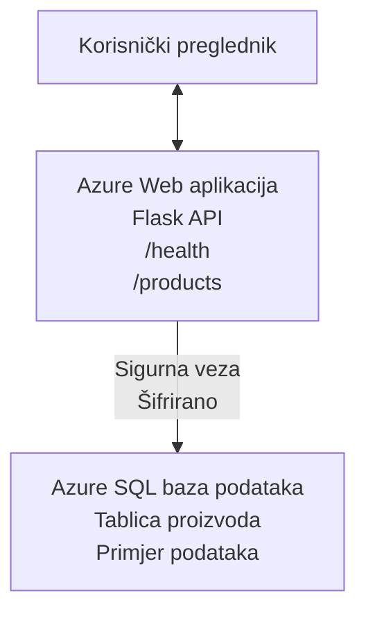

# Postavljanje Microsoft SQL baze podataka i web aplikacije s AZD

⏱️ **Procijenjeno vrijeme**: 20-30 minuta | 💰 **Procijenjeni trošak**: ~15-25 USD/mjesečno | ⭐ **Složenost**: Srednja

Ovaj **potpuni, funkcionalni primjer** prikazuje kako koristiti [Azure Developer CLI (azd)](https://learn.microsoft.com/azure/developer/azure-developer-cli/) za postavljanje Python Flask web aplikacije s Microsoft SQL bazom podataka na Azure. Sav kod je uključen i testiran—nije potrebna nikakva vanjska ovisnost.

## Što ćete naučiti

Nakon dovršetka ovog primjera, moći ćete:
- Postaviti višeslojnu aplikaciju (web aplikacija + baza podataka) koristeći infrastrukturu kao kod
- Konfigurirati sigurne veze s bazom podataka bez ugrađivanja tajni u kod
- Nadzirati zdravlje aplikacije uz Application Insights
- Učinkovito upravljati Azure resursima pomoću AZD CLI
- Slijediti Azureove najbolje prakse za sigurnost, optimizaciju troškova i promatranje

## Pregled scenarija
- **Web aplikacija**: Python Flask REST API s povezivanjem na bazu podataka
- **Baza podataka**: Azure SQL baza podataka s uzorcima podataka
- **Infrastruktura**: Upravlja se pomoću Bicepa (modularni, ponovno upotrebljivi predlošci)
- **Postavljanje**: Potpuno automatizirano pomoću `azd` naredbi
- **Nadzor**: Application Insights za zapise i telemetriju

## Preduvjeti

### Potrebni alati

Prije početka, provjerite imate li instalirane ove alate:

1. **[Azure CLI](https://learn.microsoft.com/cli/azure/install-azure-cli)** (verzija 2.50.0 ili novija)
   ```sh
   az --version
   # Očekivani izlaz: azure-cli 2.50.0 ili noviji
   ```

2. **[Azure Developer CLI (azd)](https://learn.microsoft.com/azure/developer/azure-developer-cli/install-azd)** (verzija 1.0.0 ili novija)
   ```sh
   azd version
   # Očekivani izlaz: azd verzija 1.0.0 ili viša
   ```

3. **[Python 3.8+](https://www.python.org/downloads/)** (za lokalni razvoj)
   ```sh
   python --version
   # Očekivani ishod: Python 3.8 ili noviji
   ```

4. **[Docker](https://www.docker.com/get-started)** (opcionalno, za lokalni razvoj s kontejnerima)
   ```sh
   docker --version
   # Očekivani izlaz: Verzija Docker 20.10 ili novija
   ```

### Azure zahtjevi

- Aktivna **Azure pretplata** ([kreirajte besplatni račun](https://azure.microsoft.com/free/))
- Dozvole za kreiranje resursa u pretplati
- Uloga **Vlasnik** ili **Suradnik** na pretplati ili grupi resursa

### Prethodno znanje

Ovo je primjer **srednje razine**. Trebali biste biti upoznati s:
- Osnovnim komandnim operacijama
- Osnovnim konceptima oblaka (resursi, grupe resursa)
- Osnovnim razumijevanjem web aplikacija i baza podataka

**Novi ste u AZD-u?** Najprije započnite s [Vodičem za početnike](../../docs/chapter-01-foundation/azd-basics.md).

## Arhitektura

Ovaj primjer postavlja dvostupanjski model s web aplikacijom i SQL bazom podataka:


**Postavljanje resursa:**
- **Grupa resursa**: Kontejner za sve resurse
- **App Service Plan**: Linux hosting (B1 razina za ekonomičnost)
- **Web aplikacija**: Python 3.11 runtime s Flask aplikacijom
- **SQL Server**: Upravljani poslužitelj baze podataka s minimalno TLS 1.2
- **SQL baza podataka**: Osnovna razina (2GB, prikladna za razvoj/testiranje)
- **Application Insights**: Nadgledanje i zapisivanje
- **Log Analytics Workspace**: Centralizirano spremište zapisa

**Analogija**: Zamislite ovo kao restoran (web aplikacija) sa zamrzivačem (baza podataka). Kupci naručuju s jelovnika (API krajnje točke), a kuhinja (Flask app) dohvaća sastojke (podatke) iz zamrzivača. Menadžer restorana (Application Insights) prati sve što se događa.

## Struktura mape

Svi su datoteke uključene u ovom primjeru—nije potrebna vanjska ovisnost:

```
examples/database-app/
│
├── README.md                    # This file
├── azure.yaml                   # AZD configuration file
├── .env.sample                  # Sample environment variables
├── .gitignore                   # Git ignore patterns
│
├── infra/                       # Infrastructure as Code (Bicep)
│   ├── main.bicep              # Main orchestration template
│   ├── abbreviations.json      # Azure naming conventions
│   └── resources/              # Modular resource templates
│       ├── sql-server.bicep    # SQL Server configuration
│       ├── sql-database.bicep  # Database configuration
│       ├── app-service-plan.bicep  # Hosting plan
│       ├── app-insights.bicep  # Monitoring setup
│       └── web-app.bicep       # Web application
│
└── src/
    └── web/                    # Application source code
        ├── app.py              # Flask REST API
        ├── requirements.txt    # Python dependencies
        └── Dockerfile          # Container definition
```

**Za što služi svaka datoteka:**
- **azure.yaml**: Obavještava AZD što i gdje postaviti
- **infra/main.bicep**: Koordinira sve Azure resurse
- **infra/resources/*.bicep**: Definicije pojedinačnih resursa (modularno za ponovnu upotrebu)
- **src/web/app.py**: Flask aplikacija s logikom baze podataka
- **requirements.txt**: Ovisnosti Python paketa
- **Dockerfile**: Upute za kontejnerizaciju pri postavljanju

## Brzi početak (korak po korak)

### Korak 1: Klonirajte i uđite u direktorij

```sh
git clone https://github.com/microsoft/AZD-for-beginners.git
cd AZD-for-beginners/examples/database-app
```

**✓ Provjera uspjeha**: Provjerite vidite li `azure.yaml` i mapu `infra/`:
```sh
ls
# Očekivano: README.md, azure.yaml, infra/, src/
```

### Korak 2: Autentifikacija u Azure

```sh
azd auth login
```

Ovo otvara vaš preglednik za Azure autentifikaciju. Prijavite se sa svojim Azure podacima.

**✓ Provjera uspjeha**: Trebali biste vidjeti:
```
Logged in to Azure.
```

### Korak 3: Inicijalizirajte okruženje

```sh
azd init
```

**Što se događa**: AZD stvara lokalnu konfiguraciju za vaše postavljanje.

**Upiti koje ćete vidjeti**:
- **Ime okruženja**: Unesite kratko ime (npr., `dev`, `myapp`)
- **Azure pretplata**: Odaberite pretplatu s popisa
- **Lokacija Azurea**: Odaberite regiju (npr., `eastus`, `westeurope`)

**✓ Provjera uspjeha**: Trebali biste vidjeti:
```
SUCCESS: New project initialized!
```

### Korak 4: Provisioniranje Azure resursa

```sh
azd provision
```

**Što se događa**: AZD postavlja svu infrastrukturu (traje 5-8 minuta):
1. Kreira grupu resursa
2. Kreira SQL poslužitelj i bazu podataka
3. Kreira App Service Plan
4. Kreira web aplikaciju
5. Kreira Application Insights
6. Konfigurira mrežu i sigurnost

**Bit ćete upitani za**:
- **Korisničko ime SQL administratora**: Unesite korisničko ime (npr., `sqladmin`)
- **Lozinka SQL administratora**: Unesite jaku lozinku (sačuvajte ju!)

**✓ Provjera uspjeha**: Trebali biste vidjeti:
```
SUCCESS: Your application was provisioned in Azure in X minutes Y seconds.
You can view the resources created under the resource group rg-<env-name> in Azure Portal:
https://portal.azure.com/#@/resource/subscriptions/.../resourceGroups/rg-<env-name>
```

**⏱️ Vrijeme**: 5-8 minuta

### Korak 5: Postavite aplikaciju

```sh
azd deploy
```

**Što se događa**: AZD gradi i postavlja vašu Flask aplikaciju:
1. Pakira Python aplikaciju
2. Gradi Docker kontejner
3. Gura ga na Azure Web App
4. Inicijalizira bazu podataka uzorkom podataka
5. Pokreće aplikaciju

**✓ Provjera uspjeha**: Trebali biste vidjeti:
```
SUCCESS: Your application was deployed to Azure in X minutes Y seconds.
You can view the resources created under the resource group rg-<env-name> in Azure Portal:
https://portal.azure.com/#@/resource/subscriptions/.../resourceGroups/rg-<env-name>
```

**⏱️ Vrijeme**: 3-5 minuta

### Korak 6: Pregledajte aplikaciju

```sh
azd browse
```

Ovo otvara vašu postavljenu web aplikaciju u pregledniku na `https://app-<unique-id>.azurewebsites.net`

**✓ Provjera uspjeha**: Trebali biste vidjeti JSON izlaz:
```json
{
  "message": "Welcome to the Database App API",
  "endpoints": {
    "/": "This help message",
    "/health": "Health check endpoint",
    "/products": "List all products",
    "/products/<id>": "Get product by ID"
  }
}
```

### Korak 7: Testirajte API krajnje točke

**Provjera zdravlja** (provjerite vezu s bazom):
```sh
curl https://app-<your-id>.azurewebsites.net/health
```

**Očekivani odgovor**:
```json
{
  "status": "healthy",
  "database": "connected"
}
```

**Lista proizvoda** (uzorak podataka):
```sh
curl https://app-<your-id>.azurewebsites.net/products
```

**Očekivani odgovor**:
```json
[
  {
    "id": 1,
    "name": "Laptop",
    "description": "High-performance laptop",
    "price": 1299.99,
    "created_at": "2025-11-19T10:30:00"
  },
  ...
]
```

**Dohvati pojedinačni proizvod**:
```sh
curl https://app-<your-id>.azurewebsites.net/products/1
```

**✓ Provjera uspjeha**: Sve krajnje točke vraćaju JSON podatke bez pogrešaka.

---

**🎉 Čestitamo!** Uspješno ste postavili web aplikaciju s bazom podataka na Azure koristeći AZD.

## Detaljna konfiguracija

### Varijable okruženja

Tajne se sigurno upravljaju putem konfiguracije Azure App Service—**nikada nisu hardkodirane u izvornom kodu**.

**Automatski konfigurirano od strane AZD-a**:
- `SQL_CONNECTION_STRING`: Veza na bazu podataka s enkriptiranim vjerodajnicama
- `APPLICATIONINSIGHTS_CONNECTION_STRING`: Krajnja točka za telemetriju nadzora
- `SCM_DO_BUILD_DURING_DEPLOYMENT`: Omogućava automatsku instalaciju ovisnosti

**Gdje se čuvaju tajne**:
1. Tijekom `azd provision` unosite SQL vjerodajnice kroz sigurne upite
2. AZD ih pohranjuje u lokalnu datoteku `.azure/<env-name>/.env` (ignorirano u Gitu)
3. AZD ih ubacuje u konfiguraciju Azure App Service (šifrirano u mirovanju)
4. Aplikacija ih čita pomoću `os.getenv()` u vrijeme izvođenja

### Lokalni razvoj

Za lokalno testiranje, napravite `.env` datoteku iz primjera:

```sh
cp .env.sample .env
# Uredite .env s vezom na vašu lokalnu bazu podataka
```

**Tijek rada za lokalni razvoj**:
```sh
# Instalirajte ovisnosti
cd src/web
pip install -r requirements.txt

# Postavite varijable okoliša
export SQL_CONNECTION_STRING="your-local-connection-string"

# Pokrenite aplikaciju
python app.py
```

**Testirajte lokalno**:
```sh
curl http://localhost:8000/health
# Očekivano: {"status": "zdrav", "baza podataka": "povezana"}
```

### Infrastruktura kao kod

Svi Azure resursi definirani su u **Bicep predlošcima** (`infra/` mapa):

- **Modularni dizajn**: Svaka vrsta resursa ima svoju datoteku za ponovnu upotrebu
- **Parametrizirano**: Prilagodite SKU-ove, regije, konvencije imenovanja
- **Najbolje prakse**: Slijedi Azure standarde imenovanja i sigurnosne zadane postavke
- **Kontrola verzija**: Promjene infrastrukture prate se u Gitu

**Primjer prilagodbe**:
Za promjenu razine baze podataka, uredite `infra/resources/sql-database.bicep`:
```bicep
sku: {
  name: 'Standard'  // Changed from 'Basic'
  tier: 'Standard'
  capacity: 10
}
```

## Najbolje prakse za sigurnost

Ovaj primjer slijedi Azure najbolje prakse za sigurnost:

### 1. **Bez tajni u izvornom kodu**
- ✅ Vjerodajnice pohranjene u Azure App Service konfiguraciji (šifrirano)
- ✅ `.env` datoteke isključene iz Gita putem `.gitignore`
- ✅ Tajne se prosljeđuju putem sigurnih parametara tijekom provisioniranja

### 2. **Šifrirane veze**
- ✅ TLS 1.2 minimalno za SQL Server
- ✅ HTTPS samo za Web App
- ✅ Veze prema bazi koriste šifrirane kanale

### 3. **Mrežna sigurnost**
- ✅ Firewall SQL poslužitelja konfiguriran za dopuštanje samo Azure servisa
- ✅ Javni mrežni pristup ograničen (može se dodatno zaključati privatnim krajnjim točkama)
- ✅ FTPS onemogućen na Web App

### 4. **Autentikacija i autorizacija**
- ⚠️ **Trenutačno**: SQL autentikacija (korisničko ime/lozinka)
- ✅ **Preporuka za proizvodnju**: Koristiti Azure Managed Identity za autentikaciju bez lozinke

**Za nadogradnju na Managed Identity** (za produkciju):
1. Omogućiti managed identity na Web App
2. Dodijeliti identitetu SQL dozvole
3. Ažurirati connection string za korištenje managed identity
4. Ukloniti autentikaciju temeljenu na lozinci

### 5. **Revizija i usklađenost**
- ✅ Application Insights bilježi sve zahtjeve i pogreške
- ✅ Auditing SQL baze podataka omogućen (može se konfigurirati za usklađenost)
- ✅ Svi resursi označeni radi upravljanja

**Provjera sigurnosti prije produkcije**:
- [ ] Omogućiti Azure Defender za SQL
- [ ] Konfigurirati privatne krajnje točke za SQL bazu podataka
- [ ] Omogućiti Web Application Firewall (WAF)
- [ ] Implementirati Azure Key Vault za rotaciju tajni
- [ ] Konfigurirati Azure AD autentikaciju
- [ ] Omogućiti dijagnostičko zapisivanje za sve resurse

## Optimizacija troškova

**Procijenjeni mjesečni troškovi** (stanje u studenom 2025.):

| Resurs | SKU/Razina | Procijenjeni trošak |
|----------|-----------|--------------------|
| App Service Plan | B1 (Osnovno) | ~13 USD/mjesečno |
| SQL baza podataka | Osnovno (2GB) | ~5 USD/mjesečno |
| Application Insights | Po potrošnji | ~2 USD/mjesečno (nizak promet) |
| **Ukupno** | | **~20 USD/mjesečno** |

**💡 Savjeti za uštedu troškova**:

1. **Koristite besplatnu razinu za učenje**:
   - App Service: F1 razina (besplatno, ograničen broj sati)
   - SQL baza podataka: Koristite Azure SQL Database serverless
   - Application Insights: 5GB/mjesečno besplatno unošenje podataka

2. **Isključite resurse kad ih ne koristite**:
   ```sh
   # Zaustavi web aplikaciju (baza podataka se i dalje naplaćuje)
   az webapp stop --name <app-name> --resource-group <rg-name>
   
   # Ponovno pokreni po potrebi
   az webapp start --name <app-name> --resource-group <rg-name>
   ```

3. **Izbrišite sve nakon testiranja**:
   ```sh
   azd down
   ```
   Ovo uklanja SVE resurse i zaustavlja troškove.

4. **Razlika između razvojnih i produkcijskih SKU-ova**:
   - **Razvoj**: Osnovna razina (kao u ovom primjeru)
   - **Produkcija**: Standardna/Premium razina s redundancijom

**Praćenje troškova**:
- Pratite troškove u [Azure Cost Management](https://portal.azure.com/#view/Microsoft_Azure_CostManagement)
- Postavite alarme za troškove kako biste izbjegli iznenađenja
- Označite sve resurse oznakom `azd-env-name` radi praćenja

**Alternativa besplatnoj razini**:
Za potrebe učenja, možete izmijeniti `infra/resources/app-service-plan.bicep`:
```bicep
sku: {
  name: 'F1'  // Free tier
  tier: 'Free'
}
```
**Napomena**: Besplatna razina ima ograničenja (60 min/dan CPU, nema uvijek uključenog servisa).

## Nadzor i promatranje

### Integracija Application Insights

Ovaj primjer uključuje **Application Insights** za sveobuhvatan nadzor:

**Što se prati**:
- ✅ HTTP zahtjevi (kašnjenje, statusni kodovi, krajnje točke)
- ✅ Pogreške i iznimke u aplikaciji
- ✅ Prilagođeni zapisi iz Flask aplikacije
- ✅ Zdravlje veze s bazom podataka
- ✅ Mjerne podatke o performansama (CPU, memorija)

**Pristup Application Insights**:
1. Otvorite [Azure Portal](https://portal.azure.com)
2. Idite na grupu resursa (`rg-<env-name>`)
3. Kliknite na resurs Application Insights (`appi-<unique-id>`)

**Korisni upiti** (Application Insights → Logs):

**Prikaži sve zahtjeve**:
```kusto
requests
| where timestamp > ago(1h)
| order by timestamp desc
| project timestamp, name, url, resultCode, duration
```

**Pronađi pogreške**:
```kusto
exceptions
| where timestamp > ago(24h)
| order by timestamp desc
| project timestamp, type, outerMessage, operation_Name
```

**Provjeri Health Endpoint**:
```kusto
requests
| where name contains "health"
| summarize count() by resultCode, bin(timestamp, 1h)
```

### Revizija SQL baze podataka

**Auditing SQL baze podataka je omogućen** za praćenje:
- Obrasci pristupa bazi
- Neuspjele prijave
- Promjene sheme
- Pristup podacima (za usklađenost)

**Pristup revizijskim zapisima**:
1. Azure Portal → SQL baza podataka → Auditing
2. Pregled zapisa u Log Analytics radnom prostoru

### Nadzor u stvarnom vremenu

**Prikaži metrike uživo**:
1. Application Insights → Live Metrics
2. Pogledajte zahtjeve, neuspjehe i performanse u stvarnom vremenu

**Postavljanje upozorenja**:
Postavite alarme za kritične događaje:
- HTTP 500 pogreške > 5 u 5 minuta
- Neuspjele veze prema bazi podataka
- Visoka vremena odziva (>2 sekunde)

**Primjer kreiranja alarma**:
```sh
az monitor metrics alert create \
  --name "High-Response-Time" \
  --resource-group <rg-name> \
  --scopes <app-insights-resource-id> \
  --condition "avg requests/duration > 2000" \
  --description "Alert when response time exceeds 2 seconds"
```

## Rješavanje problema
### Uobičajeni problemi i rješenja

#### 1. `azd provision` ne uspijeva s porukom "Location not available"

**Simptom**:  
```
Error: The subscription is not registered for the resource type 'components' in the location 'centralus'.
```
  
**Rješenje**:  
Odaberite drugu Azure regiju ili registrirajte pružatelja resursa:  
```sh
az provider register --namespace Microsoft.Insights
```
  
#### 2. SQL veza ne uspijeva tijekom implementacije

**Simptom**:  
```
pyodbc.OperationalError: ('08001', '[08001] [Microsoft][ODBC Driver 18 for SQL Server]TCP Provider...')
```
  
**Rješenje**:  
- Provjerite jesu li ograničenja vatrozida SQL Servera konfigurirana da dopuštaju Azure usluge (automatski konfigurirano)  
- Provjerite je li SQL administratorska lozinka unesena ispravno tijekom `azd provision`  
- Provjerite je li SQL Server u potpunosti postavljen (može potrajati 2-3 minute)  

**Provjerite vezu**:  
```sh
# Iz Azure Portala, idite na SQL Database → Query editor
# Pokušajte se povezati sa svojim vjerodajnicama
```
  
#### 3. Web aplikacija prikazuje "Application Error"

**Simptom**:  
Preglednik prikazuje generičku stranicu s greškom.

**Rješenje**:  
Provjerite zapise aplikacije:  
```sh
# Pregledajte nedavne zapise
az webapp log tail --name <app-name> --resource-group <rg-name>
```
  
**Česti uzroci**:  
- Nedostajuće varijable okoline (provjerite App Service → Configuration)  
- Neuspjela instalacija Python paketa (provjerite zapise implementacije)  
- Pogreška u inicijalizaciji baze podataka (provjerite SQL povezivost)  

#### 4. `azd deploy` ne uspijeva s porukom "Build Error"

**Simptom**:  
```
Error: Failed to build project
```
  
**Rješenje**:  
- Provjerite ima li `requirements.txt` sintaksnih pogrešaka  
- Provjerite je li u `infra/resources/web-app.bicep` specificiran Python 3.11  
- Provjerite ima li Dockerfile ispravnu osnovnu sliku  

**Otklonite pogreške lokalno**:  
```sh
cd src/web
docker build -t test-app .
docker run -p 8000:8000 test-app
```
  
#### 5. "Unauthorized" prilikom izvršavanja AZD naredbi

**Simptom**:  
```
ERROR: (Unauthorized) The client '<id>' with object id '<id>' does not have authorization
```
  
**Rješenje**:  
Ponovno se autentificirajte u Azure:  
```sh
# Potrebno za AZD protokole rada
azd auth login

# Opcionalno ako također izravno koristite Azure CLI naredbe
az login
```
  
Provjerite imate li odgovarajuće ovlasti (uloga Contributor) na pretplati.

#### 6. Visoki troškovi baze podataka

**Simptom**:  
Neočekivani Azure račun.

**Rješenje**:  
- Provjerite jeste li zaboravili pokrenuti `azd down` nakon testiranja  
- Provjerite koristi li SQL baza podataka Basic razinu (ne Premium)  
- Pregledajte troškove u Azure Cost Management  
- Postavite upozorenja o troškovima  

### Dobivanje pomoći

**Pregled svih AZD varijabli okoline**:  
```sh
azd env get-values
```
  
**Provjera statusa implementacije**:  
```sh
az webapp show --name <app-name> --resource-group <rg-name> --query state
```
  
**Pristup zapisima aplikacije**:  
```sh
az webapp log download --name <app-name> --resource-group <rg-name> --log-file app-logs.zip
```
  
**Trebate više pomoći?**  
- [AZD vodič za otklanjanje problema](../../docs/chapter-07-troubleshooting/common-issues.md)  
- [Otklanjanje problema s Azure App Service](https://learn.microsoft.com/azure/app-service/troubleshoot-diagnostic-logs)  
- [Otklanjanje problema s Azure SQL](https://learn.microsoft.com/azure/azure-sql/database/troubleshoot-common-errors-issues)  

## Praktične vježbe

### Vježba 1: Provjerite svoju implementaciju (početnik)

**Cilj**: Potvrditi da su svi resursi implementirani i da aplikacija radi.

**Koraci**:  
1. Nabrojite sve resurse u svojoj grupi resursa:  
   ```sh
   az resource list --resource-group rg-<env-name> --output table
   ```
   **Očekivano**: 6-7 resursa (Web App, SQL Server, SQL baza podataka, App Service Plan, Application Insights, Log Analytics)

2. Testirajte sve API krajnje točke:  
   ```sh
   curl https://app-<your-id>.azurewebsites.net/
   curl https://app-<your-id>.azurewebsites.net/health
   curl https://app-<your-id>.azurewebsites.net/products
   curl https://app-<your-id>.azurewebsites.net/products/1
   ```
   **Očekivano**: Sve vraćaju ispravan JSON bez pogrešaka

3. Provjerite Application Insights:  
   - Otvorite Application Insights u Azure portalu  
   - Idite na "Live Metrics"  
   - Osvježite stranicu u pregledniku na web aplikaciji  
   **Očekivano**: Vidite zahtjeve koji se pojavljuju u stvarnom vremenu  

**Kriteriji uspjeha**: Svi resursi postoje (6-7), sve krajnje točke vraćaju podatke, Live Metrics prikazuje aktivnost.

---

### Vježba 2: Dodajte novi API endpoint (srednji nivo)

**Cilj**: Proširite Flask aplikaciju novom krajnjom točkom.

**Početni kod**: Trenutni endpointi u `src/web/app.py`

**Koraci**:  
1. Uredite `src/web/app.py` i dodajte novi endpoint nakon funkcije `get_product()`:
   ```python
   @app.route('/products/search/<keyword>')
   def search_products(keyword):
       """Search products by name or description."""
       try:
           conn = get_db_connection()
           cursor = conn.cursor()
           cursor.execute(
               "SELECT id, name, description, price, created_at FROM products WHERE name LIKE ? OR description LIKE ?",
               (f'%{keyword}%', f'%{keyword}%')
           )
           
           products = []
           for row in cursor.fetchall():
               products.append({
                   'id': row[0],
                   'name': row[1],
                   'description': row[2],
                   'price': float(row[3]) if row[3] else None,
                   'created_at': row[4].isoformat() if row[4] else None
               })
           
           cursor.close()
           conn.close()
           
           logger.info(f"Search for '{keyword}' returned {len(products)} results")
           return jsonify(products), 200
           
       except Exception as e:
           logger.error(f"Error searching products: {str(e)}")
           return jsonify({'error': str(e)}), 500
   ```
  
2. Implementirajte ažuriranu aplikaciju:  
   ```sh
   azd deploy
   ```
  
3. Testirajte novi endpoint:  
   ```sh
   curl https://app-<your-id>.azurewebsites.net/products/search/laptop
   ```
   **Očekivano**: Vraća proizvode koji odgovaraju "laptop"

**Kriteriji uspjeha**: Novi endpoint radi, vraća filtrirane rezultate, prikazuje se u Application Insights zapisima.

---

### Vježba 3: Dodajte nadzor i upozorenja (napredno)

**Cilj**: Postavite proaktivni nadzor s upozorenjima.

**Koraci**:  
1. Kreirajte upozorenje za HTTP 500 pogreške:  
   ```sh
   # Dohvati ID resursa Application Insights
   AI_ID=$(az monitor app-insights component show \
     --app appi-<your-id> \
     --resource-group rg-<env-name> \
     --query id -o tsv)
   
   # Kreiraj upozorenje
   az monitor metrics alert create \
     --name "High-Error-Rate" \
     --resource-group rg-<env-name> \
     --scopes $AI_ID \
     --condition "count requests/failed > 5" \
     --window-size 5m \
     --evaluation-frequency 1m \
     --description "Alert when >5 failed requests in 5 minutes"
   ```
  
2. Pokrenite upozorenje uzrokujući pogreške:  
   ```sh
   # Zahtjev za proizvodom koji ne postoji
   for i in {1..10}; do curl https://app-<your-id>.azurewebsites.net/products/999; done
   ```
  
3. Provjerite je li upozorenje aktivirano:  
   - Azure Portal → Alerts → Alert Rules  
   - Provjerite svoj email (ako je konfiguriran)  

**Kriteriji uspjeha**: Pravilo upozorenja je kreirano, aktivira se na pogreške, primaju se obavijesti.

---

### Vježba 4: Promjene sheme baze podataka (napredno)

**Cilj**: Dodajte novu tablicu i prilagodite aplikaciju za korištenje iste.

**Koraci**:  
1. Povežite se na SQL bazu podataka putem Azure Portal Query Editora

2. Kreirajte novu tablicu `categories`:  
   ```sql
   CREATE TABLE categories (
       id INT PRIMARY KEY IDENTITY(1,1),
       name NVARCHAR(50) NOT NULL,
       description NVARCHAR(200)
   );
   
   INSERT INTO categories (name, description) VALUES
   ('Electronics', 'Electronic devices and accessories'),
   ('Office Supplies', 'Office equipment and supplies');
   
   -- Add category to products table
   ALTER TABLE products ADD category_id INT;
   UPDATE products SET category_id = 1; -- Set all to Electronics
   ```
  
3. Ažurirajte `src/web/app.py` da uključi informacije o kategoriji u odgovore

4. Implementirajte i testirajte

**Kriteriji uspjeha**: Nova tablica postoji, proizvodi prikazuju informacije o kategoriji, aplikacija i dalje radi.

---

### Vježba 5: Implementirajte caching (stručni korisnik)

**Cilj**: Dodajte Azure Redis Cache za poboljšanje performansi.

**Koraci**:  
1. Dodajte Redis Cache u `infra/main.bicep`  
2. Ažurirajte `src/web/app.py` za keširanje upita proizvoda  
3. Izmjerite poboljšanje performansi s Application Insights  
4. Usporedite vrijeme odgovora prije i nakon keširanja  

**Kriteriji uspjeha**: Redis je implementiran, keširanje radi, vrijeme odziva se poboljšalo za >50%.

**Savet**: Počnite s [Azure Cache for Redis dokumentacijom](https://learn.microsoft.com/azure/azure-cache-for-redis/).

---

## Čišćenje

Da biste izbjegli stalne troškove, obrišite sve resurse nakon završetka:  

```sh
azd down
```
  
**Upit za potvrdu**:  
```
? Total resources to delete: 7, are you sure you want to continue? (y/N)
```
  
Upišite `y` za potvrdu.

**✓ Provjera uspjeha**:  
- Svi resursi su izbrisani iz Azure portala  
- Nema stalnih troškova  
- Lokalni folder `.azure/<env-name>` može se obrisati  

**Alternativa** (zadržati infrastrukturu, izbrisati podatke):  
```sh
# Izbrišite samo grupu resursa (zadržite AZD konfiguraciju)
az group delete --name rg-<env-name> --yes
```
## Saznajte više

### Povezana dokumentacija
- [Dokumentacija Azure Developer CLI](https://learn.microsoft.com/azure/developer/azure-developer-cli/)  
- [Dokumentacija Azure SQL baze podataka](https://learn.microsoft.com/azure/azure-sql/database/)  
- [Dokumentacija Azure App Service](https://learn.microsoft.com/azure/app-service/)  
- [Dokumentacija Application Insights](https://learn.microsoft.com/azure/azure-monitor/app/app-insights-overview)  
- [Referenca jezika Bicep](https://learn.microsoft.com/azure/azure-resource-manager/bicep/)  

### Sljedeći koraci u ovom tečaju
- **[Primjer Container Apps](../../../../examples/container-app)**: Implementirajte mikroservise s Azure Container Apps  
- **[Vodič za AI integraciju](../../../../docs/ai-foundry)**: Dodajte AI mogućnosti svojoj aplikaciji  
- **[Najbolje prakse implementacije](../../docs/chapter-04-infrastructure/deployment-guide.md)**: Obrasci implementacije u produkciju  

### Napredne teme
- **Managed Identity**: Uklonite lozinke i koristite Azure AD autentifikaciju  
- **Privatne krajnje točke**: Osigurajte veze baze podataka unutar virtualne mreže  
- **CI/CD integracija**: Automatizirajte implementacije s GitHub Actions ili Azure DevOps  
- **Više okruženja**: Postavite razvojna, testna i produkcijska okruženja  
- **Migracije baze podataka**: Koristite Alembic ili Entity Framework za verzioniranje sheme  

### Usporedba s drugim pristupima

**AZD vs. ARM Templates**:  
- ✅ AZD: Apstrakcija višeg nivoa, jednostavnije naredbe  
- ⚠️ ARM: Detaljnije, granularnija kontrola  

**AZD vs. Terraform**:  
- ✅ AZD: Azure-native, integriran s Azure uslugama  
- ⚠️ Terraform: Podrška za više oblaka, veći ekosustav  

**AZD vs. Azure Portal**:  
- ✅ AZD: Ponavljajući, verzionirani, automatizirani  
- ⚠️ Portal: Ručno klikćete, teško reproducirati  

**Razmišljajte o AZD-u kao**: Docker Compose za Azure—pojednostavljena konfiguracija za složene implementacije.

---

## Često postavljana pitanja

**P: Mogu li koristiti drugi programski jezik?**  
O: Da! Zamijenite `src/web/` s Node.js, C#, Go ili bilo kojim drugim jezikom. Ažurirajte `azure.yaml` i Bicep sukladno tome.

**P: Kako dodati više baza podataka?**  
O: Dodajte još jedan SQL Database modul u `infra/main.bicep` ili koristite PostgreSQL/MySQL iz Azure Database usluga.

**P: Mogu li ovo koristiti za produkciju?**  
O: Ovo je polazna točka. Za produkciju dodajte: managed identity, privatne krajnje točke, redundanciju, strategiju za backup, WAF i poboljšani nadzor.

**P: Što ako želim koristiti kontejnere umjesto implementacije koda?**  
O: Pogledajte [Primjer Container Apps](../../../../examples/container-app) koji koristi Docker kontejnere u potpunosti.

**P: Kako se spojiti na bazu podataka s lokalnog računala?**  
O: Dodajte svoju IP adresu u SQL Server vatrozid:  
```sh
az sql server firewall-rule create \
  --resource-group rg-<env-name> \
  --server sql-<unique-id> \
  --name AllowMyIP \
  --start-ip-address <your-ip> \
  --end-ip-address <your-ip>
```
  
**P: Mogu li koristiti postojeću bazu podataka umjesto stvaranja nove?**  
O: Da, izmijenite `infra/main.bicep` da referencira postojeći SQL Server i ažurirajte parametre veze.

---

> **Napomena:** Ovaj primjer pokazuje najbolje prakse za implementaciju web aplikacije s bazom podataka koristeći AZD. Uključuje funkcionalan kod, opsežnu dokumentaciju i praktične vježbe za učvršćivanje znanja. Za produkcijske implementacije, pregledajte sigurnosne, skalabilnosti, usklađenosti i zahtjeve troškova specifične za vašu organizaciju.

**📚 Navigacija tečajem:**  
- ← Prethodno: [Primjer Container Apps](../../../../examples/container-app)  
- → Sljedeće: [Vodič za AI integraciju](../../../../docs/ai-foundry)  
- 🏠 [Početna stranica tečaja](../../README.md)

---

<!-- CO-OP TRANSLATOR DISCLAIMER START -->
**Odricanje od odgovornosti**:  
Ovaj dokument je preveden korištenjem AI prevoditeljske usluge [Co-op Translator](https://github.com/Azure/co-op-translator). Iako nastojimo postići točnost, imajte na umu da automatizirani prijevodi mogu sadržavati pogreške ili netočnosti. Izvorni dokument na izvornom jeziku treba smatrati autoritativnim izvorom. Za kritične informacije preporučuje se profesionalni ljudski prijevod. Nismo odgovorni za bilo kakve nesporazume ili pogrešna tumačenja koja proizlaze iz korištenja ovog prijevoda.
<!-- CO-OP TRANSLATOR DISCLAIMER END -->