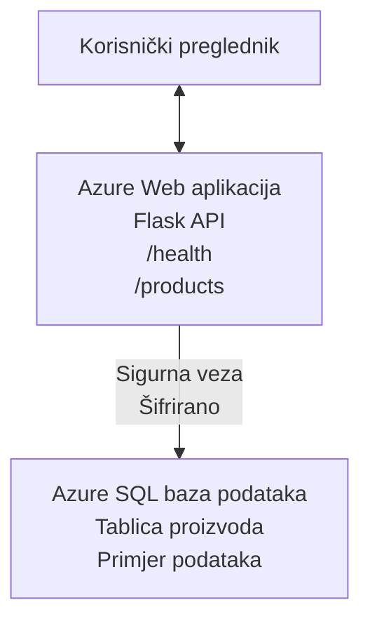

# Implementacija Microsoft SQL baze podataka i web aplikacije pomoću AZD-a

⏱️ **Procijenjeno vrijeme**: 20-30 minuta | 💰 **Procijenjeni trošak**: ~15-25 USD/mjesečno | ⭐ **Složenost**: Srednja razina

Ovaj **potpuni, funkcionalni primjer** pokazuje kako koristiti [Azure Developer CLI (azd)](https://learn.microsoft.com/azure/developer/azure-developer-cli/) za implementaciju Python Flask web aplikacije s Microsoft SQL bazom podataka na Azure. Sav kod je uključen i testiran — bez potrebe za vanjskim ovisnostima.

## Što ćete naučiti

Izvršavanjem ovog primjera naučit ćete:
- Implementirati višeslojnu aplikaciju (web aplikacija + baza podataka) koristeći infrastrukturu kao kod
- Konfigurirati sigurne veze prema bazi bez tvrdog kodiranja tajni
- Pratiti zdravlje aplikacije pomoću Application Insights
- Učinkovito upravljati Azure resursima pomoću AZD CLI-a
- Slijediti Azure najbolje prakse za sigurnost, optimizaciju troškova i promatranje sustava

## Pregled scenarija
- **Web aplikacija**: Python Flask REST API s povezivanjem na bazu podataka
- **Baza podataka**: Azure SQL baza s primjerom podataka
- **Infrastruktura**: Provisionirana pomoću Bicepa (modularni, višekratno upotrebljivi predlošci)
- **Implementacija**: Potpuno automatizirana pomoću naredbi `azd`
- **Praćenje**: Application Insights za zapisnike i telemetriju

## Preduvjeti

### Potrebni alati

Prije početka, provjerite imate li instalirane ove alate:

1. **[Azure CLI](https://learn.microsoft.com/cli/azure/install-azure-cli)** (verzija 2.50.0 ili novija)
   ```sh
   az --version
   # Očekivani izlaz: azure-cli 2.50.0 ili noviji
   ```

2. **[Azure Developer CLI (azd)](https://learn.microsoft.com/azure/developer/azure-developer-cli/install-azd)** (verzija 1.0.0 ili novija)
   ```sh
   azd version
   # Očekivani izlaz: azd verzija 1.0.0 ili novija
   ```

3. **[Python 3.8+](https://www.python.org/downloads/)** (za lokalni razvoj)
   ```sh
   python --version
   # Očekivani izlaz: Python 3.8 ili viši
   ```

4. **[Docker](https://www.docker.com/get-started)** (opcionalno, za lokalni razvoj u kontejnerima)
   ```sh
   docker --version
   # Očekivani rezultat: Docker verzija 20.10 ili viša
   ```

### Azure zahtjevi

- Aktivna **Azure pretplata** ([kreirajte besplatan račun](https://azure.microsoft.com/free/))
- Dozvole za stvaranje resursa u vašoj pretplati
- Uloga **Owner** ili **Contributor** na pretplati ili grupi resursa

### Potrebno znanje

Ovo je **primjer srednje razine**. Trebali biste biti upoznati sa:
- Osnovnim operacijama u komandnoj liniji
- Temeljima cloud koncepta (resursi, grupe resursa)
- Osnovama web aplikacija i baza podataka

**Niste upoznati s AZD-om?** Počnite s [Vodičem za početnike](../../docs/chapter-01-foundation/azd-basics.md).

## Arhitektura

Ovaj primjer implementira dvoslojnu arhitekturu s web aplikacijom i SQL bazom:


**Implementacija resursa:**
- **Grupa resursa**: Kontejner za sve resurse
- **App Service Plan**: Linux hosting (B1 tier za isplativost)
- **Web aplikacija**: Python 3.11 runtime s Flask aplikacijom
- **SQL Server**: Managed poslužitelj baze s TLS 1.2 minimalno
- **SQL baza podataka**: Basic tier (2GB, prikladno za razvoj/testiranje)
- **Application Insights**: Praćenje i zapisivanje
- **Log Analytics Workspace**: Centralizirano spremište zapisnika

**Analiza**: Zamislite ovo kao restoran (web aplikacija) s hladnjakom (baza podataka). Korisnici naručuju s menija (API endpointi), a kuhinja (Flask aplikacija) pribavlja sastojke (podatke) iz hladnjaka. Uprava restorana (Application Insights) prati sve što se događa.

## Struktura mapa

Svi su datoteke uključene u ovaj primjer — bez vanjskih ovisnosti:

```
examples/database-app/
│
├── README.md                    # This file
├── azure.yaml                   # AZD configuration file
├── .env.sample                  # Sample environment variables
├── .gitignore                   # Git ignore patterns
│
├── infra/                       # Infrastructure as Code (Bicep)
│   ├── main.bicep              # Main orchestration template
│   ├── abbreviations.json      # Azure naming conventions
│   └── resources/              # Modular resource templates
│       ├── sql-server.bicep    # SQL Server configuration
│       ├── sql-database.bicep  # Database configuration
│       ├── app-service-plan.bicep  # Hosting plan
│       ├── app-insights.bicep  # Monitoring setup
│       └── web-app.bicep       # Web application
│
└── src/
    └── web/                    # Application source code
        ├── app.py              # Flask REST API
        ├── requirements.txt    # Python dependencies
        └── Dockerfile          # Container definition
```

**Što svaka datoteka radi:**
- **azure.yaml**: Označava AZD-u što i gdje implementirati
- **infra/main.bicep**: Orkestrira sve Azure resurse
- **infra/resources/*.bicep**: Definicije pojedinih resursa (modularno za ponovnu upotrebu)
- **src/web/app.py**: Flask aplikacija s logikom baze podataka
- **requirements.txt**: Python paketi i ovisnosti
- **Dockerfile**: Upute za kontejnerizaciju i implementaciju

## Brzi početak (korak po korak)

### Korak 1: Klonirajte i uđite u mapu

```sh
git clone https://github.com/microsoft/AZD-for-beginners.git
cd AZD-for-beginners/examples/database-app
```

**✓ Provjera uspjeha**: Provjerite jesu li prisutni `azure.yaml` i mapa `infra/`:
```sh
ls
# Očekivano: README.md, azure.yaml, infra/, src/
```

### Korak 2: Autentifikacija u Azure

```sh
azd auth login
```

Ovo otvara preglednik za Azure autentifikaciju. Prijavite se svojim Azure korisničkim podacima.

**✓ Provjera uspjeha**: Trebali biste vidjeti:
```
Logged in to Azure.
```

### Korak 3: Inicijalizirajte okruženje

```sh
azd init
```

**Što se događa**: AZD kreira lokalnu konfiguraciju za vašu implementaciju.

**Pojavit će se upiti**:
- **Ime okruženja**: Unesite kratko ime (npr. `dev`, `myapp`)
- **Azure pretplata**: Odaberite pretplatu s liste
- **Azure lokacija**: Odaberite regiju (npr. `eastus`, `westeurope`)

**✓ Provjera uspjeha**: Trebali biste vidjeti:
```
SUCCESS: New project initialized!
```

### Korak 4: Provisioniranje Azure resursa

```sh
azd provision
```

**Što se događa**: AZD implementira svu infrastrukturu (traje 5-8 minuta):
1. Stvara grupu resursa
2. Stvara SQL poslužitelj i bazu
3. Stvara App Service Plan
4. Stvara Web App
5. Stvara Application Insights
6. Konfigurira mrežu i sigurnost

**Bit ćete upitani za**:
- **Korisničko ime SQL administratora**: Unesite korisničko ime (npr. `sqladmin`)
- **Lozinku SQL administratora**: Unesite jaku lozinku (spremite je!)

**✓ Provjera uspjeha**: Trebali biste vidjeti:
```
SUCCESS: Your application was provisioned in Azure in X minutes Y seconds.
You can view the resources created under the resource group rg-<env-name> in Azure Portal:
https://portal.azure.com/#@/resource/subscriptions/.../resourceGroups/rg-<env-name>
```

**⏱️ Vrijeme**: 5-8 minuta

### Korak 5: Deploy aplikacije

```sh
azd deploy
```

**Što se događa**: AZD gradi i implementira vašu Flask aplikaciju:
1. Paketira Python aplikaciju
2. Gradi Docker kontejner
3. Pushing na Azure Web App
4. Inicijalizira bazu s primjerom podataka
5. Pokreće aplikaciju

**✓ Provjera uspjeha**: Trebali biste vidjeti:
```
SUCCESS: Your application was deployed to Azure in X minutes Y seconds.
You can view the resources created under the resource group rg-<env-name> in Azure Portal:
https://portal.azure.com/#@/resource/subscriptions/.../resourceGroups/rg-<env-name>
```

**⏱️ Vrijeme**: 3-5 minuta

### Korak 6: Pregledajte aplikaciju

```sh
azd browse
```

Ovo otvara vašu implementiranu web aplikaciju u pregledniku na adresi `https://app-<unique-id>.azurewebsites.net`

**✓ Provjera uspjeha**: Trebali biste vidjeti JSON izlaz:
```json
{
  "message": "Welcome to the Database App API",
  "endpoints": {
    "/": "This help message",
    "/health": "Health check endpoint",
    "/products": "List all products",
    "/products/<id>": "Get product by ID"
  }
}
```

### Korak 7: Testirajte API endpointove

**Provjera zdravlja** (provjera veze na bazu):
```sh
curl https://app-<your-id>.azurewebsites.net/health
```

**Očekivani odgovor**:
```json
{
  "status": "healthy",
  "database": "connected"
}
```

**Popis proizvoda** (primjer podataka):
```sh
curl https://app-<your-id>.azurewebsites.net/products
```

**Očekivani odgovor**:
```json
[
  {
    "id": 1,
    "name": "Laptop",
    "description": "High-performance laptop",
    "price": 1299.99,
    "created_at": "2025-11-19T10:30:00"
  },
  ...
]
```

**Detalji pojedinog proizvoda**:
```sh
curl https://app-<your-id>.azurewebsites.net/products/1
```

**✓ Provjera uspjeha**: Svi endpointi vraćaju JSON podatke bez pogrešaka.

---

**🎉 Čestitamo!** Uspješno ste implementirali web aplikaciju s bazom na Azure pomoću AZD-a.

## Detaljna konfiguracija

### Okolišne varijable

Tajne se sigurno upravljaju kroz Azure App Service konfiguraciju — **nikada nisu tvrdo kodirane u izvornom kodu**.

**Automatski konfigurirano od strane AZD-a**:
- `SQL_CONNECTION_STRING`: Poveznica na bazu s enkriptiranim vjerodajnicama
- `APPLICATIONINSIGHTS_CONNECTION_STRING`: Endpoint za telemetriju praćenja
- `SCM_DO_BUILD_DURING_DEPLOYMENT`: Omogućava automatsku instalaciju ovisnosti

**Gdje se pohranjuju tajne**:
1. Tijekom `azd provision` unosite SQL vjerodajnice putem sigurnih upita
2. AZD ih pohranjuje u lokalnu `.azure/<ime-okruženja>/.env` datoteku (ignoriranu u Gitu)
3. AZD ih ubacuje u konfiguraciju Azure App Servicea (šifrirano u mirovanju)
4. Aplikacija ih čita preko `os.getenv()` pri pokretanju

### Lokalni razvoj

Za lokalno testiranje, kreirajte `.env` datoteku iz uzorka:

```sh
cp .env.sample .env
# Uredite .env s vezom na vašu lokalnu bazu podataka
```

**Radni tok lokalnog razvoja**:
```sh
# Instalirajte ovisnosti
cd src/web
pip install -r requirements.txt

# Postavite varijable okoline
export SQL_CONNECTION_STRING="your-local-connection-string"

# Pokrenite aplikaciju
python app.py
```

**Testirajte lokalno**:
```sh
curl http://localhost:8000/health
# Očekivano: {"status": "zdrav", "baza podataka": "povezana"}
```

### Infrastruktura kao kod

Svi Azure resursi definirani su u **Bicep predlošcima** (`infra/` mapa):

- **Modularni dizajn**: Svaka vrsta resursa ima svoju datoteku za ponovnu upotrebu
- **Parametrizirano**: Prilagodite SKU, regije, nazive
- **Najbolje prakse**: Slijedi Azure standarde imenovanja i sigurnosne zadane postavke
- **Verzionirano**: Promjene infrastrukture prate se u Gitu

**Primjer prilagodbe**:
Za promjenu tier baze, uredite `infra/resources/sql-database.bicep`:
```bicep
sku: {
  name: 'Standard'  // Changed from 'Basic'
  tier: 'Standard'
  capacity: 10
}
```

## Najbolje sigurnosne prakse

Ovaj primjer slijedi Azure najbolje sigurnosne prakse:

### 1. **Nema tajni u izvornom kodu**
- ✅ Vjerodajnice pohranjene u konfiguraciji Azure App Servicea (šifrirano)
- ✅ `.env` datoteke izuzete iz Gita putem `.gitignore`
- ✅ Tajne se dostavljaju sigurnim parametrima pri provisioningu

### 2. **Šifrirane veze**
- ✅ TLS 1.2 minimalno za SQL Server
- ✅ Samo HTTPS za Web App
- ✅ Veze prema bazi su kriptirane

### 3. **Mrežna sigurnost**
- ✅ Firewall SQL Servera dozvoljava samo Azure servise
- ✅ Javni mrežni pristup ograničen (može se dodatno zaključati pomoću privatnih endpointa)
- ✅ FTPS onemogućen na Web App-u

### 4. **Autentifikacija i autorizacija**
- ⚠️ **Trenutno**: SQL autentifikacija (korisničko ime/lozinka)
- ✅ **Preporuka za produkciju**: Koristiti Azure Managed Identity za autentifikaciju bez lozinke

**Kako nadograditi na Managed Identity** (za produkciju):
1. Omogućite managed identity na Web Appu
2. Dodijelite SQL dozvole identitetu
3. Ažurirajte connection string za managed identity
4. Uklonite autentifikaciju zasnovanu na lozinci

### 5. **Revizija i usklađenost**
- ✅ Application Insights bilježi sve zahtjeve i pogreške
- ✅ Revizija SQL baze povučena (može se konfigurirati za usklađenost)
- ✅ Svi resursi označeni za upravljanje

**Sigurnosna provjera prije produkcije**:
- [ ] Omogućiti Azure Defender za SQL
- [ ] Konfigurirati privatne endpointove za SQL bazu
- [ ] Omogućiti Web Application Firewall (WAF)
- [ ] Implementirati Azure Key Vault za rotiranje tajni
- [ ] Konfigurirati Azure AD autentifikaciju
- [ ] Omogućiti dijagnostičko zapisivanje za sve resurse

## Optimizacija troškova

**Procijenjeni mjesečni troškovi** (stanje u studenom 2025.):

| Resurs | SKU/Tier | Procijenjeni trošak |
|----------|----------|--------------------|
| App Service Plan | B1 (Basic) | ~13 USD/mjesečno |
| SQL baza podataka | Basic (2GB) | ~5 USD/mjesečno |
| Application Insights | Plaćanje po korištenju | ~2 USD/mjesečno (nisk promet) |
| **Ukupno** | | **~20 USD/mjesečno** |

**💡 Savjeti za uštedu troškova**:

1. **Koristite besplatni sloj za učenje**:
   - App Service: F1 tier (besplatno, ograničeno sati)
   - SQL baza: Koristite Azure SQL Database serverless
   - Application Insights: 5GB/mjesečno besplatno unosa

2. **Zaustavite resurse kada nisu u upotrebi**:
   ```sh
   # Zaustavi web aplikaciju (baza podataka se i dalje naplaćuje)
   az webapp stop --name <app-name> --resource-group <rg-name>
   
   # Ponovno pokreni kad je potrebno
   az webapp start --name <app-name> --resource-group <rg-name>
   ```

3. **Izbrišite sve nakon testiranja**:
   ```sh
   azd down
   ```
   Ovo uklanja SVE resurse i zaustavlja naplatu.

4. **Razlika između razvojnih i produkcijskih SKU-a**:
   - **Razvoj**: Basic tier (korišten u ovom primjeru)
   - **Produkcija**: Standard/Premium tier s redundantnošću

**Praćenje troškova**:
- Pregled troškova u [Azure Cost Management](https://portal.azure.com/#view/Microsoft_Azure_CostManagement)
- Postavite upozorenja za troškove da izbjegnete iznenađenja
- Označite sve resurse s `azd-env-name` radi praćenja

**Alternativa besplatnom sloju**:
Za potrebe učenja, možete promijeniti `infra/resources/app-service-plan.bicep`:
```bicep
sku: {
  name: 'F1'  // Free tier
  tier: 'Free'
}
```
**Napomena**: Besplatni sloj ima ograničenja (60 min/dan CPU, nema always-on).

## Praćenje i promatranje

### Integracija s Application Insights

Ovaj primjer uključuje **Application Insights** za sveobuhvatno praćenje:

**Što se prati**:
- ✅ HTTP zahtjevi (latencija, statusni kodovi, endpointi)
- ✅ Pogreške i iznimke u aplikaciji
- ✅ Prilagođeno zapisivanje iz Flask aplikacije
- ✅ Zdravlje veze s bazom podataka
- ✅ Metrike performansi (CPU, memorija)

**Kako pristupiti Application Insights**:
1. Otvorite [Azure Portal](https://portal.azure.com)
2. Idite u grupu resursa (`rg-<ime-okruženja>`)
3. Kliknite na Application Insights resurs (`appi-<unique-id>`)

**Korisni upiti** (Application Insights → Logs):

**Prikaži sve zahtjeve**:
```kusto
requests
| where timestamp > ago(1h)
| order by timestamp desc
| project timestamp, name, url, resultCode, duration
```

**Pronađi pogreške**:
```kusto
exceptions
| where timestamp > ago(24h)
| order by timestamp desc
| project timestamp, type, outerMessage, operation_Name
```

**Provjeri Health endpoint**:
```kusto
requests
| where name contains "health"
| summarize count() by resultCode, bin(timestamp, 1h)
```

### Revizija SQL baze podataka

**Omogućena je revizija SQL baze** za praćenje:
- Obrasci pristupa bazi
- Neuspjele prijave
- Promjene sheme
- Pristup podacima (za usklađenost)

**Kako pristupiti audit zapisnicima**:
1. Azure Portal → SQL baza → Auditing
2. Pregledajte zapise u Log Analytics workspace

### Praćenje u stvarnom vremenu

**Pregledajte live metrike**:
1. Application Insights → Live Metrics
2. Pratite zahtjeve, neuspjehe i performanse u stvarnom vremenu

**Postavljanje upozorenja**:
Kreirajte upozorenja za kritične događaje:
- HTTP 500 pogreške > 5 u 5 minuta
- Poteškoće u povezivanju s bazom
- Visoka vrijeme odziva (>2 sekunde)

**Primjer kreiranja upozorenja**:
```sh
az monitor metrics alert create \
  --name "High-Response-Time" \
  --resource-group <rg-name> \
  --scopes <app-insights-resource-id> \
  --condition "avg requests/duration > 2000" \
  --description "Alert when response time exceeds 2 seconds"
```

## Rješavanje problema
### Česti problemi i rješenja

#### 1. `azd provision` ne uspijeva s porukom "Location not available"

**Simptomi**:  
```
Error: The subscription is not registered for the resource type 'components' in the location 'centralus'.
```
  
**Rješenje**:  
Odaberite drugačiju Azure regiju ili registrirajte pružatelja resursa:  
```sh
az provider register --namespace Microsoft.Insights
```
  
#### 2. SQL veza ne uspijeva tijekom implementacije

**Simptomi**:  
```
pyodbc.OperationalError: ('08001', '[08001] [Microsoft][ODBC Driver 18 for SQL Server]TCP Provider...')
```
  
**Rješenje**:  
- Provjerite da vatrozid SQL Servera dopušta Azure usluge (automatski konfigurirano)  
- Provjerite je li lozinka SQL administratora unesena ispravno tijekom `azd provision`  
- Osigurajte da je SQL Server u potpunosti provisioniran (može potrajati 2-3 minute)

**Provjera veze**:  
```sh
# Iz Azure Portala, idite na SQL bazu podataka → Uređivač upita
# Pokušajte se povezati sa svojim vjerodajnicama
```
  
#### 3. Web aplikacija prikazuje "Application Error"

**Simptomi**:  
Preglednik prikazuje opću stranicu s greškom.

**Rješenje**:  
Provjerite zapise aplikacije:  
```sh
# Pregledaj nedavne zapise
az webapp log tail --name <app-name> --resource-group <rg-name>
```
  
**Uobičajeni uzroci**:  
- Nedostaju varijable okoline (provjerite App Service → Configuration)  
- Instalacija Python paketa nije uspjela (provjerite zapise implementacije)  
- Greška pri inicijalizaciji baze podataka (provjerite povezanost sa SQL-om)

#### 4. `azd deploy` ne uspijeva s porukom "Build Error"

**Simptomi**:  
```
Error: Failed to build project
```
  
**Rješenje**:  
- Osigurajte da `requirements.txt` nema sintaksnih grešaka  
- Provjerite da je Python 3.11 specificiran u `infra/resources/web-app.bicep`  
- Potvrdite da Dockerfile ima ispravnu osnovnu sliku

**Debug lokalno**:  
```sh
cd src/web
docker build -t test-app .
docker run -p 8000:8000 test-app
```
  
#### 5. "Unauthorized" prilikom pokretanja AZD naredbi

**Simptomi**:  
```
ERROR: (Unauthorized) The client '<id>' with object id '<id>' does not have authorization
```
  
**Rješenje**:  
Ponovno se autentificirajte u Azure:  
```sh
azd auth login
az login
```
  
Provjerite imate li ispravne dozvole (Contributor ulogu) na pretplatu.

#### 6. Visoki troškovi baze podataka

**Simptomi**:  
Neočekivani račun za Azure.

**Rješenje**:  
- Provjerite jeste li zaboravili pokrenuti `azd down` nakon testiranja  
- Provjerite da SQL baza koristi osnovni (Basic) sloj, a ne Premium  
- Pregledajte troškove u Azure Cost Management-u  
- Postavite upozorenja o troškovima

### Dobivanje pomoći

**Prikaži sve AZD varijable okoline**:  
```sh
azd env get-values
```
  
**Provjeri status implementacije**:  
```sh
az webapp show --name <app-name> --resource-group <rg-name> --query state
```
  
**Pristupi zapisima aplikacije**:  
```sh
az webapp log download --name <app-name> --resource-group <rg-name> --log-file app-logs.zip
```
  
**Trebate dodatnu pomoć?**  
- [AZD vodič za rješavanje problema](../../docs/chapter-07-troubleshooting/common-issues.md)  
- [Azure App Service rješavanje problema](https://learn.microsoft.com/azure/app-service/troubleshoot-diagnostic-logs)  
- [Azure SQL rješavanje problema](https://learn.microsoft.com/azure/azure-sql/database/troubleshoot-common-errors-issues)

## Praktične vježbe

### Vježba 1: Provjera vaše implementacije (Početnik)

**Cilj**: Potvrditi da su svi resursi implementirani i da aplikacija radi.

**Koraci**:  
1. Nabrojite sve resurse u grupi resursa:  
   ```sh
   az resource list --resource-group rg-<env-name> --output table
   ```
   **Očekivano**: 6-7 resursa (Web App, SQL Server, SQL Database, App Service Plan, Application Insights, Log Analytics)

2. Testirajte sve API krajnje točke:  
   ```sh
   curl https://app-<your-id>.azurewebsites.net/
   curl https://app-<your-id>.azurewebsites.net/health
   curl https://app-<your-id>.azurewebsites.net/products
   curl https://app-<your-id>.azurewebsites.net/products/1
   ```
   **Očekivano**: Sve vraćaju valjani JSON bez pogrešaka

3. Provjerite Application Insights:  
   - Idite na Application Insights u Azure Portalu  
   - Otvorite "Live Metrics"  
   - Osvježite preglednik na web aplikaciji  
   **Očekivano**: Prikaz dolaznih zahtjeva u stvarnom vremenu

**Kriterij uspjeha**: Svi 6-7 resursa postoje, sve krajnje točke vraćaju podatke, Live Metrics prikazuje aktivnost.

---

### Vježba 2: Dodavanje nove API krajnje točke (Srednje)

**Cilj**: Proširiti Flask aplikaciju s novom krajnjom točkom.

**Početni kod**: Trenutne krajnje točke u `src/web/app.py`

**Koraci**:  
1. Uredite `src/web/app.py` i dodajte novu krajnju točku nakon funkcije `get_product()`:  
   ```python
   @app.route('/products/search/<keyword>')
   def search_products(keyword):
       """Search products by name or description."""
       try:
           conn = get_db_connection()
           cursor = conn.cursor()
           cursor.execute(
               "SELECT id, name, description, price, created_at FROM products WHERE name LIKE ? OR description LIKE ?",
               (f'%{keyword}%', f'%{keyword}%')
           )
           
           products = []
           for row in cursor.fetchall():
               products.append({
                   'id': row[0],
                   'name': row[1],
                   'description': row[2],
                   'price': float(row[3]) if row[3] else None,
                   'created_at': row[4].isoformat() if row[4] else None
               })
           
           cursor.close()
           conn.close()
           
           logger.info(f"Search for '{keyword}' returned {len(products)} results")
           return jsonify(products), 200
           
       except Exception as e:
           logger.error(f"Error searching products: {str(e)}")
           return jsonify({'error': str(e)}), 500
   ```
  
2. Implementirajte ažuriranu aplikaciju:  
   ```sh
   azd deploy
   ```
  
3. Testirajte novu krajnju točku:  
   ```sh
   curl https://app-<your-id>.azurewebsites.net/products/search/laptop
   ```
   **Očekivano**: Vraća proizvode koji odgovaraju "laptop"

**Kriterij uspjeha**: Nova krajnja točka radi, vraća filtrirane rezultate, pojavljuju se u Application Insights zapisima.

---

### Vježba 3: Dodavanje nadzora i upozorenja (Napredno)

**Cilj**: Postaviti proaktivni nadzor s upozorenjima.

**Koraci**:  
1. Kreirajte upozorenje za HTTP 500 greške:  
   ```sh
   # Dohvati ID resursa Application Insights
   AI_ID=$(az monitor app-insights component show \
     --app appi-<your-id> \
     --resource-group rg-<env-name> \
     --query id -o tsv)
   
   # Kreiraj upozorenje
   az monitor metrics alert create \
     --name "High-Error-Rate" \
     --resource-group rg-<env-name> \
     --scopes $AI_ID \
     --condition "count requests/failed > 5" \
     --window-size 5m \
     --evaluation-frequency 1m \
     --description "Alert when >5 failed requests in 5 minutes"
   ```
  
2. Pokrenite upozorenje izazivanjem grešaka:  
   ```sh
   # Zahtjev za nepostojeći proizvod
   for i in {1..10}; do curl https://app-<your-id>.azurewebsites.net/products/999; done
   ```
  
3. Provjerite je li upozorenje aktivirano:  
   - Azure Portal → Alerts → Alert Rules  
   - Provjerite email (ako je konfiguriran)

**Kriterij uspjeha**: Pravilo upozorenja je kreirano, aktivira se na greške, notifikacije su primljene.

---

### Vježba 4: Promjene sheme baze podataka (Napredno)

**Cilj**: Dodati novu tablicu i izmijeniti aplikaciju da ju koristi.

**Koraci**:  
1. Povežite se s SQL bazom putem Azure Portala Query Editora  

2. Kreirajte novu tablicu `categories`:  
   ```sql
   CREATE TABLE categories (
       id INT PRIMARY KEY IDENTITY(1,1),
       name NVARCHAR(50) NOT NULL,
       description NVARCHAR(200)
   );
   
   INSERT INTO categories (name, description) VALUES
   ('Electronics', 'Electronic devices and accessories'),
   ('Office Supplies', 'Office equipment and supplies');
   
   -- Add category to products table
   ALTER TABLE products ADD category_id INT;
   UPDATE products SET category_id = 1; -- Set all to Electronics
   ```
  
3. Ažurirajte `src/web/app.py` da uključi podatke o kategoriji u odgovore  

4. Implementirajte i testirajte

**Kriterij uspjeha**: Nova tablica postoji, proizvodi prikazuju podatke o kategoriji, aplikacija ispravno radi.

---

### Vježba 5: Implementacija cachinga (Ekspert)

**Cilj**: Dodati Azure Redis Cache za poboljšanje performansi.

**Koraci**:  
1. Dodajte Redis Cache u `infra/main.bicep`  
2. Ažurirajte `src/web/app.py` za keširanje upita proizvoda  
3. Mjerite poboljšanje performansi s Application Insights  
4. Usporedite vrijeme odziva prije i poslije cacheiranja

**Kriterij uspjeha**: Redis je implementiran, caching radi, vrijeme odziva se poboljšalo za >50%.

**Savjet**: Počnite s [Azure Cache for Redis dokumentacijom](https://learn.microsoft.com/azure/azure-cache-for-redis/).

---

## Čišćenje

Da biste izbjegli kontinuirane troškove, izbrišite sve resurse nakon završetka:

```sh
azd down
```
  
**Potvrda**:  
```
? Total resources to delete: 7, are you sure you want to continue? (y/N)
```
  
Upišite `y` za potvrdu.

**✓ Provjera uspješnosti**:  
- Svi resursi su izbrisani iz Azure Portala  
- Nema aktivnih troškova  
- Lokalna mapa `.azure/<env-name>` može se izbrisati

**Alternativa** (zadržavanje infrastrukture, brisanje podataka):  
```sh
# Izbrišite samo grupu resursa (zadržite AZD konfiguraciju)
az group delete --name rg-<env-name> --yes
```
## Saznajte više

### Povezana dokumentacija
- [Azure Developer CLI dokumentacija](https://learn.microsoft.com/azure/developer/azure-developer-cli/)  
- [Azure SQL Database dokumentacija](https://learn.microsoft.com/azure/azure-sql/database/)  
- [Azure App Service dokumentacija](https://learn.microsoft.com/azure/app-service/)  
- [Application Insights dokumentacija](https://learn.microsoft.com/azure/azure-monitor/app/app-insights-overview)  
- [Bicep jezični referent](https://learn.microsoft.com/azure/azure-resource-manager/bicep/)

### Sljedeći koraci u ovom tečaju
- **[Primjer Container Apps](../../../../examples/container-app)**: Implementacija mikroservisa s Azure Container Apps  
- **[Vodič za AI integraciju](../../../../docs/ai-foundry)**: Dodajte AI mogućnosti svojoj aplikaciji  
- **[Prakse implementacije](../../docs/chapter-04-infrastructure/deployment-guide.md)**: Obrasci implementacije za produkciju

### Napredne teme
- **Managed Identity**: Uklonite lozinke i koristite Azure AD autentifikaciju  
- **Private Endpoints**: Osigurajte veze s bazom unutar virtualne mreže  
- **CI/CD integracija**: Automatizirajte implementacije s GitHub Actions ili Azure DevOps  
- **Više okruženja**: Postavite razvojno, testno i produkcijsko okruženje  
- **Migracije baze podataka**: Koristite Alembic ili Entity Framework za verzioniranje sheme

### Usporedba s drugim pristupima

**AZD naspram ARM šablona**:  
- ✅ AZD: Apstrakcija višeg nivoa, jednostavnije naredbe  
- ⚠️ ARM: Opširniji, detaljnija kontrola

**AZD naspram Terraform-a**:  
- ✅ AZD: Nativan Azure alat, integriran sa Azure uslugama  
- ⚠️ Terraform: Podrška za više cloud servisa, veći ekosustav

**AZD naspram Azure Portala**:  
- ✅ AZD: Ponavljajuće, verzionirano, automatizirano  
- ⚠️ Portal: Rukom upravljano, teško reproducirati

**Zamislite AZD kao**: Docker Compose za Azure—pojednostavljena konfiguracija za složene implementacije.

---

## Često postavljana pitanja

**P: Mogu li koristiti drugi programski jezik?**  
O: Da! Zamijenite `src/web/` s Node.js, C#, Go ili bilo kojim jezikom. Ažurirajte `azure.yaml` i Bicep sukladno tome.

**P: Kako dodati više baza podataka?**  
O: Dodajte još jedan SQL Database modul u `infra/main.bicep` ili koristite PostgreSQL/MySQL iz Azure Database usluga.

**P: Mogu li ovo koristiti u produkciji?**  
O: Ovo je polazna točka. Za produkciju dodajte: managed identity, private endpoints, redundanciju, strategiju backup-a, WAF, poboljšani nadzor.

**P: Što ako želim koristiti kontejnere umjesto implementacije koda?**  
O: Pogledajte [Primjer Container Apps](../../../../examples/container-app) koji koristi Docker kontejnere u cijelosti.

**P: Kako se spojiti na bazu podataka sa svog lokalnog računala?**  
O: Dodajte svoju IP adresu u vatrozid SQL Servera:  
```sh
az sql server firewall-rule create \
  --resource-group rg-<env-name> \
  --server sql-<unique-id> \
  --name AllowMyIP \
  --start-ip-address <your-ip> \
  --end-ip-address <your-ip>
```
  
**P: Mogu li koristiti postojeću bazu umjesto nove?**  
O: Da, modificirajte `infra/main.bicep` da referencira postojeći SQL Server i ažurirajte parametre stringa veze.

---

> **Napomena:** Ovaj primjer prikazuje najbolje prakse za implementaciju web aplikacije s bazom podataka koristeći AZD. Uključuje radni kod, opširnu dokumentaciju i praktične vježbe za jačanje učenja. Za produkcijske implementacije, pregledajte sigurnost, skaliranje, usklađenost i zahtjeve troškova specifične za vašu organizaciju.

**📚 Navigacija kroz tečaj:**  
- ← Prethodno: [Primjer Container Apps](../../../../examples/container-app)  
- → Sljedeće: [Vodič za AI integraciju](../../../../docs/ai-foundry)  
- 🏠 [Početna stranica tečaja](../../README.md)

---

<!-- CO-OP TRANSLATOR DISCLAIMER START -->
**Odricanje od odgovornosti**:  
Ovaj dokument preveden je uz pomoć AI servisa za prevođenje [Co-op Translator](https://github.com/Azure/co-op-translator). Iako težimo točnosti, imajte na umu da automatizirani prijevodi mogu sadržavati pogreške ili netočnosti. Izvorni dokument na izvornom jeziku treba smatrati službenim i autoritativnim izvorom. Za kritične informacije preporučuje se profesionalni ljudski prijevod. Nismo odgovorni za bilo kakve nesporazume ili pogrešne interpretacije proizašle iz korištenja ovog prijevoda.
<!-- CO-OP TRANSLATOR DISCLAIMER END -->