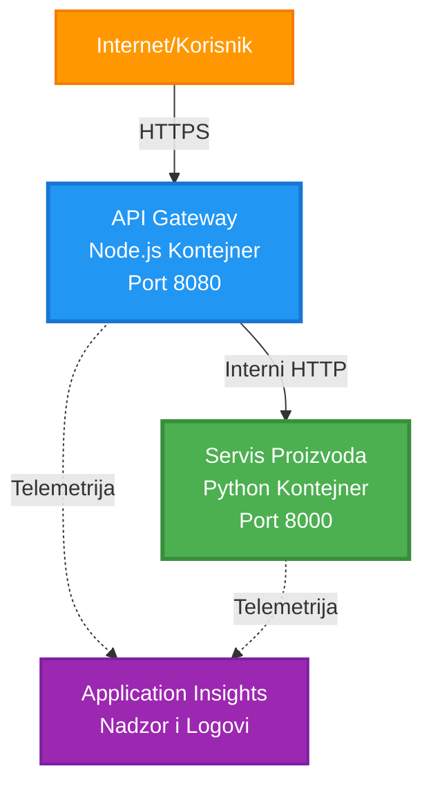
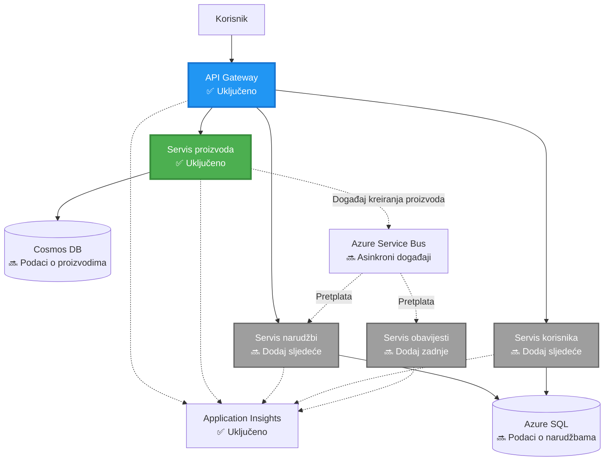
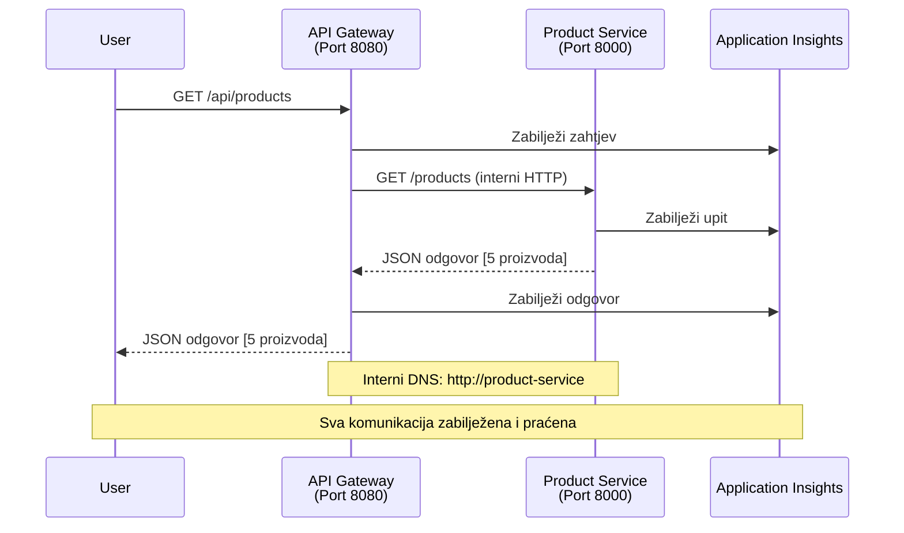

# Arhitektura mikroservisa - Primjer aplikacije u kontejneru

⏱️ **Procijenjeno vrijeme**: 25-35 minuta | 💰 **Procijenjeni trošak**: ~$50-100/mjesečno | ⭐ **Složenost**: Napredno

**📚 Put učenja:**
- ← Prethodno: [Jednostavni Flask API](../../../../examples/container-app/simple-flask-api) - Osnove jednog kontejnera
- 🎯 **Ovdje ste**: Arhitektura mikroservisa (osnova s 2 servisa)
- → Sljedeće: [Integracija AI-a](../../../../docs/ai-foundry) - Dodajte inteligenciju svojim servisima
- 🏠 [Početna stranica tečaja](../../README.md)

---

**Pojednostavljena, ali funkcionalna** arhitektura mikroservisa implementirana na Azure Container Apps pomoću AZD CLI-a. Ovaj primjer demonstrira komunikaciju između servisa, orkestraciju kontejnera i praćenje s praktičnim postavkama za 2 servisa.

> **📚 Pristup učenju**: Ovaj primjer započinje s minimalnom arhitekturom od 2 servisa (API Gateway + Backend Service) koju možete implementirati i učiti iz nje. Nakon što savladate ovu osnovu, pružamo smjernice za proširenje na cjelokupni ekosustav mikroservisa.

## Što ćete naučiti

Dovršavanjem ovog primjera, naučit ćete:
- Implementirati više kontejnera na Azure Container Apps
- Postaviti komunikaciju između servisa s internim umrežavanjem
- Konfigurirati skaliranje i provjere zdravlja temeljene na okruženju
- Pratiti distribuirane aplikacije pomoću Application Insights
- Razumjeti obrasce implementacije mikroservisa i najbolje prakse
- Naučiti progresivno proširivanje od jednostavnih do složenih arhitektura

## Arhitektura

### Faza 1: Što gradimo (uključeno u ovaj primjer)


**Detalji komponenti:**

| Komponenta | Svrha | Pristup | Resursi |
|------------|-------|---------|---------|
| **API Gateway** | Usmjerava vanjske zahtjeve prema backend servisima | Javni (HTTPS) | 1 vCPU, 2GB RAM, 2-20 replika |
| **Product Service** | Upravljanje katalogom proizvoda s podacima u memoriji | Samo interno | 0.5 vCPU, 1GB RAM, 1-10 replika |
| **Application Insights** | Centralizirano logiranje i distribuirano praćenje | Azure Portal | 1-2 GB/mjesečno unosa podataka |

**Zašto početi jednostavno?**
- ✅ Brza implementacija i razumijevanje (25-35 minuta)
- ✅ Učenje osnovnih obrazaca mikroservisa bez složenosti
- ✅ Funkcionalan kod koji možete prilagoditi i eksperimentirati s njim
- ✅ Niži troškovi za učenje (~$50-100/mjesečno naspram $300-1400/mjesečno)
- ✅ Stjecanje samopouzdanja prije dodavanja baza podataka i redova poruka

**Analogija**: Zamislite ovo kao učenje vožnje. Počinjete na praznom parkiralištu (2 servisa), savladate osnove, a zatim prelazite na gradski promet (5+ servisa s bazama podataka).

### Faza 2: Buduće proširenje (referentna arhitektura)

Nakon što savladate arhitekturu s 2 servisa, možete je proširiti na:


Pogledajte odjeljak "Vodič za proširenje" na kraju za upute korak po korak.

## Uključene značajke

✅ **Otkrivanje servisa**: Automatsko otkrivanje putem DNS-a između kontejnera  
✅ **Ravnoteža opterećenja**: Ugrađena ravnoteža opterećenja između replika  
✅ **Automatsko skaliranje**: Neovisno skaliranje po servisu na temelju HTTP zahtjeva  
✅ **Praćenje zdravlja**: Provjere liveness i readiness za oba servisa  
✅ **Distribuirano logiranje**: Centralizirano logiranje pomoću Application Insights  
✅ **Interno umrežavanje**: Sigurna komunikacija između servisa  
✅ **Orkestracija kontejnera**: Automatska implementacija i skaliranje  
✅ **Ažuriranja bez prekida rada**: Postupna ažuriranja s upravljanjem revizijama  

## Preduvjeti

### Potrebni alati

Prije početka, provjerite imate li instalirane sljedeće alate:

1. **[Azure Developer CLI (azd)](https://learn.microsoft.com/azure/developer/azure-developer-cli/install-azd)** (verzija 1.0.0 ili novija)
   ```bash
   azd version
   # Očekivani izlaz: azd verzija 1.0.0 ili novija
   ```

2. **[Azure CLI](https://learn.microsoft.com/cli/azure/install-azure-cli)** (verzija 2.50.0 ili novija)
   ```bash
   az --version
   # Očekivani izlaz: azure-cli 2.50.0 ili noviji
   ```

3. **[Docker](https://www.docker.com/get-started)** (za lokalni razvoj/testiranje - opcionalno)
   ```bash
   docker --version
   # Očekivani rezultat: Docker verzija 20.10 ili novija
   ```

### Provjera postavki

Pokrenite ove naredbe kako biste potvrdili da ste spremni:

```bash
# Provjerite Azure Developer CLI
azd version
# ✅ Očekivano: azd verzija 1.0.0 ili novija

# Provjerite Azure CLI
az --version
# ✅ Očekivano: azure-cli 2.50.0 ili novija

# Provjerite Docker (neobavezno)
docker --version
# ✅ Očekivano: Docker verzija 20.10 ili novija
```

**Kriteriji uspjeha**: Sve naredbe vraćaju brojeve verzija koji odgovaraju minimalnim zahtjevima ili ih premašuju.

### Azure zahtjevi

- Aktivna **Azure pretplata** ([kreirajte besplatni račun](https://azure.microsoft.com/free/))
- Dozvole za kreiranje resursa u vašoj pretplati
- Uloga **Contributor** na pretplati ili grupi resursa

### Preduvjeti znanja

Ovo je primjer **napredne razine**. Trebali biste imati:
- Dovršen [Jednostavni Flask API primjer](../../../../examples/container-app/simple-flask-api) 
- Osnovno razumijevanje arhitekture mikroservisa
- Poznavanje REST API-ja i HTTP-a
- Razumijevanje koncepata kontejnera

**Novi u Container Apps?** Počnite s [Jednostavnim Flask API primjerom](../../../../examples/container-app/simple-flask-api) kako biste naučili osnove.

## Brzi početak (korak po korak)

### Korak 1: Klonirajte i navigirajte

```bash
git clone https://github.com/microsoft/AZD-for-beginners.git
cd AZD-for-beginners/examples/microservices
```

**✓ Provjera uspjeha**: Provjerite vidite li `azure.yaml`:
```bash
ls
# Očekivano: README.md, azure.yaml, infra/, src/
```

### Korak 2: Autentifikacija s Azureom

```bash
azd auth login
```

Ovo otvara vaš preglednik za autentifikaciju na Azure. Prijavite se sa svojim Azure vjerodajnicama.

**✓ Provjera uspjeha**: Trebali biste vidjeti:
```
Logged in to Azure.
```

### Korak 3: Inicijalizirajte okruženje

```bash
azd init
```

**Upiti koje ćete vidjeti**:
- **Naziv okruženja**: Unesite kratko ime (npr. `microservices-dev`)
- **Azure pretplata**: Odaberite svoju pretplatu
- **Azure lokacija**: Odaberite regiju (npr. `eastus`, `westeurope`)

**✓ Provjera uspjeha**: Trebali biste vidjeti:
```
SUCCESS: New project initialized!
```

### Korak 4: Implementirajte infrastrukturu i servise

```bash
azd up
```

**Što se događa** (traje 8-12 minuta):

```mermaid
graph LR
    A[azd up] --> B[Kreiraj grupu resursa]
    B --> C[Postavi registar kontejnera]
    C --> D[Postavi analitiku dnevnika]
    D --> E[Postavi App Insights]
    E --> F[Kreiraj okruženje za kontejnere]
    F --> G[Izgradi sliku API Gateway-a]
    F --> H[Izgradi sliku usluge proizvoda]
    G --> I[Pošalji u registar]
    H --> I
    I --> J[Postavi API Gateway]
    I --> K[Postavi uslugu proizvoda]
    J --> L[Konfiguriraj Ingress i provjere zdravlja]
    K --> L
    L --> M[Implementacija završena ✓]
    
    style A fill:#2196F3,stroke:#1976D2,stroke-width:3px,color:#fff
    style M fill:#4CAF50,stroke:#388E3C,stroke-width:3px,color:#fff
```


**✓ Provjera uspjeha**: Trebali biste vidjeti:
```
SUCCESS: Your application was deployed to Azure in X minutes Y seconds.
Endpoint: https://api-gateway-<unique-id>.azurecontainerapps.io
```

**⏱️ Vrijeme**: 8-12 minuta

### Korak 5: Testirajte implementaciju

```bash
# Dohvati krajnju točku pristupnika
GATEWAY_URL=$(azd env get-values | grep API_GATEWAY_URL | cut -d '=' -f2 | tr -d '"')

# Testiraj zdravlje API pristupnika
curl $GATEWAY_URL/health
```

**✅ Očekivani izlaz:**
```json
{
  "status": "healthy",
  "service": "api-gateway",
  "timestamp": "2025-11-19T10:30:00Z"
}
```

**Testirajte product service kroz gateway**:
```bash
# Popis proizvoda
curl $GATEWAY_URL/api/products
```

**✅ Očekivani izlaz:**
```json
[
  {"id":1,"name":"Laptop","price":999.99,"stock":50},
  {"id":2,"name":"Mouse","price":29.99,"stock":200},
  {"id":3,"name":"Keyboard","price":79.99,"stock":150}
]
```

**✓ Provjera uspjeha**: Oba endpointa vraćaju JSON podatke bez grešaka.

---

**🎉 Čestitamo!** Uspješno ste implementirali arhitekturu mikroservisa na Azure!

## Struktura projekta

Svi implementacijski fajlovi su uključeni—ovo je kompletan, funkcionalan primjer:

```
microservices/
│
├── README.md                         # This file
├── azure.yaml                        # AZD configuration
├── .gitignore                        # Git ignore patterns
│
├── infra/                           # Infrastructure as Code (Bicep)
│   ├── main.bicep                   # Main orchestration
│   ├── abbreviations.json           # Naming conventions
│   ├── core/                        # Shared infrastructure
│   │   ├── container-apps-environment.bicep  # Container environment + registry
│   │   └── monitor.bicep            # Application Insights + Log Analytics
│   └── app/                         # Service definitions
│       ├── api-gateway.bicep        # API Gateway container app
│       └── product-service.bicep    # Product Service container app
│
└── src/                             # Application source code
    ├── api-gateway/                 # Node.js API Gateway
    │   ├── app.js                   # Express server with routing
    │   ├── package.json             # Node dependencies
    │   └── Dockerfile               # Container definition
    └── product-service/             # Python Product Service
        ├── main.py                  # Flask API with product data
        ├── requirements.txt         # Python dependencies
        └── Dockerfile               # Container definition
```

**Što svaka komponenta radi:**

**Infrastruktura (infra/):**
- `main.bicep`: Orkestrira sve Azure resurse i njihove ovisnosti
- `core/container-apps-environment.bicep`: Kreira Container Apps okruženje i Azure Container Registry
- `core/monitor.bicep`: Postavlja Application Insights za distribuirano logiranje
- `app/*.bicep`: Pojedinačne definicije aplikacija u kontejnerima sa skaliranjem i provjerama zdravlja

**API Gateway (src/api-gateway/):**
- Servis koji je javno dostupan i usmjerava zahtjeve prema backend servisima
- Implementira logiranje, rukovanje greškama i prosljeđivanje zahtjeva
- Demonstrira HTTP komunikaciju između servisa

**Product Service (src/product-service/):**
- Interni servis s katalogom proizvoda (u memoriji radi jednostavnosti)
- REST API s provjerama zdravlja
- Primjer obrasca backend mikroservisa

## Pregled servisa

### API Gateway (Node.js/Express)

**Port**: 8080  
**Pristup**: Javni (vanjski ulaz)  
**Svrha**: Usmjerava dolazne zahtjeve prema odgovarajućim backend servisima  

**Endpointi**:
- `GET /` - Informacije o servisu
- `GET /health` - Endpoint za provjeru zdravlja
- `GET /api/products` - Prosljeđuje prema product service (popis svih)
- `GET /api/products/:id` - Prosljeđuje prema product service (prema ID-u)

**Ključne značajke**:
- Usmjeravanje zahtjeva pomoću axiosa
- Centralizirano logiranje
- Rukovanje greškama i upravljanje timeoutima
- Otkrivanje servisa putem varijabli okruženja
- Integracija s Application Insights

**Istaknuti kod** (`src/api-gateway/app.js`):
```javascript
// Interna komunikacija usluge
app.get('/api/products', async (req, res) => {
  const response = await axios.get(`${PRODUCT_SERVICE_URL}/products`, {
    timeout: 5000
  });
  res.json(response.data);
});
```

### Product Service (Python/Flask)

**Port**: 8000  
**Pristup**: Samo interno (nema vanjskog ulaza)  
**Svrha**: Upravljanje katalogom proizvoda s podacima u memoriji  

**Endpointi**:
- `GET /` - Informacije o servisu
- `GET /health` - Endpoint za provjeru zdravlja
- `GET /products` - Popis svih proizvoda
- `GET /products/<id>` - Dohvaćanje proizvoda prema ID-u

**Ključne značajke**:
- RESTful API s Flaskom
- Pohrana proizvoda u memoriji (jednostavno, bez baze podataka)
- Praćenje zdravlja s probeovima
- Strukturirano logiranje
- Integracija s Application Insights

**Model podataka**:
```python
{
  "id": 1,
  "name": "Laptop",
  "description": "High-performance laptop",
  "price": 999.99,
  "stock": 50
}
```

**Zašto samo interno?**
Product service nije javno izložen. Svi zahtjevi moraju proći kroz API Gateway, koji pruža:
- Sigurnost: Kontrolirana točka pristupa
- Fleksibilnost: Mogućnost promjene backend-a bez utjecaja na klijente
- Praćenje: Centralizirano logiranje zahtjeva

## Razumijevanje komunikacije između servisa

### Kako servisi međusobno komuniciraju


U ovom primjeru, API Gateway komunicira s Product Service koristeći **interne HTTP pozive**:

```javascript
// API Gateway (src/api-gateway/app.js)
const PRODUCT_SERVICE_URL = process.env.PRODUCT_SERVICE_URL;

// Napravi internu HTTP zahtjev
const response = await axios.get(`${PRODUCT_SERVICE_URL}/products`);
```

**Ključne točke**:

1. **Otkrivanje putem DNS-a**: Container Apps automatski pruža DNS za interne servise
   - FQDN za Product Service: `product-service.internal.<environment>.azurecontainerapps.io`
   - Pojednostavljeno kao: `http://product-service` (Container Apps to rješava)

2. **Nema javne izloženosti**: Product Service ima `external: false` u Bicep-u
   - Dostupan samo unutar Container Apps okruženja
   - Nije dostupan s interneta

3. **Varijable okruženja**: URL-ovi servisa se ubrizgavaju tijekom implementacije
   - Bicep prosljeđuje interni FQDN gatewayu
   - Nema hardkodiranih URL-ova u kodu aplikacije

**Analogija**: Zamislite ovo kao uredske prostorije. API Gateway je recepcija (javno dostupna), a Product Service je uredska prostorija (samo interno). Posjetitelji moraju proći kroz recepciju da bi došli do bilo koje prostorije.

## Opcije implementacije

### Potpuna implementacija (preporučeno)

```bash
# Implementiraj infrastrukturu i obje usluge
azd up
```

Ovo implementira:
1. Container Apps okruženje
2. Application Insights
3. Container Registry
4. API Gateway kontejner
5. Product Service kontejner

**Vrijeme**: 8-12 minuta

### Implementacija pojedinačnog servisa

```bash
# Implementirajte samo jednu uslugu (nakon početnog azd up)
azd deploy api-gateway

# Ili implementirajte uslugu proizvoda
azd deploy product-service
```

**Upotreba**: Kada ste ažurirali kod u jednom servisu i želite ponovno implementirati samo taj servis.

### Ažuriranje konfiguracije

```bash
# Promijenite parametre skaliranja
azd env set GATEWAY_MAX_REPLICAS 30

# Ponovno implementirajte s novom konfiguracijom
azd up
```

## Konfiguracija

### Konfiguracija skaliranja

Oba servisa su konfigurirana za automatsko skaliranje temeljeno na HTTP-u u svojim Bicep datotekama:

**API Gateway**:
- Minimalne replike: 2 (uvijek barem 2 zbog dostupnosti)
- Maksimalne replike: 20
- Okidač skaliranja: 50 istovremenih zahtjeva po replici

**Product Service**:
- Minimalne replike: 1 (može se skalirati na nulu ako je potrebno)
- Maksimalne replike: 10
- Okidač skaliranja: 100 istovremenih zahtjeva po replici

**Prilagodba skaliranja** (u `infra/app/*.bicep`):
```bicep
scale: {
  minReplicas: 1
  maxReplicas: 10
  rules: [
    {
      name: 'http-scale-rule'
      http: {
        metadata: {
          concurrentRequests: '100'  // Adjust this
        }
      }
    }
  ]
}
```

### Dodjela resursa

**API Gateway**:
- CPU: 1.0 vCPU
- Memorija: 2 GiB
- Razlog: Obrada svih vanjskih zahtjeva

**Product Service**:
- CPU: 0.5 vCPU
- Memorija: 1 GiB
- Razlog: Lagane operacije u memoriji

### Provjere zdravlja

Oba servisa uključuju liveness i readiness probeove:

```bicep
probes: [
  {
    type: 'Liveness'
    httpGet: {
      path: '/health'
      port: 8080
    }
    initialDelaySeconds: 10
    periodSeconds: 30
  }
  {
    type: 'Readiness'
    httpGet: {
      path: '/health'
      port: 8080
    }
    initialDelaySeconds: 5
    periodSeconds: 10
  }
]
```

**Što to znači**:
- **Liveness**: Ako provjera zdravlja ne uspije, Container Apps ponovno pokreće kontejner
- **Readiness**: Ako nije spreman, Container Apps prestaje usmjeravati promet prema toj replici

## Praćenje i preglednost

### Pregled logova servisa

```bash
# Prijenos dnevnika iz API Gateway-a
azd logs api-gateway --follow

# Pregledajte nedavne dnevnike usluge proizvoda
azd logs product-service --tail 100

# Pregledajte sve dnevnike iz obje usluge
azd logs --follow
```

**Očekivani izlaz**:
```
[api-gateway] API Gateway listening on port 8080
[api-gateway] Product Service URL: http://product-service
[api-gateway] GET /api/products 200 - 45ms
[product-service] Retrieved 5 products
```

### Upiti za Application Insights

Pristupite Application Insights u Azure Portalu, zatim pokrenite ove upite:

**Pronađite spore zahtjeve**:
```kusto
requests
| where timestamp > ago(1h)
| where duration > 1000  // Requests taking >1 second
| summarize count() by name, cloud_RoleName
| order by count_ desc
```

**Pratite pozive između servisa**:
```kusto
dependencies
| where timestamp > ago(1h)
| where type == "Http"
| project timestamp, name, target, duration, success
| order by timestamp desc
```

**Stopa grešaka po servisu**:
```kusto
exceptions
| where timestamp > ago(24h)
| summarize errorCount = count() by cloud_RoleName, type
| order by errorCount desc
```

**Volumen zahtjeva tijekom vremena**:
```kusto
requests
| where timestamp > ago(1h)
| summarize requestCount = count() by bin(timestamp, 5m), cloud_RoleName
| render timechart
```

### Pristup nadzornoj ploči za praćenje

```bash
# Dohvati detalje Application Insights
azd env get-values | grep APPLICATIONINSIGHTS

# Otvori praćenje na Azure Portalu
az monitor app-insights component show \
  --app $(azd env get-values | grep APPLICATIONINSIGHTS_CONNECTION_STRING | cut -d '=' -f2) \
  --resource-group $(azd env get-values | grep AZURE_RESOURCE_GROUP | cut -d '=' -f2) \
  --query "appId" -o tsv
```

### Živa metrika

1. Idite na Application Insights u Azure Portalu
2. Kliknite "Live Metrics"
3. Pogledajte zahtjeve u stvarnom vremenu, greške i performanse
4. Testirajte pokretanjem: `curl $(azd env get-values | grep API_GATEWAY_URL | cut -d '=' -f2 | tr -d '"')/api/products`

## Praktične vježbe

### Vježba 1: Dodajte novi endpoint za proizvod ⭐ (Jednostavno)

**Cilj**: Dodajte POST endpoint za kreiranje novih proizvoda

**Polazna točka**: `src/product-service/main.py`

**Koraci**:

1. Dodajte ovaj endpoint nakon funkcije `get_product` u `main.py`:

```python
@app.route('/products', methods=['POST'])
def create_product():
    """Create a new product"""
    data = request.get_json()
    
    # Provjerite obavezna polja
    if not data or 'name' not in data or 'price' not in data:
        return jsonify({'error': 'Missing required fields: name, price'}), 400
    
    new_id = max(p['id'] for p in products) + 1
    new_product = {
        'id': new_id,
        'name': data['name'],
        'description': data.get('description', ''),
        'price': float(data['price']),
        'stock': int(data.get('stock', 0))
    }
    products.append(new_product)
    logger.info(f"Created product {new_id}")
    return jsonify(new_product), 201
```

2. Dodajte POST rutu u API Gateway (`src/api-gateway/app.js`):

```javascript
// Dodajte ovo nakon GET /api/products rute
app.post('/api/products', async (req, res) => {
  try {
    console.log(`Forwarding POST request to ${PRODUCT_SERVICE_URL}/products`);
    const response = await axios.post(`${PRODUCT_SERVICE_URL}/products`, req.body, {
      timeout: 5000
    });
    res.status(201).json(response.data);
  } catch (error) {
    console.error('Error calling product service:', error.message);
    res.status(503).json({
      error: 'Product service unavailable',
      message: error.message
    });
  }
});
```

3. Ponovno implementirajte obje usluge:

```bash
azd deploy product-service
azd deploy api-gateway
```

4. Testirajte novi endpoint:

```bash
GATEWAY_URL=$(azd env get-values | grep API_GATEWAY_URL | cut -d '=' -f2 | tr -d '"')

# Kreiraj novi proizvod
curl -X POST $GATEWAY_URL/api/products \
  -H "Content-Type: application/json" \
  -d '{"name":"USB Cable","price":9.99,"stock":500}'
```

**✅ Očekivani rezultat:**
```json
{"id":6,"name":"USB Cable","description":"","price":9.99,"stock":500}
```

5. Provjerite pojavljuje li se na popisu:

```bash
curl $GATEWAY_URL/api/products
# Sada bi trebalo prikazivati 6 proizvoda uključujući novi USB kabel
```

**Kriteriji uspjeha**:
- ✅ POST zahtjev vraća HTTP 201
- ✅ Novi proizvod se pojavljuje na GET /api/products popisu
- ✅ Proizvod ima automatski povećani ID

**Vrijeme**: 10-15 minuta

---

### Vježba 2: Izmijenite pravila za automatsko skaliranje ⭐⭐ (Srednje)

**Cilj**: Promijeniti Product Service da se skalira agresivnije

**Početna točka**: `infra/app/product-service.bicep`

**Koraci**:

1. Otvorite `infra/app/product-service.bicep` i pronađite blok `scale` (oko linije 95)

2. Promijenite iz:
```bicep
scale: {
  minReplicas: 1
  maxReplicas: 10
  rules: [
    {
      name: 'http-scale-rule'
      http: {
        metadata: {
          concurrentRequests: '100'  // OLD
        }
      }
    }
  ]
}
```

U:
```bicep
scale: {
  minReplicas: 2  // Always have 2 running
  maxReplicas: 20  // Allow more scaling
  rules: [
    {
      name: 'http-scale-rule'
      http: {
        metadata: {
          concurrentRequests: '20'  // Scale at lower threshold
        }
      }
    }
  ]
}
```

3. Ponovno implementirajte infrastrukturu:

```bash
azd up
```

4. Provjerite novu konfiguraciju skaliranja:

```bash
az containerapp show \
  --name $(azd env get-values | grep PRODUCT_SERVICE | head -1 | cut -d '/' -f5) \
  --resource-group $(azd env get-values | grep AZURE_RESOURCE_GROUP | cut -d '=' -f2 | tr -d '"') \
  --query "properties.template.scale" -o json
```

**✅ Očekivani rezultat:**
```json
{
  "minReplicas": 2,
  "maxReplicas": 20,
  "rules": [...]
}
```

5. Testirajte automatsko skaliranje s opterećenjem:

```bash
# Generiraj istovremene zahtjeve
for i in {1..500}; do curl $GATEWAY_URL/api/products & done

# Promatraj kako se skaliranje događa
azd logs product-service --follow
# Potraži: Događaje skaliranja Container Apps
```

**Kriteriji uspjeha**:
- ✅ Product Service uvijek radi s najmanje 2 replike
- ✅ Pod opterećenjem, skalira se na više od 2 replike
- ✅ Azure Portal prikazuje nova pravila skaliranja

**Vrijeme**: 15-20 minuta

---

### Vježba 3: Dodajte prilagođeni upit za praćenje ⭐⭐ (Srednje)

**Cilj**: Kreirati prilagođeni upit u Application Insights za praćenje performansi API-ja proizvoda

**Koraci**:

1. Idite na Application Insights u Azure Portalu:
   - Otvorite Azure Portal
   - Pronađite svoju resource group (rg-microservices-*)
   - Kliknite na Application Insights resurs

2. Kliknite "Logs" u lijevom izborniku

3. Kreirajte ovaj upit:

```kusto
requests
| where timestamp > ago(1h)
| where name contains "products"
| summarize 
    RequestCount = count(),
    AvgDuration = avg(duration),
    P95Duration = percentile(duration, 95),
    SuccessRate = 100.0 * countif(success == true) / count()
  by bin(timestamp, 5m)
| render timechart
```

4. Kliknite "Run" za izvršavanje upita

5. Spremite upit:
   - Kliknite "Save"
   - Naziv: "Product API Performance"
   - Kategorija: "Performance"

6. Generirajte testni promet:

```bash
for i in {1..100}; do curl $GATEWAY_URL/api/products; sleep 1; done
```

7. Osvježite upit kako biste vidjeli podatke

**✅ Očekivani rezultat:**
- Grafikon koji prikazuje broj zahtjeva tijekom vremena
- Prosječno trajanje < 500ms
- Stopa uspješnosti = 100%
- Vremenski intervali od 5 minuta

**Kriteriji uspjeha**:
- ✅ Upit prikazuje 100+ zahtjeva
- ✅ Stopa uspješnosti je 100%
- ✅ Prosječno trajanje < 500ms
- ✅ Grafikon prikazuje vremenske intervale od 5 minuta

**Ishod učenja**: Razumijevanje praćenja performansi usluga pomoću prilagođenih upita

**Vrijeme**: 10-15 minuta

---

### Vježba 4: Implementirajte logiku ponovnog pokušaja ⭐⭐⭐ (Napredno)

**Cilj**: Dodati logiku ponovnog pokušaja u API Gateway kada Product Service privremeno nije dostupan

**Početna točka**: `src/api-gateway/app.js`

**Koraci**:

1. Instalirajte biblioteku za ponovni pokušaj:

```bash
cd src/api-gateway
npm install axios-retry --save
cd ../..
```

2. Ažurirajte `src/api-gateway/app.js` (dodajte nakon axios importa):

```javascript
const axiosRetry = require('axios-retry');

// Konfiguriraj logiku ponovnog pokušaja
axiosRetry(axios, {
  retries: 3,
  retryDelay: (retryCount) => {
    return retryCount * 1000; // 1s, 2s, 3s
  },
  retryCondition: (error) => {
    // Ponovi pokušaj kod mrežnih grešaka ili 5xx odgovora
    return axiosRetry.isNetworkOrIdempotentRequestError(error) ||
           (error.response && error.response.status >= 500);
  }
});

console.log('Retry logic configured: 3 retries with exponential backoff');
```

3. Ponovno implementirajte API Gateway:

```bash
azd deploy api-gateway
```

4. Testirajte ponašanje ponovnog pokušaja simuliranjem kvara usluge:

```bash
# Skaliraj uslugu proizvoda na 0 (simuliraj kvar)
az containerapp update \
  --name $(azd env get-values | grep PRODUCT_SERVICE | head -1 | cut -d '/' -f5) \
  --resource-group $(azd env get-values | grep AZURE_RESOURCE_GROUP | cut -d '=' -f2 | tr -d '"') \
  --min-replicas 0 \
  --max-replicas 0

# Pokušaj pristupiti proizvodima (ponovit će se 3 puta)
time curl -v $GATEWAY_URL/api/products
# Promatraj: Odgovor traje ~6 sekundi (1s + 2s + 3s ponavljanja)

# Vrati uslugu proizvoda
az containerapp update \
  --name $(azd env get-values | grep PRODUCT_SERVICE | head -1 | cut -d '/' -f5) \
  --resource-group $(azd env get-values | grep AZURE_RESOURCE_GROUP | cut -d '=' -f2 | tr -d '"') \
  --min-replicas 1 \
  --max-replicas 10
```

5. Pogledajte logove ponovnih pokušaja:

```bash
azd logs api-gateway --tail 50
# Potraži: Poruke pokušaja ponovnog pokušaja
```

**✅ Očekivano ponašanje:**
- Zahtjevi se pokušavaju ponovno 3 puta prije neuspjeha
- Svaki ponovni pokušaj traje dulje (1s, 2s, 3s)
- Uspješni zahtjevi nakon ponovnog pokretanja usluge
- Logovi prikazuju pokušaje ponovnog slanja

**Kriteriji uspjeha**:
- ✅ Zahtjevi se pokušavaju ponovno 3 puta prije neuspjeha
- ✅ Svaki ponovni pokušaj traje dulje (eksponencijalno povećanje)
- ✅ Uspješni zahtjevi nakon ponovnog pokretanja usluge
- ✅ Logovi prikazuju pokušaje ponovnog slanja

**Ishod učenja**: Razumijevanje obrazaca otpornosti u mikroservisima (prekidači, ponovni pokušaji, vremenska ograničenja)

**Vrijeme**: 20-25 minuta

---

## Provjera znanja

Nakon završetka ovog primjera, provjerite svoje razumijevanje:

### 1. Komunikacija između usluga ✓

Provjerite svoje znanje:
- [ ] Možete li objasniti kako API Gateway otkriva Product Service? (DNS-based service discovery)
- [ ] Što se događa ako Product Service ne radi? (Gateway vraća 503 grešku)
- [ ] Kako biste dodali treću uslugu? (Kreirajte novu Bicep datoteku, dodajte u main.bicep, kreirajte src mapu)

**Praktična provjera:**
```bash
# Simuliraj kvar usluge
az containerapp update --name <product-service-name> --min-replicas 0 --max-replicas 0
curl $GATEWAY_URL/api/products
# ✅ Očekivano: 503 Usluga nedostupna

# Vrati uslugu
az containerapp update --name <product-service-name> --min-replicas 1 --max-replicas 10
```

### 2. Praćenje i vidljivost ✓

Provjerite svoje znanje:
- [ ] Gdje možete vidjeti distribuirane logove? (Application Insights u Azure Portalu)
- [ ] Kako pratiti spore zahtjeve? (Kusto upit: `requests | where duration > 1000`)
- [ ] Možete li identificirati koja je usluga uzrokovala grešku? (Provjerite polje `cloud_RoleName` u logovima)

**Praktična provjera:**
```bash
# Generiraj simulaciju sporog zahtjeva
curl "$GATEWAY_URL/api/products?delay=2000"

# Upit za Application Insights za spore zahtjeve
# Navigirajte do Azure Portala → Application Insights → Logovi
# Pokreni: requests | where duration > 1000 | project timestamp, name, duration, cloud_RoleName
```

### 3. Skaliranje i performanse ✓

Provjerite svoje znanje:
- [ ] Što pokreće automatsko skaliranje? (HTTP pravila za istovremene zahtjeve: 50 za gateway, 100 za product)
- [ ] Koliko replika trenutno radi? (Provjerite s `az containerapp revision list`)
- [ ] Kako biste skalirali Product Service na 5 replika? (Ažurirajte minReplicas u Bicep)

**Praktična provjera:**
```bash
# Generiraj opterećenje za testiranje automatskog skaliranja
for i in {1..1000}; do curl $GATEWAY_URL/api/products & done

# Promatraj povećanje replika
azd logs api-gateway --follow
# ✅ Očekivano: Vidi događaje skaliranja u zapisima
```

**Kriteriji uspjeha**: Možete odgovoriti na sva pitanja i provjeriti s praktičnim naredbama.

---

## Analiza troškova

### Procijenjeni mjesečni troškovi (za ovaj primjer s 2 usluge)

| Resurs | Konfiguracija | Procijenjeni trošak |
|--------|---------------|---------------------|
| API Gateway | 2-20 replika, 1 vCPU, 2GB RAM | $30-150 |
| Product Service | 1-10 replika, 0.5 vCPU, 1GB RAM | $15-75 |
| Container Registry | Osnovni nivo | $5 |
| Application Insights | 1-2 GB/mjesečno | $5-10 |
| Log Analytics | 1 GB/mjesečno | $3 |
| **Ukupno** | | **$58-243/mjesečno** |

### Raspodjela troškova prema korištenju

**Lagani promet** (testiranje/učenje): ~$60/mjesečno
- API Gateway: 2 replike × 24/7 = $30
- Product Service: 1 replika × 24/7 = $15
- Praćenje + Registry = $13

**Umjereni promet** (mala produkcija): ~$120/mjesečno
- API Gateway: 5 prosječnih replika = $75
- Product Service: 3 prosječne replike = $45
- Praćenje + Registry = $13

**Visoki promet** (intenzivna razdoblja): ~$240/mjesečno
- API Gateway: 15 prosječnih replika = $225
- Product Service: 8 prosječnih replika = $120
- Praćenje + Registry = $13

### Savjeti za optimizaciju troškova

1. **Skalirajte na nulu za razvoj**:
   ```bicep
   scale: {
     minReplicas: 0  // Save $30-40/month when not in use
     maxReplicas: 10
   }
   ```

2. **Koristite Consumption Plan za Cosmos DB** (kada ga dodate):
   - Plaćate samo za ono što koristite
   - Nema minimalne naknade

3. **Postavite Application Insights Sampling**:
   ```javascript
   appInsights.defaultClient.config.samplingPercentage = 50; // Uzorak 50% zahtjeva
   ```

4. **Očistite kada nije potrebno**:
   ```bash
   azd down --force --purge
   ```

### Opcije besplatnog nivoa

Za učenje/testiranje, razmotrite:
- ✅ Koristite Azure besplatne kredite ($200 za prvih 30 dana s novim računima)
- ✅ Držite minimalan broj replika (štedi ~50% troškova)
- ✅ Obrišite nakon testiranja (nema stalnih troškova)
- ✅ Skalirajte na nulu između sesija učenja

**Primjer**: Pokretanje ovog primjera 2 sata/dan × 30 dana = ~$5/mjesečno umjesto $60/mjesečno

---

## Brzi vodič za rješavanje problema

### Problem: `azd up` ne uspijeva s "Subscription not found"

**Rješenje**:
```bash
# Ponovno se prijavite s eksplicitnom pretplatom
az account set --subscription <your-subscription-id>
azd env set AZURE_SUBSCRIPTION_ID <your-subscription-id>
azd up
```

### Problem: API Gateway vraća 503 "Product service unavailable"

**Dijagnoza**:
```bash
# Provjerite zapisnike usluge proizvoda
azd logs product-service --tail 50

# Provjerite stanje usluge proizvoda
az containerapp show \
  --name $(azd env get-values | grep PRODUCT_SERVICE | head -1 | cut -d '/' -f5) \
  --resource-group $(azd env get-values | grep AZURE_RESOURCE_GROUP | cut -d '=' -f2 | tr -d '"') \
  --query "properties.runningStatus"
```

**Uobičajeni uzroci**:
1. Product service se nije pokrenuo (provjerite logove za Python greške)
2. Health check ne uspijeva (provjerite radi li `/health` endpoint)
3. Izgradnja slike kontejnera nije uspjela (provjerite registry za sliku)

### Problem: Automatsko skaliranje ne radi

**Dijagnoza**:
```bash
# Provjeri trenutni broj replika
az containerapp revision list \
  --name $(azd env get-values | grep API_GATEWAY | head -1 | cut -d '/' -f5) \
  --resource-group $(azd env get-values | grep AZURE_RESOURCE_GROUP | cut -d '=' -f2 | tr -d '"') \
  --query "[].properties.replicas"

# Generiraj opterećenje za testiranje
for i in {1..1000}; do curl $GATEWAY_URL/api/products & done

# Prati događaje skaliranja
azd logs api-gateway --follow | grep -i scale
```

**Uobičajeni uzroci**:
1. Opterećenje nije dovoljno veliko da pokrene pravilo skaliranja (potrebno >50 istovremenih zahtjeva)
2. Maksimalan broj replika je već dosegnut (provjerite Bicep konfiguraciju)
3. Pravilo skaliranja je pogrešno konfigurirano u Bicep (provjerite vrijednost concurrentRequests)

### Problem: Application Insights ne prikazuje logove

**Dijagnoza**:
```bash
# Provjerite je li postavljen niz za povezivanje
azd env get-values | grep APPLICATIONINSIGHTS

# Provjerite šalju li usluge telemetriju
az monitor app-insights component show \
  --app $(azd env get-values | grep APPLICATIONINSIGHTS_NAME | cut -d '=' -f2 | tr -d '"') \
  --resource-group $(azd env get-values | grep AZURE_RESOURCE_GROUP | cut -d '=' -f2 | tr -d '"') \
  --query "properties.InstrumentationKey"
```

**Uobičajeni uzroci**:
1. Connection string nije proslijeđen kontejneru (provjerite varijable okruženja)
2. Application Insights SDK nije konfiguriran (provjerite uvoze u kodu)
3. Firewall blokira telemetriju (rijetko, provjerite mrežna pravila)

### Problem: Docker build ne uspijeva lokalno

**Dijagnoza**:
```bash
# Testiraj izgradnju API Gateway-a
cd src/api-gateway
docker build -t test-gateway .

# Testiraj izgradnju usluge proizvoda
cd ../product-service
docker build -t test-product .
```

**Uobičajeni uzroci**:
1. Nedostaju ovisnosti u package.json/requirements.txt
2. Sintaktičke greške u Dockerfile
3. Problemi s mrežom pri preuzimanju ovisnosti

**Još uvijek imate problema?** Pogledajte [Vodič za uobičajene probleme](../../docs/troubleshooting/common-issues.md) ili [Azure Container Apps Troubleshooting](https://learn.microsoft.com/azure/container-apps/troubleshooting)

---

## Čišćenje

Kako biste izbjegli stalne troškove, obrišite sve resurse:

```bash
azd down --force --purge
```

**Potvrda**:
```
? Total resources to delete: 6, are you sure you want to continue? (y/N)
```

Upišite `y` za potvrdu.

**Što se briše**:
- Okruženje za Container Apps
- Oba Container App-a (gateway i product service)
- Container Registry
- Application Insights
- Log Analytics Workspace
- Resource Group

**✓ Provjera čišćenja**:
```bash
az group list --query "[?starts_with(name,'rg-microservices')]" --output table
```

Treba vratiti prazno.

---

## Vodič za proširenje: Od 2 do 5+ usluga

Kada savladate ovu arhitekturu s 2 usluge, evo kako je proširiti:

### Faza 1: Dodajte bazu podataka za pohranu (Sljedeći korak)

**Dodajte Cosmos DB za Product Service**:

1. Kreirajte `infra/core/cosmos.bicep`:
   ```bicep
   resource cosmosAccount 'Microsoft.DocumentDB/databaseAccounts@2023-04-15' = {
     name: name
     location: location
     kind: 'GlobalDocumentDB'
     properties: {
       databaseAccountOfferType: 'Standard'
       consistencyPolicy: { defaultConsistencyLevel: 'Session' }
       locations: [{ locationName: location, failoverPriority: 0 }]
     }
   }
   ```

2. Ažurirajte Product Service da koristi Azure Cosmos DB Python SDK umjesto memorijske pohrane

3. Procijenjeni dodatni trošak: ~$25/mjesečno (serverless)

### Faza 2: Dodajte treću uslugu (Upravljanje narudžbama)

**Kreirajte Order Service**:

1. Nova mapa: `src/order-service/` (Python/Node.js/C#)
2. Novi Bicep: `infra/app/order-service.bicep`
3. Ažurirajte API Gateway za usmjeravanje `/api/orders`
4. Dodajte Azure SQL Database za pohranu narudžbi

**Arhitektura postaje**:
```
API Gateway → Product Service (Cosmos DB)
           → Order Service (Azure SQL)
```

### Faza 3: Dodajte asinkronu komunikaciju (Service Bus)

**Implementirajte arhitekturu temeljenu na događajima**:

1. Dodajte Azure Service Bus: `infra/core/servicebus.bicep`
2. Product Service objavljuje "ProductCreated" događaje
3. Order Service se pretplaćuje na događaje proizvoda
4. Dodajte Notification Service za obradu događaja

**Obrazac**: Zahtjev/odgovor (HTTP) + Arhitektura temeljena na događajima (Service Bus)

### Faza 4: Dodajte autentifikaciju korisnika

**Implementirajte User Service**:

1. Kreirajte `src/user-service/` (Go/Node.js)
2. Dodajte Azure AD B2C ili prilagođenu JWT autentifikaciju
3. API Gateway provjerava tokene prije usmjeravanja
4. Usluge provjeravaju korisničke dozvole

### Faza 5: Spremnost za produkciju

**Dodajte ove komponente**:
- ✅ Azure Front Door (globalno balansiranje opterećenja)
- ✅ Azure Key Vault (upravljanje tajnama)
- ✅ Azure Monitor Workbooks (prilagođene nadzorne ploče)
- ✅ CI/CD Pipeline (GitHub Actions)
- ✅ Blue-Green implementacije
- ✅ Upravljani identitet za sve usluge

**Trošak pune produkcijske arhitekture**: ~$300-1,400/mjesečno

---

## Saznajte više

### Povezana dokumentacija
- [Azure Container Apps Dokumentacija](https://learn.microsoft.com/azure/container-apps/)
- [Vodič za mikroservisnu arhitekturu](https://learn.microsoft.com/azure/architecture/guide/architecture-styles/microservices)
- [Application Insights za distribuirano praćenje](https://learn.microsoft.com/azure/azure-monitor/app/distributed-tracing)
- [Azure Developer CLI Dokumentacija](https://learn.microsoft.com/azure/developer/azure-developer-cli/)

### Sljedeći koraci u ovom tečaju
- ← Prethodno: [Jednostavni Flask API](../../../../examples/container-app/simple-flask-api) - Početni primjer s jednim kontejnerom
- → Sljedeće: [Vodič za AI integraciju](../../../../docs/ai-foundry) - Dodajte AI mogućnosti
- 🏠 [Početna stranica tečaja](../../README.md)

### Usporedba: Kada koristiti što

| Značajka | Jedan kontejner | Mikroservisi (Ovo) | Kubernetes (AKS) |
|----------|-----------------|--------------------|------------------|
| **Namjena** | Jednostavne aplikacije | Složene aplikacije | Enterprise aplikacije |
| **Skalabilnost** | Jedna usluga | Skaliranje po usluzi | Maksimalna fleksibilnost |
| **Složenost** | Niska | Srednja | Visoka |
| **Veličina tima** | 1-3 developera | 3-10 developera | 10+ developera |
| **Trošak** | ~$15-50/mjesečno | ~$60-250/mjesečno | ~$150-500/mjesečno |
| **Vrijeme implementacije** | 5-10 minuta | 8-12 minuta | 15-30 minuta |
| **Najbolje za** | MVP-ove, prototipove | Produkcijske aplikacije | Multi-cloud, napredno umrežavanje |

**Preporuka**: Započnite s Container Apps (ovaj primjer), prijeđite na AKS samo ako trebate značajke specifične za Kubernetes.

---

## Često postavljana pitanja

**P: Zašto samo 2 usluge umjesto 5+?**  
O: Edukacijski napredak. Ovladavanje osnovama (komunikacija između usluga, praćenje, skaliranje) kroz jednostavan primjer prije dodavanja složenosti. Obrasci koje ovdje naučite primjenjuju se na arhitekture sa 100 usluga.

**P: Mogu li sam dodati više usluga?**  
O: Naravno! Slijedite vodič za proširenje iznad. Svaka nova usluga slijedi isti obrazac: kreirajte mapu src, kreirajte Bicep datoteku, ažurirajte azure.yaml, implementirajte.

**P: Je li ovo spremno za produkciju?**  
O: Ovo je solidna osnova. Za produkciju dodajte: upravljani identitet, Key Vault, trajne baze podataka, CI/CD pipeline, upozorenja za praćenje i strategiju sigurnosne kopije.

**P: Zašto ne koristiti Dapr ili drugi service mesh?**  
O: Zadržite jednostavnost za učenje. Kada razumijete nativno umrežavanje Container Apps, možete dodati Dapr za napredne scenarije (upravljanje stanjem, pub/sub, povezivanja).

**P: Kako lokalno otkloniti pogreške?**  
O: Pokrenite usluge lokalno s Dockerom:  
```bash
cd src/api-gateway
docker build -t local-gateway .
docker run -p 8080:8080 -e PRODUCT_SERVICE_URL=http://localhost:8000 local-gateway
```
  
**P: Mogu li koristiti različite programske jezike?**  
O: Da! Ovaj primjer prikazuje Node.js (gateway) + Python (product service). Možete kombinirati bilo koje jezike koji rade u kontejnerima: C#, Go, Java, Ruby, PHP itd.

**P: Što ako nemam Azure kredite?**  
O: Koristite Azure besplatni sloj (prvih 30 dana s novim računima dobivate $200 kredita) ili implementirajte za kratka testiranja i odmah izbrišite. Ovaj primjer košta otprilike ~$2/dan.

**P: Kako se ovo razlikuje od Azure Kubernetes Service (AKS)?**  
O: Container Apps je jednostavniji (nije potrebno znanje o Kubernetesu) ali manje fleksibilan. AKS vam daje potpunu kontrolu nad Kubernetesom, ali zahtijeva više stručnosti. Započnite s Container Apps, prijeđite na AKS ako je potrebno.

**P: Mogu li ovo koristiti s postojećim Azure uslugama?**  
O: Da! Možete se povezati s postojećim bazama podataka, računima za pohranu, Service Bus itd. Ažurirajte Bicep datoteke kako biste referencirali postojeće resurse umjesto stvaranja novih.

---

> **🎓 Sažetak edukacijskog puta**: Naučili ste implementirati arhitekturu s više usluga s automatskim skaliranjem, internim umrežavanjem, centraliziranim praćenjem i obrascima spremnim za produkciju. Ova osnova priprema vas za složene distribuirane sustave i arhitekture mikroservisa za poduzeća.

**📚 Navigacija kroz tečaj:**
- ← Prethodno: [Jednostavni Flask API](../../../../examples/container-app/simple-flask-api)
- → Sljedeće: [Primjer integracije baze podataka](../../../../database-app)
- 🏠 [Početna stranica tečaja](../../README.md)
- 📖 [Najbolje prakse za Container Apps](../../docs/deployment/deployment-guide.md)

---

**✨ Čestitamo!** Završili ste primjer mikroservisa. Sada razumijete kako izgraditi, implementirati i pratiti distribuirane aplikacije na Azure Container Apps. Spremni za dodavanje AI mogućnosti? Pogledajte [Vodič za AI integraciju](../../../../docs/ai-foundry)!

---

<!-- CO-OP TRANSLATOR DISCLAIMER START -->
**Odricanje od odgovornosti**:  
Ovaj dokument je preveden pomoću AI usluge za prevođenje [Co-op Translator](https://github.com/Azure/co-op-translator). Iako nastojimo osigurati točnost, imajte na umu da automatski prijevodi mogu sadržavati pogreške ili netočnosti. Izvorni dokument na izvornom jeziku treba smatrati autoritativnim izvorom. Za ključne informacije preporučuje se profesionalni prijevod od strane čovjeka. Ne preuzimamo odgovornost za nesporazume ili pogrešna tumačenja koja proizlaze iz korištenja ovog prijevoda.
<!-- CO-OP TRANSLATOR DISCLAIMER END -->