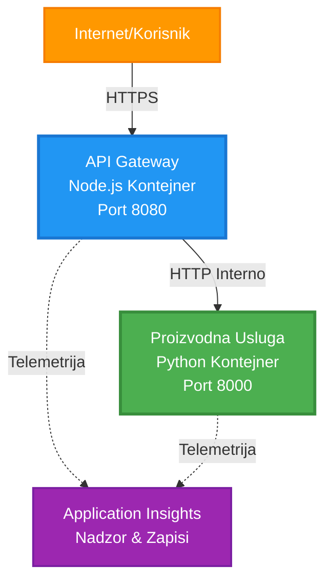
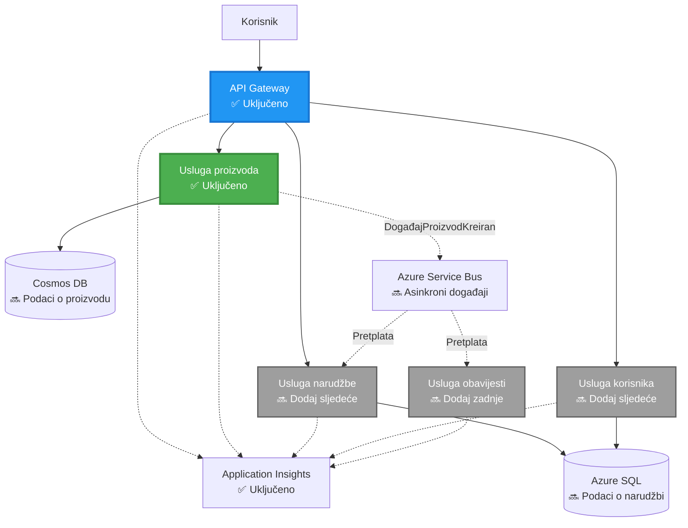
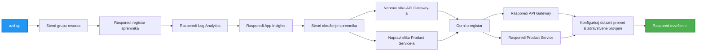
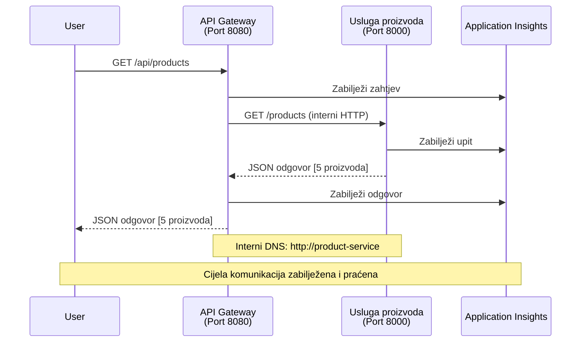

# Mikroservisna arhitektura - Primjer Container App

⏱️ **Procijenjeno vrijeme**: 25-35 minuta | 💰 **Procijenjeni trošak**: ~50-100 USD/mjesečno | ⭐ **Složenost**: Napredno

**📚 Put učenja:**
- ← Prethodno: [Jednostavni Flask API](../../../../examples/container-app/simple-flask-api) - Osnove jednog spremnika
- 🎯 **Nalazite se ovdje**: Mikroservisna arhitektura (osnova s 2 servisa)
- → Sljedeće: [AI integracija](../../../../docs/ai-foundry) - Dodajte inteligenciju svojim uslugama
- 🏠 [Početna stranica tečaja](../../README.md)

---

**Pojednostavljena, ali funkcionalna** mikroservisna arhitektura implementirana u Azure Container Apps koristeći AZD CLI. Ovaj primjer demonstrira komunikaciju između servisa, orkestraciju spremnika i praćenje s praktičnim postavkama za 2 servisa.

> **📚 Pristup učenju**: Ovaj primjer započinje minimalnom arhitekturom s 2 servisa (API Gateway + Backend servis) koju zapravo možete implementirati i iz koje možete učiti. Nakon što savladate ovu osnovu, pružamo smjernice za proširenje na cjelokupni mikroservisni ekosustav.

## Što ćete naučiti

Nakon dovršetka ovog primjera, naučit ćete:
- Implementirati više spremnika u Azure Container Apps
- Provoditi komunikaciju između servisa s internom mrežom
- Konfigurirati skaliranje temeljeno na okruženju i provjere zdravlja
- Pratiti distribuirane aplikacije s Application Insights
- Razumjeti obrasce implementacije mikroservisa i najbolje prakse
- Naučiti postupno proširenje od jednostavnih do složenijih arhitektura

## Arhitektura

### Faza 1: Što gradimo (uključeno u ovaj primjer)


```mermaid
graph TB
    Internet[Internet/Korisnik]
    Gateway[API Gateway<br/>Node.js Kontejner<br/>Port 8080]
    Product[Proizvodna Usluga<br/>Python Kontejner<br/>Port 8000]
    AppInsights[Application Insights<br/>Nadzor & Zapisi]
    
    Internet -->|HTTPS| Gateway
    Gateway -->|HTTP Interno| Product
    Gateway -.->|Telemetrija| AppInsights
    Product -.->|Telemetrija| AppInsights
    
    style Gateway fill:#2196F3,stroke:#1976D2,stroke-width:3px,color:#fff
    style Product fill:#4CAF50,stroke:#388E3C,stroke-width:3px,color:#fff
    style Internet fill:#FF9800,stroke:#F57C00,stroke-width:2px,color:#fff
    style AppInsights fill:#9C27B0,stroke:#7B1FA2,stroke-width:2px,color:#fff
```
**Detalji komponenti:**

| Komponenta | Svrha | Pristup | Resursi |
|------------|--------|---------|----------|
| **API Gateway** | Usmjerava vanjske zahtjeve prema backend servisima | Javni (HTTPS) | 1 vCPU, 2GB RAM, 2-20 replika |
| **Product Service** | Upravljanje katalogom proizvoda s podacima u memoriji | Samo interno | 0.5 vCPU, 1GB RAM, 1-10 replika |
| **Application Insights** | Centralizirano bilježenje i distribuirano praćenje | Azure Portal | 1-2 GB/mjesečno unos podataka |

**Zašto započeti jednostavno?**
- ✅ Brza implementacija i razumijevanje (25-35 minuta)
- ✅ Učenje osnovnih obrazaca mikroservisa bez složenosti
- ✅ Radni kod koji možete mijenjati i isprobavati
- ✅ Niži trošak za učenje (~50-100 USD/mjesečno naspram 300-1400 USD/mjesečno)
- ✅ Izgradite povjerenje prije dodavanja baza podataka i redova poruka

**Analogija**: Ovo je poput učenja vožnje. Počinjete na praznom parkiralištu (2 servisa), svladavate osnove, zatim prelazite u gradski promet (5+ servisa s bazama podataka).

### Faza 2: Buduće proširenje (referentna arhitektura)

Nakon što savladate arhitekturu s 2 servisa, možete proširiti na:


```mermaid
graph TB
    User[Korisnik]
    Gateway[API Gateway<br/>✅ Uključeno]
    Product[Usluga proizvoda<br/>✅ Uključeno]
    Order[Usluga narudžbe<br/>🔜 Dodaj sljedeće]
    UserSvc[Usluga korisnika<br/>🔜 Dodaj sljedeće]
    Notify[Usluga obavijesti<br/>🔜 Dodaj zadnje]
    
    CosmosDB[(Cosmos DB<br/>🔜 Podaci o proizvodu)]
    AzureSQL[(Azure SQL<br/>🔜 Podaci o narudžbi)]
    ServiceBus[Azure Service Bus<br/>🔜 Asinkroni događaji]
    AppInsights[Application Insights<br/>✅ Uključeno]
    
    User --> Gateway
    Gateway --> Product
    Gateway --> Order
    Gateway --> UserSvc
    
    Product --> CosmosDB
    Order --> AzureSQL
    UserSvc --> AzureSQL
    
    Product -.->|DogađajProizvodKreiran| ServiceBus
    ServiceBus -.->|Pretplata| Notify
    ServiceBus -.->|Pretplata| Order
    
    Gateway -.-> AppInsights
    Product -.-> AppInsights
    Order -.-> AppInsights
    UserSvc -.-> AppInsights
    Notify -.-> AppInsights
    
    style Product fill:#4CAF50,stroke:#388E3C,stroke-width:3px,color:#fff
    style Gateway fill:#2196F3,stroke:#1976D2,stroke-width:3px,color:#fff
    style Order fill:#9E9E9E,stroke:#616161,stroke-width:2px,color:#fff
    style UserSvc fill:#9E9E9E,stroke:#616161,stroke-width:2px,color:#fff
    style Notify fill:#9E9E9E,stroke:#616161,stroke-width:2px,color:#fff
```
Pogledajte odjeljak "Vodič za proširenje" na kraju za detaljne korake.

## Uključene značajke

✅ **Otkrivanje servisa**: Automatsko DNS otkrivanje između spremnika  
✅ **Ravnoteža opterećenja**: Ugrađeno balansiranje između replika  
✅ **Auto-skaliranje**: Neovisno skaliranje po servisu temeljeno na HTTP zahtjevima  
✅ **Praćenje zdravlja**: Liveness i readiness provjere za oba servisa  
✅ **Distribuirano bilježenje**: Centralizirano bilježenje s Application Insights  
✅ **Interna mreža**: Sigurna komunikacija između servisa  
✅ **Orkestracija spremnika**: Automatska implementacija i skaliranje  
✅ **Nadogradnje bez zastoja**: Postupna nadogradnja s upravljanjem verzijama  

## Preduvjeti

### Potrebni alati

Prije početka provjerite imate li instalirane ove alate:

1. **[Azure Developer CLI (azd)](https://learn.microsoft.com/azure/developer/azure-developer-cli/install-azd)** (verzija 1.0.0 ili novija)
   ```bash
   azd version
   # Očekivani izlaz: azd verzija 1.0.0 ili novija
   ```

2. **[Azure CLI](https://learn.microsoft.com/cli/azure/install-azure-cli)** (verzija 2.50.0 ili novija)
   ```bash
   az --version
   # Očekivani izlaz: azure-cli 2.50.0 ili noviji
   ```

3. **[Docker](https://www.docker.com/get-started)** (za lokalni razvoj/testiranje - opcionalno)
   ```bash
   docker --version
   # Očekivani izlaz: Docker verzija 20.10 ili novija
   ```

### Provjerite postavke

Pokrenite ove naredbe da potvrdite da ste spremni:

```bash
# Provjerite Azure Developer CLI
azd version
# ✅ Očekivano: azd verzija 1.0.0 ili novija

# Provjerite Azure CLI
az --version
# ✅ Očekivano: azure-cli 2.50.0 ili novija

# Provjerite Docker (neobavezno)
docker --version
# ✅ Očekivano: Docker verzija 20.10 ili novija
```

**Kriteriji uspjeha**: Sve naredbe vraćaju verzije koje su jednake ili veće od minimalnih.

### Azure zahtjevi

- Aktivna **Azure pretplata** ([kreirajte besplatan račun](https://azure.microsoft.com/free/))
- Dozvole za stvaranje resursa u pretplati
- Uloga **Contributor** na razini pretplate ili resursne grupe

### Prethodno znanje

Ovaj je primjer **na naprednoj razini**. Trebali biste imati:
- Završeni [Jednostavni Flask API primjer](../../../../examples/container-app/simple-flask-api) 
- Osnovno razumijevanje mikroservisne arhitekture
- Poznavanje REST API-ja i HTTP-a
- Razumijevanje koncepta spremnika

**Niste upoznati s Container Apps?** Započnite s [Jednostavnim Flask API primjerom](../../../../examples/container-app/simple-flask-api) da naučite osnove.

## Brzi početak (korak po korak)

### Korak 1: Klonirajte i navigirajte

```bash
git clone https://github.com/microsoft/AZD-for-beginners.git
cd AZD-for-beginners/examples/microservices
```

**✓ Provjera uspjeha**: Potvrdite da vidite `azure.yaml`:
```bash
ls
# Očekivano: README.md, azure.yaml, infra/, src/
```

### Korak 2: Prijava u Azure

```bash
azd auth login
```

Ovo otvara preglednik za autentifikaciju u Azure. Prijavite se sa svojim Azure vjerodajnicama.

**✓ Provjera uspjeha**: Trebali biste vidjeti:
```
Logged in to Azure.
```

### Korak 3: Inicijalizirajte okruženje

```bash
azd init
```

**Upiti koje ćete vidjeti**:
- **Naziv okruženja**: Unesite kratki naziv (npr. `microservices-dev`)
- **Azure pretplata**: Odaberite svoju pretplatu
- **Lokacija u Azure**: Odaberite regiju (npr. `eastus`, `westeurope`)

**✓ Provjera uspjeha**: Trebali biste vidjeti:
```
SUCCESS: New project initialized!
```

### Korak 4: Implementirajte infrastrukturu i servise

```bash
azd up
```

**Što se događa** (traje 8-12 minuta):


```mermaid
graph LR
    A[azd up] --> B[Stvori grupu resursa]
    B --> C[Rasporedi registar spremnika]
    C --> D[Rasporedi Log Analytics]
    D --> E[Rasporedi App Insights]
    E --> F[Stvori okruženje spremnika]
    F --> G[Napravi sliku API Gateway-a]
    F --> H[Napravi sliku Product Service-a]
    G --> I[Gurni u registar]
    H --> I
    I --> J[Rasporedi API Gateway]
    I --> K[Rasporedi Product Service]
    J --> L[Konfiguriraj dolazni promet & zdravstvene provjere]
    K --> L
    L --> M[Raspored dovršen ✓]
    
    style A fill:#2196F3,stroke:#1976D2,stroke-width:3px,color:#fff
    style M fill:#4CAF50,stroke:#388E3C,stroke-width:3px,color:#fff
```
**✓ Provjera uspjeha**: Trebali biste vidjeti:
```
SUCCESS: Your application was deployed to Azure in X minutes Y seconds.
Endpoint: https://api-gateway-<unique-id>.azurecontainerapps.io
```

**⏱️ Vrijeme**: 8-12 minuta

### Korak 5: Testirajte implementaciju

```bash
# Dohvatite krajnju točku pristupnika
GATEWAY_URL=$(azd env get-values | grep API_GATEWAY_URL | cut -d '=' -f2 | tr -d '"')

# Testirajte zdravlje API pristupnika
curl $GATEWAY_URL/health
```

**✅ Očekivani ispis:**
```json
{
  "status": "healthy",
  "service": "api-gateway",
  "timestamp": "2025-11-19T10:30:00Z"
}
```

**Testirajte Product servis preko gatewaya**:
```bash
# Popis proizvoda
curl $GATEWAY_URL/api/products
```

**✅ Očekivani ispis:**
```json
[
  {"id":1,"name":"Laptop","price":999.99,"stock":50},
  {"id":2,"name":"Mouse","price":29.99,"stock":200},
  {"id":3,"name":"Keyboard","price":79.99,"stock":150}
]
```

**✓ Provjera uspjeha**: Oba krajnja kraja vraćaju JSON podatke bez grešaka.

---

**🎉 Čestitamo!** Uspješno ste implementirali mikroservisnu arhitekturu u Azure!

## Struktura projekta

Svi datoteke s implementacijom su uključene—ovo je potpuni, radni primjer:

```
microservices/
│
├── README.md                         # This file
├── azure.yaml                        # AZD configuration
├── .gitignore                        # Git ignore patterns
│
├── infra/                           # Infrastructure as Code (Bicep)
│   ├── main.bicep                   # Main orchestration
│   ├── abbreviations.json           # Naming conventions
│   ├── core/                        # Shared infrastructure
│   │   ├── container-apps-environment.bicep  # Container environment + registry
│   │   └── monitor.bicep            # Application Insights + Log Analytics
│   └── app/                         # Service definitions
│       ├── api-gateway.bicep        # API Gateway container app
│       └── product-service.bicep    # Product Service container app
│
└── src/                             # Application source code
    ├── api-gateway/                 # Node.js API Gateway
    │   ├── app.js                   # Express server with routing
    │   ├── package.json             # Node dependencies
    │   └── Dockerfile               # Container definition
    └── product-service/             # Python Product Service
        ├── main.py                  # Flask API with product data
        ├── requirements.txt         # Python dependencies
        └── Dockerfile               # Container definition
```

**Što radi svaka komponenta:**

**Infrastruktura (infra/)**:
- `main.bicep`: Orkestrira sve Azure resurse i njihove ovisnosti
- `core/container-apps-environment.bicep`: Kreira Container Apps okruženje i Azure Container Registry
- `core/monitor.bicep`: Postavlja Application Insights za distribuirano bilježenje
- `app/*.bicep`: Definicije pojedinačnih container aplikacija sa skaliranjem i provjerama zdravlja

**API Gateway (src/api-gateway/)**:
- Javni servis koji usmjerava zahtjeve prema backend servisima
- Provodi bilježenje, rukovanje pogreškama i prosljeđivanje zahtjeva
- Demonstrira HTTP komunikaciju između servisa

**Product Service (src/product-service/)**:
- Interni servis s katalogom proizvoda (za jednostavnost u memoriji)
- REST API s provjerama zdravlja
- Primjer obrasca backend mikroservisa

## Pregled servisa

### API Gateway (Node.js/Express)

**Port**: 8080  
**Pristup**: Javni (vanjski ulaz)  
**Svrha**: Usmjerava dolazne zahtjeve prema odgovarajućim backend servisima  

**Krajnje točke**:
- `GET /` - Informacije o servisu
- `GET /health` - Provjera zdravlja
- `GET /api/products` - Prosljeđivanje prema product servisu (popis svih)
- `GET /api/products/:id` - Prosljeđivanje prema product servisu (dohvat po ID-u)

**Ključne značajke**:
- Usmjeravanje zahtjeva s axiosom
- Centralizirano bilježenje
- Rukovanje pogreškama i upravljanje timeoutom
- Otkrivanje servisa preko varijabli okruženja
- Integracija s Application Insights

**Istaknuti kod** (`src/api-gateway/app.js`):
```javascript
// Interna komunikacija usluga
app.get('/api/products', async (req, res) => {
  const response = await axios.get(`${PRODUCT_SERVICE_URL}/products`, {
    timeout: 5000
  });
  res.json(response.data);
});
```

### Product Service (Python/Flask)

**Port**: 8000  
**Pristup**: Samo interno (bez vanjskog pristupa)  
**Svrha**: Upravljanje katalogom proizvoda s podacima u memoriji  

**Krajnje točke**:
- `GET /` - Informacije o servisu
- `GET /health` - Provjera zdravlja
- `GET /products` - Popis svih proizvoda
- `GET /products/<id>` - Dohvat proizvoda po ID-u

**Ključne značajke**:
- RESTful API s Flaskom
- Pohrana proizvoda u memoriji (jednostavno, bez baze podataka)
- Praćenje zdravlja s provjerama
- Strukturirano bilježenje
- Integracija s Application Insights

**Model podataka**:
```python
{
  "id": 1,
  "name": "Laptop",
  "description": "High-performance laptop",
  "price": 999.99,
  "stock": 50
}
```

**Zašto samo interno?**
Product servis nije izložen javnosti. Svi zahtjevi moraju proći preko API Gatewaya, koji pruža:
- Sigurnost: kontroliranu ulaznu točku
- Fleksibilnost: može mijenjati backend bez utjecaja na klijente
- Praćenje: centralizirano bilježenje zahtjeva

## Razumijevanje komunikacije između servisa

### Kako servisi međusobno komuniciraju


```mermaid
sequenceDiagram
    participant User
    participant Gateway as API Gateway<br/>(Port 8080)
    participant Product as Usluga proizvoda<br/>(Port 8000)
    participant AI as Application Insights
    
    User->>Gateway: GET /api/products
    Gateway->>AI: Zabilježi zahtjev
    Gateway->>Product: GET /products (interni HTTP)
    Product->>AI: Zabilježi upit
    Product-->>Gateway: JSON odgovor [5 proizvoda]
    Gateway->>AI: Zabilježi odgovor
    Gateway-->>User: JSON odgovor [5 proizvoda]
    
    Note over Gateway,Product: Interni DNS: http://product-service
    Note over User,AI: Cijela komunikacija zabilježena i praćena
```
U ovom primjeru, API Gateway komunicira s Product servisom koristeći **interni HTTP poziv**:

```javascript
// API Gateway (src/api-gateway/app.js)
const PRODUCT_SERVICE_URL = process.env.PRODUCT_SERVICE_URL;

// Izvrši interni HTTP zahtjev
const response = await axios.get(`${PRODUCT_SERVICE_URL}/products`);
```

**Ključne točke**:

1. **Otkrivanje bazirano na DNS-u**: Container Apps automatski pružaju DNS za interne servise
   - FQDN Product servisa: `product-service.internal.<environment>.azurecontainerapps.io`
   - Jednostavnije kao: `http://product-service` (Container Apps to preslikava)

2. **Nema javnog izlaganja**: Product servis ima `external: false` u Bicep kodu
   - Dostupan samo unutar Container Apps okruženja
   - Nije moguće pristupiti s interneta

3. **Varijable okruženja**: URL-ovi servisa se ubacuju pri implementaciji
   - Bicep prosljeđuje interni FQDN gatewayu
   - Nema tvrdo kodiranih URL-ova u aplikacijskom kodu

**Analogija**: Zamislite ovo kao urede u zgradi. API Gateway je recepcija (javni pristup), a Product servis je ured (samo interno). Posjetitelji se moraju javiti na recepciju da bi došli do ureda.

## Opcije implementacije

### Potpuna implementacija (preporučeno)

```bash
# Implementirajte infrastrukturu i obje usluge
azd up
```

Ovo implementira:
1. Container Apps okruženje
2. Application Insights
3. Container Registry
4. Container za API Gateway
5. Container za Product servis

**Vrijeme trajanja**: 8-12 minuta

### Implementacija pojedinog servisa

```bash
# Implementirajte samo jednu uslugu (nakon početnog azd up)
azd deploy api-gateway

# Ili implementirajte uslugu proizvoda
azd deploy product-service
```

**Upotreba**: Kada ste promijenili kod u jednom servisu i želite ponovno implementirati samo taj servis.

### Ažuriranje konfiguracije

```bash
# Promijeni parametre skaliranja
azd env set GATEWAY_MAX_REPLICAS 30

# Ponovno implementiraj s novom konfiguracijom
azd up
```

## Konfiguracija

### Postavke skaliranja

Oba servisa imaju HTTP-bazirano automatsko skaliranje u svojim Bicep datotekama:

**API Gateway**:
- Minimalni broj replika: 2 (uvijek najmanje 2 radi dostupnosti)
- Maksimalni broj replika: 20
- Okidač skaliranja: 50 paralelnih zahtjeva po replici

**Product Service**:
- Minimalni broj replika: 1 (može se skalirati do 0 ako je potrebno)
- Maksimalni broj replika: 10
- Okidač skaliranja: 100 paralelnih zahtjeva po replici

**Prilagođavanje skaliranja** (u `infra/app/*.bicep`):
```bicep
scale: {
  minReplicas: 1
  maxReplicas: 10
  rules: [
    {
      name: 'http-scale-rule'
      http: {
        metadata: {
          concurrentRequests: '100'  // Adjust this
        }
      }
    }
  ]
}
```

### Dodjela resursa

**API Gateway**:
- CPU: 1.0 vCPU
- Memorija: 2 GiB
- Razlog: rukovanje sav prometom izvana

**Product Service**:
- CPU: 0.5 vCPU
- Memorija: 1 GiB
- Razlog: lagane operacije u memoriji

### Provjere zdravlja

Oba servisa uključuju liveness i readiness sonde:

```bicep
probes: [
  {
    type: 'Liveness'
    httpGet: {
      path: '/health'
      port: 8080
    }
    initialDelaySeconds: 10
    periodSeconds: 30
  }
  {
    type: 'Readiness'
    httpGet: {
      path: '/health'
      port: 8080
    }
    initialDelaySeconds: 5
    periodSeconds: 10
  }
]
```

**Što to znači**:
- **Liveness**: Ako provjera zdravlja ne uspije, Container Apps ponovno pokreće kontejner
- **Readiness**: Ako nije spreman, Container Apps prestaje usmjeravati promet prema toj replici

## Praćenje i uočljivost

### Pregled logova servisa

```bash
# Pogledajte zapise pomoću azd monitor
azd monitor --logs

# Ili koristite Azure CLI za određene Container Apps:
# Pratite zapise s API Gateway
az containerapp logs show --name api-gateway --resource-group $RG_NAME --follow

# Pogledajte nedavne zapise usluge proizvoda
az containerapp logs show --name product-service --resource-group $RG_NAME --tail 100
```

**Očekivani ispis**:
```
[api-gateway] API Gateway listening on port 8080
[api-gateway] Product Service URL: http://product-service
[api-gateway] GET /api/products 200 - 45ms
[product-service] Retrieved 5 products
```

### Upiti za Application Insights

Pristupite Application Insights u Azure portalu, zatim pokrenite ove upite:

**Pronađi spore zahtjeve**:
```kusto
requests
| where timestamp > ago(1h)
| where duration > 1000  // Requests taking >1 second
| summarize count() by name, cloud_RoleName
| order by count_ desc
```

**Praćenje poziva između servisa**:
```kusto
dependencies
| where timestamp > ago(1h)
| where type == "Http"
| project timestamp, name, target, duration, success
| order by timestamp desc
```

**Stopa pogrešaka po servisima**:
```kusto
exceptions
| where timestamp > ago(24h)
| summarize errorCount = count() by cloud_RoleName, type
| order by errorCount desc
```

**Volumen zahtjeva kroz vrijeme**:
```kusto
requests
| where timestamp > ago(1h)
| summarize requestCount = count() by bin(timestamp, 5m), cloud_RoleName
| render timechart
```

### Pristup nadzornoj ploči

```bash
# Dohvati detalje Application Insights
azd env get-values | grep APPLICATIONINSIGHTS

# Otvori Azure Portal za nadzor
az monitor app-insights component show \
  --app $(azd env get-values | grep APPLICATIONINSIGHTS_CONNECTION_STRING | cut -d '=' -f2) \
  --resource-group $(azd env get-values | grep AZURE_RESOURCE_GROUP | cut -d '=' -f2) \
  --query "appId" -o tsv
```

### Metrički prikaz uživo

1. Otvorite Application Insights u Azure portalu  
2. Kliknite na "Live Metrics"  
3. Prikaz u stvarnom vremenu zahtjeva, pogrešaka i performansi  
4. Testirajte ovako: `curl $(azd env get-values | grep API_GATEWAY_URL | cut -d '=' -f2 | tr -d '"')/api/products`

## Praktične vježbe

### Vježba 1: Dodajte novu krajnju točku proizvoda ⭐ (Lako)

**Cilj**: Dodati POST krajnju točku za stvaranje novih proizvoda

**Početna točka**: `src/product-service/main.py`

**Koraci**:

1. Dodajte ovu krajnju točku nakon funkcije `get_product` u `main.py`:

```python
@app.route('/products', methods=['POST'])
def create_product():
    """Create a new product"""
    data = request.get_json()
    
    # Provjerite obavezna polja
    if not data or 'name' not in data or 'price' not in data:
        return jsonify({'error': 'Missing required fields: name, price'}), 400
    
    new_id = max(p['id'] for p in products) + 1
    new_product = {
        'id': new_id,
        'name': data['name'],
        'description': data.get('description', ''),
        'price': float(data['price']),
        'stock': int(data.get('stock', 0))
    }
    products.append(new_product)
    logger.info(f"Created product {new_id}")
    return jsonify(new_product), 201
```

2. Dodajte POST rutu u API Gateway (`src/api-gateway/app.js`):

```javascript
// Dodajte ovo nakon rute GET /api/products
app.post('/api/products', async (req, res) => {
  try {
    console.log(`Forwarding POST request to ${PRODUCT_SERVICE_URL}/products`);
    const response = await axios.post(`${PRODUCT_SERVICE_URL}/products`, req.body, {
      timeout: 5000
    });
    res.status(201).json(response.data);
  } catch (error) {
    console.error('Error calling product service:', error.message);
    res.status(503).json({
      error: 'Product service unavailable',
      message: error.message
    });
  }
});
```

3. Ponovno implementirajte obje usluge:

```bash
azd deploy product-service
azd deploy api-gateway
```

4. Testirajte novu krajnju točku:

```bash
GATEWAY_URL=$(azd env get-values | grep API_GATEWAY_URL | cut -d '=' -f2 | tr -d '"')

# Kreiraj novi proizvod
curl -X POST $GATEWAY_URL/api/products \
  -H "Content-Type: application/json" \
  -d '{"name":"USB Cable","price":9.99,"stock":500}'
```

**✅ Očekivani izlaz:**
```json
{"id":6,"name":"USB Cable","description":"","price":9.99,"stock":500}
```

5. Provjerite pojavljuje li se na popisu:

```bash
curl $GATEWAY_URL/api/products
# Sada bi trebalo prikazati 6 proizvoda uključujući novi USB kabel
```

**Kriteriji uspjeha**:
- ✅ POST zahtjev vraća HTTP 201
- ✅ Novi proizvod se pojavljuje na popisu GET /api/products
- ✅ Proizvod ima automatski povećani ID

**Vrijeme**: 10-15 minuta

---

### Vježba 2: Izmjena pravila automatskog skaliranja ⭐⭐ (Srednje)

**Cilj**: Promijeniti Product Service da skalira agresivnije

**Polazna točka**: `infra/app/product-service.bicep`

**Koraci**:

1. Otvorite `infra/app/product-service.bicep` i pronađite blok `scale` (oko linije 95)

2. Promijenite s:
```bicep
scale: {
  minReplicas: 1
  maxReplicas: 10
  rules: [
    {
      name: 'http-scale-rule'
      http: {
        metadata: {
          concurrentRequests: '100'  // OLD
        }
      }
    }
  ]
}
```

U:
```bicep
scale: {
  minReplicas: 2  // Always have 2 running
  maxReplicas: 20  // Allow more scaling
  rules: [
    {
      name: 'http-scale-rule'
      http: {
        metadata: {
          concurrentRequests: '20'  // Scale at lower threshold
        }
      }
    }
  ]
}
```

3. Ponovno implementirajte infrastrukturu:

```bash
azd up
```

4. Provjerite novu konfiguraciju skaliranja:

```bash
az containerapp show \
  --name $(azd env get-values | grep PRODUCT_SERVICE | head -1 | cut -d '/' -f5) \
  --resource-group $(azd env get-values | grep AZURE_RESOURCE_GROUP | cut -d '=' -f2 | tr -d '"') \
  --query "properties.template.scale" -o json
```

**✅ Očekivani izlaz:**
```json
{
  "minReplicas": 2,
  "maxReplicas": 20,
  "rules": [...]
}
```

5. Testirajte automatsko skaliranje pod opterećenjem:

```bash
# Generiraj paralelne zahtjeve
for i in {1..500}; do curl $GATEWAY_URL/api/products & done

# Prati skaliranje pomoću Azure CLI-ja
az containerapp logs show --name product-service --resource-group $RG_NAME --follow
# Prati: događaje skaliranja Container Apps aplikacija
```

**Kriteriji uspjeha**:
- ✅ Product Service uvijek radi najmanje s 2 replike
- ✅ Pod opterećenjem se skalira na više od 2 replike
- ✅ Azure Portal prikazuje nova pravila skaliranja

**Vrijeme**: 15-20 minuta

---

### Vježba 3: Dodavanje prilagođenog upita za nadzor ⭐⭐ (Srednje)

**Cilj**: Kreirati prilagođeni upit u Application Insights za praćenje performansi product API-ja

**Koraci**:

1. Idite u Application Insights u Azure Portalu:
   - Otvorite Azure Portal
   - Pronađite svoju grupu resursa (rg-microservices-*)
   - Kliknite na Application Insights resurs

2. Kliknite na "Logs" u lijevom izborniku

3. Kreirajte ovaj upit:

```kusto
requests
| where timestamp > ago(1h)
| where name contains "products"
| summarize 
    RequestCount = count(),
    AvgDuration = avg(duration),
    P95Duration = percentile(duration, 95),
    SuccessRate = 100.0 * countif(success == true) / count()
  by bin(timestamp, 5m)
| render timechart
```

4. Kliknite "Run" za izvršavanje upita

5. Spremite upit:
   - Kliknite "Save"
   - Naziv: "Product API Performance"
   - Kategorija: "Performance"

6. Generirajte testni promet:

```bash
for i in {1..100}; do curl $GATEWAY_URL/api/products; sleep 1; done
```

7. Osvježite upit da vidite podatke

**✅ Očekivani izlaz:**
- Grafikon koji prikazuje broj zahtjeva tijekom vremena
- Prosječno trajanje < 500ms
- Stopa uspješnosti = 100%
- Vremenski segmenti od 5 minuta

**Kriteriji uspjeha**:
- ✅ Upit prikazuje 100+ zahtjeva
- ✅ Stopa uspješnosti je 100%
- ✅ Prosječno trajanje < 500ms
- ✅ Grafikon prikazuje vremenske segmente od 5 minuta

**Ishod učenja**: Razumjeti kako pratiti performanse usluge s prilagođenim upitima

**Vrijeme**: 10-15 minuta

---

### Vježba 4: Implementacija logike ponovnog pokušaja ⭐⭐⭐ (Napredno)

**Cilj**: Dodati logiku ponovnog pokušaja u API Gateway kad Product Service privremeno nije dostupan

**Polazna točka**: `src/api-gateway/app.js`

**Koraci**:

1. Instalirajte retry biblioteku:

```bash
cd src/api-gateway
npm install axios-retry --save
cd ../..
```

2. Ažurirajte `src/api-gateway/app.js` (dodajte nakon axios importa):

```javascript
const axiosRetry = require('axios-retry');

// Konfiguriraj logiku ponovnog pokušaja
axiosRetry(axios, {
  retries: 3,
  retryDelay: (retryCount) => {
    return retryCount * 1000; // 1s, 2s, 3s
  },
  retryCondition: (error) => {
    // Ponovno pokušaj pri mrežnim greškama ili odgovorima 5xx
    return axiosRetry.isNetworkOrIdempotentRequestError(error) ||
           (error.response && error.response.status >= 500);
  }
});

console.log('Retry logic configured: 3 retries with exponential backoff');
```

3. Ponovno implementirajte API Gateway:

```bash
azd deploy api-gateway
```

4. Testirajte ponašanje ponovnog pokušaja simulirajući neuspjeh usluge:

```bash
# Skaliraj servis proizvoda na 0 (simuliraj kvar)
az containerapp update \
  --name $(azd env get-values | grep PRODUCT_SERVICE | head -1 | cut -d '/' -f5) \
  --resource-group $(azd env get-values | grep AZURE_RESOURCE_GROUP | cut -d '=' -f2 | tr -d '"') \
  --min-replicas 0 \
  --max-replicas 0

# Pokušaj pristupiti proizvodima (pokušat će se 3 puta)
time curl -v $GATEWAY_URL/api/products
# Promatraj: Odgovor traje ~6 sekundi (1s + 2s + 3s ponovne pokušaje)

# Vrati servis proizvoda
az containerapp update \
  --name $(azd env get-values | grep PRODUCT_SERVICE | head -1 | cut -d '/' -f5) \
  --resource-group $(azd env get-values | grep AZURE_RESOURCE_GROUP | cut -d '=' -f2 | tr -d '"') \
  --min-replicas 1 \
  --max-replicas 10
```

5. Pregledajte zapise ponovnog pokušaja:

```bash
az containerapp logs show --name api-gateway --resource-group $RG_NAME --tail 50
# Potražite: Poruke o pokušaju ponovnog slanja
```

**✅ Očekivano ponašanje:**
- Zahtjevi se pokušavaju 3 puta prije neuspjeha
- Svaki pokušaj čeka duže (1s, 2s, 3s)
- Uspješni zahtjevi nakon ponovnog pokretanja usluge
- Zapisi prikazuju pokušaje ponovnog pokušaja

**Kriteriji uspjeha**:
- ✅ Zahtjevi se pokušavaju 3 puta prije neuspjeha
- ✅ Svaki pokušaj čeka duže (eksponencijalno vraćanje unazad)
- ✅ Uspješni zahtjevi nakon ponovnog pokretanja usluge
- ✅ Zapisi prikazuju pokušaje ponovnog pokušaja

**Ishod učenja**: Razumjeti obrasce otpornosti u mikroservisima (prekidači struje, ponovni pokušaji, vremenska ograničenja)

**Vrijeme**: 20-25 minuta

---

## Provjera znanja

Nakon dovršetka ovog primjera, provjerite svoje razumijevanje:

### 1. Komunikacija između usluga ✓

Testirajte svoje znanje:
- [ ] Možete li objasniti kako API Gateway otkriva Product Service? (otkrivanje usluge temeljeno na DNS-u)
- [ ] Što se događa ako Product Service nije dostupan? (Gateway vraća 503 grešku)
- [ ] Kako biste dodali treću uslugu? (kreirati novi Bicep fajl, dodati u main.bicep, kreirati src mapu)

**Verifikacija praktičnim radom:**
```bash
# Simulirajte kvar usluge
az containerapp update --name <product-service-name> --min-replicas 0 --max-replicas 0
curl $GATEWAY_URL/api/products
# ✅ Očekivano: 503 Usluga nije dostupna

# Vratite uslugu
az containerapp update --name <product-service-name> --min-replicas 1 --max-replicas 10
```

### 2. Nadzor i uočljivost ✓

Testirajte svoje znanje:
- [ ] Gdje vidite distribuirane zapise? (Application Insights u Azure Portalu)
- [ ] Kako pratite spore zahtjeve? (Kusto upit: `requests | where duration > 1000`)
- [ ] Možete li identificirati koja je usluga izazvala grešku? (provjerite polje `cloud_RoleName` u zapisima)

**Verifikacija praktičnim radom:**
```bash
# Generiraj simulaciju sporog zahtjeva
curl "$GATEWAY_URL/api/products?delay=2000"

# Upitaj Application Insights za spore zahtjeve
# Navigiraj do Azure Portala → Application Insights → Logs
# Pokreni: requests | where duration > 1000 | project timestamp, name, duration, cloud_RoleName
```

### 3. Skaliranje i performanse ✓

Testirajte svoje znanje:
- [ ] Što pokreće automatsko skaliranje? (pravila za istovremene HTTP zahtjeve: 50 za gateway, 100 za product)
- [ ] Koliko replika trenutno radi? (provjerite s `az containerapp revision list`)
- [ ] Kako biste skalirali Product Service na 5 replika? (ažurirajte minReplicas u Bicep)

**Verifikacija praktičnim radom:**
```bash
# Generiraj opterećenje za testiranje automatskog skaliranja
for i in {1..1000}; do curl $GATEWAY_URL/api/products & done

# Promatraj povećanje replika koristeći Azure CLI
az containerapp logs show --name api-gateway --resource-group $RG_NAME --follow
# ✅ Očekivano: Vidi događaje skaliranja u zapisnicima
```

**Kriteriji uspjeha**: Možete odgovoriti na sva pitanja i potvrditi s praktičnim naredbama.

---

## Analiza troškova

### Procijenjeni mjesečni troškovi (za ovaj primjer s 2 usluge)

| Resurs | Konfiguracija | Procijenjeni trošak |
|----------|--------------|----------------|
| API Gateway | 2-20 replika, 1 vCPU, 2GB RAM | $30-150 |
| Product Service | 1-10 replika, 0.5 vCPU, 1GB RAM | $15-75 |
| Container Registry | Osnovni plan | $5 |
| Application Insights | 1-2 GB/mjesečno | $5-10 |
| Log Analytics | 1 GB/mjesečno | $3 |
| **Ukupno** | | **$58-243/mjesečno** |

### Raspodjela troškova prema upotrebi

**Mali promet** (testiranje/učenje): ~$60/mjesečno
- API Gateway: 2 replike × 24/7 = $30
- Product Service: 1 replika × 24/7 = $15
- Nadzor + Registry = $13

**Umjereni promet** (mala produkcija): ~$120/mjesečno
- API Gateway: 5 prosječnih replika = $75
- Product Service: 3 prosječne replike = $45
- Nadzor + Registry = $13

**Visoki promet** (zauzeti periodi): ~$240/mjesečno
- API Gateway: 15 prosječnih replika = $225
- Product Service: 8 prosječnih replika = $120
- Nadzor + Registry = $13

### Savjeti za optimizaciju troškova

1. **Skalirajte na nulu za razvoj**:
   ```bicep
   scale: {
     minReplicas: 0  // Save $30-40/month when not in use
     maxReplicas: 10
   }
   ```

2. **Koristite Consumption Plan za Cosmos DB** (kada ga dodate):
   - Plaćajte samo što koristite
   - Nema minimalne naknade

3. **Postavite uzorkovanje u Application Insights**:
   ```javascript
   appInsights.defaultClient.config.samplingPercentage = 50; // Uzmite uzorak 50% zahtjeva
   ```

4. **Očistite kada nije potrebno**:
   ```bash
   azd down --force --purge
   ```

### Besplatne opcije

Za učenje/testiranje, razmotrite:
- ✅ Koristite Azure besplatne kredite ($200 za prvih 30 dana za nove račune)
- ✅ Ostanite na minimalnim replikama (ušteda ~50% troškova)
- ✅ Izbrišite nakon testiranja (bez trajnih troškova)
- ✅ Skalirajte na nulu između sesija učenja

**Primjer**: Pokretanje ovog primjera 2 sata/dan × 30 dana = ~$5/mjesečno umjesto $60/mjesečno

---

## Brzi vodič za rješavanje problema

### Problem: `azd up` ne uspijeva s "Subscription not found"

**Rješenje**:
```bash
# Prijavite se ponovno s eksplicitnom pretplatom
az account set --subscription <your-subscription-id>
azd env set AZURE_SUBSCRIPTION_ID <your-subscription-id>
azd up
```

### Problem: API Gateway vraća 503 "Product service unavailable"

**Dijagnostika**:
```bash
# Provjerite dnevnike usluge proizvoda pomoću Azure CLI-ja
az containerapp logs show --name product-service --resource-group $RG_NAME --tail 50

# Provjerite zdravlje usluge proizvoda
az containerapp show \
  --name $(azd env get-values | grep PRODUCT_SERVICE | head -1 | cut -d '/' -f5) \
  --resource-group $(azd env get-values | grep AZURE_RESOURCE_GROUP | cut -d '=' -f2 | tr -d '"') \
  --query "properties.runningStatus"
```

**Česti uzroci**:
1. Usluga product nije pokrenuta (provjerite zapise za Python pogreške)
2. Provjera zdravlja ne uspijeva (provjerite radi li `/health` endpoint)
3. Izgradnja slike kontejnera nije uspjela (provjerite registar za sliku)

### Problem: Automatsko skaliranje ne radi

**Dijagnostika**:
```bash
# Provjerite trenutačni broj replika
az containerapp revision list \
  --name $(azd env get-values | grep API_GATEWAY | head -1 | cut -d '/' -f5) \
  --resource-group $(azd env get-values | grep AZURE_RESOURCE_GROUP | cut -d '=' -f2 | tr -d '"') \
  --query "[].properties.replicas"

# Generirajte opterećenje za testiranje
for i in {1..1000}; do curl $GATEWAY_URL/api/products & done

# Pratite događaje skaliranja pomoću Azure CLI
az containerapp logs show --name api-gateway --resource-group $RG_NAME --follow | grep -i scale
```

**Česti uzroci**:
1. Opterećenje nije dovoljno visoko za aktiviranje pravila skaliranja (potrebno >50 istovremenih zahtjeva)
2. Maksimalan broj replika je već dosegnut (provjerite Bicep konfiguraciju)
3. Pravilo skaliranja pogrešno konfigurirano u Bicep (provjerite vrijednost concurrentRequests)

### Problem: Application Insights ne prikazuje zapise

**Dijagnostika**:
```bash
# Provjerite je li niz za povezivanje postavljen
azd env get-values | grep APPLICATIONINSIGHTS

# Provjerite šalju li usluge telemetriju
az monitor app-insights component show \
  --app $(azd env get-values | grep APPLICATIONINSIGHTS_NAME | cut -d '=' -f2 | tr -d '"') \
  --resource-group $(azd env get-values | grep AZURE_RESOURCE_GROUP | cut -d '=' -f2 | tr -d '"') \
  --query "properties.InstrumentationKey"
```

**Česti uzroci**:
1. Niz veze nije proslijeđen kontejneru (provjerite promjenjive okoline)
2. SDK Application Insights nije konfiguriran (provjerite import u kodu)
3. Vatrozid blokira telemetriju (rijetko, provjerite mrežna pravila)

### Problem: Docker build lokalno ne uspije

**Dijagnostika**:
```bash
# Testiraj sastavljanje API Gatewaya
cd src/api-gateway
docker build -t test-gateway .

# Testiraj sastavljanje Product Servicea
cd ../product-service
docker build -t test-product .
```

**Česti uzroci**:
1. Nedostaju ovisnosti u package.json/requirements.txt
2. Sintaksne greške u Dockerfile-u
3. Problemi s mrežom pri preuzimanju ovisnosti

**Još uvijek imate problema?** Pogledajte [Vodič za česte probleme](../../docs/chapter-07-troubleshooting/common-issues.md) ili [Rješavanje problema Azure Container Apps](https://learn.microsoft.com/azure/container-apps/troubleshooting)

---

## Čišćenje

Da biste izbjegli trajne troškove, izbrišite sve resurse:

```bash
azd down --force --purge
```

**Potvrda**:
```
? Total resources to delete: 6, are you sure you want to continue? (y/N)
```

Upišite `y` za potvrdu.

**Što se briše**:
- Okruženje Container Apps
- Obje Container Apps (gateway i product service)
- Container Registry
- Application Insights
- Log Analytics Workspace
- Grupa resursa

**✓ Provjerite čišćenje**:
```bash
az group list --query "[?starts_with(name,'rg-microservices')]" --output table
```

Trebao bi vratiti prazno.

---

## Vodič za proširenje: Od 2 do 5+ usluga

Kad savladate ovu arhitekturu s 2 usluge, evo kako proširiti:

### Faza 1: Dodavanje baze podataka (sljedeći korak)

**Dodajte Cosmos DB za Product Service**:

1. Kreirajte `infra/core/cosmos.bicep`:
   ```bicep
   resource cosmosAccount 'Microsoft.DocumentDB/databaseAccounts@2023-04-15' = {
     name: name
     location: location
     kind: 'GlobalDocumentDB'
     properties: {
       databaseAccountOfferType: 'Standard'
       consistencyPolicy: { defaultConsistencyLevel: 'Session' }
       locations: [{ locationName: location, failoverPriority: 0 }]
     }
   }
   ```

2. Ažurirajte product service da koristi Azure Cosmos DB Python SDK umjesto podataka u memoriji

3. Procijenjeni dodatni trošak: ~$25/mjesečno (serverless)

### Faza 2: Dodavanje treće usluge (upravljanje narudžbama)

**Kreirajte Order Service**:

1. Nova mapa: `src/order-service/` (Python/Node.js/C#)
2. Novi Bicep: `infra/app/order-service.bicep`
3. Ažurirajte API Gateway za usmjeravanje `/api/orders`
4. Dodajte Azure SQL bazu podataka za pohranu narudžbi

**Arhitektura postaje**:
```
API Gateway → Product Service (Cosmos DB)
           → Order Service (Azure SQL)
```

### Faza 3: Dodavanje asinkrone komunikacije (Service Bus)

**Implementirajte arhitekturu vođenu događajima**:

1. Dodajte Azure Service Bus: `infra/core/servicebus.bicep`
2. Product Service objavljuje događaje "ProductCreated"
3. Order Service pretplaćuje se na događaje proizvoda
4. Dodajte Notification Service za obradu događaja

**Obrazac**: Zahtjev/Odgovor (HTTP) + Arhitektura vođena događajima (Service Bus)

### Faza 4: Dodavanje autentikacije korisnika

**Implementirajte User Service**:

1. Kreirajte `src/user-service/` (Go/Node.js)
2. Dodajte Azure AD B2C ili prilagođenu JWT autentikaciju
3. API Gateway provjerava tokene prije usmjeravanja
4. Usluge provjeravaju korisnička dopuštenja

### Faza 5: Spremnost za produkciju

**Dodajte ove komponente**:
- ✅ Azure Front Door (globalno balansiranje opterećenja)
- ✅ Azure Key Vault (upravljanje tajnama)
- ✅ Azure Monitor Workbooks (prilagođene nadzorne ploče)
- ✅ CI/CD pipeline (GitHub Actions)
- ✅ Blue-Green implementacije
- ✅ Upravljani identitet za sve usluge

**Ukupni trošak produkcijske arhitekture**: ~$300-1,400/mjesečno

---

## Saznajte više

### Povezana dokumentacija
- [Azure Container Apps Dokumentacija](https://learn.microsoft.com/azure/container-apps/)
- [Vodič za arhitekturu mikroservisa](https://learn.microsoft.com/azure/architecture/guide/architecture-styles/microservices)
- [Application Insights za distribuirano praćenje](https://learn.microsoft.com/azure/azure-monitor/app/distributed-tracing)
- [Azure Developer CLI Dokumentacija](https://learn.microsoft.com/azure/developer/azure-developer-cli/)

### Sljedeći koraci u ovom tečaju
- ← Prethodno: [Jednostavan Flask API](../../../../examples/container-app/simple-flask-api) - Početnički primjer s jednim kontejnerom
- → Sljedeće: [Vodič za AI integraciju](../../../../docs/ai-foundry) - Dodavanje AI mogućnosti
- 🏠 [Početna stranica tečaja](../../README.md)

### Usporedba: Kada koristiti što

| Značajka | Jedan kontejner | Mikroservisi (ovo) | Kubernetes (AKS) |
|---------|-----------------|---------------------|------------------|
| **Upotreba** | Jednostavne aplikacije | Složene aplikacije | Enterprise aplikacije |
| **Skalabilnost** | Jedna usluga | Skaliranje po usluzi | Najveća fleksibilnost |
| **Složenost** | Niska | Srednja | Visoka |
| **Veličina tima** | 1-3 programera | 3-10 programera | 10+ programera |
| **Trošak** | ~$15-50/mjesečno | ~$60-250/mjesečno | ~$150-500/mjesečno |
| **Vrijeme implementacije** | 5-10 minuta | 8-12 minuta | 15-30 minuta |
| **Najbolje za** | MVP-ove, prototipove | Produkcijske aplikacije | Multi-cloud, napredno umrežavanje |

**Preporuka**: Počnite s Container Apps (ovaj primjer), pređite na AKS samo ako vam trebaju specifične Kubernetes značajke.

---

## Često postavljana pitanja

**P: Zašto samo 2 servisa umjesto 5+?**  
O: Edukativni postupak. Savladajte osnove (komunikacija servisa, nadzor, skaliranje) s jednostavnim primjerom prije dodavanja složenosti. Obrasci koje ovdje naučite primjenjuju se na arhitekture s 100 servisa.

**P: Mogu li sam dodati više servisa?**  
O: Apsolutno! Slijedite vodič za proširenje iznad. Svaki novi servis slijedi isti obrazac: kreirajte mapu src, napravite Bicep datoteku, ažurirajte azure.yaml, implementirajte.

**P: Je li ovo spremno za produkciju?**  
O: To je solidna osnova. Za produkciju dodajte: upravljani identitet, Key Vault, trajne baze podataka, CI/CD pipeline, upozorenja za nadzor i strategiju backup-a.

**P: Zašto ne koristiti Dapr ili drugi service mesh?**  
O: Držite to jednostavnim za učenje. Kad shvatite izvorno Container Apps umrežavanje, možete dodati Dapr za napredne scenarije (upravljanje stanjem, pub/sub, povezivanje).

**P: Kako mogu debugirati lokalno?**  
O: Pokrenite servise lokalno s Dockerom:  
```bash
cd src/api-gateway
docker build -t local-gateway .
docker run -p 8080:8080 -e PRODUCT_SERVICE_URL=http://localhost:8000 local-gateway
```
  
**P: Mogu li koristiti različite programske jezike?**  
O: Da! Ovaj primjer prikazuje Node.js (gateway) + Python (product service). Možete kombinirati bilo koje jezike koji rade u kontejnerima: C#, Go, Java, Ruby, PHP, itd.

**P: Što ako nemam Azure kredite?**  
O: Iskoristite besplatni sloj Azurea (prvih 30 dana s novim računima dobijete $200 kredita) ili implementirajte za kratka testiranja i odmah brišite. Ovaj primjer košta oko ~$2/dan.

**P: Čime se ovo razlikuje od Azure Kubernetes Service (AKS)?**  
O: Container Apps je jednostavniji (nije potrebno znanje Kubernetes-a) ali manje fleksibilan. AKS vam daje potpunu kontrolu nad Kubernetesom, ali zahtijeva više stručnosti. Započnite s Container Apps, pređite na AKS po potrebi.

**P: Mogu li ovo koristiti s postojećim Azure servisima?**  
O: Da! Možete povezati s postojećim bazama podataka, storage računima, Service Busom itd. Ažurirajte Bicep datoteke da referenciraju postojeće resurse umjesto da stvaraju nove.

---

> **🎓 Sažetak puta učenja**: Naučili ste kako implementirati arhitekturu s više servisa s automatskim skaliranjem, internim umrežavanjem, centraliziranim nadzorom i obrascima spremnim za produkciju. Ova osnova vas priprema za složene distribuirane sustave i enterprise mikroservisne arhitekture.

**📚 Navigacija tečajem:**  
- ← Prethodno: [Simple Flask API](../../../../examples/container-app/simple-flask-api)  
- → Sljedeće: [Primjer integracije baze podataka](../../../../database-app)  
- 🏠 [Početna stranica tečaja](../../README.md)  
- 📖 [Najbolje prakse za Container Apps](../../docs/chapter-04-infrastructure/deployment-guide.md)

---

**✨ Čestitamo!** Završili ste microservices primjer. Sada razumijete kako graditi, implementirati i nadzirati distribuirane aplikacije na Azure Container Apps. Spremni za dodavanje AI mogućnosti? Pogledajte [Vodič za AI integraciju](../../../../docs/ai-foundry)!

---

<!-- CO-OP TRANSLATOR DISCLAIMER START -->
**Odricanje od odgovornosti**:
Ovaj dokument je preveden korištenjem AI usluge za prevođenje [Co-op Translator](https://github.com/Azure/co-op-translator). Iako nastojimo pružiti točnost, molimo imajte na umu da automatski prijevodi mogu sadržavati pogreške ili netočnosti. Izvorni dokument na izvornom jeziku treba se smatrati autoritativnim izvorom. Za kritične informacije preporučuje se profesionalni ljudski prijevod. Ne snosimo odgovornost za bilo kakva nesporazumevanja ili pogrešna tumačenja koja proizlaze iz korištenja ovog prijevoda.
<!-- CO-OP TRANSLATOR DISCLAIMER END -->