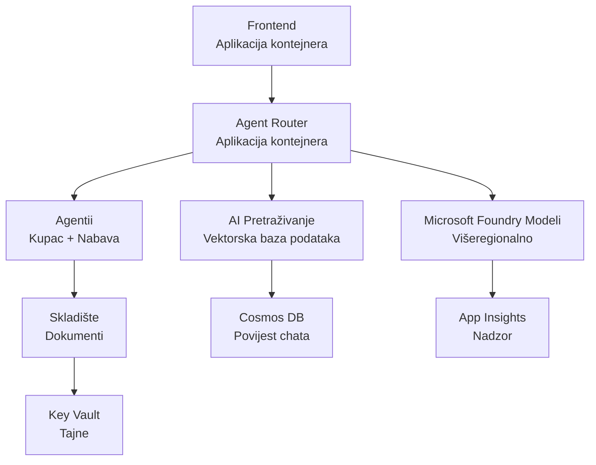

# Retail Multi-Agent Solution - Infrastrukturni Predložak

**Poglavlje 5: Paket za produkcijsko postavljanje**
- **📚 Početna stranica tečaja**: [AZD za početnike](../../README.md)
- **📖 Povezano poglavlje**: [Poglavlje 5: Višeagentska AI rješenja](../../README.md#-chapter-5-multi-agent-ai-solutions-advanced)
- **📝 Vodič za scenarij**: [Kompletna arhitektura](../retail-scenario.md)
- **🎯 Brzo postavljanje**: [Postavljanje jednim klikom](#-quick-deployment)

> **⚠️ SAMO INFRASTRUKTURNI PREDLOŽAK**  
> Ovaj ARM predložak postavlja **Azure resurse** za sustav s više agenata.  
>  
> **Što se postavlja (15-25 minuta):**
> - ✅ Microsoft Foundry modeli (gpt-4.1, gpt-4.1-mini, ugradnje u 3 regije)
> - ✅ AI Search usluga (prazna, spremna za izradu indeksa)
> - ✅ Container Apps (privremene slike, spremne za vaš kod)
> - ✅ Pohrana, Cosmos DB, Key Vault, Application Insights
>  
> **Što NIJE uključeno (zahtijeva razvoj):**
> - ❌ Kod implementacije agenata (Customer Agent, Inventory Agent)
> - ❌ Logika usmjeravanja i API krajnje točke
> - ❌ Frontend chat korisničko sučelje
> - ❌ Sheme indeksa pretraživanja i podatkovni tokovi
> - ❌ **Procijenjeni razvojni napor: 80-120 sati**
>  
> **Koristite ovaj predložak ako:**
> - ✅ Želite pripremiti Azure infrastrukturu za projekt s više agenata
> - ✅ Planirate zaseban razvoj implementacije agenata
> - ✅ Trebate bazu infrastrukture spremnu za produkciju
>  
> **Ne koristite ako:**
> - ❌ Očekujete odmah radni demo s više agenata
> - ❌ Tražite kompletne primjere aplikacijskog koda

## Pregled

Ovaj direktorij sadrži sveobuhvatan Azure Resource Manager (ARM) predložak za postavljanje **infrastrukturne osnove** sustava za korisničku podršku s više agenata. Predložak priprema sve potrebne Azure usluge, pravilno konfigurirane i međusobno povezane, spremne za razvoj vaše aplikacije.

**Nakon postavljanja imat ćete:** Azure infrastrukturu spremnu za produkciju  
**Za dovršetak sustava potreban je:** Kod agenata, frontend korisničko sučelje i konfiguracija podataka (pogledajte [Vodič za arhitekturu](../retail-scenario.md))

## 🎯 Što se postavlja

### Osnovna infrastruktura (Status nakon postavljanja)

✅ **Microsoft Foundry Models usluge** (Spremni za API pozive)
  - Primarna regija: gpt-4.1 postavljanje (kapacitet 20K TPM)
  - Sekundarna regija: gpt-4.1-mini postavljanje (kapacitet 10K TPM)
  - Tercijarna regija: model za tekstualne ugradnje (kapacitet 30K TPM)
  - Evaluacijska regija: gpt-4.1 model za ocjenjivanje (kapacitet 15K TPM)
  - **Status:** Potpuno funkcionalno - može odmah izvršavati API pozive

✅ **Azure AI Search** (Prazno - spremno za konfiguraciju)
  - Omogućene vektorske mogućnosti pretraživanja
  - Standardni sloj s 1 particijom, 1 replikom
  - **Status:** Usluga radi, ali treba kreirati indeks
  - **Potrebna radnja:** Kreirajte indeks pretraživanja s vašom šemom

✅ **Azure Storage račun** (Prazan - spreman za prijenose)
  - Blob spremnici: `documents`, `uploads`
  - Sigurna konfiguracija (samo HTTPS, bez javnog pristupa)
  - **Status:** Spremno za primanje datoteka
  - **Potrebna radnja:** Prenesite podatke o proizvodima i dokumente

⚠️ **Okruženje Container Apps** (Postavljene privremene slike)
  - Aplikacija za usmjerivač agenata (zadana nginx slika)
  - Frontend aplikacija (zadana nginx slika)
  - Konfigurirano automatsko skaliranje (0-10 instanci)
  - **Status:** Pokreću se privremene kontejnere
  - **Potrebna radnja:** Izgradite i postavite svoje aplikacije agenata

✅ **Azure Cosmos DB** (Prazan - spreman za podatke)
  - Baza podataka i spremnik unaprijed konfigurirani
  - Optimizirano za nisku latenciju operacija
  - Omogućeno TTL za automatsko čišćenje
  - **Status:** Spremno za pohranu povijesti chata

✅ **Azure Key Vault** (Opcionalno - spremno za tajne)
  - Omogućeno mekano brisanje
  - Konfiguriran RBAC za upravljane identitete
  - **Status:** Spremno za pohranu API ključeva i konekcijskih nizova

✅ **Application Insights** (Opcionalno - aktivni monitoring)
  - Povezano s radnim prostorom Log Analytics
  - Konfigurirane prilagođene metrike i upozorenja
  - **Status:** Spremno za primanje telemetrije iz aplikacija

✅ **Document Intelligence** (Spremno za API pozive)
  - S0 sloj za produkcijski radni opterećenje
  - **Status:** Spremno za obradu prenesenih dokumenata

✅ **Bing Search API** (Spremno za API pozive)
  - S1 sloj za pretraživanja u stvarnom vremenu
  - **Status:** Spremno za upite web pretraživanja

### Načini postavljanja

| Način | OpenAI kapacitet | Container instance | Sloj pretraživanja | Redundancija pohrane | Najbolje za |
|-------|------------------|--------------------|--------------------|---------------------|-------------|
| **Minimalno** | 10K-20K TPM | 0-2 replike | Osnovni | LRS (lokalno) | Razvoj/test, učenje, dokaz koncepta |
| **Standardno** | 30K-60K TPM | 2-5 replika | Standardni | ZRS (zona) | Produkcija, umjeren promet (<10K korisnika) |
| **Premium** | 80K-150K TPM | 5-10 replika, zona redundantno | Premium | GRS (geografska) | Poduzeće, velik promet (>10K korisnika), SLA 99.99% |

**Utjecaj na troškove:**  
- **Minimalno → Standardno:** ~4x povećanje troškova ($100-370/mj → $420-1,450/mj)  
- **Standardno → Premium:** ~3x povećanje troškova ($420-1,450/mj → $1,150-3,500/mj)  
- **Odaberite prema:** Očekivanom opterećenju, zahtjevima SLA, budžetu

**Planiranje kapaciteta:**  
- **TPM (tokene po minuti):** Ukupno preko svih modela  
- **Container instance:** Raspon automatskog skaliranja (min-max replika)  
- **Sloj pretraživanja:** Utječe na performanse upita i ograničenja veličine indeksa

## 📋 Preduvjeti

### Potrebni alati  
1. **Azure CLI** (verzija 2.50.0 ili novija)  
   ```bash
   az --version  # Provjeri verziju
   az login      # Autentificiraj
   ```
  
2. **Aktivna Azure pretplata** s pristupom vlasnika ili suradnika  
   ```bash
   az account show  # Potvrditi pretplatu
   ```
  
### Potrebne Azure kvote

Prije postavljanja provjerite dovoljno kvota u ciljanim regijama:

```bash
# Provjerite dostupnost Microsoft Foundry Modela u vašoj regiji
az cognitiveservices account list-skus \
  --kind OpenAI \
  --location eastus2

# Provjerite OpenAI kvotu (primjer za gpt-4.1)
az cognitiveservices usage list \
  --location eastus2 \
  --query "[?name.value=='OpenAI.Standard.gpt-4.1']"

# Provjerite kvotu za Container Apps
az provider show \
  --namespace Microsoft.App \
  --query "resourceTypes[?resourceType=='managedEnvironments'].locations"
```
  
**Minimalne potrebne kvote:**  
- **Microsoft Foundry modeli:** 3-4 postavljanja modela u regijama  
  - gpt-4.1: 20K TPM (tokena po minuti)  
  - gpt-4.1-mini: 10K TPM  
  - text-embedding-ada-002: 30K TPM  
  - **Napomena:** gpt-4.1 može imati listu čekanja u nekim regijama - provjerite [dostupnost modela](https://learn.microsoft.com/azure/ai-services/openai/concepts/models)  
- **Container Apps:** Upravljano okruženje + 2-10 instanci kontejnera  
- **AI Search:** Standardni sloj (osnovni sloj nije dovoljan za vektorsko pretraživanje)  
- **Cosmos DB:** Standardno predviđeni propusni opseg  

**Ako kvota nije dovoljna:**  
1. Idite na Azure Portal → Kvote → Zahtjev za povećanjem  
2. Ili koristite Azure CLI:  
   ```bash
   az support tickets create \
     --ticket-name "OpenAI-Quota-Increase" \
     --severity "minimal" \
     --description "Request quota increase for Microsoft Foundry Models gpt-4.1 in eastus2"
   ```
3. Razmotrite alternativne regije s dostupnošću

## 🚀 Brzo postavljanje

### Opcija 1: Korištenje Azure CLI

```bash
# Klonirajte ili preuzmite predloške datoteka
git clone <repository-url>
cd examples/retail-multiagent-arm-template

# Postavite skriptu za raspoređivanje kao izvršnu
chmod +x deploy.sh

# Rasporedite s zadanim postavkama
./deploy.sh -g myResourceGroup

# Rasporedite za produkciju s premium značajkama
./deploy.sh -g myProdRG -e prod -m premium -l eastus2
```
  
### Opcija 2: Korištenje Azure Portala

[](https://portal.azure.com/#create/Microsoft.Template/uri/https%3A%2F%2Fraw.githubusercontent.com%2Fmicrosoft%2Fazd-for-beginners%2Fmain%2Fexamples%2Fretail-multiagent-arm-template%2Fazuredeploy.json)

### Opcija 3: Izravno korištenje Azure CLI

```bash
# Kreiraj grupu resursa
az group create --name myResourceGroup --location eastus2

# Implementiraj predložak
az deployment group create \
  --resource-group myResourceGroup \
  --template-file azuredeploy.json \
  --parameters azuredeploy.parameters.json
```
  
## ⏱️ Vremenski okvir postavljanja

### Što očekivati

| Faza | Trajanje | Što se događa |
|-------|----------|--------------|  
| **Validacija predloška** | 30-60 sekundi | Azure validira sintaksu i parametre ARM predloška |  
| **Postavljanje grupe resursa** | 10-20 sekundi | Stvara grupu resursa (ako je potrebno) |  
| **Provisioning OpenAI** | 5-8 minuta | Stvara 3-4 OpenAI računa i postavlja modele |  
| **Container Apps** | 3-5 minuta | Stvara okruženje i postavlja privremene kontejnere |  
| **Pretraživanje i pohrana** | 2-4 minute | Priprema AI Search uslugu i račune za pohranu |  
| **Cosmos DB** | 2-3 minute | Stvara bazu podataka i konfigurira spremnike |  
| **Postavljanje monitoringa** | 2-3 minute | Postavlja Application Insights i Log Analytics |  
| **Konfiguracija RBAC** | 1-2 minute | Konfigurira upravljane identitete i dopuštenja |  
| **Ukupno postavljanje** | **15-25 minuta** | Infrastruktura spremna |

**Nakon postavljanja:**  
- ✅ **Infrastruktura spremna:** Sve Azure usluge postavljene i aktivne  
- ⏱️ **Razvoj aplikacije:** 80-120 sati (vaša odgovornost)  
- ⏱️ **Konfiguracija indeksa:** 15-30 minuta (zahtijeva vašu šemu)  
- ⏱️ **Prijenos podataka:** Varira ovisno o veličini skupa podataka  
- ⏱️ **Testiranje i validacija:** 2-4 sata

---

## ✅ Provjera uspješnosti postavljanja

### Korak 1: Provjera postavljanja resursa (2 minute)

```bash
# Provjerite jesu li svi resursi uspješno implementirani
az resource list \
  --resource-group myResourceGroup \
  --query "[?provisioningState!='Succeeded'].{Name:name, Status:provisioningState, Type:type}" \
  --output table
```
  
**Očekivano:** Prazna tablica (svi resursi prikazuju status "Succeeded")

### Korak 2: Provjera postavljanja Microsoft Foundry modela (3 minute)

```bash
# Nabrojite sve OpenAI račune
az cognitiveservices account list \
  --resource-group myResourceGroup \
  --query "[?kind=='OpenAI'].{Name:name, Location:location, Status:properties.provisioningState}" \
  --output table

# Provjerite implementacije modela za primarnu regiju
OPENAI_NAME=$(az cognitiveservices account list \
  --resource-group myResourceGroup \
  --query "[?kind=='OpenAI'] | [0].name" -o tsv)

az cognitiveservices account deployment list \
  --name $OPENAI_NAME \
  --resource-group myResourceGroup \
  --output table
```
  
**Očekivano:**  
- 3-4 OpenAI računa (primarni, sekundarni, tercijarni, evaluacijske regije)  
- 1-2 modela po računu (gpt-4.1, gpt-4.1-mini, text-embedding-ada-002)

### Korak 3: Testiranje infrastrukturnih krajnjih točaka (5 minuta)

```bash
# Dohvati URL-ove aplikacije spremnika
az containerapp list \
  --resource-group myResourceGroup \
  --query "[].{Name:name, URL:properties.configuration.ingress.fqdn, Status:properties.runningStatus}" \
  --output table

# Testiraj endpoint usmjerivača (odgovorit će privremena slika)
ROUTER_URL=$(az containerapp show \
  --name retail-router \
  --resource-group myResourceGroup \
  --query "properties.configuration.ingress.fqdn" -o tsv)

echo "Testing: https://$ROUTER_URL"
curl -I https://$ROUTER_URL || echo "Container running (placeholder image - expected)"
```
  
**Očekivano:**  
- Container Apps prikazuju status "Running"  
- Privremeni nginx odgovara s HTTP 200 ili 404 (nema još aplikacijskog koda)

### Korak 4: Provjera pristupa Microsoft Foundry modelima putem API-ja (3 minute)

```bash
# Dohvati OpenAI krajnju točku i ključ
OPENAI_ENDPOINT=$(az cognitiveservices account show \
  --name $OPENAI_NAME \
  --resource-group myResourceGroup \
  --query "properties.endpoint" -o tsv)

OPENAI_KEY=$(az cognitiveservices account keys list \
  --name $OPENAI_NAME \
  --resource-group myResourceGroup \
  --query "key1" -o tsv)

# Testiraj gpt-4.1 implementaciju
curl "${OPENAI_ENDPOINT}openai/deployments/gpt-4.1/chat/completions?api-version=2024-08-01-preview" \
  -H "Content-Type: application/json" \
  -H "api-key: $OPENAI_KEY" \
  -d '{
    "messages": [{"role": "user", "content": "Say hello"}],
    "max_tokens": 10
  }'
```
  
**Očekivano:** JSON odgovor s dovršetkom chata (potvrđuje da OpenAI radi)

### Što radi, a što ne

**✅ Radi nakon postavljanja:**  
- Microsoft Foundry modeli postavljeni i prihvaćaju API pozive  
- AI Search usluga radi (prazna, još bez indeksa)  
- Container Apps aktivni (privremene nginx slike)  
- Računi za pohranu dostupni i spremni za prijenose  
- Cosmos DB spreman za podatkovne operacije  
- Application Insights prikuplja telemetriju infrastrukture  
- Key Vault spreman za pohranu tajni

**❌ Još ne radi (zahtijeva razvoj):**  
- Krajnje točke agenata (nema postavljenog aplikacijskog koda)  
- Funkcionalnost chata (zahtijeva frontend + backend implementaciju)  
- Pretraživački upiti (još nema izrađenih indeksa)  
- Obrada dokumenata (nema prenesenih podataka)  
- Prilagođena telemetrija (zahtijeva instrumentaciju aplikacije)

**Daljnji koraci:** Pogledajte [Postavljanje nakon implementacije](#-post-deployment-next-steps) za razvoj i postavljanje vaše aplikacije

---

## ⚙️ Opcije konfiguracije

### Parametri predloška

| Parametar | Tip | Zadano | Opis |
|-----------|-----|--------|------|
| `projectName` | string | "retail" | Prefiks za sve nazive resursa |
| `location` | string | Lokacija grupe resursa | Primarna regija postavljanja |
| `secondaryLocation` | string | "westus2" | Sekundarna regija za višeregionalno postavljanje |
| `tertiaryLocation` | string | "francecentral" | Regija za model ugradnji |
| `environmentName` | string | "dev" | Oznaka okruženja (dev/staging/prod) |
| `deploymentMode` | string | "standard" | Konfiguracija postavljanja (minimalno/standardno/premium) |
| `enableMultiRegion` | bool | true | Omogući višeregionalno postavljanje |
| `enableMonitoring` | bool | true | Omogući Application Insights i zapisivanje |
| `enableSecurity` | bool | true | Omogući Key Vault i pojačanu sigurnost |

### Prilagodba parametara

Uredite `azuredeploy.parameters.json`:

```json
{
  "$schema": "https://schema.management.azure.com/schemas/2019-04-01/deploymentParameters.json#",
  "contentVersion": "1.0.0.0",
  "parameters": {
    "projectName": {
      "value": "mycompany"
    },
    "environmentName": {
      "value": "prod"
    },
    "deploymentMode": {
      "value": "premium"
    },
    "location": {
      "value": "eastus2"
    }
  }
}
```
  
## 🏗️ Pregled arhitekture


## 📖 Upute za korištenje skripte za postavljanje

Skripta `deploy.sh` pruža interaktivno iskustvo postavljanja:

```bash
# Prikaži pomoć
./deploy.sh --help

# Osnovna implementacija
./deploy.sh -g myResourceGroup

# Napredna implementacija s prilagođenim postavkama
./deploy.sh \
  -g myProductionRG \
  -p companyname \
  -e prod \
  -m premium \
  -l eastus2

# Implementacija za razvoj bez višeregionalnosti
./deploy.sh \
  -g myDevRG \
  -e dev \
  -m minimal \
  --no-multi-region \
  --no-security
```
  
### Značajke skripte

- ✅ **Provjera preduvjeta** (Azure CLI, status prijave, predlošci)  
- ✅ **Upravljanje grupom resursa** (stvaranje ako ne postoji)  
- ✅ **Validacija predloška** prije postavljanja  
- ✅ **Praćenje napretka** s obojenim ispisom  
- ✅ **Prikaz izlaza postavljanja**  
- ✅ **Upute nakon postavljanja**

## 📊 Praćenje postavljanja

### Provjera statusa postavljanja

```bash
# Popis implementacija
az deployment group list --resource-group myResourceGroup --output table

# Dohvati detalje implementacije
az deployment group show \
  --resource-group myResourceGroup \
  --name retail-deployment-YYYYMMDD-HHMMSS

# Prati tijek implementacije
az deployment group create \
  --resource-group myResourceGroup \
  --template-file azuredeploy.json \
  --parameters azuredeploy.parameters.json \
  --verbose
```
  
### Izlazi postavljanja

Nakon uspješnog postavljanja dostupni su sljedeći izlazi:

- **Frontend URL**: Javna krajnja točka za web sučelje  
- **Router URL**: API krajnja točka za usmjerivač agenata  
- **OpenAI krajnje točke**: Primarne i sekundarne krajnje točke OpenAI usluge  
- **Search usluga**: Krajnja točka Azure AI Search usluge  
- **Račun pohrane**: Naziv računa za pohranu dokumenata  
- **Key Vault**: Naziv Key Vaulta (ako je omogućen)  
- **Application Insights**: Naziv usluge za nadzor (ako je omogućen)

## 🔧 Sljedeći koraci nakon postavljanja
> **📝 Važno:** Infrastruktura je implementirana, ali trebate razviti i implementirati kod aplikacije.

### Faza 1: Razvijte Agent aplikacije (Vaša odgovornost)

ARM predložak stvara **prazne Container Apps** s privremenim nginx slikama. Morate:

**Potrebni razvoj:**
1. **Implementacija agenta** (30-40 sati)
   - Agent korisničke službe s integracijom gpt-4.1
   - Agent inventara s integracijom gpt-4.1-mini
   - Logika usmjeravanja agenata

2. **Frontend razvoj** (20-30 sati)
   - UI za chat sučelje (React/Vue/Angular)
   - Funkcionalnost prijenosa datoteka
   - Renderiranje i formatiranje odgovora

3. **Backend servisi** (12-16 sati)
   - FastAPI ili Express router
   - Middleware za autentifikaciju
   - Integracija telemetrije

**Pogledajte:** [Architecture Guide](../retail-scenario.md) za detaljne obrasce implementacije i primjere koda

### Faza 2: Konfigurirajte AI Search index (15-30 minuta)

Kreirajte indeks pretraživanja koji odgovara vašem podatkovnom modelu:

```bash
# Dohvati detalje usluge pretraživanja
SEARCH_NAME=$(az search service list \
  --resource-group myResourceGroup \
  --query "[0].name" -o tsv)

SEARCH_KEY=$(az search admin-key show \
  --service-name $SEARCH_NAME \
  --resource-group myResourceGroup \
  --query "primaryKey" -o tsv)

# Izradi indeks s vašom shemom (primjer)
curl -X POST "https://${SEARCH_NAME}.search.windows.net/indexes?api-version=2023-11-01" \
  -H "Content-Type: application/json" \
  -H "api-key: ${SEARCH_KEY}" \
  -d '{
    "name": "products",
    "fields": [
      {"name": "id", "type": "Edm.String", "key": true},
      {"name": "title", "type": "Edm.String", "searchable": true},
      {"name": "content", "type": "Edm.String", "searchable": true},
      {"name": "category", "type": "Edm.String", "filterable": true},
      {"name": "content_vector", "type": "Collection(Edm.Single)", 
       "searchable": true, "dimensions": 1536, "vectorSearchProfile": "default"}
    ],
    "vectorSearch": {
      "algorithms": [{"name": "default", "kind": "hnsw"}],
      "profiles": [{"name": "default", "algorithm": "default"}]
    }
  }'
```

**Resursi:**
- [AI Search Index Schema Design](https://learn.microsoft.com/azure/search/search-what-is-an-index)
- [Vector Search Configuration](https://learn.microsoft.com/azure/search/vector-search-how-to-create-index)

### Faza 3: Učitajte vaše podatke (Vrijeme varira)

Kad imate podatke o proizvodima i dokumente:

```bash
# Dohvati podatke o računu za pohranu
STORAGE_NAME=$(az storage account list \
  --resource-group myResourceGroup \
  --query "[0].name" -o tsv)

STORAGE_KEY=$(az storage account keys list \
  --account-name $STORAGE_NAME \
  --resource-group myResourceGroup \
  --query "[0].value" -o tsv)

# Učitajte svoje dokumente
az storage blob upload-batch \
  --destination documents \
  --source /path/to/your/product/docs \
  --account-name $STORAGE_NAME \
  --account-key $STORAGE_KEY

# Primjer: Učitajte jednu datoteku
az storage blob upload \
  --container-name documents \
  --name "product-manual.pdf" \
  --file /path/to/product-manual.pdf \
  --account-name $STORAGE_NAME \
  --account-key $STORAGE_KEY
```

### Faza 4: Izgradite i implementirajte vaše aplikacije (8-12 sati)

Kada razvijete kod vašeg agenta:

```bash
# 1. Kreirajte Azure Container Registry (ako je potrebno)
az acr create \
  --name myregistry \
  --resource-group myResourceGroup \
  --sku Basic

# 2. Izgradite i gurnite agent router image
docker build -t myregistry.azurecr.io/agent-router:v1 /path/to/your/router/code
az acr login --name myregistry
docker push myregistry.azurecr.io/agent-router:v1

# 3. Izgradite i gurnite frontend image
docker build -t myregistry.azurecr.io/frontend:v1 /path/to/your/frontend/code
docker push myregistry.azurecr.io/frontend:v1

# 4. Ažurirajte Container Apps s vašim slikama
az containerapp update \
  --name retail-router \
  --resource-group myResourceGroup \
  --image myregistry.azurecr.io/agent-router:v1

az containerapp update \
  --name retail-frontend \
  --resource-group myResourceGroup \
  --image myregistry.azurecr.io/frontend:v1

# 5. Konfigurirajte varijable okoline
az containerapp update \
  --name retail-router \
  --resource-group myResourceGroup \
  --set-env-vars \
    OPENAI_ENDPOINT=secretref:openai-endpoint \
    OPENAI_KEY=secretref:openai-key \
    SEARCH_ENDPOINT=secretref:search-endpoint \
    SEARCH_KEY=secretref:search-key
```

### Faza 5: Testirajte vašu aplikaciju (2-4 sata)

```bash
# Nabavite URL vaše aplikacije
ROUTER_URL=$(az containerapp show \
  --name retail-router \
  --resource-group myResourceGroup \
  --query "properties.configuration.ingress.fqdn" -o tsv)

# Testirajte krajnju točku agenta (nakon što je vaš kod implementiran)
curl -X POST "https://${ROUTER_URL}/chat" \
  -H "Content-Type: application/json" \
  -d '{
    "message": "Hello, I need help with my order",
    "agent": "customer"
  }'

# Provjerite dnevnike aplikacije
az containerapp logs show \
  --name retail-router \
  --resource-group myResourceGroup \
  --follow
```

### Resursi za implementaciju

**Arhitektura i dizajn:**
- 📖 [Complete Architecture Guide](../retail-scenario.md) - Detaljni obrasci implementacije
- 📖 [Multi-Agent Design Patterns](https://learn.microsoft.com/azure/architecture/ai-ml/guide/multi-agent-systems)

**Primjeri koda:**
- 🔗 [Microsoft Foundry Models Chat Sample](https://github.com/Azure-Samples/azure-search-openai-demo) - RAG obrazac
- 🔗 [Semantic Kernel](https://github.com/microsoft/semantic-kernel) - Agent okvir (C#)
- 🔗 [LangChain Azure](https://github.com/langchain-ai/langchain) - Orkestracija agenata (Python)
- 🔗 [AutoGen](https://github.com/microsoft/autogen) - Višeagentski razgovori

**Procijenjeni ukupni napor:**
- Implementacija infrastrukture: 15-25 minuta (✅ Završeno)
- Razvoj aplikacije: 80-120 sati (🔨 Vaš posao)
- Testiranje i optimizacija: 15-25 sati (🔨 Vaš posao)

## 🛠️ Rješavanje problema

### Česti problemi

#### 1. Prekoračenje kvote Microsoft Foundry modela

```bash
# Provjerite trenutačnu upotrebu kvote
az cognitiveservices usage list --location eastus2

# Zatražite povećanje kvote
az support tickets create \
  --ticket-name "OpenAI-Quota-Increase" \
  --severity "minimal" \
  --description "Request quota increase for Microsoft Foundry Models in region X"
```

#### 2. Neuspjela implementacija Container Apps

```bash
# Provjerite dnevnike aplikacije spremnika
az containerapp logs show \
  --name retail-router \
  --resource-group myResourceGroup \
  --follow

# Ponovno pokrenite aplikaciju spremnika
az containerapp revision restart \
  --name retail-router \
  --resource-group myResourceGroup
```

#### 3. Inicijalizacija Search servisa

```bash
# Provjerite status usluge pretraživanja
az search service show \
  --name <search-service-name> \
  --resource-group myResourceGroup

# Testirajte povezanost usluge pretraživanja
curl -X GET "https://<search-service-name>.search.windows.net/indexes?api-version=2023-11-01" \
  -H "api-key: <search-admin-key>"
```

### Validacija implementacije

```bash
# Validirajte da su svi resursi kreirani
az resource list \
  --resource-group myResourceGroup \
  --output table

# Provjerite stanje resursa
az resource list \
  --resource-group myResourceGroup \
  --query "[?provisioningState!='Succeeded'].{Name:name, Status:provisioningState, Type:type}" \
  --output table
```

## 🔐 Sigurnosna razmatranja

### Upravljanje ključevima
- Svi se tajni pohranjuju u Azure Key Vault (kad je omogućeno)
- Container aplikacije koriste upravljani identitet za autentifikaciju
- Računi za pohranu imaju sigurne zadane postavke (samo HTTPS, bez javnog pristupa blobovima)

### Sigurnost mreže
- Container aplikacije koriste internu mrežu gdje je moguće
- Search servis konfiguriran s opcijom privatnih krajnjih točaka
- Cosmos DB konfiguriran s minimalnim potrebnim dopuštenjima

### Konfiguracija RBAC-a
```bash
# Dodijelite potrebne uloge za upravljani identitet
az role assignment create \
  --assignee <container-app-managed-identity> \
  --role "Cognitive Services OpenAI User" \
  --scope <openai-resource-id>
```

## 💰 Optimizacija troškova

### Procjena troškova (mjesečno, USD)

| Način | OpenAI | Container Apps | Search | Pohrana | Ukupno procjena |
|-------|--------|----------------|--------|---------|-----------------|
| Minimalno | $50-200 | $20-50 | $25-100 | $5-20 | $100-370 |
| Standardno | $200-800 | $100-300 | $100-300 | $20-50 | $420-1450 |
| Premium | $500-2000 | $300-800 | $300-600 | $50-100 | $1150-3500 |

### Praćenje troškova

```bash
# Postavite obavijesti o proračunu
az consumption budget create \
  --account-name <subscription-id> \
  --budget-name "retail-budget" \
  --amount 500 \
  --time-grain Monthly \
  --start-date 2024-01-01 \
  --end-date 2024-12-31
```

## 🔄 Ažuriranja i održavanje

### Ažuriranja predloška
- Verzijski nadzor ARM predložaka
- Prvo testirajte izmjene u razvojnom okruženju
- Za ažuriranja koristite inkrementalni način implementacije

### Ažuriranja resursa
```bash
# Ažuriraj s novim parametrima
az deployment group create \
  --resource-group myResourceGroup \
  --template-file azuredeploy.json \
  --parameters azuredeploy.parameters.json \
  --mode Incremental
```

### Sigurnosne kopije i oporavak
- Automatska izrada sigurnosnih kopija Cosmos DB je omogućena
- Omogućen soft delete u Key Vault-u
- Održavaju se revizije Container aplikacija za povratak na prethodno stanje

## 📞 Podrška

- **Problemi s predloškom**: [GitHub Issues](https://github.com/microsoft/azd-for-beginners/issues)
- **Azure podrška**: [Azure Support Portal](https://portal.azure.com/#blade/Microsoft_Azure_Support/HelpAndSupportBlade)
- **Zajednica**: [Azure AI Discord](https://discord.gg/microsoft-azure)

---

**⚡ Spremni za implementaciju vašeg višagentskog rješenja?**

Započnite s: `./deploy.sh -g myResourceGroup`

---

<!-- CO-OP TRANSLATOR DISCLAIMER START -->
**Izjava o odricanju odgovornosti**:  
Ovaj dokument preveden je korištenjem AI prevoditeljske usluge [Co-op Translator](https://github.com/Azure/co-op-translator). Iako težimo točnosti, molimo imajte na umu da automatizirani prijevodi mogu sadržavati pogreške ili netočnosti. Izvorni dokument na izvornom jeziku treba smatrati autoritativnim izvorom. Za kritične informacije preporučuje se profesionalni ljudski prijevod. Nismo odgovorni za bilo kakve nesporazume ili pogrešna tumačenja koja proizađu iz korištenja ovog prijevoda.
<!-- CO-OP TRANSLATOR DISCLAIMER END -->