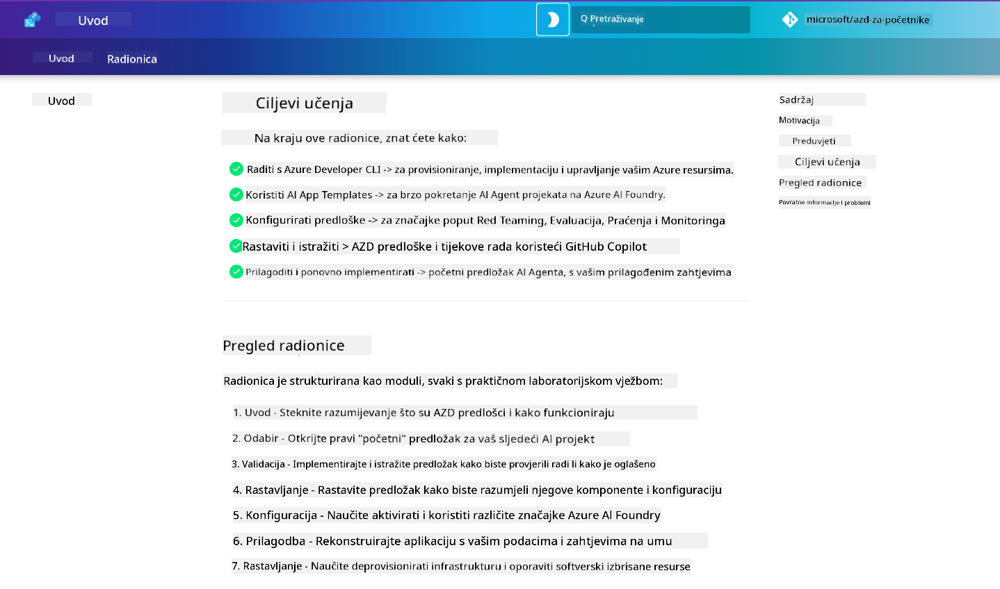

<!--
CO_OP_TRANSLATOR_METADATA:
{
  "original_hash": "9cc966416ab431c38b2ab863884b196c",
  "translation_date": "2025-09-25T01:28:21+00:00",
  "source_file": "workshop/README.md",
  "language_code": "hr"
}
-->
# AZD za AI Developere Radionica

Dobrodošli na praktičnu radionicu za učenje Azure Developer CLI (AZD) s naglaskom na implementaciju AI aplikacija. Ova radionica pomaže vam steći praktično razumijevanje AZD predložaka u 3 koraka:

1. **Istraživanje** - pronađite predložak koji vam odgovara.
1. **Implementacija** - implementirajte i provjerite da radi.
1. **Prilagodba** - modificirajte i prilagodite ga svojim potrebama!

Tijekom radionice također ćete se upoznati s osnovnim alatima za razvoj i radnim procesima koji će vam pomoći optimizirati vaš cjelokupni razvojni put.

<br/>

## Vodič u Pregledniku

Lekcije radionice napisane su u Markdownu. Možete ih pregledavati izravno na GitHubu - ili pokrenuti pregled u pregledniku, kao što je prikazano na slici ispod.



Za korištenje ove opcije - napravite fork repozitorija na svoj profil i pokrenite GitHub Codespaces. Kada terminal u VS Code-u postane aktivan, upišite ovu naredbu:

```bash title="" linenums="0"
mkdocs serve > /dev/null 2>&1 &
```

Za nekoliko sekundi pojavit će se dijalog. Odaberite opciju `Open in browser`. Vodič u pregledniku sada će se otvoriti u novoj kartici preglednika. Neke prednosti ovog pregleda:

1. **Ugrađena pretraga** - brzo pronađite ključne riječi ili lekcije.
1. **Ikona za kopiranje** - zadržite pokazivač iznad blokova koda da biste vidjeli ovu opciju.
1. **Prebacivanje teme** - mijenjajte između tamne i svijetle teme.
1. **Dobijte pomoć** - kliknite na ikonu Discorda u podnožju za pridruživanje!

<br/>

## Pregled Radionice

**Trajanje:** 3-4 sata  
**Razina:** Početnik do srednje napredni  
**Preduvjeti:** Poznavanje Azurea, AI koncepata, VS Code-a i alata naredbenog retka.

Ovo je praktična radionica u kojoj učite kroz rad. Nakon što završite vježbe, preporučujemo pregledavanje AZD za početnike kurikuluma kako biste nastavili svoje učenje o sigurnosti i najboljim praksama produktivnosti.

| Vrijeme | Modul  | Cilj |
|:---|:---|:---|
| 15 min | [Uvod](docs/instructions/0-Introduction.md) | Postavite temelje, razumite ciljeve |
| 30 min | [Odabir AI predloška](docs/instructions/1-Select-AI-Template.md) | Istražite opcije i odaberite početni predložak | 
| 30 min | [Validacija AI predloška](docs/instructions/2-Validate-AI-Template.md) | Implementirajte zadano rješenje na Azure |
| 30 min | [Dekonstrukcija AI predloška](docs/instructions/3-Deconstruct-AI-Template.md) | Istražite strukturu i konfiguraciju |
| 30 min | [Konfiguracija AI predloška](docs/instructions/4-Configure-AI-Template.md) | Aktivirajte i isprobajte dostupne značajke |
| 30 min | [Prilagodba AI predloška](docs/instructions/5-Customize-AI-Template.md) | Prilagodite predložak svojim potrebama |
| 30 min | [Rasformiranje infrastrukture](docs/instructions/6-Teardown-Infrastructure.md) | Očistite i oslobodite resurse |
| 15 min | [Zaključak i sljedeći koraci](docs/instructions/7-Wrap-up.md) | Resursi za učenje, izazov radionice |

<br/>

## Što ćete naučiti

AZD predložak zamislite kao sandbox za učenje u kojem možete istraživati različite mogućnosti i alate za cjelokupni razvoj na Azure AI Foundry. Na kraju radionice trebali biste intuitivno razumjeti razne alate i koncepte u ovom kontekstu.

| Koncept  | Cilj |
|:---|:---|
| **Azure Developer CLI** | Razumjeti naredbe alata i radne procese |
| **AZD predlošci**| Razumjeti strukturu projekta i konfiguraciju |
| **Azure AI Agent**| Postaviti i implementirati projekt na Azure AI Foundry |
| **Azure AI Search**| Omogućiti kontekstualno inženjerstvo s agentima |
| **Promatranje**| Istražiti praćenje, nadzor i evaluacije |
| **Red Teaming**| Istražiti testiranje otpornosti i mitigacije |

<br/>

## Struktura Radionice

Radionica je strukturirana tako da vas vodi na put od otkrivanja predloška, preko implementacije, dekonstrukcije i prilagodbe - koristeći službeni [Getting Started with AI Agents](https://github.com/Azure-Samples/get-started-with-ai-agents) početni predložak kao osnovu.

### [Modul 1: Odabir AI predloška](docs/instructions/1-Select-AI-Template.md) (30 min)

- Što su AI predlošci?
- Gdje mogu pronaći AI predloške?
- Kako mogu započeti s izradom AI agenata?
- **Laboratorij**: Brzi početak s GitHub Codespaces

### [Modul 2: Validacija AI predloška](docs/instructions/2-Validate-AI-Template.md) (30 min)

- Što je arhitektura AI predloška?
- Što je AZD razvojni proces?
- Kako mogu dobiti pomoć za AZD razvoj?
- **Laboratorij**: Implementirajte i validirajte predložak AI agenata

### [Modul 3: Dekonstrukcija AI predloška](docs/instructions/3-Deconstruct-AI-Template.md) (30 min)

- Istražite svoje okruženje u `.azure/` 
- Istražite postavke resursa u `infra/` 
- Istražite AZD konfiguraciju u `azure.yaml`
- **Laboratorij**: Modificirajte varijable okruženja i ponovno implementirajte

### [Modul 4: Konfiguracija AI predloška](docs/instructions/4-Configure-AI-Template.md) (30 min)
- Istražite: Retrieval Augmented Generation
- Istražite: Evaluaciju agenata i Red Teaming
- Istražite: Praćenje i nadzor
- **Laboratorij**: Istražite AI agenta + promatranje 

### [Modul 5: Prilagodba AI predloška](docs/instructions/5-Customize-AI-Template.md) (30 min)
- Definirajte: PRD sa zahtjevima scenarija
- Konfigurirajte: Varijable okruženja za AZD
- Implementirajte: Lifecycle Hooks za dodatne zadatke
- **Laboratorij**: Prilagodite predložak za svoj scenarij

### [Modul 6: Rasformiranje infrastrukture](docs/instructions/6-Teardown-Infrastructure.md) (30 min)
- Recap: Što su AZD predlošci?
- Recap: Zašto koristiti Azure Developer CLI?
- Sljedeći koraci: Isprobajte drugi predložak!
- **Laboratorij**: Rasformirajte infrastrukturu i očistite

<br/>

## Izazov Radionice

Želite li se dodatno izazvati? Evo nekoliko prijedloga za projekte - ili podijelite svoje ideje s nama!!

| Projekt | Opis |
|:---|:---|
|1. **Dekonstrukcija složenog AI predloška** | Koristite radni proces i alate koje smo opisali i provjerite možete li implementirati, validirati i prilagoditi drugi predložak AI rješenja. _Što ste naučili?_|
|2. **Prilagodba za vaš scenarij**  | Pokušajte napisati PRD (Product Requirements Document) za drugi scenarij. Zatim koristite GitHub Copilot u svom repozitoriju predloška u Agent Modelu - i zamolite ga da generira workflow prilagodbe za vas. _Što ste naučili? Kako biste mogli poboljšati ove prijedloge?_|
| | |

## Imate povratne informacije?

1. Objavite problem na ovom repozitoriju - označite ga `Workshop` radi lakšeg prepoznavanja.
1. Pridružite se Azure AI Foundry Discordu - povežite se s kolegama!

| | | 
|:---|:---|
| **📚 Početna stranica tečaja**| [AZD za početnike](../README.md)|
| **📖 Dokumentacija** | [Početak rada s AI predlošcima](https://learn.microsoft.com/en-us/azure/ai-foundry/how-to/develop/ai-template-get-started)|
| **🛠️AI predlošci** | [Azure AI Foundry predlošci](https://ai.azure.com/templates) |
|**🚀 Sljedeći koraci** | [Prihvatite izazov](../../../workshop) |
| | |

<br/>

---

**Prethodno:** [Vodič za rješavanje problema s AI](../docs/troubleshooting/ai-troubleshooting.md) | **Sljedeće:** Započnite s [Laboratorij 1: Osnove AZD-a](../../../workshop/lab-1-azd-basics)

**Spremni za izradu AI aplikacija s AZD-om?**

[Započnite Laboratorij 1: Osnove AZD-a →](./lab-1-azd-basics/README.md)

---

