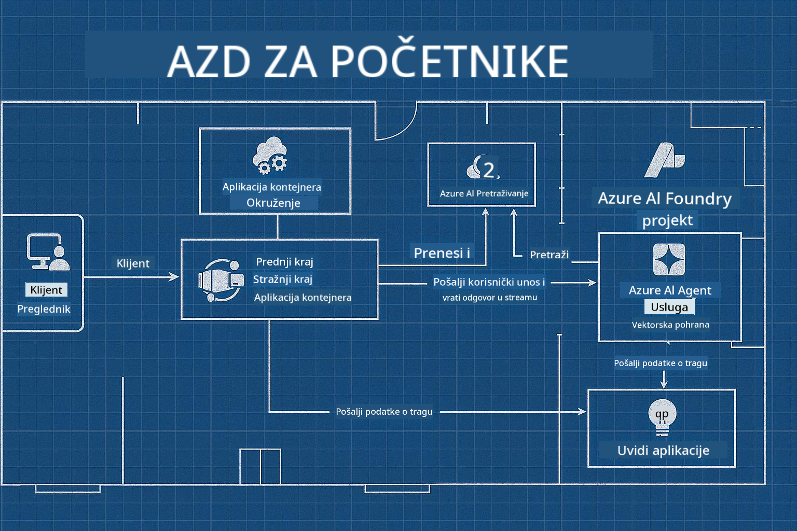

<!--
CO_OP_TRANSLATOR_METADATA:
{
  "original_hash": "245d24997bbcf2bae93bb2a503845d37",
  "translation_date": "2025-09-23T12:07:08+00:00",
  "source_file": "workshop/README.md",
  "language_code": "hr"
}
-->
# AZD za radionicu AI programera

## AZD Predlošci

Izgradnja rješenja za AI aplikaciju na razini poduzeća za vaš specifični scenarij vrlo je slična gradnji vlastitog doma. Možete ga sami osmisliti, graditi ciglu po ciglu i preuzeti odgovornost za osiguranje da zadovoljava sve smjernice za upravljanje i razvoj.

**ILI ....**

Možete surađivati s arhitektom koji vam može dati _nacrt_ za početni dom, a zatim raditi s vama na _prilagodbi_ kako bi odgovarao vašim potrebama. To vam omogućuje da se usredotočite na ono što čini **vaš dom** posebnim, dok stručnjaci brinu o osnovnim instalacijama, vodovodu i drugim ovisnostima.

**Ovo je pristup iza [AI App Templates](https://ai.azure.com/templates)** - serija nacrta za izgradnju različitih vrsta "domova" AI aplikacija ovisno o vašim osnovnim potrebama i ovisnostima.

## Prilagodba predloška

Predlošci su dizajnirani za rad s [Azure AI Foundry](https://ai.azure.com). Zamislite ovu platformu kao vašeg "građevinskog izvođača" s pristupom svim resursima, alatima i stručnosti potrebnim za obavljanje posla!

Sve što trebate je odabrati [svoje početne predloške](https://learn.microsoft.com/en-us/azure/ai-foundry/how-to/develop/ai-template-get-started). Na primjer, usredotočit ćemo se na _Get Started with AI Agents_ predložak kako bismo izgradili "Agentic AI Home" koji dolazi opremljen značajkama poput AI pretraživanja, Red Teaminga, evaluacija, praćenja, nadzora i još mnogo toga!



Sve što trebate je rezervirati vrijeme s arhitektom koji će vas voditi kroz proces prilagodbe. [GitHub Copilot za Azure](https://learn.microsoft.com/en-us/azure/developer/github-copilot-azure/get-started) može biti taj vodič. Jednostavno "razgovarajte s njim" kako biste:

- Naučili o značajkama Azurea u vašem predlošku
- Implementirali Azure resurse
- Dobivali informacije o vašoj implementaciji
- Dijagnosticirali i rješavali probleme!

Na ovoj radionici učimo kako _rastaviti_ postojeći predložak (kako bismo saznali što pruža), zatim ga _prilagoditi_ (kako bismo ispunili naše zahtjeve) - korak po korak.

AI predlošci **čine da radi** - završetkom radionice naučit ćete **kako da bude vaše**

----

**Navigacija radionice**
- **📚 Početna stranica tečaja**: [AZD za početnike](../README.md)
- **📖 Povezana poglavlja**: Obuhvaća [Poglavlje 1](../README.md#-chapter-1-foundation--quick-start), [Poglavlje 2](../README.md#-chapter-2-ai-first-development-recommended-for-ai-developers) i [Poglavlje 5](../README.md#-chapter-5-multi-agent-ai-solutions-advanced)
- **🛠️ Praktični laboratorij**: [AI Workshop Lab](../docs/ai-foundry/ai-workshop-lab.md)
- **🚀 Sljedeći koraci**: [Moduli radionice](../../../workshop)

Dobrodošli na praktičnu radionicu za učenje Azure Developer CLI (AZD) s fokusom na implementaciju AI aplikacija. Ova radionica osmišljena je da vas vodi od osnova AZD-a do implementacije AI rješenja spremnih za produkciju.

## Pregled radionice

**Trajanje:** 2-3 sata  
**Razina:** Početnik do srednje napredni  
**Preduvjeti:** Osnovno znanje o Azureu, alatima naredbenog retka i AI konceptima

### Što ćete naučiti

- **Osnove AZD-a**: Razumijevanje infrastrukture kao koda s AZD-om
- 🤖 **Integracija AI usluga**: Implementacija Azure OpenAI, AI pretraživanja i drugih AI usluga
- **Implementacija kontejnera**: Korištenje Azure Container Apps za AI aplikacije
- **Najbolje prakse sigurnosti**: Primjena Managed Identity i sigurnih konfiguracija
- **Praćenje i preglednost**: Postavljanje Application Insights za AI radna opterećenja
- **Produkcijski obrasci**: Strategije implementacije spremne za poduzeće

## Struktura radionice

### Modul 1: Osnove AZD-a (30 minuta)
- Instalacija i konfiguracija AZD-a
- Razumijevanje strukture AZD projekta
- Vaša prva AZD implementacija
- **Laboratorij**: Implementacija jednostavne web aplikacije

### Modul 2: Integracija Azure OpenAI (45 minuta)
- Postavljanje Azure OpenAI resursa
- Strategije implementacije modela
- Konfiguracija API pristupa i autentifikacije
- **Laboratorij**: Implementacija aplikacije za chat s GPT-4

### Modul 3: RAG aplikacije (45 minuta)
- Integracija Azure AI pretraživanja
- Obrada dokumenata s Azure Document Intelligence
- Vektorski embedding i semantičko pretraživanje
- **Laboratorij**: Izgradnja sustava za pitanja i odgovore na temelju dokumenata

### Modul 4: Produkcijska implementacija (30 minuta)
- Konfiguracija Container Apps
- Optimizacija skaliranja i performansi
- Praćenje i zapisivanje
- **Laboratorij**: Implementacija u produkciju s preglednošću

### Modul 5: Napredni obrasci (15 minuta)
- Implementacije u više okruženja
- Integracija CI/CD-a
- Strategije optimizacije troškova
- **Zaključak**: Kontrolni popis za spremnost za produkciju

## Preduvjeti

### Potrebni alati

Molimo instalirajte ove alate prije radionice:

```bash
# Azure Developer CLI
curl -fsSL https://aka.ms/install-azd.sh | bash

# Azure CLI
curl -sL https://aka.ms/InstallAzureCLIDeb | sudo bash

# Git
sudo apt-get install git

# Docker
curl -fsSL https://get.docker.com -o get-docker.sh
sudo sh get-docker.sh

# Python 3.10+
sudo apt-get install python3.10 python3.10-venv python3-pip
```

### Postavljanje Azure računa

1. **Azure pretplata**: [Prijavite se besplatno](https://azure.microsoft.com/free/)
2. **Pristup Azure OpenAI**: [Zatražite pristup](https://aka.ms/oai/access)
3. **Potrebne dozvole**:
   - Uloga Contributor na pretplati ili grupi resursa
   - User Access Administrator (za RBAC dodjele)

### Provjera preduvjeta

Pokrenite ovaj skript za provjeru vašeg postavljanja:

```bash
#!/bin/bash
echo "Verifying workshop prerequisites..."

# Check AZD installation
if command -v azd &> /dev/null; then
    echo "✅ Azure Developer CLI: $(azd --version)"
else
    echo "❌ Azure Developer CLI not found"
fi

# Check Azure CLI
if command -v az &> /dev/null; then
    echo "✅ Azure CLI: $(az --version | head -n1)"
else
    echo "❌ Azure CLI not found"
fi

# Check Docker
if command -v docker &> /dev/null; then
    echo "✅ Docker: $(docker --version)"
else
    echo "❌ Docker not found"
fi

# Check Python
if command -v python3 &> /dev/null; then
    echo "✅ Python: $(python3 --version)"
else
    echo "❌ Python 3 not found"
fi

# Check Azure login
if az account show &> /dev/null; then
    echo "✅ Azure: Logged in as $(az account show --query user.name -o tsv)"
else
    echo "❌ Azure: Not logged in (run 'az login')"
fi

echo "Setup verification complete!"
```

## Materijali radionice

### Vježbe u laboratoriju

Svaki modul uključuje praktične laboratorije s početnim kodom i korak-po-korak uputama:

- **[lab-1-azd-basics/](../../../workshop/lab-1-azd-basics)** - Vaša prva AZD implementacija
- **[lab-2-openai-chat/](../../../workshop/lab-2-openai-chat)** - Aplikacija za chat s Azure OpenAI
- **[lab-3-rag-search/](../../../workshop/lab-3-rag-search)** - RAG aplikacija s AI pretraživanjem
- **[lab-4-production/](../../../workshop/lab-4-production)** - Obrasci implementacije u produkciju
- **[lab-5-advanced/](../../../workshop/lab-5-advanced)** - Napredni scenariji implementacije

### Referentni materijali

- **[Vodič za integraciju AI Foundry](../docs/ai-foundry/azure-ai-foundry-integration.md)** - Sveobuhvatni obrasci integracije
- **[Vodič za implementaciju AI modela](../docs/ai-foundry/ai-model-deployment.md)** - Najbolje prakse za implementaciju modela
- **[Prakse za produkcijski AI](../docs/ai-foundry/production-ai-practices.md)** - Obrasci implementacije na razini poduzeća
- **[Vodič za rješavanje problema s AI](../docs/troubleshooting/ai-troubleshooting.md)** - Uobičajeni problemi i rješenja

### Uzorci predložaka

Predlošci za brzi početak za uobičajene AI scenarije:

```
workshop/templates/
├── minimal-chat/          # Basic OpenAI chat app
├── rag-application/       # RAG with AI Search
├── multi-model/          # Multiple AI services
└── production-ready/     # Enterprise template
```

## Početak

### Opcija 1: GitHub Codespaces (preporučeno)

Najbrži način za početak radionice:

[](https://github.com/codespaces/new?hide_repo_select=true&ref=main&repo=YOUR_REPO_ID)

### Opcija 2: Lokalni razvoj

1. **Klonirajte repozitorij radionice:**
```bash
git clone https://github.com/YOUR_ORG/AZD-for-beginners.git
cd AZD-for-beginners/workshop
```

2. **Prijavite se na Azure:**
```bash
az login
azd auth login
```

3. **Započnite s laboratorijem 1:**
```bash
cd lab-1-azd-basics
cat README.md  # Follow the instructions
```

### Opcija 3: Radionica s instruktorom

Ako sudjelujete u radionici s instruktorom:

- 🎥 **Snimka radionice**: [Dostupno na zahtjev](https://aka.ms/azd-ai-workshop)
- 💬 **Discord zajednica**: [Pridružite se za podršku uživo](https://aka.ms/foundry/discord)
- **Povratne informacije o radionici**: [Podijelite svoje iskustvo](https://aka.ms/azd-workshop-feedback)

## Vremenski okvir radionice

### Učenje vlastitim tempom (3 sata)

```
⏰ 00:00 - 00:30  Module 1: AZD Foundations
⏰ 00:30 - 01:15  Module 2: Azure OpenAI Integration
⏰ 01:15 - 02:00  Module 3: RAG Applications
⏰ 02:00 - 02:30  Module 4: Production Deployment
⏰ 02:30 - 02:45  Module 5: Advanced Patterns
⏰ 02:45 - 03:00  Q&A and Next Steps
```

### Sesija s instruktorom (2,5 sata)

```
⏰ 00:00 - 00:15  Welcome & Prerequisites Check
⏰ 00:15 - 00:40  Module 1: Live Demo + Lab
⏰ 00:40 - 01:20  Module 2: OpenAI Integration
⏰ 01:20 - 01:30  Break
⏰ 01:30 - 02:10  Module 3: RAG Applications
⏰ 02:10 - 02:30  Module 4: Production Patterns
⏰ 02:30 - 02:45  Module 5: Advanced Topics
⏰ 02:45 - 03:00  Q&A and Resources
```

## Kriteriji uspjeha

Do kraja ove radionice, moći ćete:

✅ **Implementirati AI aplikacije** koristeći AZD predloške  
✅ **Konfigurirati Azure OpenAI** usluge s odgovarajućom sigurnošću  
✅ **Izgraditi RAG aplikacije** s integracijom Azure AI pretraživanja  
✅ **Primijeniti produkcijske obrasce** za AI radna opterećenja na razini poduzeća  
✅ **Pratiti i rješavati probleme** s implementacijom AI aplikacija  
✅ **Primijeniti strategije optimizacije troškova** za AI radna opterećenja  

## Zajednica i podrška

### Tijekom radionice

- 🙋 **Pitanja**: Koristite chat radionice ili podignite ruku
- 🐛 **Problemi**: Provjerite [vodič za rješavanje problema](../docs/troubleshooting/ai-troubleshooting.md)
- **Savjeti**: Podijelite otkrića s drugim sudionicima

### Nakon radionice

- 💬 **Discord**: [Azure AI Foundry zajednica](https://aka.ms/foundry/discord)
- **GitHub Issues**: [Prijavite probleme s predlošcima](https://github.com/YOUR_ORG/AZD-for-beginners/issues)
- 📧 **Povratne informacije**: [Obrazac za evaluaciju radionice](https://aka.ms/azd-workshop-feedback)

## Sljedeći koraci

### Nastavite učiti

1. **Napredni scenariji**: Istražite [implementacije u više regija](../docs/ai-foundry/production-ai-practices.md#multi-region-deployment)
2. **Integracija CI/CD-a**: Postavite [GitHub Actions workflows](../docs/deployment/github-actions.md)
3. **Prilagođeni predlošci**: Kreirajte vlastite [AZD predloške](../docs/getting-started/custom-templates.md)

### Primijenite u svojim projektima

1. **Procjena**: Koristite naš [kontrolni popis spremnosti](./production-readiness-checklist.md)
2. **Predlošci**: Započnite s našim [AI-specifičnim predlošcima](../../../workshop/templates)
3. **Podrška**: Pridružite se [Azure AI Foundry Discord](https://aka.ms/foundry/discord)

### Podijelite svoj uspjeh

- ⭐ **Označite repozitorij zvjezdicom** ako vam je radionica pomogla
- 🐦 **Podijelite na društvenim mrežama** s #AzureDeveloperCLI #AzureAI
- 📝 **Napišite blog post** o svom putovanju implementacije AI-a

---

## Povratne informacije o radionici

Vaše povratne informacije pomažu nam poboljšati iskustvo radionice:

| Aspekt | Ocjena (1-5) | Komentari |
|--------|--------------|----------|
| Kvaliteta sadržaja | ⭐⭐⭐⭐⭐ | |
| Praktični laboratoriji | ⭐⭐⭐⭐⭐ | |
| Dokumentacija | ⭐⭐⭐⭐⭐ | |
| Razina težine | ⭐⭐⭐⭐⭐ | |
| Ukupno iskustvo | ⭐⭐⭐⭐⭐ | |

**Pošaljite povratne informacije**: [Obrazac za evaluaciju radionice](https://aka.ms/azd-workshop-feedback)

---

**Prethodno:** [Vodič za rješavanje problema s AI](../docs/troubleshooting/ai-troubleshooting.md) | **Sljedeće:** Započnite s [Laboratorijem 1: Osnove AZD-a](../../../workshop/lab-1-azd-basics)

**Spremni za početak izgradnje AI aplikacija s AZD-om?**

[Započnite Laboratorij 1: Osnove AZD-a →](./lab-1-azd-basics/README.md)

---

