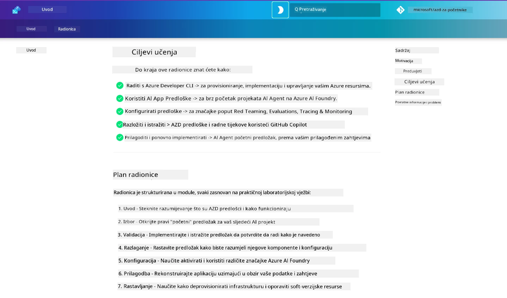

<div align="center">
  <div style="background: linear-gradient(135deg, #0078d4, #106ebe); border-radius: 10px; padding: 20px; margin: 20px 0; box-shadow: 0 4px 15px rgba(0, 120, 212, 0.3); border: 2px solid #005a9e;">
    <h2 style="color: white; margin: 0; font-size: 24px; text-shadow: 1px 1px 2px rgba(0,0,0,0.3);">
      🎯 Radionica AZD za AI programere
    </h2>
    <p style="color: white; margin: 10px 0 0 0; font-size: 16px; text-shadow: 1px 1px 2px rgba(0,0,0,0.3);">
      <strong>Radionica s praktičnim radom za izgradnju AI aplikacija pomoću Azure Developer CLI.</strong><br>
      Završite 7 modula kako biste savladali AZD predloške i tijekove rada za implementaciju AI-a.
    </p>
    <div style="margin-top: 15px;">
      <span style="background: rgba(255,255,255,0.2); padding: 5px 10px; border-radius: 15px; color: white; font-size: 14px;">
        📅 Zadnje ažuriranje: ožujak 2026.
      </span>
    </div>
  </div>
</div>

# Radionica AZD za AI programere

Dobrodošli na radionicu s praktičnim radom za učenje Azure Developer CLI (AZD) s naglaskom na implementaciju AI aplikacija. Ova radionica pomaže vam steći primijenjeno razumijevanje AZD predložaka u 3 koraka:

1. **Otkriće** - pronađite predložak koji vam odgovara.
1. **Implementacija** - implementirajte i provjerite radi li
1. **Prilagodba** - modificirajte i iterirajte da postane vaš!

Tijekom ove radionice upoznat ćete se i s osnovnim programerskim alatima i tijekovima rada kako biste pojednostavnili svoj razvojni put od početka do kraja.

<br/>

## Vodič putem preglednika

Lekcije radionice su u Markdownu. Možete ih pregledavati izravno na GitHubu - ili pokrenuti pregled u pregledniku kao što je prikazano na slici ispod.



Da biste koristili ovu opciju - forkajte repozitorij na svoj profil i pokrenite GitHub Codespaces. Kad je terminal VS Code aktivan, upišite ovu naredbu:

Ovaj pregled u pregledniku radi u GitHub Codespaces, razvojnom spremniku ili lokalnoj kloni s instaliranim Python i MkDocs.

```bash title="" linenums="0"
mkdocs serve > /dev/null 2>&1 &
```

Za nekoliko sekundi vidjet ćete iskačući dijalog. Odaberite opciju `Open in browser`. Vodič putem preglednika sada će se otvoriti u novoj kartici preglednika. Neke prednosti ovog pregleda:

1. **Integrirana pretraga** - brzo pronađite ključne riječi ili lekcije.
1. **Ikona za kopiranje** - pređite mišem preko kodnih blokova da vidite ovu opciju
1. **Prebacivanje tema** - mijenjajte između tamne i svijetle teme
1. **Pomoć** - kliknite Discord ikonu u podnožju za pridruživanje!

<br/>

## Pregled radionice

**Trajanje:** 3-4 sata  
**Razina:** Početni do srednji  
**Preduvjeti:** Poznavanje Azure, AI pojmova, VS Code i naredbenih alata.

Ovo je radionica s praktičnim radom gdje učite radeći. Nakon što završite vježbe, preporučujemo pregledavanje kurikuluma AZD za početnike kako biste nastavili svoj obrazovni put u sigurnosti i najboljim praksama produktivnosti.

| Vrijeme | Modul  | Cilj |
|:---|:---|:---|
| 15 min | [Uvod](docs/instructions/0-Introduction.md) | Postavljanje temelja, razumijevanje ciljeva |
| 30 min | [Odabir AI predloška](docs/instructions/1-Select-AI-Template.md) | Istražite opcije i odaberite početni |
| 30 min | [Provjera AI predloška](docs/instructions/2-Validate-AI-Template.md) | Implementirajte zadano rješenje na Azure |
| 30 min | [Razgradnja AI predloška](docs/instructions/3-Deconstruct-AI-Template.md) | Istražite strukturu i konfiguraciju |
| 30 min | [Konfiguriranje AI predloška](docs/instructions/4-Configure-AI-Template.md) | Aktivirajte i isprobajte dostupne značajke |
| 30 min | [Prilagodba AI predloška](docs/instructions/5-Customize-AI-Template.md) | Prilagodite predložak svojim potrebama |
| 30 min | [Raskid infrastrukture](docs/instructions/6-Teardown-Infrastructure.md) | Očistite i oslobodite resurse |
| 15 min | [Zaključak i sljedeći koraci](docs/instructions/7-Wrap-up.md) | Resursi za učenje, izazov radionice |

<br/>

## Što ćete naučiti

Razmislite o AZD predlošku kao o sandbox okruženju za učenje u kojem istražujete različite mogućnosti i alate za razvoj od početka do kraja na Microsoft Foundry. Do kraja ove radionice trebali biste imati intuitivan osjećaj za različite alate i pojmove u ovom kontekstu.

| Koncept | Cilj |
|:---|:---|
| **Azure Developer CLI** | Razumjeti naredbe alata i tijekove rada |
| **AZD predlošci** | Razumjeti strukturu projekta i konfiguraciju |
| **Azure AI Agent** | Provision i implementacija Microsoft Foundry projekata |
| **Azure AI Search** | Omogućiti inženjerstvo konteksta agentima |
| **Promatranje** | Istražiti praćenje, nadzor i evaluacije |
| **Red Teaming** | Istražiti adverzarijalno testiranje i mitigacije |

<br/>

## Struktura radionice

Radionica je strukturirana da vas vodi na putovanju od otkrića predloška do implementacije, razgradnje i prilagodbe - koristeći službeni [Getting Started with AI Agents](https://github.com/Azure-Samples/get-started-with-ai-agents) početni predložak kao osnovu.

### [Modul 1: Odabir AI predloška](docs/instructions/1-Select-AI-Template.md) (30 min)

- Što su AI predlošci?
- Gdje mogu pronaći AI predloške?
- Kako mogu započeti izgradnju AI agenata?
- **Lab:** Brzi početak u Codespaces ili razvojnom spremniku

### [Modul 2: Provjera AI predloška](docs/instructions/2-Validate-AI-Template.md) (30 min)

- Što je arhitektura AI predloška?
- Što je AZD razvojni tijek rada?
- Kako mogu dobiti pomoć za razvoj s AZD-om?
- **Lab:** Implementirajte i provjerite AI agents predložak

### [Modul 3: Razgradnja AI predloška](docs/instructions/3-Deconstruct-AI-Template.md) (30 min)

- Istražite svoje okruženje u `.azure/`
- Istražite postavke resursa u `infra/`
- Istražite svoju AZD konfiguraciju u `azure.yaml` datotekama
- **Lab:** Izmijenite varijable okoline i ponovno implementirajte

### [Modul 4: Konfiguriranje AI predloška](docs/instructions/4-Configure-AI-Template.md) (30 min)
- Istražite: Retrieval Augmented Generation
- Istražite: Evaluaciju agenata i Red Teaming
- Istražite: Praćenje i nadzor
- **Lab:** Istražite AI agenta + Promatranje

### [Modul 5: Prilagodba AI predloška](docs/instructions/5-Customize-AI-Template.md) (30 min)
- Definirajte: PRD sa zahtjevima scenarija
- Konfigurirajte: Varijable okoline za AZD
- Implementirajte: Lifecycle Hooks za dodatne zadatke
- **Lab:** Prilagodite predložak za svoj scenarij

### [Modul 6: Raskid infrastrukture](docs/instructions/6-Teardown-Infrastructure.md) (30 min)
- Sažetak: Što su AZD predlošci?
- Sažetak: Zašto koristiti Azure Developer CLI?
- Sljedeći koraci: Isprobajte drugi predložak!
- **Lab:** Deprovision infrastrukturu i očistite

<br/>

## Izazov radionice

Želite li se izazvati da učinite više? Evo prijedloga za projekte - ili podijelite svoje ideje s nama!!

| Projekt | Opis |
|:---|:---|
|1. **Razgradnja složenog AI predloška** | Koristite tijek rada i alate koje smo opisali i provjerite možete li implementirati, provjeriti i prilagoditi drugi AI predložak rješenja. _Što ste naučili?_|
|2. **Prilagodite scenarij svojom situacijom** | Pokušajte napisati PRD (Dokument zahtjeva proizvoda) za drugi scenarij. Zatim upotrijebite GitHub Copilot u svom repozitoriju predloška u Agent Modelu - i zamolite ga da generira tijek rada prilagodbe za vas. _Što ste naučili? Kako biste mogli poboljšati ove prijedloge?_|
| | |

## Imate povratnu informaciju?

1. Pošaljite issue na ovaj repozitorij - označite ga s `Workshop` radi jednostavnosti.
1. Pridružite se Microsoft Foundry Discordu - povežite se sa svojim kolegama!


| | | 
|:---|:---|
| **📚 Početna stranica tečaja**| [AZD za početnike](../README.md)|
| **📖 Dokumentacija** | [Započnite s AI predlošcima](https://learn.microsoft.com/en-us/azure/ai-foundry/how-to/develop/ai-template-get-started)|
| **🛠️ AI predlošci** | [Microsoft Foundry predlošci](https://ai.azure.com/templates) |
|**🚀 Sljedeći koraci** | [Započni radionicu](#pregled-radionice) |
| | |

<br/>

---

**Navigacija:** [Glavni tečaj](../README.md) | [Uvod](docs/instructions/0-Introduction.md) | [Modul 1: Odabir predloška](docs/instructions/1-Select-AI-Template.md)

**Spremni za početak izgradnje AI aplikacija s AZD-om?**

[Započni radionicu: Uvod →](docs/instructions/0-Introduction.md)

---

<!-- CO-OP TRANSLATOR DISCLAIMER START -->
**Odricanje od odgovornosti**:
Ovaj dokument je preveden koristeći AI uslugu prevođenja [Co-op Translator](https://github.com/Azure/co-op-translator). Iako nastojimo postići točnost, molimo imajte na umu da automatski prijevodi mogu sadržavati pogreške ili netočnosti. Izvorni dokument na izvornom jeziku treba smatrati autoritativnim izvorom. Za bitne informacije preporučuje se profesionalni ljudski prijevod. Ne snosimo odgovornost za nesporazume ili pogrešne interpretacije koje proizlaze iz korištenja ovog prijevoda.
<!-- CO-OP TRANSLATOR DISCLAIMER END -->