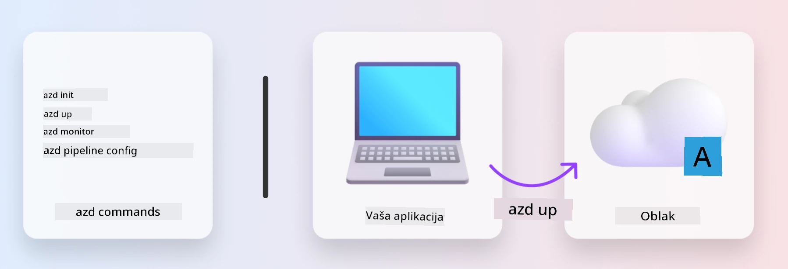
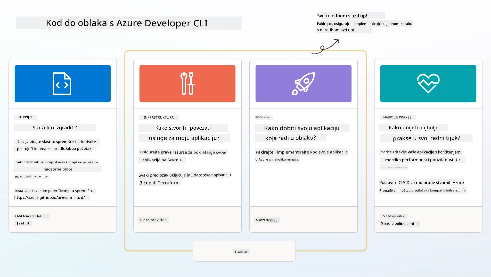

# 1. Odabir predloška

!!! tip "NA KRAJU OVOG MODULA MOĆI ĆETE"

    - [ ] Objasniti što su AZD predlošci
    - [ ] Pronaći i koristiti AZD predloške za AI
    - [ ] Započeti s predloškom AI Agents
    - [ ] **Laboratorij 1:** AZD Quickstart s GitHub Codespaces

---

## 1. Analogija graditelja

Izgradnja moderne AI aplikacije spremne za poslovanje _od nule_ može biti zastrašujuća. To je pomalo kao da sami gradite novu kuću, ciglu po ciglu. Da, moguće je! Ali to nije najučinkovitiji način za postizanje željenog rezultata!

Umjesto toga, često započinjemo s postojećim _projektom dizajna_ i radimo s arhitektom kako bismo ga prilagodili našim osobnim zahtjevima. Upravo takav pristup treba primijeniti pri izgradnji inteligentnih aplikacija. Prvo, pronađite dobru arhitekturu dizajna koja odgovara vašem problemu. Zatim surađujte s arhitektom rješenja kako biste prilagodili i razvili rješenje za vaš specifični scenarij.

Ali gdje možemo pronaći te projekte dizajna? I kako pronaći arhitekta koji je spreman naučiti nas kako prilagoditi i implementirati te projekte sami? U ovoj radionici odgovaramo na ta pitanja predstavljajući vam tri tehnologije:

1. [Azure Developer CLI](https://aka.ms/azd) - alat otvorenog koda koji ubrzava put razvoja od lokalnog razvoja (build) do implementacije u oblaku (ship).
1. [Azure AI Foundry Templates](https://ai.azure.com/templates) - standardizirani repozitoriji otvorenog koda koji sadrže uzorak koda, infrastrukturu i konfiguracijske datoteke za implementaciju AI arhitekture rješenja.
1. [GitHub Copilot Agent Mode](https://code.visualstudio.com/docs/copilot/chat/chat-agent-mode) - agent za kodiranje temeljen na Azure znanju, koji nas može voditi kroz kodnu bazu i pomoći u izmjenama koristeći prirodni jezik.

S ovim alatima u rukama, sada možemo _pronaći_ pravi predložak, _implementirati_ ga kako bismo provjerili radi li, i _prilagoditi_ ga kako bi odgovarao našim specifičnim scenarijima. Zaronimo i naučimo kako oni funkcioniraju.

---

## 2. Azure Developer CLI

[Azure Developer CLI](https://learn.microsoft.com/en-us/azure/developer/azure-developer-cli/) (ili `azd`) je alat otvorenog koda za naredbeni redak koji može ubrzati vaš put od koda do oblaka s nizom naredbi prilagođenih programerima koje dosljedno rade u vašem IDE (razvoj) i CI/CD (devops) okruženju.

S `azd`, vaš put implementacije može biti jednostavan kao:

- `azd init` - Inicijalizira novi AI projekt iz postojećeg AZD predloška.
- `azd up` - Omogućuje infrastrukturu i implementira vašu aplikaciju u jednom koraku.
- `azd monitor` - Omogućuje praćenje u stvarnom vremenu i dijagnostiku za vašu implementiranu aplikaciju.
- `azd pipeline config` - Postavlja CI/CD pipeline za automatizaciju implementacije na Azure.

**🎯 | VJEŽBA**: <br/> Istražite alat `azd` u svom GitHub Codespaces okruženju sada. Započnite unosom ove naredbe kako biste vidjeli što alat može učiniti:

```bash title="" linenums="0"
azd help
```



---

## 3. AZD predložak

Da bi `azd` postigao ovo, mora znati infrastrukturu koju treba omogućiti, konfiguracijske postavke koje treba primijeniti i aplikaciju koju treba implementirati. Ovdje dolaze [AZD predlošci](https://learn.microsoft.com/en-us/azure/developer/azure-developer-cli/azd-templates?tabs=csharp).

AZD predlošci su repozitoriji otvorenog koda koji kombiniraju uzorak koda s infrastrukturnim i konfiguracijskim datotekama potrebnim za implementaciju arhitekture rješenja. 
Koristeći pristup _Infrastructure-as-Code_ (IaC), omogućuju da definicije resursa predloška i konfiguracijske postavke budu pod kontrolom verzija (kao i izvorni kod aplikacije) - stvarajući ponovljive i dosljedne tijekove rada među korisnicima tog projekta.

Kada kreirate ili ponovno koristite AZD predložak za _vaš_ scenarij, razmotrite ova pitanja:

1. Što gradite? → Postoji li predložak koji ima početni kod za taj scenarij?
1. Kako je vaše rješenje arhitektirano? → Postoji li predložak koji ima potrebne resurse?
1. Kako se vaše rješenje implementira? → Razmislite o `azd deploy` s pre/post-procesnim koracima!
1. Kako ga možete dodatno optimizirati? → Razmislite o ugrađenom praćenju i automatiziranim pipelineovima!

**🎯 | VJEŽBA**: <br/> 
Posjetite galeriju [Awesome AZD](https://azure.github.io/awesome-azd/) i koristite filtre za istraživanje više od 250 predložaka koji su trenutno dostupni. Pogledajte možete li pronaći onaj koji odgovara _vašim_ zahtjevima scenarija.



---

## 4. Predlošci za AI aplikacije

---

