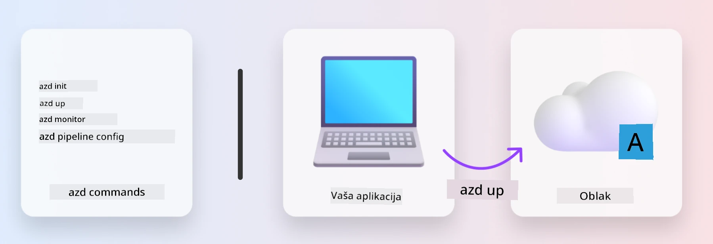
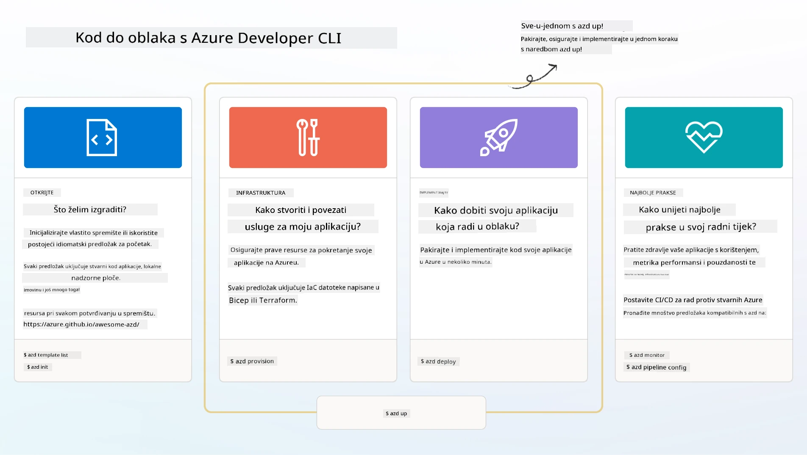

# 1. Odaberite predložak

!!! tip "NA KRAJU OVOG MODULA MOĆI ĆETE"

    - [ ] Opisati što su AZD predlošci
    - [ ] Pronaći i koristiti AZD predloške za AI
    - [ ] Započeti s predloškom AI agenata
    - [ ] **Lab 1:** AZD Quickstart u Codespaces ili razvojnom kontejneru

---

## 1. Analogija graditelja

Izgradnja moderne, spremne za poduzeće AI aplikacije _od nule_ može biti zastrašujuća. To je malo kao graditi svoju novu kuću sam, ciglu po ciglu. Da, može se napraviti! Ali to nije najučinkovitiji način za postizanje željenog krajnjeg rezultata!

Umjesto toga, često počinjemo s postojećim _dizajnerskim planom_, i radimo s arhitektom kako bismo ga prilagodili našim osobnim zahtjevima. I upravo je to pristup koji treba primijeniti pri izgradnji inteligentnih aplikacija. Prvo pronađite dobar dizajn arhitekture koja odgovara vašem problemu. Zatim surađujte s arhitektom rješenja koji će prilagoditi i razviti rješenje za vaš specifični scenarij.

Ali gdje možemo pronaći te dizajnerske planove? I kako pronaći arhitekta koji je voljan naučiti nas kako prilagoditi i implementirati te planove samostalno? U ovom radionici odgovaramo na ta pitanja predstavljajući vam tri tehnologije:

1. [Azure Developer CLI](https://aka.ms/azd) - open-source alat koji ubrzava razvojni put od lokalnog razvoja (build) do implementacije u oblaku (ship).
1. [Microsoft Foundry Templates](https://ai.azure.com/templates) - standardizirani open-source repozitoriji koji sadrže uzorke koda, infrastrukture i konfiguracijske datoteke za implementaciju AI arhitekture rješenja.
1. [GitHub Copilot Agent Mode](https://code.visualstudio.com/docs/copilot/chat/chat-agent-mode) - kodirajući agent utemeljen na Azure znanju, koji nas može voditi u navigaciji kroz bazu koda i izvođenju promjena - koristeći prirodni jezik.

S ovim alatima u rukama, sada možemo _otkriti_ odgovarajući predložak, _implementirati_ ga da bismo potvrdili da radi i _prilagoditi_ ga za naše specifične scenarije. Krenimo i naučimo kako to funkcionira.


---

## 2. Azure Developer CLI

[Azure Developer CLI](https://learn.microsoft.com/en-us/azure/developer/azure-developer-cli/) (ili `azd`) je open-source alat naredbenog retka koji može ubrzati vaš put od koda do oblaka s nizom korisnički prilagođenih naredbi koje dosljedno rade u vašem IDE-u (razvojnom okruženju) i CI/CD (devops) okruženjima.

S `azd` vaš put implementacije može biti jednostavan kao:

- `azd init` - inicijalizira novi AI projekt iz postojećeg AZD predloška.
- `azd up` - u jednom koraku osigurava infrastrukturu i implementira vašu aplikaciju.
- `azd monitor` - daje nadzor i dijagnostiku u stvarnom vremenu za vašu implementiranu aplikaciju.
- `azd pipeline config` - postavlja CI/CD pipelineove za automatiziranu implementaciju u Azure.

**🎯 | VJEŽBA**: <br/> Istražite alat naredbenog retka `azd` u vašem trenutnom radnom okruženju. To može biti GitHub Codespaces, razvojni kontejner ili lokalna kopija s instaliranim preduvjetima. Počnite tako da upišete ovu naredbu i vidite što alat može učiniti:

```bash title="" linenums="0"
azd help
```



---

## 3. AZD predložak

Da bi `azd` to postigao, treba znati koju infrastrukturu treba osigurati, koja konfiguracijska podešavanja primijeniti i koju aplikaciju implementirati. Tu dolaze do izražaja [AZD predlošci](https://learn.microsoft.com/en-us/azure/developer/azure-developer-cli/azd-templates?tabs=csharp).

AZD predlošci su open-source repozitoriji koji kombiniraju uzorak koda s infrastrukturnim i konfiguracijskim datotekama potrebnim za implementaciju arhitekture rješenja.
Korištenjem pristupa _Infrastructure-as-Code_ (IaC), oni omogućuju definicije resursa i konfiguracijska podešavanja predloška da budu verzionirana (kao i izvorni kôd aplikacije) - stvarajući ponovljive i dosljedne radne tijekove među korisnicima tog projekta.

Prilikom stvaranja ili ponovne upotrebe AZD predloška za _vaš_ scenarij, razmotrite ova pitanja:

1. Što gradite? → Postoji li predložak koji ima početni kod za taj scenarij?
1. Kako je vaše rješenje arhitektirano? → Postoji li predložak s potrebnim resursima?
1. Kako se vaše rješenje implementira? → Razmislite o `azd deploy` s pre/post-obrambenim skriptama!
1. Kako ga možete dodatno optimizirati? → Razmislite o ugrađenom nadzoru i automatiziranim pipelineovima!

**🎯 | VJEŽBA**: <br/>
Posjetite galeriju [Awesome AZD](https://azure.github.io/awesome-azd/) i koristite filtere da istražite preko 250 trenutno dostupnih predložaka. Pokušajte pronaći onaj koji odgovara _vašim_ scenarijskim zahtjevima.



---

## 4. AI predlošci aplikacija

Za AI aplikacije, Microsoft pruža specijalizirane predloške koji koriste **Microsoft Foundry** i **Foundry Agents**. Ovi predlošci ubrzavaju vaš put do gradnje inteligentnih, spremnih za produkciju aplikacija.

### Microsoft Foundry & Foundry Agents predlošci

Odaberite predložak ispod za implementaciju. Svaki je predložak dostupan na [Awesome AZD](https://azure.github.io/awesome-azd/) i može se inicijalizirati jednom naredbom.

| Predložak | Opis | Naredba za implementaciju |
|----------|-------------|----------------|
| **[AI Chat with RAG](https://azure.github.io/awesome-azd/?tags=ai&tags=rag)** | Chat aplikacija s Retrieval Augmented Generation koristeći Microsoft Foundry | `azd init -t azure-samples/azure-search-openai-demo` |
| **[Foundry Agent Service Starter](https://azure.github.io/awesome-azd/?tags=ai&tags=agents)** | Izgradite AI agente s Foundry Agents za autonomno izvršavanje zadataka | `azd init -t azure-samples/foundry-agent-service-starter` |
| **[Multi-Agent Orchestration](https://azure.github.io/awesome-azd/?tags=ai&tags=agents)** | Koordinirajte više Foundry Agenata za složene radne tijekove | `azd init -t azure-samples/multi-agent-orchestration` |
| **[AI Document Intelligence](https://azure.github.io/awesome-azd/?tags=ai&tags=document)** | Izvlačenje i analiza dokumenata korištenjem Microsoft Foundry modela | `azd init -t azure-samples/ai-document-processing` |
| **[Conversational AI Bot](https://azure.github.io/awesome-azd/?tags=ai&tags=bot)** | Izgradnja inteligentnih chatbota s integracijom Microsoft Foundry | `azd init -t azure-samples/ai-chat-protocol` |
| **[AI Image Generation](https://azure.github.io/awesome-azd/?tags=ai&tags=dalle)** | Generiranje slika pomoću DALL-E preko Microsoft Foundry | `azd init -t azure-samples/ai-image-generation` |
| **[Semantic Kernel Agent](https://azure.github.io/awesome-azd/?tags=ai&tags=semantic-kernel)** | AI agenti koristeći Semantic Kernel s Foundry Agents | `azd init -t azure-samples/semantic-kernel-agent` |
| **[AutoGen Multi-Agent](https://azure.github.io/awesome-azd/?tags=ai&tags=autogen)** | Višestruki agentski sustavi koristeći AutoGen okvir | `azd init -t azure-samples/autogen-multi-agent` |

### Brzi početak

1. **Pregledajte predloške**: Posjetite [https://azure.github.io/awesome-azd/](https://azure.github.io/awesome-azd/) i filtrirajte po `AI`, `Agents` ili `Microsoft Foundry`
2. **Odaberite predložak**: Izaberite onaj koji odgovara vašem slučaju upotrebe
3. **Inicijalizirajte**: Pokrenite naredbu `azd init` za odabrani predložak
4. **Implementirajte**: Pokrenite `azd up` za osiguranje i implementaciju

**🎯 | VJEŽBA**: <br/>
Odaberite jedan od gornjih predložaka na temelju svog scenarija:

- **Gradite chatbota?** → Počnite s **AI Chat with RAG** ili **Conversational AI Bot**
- **Trebate autonomne agente?** → Isprobajte **Foundry Agent Service Starter** ili **Multi-Agent Orchestration**
- **Obradjujete dokumente?** → Koristite **AI Document Intelligence**
- **Želite pomoć u kodiranju AI-em?** → Istražite **Semantic Kernel Agent** ili **AutoGen Multi-Agent**

```bash title="Example: Deploy the AI Chat with RAG template" linenums="0"
azd init -t azure-samples/azure-search-openai-demo
azd up
```

!!! info "Istražite Više Predložaka"
    Galerija [Awesome AZD](https://azure.github.io/awesome-azd/) sadrži preko 250 predložaka. Koristite filtere da pronađete predloške koji odgovaraju vašim specifičnim zahtjevima za jezik, okvir i Azure usluge.

---

<!-- CO-OP TRANSLATOR DISCLAIMER START -->
**Odricanje od odgovornosti**:
Ovaj dokument je preveden korištenjem AI usluge za prijevod [Co-op Translator](https://github.com/Azure/co-op-translator). Iako težimo točnosti, molimo imajte na umu da automatski prijevodi mogu sadržavati pogreške ili netočnosti. Izvorni dokument na izvornom jeziku treba smatrati autoritativnim izvorom. Za kritične informacije preporučuje se profesionalni ljudski prijevod. Nismo odgovorni za bilo kakve nesporazume ili pogrešna tumačenja koja proizlaze iz korištenja ovog prijevoda.
<!-- CO-OP TRANSLATOR DISCLAIMER END -->