<!--
CO_OP_TRANSLATOR_METADATA:
{
  "original_hash": "7816c6ec50c694c331e7c6092371be4d",
  "translation_date": "2025-09-25T02:13:34+00:00",
  "source_file": "workshop/docs/instructions/2-Validate-AI-Template.md",
  "language_code": "hr"
}
-->
# 2. Validacija predloška

!!! tip "NA KRAJU OVOG MODULA MOĆI ĆETE"

    - [ ] Analizirati arhitekturu AI rješenja
    - [ ] Razumjeti AZD tijek implementacije
    - [ ] Koristiti GitHub Copilot za pomoć pri korištenju AZD-a
    - [ ] **Laboratorij 2:** Implementirati i validirati predložak AI agenata

---

## 1. Uvod

[Azure Developer CLI](https://learn.microsoft.com/en-us/azure/developer/azure-developer-cli/) ili `azd` je alat otvorenog koda za naredbeni redak koji pojednostavljuje tijek rada programera pri izradi i implementaciji aplikacija na Azure.

[AZD predlošci](https://learn.microsoft.com/azure/developer/azure-developer-cli/azd-templates) su standardizirani repozitoriji koji uključuju uzorak koda aplikacije, _infrastrukturu kao kod_ i `azd` konfiguracijske datoteke za kohezivnu arhitekturu rješenja. Postavljanje infrastrukture postaje jednostavno kao naredba `azd provision`, dok naredba `azd up` omogućuje postavljanje infrastrukture **i** implementaciju vaše aplikacije u jednom koraku!

Kao rezultat, pokretanje procesa razvoja aplikacije može biti jednostavno kao pronalaženje odgovarajućeg _AZD početnog predloška_ koji najviše odgovara vašim potrebama za aplikacijom i infrastrukturom - zatim prilagodba repozitorija prema zahtjevima vašeg scenarija.

Prije nego što počnemo, provjerimo imate li instaliran Azure Developer CLI.

1. Otvorite terminal u VS Code-u i upišite ovu naredbu:

      ```bash title="" linenums="0"
      azd version
      ```

1. Trebali biste vidjeti nešto poput ovoga!

      ```bash title="" linenums="0"
      azd version 1.19.0 (commit b3d68cea969b2bfbaa7b7fa289424428edb93e97)
      ```

**Sada ste spremni odabrati i implementirati predložak pomoću azd-a**

---

## 2. Odabir predloška

Platforma Azure AI Foundry dolazi s [setom preporučenih AZD predložaka](https://learn.microsoft.com/en-us/azure/ai-foundry/how-to/develop/ai-template-get-started) koji pokrivaju popularne scenarije rješenja poput _automatizacije tijeka rada s više agenata_ i _obrada multimodalnog sadržaja_. Ove predloške možete otkriti i posjetom portalu Azure AI Foundry.

1. Posjetite [https://ai.azure.com/templates](https://ai.azure.com/templates)
1. Prijavite se na portal Azure AI Foundry kada se to zatraži - vidjet ćete nešto poput ovoga.

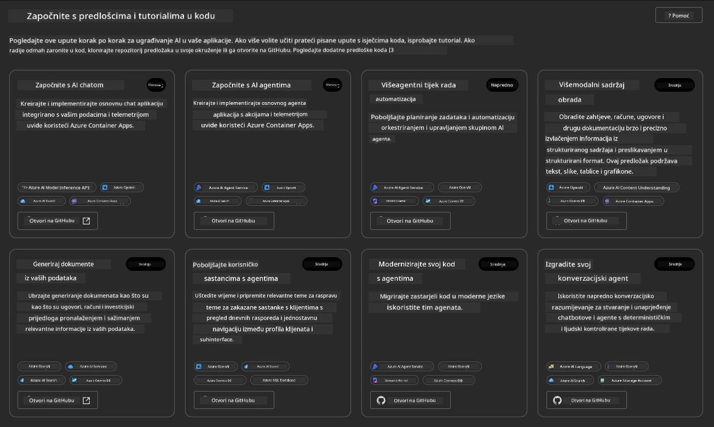

**Osnovne** opcije su vaši početni predlošci:

1. [ ] [Get Started with AI Chat](https://github.com/Azure-Samples/get-started-with-ai-chat) koji implementira osnovnu aplikaciju za chat _s vašim podacima_ na Azure Container Apps. Koristite ovo za istraživanje osnovnog scenarija AI chatbota.
1. [X] [Get Started with AI Agents](https://github.com/Azure-Samples/get-started-with-ai-agents) koji također implementira standardnog AI agenta (s Azure AI Agent Service). Koristite ovo za upoznavanje s agentnim AI rješenjima koja uključuju alate i modele.

Posjetite drugi link u novoj kartici preglednika (ili kliknite `Open in GitHub` za povezanu karticu). Trebali biste vidjeti repozitorij za ovaj AZD predložak. Odvojite minutu za istraživanje README datoteke. Arhitektura aplikacije izgleda ovako:

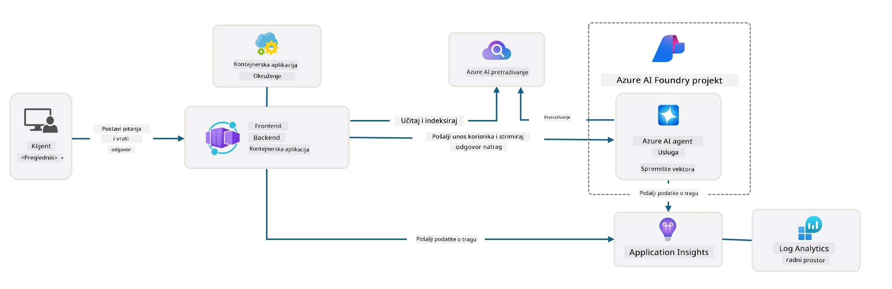

---

## 3. Aktivacija predloška

Pokušajmo implementirati ovaj predložak i provjeriti je li valjan. Slijedit ćemo smjernice iz odjeljka [Getting Started](https://github.com/Azure-Samples/get-started-with-ai-agents?tab=readme-ov-file#getting-started).

1. Kliknite [ovaj link](https://github.com/codespaces/new/Azure-Samples/get-started-with-ai-agents) - potvrdite zadanu akciju `Create codespace`
1. Ovo otvara novu karticu preglednika - pričekajte da se sesija GitHub Codespaces učita
1. Otvorite terminal u VS Code-u unutar Codespaces - upišite sljedeću naredbu:

   ```bash title="" linenums="0"
   azd up
   ```

Dovršite korake tijeka rada koji će se pokrenuti:

1. Bit ćete zatraženi da se prijavite na Azure - slijedite upute za autentifikaciju
1. Unesite jedinstveno ime okruženja za sebe - npr., koristio sam `nitya-mshack-azd`
1. Ovo će stvoriti `.azure/` mapu - vidjet ćete podmapu s imenom okruženja
1. Bit ćete zatraženi da odaberete ime pretplate - odaberite zadanu
1. Bit ćete zatraženi za lokaciju - koristite `East US 2`

Sada čekate da se postavljanje dovrši. **Ovo traje 10-15 minuta**

1. Kada je gotovo, vaš konzola će prikazati poruku USPJEHA poput ove:
      ```bash title="" linenums="0"
      SUCCESS: Your up workflow to provision and deploy to Azure completed in 10 minutes 17 seconds.
      ```
1. Vaš Azure Portal sada će imati grupu resursa s imenom vašeg okruženja:

      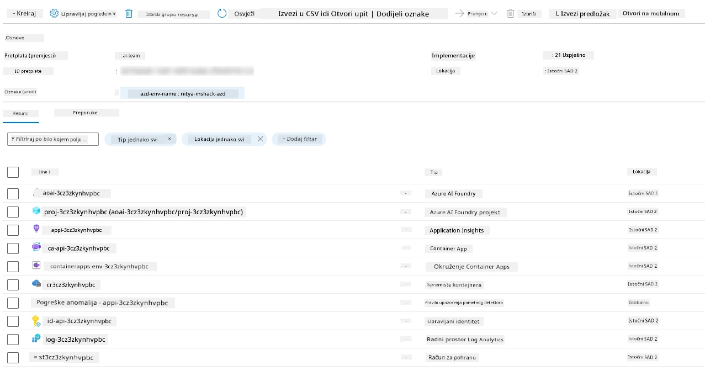

1. **Sada ste spremni validirati implementiranu infrastrukturu i aplikaciju**.

---

## 4. Validacija predloška

1. Posjetite stranicu [Resource Groups](https://portal.azure.com/#browse/resourcegroups) na Azure Portalu - prijavite se kada se to zatraži
1. Kliknite na RG za ime vašeg okruženja - vidjet ćete stranicu iznad

      - kliknite na resurs Azure Container Apps
      - kliknite na URL aplikacije u odjeljku _Essentials_ (gore desno)

1. Trebali biste vidjeti hostirani UI aplikacije poput ovoga:

   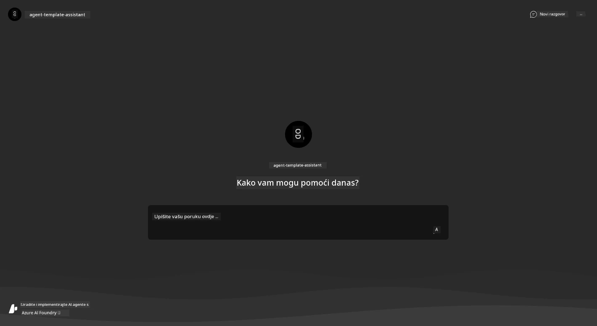

1. Pokušajte postaviti nekoliko [uzoraka pitanja](https://github.com/Azure-Samples/get-started-with-ai-agents/blob/main/docs/sample_questions.md)

      1. Pitajte: ```What is the capital of France?``` 
      1. Pitajte: ```What's the best tent under $200 for two people, and what features does it include?```

1. Trebali biste dobiti odgovore slične onima prikazanim dolje. _Ali kako ovo funkcionira?_ 

      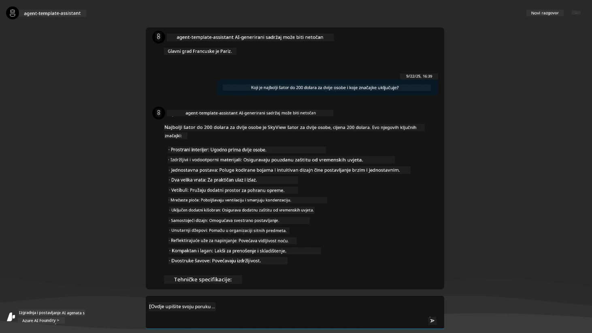

---

## 5. Validacija agenta

Azure Container App implementira krajnju točku koja se povezuje s AI agentom postavljenim u projektu Azure AI Foundry za ovaj predložak. Pogledajmo što to znači.

1. Vratite se na stranicu _Overview_ za vašu grupu resursa na Azure Portalu

1. Kliknite na resurs `Azure AI Foundry` u tom popisu

1. Trebali biste vidjeti ovo. Kliknite gumb `Go to Azure AI Foundry Portal`. 
   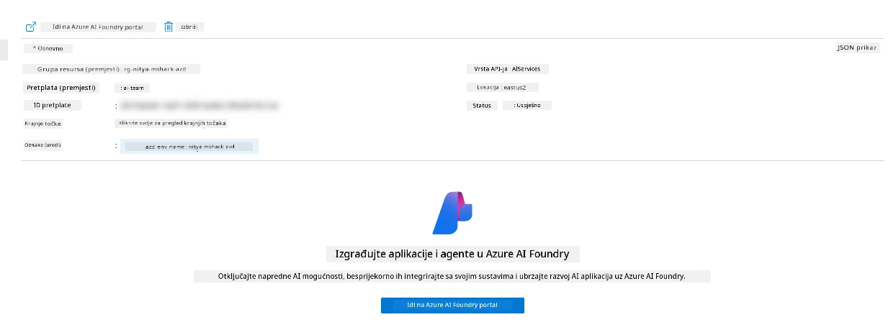

1. Trebali biste vidjeti stranicu projekta Foundry za vašu AI aplikaciju
   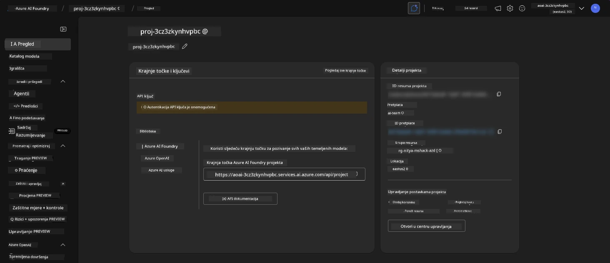

1. Kliknite na `Agents` - vidjet ćete zadani agent postavljen u vašem projektu
   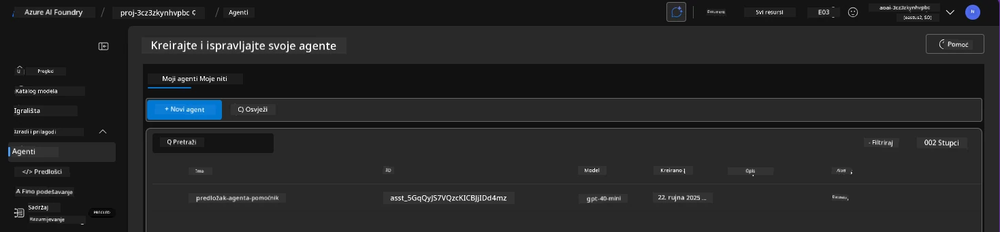

1. Odaberite ga - i vidjet ćete detalje agenta. Obratite pažnju na sljedeće:

      - Agent koristi File Search prema zadanim postavkama (uvijek)
      - Znanje agenta pokazuje da ima 32 datoteke učitane (za File Search)
      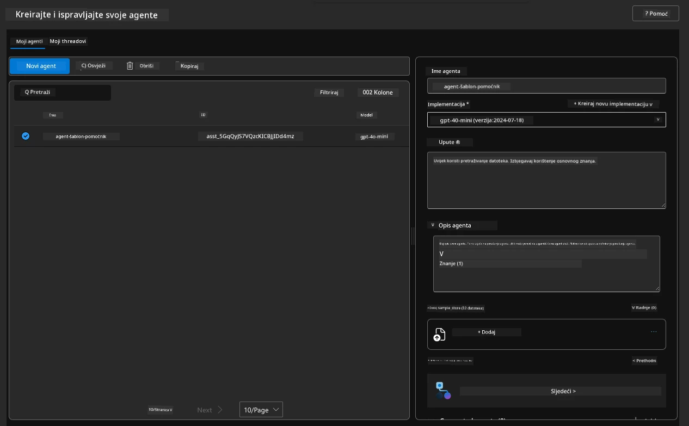

1. Potražite opciju `Data+indexes` u lijevom izborniku i kliknite za detalje. 

      - Trebali biste vidjeti 32 podatkovne datoteke učitane za znanje.
      - One će odgovarati 12 datoteka kupaca i 20 datoteka proizvoda pod `src/files` 
      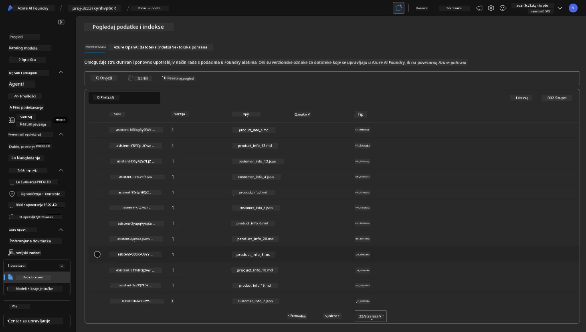

**Validirali ste rad agenta!** 

1. Odgovori agenta temelje se na znanju iz tih datoteka. 
1. Sada možete postavljati pitanja vezana uz te podatke i dobiti odgovore temeljene na njima.
1. Primjer: `customer_info_10.json` opisuje 3 kupnje koje je napravila "Amanda Perez"

Vratite se na karticu preglednika s krajnjom točkom Container App-a i pitajte: `What products does Amanda Perez own?`. Trebali biste vidjeti nešto poput ovoga:

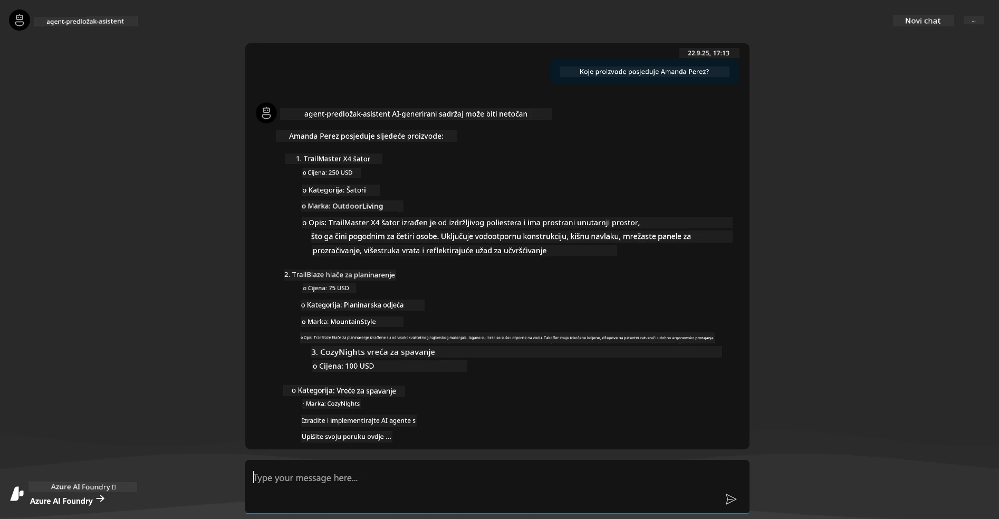

---

## 6. Igralište za agente

Razvijmo malo intuicije o mogućnostima Azure AI Foundry, tako što ćemo isprobati agenta u Igralištu za agente. 

1. Vratite se na stranicu `Agents` u Azure AI Foundry - odaberite zadani agent
1. Kliknite opciju `Try in Playground` - trebali biste dobiti UI Igrališta poput ovoga
1. Postavite isto pitanje: `What products does Amanda Perez own?`

    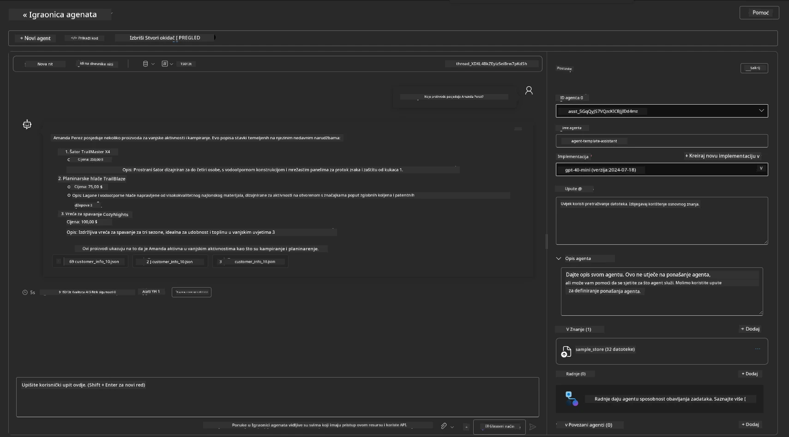

Dobivate isti (ili sličan) odgovor - ali također dobivate dodatne informacije koje možete koristiti za razumijevanje kvalitete, troškova i performansi vaše aplikacije s agentima. Na primjer:

1. Primijetite da odgovor navodi podatkovne datoteke korištene za "temeljenje" odgovora
1. Zadržite pokazivač iznad bilo koje oznake datoteke - odgovaraju li podaci vašem upitu i prikazanom odgovoru?

Također vidite _red statistike_ ispod odgovora. 

1. Zadržite pokazivač iznad bilo koje metrike - npr., Sigurnost. Vidjet ćete nešto poput ovoga
1. Odgovara li procijenjena ocjena vašoj intuiciji o razini sigurnosti odgovora?

      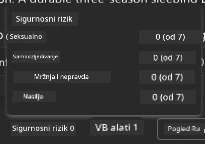

---x

## 7. Ugrađena promatranja

Promatranje se odnosi na instrumentiranje vaše aplikacije kako bi generirala podatke koji se mogu koristiti za razumijevanje, otklanjanje problema i optimizaciju njezinog rada. Da biste stekli osjećaj za ovo:

1. Kliknite gumb `View Run Info` - trebali biste vidjeti ovaj prikaz. Ovo je primjer [praćenja agenta](https://learn.microsoft.com/en-us/azure/ai-foundry/how-to/develop/trace-agents-sdk#view-trace-results-in-the-azure-ai-foundry-agents-playground) u akciji. _Ovaj prikaz možete dobiti i klikom na Thread Logs u glavnom izborniku_.

   - Steknite osjećaj za korake izvođenja i alate koje agent koristi
   - Razumijte ukupni broj tokena (naspram korištenja izlaznih tokena) za odgovor
   - Razumijte kašnjenje i gdje se troši vrijeme u izvođenju

      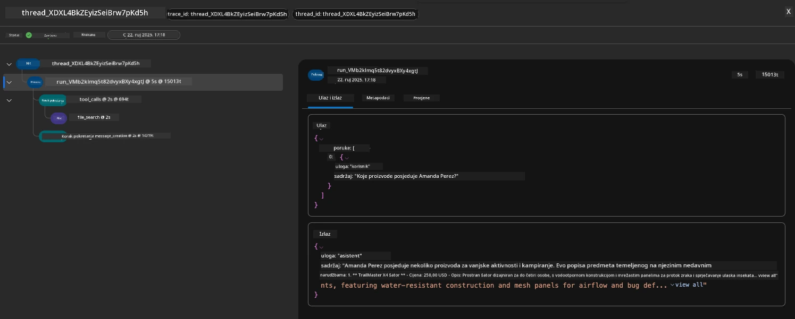

1. Kliknite karticu `Metadata` za dodatne atribute izvođenja koji mogu pružiti korisni kontekst za otklanjanje problema kasnije.   

      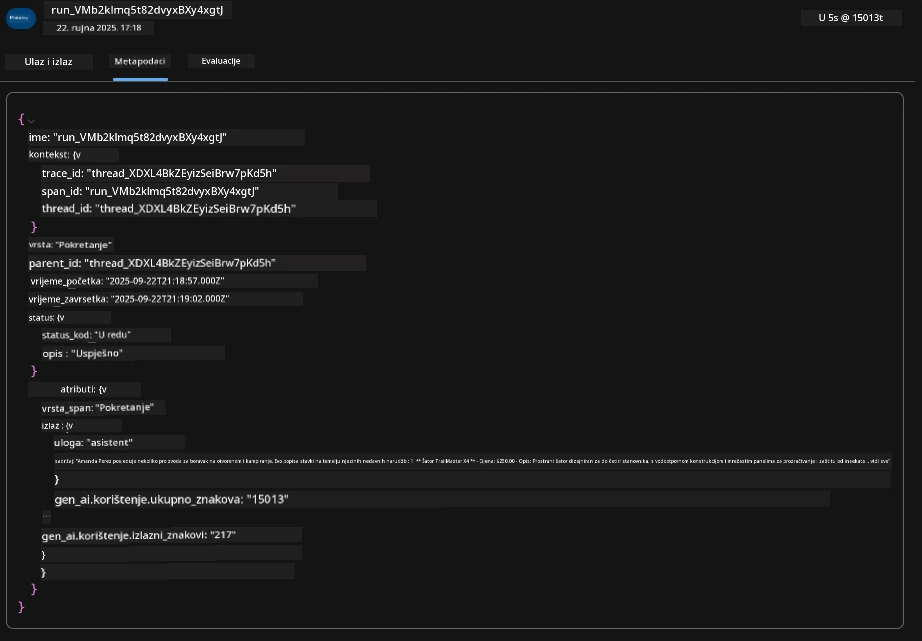

1. Kliknite karticu `Evaluations` za automatske procjene odgovora agenta. To uključuje procjene sigurnosti (npr., Samoozljeđivanje) i specifične procjene agenta (npr., Razlučivanje namjere, Pridržavanje zadatka).

      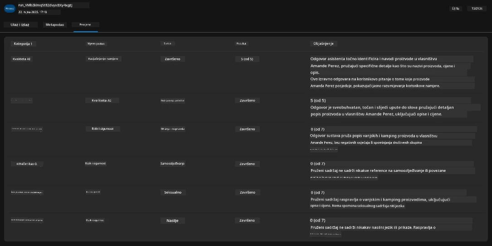

1. Na kraju, kliknite karticu `Monitoring` u izborniku sa strane.

      - Odaberite karticu `Resource usage` na prikazanoj stranici - i pogledajte metrike.
      - Pratite korištenje aplikacije u smislu troškova (tokeni) i opterećenja (zahtjevi).
      - Pratite kašnjenje aplikacije do prvog bajta (obrada ulaza) i zadnjeg bajta (izlaz).

      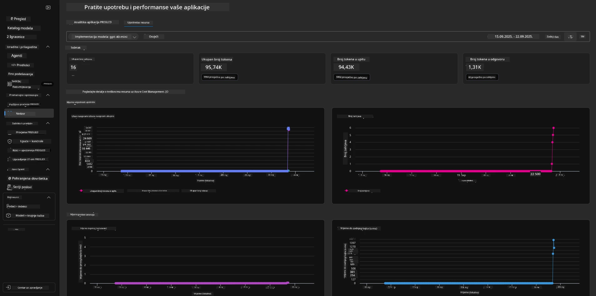

---

## 8. Varijable okruženja

Do sada smo prošli kroz implementaciju u pregledniku - i validirali da je naša infrastruktura postavljena i aplikacija operativna. No, za rad s aplikacijom _kroz kod_, trebamo konfigurirati naše lokalno razvojno okruženje s relevantnim varijablama potrebnim za rad s tim resursima. Korištenje `azd` to čini jednostavnim.

1. Azure Developer CLI [koristi varijable okruženja](https://learn.microsoft.com/en-us/azure/developer/azure-developer-cli/manage-environment-variables?tabs=bash) za pohranu i upravljanje postavkama konfiguracije za implementaciju aplikacija.

1. Varijable okruženja pohranjene su u `.azure/<env-name>/.env` - ovo ih ograničava na okruženje `env-name` korišteno tijekom implementacije i pomaže vam izolirati okruženja između različitih ciljeva implementacije u istom repozitoriju.

1. Varijable okruženja automatski učitava naredba `azd` kad god izvršava određenu naredbu (npr., `azd up`). Napominjemo da `azd` ne čita automatski _varijable okruženja na razini OS-a_ (npr., postavljene u ljusci) - umjesto toga koristite `azd set env` i `azd get env` za prijenos informacija unutar skripti.

Isprobajmo nekoliko naredbi:

1. Dohvatite sve varijable okruženja postavljene za `azd` u ovom okruženju:

      ```bash title="" linenums="0"
      azd env get-values
      ```
      
      Vidjet ćete nešto poput:

      ```bash title="" linenums="0"
      AZURE_AI_AGENT_DEPLOYMENT_NAME="gpt-4o-mini"
      AZURE_AI_AGENT_NAME="agent-template-assistant"
      AZURE_AI_EMBED_DEPLOYMENT_NAME="text-embedding-3-small"
      AZURE_AI_EMBED_DIMENSIONS=100
      ...
      ```

1. Dohvatite određenu vrijednost - npr., želim znati je li postavljena vrijednost `AZURE_AI_AGENT_MODEL_NAME`

      ```bash title="" linenums="0"
      azd env get-value AZURE_AI_AGENT_MODEL_NAME 
      ```
      
      Vidjet ćete nešto poput ovoga - nije postavljena prema zadanim postavkama!

      ```bash title="" linenums="0"
      ERROR: key 'AZURE_AI_AGENT_MODEL_NAME' not found in the environment values
      ```

1. Postavite novu varijablu okruženja za `azd`. Ovdje ažuriramo ime modela agenta. _Napomena: sve promjene odmah će se odraziti u datoteci `.azure/<env-name>/.env`.

      ```bash title="" linenums="0"
      azd env set AZURE_AI_AGENT_MODEL_NAME gpt-4.1
      azd env set AZURE_AI_AGENT_MODEL_VERSION 2025-04-14
      azd env set AZURE_AI_AGENT_DEPLOYMENT_CAPACITY 150
      ```

      Sada bismo trebali pronaći da je vrijednost postavljena:

      ```bash title="" linenums="0"
      azd env get-value AZURE_AI_AGENT_MODEL_NAME 
      ```

1. Napominjemo da su neki resursi trajni (npr., implementacije modela) i zahtijevat će više od samo `azd up` za prisilno ponovno postavljanje. Pokušajmo ukloniti originalnu implementaciju i ponovno implementirati s promijenjenim varijablama okruženja.

1. **Osvježi** Ako ste prethodno implementirali infrastrukturu koristeći azd predložak - možete _osvježiti_ stanje vaših lokalnih varijabli okruženja na temelju trenutnog stanja vaše Azure implementacije koristeći ovu naredbu:
      ```bash title="" linenums="0"
      azd env refresh
      ```

      Ovo je moćan način za _sinkronizaciju_ varijabli okruženja između dva ili više lokalnih razvojnih okruženja (npr. tim s više programera) - omogućujući da implementirana infrastruktura služi kao izvor istine za stanje varijabli okruženja. Članovi tima jednostavno _osvježe_ varijable kako bi se ponovno sinkronizirali.

---

## 9. Čestitamo 🏆

Upravo ste završili cjelokupan radni proces u kojem ste:

- [X] Odabrali AZD predložak koji želite koristiti
- [X] Pokrenuli predložak pomoću GitHub Codespaces
- [X] Implementirali predložak i potvrdili da radi

---

