# 2. Validacija predloška

!!! tip "NA KRAJU OVOG MODULA BIT ĆETE U MOGUĆNOSTI"

    - [ ] Analizirati AI arhitekturu rješenja
    - [ ] Razumjeti AZD tijek raspoređivanja
    - [ ] Koristiti GitHub Copilot za pomoć pri korištenju AZD-a
    - [ ] **Laboratorij 2:** Rasporediti i validirati predložak AI agenata

---


## 1. Uvod

[Azure Developer CLI](https://learn.microsoft.com/en-us/azure/developer/azure-developer-cli/) ili `azd` je alat otvorenog koda za naredbeni redak koji pojednostavljuje radni tijek programera prilikom izgradnje i raspoređivanja aplikacija na Azure.

[AZD predlošci](https://learn.microsoft.com/azure/developer/azure-developer-cli/azd-templates) su standardizirani repozitoriji koji uključuju primjer koda aplikacije, imovinu _infrastrukture kao koda_ i `azd` konfiguracijske datoteke za kohezivnu arhitekturu rješenja. Postavljanje infrastrukture postaje jednostavno kao naredba `azd provision` - dok korištenje `azd up` omogućuje istovremeno postavljanje infrastrukture **i** raspoređivanje vaše aplikacije!

Kao rezultat toga, pokretanje procesa razvoja aplikacije može biti jednostavno kao pronalaženje pravog _AZD Starter predloška_ koji najbliže odgovara vašim potrebama aplikacije i infrastrukture - a zatim prilagodba repozitorija prema zahtjevima vašeg scenarija.

Prije nego što počnemo, provjerimo imate li instaliran Azure Developer CLI.

1. Otvorite terminal u VS Code-u i unesite ovu naredbu:

      ```bash title="" linenums="0"
      azd version
      ```

1. Trebali biste vidjeti nešto slično ovome!

      ```bash title="" linenums="0"
      azd version 1.19.0 (commit b3d68cea969b2bfbaa7b7fa289424428edb93e97)
      ```

**Sada ste spremni odabrati i rasporediti predložak s azd**

---

## 2. Odabir predloška

Microsoft Foundry platforma dolazi s [skupom preporučenih AZD predložaka](https://learn.microsoft.com/en-us/azure/ai-foundry/how-to/develop/ai-template-get-started) koji pokrivaju popularne scenarije rješenja kao što su _automatizacija rada s više agenata_ i _obrada višemodnog sadržaja_. Ove predloške možete također pronaći posjetom Microsoft Foundry portalu.

1. Posjetite [https://ai.azure.com/templates](https://ai.azure.com/templates)
1. Prijavite se u Microsoft Foundry portal kad se to zatraži - vidjet ćete nešto poput ovoga.

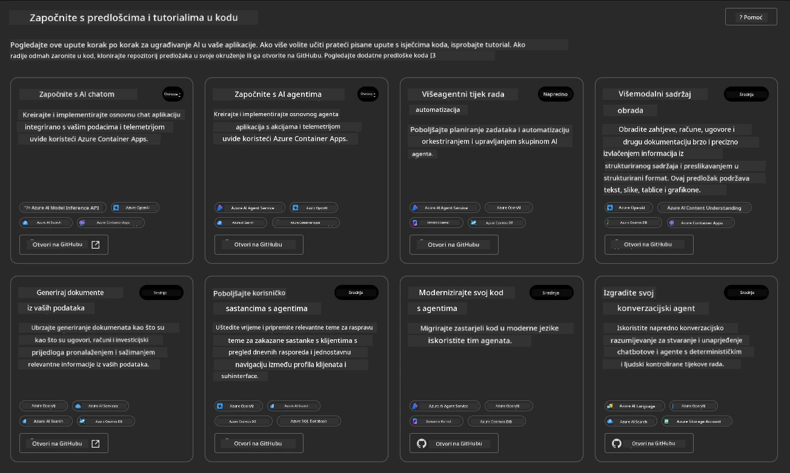


**Basic** opcije su vaši početni predlošci:

1. [ ] [Započnite s AI Chat](https://github.com/Azure-Samples/get-started-with-ai-chat) koji raspoređuje osnovnu aplikaciju za chat _s vašim podacima_ na Azure Container Apps. Koristite ovo da istražite osnovni scenarij AI chatbota.
1. [X] [Započnite s AI Agentima](https://github.com/Azure-Samples/get-started-with-ai-agents) koji također raspoređuje standardnog AI agenta (s Foundry agentima). Koristite ovo da se upoznate s agentnim AI rješenjima koja uključuju alate i modele.

Posjetite drugi link u novom pregledniku (ili kliknite `Open in GitHub` za povezanu karticu). Trebali biste vidjeti repozitorij za ovaj AZD predložak. Uzmite trenutak da proučite README. Arhitektura aplikacije izgleda ovako:

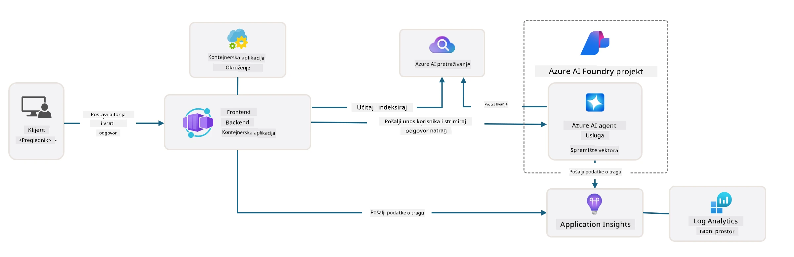

---

## 3. Aktivacija predloška

Pokušajmo rasporediti ovaj predložak i provjeriti je li valjan. Slijedit ćemo smjernice u odjeljku [Getting Started](https://github.com/Azure-Samples/get-started-with-ai-agents?tab=readme-ov-file#getting-started).

1. Kliknite [ovu poveznicu](https://github.com/codespaces/new/Azure-Samples/get-started-with-ai-agents) - potvrdite zadanu radnju `Create codespace`
1. Otvara se novi tab preglednika - pričekajte da se sesija GitHub Codespaces učita
1. Otvorite VS Code terminal u Codespaces - upišite sljedeću naredbu:

   ```bash title="" linenums="0"
   azd up
   ```

Dovršite korake tijeka rada koje će to pokrenuti:

1. Bit ćete upitani da se prijavite u Azure - slijedite upute za autentifikaciju
1. Unesite jedinstveno ime okoline za sebe - npr., ja sam koristio `nitya-mshack-azd`
1. Time će se stvoriti `.azure/` mapa - vidjet ćete podmapu s imenom okoline
1. Bit ćete upitani da odaberete naziv pretplate - odaberite zadanu
1. Bit ćete upitani za lokaciju - koristite `East US 2`

Sada pričekajte da se postavljanje završi. **Ovo traje 10-15 minuta**

1. Kada završi, vaš konzola će prikazati PORUKU O USPJEHU poput ove:
      ```bash title="" linenums="0"
      SUCCESS: Your up workflow to provision and deploy to Azure completed in 10 minutes 17 seconds.
      ```
1. Vaš Azure Portal sada će imati stvorenu grupu resursa s tim imenom okoline:

      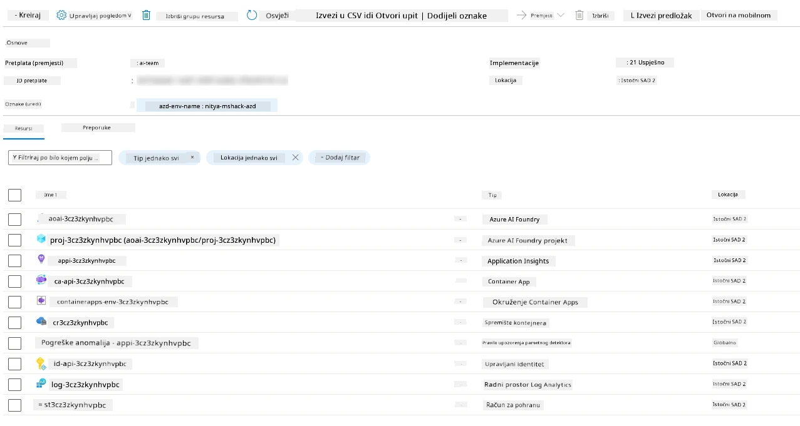

1. **Sada ste spremni validirati raspoređenu infrastrukturu i aplikaciju**.

---

## 4. Validacija predloška

1. Posjetite stranicu Azure Portala [Resource Groups](https://portal.azure.com/#browse/resourcegroups) - prijavite se ako se zatraži
1. Kliknite na RG za svoje ime okoline - vidjet ćete prethodnu stranicu

      - kliknite na Azure Container Apps resurs
      - kliknite na Application Url u odjeljku _Essentials_ (gore desno)

1. Trebali biste vidjeti korisničko sučelje hostirane aplikacije poput ovog:

   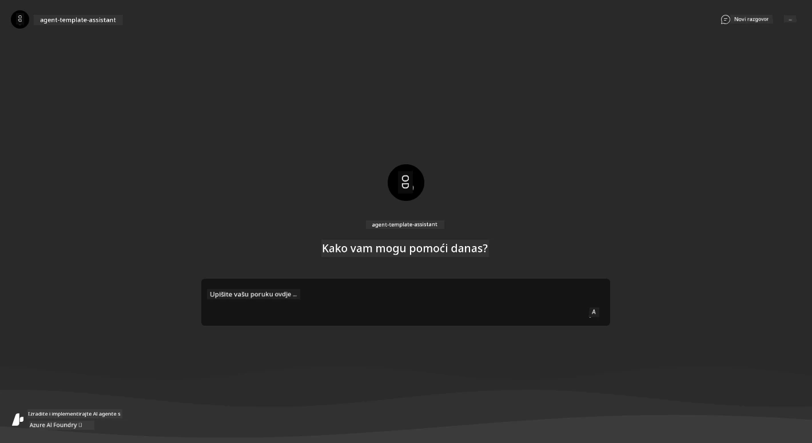

1. Pokušajte postaviti nekoliko [primjera pitanja](https://github.com/Azure-Samples/get-started-with-ai-agents/blob/main/docs/sample_questions.md)

      1. Pitajte: ```Koji je glavni grad Francuske?``` 
      1. Pitajte: ```Koji je najbolji šator ispod 200$ za dvoje ljudi i koje značajke uključuje?```

1. Trebali biste dobiti odgovore slične prikazanim niže. _Ali kako to funkcionira?_ 

      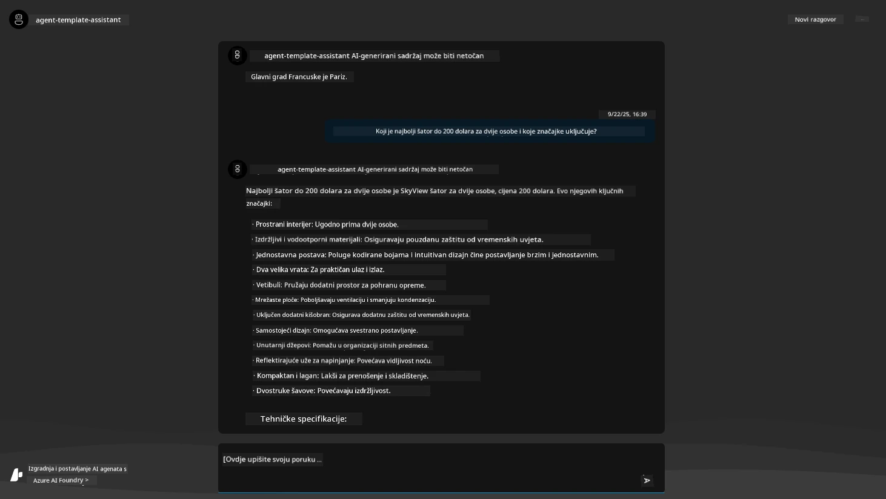

---

## 5. Validacija agenta

Azure Container App raspoređuje krajnju točku koja se povezuje s AI agentom postavljenim u Microsoft Foundry projektu za ovaj predložak. Pogledajmo što to znači.

1. Vratite se na Azure Portal na _Overview_ stranicu vaše grupe resursa

1. Kliknite na `Microsoft Foundry` resurs u toj listi

1. Trebali biste vidjeti ovo. Kliknite na gumb `Go to Microsoft Foundry Portal`. 
   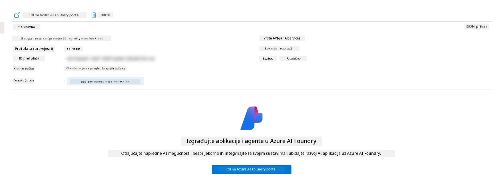

1. Trebali biste vidjeti stranicu Foundry projekta za vašu AI aplikaciju
   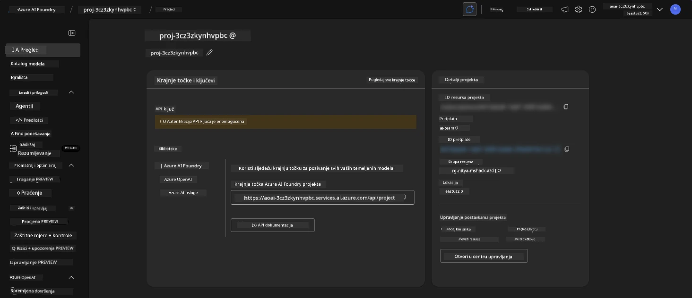

1. Kliknite na `Agents` - vidjet ćete zadani Agent postavljen u vašem projektu
   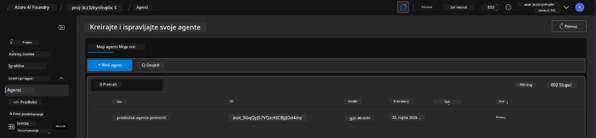

1. Odaberite ga - vidjet ćete detalje agenta. Obratite pažnju na sljedeće:

      - Agent koristi File Search prema zadanim postavkama (uvijek)
      - Agentova `Knowledge` pokazuje da ima 32 datoteke učitane (za pretraživanje datoteka)
      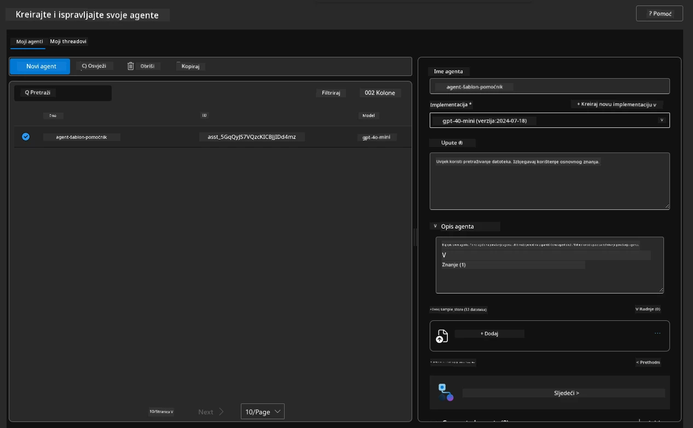

1. Potražite opciju `Data+indexes` u lijevom izborniku i kliknite za detalje. 

      - Trebali biste vidjeti 32 podatkovne datoteke učitane za znanje.
      - One će odgovarati 12 datoteka kupaca i 20 datoteka proizvoda u `src/files` 
      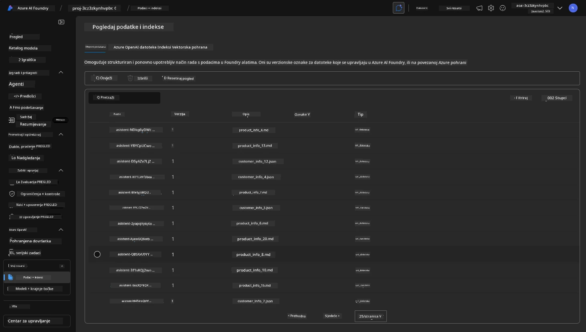

**Validirali ste rad agenta!**

1. Odgovori agenta utemeljeni su na znanju sadržanom u tim datotekama. 
1. Sada možete postavljati pitanja vezana uz te podatke i dobivati utemeljene odgovore.
1. Primjer: `customer_info_10.json` opisuje 3 kupnje koje je napravila "Amanda Perez"

Vratite se na karticu preglednika s krajnjom točkom Container App i pitajte: `Koje proizvode posjeduje Amanda Perez?`. Trebali biste vidjeti nešto poput ovoga:

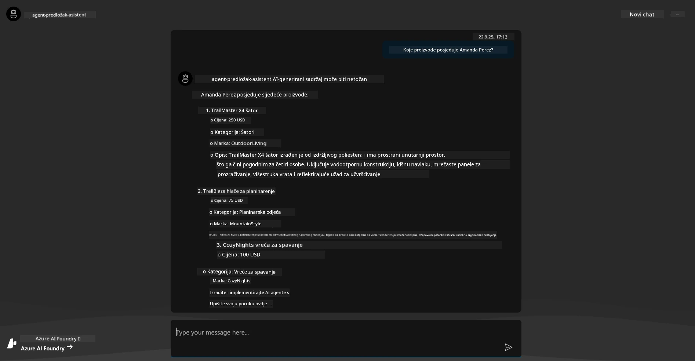

---

## 6. Igraonica za agente

Izgradimo malo bolje razumijevanje mogućnosti Microsoft Foundryja tako da isprobamo agenta u Agents Playgroundu.

1. Vratite se na stranicu `Agents` u Microsoft Foundryju - odaberite zadani agent
1. Kliknite opciju `Try in Playground` - trebali biste dobiti sučelje igraonice poput ovoga
1. Postavite isto pitanje: `Koje proizvode posjeduje Amanda Perez?`

    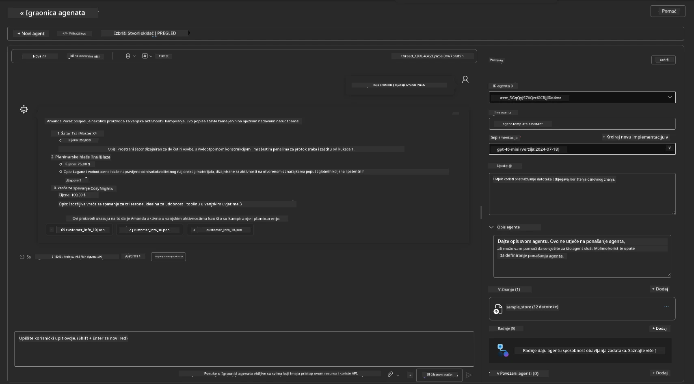

Dobit ćete isti (ili sličan) odgovor - ali također i dodatne informacije koje možete koristiti za razumijevanje kvalitete, troškova i performansi vaše agentne aplikacije. Na primjer:

1. Primijetite da je odgovor citirao podatkovne datoteke korištene za "utemeljenje" odgovora
1. Pređite mišem preko bilo koje od tih oznaka datoteka - podaci odgovaraju vašem upitu i prikazanom odgovoru?

Također vidite redak sa _statistikama_ ispod odgovora.

1. Pređite mišem preko bilo koje metrike - npr. Sigurnost. Vidjet ćete nešto poput ovog
1. Odgovara li procijenjena ocjena vašem osjećaju za razinu sigurnosti odgovora?

      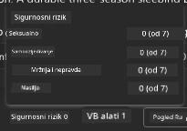

---

## 7. Ugrađena promatranost

Promatranost znači instrumentirati vašu aplikaciju za generiranje podataka koji se mogu koristiti za razumijevanje, otklanjanje pogrešaka i optimizaciju njezina rada. Da biste dobili dojam o tome:

1. Kliknite gumb `View Run Info` - trebali biste vidjeti ovaj prikaz. Ovo je primjer [praćenja agenta](https://learn.microsoft.com/en-us/azure/ai-foundry/how-to/develop/trace-agents-sdk#view-trace-results-in-the-azure-ai-foundry-agents-playground) u praksi. _Ovaj prikaz možete dobiti i klikom na Thread Logs u glavnom izborniku_.

   - Dobijte dojam o koracima izvođenja i alatima koje je agent upotrijebio
   - Razumite ukupni broj tokena (u usporedbi s brojem tokena izlaza) za odgovor
   - Razumite latenciju i gdje se vrijeme troši tijekom izvođenja

      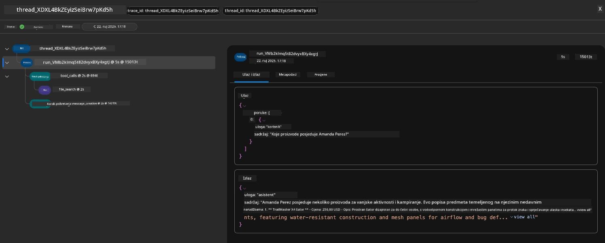

1. Kliknite karticu `Metadata` da vidite dodatne atribute izvođenja koji mogu biti korisni za kasnije otklanjanje pogrešaka.

      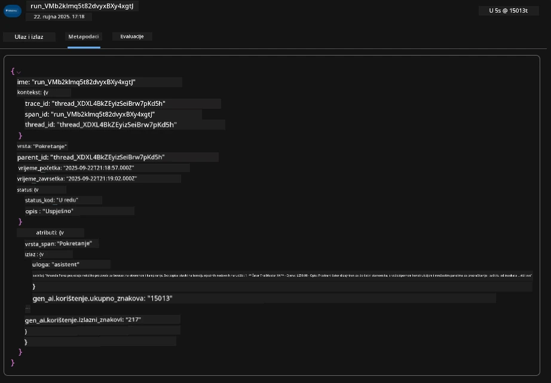


1. Kliknite karticu `Evaluations` da vidite automatske procjene napravljene na odgovoru agenta. One uključuju sigurnosne procjene (npr. samoozljeđivanje) i procjene specifične za agenta (npr. razrješenje namjere, pridržavanje zadatka).

      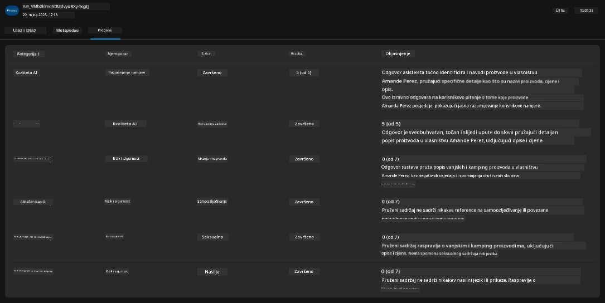

1. Na kraju, kliknite karticu `Monitoring` u bočnom izborniku.

      - Odaberite karticu `Resource usage` na prikazanoj stranici - i pregledajte metrike.
      - Pratite korištenje aplikacije u smislu troškova (tokena) i opterećenja (zahtjeva).
      - Pratite latenciju aplikacije do prvog bajta (obrada unosa) i zadnjeg bajta (izlaz).

      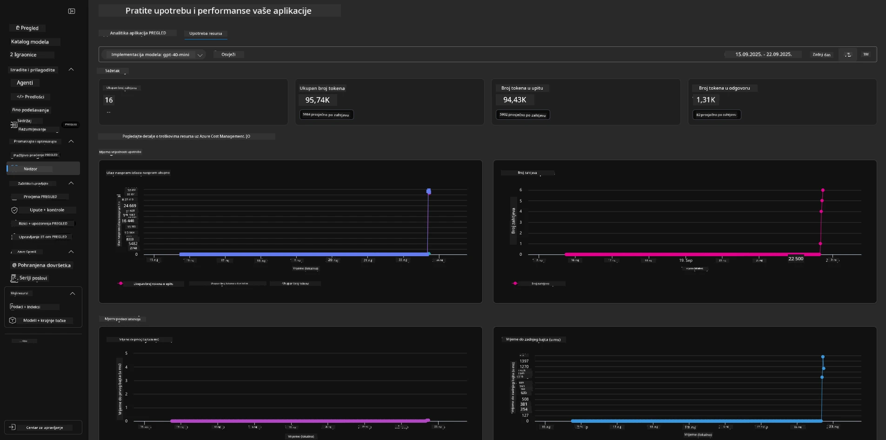

---

## 8. Varijable okoline

Do sada smo prošli kroz raspoređivanje u pregledniku - i validirali da je naša infrastruktura postavljena i aplikacija operativna. No, kako bismo radili s aplikacijom _prije svega kroz kod_, moramo konfigurirati naše lokalno razvojno okruženje s relevantnim varijablama potrebnim za rad s tim resursima. Korištenje `azd` to olakšava.

1. Azure Developer CLI [koristi varijable okoline](https://learn.microsoft.com/en-us/azure/developer/azure-developer-cli/manage-environment-variables?tabs=bash) za pohranu i upravljanje konfiguracijskim postavkama za raspoređivanje aplikacija.

1. Varijable okoline pohranjuju se u `.azure/<env-name>/.env` - to ih povezuje s `env-name` okolinom korištenom tijekom raspoređivanja i pomaže izolirati okoline između različitih ciljeva raspoređivanja u istom repozitoriju.

1. Varijable okoline se automatski učitavaju pomoću naredbe `azd` kad god izvrši specifičnu naredbu (npr. `azd up`). Napominjemo da `azd` ne čita automatski varijable okoline na razini OS-a (npr. postavljene u shellu) - umjesto toga koristite `azd set env` i `azd get env` za prijenos informacija unutar skripti.


Isprobajmo nekoliko naredbi:

1. Dobavite sve varijable okoline postavljene za `azd` u ovoj okolini:

      ```bash title="" linenums="0"
      azd env get-values
      ```
      
      Vidjet ćete nešto poput:

      ```bash title="" linenums="0"
      AZURE_AI_AGENT_DEPLOYMENT_NAME="gpt-4o-mini"
      AZURE_AI_AGENT_NAME="agent-template-assistant"
      AZURE_AI_EMBED_DEPLOYMENT_NAME="text-embedding-3-small"
      AZURE_AI_EMBED_DIMENSIONS=100
      ...
      ```

1. Dobavite specifičnu vrijednost - npr., želim znati je li postavljena vrijednost za `AZURE_AI_AGENT_MODEL_NAME`

      ```bash title="" linenums="0"
      azd env get-value AZURE_AI_AGENT_MODEL_NAME 
      ```
      
      Vidjet ćete nešto poput ovoga - nije bila postavljena prema zadanim postavkama!

      ```bash title="" linenums="0"
      ERROR: key 'AZURE_AI_AGENT_MODEL_NAME' not found in the environment values
      ```

1. Postavite novu varijablu okoline za `azd`. Ovdje ažuriramo naziv modela agenta. _Napomena: sve promjene bit će odmah vidljive u `.azure/<env-name>/.env` datoteci._

      ```bash title="" linenums="0"
      azd env set AZURE_AI_AGENT_MODEL_NAME gpt-4.1
      azd env set AZURE_AI_AGENT_MODEL_VERSION 2025-04-14
      azd env set AZURE_AI_AGENT_DEPLOYMENT_CAPACITY 150
      ```

      Sada bismo trebali naći da je vrijednost postavljena:

      ```bash title="" linenums="0"
      azd env get-value AZURE_AI_AGENT_MODEL_NAME 
      ```

1. Imajte na umu da su neki resursi trajni (npr. raspoređivanja modela) i zahtijevat će nešto više od `azd up` za prisilno ponovno raspoređivanje. Pokušajmo ukloniti izvorno raspoređivanje i ponovo rasporediti s izmijenjenim varijablama okoline.

1. **Osvježi** Ako ste prethodno rasporedili infrastrukturu pomoću azd predloška - možete _osvježiti_ stanje vaših lokalnih varijabli okoline na temelju trenutnog stanja vaše Azure implementacije koristeći ovu naredbu:

      ```bash title="" linenums="0"
      azd env refresh
      ```

      Ovo je moćan način za _sinkronizaciju_ varijabli okruženja između dva ili više lokalnih razvojnih okruženja (npr. tim s više programera) - dopuštajući da implementirana infrastruktura služi kao konačna istina za stanje varijabli okruženja. Članovi tima jednostavno _osvježavaju_ varijable da bi se ponovno sinkronizirali.

---

## 9. Čestitamo 🏆

Upravo ste završili cjelokupan tijek rada u kojem ste:

- [X] Odabrali AZD predložak koji želite koristiti
- [X] Pokrenuli predložak s GitHub Codespaces
- [X] Implementirali predložak i provjerili da radi

---

<!-- CO-OP TRANSLATOR DISCLAIMER START -->
**Odricanje od odgovornosti**:
Ovaj dokument preveden je korištenjem AI usluge prevođenja [Co-op Translator](https://github.com/Azure/co-op-translator). Iako težimo točnosti, imajte na umu da automatski prijevodi mogu sadržavati pogreške ili netočnosti. Izvorni dokument na izvornom jeziku treba smatrati službenim i autoritativnim izvorom. Za kritične informacije preporučujemo profesionalni ljudski prijevod. Nismo odgovorni za bilo kakve nesporazume ili kriva tumačenja proizašla iz korištenja ovog prijevoda.
<!-- CO-OP TRANSLATOR DISCLAIMER END -->