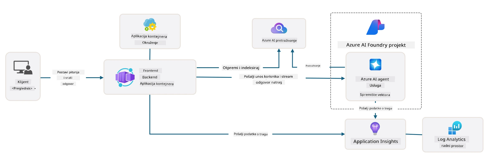

# 3. Rastavi predložak

!!! tip "NA KRAJU OVOG MODULA MOĆI ĆETE"

    - [ ] Aktivirati GitHub Copilot s MCP poslužiteljima za pomoć u Azureu
    - [ ] Razumjeti strukturu mapa i komponente AZD predloška
    - [ ] Istražiti obrasce organizacije infrastrukture kao koda (Bicep)
    - [ ] **Lab 3:** Koristiti GitHub Copilot za istraživanje i razumijevanje arhitekture spremišta

---

S AZD predlošcima i Azure Developer CLI (`azd`) možemo brzo započeti naše AI razvojno putovanje sa standardiziranim spremištima koja pružaju primjer koda, infrastrukture i konfiguracijskih datoteka - u obliku spremnog za implementaciju _starter_ projekta.

**No sada, trebamo razumjeti strukturu projekta i kodnu bazu - te biti sposobni prilagoditi AZD predložak - bez ikakvog prethodnog iskustva ili razumijevanja AZD-a!**

---

## 1. Aktiviraj GitHub Copilot

### 1.1 Instaliraj GitHub Copilot Chat

Vrijeme je za istraživanje [GitHub Copilot with Agent Mode](https://code.visualstudio.com/docs/copilot/chat/chat-agent-mode). Sada možemo koristiti prirodni jezik da opišemo naš zadatak na visokoj razini i dobiti pomoć u izvršenju. Za ovaj laboratorij koristit ćemo [Copilot Free plan](https://github.com/github-copilot/signup) koji ima mjesečni limit za dovršetke i chat interakcije.

Proširenje može biti instalirano iz marketplace-a, ali bi već trebalo biti dostupno u vašem Codespaces okruženju. _Kliknite `Open Chat` iz padajućeg izbornika Copilot ikone - i upišite upit poput `What can you do?`_ - možda ćete biti pozvani na prijavu. **GitHub Copilot Chat je spreman**.

### 1.2. Instaliraj MCP poslužitelje

Da bi Agent način bio učinkovit, treba mu pristup pravim alatima koji mu pomažu u dohvaćanju znanja ili poduzimanju akcija. Ovdje MCP poslužitelji mogu pomoći. Konfigurirat ćemo sljedeće poslužitelje:

1. [Azure MCP Server](../../../../../workshop/docs/instructions)
1. [Microsoft Docs MCP Server](../../../../../workshop/docs/instructions)

Za aktivaciju:

1. Kreirajte datoteku zvanu `.vscode/mcp.json` ako ne postoji
1. Kopirajte sljedeće u tu datoteku - i pokrenite poslužitelje!
   ```json title=".vscode/mcp.json"
   {
      "servers": {
         "Azure MCP Server": {
            "command": "npx",
            "args": [
            "-y",
            "@azure/mcp@latest",
            "server",
            "start"
            ]
         },
         "microsoft.docs.mcp": {
            "type": "http",
            "url": "https://learn.microsoft.com/api/mcp"
         }
      }
   }
   ```

??? warning "Moguće je da ćete dobiti grešku da `npx` nije instaliran (kliknite za proširenje s popravkom)"

      Za popravak, otvorite `.devcontainer/devcontainer.json` datoteku i dodajte ovaj red u odjeljak features. Zatim ponovno izgradite kontejner. Sad biste trebali imati instaliran `npx`.

      ```title="" linenums="0"
         "features": {
            "ghcr.io/devcontainers/features/node:1": {},
            ...
         },
      ```

---

### 1.3. Testiraj GitHub Copilot Chat

**Prvo koristite `az login` da se autentificirate u Azure iz VS Code naredbenog retka.**

Sada biste trebali moći upitavati status svoje Azure pretplate i postavljati pitanja o implementiranim resursima ili konfiguraciji. Isprobajte ove upite:

1. `List my Azure resource groups`
1. `#foundry list my current deployments`

Također možete postavljati pitanja o Azure dokumentaciji i dobiti odgovore temeljene na Microsoft Docs MCP poslužitelju. Isprobajte ove upite:

1. `#microsoft_docs_search What is Azure Developer CLI?`
1. `#microsoft_docs_search Show me a Python tutorial to chat with deployed model`

Ili možete tražiti isječke koda za dovršetak zadatka. Isprobajte ovaj upit.

1. `Give me a Python code example that uses AAD for an interactive chat client`

U `Ask` načinu, ovo će pružiti kod koji možete kopirati i isprobati. U `Agent` načinu, može otići korak dalje i kreirati relevantne resurse za vas - uključujući skripte za postavljanje i dokumentaciju - za pomoć u izvršenju tog zadatka.

**Sada ste opremljeni za početak istraživanja predloška spremišta**

---

## 2. Rastavi arhitekturu

??? prompt "PITANJE: Objasnite arhitekturu aplikacije u docs/images/architecture.png u jednom odlomku"

      Ova aplikacija je AI-pokretana chat aplikacija izgrađena na Azureu koja demonstrira modernu arhitekturu temeljenu na agentima. Rješenje se fokusira na Azure Container App koji hosta glavni kod aplikacije, koji obrađuje korisnički unos i generira inteligentne odgovore putem AI agenta.
      
      Arhitektura koristi Microsoft Foundry Project kao temelj za AI sposobnosti, povezujući se s Azure AI uslugama koje pružaju osnovne jezične modele (kao što je gpt-4.1-mini) i funkcionalnost agenta. Korisničke interakcije prolaze kroz frontend baziran na Reactu do FastAPI backenda koji komunicira s AI agent servisom za generiranje kontekstualnih odgovora.
      
      Sustav uključuje mogućnosti dohvaćanja znanja putem pretrage datoteka ili Azure AI Search usluge, što omogućuje agentu pristup i referenciranje informacija iz učitanih dokumenata. Za operativnu izvrsnost, arhitektura uključuje sveobuhvatno praćenje putem Application Insights i Log Analytics Workspace za praćenje, bilježenje i optimizaciju performansi.
      
      Azure Storage pruža blob spremište za podatke aplikacije i prijenose datoteka, dok Managed Identity osigurava siguran pristup između Azure resursa bez pohranjivanja vjerodajnica. Cijelo rješenje je dizajnirano za skalabilnost i održivost, s kontejneriziranom aplikacijom koja se automatski skalira ovisno o potražnji uz pružanje ugrađene sigurnosti, nadzora i CI/CD mogućnosti kroz Azure upravljani ekosustav usluga.



---

## 3. Struktura spremišta

!!! prompt "PITANJE: Objasnite strukturu mapa predloška. Počnite s vizualnim hijerarhijskim dijagramom."

??? info "ODGOVOR: Vizualni hijerarhijski dijagram"

      ```bash title="" 
      get-started-with-ai-agents/
      ├── 📋 Konfiguracija i postavljanje
      │   ├── azure.yaml                    # Konfiguracija Azure Developer CLI
      │   ├── docker-compose.yaml           # Kontejneri za lokalni razvoj
      │   ├── pyproject.toml                # Konfiguracija Python projekta
      │   ├── requirements-dev.txt          # Razvojne ovisnosti
      │   └── .devcontainer/                # Postavke VS Code razvojnih kontejnera
      │
      ├── 🏗️ Infrastruktura (infra/)
      │   ├── main.bicep                    # Glavni template infrastrukture
      │   ├── api.bicep                     # API-specifični resursi
      │   ├── main.parameters.json          # Parametri infrastrukture
      │   └── core/                         # Modularne infrastrukturne komponente
      │       ├── ai/                       # Konfiguracije AI usluga
      │       ├── host/                     # Infrastruktura hostinga
      │       ├── monitor/                  # Praćenje i bilježenje
      │       ├── search/                   # Postavke Azure AI Search-a
      │       ├── security/                 # Sigurnost i identitet
      │       └── storage/                  # Konfiguracije storage računa
      │
      ├── 💻 Izvor aplikacije (src/)
      │   ├── api/                          # Backend API
      │   │   ├── main.py                   # Ulaz u FastAPI aplikaciju
      │   │   ├── routes.py                 # Definicije API ruta
      │   │   ├── search_index_manager.py   # Funkcionalnost pretraživanja
      │   │   ├── data/                     # Obrada podataka API-ja
      │   │   ├── static/                   # Statičke web datoteke
      │   │   └── templates/                # HTML predlošci
      │   ├── frontend/                     # React/TypeScript frontend
      │   │   ├── package.json              # Node.js ovisnosti
      │   │   ├── vite.config.ts            # Vite konfiguracija builda
      │   │   └── src/                      # Izvorni kod frontenda
      │   ├── data/                         # Primjeri podataka
      │   │   └── embeddings.csv            # Predračunati embeddings
      │   ├── files/                        # Datoteke baze znanja
      │   │   ├── customer_info_*.json      # Primjeri podataka o kupcima
      │   │   └── product_info_*.md         # Dokumentacija proizvoda
      │   ├── Dockerfile                    # Konfiguracija kontejnera
      │   └── requirements.txt              # Python ovisnosti
      │
      ├── 🔧 Automatizacija i skripte (scripts/)
      │   ├── postdeploy.sh/.ps1           # Post-implementacijska postava
      │   ├── setup_credential.sh/.ps1     # Konfiguracija vjerodajnica
      │   ├── validate_env_vars.sh/.ps1    # Validacija varijabli okruženja
      │   └── resolve_model_quota.sh/.ps1  # Upravljanje kvotama modela
      │
      ├── 🧪 Testiranje i evaluacija
      │   ├── tests/                        # Jedinični i integracijski testovi
      │   │   └── test_search_index_manager.py
      │   ├── evals/                        # Okvir za evaluaciju agenata
      │   │   ├── evaluate.py               # Pokretač evaluacije
      │   │   ├── eval-queries.json         # Testni upiti
      │   │   └── eval-action-data-path.json
      │   ├── sandbox/                      # Razvojno igralište
      │   │   ├── 1-quickstart.py           # Primjeri za početak
      │   │   └── aad-interactive-chat.py   # Primjeri autentikacije
      │   └── airedteaming/                 # Evaluacija AI sigurnosti
      │       └── ai_redteaming.py          # Red team testiranje
      │
      ├── 📚 Dokumentacija (docs/)
      │   ├── deployment.md                 # Vodič za implementaciju
      │   ├── local_development.md          # Upute za lokalno postavljanje
      │   ├── troubleshooting.md            # Česti problemi i popravci
      │   ├── azure_account_setup.md        # Preduvjeti za Azure
      │   └── images/                       # Resursi za dokumentaciju
      │
      └── 📄 Metapodaci projekta
         ├── README.md                     # Pregled projekta
         ├── CODE_OF_CONDUCT.md           # Smjernice zajednice
         ├── CONTRIBUTING.md              # Vodič za doprinos
         ├── LICENSE                      # Uvjeti licence
         └── next-steps.md                # Upute nakon implementacije
      ```

### 3.1. Osnovna arhitektura aplikacije

Ovaj predložak prati obrazac **full-stack web aplikacije** sa:

- **Backend**: Python FastAPI s integracijom Azure AI
- **Frontend**: TypeScript/React s Vite build sustavom
- **Infrastruktura**: Azure Bicep predlošci za cloud resurse
- **Kontejnerizacija**: Docker za dosljednu implementaciju

### 3.2 Infra kao kod (bicep)

Sloj infrastrukture koristi **Azure Bicep** predloške modularno organizirane:

   - **`main.bicep`**: Koordinira sve Azure resurse
   - **`core/` moduli**: Ponovno upotrebljive komponente za različite usluge
      - AI servisi (Microsoft Foundry modeli, AI Search)
      - Hosting kontejnera (Azure Container Apps)
      - Praćenje (Application Insights, Log Analytics)
      - Sigurnost (Key Vault, Managed Identity)

### 3.3 Izvor aplikacije (`src/`)

**Backend API (`src/api/`)**:

- REST API baziran na FastAPI-ju
- Integracija Foundry agenata
- Upravljanje indeksom pretraživanja za dohvat znanja
- Mogućnosti prijenosa i obrade datoteka

**Frontend (`src/frontend/`)**:

- Moderna React/TypeScript SPA
- Vite za brzi razvoj i optimizirane buildove
- Chat sučelje za interakcije s agentima

**Baza znanja (`src/files/`)**:

- Primjeri podataka o kupcima i proizvodima
- Demonstrira dohvat znanja temeljen na datotekama
- Primjeri u JSON i Markdown formatu

### 3.4 DevOps & Automatizacija

**Skripte (`scripts/`)**:

- Cross-platform PowerShell i Bash skripte
- Validacija i postavljanje okruženja
- Konfiguracija nakon implementacije
- Upravljanje kvotama modela

**Integracija Azure Developer CLI**:

- `azure.yaml` konfiguracija za `azd` tokove rada
- Automatizirano provisoniranje i implementacija
- Upravljanje varijablama okruženja

### 3.5 Testiranje i osiguranje kvalitete

**Okvir za evaluaciju (`evals/`)**:

- Evaluacija performansi agenata
- Testiranje kvalitete upit-odgovor
- Automatizirana pipeline za procjenu

**Sigurnost AI (`airedteaming/`)**:

- Red team testiranje sigurnosti AI-ja
- Skener za sigurnosne ranjivosti
- Prakse odgovornog AI-ja

---

## 4. Čestitamo 🏆

Uspješno ste koristili GitHub Copilot Chat s MCP poslužiteljima za istraživanje spremišta.

- [X] Aktiviran GitHub Copilot za Azure
- [X] Razumjeli arhitekturu aplikacije
- [X] Istražili strukturu AZD predloška

Ovo vam daje uvid u _infrastrukturu kao kod_ resurse za ovaj predložak. Sljedeće ćemo pogledati konfiguracijsku datoteku za AZD.

---

<!-- CO-OP TRANSLATOR DISCLAIMER START -->
**Odricanje odgovornosti**:  
Ovaj je dokument preveden koristeći AI uslugu prijevoda [Co-op Translator](https://github.com/Azure/co-op-translator). Iako se trudimo osigurati točnost, imajte na umu da automatski prijevodi mogu sadržavati pogreške ili netočnosti. Izvorni dokument na izvornom jeziku treba se smatrati autoritativnim izvorom. Za kritične informacije preporučuje se profesionalni ljudski prijevod. Ne snosimo odgovornost za bilo kakva nesporazuma ili kriva tumačenja koja proizlaze iz korištenja ovog prijevoda.
<!-- CO-OP TRANSLATOR DISCLAIMER END -->