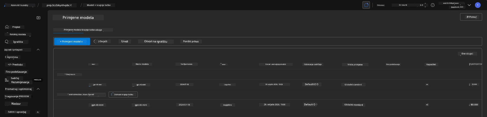
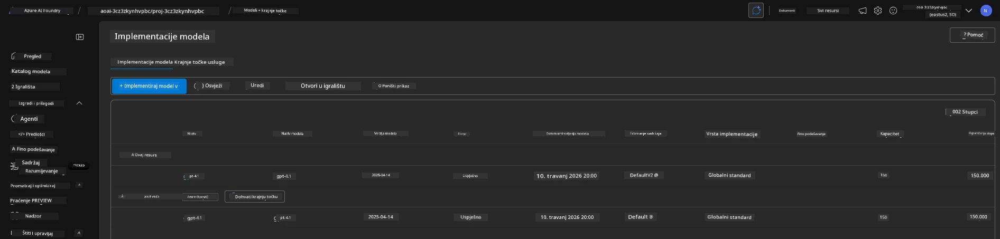

# 6. Raspremanje infrastrukture

!!! tip "NA KRAJU OVOG MODULA MOĆI ĆETE"

    - [ ] Stavka
    - [ ] Stavka
    - [ ] Stavka

---

## Dodatne vježbe

Prije nego što raspremimo projekt, odvojite nekoliko minuta za otvoreno istraživanje.

!!! danger "NITYA-TODO: Osmisliti neke prijedloge za isprobavanje"

---

## Deprovisioniranje infrastrukture

1. Raspremanje infrastrukture jednostavno je kao:
      
      ```bash title="" linenums="0"
      azd down --purge
      ```
1. Zastavica `--purge` osigurava da se također uklone softverski obrisani resursi Cognitive Service, čime se oslobađa kvota koju ti resursi zauzimaju. Nakon završetka vidjet ćete nešto poput ovoga:
      
      ```bash title="" linenums="0"
      ? Total resources to delete: 11, are you sure you want to continue? Yes
      Deleting your resources can take some time.
      (✓) Done: Deleted resource group rg-nitya-mshack-azd
      (✓) Done: Purging Cognitive Account: aoai-3cz3zkynhvpbc

      SUCCESS: Your application was removed from Azure in 11 minutes 4 seconds.
      ```

1. (Opcionalno) Ako sada ponovno pokrenete `azd up`, primijetit ćete da se model gpt-4.1 ponovno implementira jer je promijenjena (i spremljena) varijabla okruženja u lokalnoj `.azure` mapi.

      Evo implementacija modela **prije**:

      

      A evo ih **poslije**:
      

---

