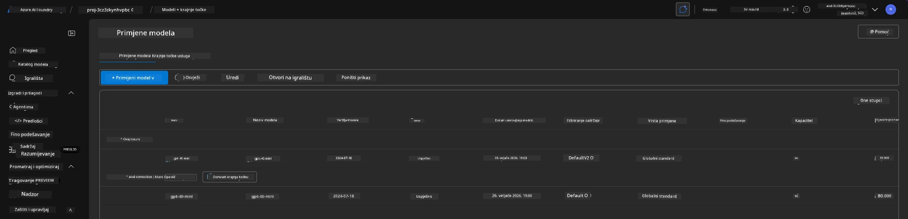
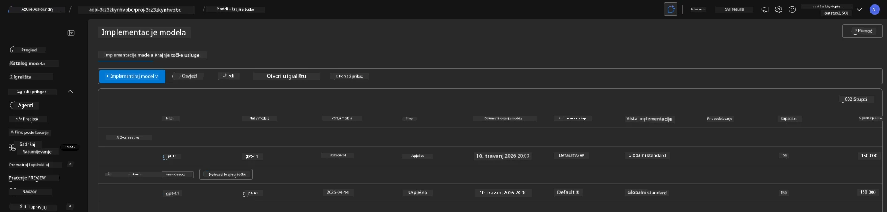

# 6. Demontaža infrastrukture

!!! tip "Nakon ovog modula MOĆI ĆETE"

    - [ ] Razumjeti važnost čišćenja resursa i upravljanja troškovima
    - [ ] Koristiti `azd down` za sigurno uklanjanje infrastrukture
    - [ ] Vratiti soft-obrisane kognitivne usluge ako je potrebno
    - [ ] **Laboratorij 6:** Očistiti Azure resurse i potvrditi uklanjanje

---

## Bonus zadaci

Prije nego što rastavimo projekt, odvojite nekoliko minuta za slobodnu exploraciju.

!!! info "Isprobajte ove poticaje za istraživanje"

    **Eksperimentirajte s GitHub Copilotom:**
    
    1. Pitajte: `Koje bih druge AZD predloške mogao isprobati za višestruke agente?`
    2. Pitajte: `Kako mogu prilagoditi upute agentu za zdravstveni slučaj?`
    3. Pitajte: `Koje varijable okoline kontroliraju optimizaciju troškova?`
    
    **Istražite Azure Portal:**
    
    1. Pogledajte metrike Application Insights za vašu implementaciju
    2. Provjerite analizu troškova za zakupljene resurse
    3. Ponovno istražite igralište za agente na Microsoft Foundry portalu

---

## Uklanjanje infrastrukture

1. Demontaža infrastrukture je jednostavna kao:

      ```bash title="" linenums="0"
      azd down --purge
      ```
1. Zastavica `--purge` osigurava da se također uklone i soft-obrisani resursi Cognitive Servicea, čime se oslobađa kvota koju ti resursi drže. Kada proces završi, vidjet ćete nešto poput ovoga:

      ```bash title="" linenums="0"
      ? Total resources to delete: 11, are you sure you want to continue? Yes
      Deleting your resources can take some time.
      (✓) Done: Deleted resource group rg-nitya-mshack-azd
      (✓) Done: Purging Cognitive Account: aoai-3cz3zkynhvpbc

      SUCCESS: Your application was removed from Azure in 11 minutes 4 seconds.
      ```

1. (Opcionalno) Ako sada ponovno pokrenete `azd up`, primijetit ćete da se model gpt-4.1 postavlja jer je varijabla okoline promijenjena (i spremljena) u lokalnu mapu `.azure`.

      Evo implementacija modela **prije**:

      

      A ovako je **nakon**:
      

---

<!-- CO-OP TRANSLATOR DISCLAIMER START -->
**Izjava o odricanju odgovornosti**:  
Ovaj dokument preveden je pomoću AI prevoditeljskog servisa [Co-op Translator](https://github.com/Azure/co-op-translator). Iako težimo točnosti, molimo imajte na umu da automatski prijevodi mogu sadržavati pogreške ili netočnosti. Izvorni dokument na izvornom jeziku treba smatrati autoritativnim izvorom. Za kritične informacije preporučuje se profesionalni ljudski prijevod. Ne snosimo odgovornost za bilo kakve nesporazume ili pogrešna tumačenja koja proizlaze iz korištenja ovog prijevoda.
<!-- CO-OP TRANSLATOR DISCLAIMER END -->