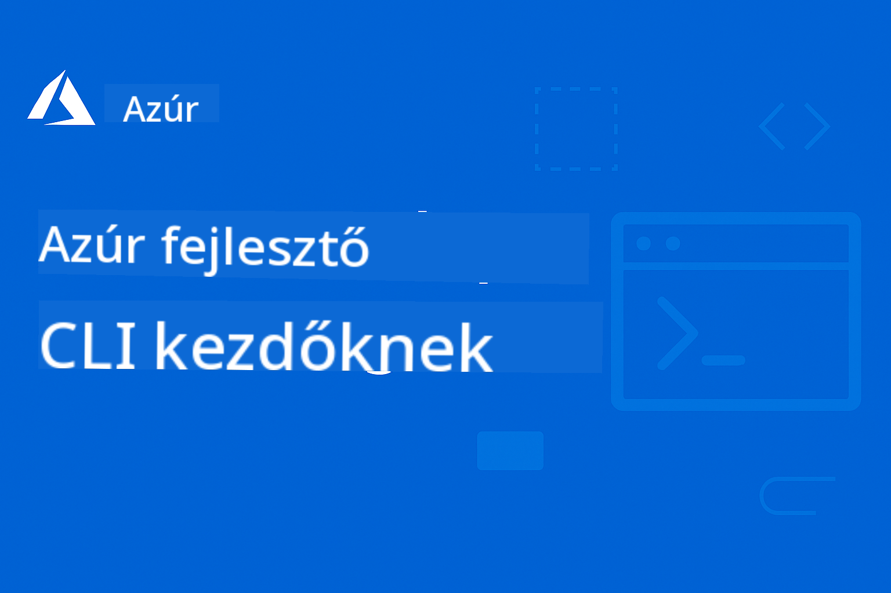

<!--
CO_OP_TRANSLATOR_METADATA:
{
  "original_hash": "3df05e83c2307e92452bd7c3307ae849",
  "translation_date": "2025-09-25T00:43:40+00:00",
  "source_file": "README.md",
  "language_code": "hu"
}
-->
# AZD Kezdőknek: Strukturált Tanulási Útmutató

 

[](https://GitHub.com/microsoft/azd-for-beginners/watchers/)
[](https://GitHub.com/microsoft/azd-for-beginners/network/)
[](https://GitHub.com/microsoft/azd-for-beginners/stargazers/)

[](https://discord.gg/microsoft-azure)
[](https://discord.gg/kzRShWzttr)

## Hogyan kezdj bele ebbe a kurzusba?

Kövesd az alábbi lépéseket, hogy elkezdhesd AZD tanulási utadat:

1. **Forkold a repót**: Kattints [](https://GitHub.com/microsoft/azd-for-beginners/fork)
2. **Klónozd a repót**: `git clone https://github.com/microsoft/azd-for-beginners.git`
3. **Csatlakozz a közösséghez**: [Azure Discord Közösségek](https://discord.com/invite/ByRwuEEgH4) szakértői támogatásért
4. **Válaszd ki a tanulási útvonaladat**: Válassz egy fejezetet az alábbiak közül, amely megfelel a tapasztalati szintednek

### Többnyelvű támogatás

#### Automatikus fordítások (mindig naprakészek)

[Francia](../fr/README.md) | [Spanyol](../es/README.md) | [Német](../de/README.md) | [Orosz](../ru/README.md) | [Arab](../ar/README.md) | [Perzsa (Fárszi)](../fa/README.md) | [Urdu](../ur/README.md) | [Kínai (Egyszerűsített)](../zh/README.md) | [Kínai (Hagyományos, Makaó)](../mo/README.md) | [Kínai (Hagyományos, Hongkong)](../hk/README.md) | [Kínai (Hagyományos, Tajvan)](../tw/README.md) | [Japán](../ja/README.md) | [Koreai](../ko/README.md) | [Hindi](../hi/README.md) | [Bengáli](../bn/README.md) | [Maráthi](../mr/README.md) | [Nepáli](../ne/README.md) | [Pandzsábi (Gurmukhi)](../pa/README.md) | [Portugál (Portugália)](../pt/README.md) | [Portugál (Brazília)](../br/README.md) | [Olasz](../it/README.md) | [Lengyel](../pl/README.md) | [Török](../tr/README.md) | [Görög](../el/README.md) | [Thai](../th/README.md) | [Svéd](../sv/README.md) | [Dán](../da/README.md) | [Norvég](../no/README.md) | [Finn](../fi/README.md) | [Holland](../nl/README.md) | [Héber](../he/README.md) | [Vietnámi](../vi/README.md) | [Indonéz](../id/README.md) | [Maláj](../ms/README.md) | [Tagalog (Filippínó)](../tl/README.md) | [Szuahéli](../sw/README.md) | [Magyar](./README.md) | [Cseh](../cs/README.md) | [Szlovák](../sk/README.md) | [Román](../ro/README.md) | [Bolgár](../bg/README.md) | [Szerb (Cirill)](../sr/README.md) | [Horvát](../hr/README.md) | [Szlovén](../sl/README.md) | [Ukrán](../uk/README.md) | [Burmai (Mianmar)](../my/README.md)

## Kurzus Áttekintése

Sajátítsd el az Azure Developer CLI-t (azd) strukturált fejezeteken keresztül, amelyek progresszív tanulást biztosítanak. **Különös hangsúly az AI alkalmazások telepítésén az Azure AI Foundry integrációval.**

### Miért elengedhetetlen ez a kurzus a modern fejlesztők számára?

Az Azure AI Foundry Discord közösség visszajelzései alapján **a fejlesztők 45%-a szeretné az AZD-t AI munkaterhelésekhez használni**, de nehézségekbe ütköznek az alábbiak miatt:
- Összetett, több szolgáltatást igénylő AI architektúrák
- Legjobb gyakorlatok a termelési AI telepítéshez  
- Azure AI szolgáltatások integrációja és konfigurációja
- Költségoptimalizálás AI munkaterhelésekhez
- AI-specifikus telepítési problémák elhárítása

### Tanulási Célok

A kurzus elvégzésével:
- **Elsajátítod az AZD alapjait**: Alapfogalmak, telepítés és konfiguráció
- **AI alkalmazásokat telepítesz**: AZD használata az Azure AI Foundry szolgáltatásokkal
- **Infrastruktúra kódként**: Azure erőforrások kezelése Bicep sablonokkal
- **Telepítési problémák megoldása**: Gyakori hibák elhárítása és problémák debugolása
- **Optimalizálás termeléshez**: Biztonság, skálázás, monitorozás és költségkezelés
- **Többügynökös megoldások építése**: Összetett AI architektúrák telepítése

## 📚 Tanulási Fejezetek

*Válaszd ki a tanulási útvonaladat tapasztalati szint és célok alapján*

### 🚀 1. Fejezet: Alapok & Gyors Kezdés
**Előfeltételek**: Azure előfizetés, alapvető parancssori ismeretek  
**Időtartam**: 30-45 perc  
**Komplexitás**: ⭐

#### Amit megtanulsz
- Az Azure Developer CLI alapjainak megértése
- AZD telepítése a platformodra
- Az első sikeres telepítésed

#### Tanulási Források
- **🎯 Kezd itt**: [Mi az Azure Developer CLI?](../..)
- **📖 Elmélet**: [AZD Alapok](docs/getting-started/azd-basics.md) - Alapfogalmak és terminológia
- **⚙️ Beállítás**: [Telepítés & Beállítás](docs/getting-started/installation.md) - Platform-specifikus útmutatók
- **🛠️ Gyakorlati rész**: [Az első projekted](docs/getting-started/first-project.md) - Lépésről lépésre útmutató
- **📋 Gyors Referencia**: [Parancsok Gyorslapja](resources/cheat-sheet.md)

#### Gyakorlati Feladatok
```bash
# Quick installation check
azd version

# Deploy your first application
azd init --template todo-nodejs-mongo
azd up
```

**💡 Fejezet Eredménye**: Sikeresen telepítesz egy egyszerű webalkalmazást az Azure-ra AZD segítségével

---

### 🤖 2. Fejezet: AI-első Fejlesztés (Ajánlott AI fejlesztőknek)
**Előfeltételek**: 1. fejezet elvégzése  
**Időtartam**: 1-2 óra  
**Komplexitás**: ⭐⭐

#### Amit megtanulsz
- Azure AI Foundry integráció AZD-vel
- AI-alapú alkalmazások telepítése
- AI szolgáltatások konfigurációjának megértése

#### Tanulási Források
- **🎯 Kezd itt**: [Azure AI Foundry Integráció](docs/ai-foundry/azure-ai-foundry-integration.md)
- **📖 Minták**: [AI Modell Telepítés](docs/ai-foundry/ai-model-deployment.md) - AI modellek telepítése és kezelése
- **🛠️ Workshop**: [AI Workshop Lab](docs/ai-foundry/ai-workshop-lab.md) - AI megoldások AZD-re való felkészítése
- **🎥 Interaktív Útmutató**: [Workshop Anyagok](workshop/README.md) - Böngésző-alapú tanulás MkDocs * DevContainer környezetben
- **📋 Sablonok**: [Azure AI Foundry Sablonok](../..)

#### Gyakorlati Feladatok
```bash
# Deploy your first AI application
azd init --template azure-search-openai-demo
azd up

# Try additional AI templates
azd init --template openai-chat-app-quickstart
azd init --template agent-openai-python-prompty
```

**💡 Fejezet Eredménye**: Telepítesz és konfigurálsz egy AI-alapú chat alkalmazást RAG képességekkel

---

### ⚙️ 3. Fejezet: Konfiguráció & Hitelesítés
**Előfeltételek**: 1. fejezet elvégzése  
**Időtartam**: 45-60 perc  
**Komplexitás**: ⭐⭐

#### Amit megtanulsz
- Környezetek konfigurációja és kezelése
- Hitelesítési és biztonsági legjobb gyakorlatok
- Erőforrások elnevezése és szervezése

#### Tanulási Források
- **📖 Konfiguráció**: [Konfigurációs Útmutató](docs/getting-started/configuration.md) - Környezet beállítása
- **🔐 Biztonság**: Hitelesítési minták és kezelt identitás
- **📝 Példák**: [Adatbázis Alkalmazás Példa](../../examples/database-app) - Konfigurációs minták

#### Gyakorlati Feladatok
- Több környezet konfigurálása (fejlesztés, tesztelés, éles)
- Kezelt identitás hitelesítés beállítása
- Környezet-specifikus konfigurációk implementálása

**💡 Fejezet Eredménye**: Több környezet kezelése megfelelő hitelesítéssel és biztonsággal

---

### 🏗️ 4. Fejezet: Infrastruktúra kódként & Telepítés
**Előfeltételek**: 1-3. fejezetek elvégzése  
**Időtartam**: 1-1.5 óra  
**Komplexitás**: ⭐⭐⭐

#### Amit megtanulsz
- Haladó telepítési minták
- Infrastruktúra kódként Bicep segítségével
- Erőforrások biztosítási stratégiái

#### Tanulási Források
- **📖 Telepítés**: [Telepítési Útmutató](docs/deployment/deployment-guide.md) - Teljes munkafolyamatok
- **🏗️ Biztosítás**: [Erőforrások Biztosítása](docs/deployment/provisioning.md) - Azure erőforrások kezelése
- **📝 Példák**: [Konténer Alkalmazás Példa](../../examples/container-app) - Konténeres telepítések

#### Gyakorlati Feladatok
- Egyedi Bicep sablonok létrehozása
- Több szolgáltatást igénylő alkalmazások telepítése
- Kék-zöld telepítési stratégiák implementálása

**💡 Fejezet Eredménye**: Összetett, több szolgáltatást igénylő alkalmazások telepítése egyedi infrastruktúra sablonokkal

---

### 🎯 5. Fejezet: Többügynökös AI Megoldások (Haladó)
**Előfeltételek**: 1-2. fejezetek elvégzése  
**Időtartam**: 2-3 óra  
**Komplexitás**: ⭐⭐⭐⭐

#### Amit megtanulsz
- Többügynökös architektúra minták
- Ügynökök koordinációja és irányítása
- Termelésre kész AI telepítések

#### Tanulási Források
- **🤖 Kiemelt Projekt**: [Kiskereskedelmi Többügynökös Megoldás](examples/retail-scenario.md) - Teljes implementáció
- **🛠️ ARM Sablonok**: [ARM Sablon Csomag](../../examples/retail-multiagent-arm-template) - Egykattintásos telepítés
- **📖 Architektúra**: Többügynökös koordinációs minták

#### Gyakorlati Feladatok
```bash
# Deploy the complete retail multi-agent solution
cd examples/retail-multiagent-arm-template
./deploy.sh

# Explore agent configurations
az deployment group show --resource-group <rg-name> --name <deployment-name>
```

**💡 Fejezet Eredménye**: Termelésre kész többügynökös AI megoldás telepítése és kezelése Ügyfél és Készlet ügynökökkel

---

### 🔍 6. Fejezet: Telepítés Előtti Validáció & Tervezés
**Előfeltételek**: 4. fejezet elvégzése  
**Időtartam**: 1 óra  
**Komplexitás**: ⭐⭐

#### Amit megtanulsz
- Kapacitástervezés és erőforrás validáció
- SKU kiválasztási stratégiák
- Előzetes ellenőrzések és automatizáció

#### Tanulási Források
- **📊 Tervezés**: [Kapacitástervezés](docs/pre-deployment/capacity-planning.md) - Erőforrás validáció
- **💰 Kiválasztás**: [SKU Kiválasztás](docs/pre-deployment/sku-selection.md) - Költséghatékony választások
- **✅ Validáció**: [Előzetes Ellenőrzések](docs/pre-deployment/preflight-checks.md) - Automatikus szkriptek

#### Gyakorlati Feladatok
- Kapacitás validációs szkriptek futtatása
- SKU kiválasztások optimalizálása költségekhez
- Automatikus telepítés előtti ellenőrzések implementálása

**💡 Fejezet Eredménye**: Telepítések validálása és optimalizálása végrehajtás előtt

---

### 🚨 7. Fejezet: Hibakeresés & Debugolás
**Előfeltételek**: Bármely telepítési fejezet elvégzése  
**Időtartam**: 1-1.5 óra  
**Komplexitás**: ⭐⭐

#### Amit megtanulsz
- Szisztematikus hibakeresési megközelítések
- Gyakori problémák és megoldások
- AI-specifikus hibakeresés

#### Tanulási Források
- **🔧 Gyakori Problémák**: [Gyakori Problémák](docs/troubleshooting/common-issues.md) - GYIK és megoldások
- **🕵️ Debugolás**: [Debugolási Útmutató](docs/troubleshooting/debugging.md) - Lépésről lépésre stratégiák
- **🤖 AI Problémák**: [AI-specifikus Hibakeresés](docs/troubleshooting/ai-troubleshooting.md) - AI szolgáltatások problémái

#### Gyakorlati Feladatok
- Telepítési hibák diagnosztizálása
- Hitelesítési problémák megoldása
- AI szolgáltatások csatlakozási hibáinak debugolása

**💡 Fejezet Eredménye**: Gyakori telepítési problémák önálló diagnosztizálása és megoldása

---

### 🏢 8. Fejezet: Termelési & Vállalati Minták
**Előfeltételek**: 1-4. fejezetek elvégzése  
**Időtartam**: 2-3 óra  
**Komplexitás**: ⭐⭐⭐⭐

#### Amit megtanulsz
- Termelési telepítési stratégiák
- Vállalati biztonsági minták
- Monitorozás és költségoptimalizálás

#### Tanulási Források
- **🏭 Termel
- **📝 Példák**: [Microservices Példa](../../examples/microservices) - Komplex architektúrák
- **📊 Monitoring**: Application Insights integráció

#### Gyakorlati Feladatok
- Vállalati biztonsági minták megvalósítása
- Átfogó monitoring beállítása
- Éles környezetbe történő telepítés megfelelő irányítással

**💡 Fejezet Eredménye**: Vállalati szintű alkalmazások telepítése teljes éles környezeti képességekkel

---

## 🎓 Workshop Áttekintés: Gyakorlati Tanulási Élmény

### Interaktív Workshop Anyagok
**Átfogó gyakorlati tanulás böngésző-alapú eszközökkel és irányított gyakorlatokkal**

Workshop anyagaink strukturált, interaktív tanulási élményt nyújtanak, amely kiegészíti a fejezet-alapú tananyagot. A workshop önálló tanulásra és oktató által vezetett foglalkozásokra egyaránt alkalmas.

#### 🛠️ Workshop Jellemzők
- **Böngésző-alapú Felület**: Teljes MkDocs-alapú workshop keresési, másolási és témaválasztási funkciókkal
- **GitHub Codespaces Integráció**: Egy kattintásos fejlesztési környezet beállítás
- **Strukturált Tanulási Útvonal**: 7 lépéses irányított gyakorlatok (összesen 3,5 óra)
- **Felfedezés → Telepítés → Testreszabás**: Fokozatos módszertan
- **Interaktív DevContainer Környezet**: Előre konfigurált eszközök és függőségek

#### 📚 Workshop Felépítése
A workshop a **Felfedezés → Telepítés → Testreszabás** módszertant követi:

1. **Felfedezési Fázis** (45 perc)
   - Azure AI Foundry sablonok és szolgáltatások felfedezése
   - Többügynökös architektúra minták megértése
   - Telepítési követelmények és előfeltételek áttekintése

2. **Telepítési Fázis** (2 óra)
   - AI alkalmazások gyakorlati telepítése AZD-vel
   - Azure AI szolgáltatások és végpontok konfigurálása
   - Biztonsági és hitelesítési minták megvalósítása

3. **Testreszabási Fázis** (45 perc)
   - Alkalmazások módosítása specifikus felhasználási esetekhez
   - Optimalizálás éles környezetbe történő telepítéshez
   - Monitoring és költségkezelés megvalósítása

#### 🚀 Workshop Kezdése
```bash
# Option 1: GitHub Codespaces (Recommended)
# Click "Code" → "Create codespace on main" in the repository

# Option 2: Local Development
git clone https://github.com/microsoft/azd-for-beginners.git
cd azd-for-beginners/workshop
# Follow the setup instructions in workshop/README.md
```

#### 🎯 Workshop Tanulási Eredmények
A workshop elvégzésével a résztvevők:
- **Éles AI Alkalmazásokat Telepítenek**: AZD használata Azure AI Foundry szolgáltatásokkal
- **Többügynökös Architektúrákat Elsajátítanak**: Koordinált AI ügynök megoldások megvalósítása
- **Biztonsági Legjobb Gyakorlatokat Alkalmaznak**: Hitelesítés és hozzáférés-vezérlés konfigurálása
- **Skálázásra Optimalizálnak**: Költséghatékony, teljesítményorientált telepítések tervezése
- **Telepítési Hibákat Elhárítanak**: Gyakori problémák önálló megoldása

#### 📖 Workshop Források
- **🎥 Interaktív Útmutató**: [Workshop Anyagok](workshop/README.md) - Böngésző-alapú tanulási környezet
- **📋 Lépésről-Lépésre Útmutatók**: [Irányított Gyakorlatok](../../workshop/docs/instructions) - Részletes útmutatók
- **🛠️ AI Workshop Labor**: [AI Workshop Labor](docs/ai-foundry/ai-workshop-lab.md) - AI-fókuszú gyakorlatok
- **💡 Gyors Kezdés**: [Workshop Beállítási Útmutató](workshop/README.md#quick-start) - Környezet konfiguráció

**Ideális**: Vállalati képzésekhez, egyetemi kurzusokhoz, önálló tanuláshoz és fejlesztői bootcamp-ekhez.

---

## 📖 Mi az Azure Developer CLI?

Az Azure Developer CLI (azd) egy fejlesztőközpontú parancssori eszköz, amely felgyorsítja az alkalmazások Azure-ba történő építésének és telepítésének folyamatát. Az alábbiakat kínálja:

- **Sablon-alapú telepítések** - Előre elkészített sablonok használata gyakori alkalmazási mintákhoz
- **Infrastruktúra kódként** - Azure erőforrások kezelése Bicep vagy Terraform segítségével  
- **Integrált munkafolyamatok** - Alkalmazások zökkenőmentes előkészítése, telepítése és monitorozása
- **Fejlesztőbarát** - Optimalizált a fejlesztői produktivitás és élmény érdekében

### **AZD + Azure AI Foundry: Tökéletes AI Telepítésekhez**

**Miért AZD az AI Megoldásokhoz?** Az AZD az AI fejlesztők legnagyobb kihívásait oldja meg:

- **AI-Kész Sablonok** - Előre konfigurált sablonok Azure OpenAI, Cognitive Services és ML munkaterhelésekhez
- **Biztonságos AI Telepítések** - Beépített biztonsági minták AI szolgáltatásokhoz, API kulcsokhoz és modell végpontokhoz  
- **Éles AI Minták** - Legjobb gyakorlatok skálázható, költséghatékony AI alkalmazás telepítésekhez
- **Teljeskörű AI Munkafolyamatok** - Modellfejlesztéstől az éles telepítésig megfelelő monitorozással
- **Költségoptimalizálás** - Okos erőforrás-elosztási és skálázási stratégiák AI munkaterhelésekhez
- **Azure AI Foundry Integráció** - Zökkenőmentes kapcsolat az AI Foundry modell katalógushoz és végpontokhoz

---

## 🎯 Sablonok és Példák Könyvtára

### Kiemelt: Azure AI Foundry Sablonok
**Kezdje itt, ha AI alkalmazásokat telepít!**

| Sablon | Fejezet | Komplexitás | Szolgáltatások |
|----------|---------|------------|----------|
| [**AI chat indítása**](https://github.com/Azure-Samples/get-started-with-ai-chat) | Fejezet 2 | ⭐⭐ | AzureOpenAI + Azure AI Modell Inference API + Azure AI Search + Azure Container Apps + Application Insights |
| [**AI ügynökök indítása**](https://github.com/Azure-Samples/get-started-with-ai-agents) | Fejezet 2 | ⭐⭐ | Azure AI Agent Service + AzureOpenAI + Azure AI Search + Azure Container Apps + Application Insights|
| [**Többügynökös munkafolyamat automatizálás**](https://github.com/Azure-Samples/get-started-with-ai-chat) | Fejezet 5 | ⭐⭐⭐ | AzureOpenAI + Azure AI Agent Service + Semantic Kernel + Azure CosmosDB + Azure Container Apps|
| [**Dokumentumok generálása adatokból**](https://github.com/Azure-Samples/get-started-with-ai-chat) | Fejezet 4 | ⭐⭐⭐  | AzureOpenAI + Azure AI Search + Azure AI Services + Azure CosmosDB|
| [**Ügyfél találkozók javítása ügynökökkel**](https://github.com/Azure-Samples/get-started-with-ai-chat) | Fejezet 5 | ⭐⭐⭐| AzureOpenAI + Azure AI Search + Azure CosmosDB + Azure SQL Database |
| [**Kód modernizálása ügynökökkel**](https://github.com/Azure-Samples/get-started-with-ai-chat) | Fejezet 5 | ⭐⭐⭐ | AzureOpenAI + Azure Agent Service + Semantic Kernel + Azure CosmosDB + Azure Container Apps|
| [**Beszélgetési ügynök építése**](https://github.com/Azure-Samples/get-started-with-ai-chat) | Fejezet 4 | ⭐⭐⭐ | AI Language + AzureOpenAI + AI Search + Azure Storage + Azure Container Registry|
| [**Beszélgetési adatokból származó betekintések feltárása**](https://github.com/Azure-Samples/get-started-with-ai-chat) | Fejezet 8 | ⭐⭐⭐ | AzureOpenAI + AI Search + Semantic Kernel + Azure Agent Service + AI AI Content Understanding|
| [**Többmódú tartalomfeldolgozás**](https://github.com/Azure-Samples/get-started-with-ai-chat) | Fejezet 8 | ⭐⭐⭐⭐ | AzureOpenAI + Azure Content Understanding + Azure CosmosDB + Azure Container Apps|

### Kiemelt: Teljes Tanulási Forgatókönyvek
**Éles környezetre kész alkalmazás sablonok tanulási fejezetekhez igazítva**

| Sablon | Tanulási Fejezet | Komplexitás | Fő Tanulási Cél |
|----------|------------------|------------|--------------|
| [**openai-chat-app-quickstart**](https://github.com/Azure-Samples/openai-chat-app-quickstart) | Fejezet 2 | ⭐ | Alapvető AI telepítési minták |
| [**azure-search-openai-demo**](https://github.com/Azure-Samples/azure-search-openai-demo) | Fejezet 2 | ⭐⭐ | RAG megvalósítás Azure AI Search segítségével |
| [**ai-document-processing**](https://github.com/Azure-Samples/ai-document-processing) | Fejezet 4 | ⭐⭐ | Dokumentum Intelligencia integráció |
| [**agent-openai-python-prompty**](https://github.com/Azure-Samples/agent-openai-python-prompty) | Fejezet 5 | ⭐⭐⭐ | Ügynök keretrendszer és funkcióhívás |
| [**contoso-chat**](https://github.com/Azure-Samples/contoso-chat) | Fejezet 8 | ⭐⭐⭐ | Vállalati AI orkestráció |
| [**retail-multi-agent-solution**](examples/retail-scenario.md) | Fejezet 5 | ⭐⭐⭐⭐ | Többügynökös architektúra Ügyfél és Készlet ügynökökkel |

### Példák Típus Szerint

#### Egyszerű Alkalmazások (1-2. fejezet)
- [Egyszerű Webalkalmazás](../../examples/simple-web-app) - Alapvető telepítési minták
- [Statikus Weboldal](../../examples/static-site) - Statikus tartalom telepítése
- [Alapvető API](../../examples/basic-api) - REST API telepítése

#### Adatbázis Integráció (3-4. fejezet)  
- [Adatbázis Alkalmazás](../../examples/database-app) - Adatbázis kapcsolódási minták
- [Adatfeldolgozás](../../examples/data-processing) - ETL munkafolyamat telepítése

#### Haladó Minták (4-8. fejezet)
- [Container Apps](../../examples/container-app) - Konténeres telepítések
- [Microservices](../../examples/microservices) - Több szolgáltatásból álló architektúrák  
- [Vállalati Megoldások](../../examples/enterprise) - Éles környezetre kész minták

### Külső Sablon Gyűjtemények
- [**Azure-Samples AZD Sablonok**](https://github.com/Azure-Samples/azd-templates) - Hivatalos Microsoft minták
- [**Awesome AZD Galéria**](https://azure.github.io/awesome-azd/) - Közösség által készített sablonok
- [**Példák Könyvtár**](examples/README.md) - Helyi tanulási példák részletes magyarázatokkal

---

## 📚 Tanulási Források és Hivatkozások

### Gyors Hivatkozások
- [**Parancs Súgó**](resources/cheat-sheet.md) - Alapvető azd parancsok fejezetek szerint rendezve
- [**Szójegyzék**](resources/glossary.md) - Azure és azd terminológia  
- [**GYIK**](resources/faq.md) - Gyakori kérdések fejezetek szerint rendezve
- [**Tanulási Útmutató**](resources/study-guide.md) - Átfogó gyakorlati feladatok

### Gyakorlati Workshopok
- [**AI Workshop Labor**](docs/ai-foundry/ai-workshop-lab.md) - AI megoldások AZD-telepíthetővé tétele (2-3 óra)
- [**Interaktív Workshop Útmutató**](workshop/README.md) - Böngésző-alapú workshop MkDocs és DevContainer Környezettel
- [**Strukturált Tanulási Útvonal**](../../workshop/docs/instructions) - 7 lépéses irányított gyakorlatok (Felfedezés → Telepítés → Testreszabás)
- [**AZD Kezdőknek Workshop**](workshop/README.md) - Teljes gyakorlati workshop anyagok GitHub Codespaces integrációval

### Külső Tanulási Források
- [Azure Developer CLI Dokumentáció](https://learn.microsoft.com/en-us/azure/developer/azure-developer-cli/)
- [Azure Architektúra Központ](https://learn.microsoft.com/en-us/azure/architecture/)
- [Azure Árkalkulátor](https://azure.microsoft.com/pricing/calculator/)
- [Azure Állapot](https://status.azure.com/)

---

## 🎓 Tanfolyam Befejezése és Tanúsítvány

### Haladás Nyomonkövetése
Kövesse tanulási haladását minden fejezeten keresztül:

- [ ] **1. fejezet**: Alapok és Gyors Kezdés ✅
- [ ] **2. fejezet**: AI-első Fejlesztés ✅  
- [ ] **3. fejezet**: Konfiguráció és Hitelesítés ✅
- [ ] **4. fejezet**: Infrastruktúra kódként és Telepítés ✅
- [ ] **5. fejezet**: Többügynökös AI Megoldások ✅
- [ ] **6. fejezet**: Előtelepítési Validáció és Tervezés ✅
- [ ] **7. fejezet**: Hibakeresés és Debugolás ✅
- [ ] **8. fejezet**: Éles és Vállalati Minták ✅

### Tanulási Ellenőrzés
Minden fejezet befejezése után ellenőrizze tudását:
1. **Gyakorlati Feladat**: Végezze el a fejezet gyakorlati telepítését
2. **Tudás Ellenőrzés**: Tekintse át a fejezet GYIK szekcióját
3. **Közösségi Megbeszélés**: Ossza meg tapasztalatait az Azure Discordon
4. **Következő Fejezet**: Lépjen a következő komplexitási szintre

### Tanfolyam Befejezési Előnyök
A fejezetek befejezése után:
- **Éles Tapasztalat**: Valós AI alkalmazásokat telepített Azure-ba
- **Szakmai Képességek**: Vállalati szintű telepítési képességek  
- **Közösségi Elismerés**: Aktív tagja az Azure fejlesztői közösségnek
- **Karrier Előrelépés**: Keresett AZD és AI telepítési szakértelem

---

## 🤝 Közösség és Támogatás

### Segítség és Támogatás
- **Technikai Problémák**: [Hibák jelentése és funkciók kérése](https://github.com/microsoft/azd-for-beginners/issues)
- **Tanulási Kérdések**: [Microsoft Azure Discord Közösség](https://discord.gg/microsoft-azure)
- **AI-Specifikus Segítség**: Csatlakozzon az [#Azure csatornához](https://discord.gg/microsoft-azure) AZD + AI Foundry megbeszélésekhez
- **Dokumentáció**: [Hivatalos Azure Developer CLI dokumentáció](https://learn.microsoft.com/en-us/azure/developer/azure-developer-cli/)

### Közösségi Érdekességek az Azure AI Foundry Discordról

**Legutóbbi Szavazási Eredmények az #Azure Csatornán:**
- **45%** fejlesztő szeretné AZD-t használni AI munkaterhelésekhez
- **Fő kihívások**: Több szolgáltatásból álló telepítések, hitelesítési kezelés, éles környezeti felkészültség  
- **Leginkább kért**: AI-specifikus sablonok, hibakeresési útmutatók, leg
### Kapcsolódó Microsoft tanulási források

Csapatunk további átfogó tanfolyamokat készít:

- [Model Context Protocol (MCP) kezdőknek](https://github.com/microsoft/mcp-for-beginners?WT.mc_id=academic-105485-koreyst)
- [AI ügynökök kezdőknek](https://github.com/microsoft/ai-agents-for-beginners?WT.mc_id=academic-105485-koreyst)  
- [Generatív AI kezdőknek .NET használatával](https://github.com/microsoft/Generative-AI-for-beginners-dotnet?WT.mc_id=academic-105485-koreyst)
- [Generatív AI kezdőknek](https://github.com/microsoft/generative-ai-for-beginners?WT.mc_id=academic-105485-koreyst)
- [Generatív AI kezdőknek Java használatával](https://github.com/microsoft/generative-ai-for-beginners-java?WT.mc_id=academic-105485-koreyst)
- [ML kezdőknek](https://aka.ms/ml-beginners?WT.mc_id=academic-105485-koreyst)
- [Adattudomány kezdőknek](https://aka.ms/datascience-beginners?WT.mc_id=academic-105485-koreyst)
- [AI kezdőknek](https://aka.ms/ai-beginners?WT.mc_id=academic-105485-koreyst)
- [Kiberbiztonság kezdőknek](https://github.com/microsoft/Security-101??WT.mc_id=academic-96948-sayoung)
- [Webfejlesztés kezdőknek](https://aka.ms/webdev-beginners?WT.mc_id=academic-105485-koreyst)
- [IoT kezdőknek](https://aka.ms/iot-beginners?WT.mc_id=academic-105485-koreyst)
- [XR fejlesztés kezdőknek](https://github.com/microsoft/xr-development-for-beginners?WT.mc_id=academic-105485-koreyst)
- [GitHub Copilot elsajátítása AI páros programozáshoz](https://aka.ms/GitHubCopilotAI?WT.mc_id=academic-105485-koreyst)
- [GitHub Copilot elsajátítása C#/.NET fejlesztők számára](https://github.com/microsoft/mastering-github-copilot-for-dotnet-csharp-developers?WT.mc_id=academic-105485-koreyst)
- [Válaszd ki saját Copilot kalandodat](https://github.com/microsoft/CopilotAdventures?WT.mc_id=academic-105485-koreyst)

---

## 🗺️ Tanfolyam navigáció

**🚀 Készen állsz a tanulásra?**

**Kezdők**: Kezdd a [1. fejezet: Alapok és gyors kezdés](../..) résznél  
**AI fejlesztők**: Ugorj a [2. fejezet: AI-első fejlesztés](../..) részhez  
**Tapasztalt fejlesztők**: Kezdd a [3. fejezet: Konfiguráció és hitelesítés](../..) résznél

**Következő lépések**: [Kezdd az 1. fejezetet - AZD alapok](docs/getting-started/azd-basics.md) →

---

