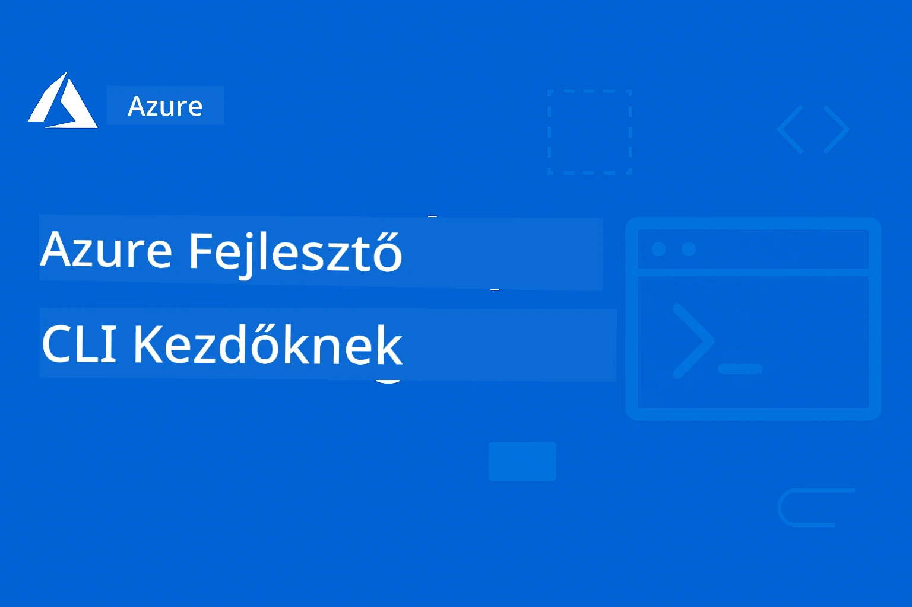

<!--
CO_OP_TRANSLATOR_METADATA:
{
  "original_hash": "068c87cc2641a81ca353ad7064ff326a",
  "translation_date": "2026-01-01T18:46:32+00:00",
  "source_file": "README.md",
  "language_code": "hu"
}
-->
# AZD Kezdőknek: Egy Strukturált Tanulási Út

 

[](https://GitHub.com/microsoft/azd-for-beginners/watchers/)
[](https://GitHub.com/microsoft/azd-for-beginners/network/)
[](https://GitHub.com/microsoft/azd-for-beginners/stargazers/)

[](https://discord.gg/microsoft-azure)
[](https://discord.gg/nTYy5BXMWG)

## Kezdés ezzel a kurzussal

Kövesd ezeket a lépéseket, hogy elkezdd az AZD tanulmányaidat:

1. **Forkold a tárolót**: Kattints ide [](https://GitHub.com/microsoft/azd-for-beginners/fork)
2. **Klónozd a tárolót**: `git clone https://github.com/microsoft/azd-for-beginners.git`
3. **Csatlakozz a közösséghez**: [Azure Discord közösségek](https://discord.com/invite/ByRwuEEgH4) szakértői támogatásért
4. **Válaszd ki a tanulási utadat**: Válassz egy alábbi fejezetet, amely megfelel a tapasztalati szintednek

### Többnyelvű támogatás

#### Automatikus fordítások (Mindig naprakész)

<!-- CO-OP TRANSLATOR LANGUAGES TABLE START -->
[Arab](../ar/README.md) | [Bengáli](../bn/README.md) | [Bolgár](../bg/README.md) | [Burmai (Mianmar)](../my/README.md) | [Kínai (egyszerűsített)](../zh/README.md) | [Kínai (hagyományos, Hongkong)](../hk/README.md) | [Kínai (hagyományos, Makaó)](../mo/README.md) | [Kínai (hagyományos, Tajvan)](../tw/README.md) | [Horvát](../hr/README.md) | [Cseh](../cs/README.md) | [Dán](../da/README.md) | [Holland](../nl/README.md) | [Észt](../et/README.md) | [Finn](../fi/README.md) | [Francia](../fr/README.md) | [Német](../de/README.md) | [Görög](../el/README.md) | [Héber](../he/README.md) | [Hindi](../hi/README.md) | [Magyar](./README.md) | [Indonéz](../id/README.md) | [Olasz](../it/README.md) | [Japán](../ja/README.md) | [Kannada](../kn/README.md) | [Koreai](../ko/README.md) | [Litván](../lt/README.md) | [Maláj](../ms/README.md) | [Malajálam](../ml/README.md) | [Maráthi](../mr/README.md) | [Nepáli](../ne/README.md) | [Nigériai pidgin](../pcm/README.md) | [Norvég](../no/README.md) | [Perzsa (Farszi)](../fa/README.md) | [Lengyel](../pl/README.md) | [Portugál (Brazília)](../br/README.md) | [Portugál (Portugália)](../pt/README.md) | [Pandzsábi (Gurmukhi)](../pa/README.md) | [Román](../ro/README.md) | [Orosz](../ru/README.md) | [Szerb (cirill)](../sr/README.md) | [Szlovák](../sk/README.md) | [Szlovén](../sl/README.md) | [Spanyol](../es/README.md) | [Szuahéli](../sw/README.md) | [Svéd](../sv/README.md) | [Tagalog (Filippínó)](../tl/README.md) | [Tamil](../ta/README.md) | [Telugu](../te/README.md) | [Thai](../th/README.md) | [Török](../tr/README.md) | [Ukrán](../uk/README.md) | [Urdu](../ur/README.md) | [Vietnámi](../vi/README.md)
<!-- CO-OP TRANSLATOR LANGUAGES TABLE END -->

## A kurzus áttekintése

Sajátítsd el az Azure Developer CLI-t (azd) strukturált fejezeteken keresztül, amelyek fokozatos tanulást biztosítanak. **Különös hangsúly az AI-alkalmazások telepítésén a Microsoft Foundry integrációval.**

### Miért fontos ez a kurzus a modern fejlesztők számára

A Microsoft Foundry Discord közösség visszajelzései alapján **a fejlesztők 45%-a szeretné az AZD-t AI munkaterhelésekhez használni**, de nehézségekbe ütköznek a következők miatt:
- Összetett, több szolgáltatásból álló AI architektúrák
- AI termelési telepítési legjobb gyakorlatok  
- Azure AI szolgáltatások integrációja és konfigurációja
- AI munkaterhelések költségoptimalizálása
- AI-specifikus telepítési hibakeresés

### Tanulási célok

A strukturált kurzus elvégzésével:
- **Az AZD alapjainak elsajátítása**: Alapfogalmak, telepítés és konfiguráció
- **AI alkalmazások telepítése**: AZD használata Microsoft Foundry szolgáltatásokkal
- **Infrastructure as Code megvalósítása**: Azure erőforrások kezelése Bicep sablonokkal
- **Telepítések hibakeresése**: Gyakori problémák megoldása és hibakeresés
- **Termelésre optimalizálás**: Biztonság, skálázás, megfigyelés és költségkezelés
- **Többügynökös megoldások építése**: Összetett AI architektúrák telepítése

## 📚 Tanulási fejezetek

*Válaszd ki a tanulási utadat tapasztalat és célok alapján*

### 🚀 1. fejezet: Alapok & Gyors Kezdés
**Előfeltételek**: Azure előfizetés, alapvető parancssoros ismeretek  
**Időtartam**: 30–45 perc  
**Bonyolultság**: ⭐

#### Mit fogsz megtanulni
- Az Azure Developer CLI alapjainak megértése
- AZD telepítése a platformodra
- Az első sikeres telepítésed

#### Tananyagok
- **🎯 Kezdj itt**: [Mi az Azure Developer CLI?](../..)
- **📖 Elmélet**: [AZD alapjai](docs/getting-started/azd-basics.md) - Alapfogalmak és terminológia
- **⚙️ Beállítás**: [Telepítés és beállítás](docs/getting-started/installation.md) - Platformspecifikus útmutatók
- **🛠️ Gyakorlati**: [Az első projekted](docs/getting-started/first-project.md) - Lépésről lépésre útmutató
- **📋 Gyors hivatkozás**: [Parancsok csalólapja](resources/cheat-sheet.md)

#### Gyakorlati feladatok
```bash
# Gyors telepítési ellenőrzés
azd version

# Telepítse az első alkalmazását
azd init --template todo-nodejs-mongo
azd up
```

**💡 A fejezet eredménye**: Egy egyszerű webalkalmazás sikeres telepítése Azure-ra AZD használatával

**✅ Siker ellenőrzése:**
```bash
# Az 1. fejezet elvégzése után képes leszel:
azd version              # Megjeleníti a telepített verziót
azd init --template todo-nodejs-mongo  # Inicializálja a projektet
azd up                  # Telepíti az Azure-ra
azd show                # Megjeleníti a futó alkalmazás URL-címét
# Az alkalmazás megnyílik a böngészőben és működik
azd down --force --purge  # Eltávolítja az erőforrásokat
```

**📊 Időbefektetés:** 30–45 perc  
**📈 Szint a végén:** Alapalkalmazásokat önállóan tud telepíteni

**✅ Siker ellenőrzése:**
```bash
# Az 1. fejezet elvégzése után képes leszel:
azd version              # Megjeleníti a telepített verziót
azd init --template todo-nodejs-mongo  # Inicializálja a projektet
azd up                  # Telepíti az alkalmazást Azure-ra
azd show                # Megjeleníti a futó alkalmazás URL-jét
# Az alkalmazás megnyílik a böngészőben és működik
azd down --force --purge  # Eltávolítja az erőforrásokat
```

**📊 Időbefektetés:** 30–45 perc  
**📈 Szint a végén:** Alapalkalmazásokat önállóan tud telepíteni

---

### 🤖 2. fejezet: AI-első fejlesztés (Ajánlott AI fejlesztőknek)
**Előfeltételek**: 1. fejezet befejezve  
**Időtartam**: 1–2 óra  
**Bonyolultság**: ⭐⭐

#### Mit fogsz megtanulni
- Microsoft Foundry integráció AZD-vel
- AI-alapú alkalmazások telepítése
- AI szolgáltatások konfigurációinak megértése

#### Tananyagok
- **🎯 Kezdj itt**: [Microsoft Foundry integráció](docs/microsoft-foundry/microsoft-foundry-integration.md)
- **📖 Minták**: [AI modell telepítés](docs/microsoft-foundry/ai-model-deployment.md) - AI modellek telepítése és kezelése
- **🛠️ Műhelymunka**: [AI workshop lab](docs/microsoft-foundry/ai-workshop-lab.md) - Készítsd AZD-kompatibilissé az AI megoldásaidat
- **🎥 Interaktív útmutató**: [Workshop anyagok](workshop/README.md) - Böngészőalapú tanulás MkDocs * DevContainer környezettel
- **📋 Sablonok**: [Microsoft Foundry sablonok](../..)
- **📝 Példák**: [AZD telepítési példák](examples/README.md)

#### Gyakorlati feladatok
```bash
# Telepítse az első MI-alkalmazását
azd init --template azure-search-openai-demo
azd up

# Próbáljon ki további MI-sablonokat
azd init --template openai-chat-app-quickstart
azd init --template agent-openai-python-prompty
```

**💡 A fejezet eredménye**: AI-alapú chatalkalmazás telepítése és konfigurálása RAG képességekkel

**✅ Siker ellenőrzése:**
```bash
# A 2. fejezet után képesnek kell lenned a következőkre:
azd init --template azure-search-openai-demo
azd up
# Tesztelni az AI csevegőfelületet
# Kérdéseket feltenni és AI-alapú válaszokat kapni forrásokkal
# Ellenőrizni, hogy a keresésintegráció működik
azd monitor  # Ellenőrizni, hogy az Application Insights megjeleníti a telemetriát
azd down --force --purge
```

**📊 Időbefektetés:** 1–2 óra  
**📈 Szint a végén:** Termelésre alkalmas AI alkalmazásokat tud telepíteni és konfigurálni  
**💰 Költségtudatosság:** Értsd meg a fejlesztési költségeket: $80–150/hó, termelési költségek: $300–3500/hó

#### 💰 Költségmegfontolások AI telepítésekhez

**Fejlesztési környezet (becsült $80–150/hó):**
- Azure OpenAI (fizess a használt erőforrásért): $0–50/hó (token használattól függ)
- AI Search (Alap szint): $75/hó
- Container Apps (Consumption): $0–20/hó
- Tárolás (Standard): $1–5/hó

**Termelési környezet (becsült $300–3,500+/hó):**
- Azure OpenAI (PTU a konzisztens teljesítményért): $3,000+/hó VAGY Pay-as-you-go nagy forgalom esetén
- AI Search (Standard szint): $250/hó
- Container Apps (Dedikált): $50–100/hó
- Application Insights: $5–50/hó
- Tárolás (Prémium): $10–50/hó

**💡 Költségoptimalizálási tippek:**
- Használd az **ingyenes szintet** Azure OpenAI-hoz tanuláshoz (50 000 token/hó benne)
- Futtasd az `azd down` parancsot, hogy lekapcsold az erőforrásokat, amikor nem fejlesztesz aktívan
- Kezdd fogyasztás-alapú számlázással, PTU-ra csak termeléshez válts
- Használd az `azd provision --preview` parancsot a telepítési költségbecsléshez
- Engedélyezd az automatikus skálázást: csak a tényleges használatért fizetsz

**Költségfigyelés:**
```bash
# Ellenőrizze a becsült havi költségeket
azd provision --preview

# Figyelje a tényleges költségeket az Azure-portálon
az consumption budget list --resource-group <your-rg>
```

---

### ⚙️ 3. fejezet: Konfiguráció és hitelesítés
**Előfeltételek**: 1. fejezet befejezve  
**Időtartam**: 45–60 perc  
**Bonyolultság**: ⭐⭐

#### Mit fogsz megtanulni
- Környezet konfiguráció és kezelés
- Hitelesítés és biztonsági legjobb gyakorlatok
- Erőforrások elnevezése és rendszerezése

#### Tananyagok
- **📖 Konfiguráció**: [Konfigurációs útmutató](docs/getting-started/configuration.md) - Környezet beállítása
- **🔐 Biztonság**: [Hitelesítési minták és managed identity](docs/getting-started/authsecurity.md) - Hitelesítési minták
- **📝 Példák**: [Adatbázis alkalmazás példa](examples/database-app/README.md) - AZD adatbázis példák

#### Gyakorlati feladatok
- Konfigurálj több környezetet (dev, staging, prod)
- Állíts be managed identity hitelesítést
- Valósíts meg környezet-specifikus konfigurációkat

**💡 A fejezet eredménye**: Több környezet kezelése megfelelő hitelesítéssel és biztonsággal

---

### 🏗️ 4. fejezet: Infrastructure as Code & Telepítés
**Előfeltételek**: 1–3. fejezetek befejezve  
**Időtartam**: 1–1,5 óra  
**Bonyolultság**: ⭐⭐⭐

#### Mit fogsz megtanulni
- Haladó telepítési minták
- Infrastructure as Code Bicep-pel
- Erőforrás-provisioning stratégiák

#### Tananyagok
- **📖 Telepítés**: [Telepítési útmutató](docs/deployment/deployment-guide.md) - Teljes munkafolyamatok
- **🏗️ Provisioning**: [Erőforrások provisionálása](docs/deployment/provisioning.md) - Azure erőforrás-kezelés
- **📝 Példák**: [Container App példa](../../examples/container-app) - Konténerizált telepítések

#### Gyakorlati feladatok
- Hozz létre egyedi Bicep sablonokat
- Telepíts több szolgáltatásból álló alkalmazásokat
- Valósíts meg blue-green telepítési stratégiákat

**💡 A fejezet eredménye**: Összetett többszolgáltatásos alkalmazások telepítése egyedi infrastruktúra-sablonokkal

---

### 🎯 5. fejezet: Többügynökös AI megoldások (Haladó)
**Előfeltételek**: 1–2. fejezetek befejezve  
**Időtartam**: 2–3 óra  
**Bonyolultság**: ⭐⭐⭐⭐

#### Mit fogsz megtanulni
- Többügynökös architektúra minták
- Ügynökök koordinációja és orchestrációja
- Termelésre alkalmas AI telepítések

#### Tananyagok
- **🤖 Kiemelt projekt**: [Kiskereskedelmi többügynökös megoldás](examples/retail-scenario.md) - Teljes megvalósítás
- **🛠️ ARM-sablonok**: [ARM sabloncsomag](../../examples/retail-multiagent-arm-template) - Egykattintásos telepítés
- **📖 Architektúra**: [Többügynökös koordinációs minták](/docs/pre-deployment/coordination-patterns.md) - Minták

#### Gyakorlati feladatok
```bash
# Telepítse a teljes kiskereskedelmi többügynökös megoldást
cd examples/retail-multiagent-arm-template
./deploy.sh

# Fedezze fel az ügynökök konfigurációit
az deployment group show --resource-group <rg-name> --name <deployment-name>
```

**💡 Fejezet eredménye**: Telepítsen és kezeljen élesre kész, többügynökös AI-megoldást Ügyfél- és Készlet-ügynökökkel

---

### 🔍 6. fejezet: Előtelepítési érvényesítés és tervezés
**Előfeltételek**: 4. fejezet teljesítve  
**Időtartam**: 1 óra  
**Bonyolultság**: ⭐⭐

#### Mit fog megtanulni
- Kapacitástervezés és erőforrás-ellenőrzés
- SKU kiválasztási stratégiák
- Előtelepítési ellenőrzések és automatizálás

#### Tanulási források
- **📊 Tervezés**: [Kapacitástervezés](docs/pre-deployment/capacity-planning.md) - Erőforrás-ellenőrzés
- **💰 Kiválasztás**: [SKU kiválasztás](docs/pre-deployment/sku-selection.md) - Költséghatékony választások
- **✅ Érvényesítés**: [Előtelepítési ellenőrzések](docs/pre-deployment/preflight-checks.md) - Automatizált szkriptek

#### Gyakorlati feladatok
- Futtassa a kapacitás-ellenőrző szkripteket
- Optimalizálja a SKU-k kiválasztását költség szempontjából
- Valósítson meg automatizált előtelepítési ellenőrzéseket

**💡 Fejezet eredménye**: Érvényesítse és optimalizálja a telepítéseket a végrehajtás előtt

---

### 🚨 7. fejezet: Hibakeresés és hibajavítás
**Előfeltételek**: Bármely telepítési fejezet teljesítve  
**Időtartam**: 1–1,5 óra  
**Bonyolultság**: ⭐⭐

#### Mit fog megtanulni
- Szisztematikus hibakeresési módszerek
- Gyakori problémák és megoldások
- AI-specifikus hibakeresés

#### Tanulási források
- **🔧 Gyakori problémák**: [Gyakori problémák](docs/troubleshooting/common-issues.md) - GYIK és megoldások
- **🕵️ Hibakeresés**: [Hibakeresési útmutató](docs/troubleshooting/debugging.md) - Lépésről lépésre stratégiák
- **🤖 AI problémák**: [AI-specifikus hibakeresés](docs/troubleshooting/ai-troubleshooting.md) - AI szolgáltatások problémái

#### Gyakorlati feladatok
- Diagnosztizálja a telepítési hibákat
- Oldja meg a hitelesítési problémákat
- Hibakeresse az AI szolgáltatások csatlakozási problémáit

**💡 Fejezet eredménye**: Függetlenül diagnosztizálja és megoldja a gyakori telepítési problémákat

---

### 🏢 8. fejezet: Éles üzem és vállalati minták
**Előfeltételek**: 1–4. fejezetek teljesítve  
**Időtartam**: 2–3 óra  
**Bonyolultság**: ⭐⭐⭐⭐

#### Mit fog megtanulni
- Éles telepítési stratégiák
- Vállalati biztonsági minták
- Megfigyelés és költségoptimalizálás

#### Tanulási források
- **🏭 Éles üzem**: [Production AI Best Practices](docs/microsoft-foundry/production-ai-practices.md) - Vállalati minták
- **📝 Példák**: [Microservices Example](../../examples/microservices) - Komplex architektúrák
- **📊 Megfigyelés**: [Application Insights integration](docs/pre-deployment/application-insights.md) - Megfigyelés

#### Gyakorlati feladatok
- Valósítson meg vállalati biztonsági mintákat
- Állítson be átfogó megfigyelést
- Telepítsen éles környezetbe megfelelő kormányzással

**💡 Fejezet eredménye**: Telepítsen vállalati szintű alkalmazásokat teljes éles képességekkel

---

## 🎓 Workshop áttekintése: Gyakorlati tanulási élmény

> **⚠️ WORKSHOP ÁLLAPOT: Folyamatban lévő fejlesztés**  
> A workshop anyagai jelenleg fejlesztés és finomítás alatt állnak. Az alap modulok működőképesek, de néhány haladó rész hiányos. Aktívan dolgozunk minden tartalom befejezésén. [Kövesse az előrehaladást →](workshop/README.md)

### Interaktív workshop anyagok
**Átfogó, gyakorlati tanulás böngészőalapú eszközökkel és vezetett feladatokkal**

A workshop anyagai strukturált, interaktív tanulási élményt nyújtanak, amely kiegészíti a fent bemutatott fejezet-alapú tananyagot. A workshop önálló tanuláshoz és oktató által vezetett alkalmakhoz egyaránt alkalmas.

#### 🛠️ Workshop jellemzői
- **Böngészőalapú felület**: Teljes, MkDocs-alapú workshop keresési, másolási és témaválasztási funkciókkal
- **GitHub Codespaces integráció**: Egykattintásos fejlesztőkörnyezet-beállítás
- **Strukturált tanulási útvonal**: 7 lépéses vezetett gyakorlatok (összesen 3,5 óra)
- **Felfedezés → Telepítés → Testreszabás**: Progresszív módszertan
- **Interaktív DevContainer környezet**: Előkonfigurált eszközök és függőségek

#### 📚 Workshop felépítése
A workshop a **Felfedezés → Telepítés → Testreszabás** módszertant követi:

1. **Felfedezési fázis** (45 perc)
   - Ismerkedés a Microsoft Foundry sablonokkal és szolgáltatásokkal
   - Többügynökös architektúra minták megértése
   - Telepítési követelmények és előfeltételek áttekintése

2. **Telepítési fázis** (2 óra)
   - AI-alkalmazások gyakorlati telepítése AZD-vel
   - Azure AI szolgáltatások és végpontok konfigurálása
   - Biztonsági és hitelesítési minták megvalósítása

3. **Testreszabási fázis** (45 perc)
   - Alkalmazások módosítása konkrét felhasználási esetekhez
   - Optimalizálás éles telepítésre
   - Megfigyelés és költségkezelés megvalósítása

#### 🚀 A workshop elindítása
```bash
# Opció 1: GitHub Codespaces (Ajánlott)
# Kattints a "Code" → "Create codespace on main" lehetőségre a repozitóriumban

# Opció 2: Helyi fejlesztés
git clone https://github.com/microsoft/azd-for-beginners.git
cd azd-for-beginners/workshop
# Kövesd a workshop/README.md fájlban található beállítási utasításokat.
```

#### 🎯 A workshop tanulási eredményei
A workshop elvégzése után a résztvevők:
- **Telepítsenek éles AI-alkalmazásokat**: Az AZD használata a Microsoft Foundry szolgáltatásaival
- **Sajátítsák el a többügynökös architektúrákat**: Koordinált AI-ügynök megoldások megvalósítása
- **Alkalmazzák a biztonsági legjobb gyakorlatokat**: Hitelesítés és hozzáférés-szabályozás konfigurálása
- **Optimalizálás skálázhatóságra**: Költséghatékony, jó teljesítményű telepítések tervezése
- **Telepítések hibakeresése**: Gyakori problémák önálló megoldása

#### 📖 Workshop erőforrások
- **🎥 Interaktív útmutató**: [Workshop anyagok](workshop/README.md) - Böngészőalapú tanulási környezet
- **📋 Lépésről lépésre útmutató**: [Vezetett gyakorlatok](../../workshop/docs/instructions) - Részletes végigvezetők
- **🛠️ AI Workshop Lab**: [AI Workshop Lab](docs/microsoft-foundry/ai-workshop-lab.md) - AI-orientált gyakorlatok
- **💡 Gyors kezdés**: [Workshop telepítési útmutató](workshop/README.md#quick-start) - Környezet konfigurálása

**Tökéletes**: Vállalati képzésekhez, egyetemi kurzusokhoz, önálló tanuláshoz és fejlesztői bootcampokhoz.

---

## 📖 Mi az Azure Developer CLI?

Az Azure Developer CLI (azd) egy fejlesztőközpontú parancssori felület, amely felgyorsítja az alkalmazások Azure-ba történő létrehozását és telepítését. Ez biztosítja:

- **Sablonalapú telepítések** - Használjon előre elkészített sablonokat gyakori alkalmazásmintákhoz
- **Infrastruktúra mint kód** - Azure erőforrások kezelése Bicep vagy Terraform segítségével  
- **Integrált munkafolyamatok** - Zökkenőmentes erőforrás-provisioning, telepítés és monitorozás
- **Fejlesztőbarát** - Optimalizálva a fejlesztői termelékenységre és élményre

### **AZD + Microsoft Foundry: Tökéletes AI-telepítésekhez**

**Miért AZD AI-megoldásokhoz?** Az AZD kezeli az AI-fejlesztők legfontosabb kihívásait:

- **AI-kész sablonok** - Előre konfigurált sablonok Azure OpenAI, Cognitive Services és ML munkaterhelésekhez
- **Biztonságos AI-telepítések** - Beépített biztonsági minták AI szolgáltatásokhoz, API kulcsokhoz és modellvégpontokhoz  
- **Éles AI minták** - Legjobb gyakorlatok skálázható, költséghatékony AI-alkalmazás-telepítésekhez
- **Végponttól végpontig AI munkafolyamatok** - A modellfejlesztéstől az éles telepítésig megfelelő monitorozással
- **Költségoptimalizálás** - Intelligens erőforrás-elosztás és skálázási stratégiák AI munkaterhelésekhez
- **Microsoft Foundry integráció** - Zökkenőmentes kapcsolat a Microsoft Foundry modellkatalógusához és végpontjaihoz

---

## 🎯 Sablonok és példatár

### Kiemelt: Microsoft Foundry sablonok
**Kezdje itt, ha AI-alkalmazásokat telepít!**

> **Megjegyzés:** Ezek a sablonok különböző AI mintákat mutatnak be. Néhány külső Azure Samples, mások helyi megvalósítások.

| Sablon | Fejezet | Bonyolultság | Szolgáltatások | Típus |
|--------|---------|--------------|----------|------|
| [**Get started with AI chat**](https://github.com/Azure-Samples/get-started-with-ai-chat) | 2. fejezet | ⭐⭐ | AzureOpenAI + Azure AI Model Inference API + Azure AI Search + Azure Container Apps + Application Insights | Külső |
| [**Get started with AI agents**](https://github.com/Azure-Samples/get-started-with-ai-agents) | 2. fejezet | ⭐⭐ | Azure AI Agent Service + AzureOpenAI + Azure AI Search + Azure Container Apps + Application Insights| Külső |
| [**Azure Search + OpenAI Demo**](https://github.com/Azure-Samples/azure-search-openai-demo) | 2. fejezet | ⭐⭐ | AzureOpenAI + Azure AI Search + App Service + Storage | Külső |
| [**OpenAI Chat App Quickstart**](https://github.com/Azure-Samples/openai-chat-app-quickstart) | 2. fejezet | ⭐ | AzureOpenAI + Container Apps + Application Insights | Külső |
| [**Agent OpenAI Python Prompty**](https://github.com/Azure-Samples/agent-openai-python-prompty) | 5. fejezet | ⭐⭐⭐ | AzureOpenAI + Azure Functions + Prompty | Külső |
| [**Contoso Chat RAG**](https://github.com/Azure-Samples/contoso-chat) | 8. fejezet | ⭐⭐⭐⭐ | AzureOpenAI + AI Search + Cosmos DB + Container Apps | Külső |
| [**Retail Multi-Agent Solution**](examples/retail-scenario.md) | 5. fejezet | ⭐⭐⭐⭐ | AzureOpenAI + AI Search + Storage + Container Apps + Cosmos DB | **Helyi** |

### Kiemelt: Teljes tanulási forgatókönyvek
**Élesre kész alkalmazás-sablonok a tanulási fejezetekhez igazítva**

| Sablon | Tanulási fejezet | Bonyolultság | Kulcsfontosságú tanulás |
|--------|------------------|--------------|--------------|
| [**openai-chat-app-quickstart**](https://github.com/Azure-Samples/openai-chat-app-quickstart) | 2. fejezet | ⭐ | Alap AI telepítési minták |
| [**azure-search-openai-demo**](https://github.com/Azure-Samples/azure-search-openai-demo) | 2. fejezet | ⭐⭐ | RAG megvalósítás Azure AI Search használatával |
| [**ai-document-processing**](https://github.com/Azure-Samples/ai-document-processing) | 4. fejezet | ⭐⭐ | Document Intelligence integráció |
| [**agent-openai-python-prompty**](https://github.com/Azure-Samples/agent-openai-python-prompty) | 5. fejezet | ⭐⭐⭐ | Ügynök keretrendszer és function calling |
| [**contoso-chat**](https://github.com/Azure-Samples/contoso-chat) | 8. fejezet | ⭐⭐⭐ | Vállalati AI orchestráció |
| [**retail-multi-agent-solution**](examples/retail-scenario.md) | 5. fejezet | ⭐⭐⭐⭐ | Többügynökös architektúra Ügyfél és Készlet ügynökökkel |

### Tanulás példa típusok szerint

> **📌 Helyi vs. Külső példák:**  
> **Helyi példák** (ebben a repóban) = Azonnal használatra kész  
> **Külső példák** (Azure Samples) = Klónozza a hivatkozott tárolókat

#### Helyi példák (Azonnal használható)
- [**Retail Multi-Agent Solution**](examples/retail-scenario.md) - Teljes, élesre kész megvalósítás ARM sablonokkal
  - Többügynökös architektúra (Ügyfél + Készlet ügynökök)
  - Átfogó megfigyelés és értékelés
  - Egykattintásos telepítés ARM sablonnal

#### Helyi példák - Konténeralkalmazások (2-5. fejezet)
**Átfogó konténertelepítési példák ebben a repóban:**
- [**Container App Examples**](examples/container-app/README.md) - Teljes útmutató a konténerizált telepítésekhez
  - [Simple Flask API](../../examples/container-app/simple-flask-api) - Alap REST API skálázás nullára
  - [Microservices Architecture](../../examples/container-app/microservices) - Élesre kész többszolgáltatásos telepítés
  - Gyorsindítás, Éles üzem és fejlett telepítési minták
  - Monitoring, biztonság és költségoptimalizálási útmutató

#### Külső példák - Egyszerű alkalmazások (1-2. fejezet)
**Klónozza ezeket az Azure Samples tárolókat a kezdéshez:**
- [Simple Web App - Node.js + MongoDB](https://github.com/Azure-Samples/todo-nodejs-mongo) - Alap telepítési minták
- [Static Website - React SPA](https://github.com/Azure-Samples/todo-csharp-sql-swa-func) - Statikus tartalom telepítése
- [Container App - Python Flask](https://github.com/Azure-Samples/container-apps-store-api-microservice) - REST API telepítés

#### Külső példák - Adatbázis-integráció (3-4. fejezet)  
- [Database App - C# + SQL](https://github.com/Azure-Samples/todo-csharp-sql) - Adatbázis-kapcsolódási minták
- [Functions + Cosmos DB](https://github.com/Azure-Samples/todo-python-mongo-swa-func) - Serverless adatfolyamok

#### Külső példák - Haladó minták (4-8. fejezet)
- [Java Microservices](https://github.com/Azure-Samples/java-microservices-aca-lab) - Többszolgáltatásos architektúrák
- [Container Apps Jobs](https://github.com/Azure-Samples/container-apps-jobs) - Háttérfeldolgozás  
- [Enterprise ML Pipeline](https://github.com/Azure-Samples/mlops-v2) - Élesre kész ML minták

### Külső sablongyűjtemények
- [**Official AZD Template Gallery**](https://azure.github.io/awesome-azd/) - Kurált gyűjtemény hivatalos és közösségi sablonokból
- [**Azure Developer CLI Templates**](https://learn.microsoft.com/en-us/azure/developer/azure-developer-cli/azd-templates) - Microsoft Learn sablon dokumentáció
- [**Examples Directory**](examples/README.md) - Helyi tanulási példák részletes magyarázatokkal

---

## 📚 Tanulási források és hivatkozások

### Gyors hivatkozások
- [**Parancs-gyorsmutató**](resources/cheat-sheet.md) - Lényeges azd parancsok fejezetek szerint rendezve
- [**Szószedet**](resources/glossary.md) - Azure és azd terminológia  
- [**GYIK**](resources/faq.md) - Gyakori kérdések tanulási fejezetek szerint rendezve
- [**Tanulási útmutató**](resources/study-guide.md) - Átfogó gyakorló feladatok

### Gyakorlati műhelyek
- [**AI Workshop Lab**](docs/microsoft-foundry/ai-workshop-lab.md) - Tegye AI megoldásait AZD-vel telepíthetővé (2-3 óra)
- [**Interaktív műhely útmutató**](workshop/README.md) - Böngészőalapú műhely MkDocs és DevContainer környezettel
- [**Strukturált tanulási út**](../../workshop/docs/instructions) - 7 lépéses irányított gyakorlatok (Felderítés → Telepítés → Testreszabás)
- [**AZD kezdőknek műhely**](workshop/README.md) - Teljes gyakorlati műhely anyagok GitHub Codespaces integrációval

### Külső tanulási források
- [Azure Developer CLI dokumentáció](https://learn.microsoft.com/en-us/azure/developer/azure-developer-cli/)
- [Azure Architecture Center](https://learn.microsoft.com/en-us/azure/architecture/)
- [Azure árazási kalkulátor](https://azure.microsoft.com/pricing/calculator/)
- [Azure állapot](https://status.azure.com/)

---

## 🔧 Gyors hibakeresési útmutató

**Gyakori kezdő hibák és azonnali megoldások:**

### ❌ "azd: command not found"

```bash
# Először telepítse az AZD-t
# Windows (PowerShell):
winget install microsoft.azd

# macOS:
brew tap azure/azd && brew install azd

# Linux:
curl -fsSL https://aka.ms/install-azd.sh | bash

# Ellenőrizze a telepítést
azd version
```

### ❌ "No subscription found" or "Subscription not set"

```bash
# Elérhető előfizetések listázása
az account list --output table

# Alapértelmezett előfizetés beállítása
az account set --subscription "<subscription-id-or-name>"

# AZD környezet beállítása
azd env set AZURE_SUBSCRIPTION_ID "<subscription-id>"

# Ellenőrzés
az account show
```

### ❌ "InsufficientQuota" or "Quota exceeded"

```bash
# Próbáljon ki egy másik Azure-régiót
azd env set AZURE_LOCATION "westus2"
azd up

# Vagy használjon kisebb SKU-kat a fejlesztésben
# Szerkessze az infra/main.parameters.json fájlt:
{
  "sku": "B1"  // Instead of "P1V2"
}
```

### ❌ "azd up" félúton hibát ad

```bash
# Opció 1: Tisztítás és újrapróbálkozás
azd down --force --purge
azd up

# Opció 2: Csak az infrastruktúra javítása
azd provision

# Opció 3: Részletes naplók ellenőrzése
azd show
azd logs
```

### ❌ "Hitelesítés sikertelen" vagy "Token lejárt"

```bash
# Újrahitelesítés
az logout
az login

azd auth logout
azd auth login

# Hitelesítés ellenőrzése
az account show
```

### ❌ "Erőforrás már létezik" vagy névütközések

```bash
# AZD egyedi neveket generál, de ha ütközés történik:
azd down --force --purge

# Ezután próbáld újra friss környezettel
azd env new dev-v2
azd up
```

### ❌ A sablontelepítés túl sokáig tart

**Általános várakozási idők:**
- Egyszerű webalkalmazás: 5-10 perc
- Adatbázist használó alkalmazás: 10-15 perc
- AI alkalmazások: 15-25 perc (OpenAI előkészítése lassú)

```bash
# Ellenőrizze az előrehaladást
azd show

# Ha több mint 30 percig elakadt, ellenőrizze az Azure Portalt:
azd monitor
# Keresse a sikertelen telepítéseket
```

### ❌ "Engedély megtagadva" vagy "Forbidden"

```bash
# Ellenőrizd az Azure szerepkörödet
az role assignment list --assignee $(az account show --query user.name -o tsv)

# Legalább a "Contributor" szerepkörre van szükséged
# Kérd meg az Azure rendszergazdádat, hogy adja meg:
# - Contributor (erőforrásokhoz)
# - User Access Administrator (szerepkör-hozzárendelésekhez)
```

### ❌ Nem találom a telepített alkalmazás URL-jét

```bash
# Az összes szolgáltatás-végpont megjelenítése
azd show

# Vagy nyissa meg az Azure Portalt
azd monitor

# Konkrét szolgáltatás ellenőrzése
azd env get-values
# Keresse a *_URL változókat
```

### 📚 Teljes hibakeresési források

- **Gyakori problémák útmutató:** [Részletes megoldások](docs/troubleshooting/common-issues.md)
- **AI-specifikus problémák:** [AI hibakeresés](docs/troubleshooting/ai-troubleshooting.md)
- **Debugolási útmutató:** [Lépésről lépésre hibakeresés](docs/troubleshooting/debugging.md)
- **Segítségkérés:** [Azure Discord](https://discord.gg/microsoft-azure) #azure-developer-cli

---

## 🔧 Gyors hibakeresési útmutató

**Gyakori kezdő hibák és azonnali megoldások:**

<details>
<summary><strong>❌ "azd: command not found"</strong></summary>

```bash
# Először telepítsd az AZD-t
# Windows (PowerShell):
winget install microsoft.azd

# macOS:
brew tap azure/azd && brew install azd

# Linux:
curl -fsSL https://aka.ms/install-azd.sh | bash

# Ellenőrizd a telepítést
azd version
```
</details>

<details>
<summary><strong>❌ "No subscription found" or "Subscription not set"</strong></summary>

```bash
# Elérhető előfizetések listázása
az account list --output table

# Alapértelmezett előfizetés beállítása
az account set --subscription "<subscription-id-or-name>"

# Beállítás az AZD környezethez
azd env set AZURE_SUBSCRIPTION_ID "<subscription-id>"

# Ellenőrzés
az account show
```
</details>

<details>
<summary><strong>❌ "InsufficientQuota" or "Quota exceeded"</strong></summary>

```bash
# Próbáljon ki egy másik Azure-régiót
azd env set AZURE_LOCATION "westus2"
azd up

# Vagy a fejlesztéshez használjon kisebb SKU-kat
# Szerkessze az infra/main.parameters.json fájlt:
{
  "sku": "B1"  // Instead of "P1V2"
}
```
</details>

<details>
<summary><strong>❌ "azd up" félúton hibát ad</strong></summary>

```bash
# Opció 1: Tisztítás és újrapróbálkozás
azd down --force --purge
azd up

# Opció 2: Csak az infrastruktúra javítása
azd provision

# Opció 3: Részletes naplók ellenőrzése
azd show
azd logs
```
</details>

<details>
<summary><strong>❌ "Hitelesítés sikertelen" vagy "Token lejárt"</strong></summary>

```bash
# Újrahitelesítés
az logout
az login

azd auth logout
azd auth login

# Hitelesítés ellenőrzése
az account show
```
</details>

<details>
<summary><strong>❌ "Erőforrás már létezik" vagy névütközések</strong></summary>

```bash
# AZD egyedi neveket generál, de ha ütközés történik:
azd down --force --purge

# Akkor próbáld újra friss környezettel
azd env new dev-v2
azd up
```
</details>

<details>
<summary><strong>❌ A sablontelepítés túl sokáig tart</strong></summary>

**Általános várakozási idők:**
- Egyszerű webalkalmazás: 5-10 perc
- Adatbázist használó alkalmazás: 10-15 perc
- AI alkalmazások: 15-25 perc (OpenAI előkészítése lassú)

```bash
# Ellenőrizze az előrehaladást
azd show

# Ha 30 percnél tovább elakad, ellenőrizze az Azure Portált:
azd monitor
# Keresse a sikertelen telepítéseket
```
</details>

<details>
<summary><strong>❌ "Engedély megtagadva" vagy "Forbidden"</strong></summary>

```bash
# Ellenőrizze az Azure szerepkörét
az role assignment list --assignee $(az account show --query user.name -o tsv)

# Legalább a 'Contributor' szerepkörre van szüksége
# Kérje meg az Azure rendszergazdáját, hogy adja meg:
# - Contributor (erőforrásokhoz)
# - User Access Administrator (szerepkör-hozzárendelésekhez)
```
</details>

<details>
<summary><strong>❌ Nem találom a telepített alkalmazás URL-jét</strong></summary>

```bash
# Az összes szolgáltatásvégpont megjelenítése
azd show

# Vagy nyissa meg az Azure Portált
azd monitor

# Ellenőrizze a konkrét szolgáltatást
azd env get-values
# Keresse a *_URL változókat
```
</details>

### 📚 Teljes hibakeresési források

- **Gyakori problémák útmutató:** [Részletes megoldások](docs/troubleshooting/common-issues.md)
- **AI-specifikus problémák:** [AI hibakeresés](docs/troubleshooting/ai-troubleshooting.md)
- **Debugolási útmutató:** [Lépésről lépésre hibakeresés](docs/troubleshooting/debugging.md)
- **Segítségkérés:** [Azure Discord](https://discord.gg/microsoft-azure) #azure-developer-cli

---

## 🎓 Tanfolyam befejezése és tanúsítás

### Előrehaladás követése
Kövesse tanulási előrehaladását fejezetenként:

- [ ] **Fejezet 1**: Alapok & Gyors kezdés ✅
- [ ] **Fejezet 2**: AI-első fejlesztés ✅  
- [ ] **Fejezet 3**: Konfiguráció & Hitelesítés ✅
- [ ] **Fejezet 4**: Infrastruktúra mint kód & Telepítés ✅
- [ ] **Fejezet 5**: Többügynökös AI megoldások ✅
- [ ] **Fejezet 6**: Előtelepítési érvényesítés & tervezés ✅
- [ ] **Fejezet 7**: Hibakeresés & Debugolás ✅
- [ ] **Fejezet 8**: Üzemeltetés & Vállalati minták ✅

### Tudás ellenőrzése
Minden fejezet elvégzése után ellenőrizze tudását:
1. **Gyakorlati feladat**: Teljesítse a fejezet gyakorlati telepítését
2. **Ismeretellenőrzés**: Tekintse át a fejezet GYIK szakaszát
3. **Közösségi megbeszélés**: Ossza meg tapasztalatait az Azure Discordon
4. **Következő fejezet**: Haladjon a következő nehézségi szintre

### A tanfolyam befejezésének előnyei
A fejezetek mindegyikének elvégzése után rendelkezni fog:
- **Üzembe helyezési tapasztalat**: Valódi AI alkalmazások telepítése Azure-ra
- **Szakmai készségek**: Vállalati szintű telepítési képességek  
- **Közösségi elismerés**: Aktív tagja az Azure fejlesztői közösségnek
- **Karrierfejlődés**: Keresett AZD és AI telepítési szakértelem

---

## 🤝 Közösség & Támogatás

### Segítség és támogatás
- **Technikai problémák**: [Hibabejelentés és funkciókérések](https://github.com/microsoft/azd-for-beginners/issues)
- **Tanulási kérdések**: [Microsoft Azure Discord közösség](https://discord.gg/microsoft-azure) és [](https://discord.gg/nTYy5BXMWG)
- **AI-specifikus segítség**: Csatlakozzon a [](https://discord.gg/nTYy5BXMWG)
- **Dokumentáció**: [Hivatalos Azure Developer CLI dokumentáció](https://learn.microsoft.com/en-us/azure/developer/azure-developer-cli/)

### Közösségi betekintés a Microsoft Foundry Discordból

**Legutóbbi felmérés eredményei a #Azure csatornáról:**
- **45%** fejlesztők szeretnék AZD-t AI munkaterhelésekhez használni
- **Fő kihívások**: Több szolgáltatásos telepítések, hitelesítő adatok kezelése, üzembe helyezési készség  
- **Leginkább kért**: AI-specifikus sablonok, hibakeresési útmutatók, bevált gyakorlatok

**Csatlakozzon közösségünkhöz, hogy:**
- Ossza meg AZD + AI tapasztalatait és kapjon segítséget
- Hozzáférjen új AI sablonok korai előnézeteihez
- Hozzájáruljon az AI telepítési bevált gyakorlatokhoz
- Befolyásolja a jövőbeli AI + AZD funkciók fejlesztését

### Hozzászólás a tanfolyamhoz
Örömmel fogadjuk a hozzájárulásokat! Kérjük, olvassa el a [Contributing Guide](CONTRIBUTING.md) fájlt a részletekért:
- **Tartalom fejlesztése**: Bővítse a meglévő fejezeteket és példákat
- **Új példák**: Adjon hozzá valós világbeli forgatókönyveket és sablonokat  
- **Fordítás**: Segítsen a többnyelvű támogatás fenntartásában
- **Hibajelentések**: Javítsa a pontosságot és az érthetőséget
- **Közösségi irányelvek**: Kövesse befogadó közösségi szabályainkat

---

## 📄 Tanfolyam információk

### Licenc
Ez a projekt az MIT Licenc alatt áll - részletekért lásd a [LICENSE](../../LICENSE) fájlt.

### Kapcsolódó Microsoft tanulási források

Csapatunk más átfogó tanfolyamokat is készít:

<!-- CO-OP TRANSLATOR OTHER COURSES START -->
### LangChain
[](https://aka.ms/langchain4j-for-beginners)
[](https://aka.ms/langchainjs-for-beginners?WT.mc_id=m365-94501-dwahlin)

---

### Azure / Edge / MCP / Ügynökök
[](https://github.com/microsoft/AZD-for-beginners?WT.mc_id=academic-105485-koreyst)
[](https://github.com/microsoft/edgeai-for-beginners?WT.mc_id=academic-105485-koreyst)
[](https://github.com/microsoft/mcp-for-beginners?WT.mc_id=academic-105485-koreyst)
[](https://github.com/microsoft/ai-agents-for-beginners?WT.mc_id=academic-105485-koreyst)

---
 
### Generatív AI sorozat
[](https://github.com/microsoft/generative-ai-for-beginners?WT.mc_id=academic-105485-koreyst)
[-9333EA?style=for-the-badge&labelColor=E5E7EB&color=9333EA)](https://github.com/microsoft/Generative-AI-for-beginners-dotnet?WT.mc_id=academic-105485-koreyst)
[-C084FC?style=for-the-badge&labelColor=E5E7EB&color=C084FC)](https://github.com/microsoft/generative-ai-for-beginners-java?WT.mc_id=academic-105485-koreyst)
[-E879F9?style=for-the-badge&labelColor=E5E7EB&color=E879F9)](https://github.com/microsoft/generative-ai-with-javascript?WT.mc_id=academic-105485-koreyst)

---
 
### Alap tanulás
[](https://aka.ms/ml-beginners?WT.mc_id=academic-105485-koreyst)
[](https://aka.ms/datascience-beginners?WT.mc_id=academic-105485-koreyst)
[](https://aka.ms/ai-beginners?WT.mc_id=academic-105485-koreyst)
[](https://github.com/microsoft/Security-101?WT.mc_id=academic-96948-sayoung)
[](https://aka.ms/webdev-beginners?WT.mc_id=academic-105485-koreyst)
[](https://aka.ms/iot-beginners?WT.mc_id=academic-105485-koreyst)
[](https://github.com/microsoft/xr-development-for-beginners?WT.mc_id=academic-105485-koreyst)

---
 
### Copilot sorozat
[](https://aka.ms/GitHubCopilotAI?WT.mc_id=academic-105485-koreyst)
[](https://github.com/microsoft/mastering-github-copilot-for-dotnet-csharp-developers?WT.mc_id=academic-105485-koreyst)
[](https://github.com/microsoft/CopilotAdventures?WT.mc_id=academic-105485-koreyst)
<!-- CO-OP TRANSLATOR OTHER COURSES END -->

---

## 🗺️ Kurzus navigáció

**🚀 Készen állsz a tanulásra?**

**Kezdők**: Start with [1. fejezet: Alapok és Gyors kezdés](../..)  
**AI fejlesztők**: Jump to [2. fejezet: AI-első fejlesztés](../..)  
**Tapasztalt fejlesztők**: Begin with [3. fejezet: Konfiguráció és hitelesítés](../..)

**Következő lépések**: [Kezdje az 1. fejezetet - AZD alapjai](docs/getting-started/azd-basics.md) →

---

<!-- CO-OP TRANSLATOR DISCLAIMER START -->
Felelősségkizárás:
Ezt a dokumentumot az AI-alapú fordítószolgáltatás, a Co-op Translator (https://github.com/Azure/co-op-translator) segítségével fordították. Bár törekszünk a pontosságra, kérjük, vegye figyelembe, hogy az automatikus fordítások hibákat vagy pontatlanságokat tartalmazhatnak. Az eredeti, anyanyelven készült dokumentum tekintendő a hiteles forrásnak. Kritikus információk esetén ajánlott szakmai, emberi fordítást igénybe venni. Nem vállalunk felelősséget az ezen fordítás használatából eredő félreértésekért vagy félreértelmezésekért.
<!-- CO-OP TRANSLATOR DISCLAIMER END -->