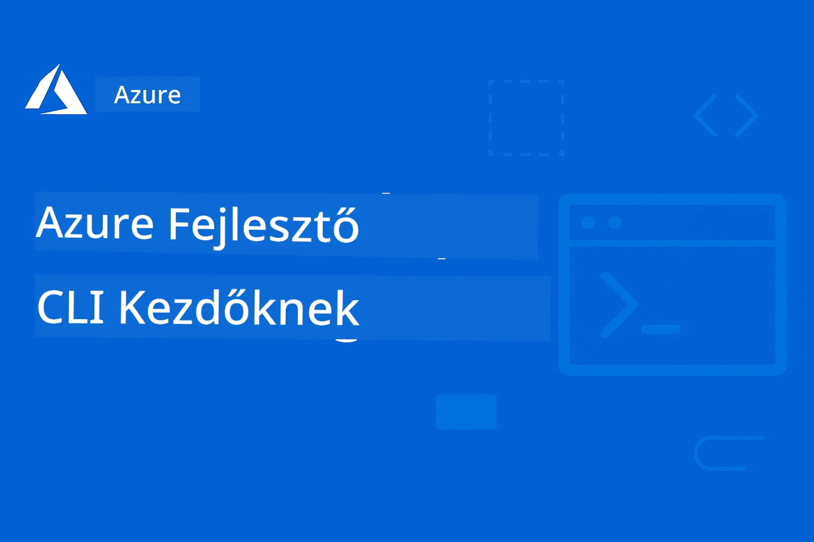

# AZD Kezdőknek: Egy Strukturált Tanulási Útmutató

 

[](https://GitHub.com/microsoft/azd-for-beginners/watchers/)
[](https://GitHub.com/microsoft/azd-for-beginners/network/)
[](https://GitHub.com/microsoft/azd-for-beginners/stargazers/)

[](https://discord.gg/microsoft-azure)
[](https://discord.gg/nTYy5BXMWG)

---

### Automatikus Fordítások (Mindig Naprakész)

<!-- CO-OP TRANSLATOR LANGUAGES TABLE START -->
[Arabic](../ar/README.md) | [Bengali](../bn/README.md) | [Bulgarian](../bg/README.md) | [Burmese (Myanmar)](../my/README.md) | [Chinese (Simplified)](../zh-CN/README.md) | [Chinese (Traditional, Hong Kong)](../zh-HK/README.md) | [Chinese (Traditional, Macau)](../zh-MO/README.md) | [Chinese (Traditional, Taiwan)](../zh-TW/README.md) | [Croatian](../hr/README.md) | [Czech](../cs/README.md) | [Danish](../da/README.md) | [Dutch](../nl/README.md) | [Estonian](../et/README.md) | [Finnish](../fi/README.md) | [French](../fr/README.md) | [German](../de/README.md) | [Greek](../el/README.md) | [Hebrew](../he/README.md) | [Hindi](../hi/README.md) | [Hungarian](./README.md) | [Indonesian](../id/README.md) | [Italian](../it/README.md) | [Japanese](../ja/README.md) | [Kannada](../kn/README.md) | [Korean](../ko/README.md) | [Lithuanian](../lt/README.md) | [Malay](../ms/README.md) | [Malayalam](../ml/README.md) | [Marathi](../mr/README.md) | [Nepali](../ne/README.md) | [Nigerian Pidgin](../pcm/README.md) | [Norwegian](../no/README.md) | [Persian (Farsi)](../fa/README.md) | [Polish](../pl/README.md) | [Portuguese (Brazil)](../pt-BR/README.md) | [Portuguese (Portugal)](../pt-PT/README.md) | [Punjabi (Gurmukhi)](../pa/README.md) | [Romanian](../ro/README.md) | [Russian](../ru/README.md) | [Serbian (Cyrillic)](../sr/README.md) | [Slovak](../sk/README.md) | [Slovenian](../sl/README.md) | [Spanish](../es/README.md) | [Swahili](../sw/README.md) | [Swedish](../sv/README.md) | [Tagalog (Filipino)](../tl/README.md) | [Tamil](../ta/README.md) | [Telugu](../te/README.md) | [Thai](../th/README.md) | [Turkish](../tr/README.md) | [Ukrainian](../uk/README.md) | [Urdu](../ur/README.md) | [Vietnamese](../vi/README.md)

> **Inkább helyben klónoznád?**
>
> Ez a tároló több mint 50 nyelvű fordítást tartalmaz, amely jelentősen megnöveli a letöltési méretet. A fordítások nélküli klónozáshoz használd a sparsz checkoutot:
>
> **Bash / macOS / Linux:**
> ```bash
> git clone --filter=blob:none --sparse https://github.com/microsoft/AZD-for-beginners.git
> cd AZD-for-beginners
> git sparse-checkout set --no-cone '/*' '!translations' '!translated_images'
> ```
>
> **CMD (Windows):**
> ```cmd
> git clone --filter=blob:none --sparse https://github.com/microsoft/AZD-for-beginners.git
> cd AZD-for-beginners
> git sparse-checkout set --no-cone "/*" "!translations" "!translated_images"
> ```
>
> Ez mindent megad a tanfolyam elvégzéséhez, sokkal gyorsabb letöltéssel.
<!-- CO-OP TRANSLATOR LANGUAGES TABLE END -->

## 🆕 Mi újság ma az azd-ben

Az Azure Developer CLI túlmutat a hagyományos webalkalmazások és API-k kezelésén. Ma az azd az egyetlen eszköz, amely bármilyen alkalmazás Azure-ba való telepítésére szolgál—beleértve az AI-vezérelt alkalmazásokat és intelligens ügynököket is.

Ez azt jelenti számodra:

- **Az AI ügynökök mostantól elsőrendű azd munkaterhelések.** Ugyanazzal az `azd init` → `azd up` munkafolyamattal inicializálhatod, telepítheted és kezelheted az AI ügynök projektjeidet, amelyet már ismersz.
- **Microsoft Foundry integráció** modelltelepítést, ügynök hosztolást és AI szolgáltatás konfigurációt hoz közvetlenül az azd sablon ökoszisztémába.
- **A fő munkafolyamat nem változott.** Akár egy todo alkalmazást, mikroservices-t vagy többügynökös AI megoldást telepítesz, a parancsok ugyanazok.

Ha már használtad az azd-t, az AI támogatás természetes kiterjesztése — nem külön eszköz vagy haladó szint. Ha kezded, egyetlen munkafolyamatot tanulsz, ami mindennel működik.

---

## 🚀 Mi az Azure Developer CLI (azd)?

**Az Azure Developer CLI (azd)** egy fejlesztőbarát parancssori eszköz, amely egyszerűvé teszi az alkalmazások Azure-ba való telepítését. Ahelyett, hogy több tucat Azure erőforrást manuálisan hoznál létre és kötnél össze, egyetlen paranccsal telepíthetsz teljes alkalmazásokat.

### Az `azd up` varázsa

```bash
# Ez az egyetlen parancs mindent elvégez:
# ✅ Létrehozza az összes Azure-erőforrást
# ✅ Beállítja a hálózatot és a biztonságot
# ✅ Összeállítja az alkalmazáskódot
# ✅ Azure-ra telepíti
# ✅ Egy működő URL-t ad
azd up
```

**Ennyi az egész!** Nincs Azure Portal kattintgatás, nincs bonyolult ARM sablon megtanulása, nincs manuális konfiguráció – csak működő alkalmazások Azure-on.

---

## ❓ Azure Developer CLI vs Azure CLI: Mi a különbség?

Ez a leggyakoribb kérdés, amit kezdők feltesznek. Íme a rövid válasz:

| Feature | **Azure CLI (`az`)** | **Azure Developer CLI (`azd`)** |
|---------|---------------------|--------------------------------|
| **Cél** | Egyéni Azure erőforrások kezelése | Teljes alkalmazások telepítése |
| **Mentalitás** | Infrastruktúra-központú | Alkalmazás-központú |
| **Példa** | `az webapp create --name myapp...` | `azd up` |
| **Tanulási görbe** | Azure szolgáltatásokat kell ismerni | Csak az alkalmazásodat kell ismerni |
| **Legjobb hozzá** | DevOps, infrastruktúra | Fejlesztők, prototípus készítés |

### Egyszerű hasonlat

- **Azure CLI** olyan, mintha minden eszközöd meglenne ház építéshez – kalapácsok, fűrészek, szegek. Bármit megépíthetsz, de tudnod kell az építkezést.
- **Azure Developer CLI** olyan, mintha fővállalkozót bérelnél – elmondod, mit akarsz, ők intézik az építést.

### Mikor melyiket használd

| Szituáció | Használd ezt |
|----------|--------------|
| "Gyorsan szeretném telepíteni a webalkalmazásom" | `azd up` |
| "Csak egy tárolófiókot akarok létrehozni" | `az storage account create` |
| "Teljes AI alkalmazást építek" | `azd init --template azure-search-openai-demo` |
| "Egy adott Azure erőforrást akarok hibakeresni" | `az resource show` |
| "Néhány percen belül éles telepítést szeretnék" | `azd up --environment production` |

### Együtt dolgoznak!

Az AZD az Azure CLI-t használja a háttérben. Mindkettőt használhatod:
```bash
# Telepítse az alkalmazását az AZD-vel
azd up

# Ezután finomhangolja a konkrét erőforrásokat az Azure CLI segítségével
az webapp config set --name myapp --always-on true
```

---

## 🌟 Találj sablonokat az Awesome AZD-ben

Ne kezdj neki nulláról! Az **Awesome AZD** a közösségi gyűjtemény azonnal telepíthető sablonokból:

| Erőforrás | Leírás |
|----------|---------|
| 🔗 [**Awesome AZD Galéria**](https://azure.github.io/awesome-azd/) | Több mint 200 sablon egykattintásos telepítéssel |
| 🔗 [**Adj be saját sablont**](https://github.com/Azure/awesome-azd/issues) | Építsd be saját sablonodat a közösségbe |
| 🔗 [**GitHub tárház**](https://github.com/Azure/awesome-azd) | Csillagozd és fedezd fel a forrást |

### Népszerű AI sablonok az Awesome AZD-ből

```bash
# RAG-csevegés Microsoft Foundry modellekkel + MI-keresés
azd init --template azure-search-openai-demo

# Gyors MI-csevegőalkalmazás
azd init --template openai-chat-app-quickstart

# MI-ügynökök Foundry-ügynökökkel
azd init --template get-started-with-ai-agents
```

---

## 🎯 Kezdj 3 lépésben

### 1. lépés: Telepítsd az AZD-t (2 perc)

**Windows:**
```powershell
winget install microsoft.azd
```

**macOS:**
```bash
brew tap azure/azd && brew install azd
```

**Linux:**
```bash
curl -fsSL https://aka.ms/install-azd.sh | bash
```

### 2. lépés: Jelentkezz be az Azure-ba

```bash
azd auth login
```

### 3. lépés: Telepítsd első alkalmazásodat

```bash
# Inicializálás sablonból
azd init --template todo-nodejs-mongo

# Telepítés Azure-ba (mindent létrehoz!)
azd up
```

**🎉 Kész is vagy!** Az alkalmazásod most élő az Azure-on.

### Takartíts ki (Ne feledd!)

```bash
# Remove all resources when done experimenting
azd down --force --purge
```

---

## 📚 Hogyan használd ezt a tanfolyamot

Ez a tanfolyam **progresszív tanulásra** lett tervezve – kezd ott, ahol kényelmes számodra, és fokozatosan haladj feljebb:

| Tapasztalatod | Innen kezdj |
|---------------|-------------|
| **Teljesen új vagy az Azure-ban** | [1. fejezet: Alapok](#-chapter-1-foundation--quick-start) |
| **Ismered az Azure-t, de új vagy az AZD-ben** | [1. fejezet: Alapok](#-chapter-1-foundation--quick-start) |
| **AI alkalmazásokat akarsz telepíteni** | [2. fejezet: AI első fejlesztés](#-chapter-2-ai-first-development-recommended-for-ai-developers) |
| **Gyakorlati kézbevétel kell** | [🎓 Interaktív workshop](workshop/README.md) – 3-4 órás vezetett labor |
| **Éles mintákat szeretnél** | [8. fejezet: Éles, vállalati minták](#-chapter-8-production--enterprise-patterns) |

### Gyors beállítás

1. **Forkold ezt a tárolót:** [](https://GitHub.com/microsoft/azd-for-beginners/fork)  
2. **Klónozd:** `git clone https://github.com/YOUR-USERNAME/azd-for-beginners.git`  
3. **Kérj segítséget:** [Azure Discord közösség](https://discord.com/invite/ByRwuEEgH4)

> **Inkább helyben klónoznád?**

> Ez a tároló több mint 50 nyelvű fordítást tartalmaz, amely jelentősen megnöveli a letöltési méretet. A fordítások nélküli klónozáshoz használd a sparsz checkoutot:
> ```bash
> git clone --filter=blob:none --sparse https://github.com/microsoft/AZD-for-beginners.git
> cd AZD-for-beginners
> git sparse-checkout set --no-cone '/*' '!translations' '!translated_images'
> ```
> Ez mindent megad a tanfolyam elvégzéséhez, sokkal gyorsabb letöltéssel.


## Tanfolyam áttekintés

Az Azure Developer CLI (azd) mesteri elsajátítása strukturált fejezeteken keresztül, amelyek progresszív tanulást kínálnak. **Különös hangsúly az AI alkalmazások telepítésén Microsoft Foundry integrációval.**

### Miért fontos ez a tanfolyam a modern fejlesztőknek

A Microsoft Foundry Discord közösség visszajelzései alapján, **a fejlesztők 45%-a használna AZD-t AI munkaterhelésekhez**, de nehézségekbe ütköznek:
- Komplex többszolgáltatásos AI architektúrák
- Éles AI telepítési bevált gyakorlatok  
- Azure AI szolgáltatás integráció és konfiguráció
- AI munkaterhelések költségoptimalizálása
- AI-specifikus telepítési hibák elhárítása

### Tanulási célok

A struktúrált tanfolyam elvégzése után:
- **Mesteri AZD alapok:** Alapfogalmak, telepítés és konfiguráció
- **AI alkalmazások telepítése:** AZD használata Microsoft Foundry szolgáltatásokkal
- **Infrastruktúra-kód formában:** Azure erőforrások kezelése Bicep sablonokkal
- **Hibakeresés és problémaelhárítás:** Gyakori hibák megoldása
- **Optimalizáció éles környezetre:** Biztonság, skálázás, monitoring és költségkezelés
- **Többügynökös megoldások építése:** Komplex AI architektúrák telepítése

## 🗺️ Tanfolyam térkép: Gyors navigáció fejezet szerint

Minden fejezethez tartozik egy README tanulási célokkal, gyors kezdéssel és gyakorlatokkal:

| Fejezet | Téma | Leckék | Időtartam | Nehézség |
|---------|-------|---------|----------|----------|
| **[1. fejezet: Alapok](docs/chapter-01-foundation/README.md)** | Kezdő lépések | [AZD alapok](docs/chapter-01-foundation/azd-basics.md) &#124; [Telepítés](docs/chapter-01-foundation/installation.md) &#124; [Első projekt](docs/chapter-01-foundation/first-project.md) | 30-45 perc | ⭐ |
| **[2. fejezet: Mesterséges intelligencia fejlesztése](docs/chapter-02-ai-development/README.md)** | Mesterséges intelligencia-központú alkalmazások | [Foundry integráció](docs/chapter-02-ai-development/microsoft-foundry-integration.md) &#124; [MI ügynökök](docs/chapter-02-ai-development/agents.md) &#124; [Modellek üzembe helyezése](docs/chapter-02-ai-development/ai-model-deployment.md) &#124; [Műhely](docs/chapter-02-ai-development/ai-workshop-lab.md) | 1-2 óra | ⭐⭐ |
| **[3. fejezet: Konfiguráció](docs/chapter-03-configuration/README.md)** | Hitelesítés és biztonság | [Konfiguráció](docs/chapter-03-configuration/configuration.md) &#124; [Hitelesítés és biztonság](docs/chapter-03-configuration/authsecurity.md) | 45-60 perc | ⭐⭐ |
| **[4. fejezet: Infrastruktúra](docs/chapter-04-infrastructure/README.md)** | IaC és üzembe helyezés | [Üzembe helyezési útmutató](docs/chapter-04-infrastructure/deployment-guide.md) &#124; [Erőforrás létrehozása](docs/chapter-04-infrastructure/provisioning.md) | 1-1,5 óra | ⭐⭐⭐ |
| **[5. fejezet: Többügynökös megoldás](docs/chapter-05-multi-agent/README.md)** | MI ügynök megoldások | [Kiskereskedelmi forgatókönyv](examples/retail-scenario.md) &#124; [Koordinációs minták](docs/chapter-06-pre-deployment/coordination-patterns.md) | 2-3 óra | ⭐⭐⭐⭐ |
| **[6. fejezet: Előzetes üzembe helyezés](docs/chapter-06-pre-deployment/README.md)** | Tervezés és validálás | [Előzetes ellenőrzések](docs/chapter-06-pre-deployment/preflight-checks.md) &#124; [Kapacitástervezés](docs/chapter-06-pre-deployment/capacity-planning.md) &#124; [SKU kiválasztás](docs/chapter-06-pre-deployment/sku-selection.md) &#124; [Alkalmazásfigyelés](docs/chapter-06-pre-deployment/application-insights.md) | 1 óra | ⭐⭐ |
| **[7. fejezet: Hibakeresés](docs/chapter-07-troubleshooting/README.md)** | Hibakeresés és javítás | [Gyakori problémák](docs/chapter-07-troubleshooting/common-issues.md) &#124; [Hibakeresés](docs/chapter-07-troubleshooting/debugging.md) &#124; [MI problémák](docs/chapter-07-troubleshooting/ai-troubleshooting.md) | 1-1,5 óra | ⭐⭐ |
| **[8. fejezet: Éles környezet](docs/chapter-08-production/README.md)** | Vállalati minták | [Éles üzemmódbeli gyakorlatok](docs/chapter-08-production/production-ai-practices.md) | 2-3 óra | ⭐⭐⭐⭐ |
| **[🎓 Műhely](workshop/README.md)** | Gyakorlati labor | [Bevezetés](workshop/docs/instructions/0-Introduction.md) &#124; [Kiválasztás](workshop/docs/instructions/1-Select-AI-Template.md) &#124; [Validálás](workshop/docs/instructions/2-Validate-AI-Template.md) &#124; [Dekonstrukció](workshop/docs/instructions/3-Deconstruct-AI-Template.md) &#124; [Konfiguráció](workshop/docs/instructions/4-Configure-AI-Template.md) &#124; [Testreszabás](workshop/docs/instructions/5-Customize-AI-Template.md) &#124; [Leszerelés](workshop/docs/instructions/6-Teardown-Infrastructure.md) &#124; [Összefoglaló](workshop/docs/instructions/7-Wrap-up.md) | 3-4 óra | ⭐⭐ |

**Teljes tanfolyam időtartama:** ~10-14 óra | **Készségfejlődés:** Kezdő → Éles környezetre kész

---

## 📚 Tanulási fejezetek

*Válassza ki tanulási útvonalát a tapasztalati szint és célok alapján*

### 🚀 1. fejezet: Alapok és gyors kezdés
**Előfeltételek**: Azure előfizetés, alapvető parancssori ismeretek  
**Időtartam**: 30-45 perc  
**Bonyolultság**: ⭐

#### Amit megtanul
- Az Azure Developer CLI alapjainak megértése
- AZD telepítése az ön platformjára
- Az első sikeres üzembe helyezés

#### Tanulási források
- **🎯 Induljon innen**: [Mi az Azure Developer CLI?](#what-is-azure-developer-cli)
- **📖 Elmélet**: [AZD alapok](docs/chapter-01-foundation/azd-basics.md) - Alapfogalmak és terminológia
- **⚙️ Beállítás**: [Telepítés és konfiguráció](docs/chapter-01-foundation/installation.md) - Platform specifikus útmutatók
- **🛠️ Gyakorlat**: [Az első projekt](docs/chapter-01-foundation/first-project.md) - Lépésről lépésre útmutató
- **📋 Gyors referencia**: [Parancscsaló](resources/cheat-sheet.md)

#### Gyakorlati feladatok
```bash
# Gyors telepítés ellenőrzése
azd version

# Helyezze üzembe az első alkalmazását
azd init --template todo-nodejs-mongo
azd up
```

**💡 Fejezet eredménye**: Egy egyszerű webalkalmazás sikeres telepítése Azure-ra AZD segítségével

**✅ Sikeres végrehajtás ellenőrzése:**
```bash
# Az 1. fejezet befejezése után képesnek kell lennie arra, hogy:
azd version              # Telepített verzió megjelenítése
azd init --template todo-nodejs-mongo  # Projekt inicializálása
azd up                  # Telepítés Azure-ra
azd show                # Futó alkalmazás URL-jének megjelenítése
# Az alkalmazás megnyílik a böngészőben és működik
azd down --force --purge  # Erőforrások tisztítása
```

**📊 Ráfordított idő:** 30-45 perc  
**📈 Készségszint utána:** Alapvető alkalmazások önálló telepítése  
**📈 Készségszint utána:** Alapvető alkalmazások önálló telepítése  

---

### 🤖 2. fejezet: MI-központú fejlesztés (ajánlott MI fejlesztőknek)
**Előfeltételek**: 1. fejezet elvégzése  
**Időtartam**: 1-2 óra  
**Bonyolultság**: ⭐⭐

#### Amit megtanul
- Microsoft Foundry integráció AZD-vel
- MI-alapú alkalmazások üzembe helyezése
- MI szolgáltatások konfigurációjának megértése

#### Tanulási források
- **🎯 Induljon innen**: [Microsoft Foundry integráció](docs/chapter-02-ai-development/microsoft-foundry-integration.md)
- **🤖 MI ügynökök**: [MI ügynökök útmutatója](docs/chapter-02-ai-development/agents.md) - Intelligens ügynökök telepítése AZD-vel
- **📖 Minták**: [MI modell üzembe helyezése](docs/chapter-02-ai-development/ai-model-deployment.md) - MI modellek telepítése és kezelése
- **🛠️ Műhely**: [MI műhely labor](docs/chapter-02-ai-development/ai-workshop-lab.md) - Készen álló MI megoldások AZD-hez
- **🎥 Interaktív útmutató**: [Műhely anyagok](workshop/README.md) - Böngésző alapú tanulás MkDocs * DevContainer környezetben
- **📋 Sablonok**: [Microsoft Foundry sablonok](#műhely-források)
- **📝 Példák**: [AZD telepítési példák](examples/README.md)

#### Gyakorlati feladatok
```bash
# Telepítse első MI alkalmazását
azd init --template azure-search-openai-demo
azd up

# Próbáljon ki további MI sablonokat
azd init --template openai-chat-app-quickstart
azd init --template agent-openai-python-prompty
```

**💡 Fejezet eredménye**: Egy RAG képességekkel rendelkező MI-alapú chatbot alkalmazás telepítése és konfigurálása

**✅ Sikeres végrehajtás ellenőrzése:**
```bash
# A 2. fejezet után képesnek kell lenned:
azd init --template azure-search-openai-demo
azd up
# Tesztelni az AI chat felületet
# Kérdéseket feltenni és AI által támogatott válaszokat kapni forrásokkal
# Ellenőrizni, hogy a keresés integráció működik
azd monitor  # Ellenőrizni, hogy az Application Insights megjeleníti a telemetriát
azd down --force --purge
```

**📊 Ráfordított idő:** 1-2 óra  
**📈 Készségszint utána:** Éles környezetre kész MI alkalmazások telepítése és konfigurálása  
**💰 Költségtudatosság:** Havonta 80-150 USD fejlesztési költség, 300-3500 USD éles költség megértése

#### 💰 Költségszempontok az MI üzembe helyezéséhez

**Fejlesztői környezet (becsült 80-150 USD/hónap):**
- Microsoft Foundry modellek (fizetős használat szerint): 0-50 USD/hó (token felhasználástól függően)
- MI keresés (Basic szint): 75 USD/hó
- Container Apps (fogyasztás alapú): 0-20 USD/hó
- Tárolás (Standard): 1-5 USD/hó

**Éles környezet (becsült 300-3500+ USD/hó):**
- Microsoft Foundry modellek (PTU a stabil teljesítményért): 3000 USD+/hó VAGY fizetés használat szerint nagy mennyiség esetén
- MI keresés (Standard szint): 250 USD/hó
- Container Apps (dedikált): 50-100 USD/hó
- Application Insights: 5-50 USD/hó
- Tárolás (Prémium): 10-50 USD/hó

**💡 Költségoptimalizálási tippek:**
- Használja a **Free Tier** Microsoft Foundry modelleket tanuláshoz (Azure OpenAI havi 50 000 token benne foglaltatik)
- Futtassa az `azd down` parancsot, hogy felszabadítsa az erőforrásokat, amikor nem fejleszt aktívan
- Kezdje fogyasztás alapú számlázással, PTU-t kapcsoljon csak éles környezethez
- Használja az `azd provision --preview` parancsot a költségbecsléshez üzembe helyezés előtt
- Engedélyezze az automatikus méretezést: csak a tényleges használatért fizet

**Költségfigyelés:**
```bash
# Becslés havi költségek ellenőrzése
azd provision --preview

# Valós költségek figyelése az Azure Portalban
az consumption budget list --resource-group <your-rg>
```

---

### ⚙️ 3. fejezet: Konfiguráció és hitelesítés
**Előfeltételek**: 1. fejezet elvégzése  
**Időtartam**: 45-60 perc  
**Bonyolultság**: ⭐⭐

#### Amit megtanul
- Környezet konfiguráció és kezelése
- Hitelesítés és biztonsági legjobb gyakorlatok
- Erőforrásnév és szervezés

#### Tanulási források
- **📖 Konfiguráció**: [Konfigurációs útmutató](docs/chapter-03-configuration/configuration.md) - Környezet beállítása
- **🔐 Biztonság**: [Hitelesítési minták és kezelt identitás](docs/chapter-03-configuration/authsecurity.md) - Hitelesítési minták
- **📝 Példák**: [Adatbázis alkalmazás példa](examples/database-app/README.md) - AZD adatbázis példák

#### Gyakorlati feladatok
- Több környezet konfigurálása (fejlesztés, staging, éles)
- Kezelt identitás hitelesítés beállítása
- Környezet specifikus konfigurációk implementálása

**💡 Fejezet eredménye**: Több környezet kezelése megfelelő hitelesítéssel és biztonsággal

---

### 🏗️ 4. fejezet: Infrastruktúra mint kód és üzembe helyezés
**Előfeltételek**: 1-3. fejezet elvégzése  
**Időtartam**: 1-1,5 óra  
**Bonyolultság**: ⭐⭐⭐

#### Amit megtanul
- Fejlett telepítési minták
- Infrastruktúra mint kód Bicep használatával
- Erőforrás-provisionálási stratégiák

#### Tanulási források
- **📖 Üzembe helyezés**: [Üzembe helyezési útmutató](docs/chapter-04-infrastructure/deployment-guide.md) - Teljes munkafolyamatok
- **🏗️ Erőforrás létrehozás**: [Erőforrás-provisionálás](docs/chapter-04-infrastructure/provisioning.md) - Azure erőforrás kezelés
- **📝 Példák**: [Container App példa](../../examples/container-app) - Konténerizált telepítések

#### Gyakorlati feladatok
- Egyedi Bicep sablonok létrehozása
- Több szolgáltatást tartalmazó alkalmazások telepítése
- Kék-zöld üzembe helyezési stratégiák alkalmazása

**💡 Fejezet eredménye**: Összetett több szolgáltatásból álló alkalmazások telepítése egyedi infrastruktúra sablonokkal

---

### 🎯 5. fejezet: Többügynökös MI megoldások (haladó)
**Előfeltételek**: 1-2. fejezet elvégzése  
**Időtartam**: 2-3 óra  
**Bonyolultság**: ⭐⭐⭐⭐

#### Amit megtanul
- Többügynökös architektúra minták
- Ügynökökkel történő koordináció és összehangolás
- Éles környezetre kész MI telepítések

#### Tanulási források
- **🤖 Kiemelt projekt**: [Kiskereskedelmi többügynökös megoldás](examples/retail-scenario.md) - Teljes megvalósítás
- **🛠️ ARM sablonok**: [ARM sablon csomag](../../examples/retail-multiagent-arm-template) - Egy-kattintásos telepítés
- **📖 Architektúra**: [Többügynökös koordinációs minták](docs/chapter-06-pre-deployment/coordination-patterns.md) - Minták

#### Gyakorlati feladatok
```bash
# Telepítse a teljes kiskereskedelmi többügynökös megoldást
cd examples/retail-multiagent-arm-template
./deploy.sh

# Fedezze fel az ügynök konfigurációkat
az deployment group show --resource-group <rg-name> --name <deployment-name>
```

**💡 Fejezet eredménye**: Egy éles környezetre kész többügynökös MI megoldás telepítése és kezelése Ügyfél- és Készletügynökökkel

---

### 🔍 6. fejezet: Előzetes üzembe helyezés validálás és tervezés
**Előfeltételek**: 4. fejezet elvégzése  
**Időtartam**: 1 óra  
**Bonyolultság**: ⭐⭐

#### Amit megtanul
- Kapacitástervezés és erőforrás-ellenőrzés
- SKU kiválasztási stratégiák
- Előzetes ellenőrzések és automatizálás

#### Tanulási források
- **📊 Tervezés**: [Kapacitástervezés](docs/chapter-06-pre-deployment/capacity-planning.md) - Erőforrás ellenőrzés
- **💰 Kiválasztás**: [SKU választás](docs/chapter-06-pre-deployment/sku-selection.md) - Költséghatékony döntések
- **✅ Validáció**: [Előzetes ellenőrzések](docs/chapter-06-pre-deployment/preflight-checks.md) - Automatizált szkriptek

#### Gyakorlati feladatok
- Kapacitás ellenőrző szkriptek futtatása
- SKU választások optimalizálása költség szempontjából
- Automatikus előtelepítési ellenőrzések implementálása

**💡 Fejezet eredménye**: Telepítések validálása és optimalizálása végrehajtás előtt

---

### 🚨 7. fejezet: Hibakeresés és debug
**Előfeltételek**: Bármely telepítési fejezet elvégzése  
**Időtartam**: 1-1,5 óra  
**Bonyolultság**: ⭐⭐

#### Amit megtanul
- Rendszeres hibakeresési módszerek
- Gyakori problémák és megoldások
- MI-specifikus hibakeresés

#### Tanulási források
- **🔧 Gyakori problémák**: [Gyakori problémák](docs/chapter-07-troubleshooting/common-issues.md) - GYIK és megoldások
- **🕵️ Hibakeresés**: [Hibakeresési útmutató](docs/chapter-07-troubleshooting/debugging.md) - Lépésről lépésre stratégiák
- **🤖 MI problémák**: [MI-specifikus hibakeresés](docs/chapter-07-troubleshooting/ai-troubleshooting.md) - MI szolgáltatási problémák

#### Gyakorlati feladatok
- Telepítési hibák diagnosztizálása
- Hitelesítési problémák megoldása
- MI szolgáltatás kapcsolat hibáinak javítása

**💡 Fejezet eredménye**: Képes önállóan diagnosztizálni és megoldani gyakori telepítési problémákat

---

### 🏢 8. fejezet: Éles környezet és vállalati minták
**Előfeltételek**: 1-4. fejezet elvégzése  
**Időtartam**: 2-3 óra  
**Bonyolultság**: ⭐⭐⭐⭐

#### Amit megtanul
- Éles üzembe helyezési stratégiák
- Vállalati biztonsági minták
- Megfigyelés és költségoptimalizálás

#### Tanulási források
- **🏭 Éles üzem**: [Termelési AI legjobb gyakorlatok](docs/chapter-08-production/production-ai-practices.md) - Vállalati minták  
- **📝 Példák**: [Mikroszolgáltatások példája](../../examples/microservices) - Komplex architektúrák  
- **📊 Felügyelet**: [Application Insights integráció](docs/chapter-06-pre-deployment/application-insights.md) - Felügyelet  

#### Gyakorlati feladatok  
- Vállalati biztonsági minták megvalósítása  
- Átfogó felügyelet beállítása  
- Éles üzembe helyezés megfelelő irányítással  

**💡 Fejezet eredménye**: Vállalatra készült alkalmazások telepítése teljes éles üzem képességekkel  

---

## 🎓 Műhely áttekintés: Gyakorlati tanulási élmény

> **⚠️ MŰHELY ÁLLAPOTA: Aktív fejlesztés**  
> A műhely anyagai jelenleg fejlesztés alatt állnak. Az alap modulok működőképesek, de néhány haladó szakasz még nem teljes. Aktívan dolgozunk a teljes tartalom elkészítésén. [Nyomon követés →](workshop/README.md)  

### Interaktív műhely anyagok  
**Átfogó gyakorlati tanulás böngésző alapú eszközökkel és irányított gyakorlatokkal**  

Műhelyünk strukturált, interaktív tanulási élményt nyújt, amely kiegészíti a fent említett fejezet-alapú tananyagot. A műhely mind önálló tempójú, mind oktató által vezetett tanuláshoz alkalmas.  

#### 🛠️ Műhely jellemzői  
- **Böngésző Alapú Felület**: Teljes MkDocs-alapú műhely kereséssel, másolási és témabeállításokkal  
- **GitHub Codespaces Integráció**: Egykattintásos fejlesztőkörnyezet-beállítás  
- **Strukturált tanulási útvonal**: 8 modulból álló irányított gyakorlatok (összesen 3-4 óra)  
- **Fokozatos módszertan**: Bevezetés → Kiválasztás → Érvényesítés → Szétszedés → Konfiguráció → Testreszabás → Leállítás → Összegzés  
- **Interaktív DevContainer környezet**: Előre konfigurált eszközök és függőségek  

#### 📚 Műhely modul struktúra  
A műhely egy **8 modulból álló fokozatos módszertant** követ, amely felfedezéstől a telepítési jártasságig vezet:  

| Modul | Téma | Mit csinálsz | Időtartam |  
|--------|-------|----------------|----------|  
| **0. Bevezetés** | Műhely áttekintés | Megérted a tanulási célokat, előfeltételeket és a műhely felépítését | 15 perc |  
| **1. Kiválasztás** | Minták felfedezése | Megismered az AZD sablonokat, és kiválasztod az AI sablont az esetedhez | 20 perc |  
| **2. Érvényesítés** | Telepítés és ellenőrzés | `azd up` használatával telepíted a sablont, és ellenőrzöd az infrastruktúra működését | 30 perc |  
| **3. Szétszedés** | Felépítés megértése | GitHub Copilot segítségével felfedezed a sablon architektúrát, Bicep fájlokat és a kód szerkezetét | 30 perc |  
| **4. Konfiguráció** | azure.yaml részletek | Elsajátítod az `azure.yaml` konfigurációt, életciklus horgonyokat és környezeti változókat | 30 perc |  
| **5. Testreszabás** | Saját esetedre szabás | Engedélyezed az AI keresést, nyomon követést, értékelést és testre szabod az igényeid szerint | 45 perc |  
| **6. Leállítás** | Takarítás | Biztonságosan leállítod az erőforrásokat `azd down --purge` paranccsal | 15 perc |  
| **7. Összegzés** | Következő lépések | Áttekinted a teljesítményeket, kulcsfogalmakat, és folytatod a tanulást | 15 perc |  

**Műhely menet**:  
```
Introduction → Selection → Validation → Deconstruction → Configuration → Customization → Teardown → Wrap-up
     ↓            ↓           ↓              ↓               ↓              ↓            ↓           ↓
  Overview    Find the     Deploy &      Explore        Master         Customize     Clean up    Review &
             right        verify        code &        azure.yaml      for your      resources   next steps
             template                   structure                     scenario
```
  
#### 🚀 Műhely kezdés  
```bash
# 1. lehetőség: GitHub Codespaces (Ajánlott)
# Kattints a "Code" → "Create codespace on main" lehetőségre a tárolóban

# 2. lehetőség: Helyi fejlesztés
git clone https://github.com/microsoft/azd-for-beginners.git
cd azd-for-beginners/workshop
# Kövesd a workshop/README.md-ben található beállítási utasításokat
```
  
#### 🎯 Műhely tanulási eredmények  
A műhely elvégzésével a résztvevők:  
- **Éles AI alkalmazásokat telepítenek**: AZD használatával Microsoft Foundry szolgáltatásokkal  
- **Több-ügynökös architektúrák mesterei lesznek**: Koordinált AI ügynök megoldásokat valósítanak meg  
- **Biztonsági legjobb gyakorlatokat alkalmaznak**: Hitelesítést és hozzáférés-vezérlést konfigurálnak  
- **Skálázásra optimalizálnak**: Költséghatékony, jó teljesítményű telepítéseket terveznek  
- **Telepítési hibákat elhárítanak**: Gyakori problémákat önállóan oldanak meg  

#### 📖 Műhely források  
- **🎥 Interaktív Útmutató**: [Műhely anyagok](workshop/README.md) - Böngésző alapú tanuló környezet  
- **📋 Modul szerinti utasítások**:  
  - [0. Bevezetés](workshop/docs/instructions/0-Introduction.md) - Műhely áttekintés és célok  
  - [1. Kiválasztás](workshop/docs/instructions/1-Select-AI-Template.md) - AI sablonok keresése és kiválasztása  
  - [2. Érvényesítés](workshop/docs/instructions/2-Validate-AI-Template.md) - Sablon telepítése és ellenőrzése  
  - [3. Szétszedés](workshop/docs/instructions/3-Deconstruct-AI-Template.md) - Sablon architektúra felfedezése  
  - [4. Konfiguráció](workshop/docs/instructions/4-Configure-AI-Template.md) - azure.yaml elsajátítása  
  - [5. Testreszabás](workshop/docs/instructions/5-Customize-AI-Template.md) - Saját esetre szabás  
  - [6. Leállítás](workshop/docs/instructions/6-Teardown-Infrastructure.md) - Erőforrások tisztítása  
  - [7. Összegzés](workshop/docs/instructions/7-Wrap-up.md) - Áttekintés és további lépések  
- **🛠️ AI Műhely Labor**: [AI Workshop Lab](docs/chapter-02-ai-development/ai-workshop-lab.md) - AI fókuszú gyakorlatok  
- **💡 Gyors kezdés**: [Műhely beállítás útmutató](workshop/README.md#quick-start) - Környezet konfiguráció  

**Ideális**: Vállalati képzésekhez, egyetemi kurzusokhoz, önálló tanuláshoz és fejlesztői bootcamp-ekhez.  

---

## 📖 Mélyebb betekintés: AZD képességek  

Az alapokon túl az AZD erőteljes funkciókat kínál éles üzemű telepítésekhez:  

- **Sablon alapú telepítés** – Előre elkészített sablonok gyakori alkalmazásmintákhoz  
- **Infrastruktúra kódként** – Azure erőforrások kezelése Bicep vagy Terraform segítségével  
- **Integrált munkafolyamatok** – Zökkenőmentes alkalmazás előkészítés, telepítés és felügyelet  
- **Fejlesztőbarát** – Optimalizált fejlesztői hatékonyságra és élményre  

### **AZD + Microsoft Foundry: AI telepítésekhez tökéletes**  

**Miért AZD AI megoldásokhoz?** AZD választ ad az AI fejlesztők legfontosabb kihívásaira:  

- **AI-kész sablonok** – Előre beállított Microsoft Foundry modellekhez, kognitív szolgáltatásokhoz és gépi tanulási terhelésekhez  
- **Biztonságos AI telepítések** – Beépített biztonsági minták AI szolgáltatásokhoz, API kulcsokhoz és modell végpontokhoz  
- **Termelési AI minták** – Legjobb gyakorlatok skálázható, költséghatékony AI alkalmazástelepítéshez  
- **Végponttól végpontig AI munkafolyamatok** – Modell fejlesztéstől az éles telepítésig, helyes felügyelettel  
- **Költségoptimalizálás** – Okos erőforrás-elosztás és skálázási stratégiák AI terhelésekhez  
- **Microsoft Foundry integráció** – Zökkenőmentes kapcsolat a Microsoft Foundry modell katalógushoz és végpontokhoz  

---

## 🎯 Sablonok és példatár  

### Kiemelt: Microsoft Foundry Sablonok  
**Innen indulj, ha AI alkalmazásokat telepítesz!**  

> **Megjegyzés:** Ezek a sablonok különféle AI mintákat mutatnak be. Néhány külső Azure mintákból származik, mások helyi megvalósítások.  

| Sablon | Fejezet | Bonyolultság | Szolgáltatások | Típus |  
|----------|---------|------------|----------|------|  
| [**Kezdés AI chat-tel**](https://github.com/Azure-Samples/get-started-with-ai-chat) | 2. fejezet | ⭐⭐ | AzureOpenAI + Azure AI Model Inference API + Azure AI Search + Azure Container Apps + Application Insights | Külső |  
| [**Kezdés AI ügynökökkel**](https://github.com/Azure-Samples/get-started-with-ai-agents) | 2. fejezet | ⭐⭐ | Foundry Agents + AzureOpenAI + Azure AI Search + Azure Container Apps + Application Insights| Külső |  
| [**Azure Search + OpenAI demo**](https://github.com/Azure-Samples/azure-search-openai-demo) | 2. fejezet | ⭐⭐ | AzureOpenAI + Azure AI Search + App Service + Storage | Külső |  
| [**OpenAI Chat App Gyorsindító**](https://github.com/Azure-Samples/openai-chat-app-quickstart) | 2. fejezet | ⭐ | AzureOpenAI + Container Apps + Application Insights | Külső |  
| [**Agent OpenAI Python Prompty**](https://github.com/Azure-Samples/agent-openai-python-prompty) | 5. fejezet | ⭐⭐⭐ | AzureOpenAI + Azure Functions + Prompty | Külső |  
| [**Contoso Chat RAG**](https://github.com/Azure-Samples/contoso-chat) | 8. fejezet | ⭐⭐⭐⭐ | AzureOpenAI + AI Search + Cosmos DB + Container Apps | Külső |  
| [**Kiskereskedelmi Többügynökös Megoldás**](examples/retail-scenario.md) | 5. fejezet | ⭐⭐⭐⭐ | AzureOpenAI + AI Search + Storage + Container Apps + Cosmos DB | **Helyi** |  

### Kiemelt: Teljes tanulási forgatókönyvek  
**Éles üzemre kész alkalmazás sablonok tanulási fejezetekhez igazítva**  

| Sablon | Tanulási fejezet | Bonyolultság | Fő tanulási pont |  
|----------|------------------|------------|--------------|  
| [**openai-chat-app-quickstart**](https://github.com/Azure-Samples/openai-chat-app-quickstart) | 2. fejezet | ⭐ | Alapvető AI telepítési minták |  
| [**azure-search-openai-demo**](https://github.com/Azure-Samples/azure-search-openai-demo) | 2. fejezet | ⭐⭐ | RAG megvalósítás Azure AI Search segítségével |  
| [**ai-document-processing**](https://github.com/Azure-Samples/ai-document-processing) | 4. fejezet | ⭐⭐ | Dokumentum intelligencia integráció |  
| [**agent-openai-python-prompty**](https://github.com/Azure-Samples/agent-openai-python-prompty) | 5. fejezet | ⭐⭐⭐ | Ügynök keretrendszer és függvényhívás |  
| [**contoso-chat**](https://github.com/Azure-Samples/contoso-chat) | 8. fejezet | ⭐⭐⭐ | Vállalati AI irányítás |  
| [**retail-multi-agent-solution**](examples/retail-scenario.md) | 5. fejezet | ⭐⭐⭐⭐ | Több-ügynökös architektúra Ügyfél és Készlet ügynökökkel |  

### Tanulás példa típus szerint  

> **📌 Helyi vs. Külső példák:**  
> **Helyi példák** (ebben a repóban) = Azonnal használatra kész  
> **Külső példák** (Azure minták) = A kapcsolódó repókból klónozandóak  

#### Helyi példák (Használatra kész)  
- [**Kiskereskedelmi Több-ügynökös Megoldás**](examples/retail-scenario.md) - Teljes, éles üzemre kész megvalósítás ARM sablonokkal  
  - Több-ügynökös architektúra (Ügyfél + Készlet ügynökök)  
  - Átfogó monitorozás és értékelés  
  - Egykattintásos telepítés ARM sablonon keresztül  

#### Helyi példák - Konténer alkalmazások (2-5. fejezet)  
**Átfogó konténer telepítési példák a repóban:**  
- [**Konténer App példák**](examples/container-app/README.md) - Teljes útmutató konténerizált telepítésekhez  
  - [Egyszerű Flask API](../../examples/container-app/simple-flask-api) - Alap REST API skálázással nullára  
  - [Mikroszolgáltatás architektúra](../../examples/container-app/microservices) - Éles multi-service telepítés  
  - Gyors kezdési, éles és haladó telepítési minták  
  - Monitorozás, biztonság és költségoptimalizálás útmutató  

#### Külső példák - Egyszerű alkalmazások (1-2. fejezet)  
**Klónozd ezeket az Azure mintarepókat a kezdéshez:**  
- [Egyszerű webalkalmazás - Node.js + MongoDB](https://github.com/Azure-Samples/todo-nodejs-mongo) - Alap telepítési minták  
- [Statikus weboldal - React SPA](https://github.com/Azure-Samples/todo-csharp-sql-swa-func) - Statikus tartalom telepítés  
- [Konténer App - Python Flask](https://github.com/Azure-Samples/container-apps-store-api-microservice) - REST API telepítés  

#### Külső példák - Adatbázis integráció (3-4. fejezet)  
- [Adatbázis alkalmazás - C# + SQL](https://github.com/Azure-Samples/todo-csharp-sql) - Adatbázis kapcsolódási minták  
- [Functions + Cosmos DB](https://github.com/Azure-Samples/todo-python-mongo-swa-func) - Serverless adatfolyam munkafolyamat  

#### Külső példák - Haladó minták (4-8. fejezet)  
- [Java mikroszolgáltatások](https://github.com/Azure-Samples/java-microservices-aca-lab) - Több-szolgáltatós architektúrák  
- [Konténer App Munkák](https://github.com/Azure-Samples/container-apps-jobs) - Háttérfeldolgozás  
- [Vállalati ML Pipeline](https://github.com/Azure-Samples/mlops-v2) - Éles ML minták  

### Külső sablon gyűjtemények  
- [**Hivatalos AZD Sablon Galéria**](https://azure.github.io/awesome-azd/) - Kiválasztott hivatalos és közösségi sablonok gyűjteménye  
- [**Azure Developer CLI sablonok**](https://learn.microsoft.com/en-us/azure/developer/azure-developer-cli/azd-templates) - Microsoft Learn sablon dokumentáció  
- [**Példatár könyvtár**](examples/README.md) - Helyi tanulási példák részletes magyarázatokkal  

---

## 📚 Tanulási források és hivatkozások  

### Gyors hivatkozások  
- [**Parancs összefoglaló**](resources/cheat-sheet.md) - Fontos azd parancsok fejezetenként rendszerezve  
- [**Fogalomtár**](resources/glossary.md) - Azure és azd terminológia  
- [**GYIK**](resources/faq.md) - Gyakori kérdések fejezetenként rendezve  
- [**Tanulási útmutató**](resources/study-guide.md) - Átfogó gyakorlati feladatok  

### Gyakorlati műhelyek  
- [**AI Műhely Labor**](docs/chapter-02-ai-development/ai-workshop-lab.md) - Tedd AI megoldásaid AZD-vel telepíthetővé (2-3 óra)  
- [**Interaktív műhely**](workshop/README.md) - 8 modulból álló irányított gyakorlatok MkDocs és GitHub Codespaces segítségével  
  - Követi: Bevezetés → Kiválasztás → Érvényesítés → Szétszedés → Konfiguráció → Testreszabás → Leállítás → Összegzés  

### Külső tanulási források
- [Azure Developer CLI Dokumentáció](https://learn.microsoft.com/en-us/azure/developer/azure-developer-cli/)
- [Azure Architektúra Központ](https://learn.microsoft.com/en-us/azure/architecture/)
- [Azure Árkalkulátor](https://azure.microsoft.com/pricing/calculator/)
- [Azure Állapot](https://status.azure.com/)

### AI Ügynök Készségek a Szerkesztődnek
- [**Microsoft Azure Készségek a skills.sh-en**](https://skills.sh/microsoft/github-copilot-for-azure) - 37 nyílt ügynök készség az Azure AI, Foundry, telepítés, diagnosztika, költségoptimalizálás és még sok más témakörben. Telepítsd őket GitHub Copilotba, Cursorba, Claude Code-ba vagy bármely támogatott ügynökbe:
  ```bash
  npx skills add microsoft/github-copilot-for-azure
  ```

---

## 🔧 Gyors Hibakeresési Útmutató

**Gyakori problémák, amikkel a kezdők szembesülnek, és azonnali megoldások:**

<details>
<summary><strong>❌ "azd: parancs nem található"</strong></summary>

```bash
# Először telepítse az AZD-t
# Windows (PowerShell):
winget install microsoft.azd

# macOS:
brew tap azure/azd && brew install azd

# Linux:
curl -fsSL https://aka.ms/install-azd.sh | bash

# Telepítés ellenőrzése
azd version
```
</details>

<details>
<summary><strong>❌ "Nem található előfizetés" vagy "Előfizetés nincs beállítva"</strong></summary>

```bash
# Elérhető előfizetések listázása
az account list --output table

# Alapértelmezett előfizetés beállítása
az account set --subscription "<subscription-id-or-name>"

# Beállítás az AZD környezethez
azd env set AZURE_SUBSCRIPTION_ID "<subscription-id>"

# Ellenőrzés
az account show
```
</details>

<details>
<summary><strong>❌ "InsufficientQuota" vagy "Kvóta túllépve"</strong></summary>

```bash
# Próbáljon ki különböző Azure régiókat
azd env set AZURE_LOCATION "westus2"
azd up

# Vagy használjon kisebb SKU-kat fejlesztéshez
# Szerkessze az infra/main.parameters.json fájlt:
{
  "sku": "B1"  // Instead of "P1V2"
}
```
</details>

<details>
<summary><strong>❌ Az "azd up" parancs félúton megbukik</strong></summary>

```bash
# 1. lehetőség: Tisztítás és újrapróbálkozás
azd down --force --purge
azd up

# 2. lehetőség: Csak az infrastruktúra javítása
azd provision

# 3. lehetőség: Részletes állapot ellenőrzése
azd show

# 4. lehetőség: Naplók ellenőrzése az Azure Monitor-ban
azd monitor --logs
```
</details>

<details>
<summary><strong>❌ "Hitelesítés sikertelen" vagy "Token lejárt"</strong></summary>

```bash
# Újra hitelesítés
az logout
az login

azd auth logout
azd auth login

# Hitelesítés ellenőrzése
az account show
```
</details>

<details>
<summary><strong>❌ "Erőforrás már létezik" vagy névütközések</strong></summary>

```bash
# Az AZD egyedi neveket generál, de ha ütközés van:
azd down --force --purge

# Akkor próbálkozz újra friss környezettel
azd env new dev-v2
azd up
```
</details>

<details>
<summary><strong>❌ A sablon telepítése túl sokáig tart</strong></summary>

**Normál várakozási idők:**
- Egyszerű webalkalmazás: 5-10 perc
- Adatbázisos alkalmazás: 10-15 perc
- AI alkalmazások: 15-25 perc (az OpenAI előkészítése lassú)

```bash
# Ellenőrizze a folyamatot
azd show

# Ha 30 percnél tovább elakadt, nézze meg az Azure Portált:
azd monitor
# Keresse a sikertelen telepítéseket
```
</details>

<details>
<summary><strong>❌ "Hozzáférés megtagadva" vagy "Tiltott"</strong></summary>

```bash
# Ellenőrizze az Azure szerepkörét
az role assignment list --assignee $(az account show --query user.name -o tsv)

# Legalább "Közreműködő" szerepkör szükséges
# Kérje meg az Azure adminisztrátorát, hogy adja meg:
# - Közreműködő (erőforrásokhoz)
# - Felhasználói hozzáférés adminisztrátor (szerepkör-hozzárendelésekhez)
```
</details>

<details>
<summary><strong>❌ Nem található a telepített alkalmazás URL-je</strong></summary>

```bash
# Az összes szolgáltatás végpontjának megjelenítése
azd show

# Vagy nyissa meg az Azure portált
azd monitor

# Egy adott szolgáltatás ellenőrzése
azd env get-values
# Keresse a *_URL változókat
```
</details>

### 📚 Teljes Hibakeresési Erőforrások

- **Gyakori problémák útmutató:** [Részletes megoldások](docs/chapter-07-troubleshooting/common-issues.md)
- **AI-specifikus problémák:** [AI hibakeresés](docs/chapter-07-troubleshooting/ai-troubleshooting.md)
- **Hibakeresési útmutató:** [Lépésről lépésre hibakeresés](docs/chapter-07-troubleshooting/debugging.md)
- **Segítségkérés:** [Azure Discord](https://discord.gg/microsoft-azure) #azure-developer-cli

---

## 🎓 Tanfolyam Teljesítés & Tanúsítvány

### Haladás Követése
Kövesd a tanulási előrehaladásod minden fejezeten keresztül:

- [ ] **1. fejezet**: Alapok & Gyors kezdés ✅
- [ ] **2. fejezet**: AI-első fejlesztés ✅  
- [ ] **3. fejezet**: Konfiguráció & Hitelesítés ✅
- [ ] **4. fejezet**: Infrastrukturális kód & Telepítés ✅
- [ ] **5. fejezet**: Többügynökös AI megoldások ✅
- [ ] **6. fejezet**: Telepítés előtti ellenőrzés & tervezés ✅
- [ ] **7. fejezet**: Hibakeresés & Debug ✅
- [ ] **8. fejezet**: Éles & vállalati minták ✅

### Tanulás Ellenőrzése
Minden fejezet elvégzése után ellenőrizd tudásod:
1. **Gyakorlati feladat**: A fejezet gyakorlati telepítésének befejezése
2. **Tudásellenőrző**: A fejezet GYIK szekciójának áttekintése
3. **Közösségi beszélgetés**: Oszd meg tapasztalataid az Azure Discordon
4. **Következő fejezet**: Haladj tovább a következő komplexitási szintre

### Tanfolyam Teljesítés Előnyei
Az összes fejezet elvégzése után:
- **Éles tapasztalat**: Valódi AI alkalmazások telepítése Azure-ba
- **Szakmai készségek**: Vállalati szintre kész telepítési képességek  
- **Közösségi elismerés**: Aktív Azure fejlesztő közösségi tag
- **Karrier előrelépés**: Keresett AZD és AI telepítési szakértelem

---

## 🤝 Közösség & Támogatás

### Segítség & Támogatás Kérés
- **Technikai problémák**: [Hibajegyek beküldése és funkciókérések](https://github.com/microsoft/azd-for-beginners/issues)
- **Tanulási kérdések**: [Microsoft Azure Discord Közösség](https://discord.gg/microsoft-azure) és [](https://discord.gg/nTYy5BXMWG)
- **AI-specifikus segítség**: Csatlakozz a [](https://discord.gg/nTYy5BXMWG)
- **Dokumentáció**: [Hivatalos Azure Developer CLI dokumentáció](https://learn.microsoft.com/en-us/azure/developer/azure-developer-cli/)

### Közösségi betekintés a Microsoft Foundry Discordból

**Legutóbbi szavazási eredmények a #Azure csatornáról:**
- A fejlesztők **45%-a** szeretné használni az AZD-t AI munkaterhelésekhez
- **Fő kihívások**: Több szolgáltatásos telepítések, hitelesítés kezelése, éles üzemre való készülés  
- **Leggyakrabban kért**: AI-specifikus sablonok, hibakeresési útmutatók, legjobb gyakorlatok

**Csatlakozz közösségünkhöz, hogy:**
- Megoszd AZD + AI tapasztalataidat és segítséget kapj
- Hozzáférj új AI sablonok korai verzióihoz
- Hozzájárulj az AI telepítési legjobb gyakorlatokhoz
- Befolyásold a jövőbeni AI + AZD funkciófejlesztéseket

### Hozzájárulás a tanfolyamhoz
Szívesen fogadunk hozzájárulásokat! Kérjük, olvasd el a [Hozzájárulási Útmutatót](CONTRIBUTING.md) a következőkről:
- **Tartalomfejlesztés**: Létező fejezetek és példák javítása
- **Új példák**: Valós világ helyzetek és sablonok hozzáadása  
- **Fordítás**: Többnyelvű támogatás fenntartása
- **Hibajelentések**: Pontosság és érthetőség növelése
- **Közösségi normák**: Befogadó közösségi irányelvek betartása

---

## 📄 Tanfolyam Információ

### Licenc
Ez a projekt az MIT Licenc alatt áll - további részletek a [LICENSE](../../LICENSE) fájlban találhatók.

### Kapcsolódó Microsoft Tanulási Erőforrások

Csapatunk más átfogó tanfolyamokat is készít:

<!-- CO-OP TRANSLATOR OTHER COURSES START -->
### LangChain
[](https://aka.ms/langchain4j-for-beginners)
[](https://aka.ms/langchainjs-for-beginners?WT.mc_id=m365-94501-dwahlin)
[](https://github.com/microsoft/langchain-for-beginners?WT.mc_id=m365-94501-dwahlin)
---

### Azure / Edge / MCP / Ügynökök
[](https://github.com/microsoft/AZD-for-beginners?WT.mc_id=academic-105485-koreyst)
[](https://github.com/microsoft/edgeai-for-beginners?WT.mc_id=academic-105485-koreyst)
[](https://github.com/microsoft/mcp-for-beginners?WT.mc_id=academic-105485-koreyst)
[](https://github.com/microsoft/ai-agents-for-beginners?WT.mc_id=academic-105485-koreyst)

---
 
### Generatív AI Sorozat
[](https://github.com/microsoft/generative-ai-for-beginners?WT.mc_id=academic-105485-koreyst)
[-9333EA?style=for-the-badge&labelColor=E5E7EB&color=9333EA)](https://github.com/microsoft/Generative-AI-for-beginners-dotnet?WT.mc_id=academic-105485-koreyst)
[-C084FC?style=for-the-badge&labelColor=E5E7EB&color=C084FC)](https://github.com/microsoft/generative-ai-for-beginners-java?WT.mc_id=academic-105485-koreyst)
[-E879F9?style=for-the-badge&labelColor=E5E7EB&color=E879F9)](https://github.com/microsoft/generative-ai-with-javascript?WT.mc_id=academic-105485-koreyst)

---
 
### Alapvető Tanulás
[](https://aka.ms/ml-beginners?WT.mc_id=academic-105485-koreyst)
[](https://aka.ms/datascience-beginners?WT.mc_id=academic-105485-koreyst)
[](https://aka.ms/ai-beginners?WT.mc_id=academic-105485-koreyst)
[](https://github.com/microsoft/Security-101?WT.mc_id=academic-96948-sayoung)
[](https://aka.ms/webdev-beginners?WT.mc_id=academic-105485-koreyst)
[](https://aka.ms/iot-beginners?WT.mc_id=academic-105485-koreyst)
[](https://github.com/microsoft/xr-development-for-beginners?WT.mc_id=academic-105485-koreyst)

---
 
### Copilot Sorozat
[](https://aka.ms/GitHubCopilotAI?WT.mc_id=academic-105485-koreyst)
[](https://github.com/microsoft/mastering-github-copilot-for-dotnet-csharp-developers?WT.mc_id=academic-105485-koreyst)
[](https://github.com/microsoft/CopilotAdventures?WT.mc_id=academic-105485-koreyst)
<!-- CO-OP TRANSLATOR OTHER COURSES END -->

---

## 🗺️ Tanfolyam navigáció

**🚀 Készen állsz a tanulásra?**

**Kezdők**: Kezdd a [1. fejezet: Alapok és Gyors kezdés](#-chapter-1-foundation--quick-start)  
**AI fejlesztőknek**: Ugorj a [2. fejezet: AI-első fejlesztés](#-chapter-2-ai-first-development-recommended-for-ai-developers) részhez  
**Tapasztalt fejlesztőknek**: Kezdd a [3. fejezet: Konfiguráció és hitelesítés](#️-chapter-3-configuration--authentication)

**Következő lépések**: [Kezdd az 1. fejezettel - AZD alapok](docs/chapter-01-foundation/azd-basics.md) →

---

<!-- CO-OP TRANSLATOR DISCLAIMER START -->
**Jogi nyilatkozat**:  
Ezt a dokumentumot az [Co-op Translator](https://github.com/Azure/co-op-translator) mesterséges intelligencia fordítószolgáltatás segítségével fordítottuk le. Bár pontos törekvésünkkel igyekszünk, kérjük, vegye figyelembe, hogy az automatikus fordítások hibákat vagy pontatlanságokat tartalmazhatnak. Az eredeti dokumentum anyanyelvi változata tekintendő hivatalos forrásnak. Kritikus információk esetén profi emberi fordítást javasolunk. Nem vállalunk felelősséget a fordítás használatából eredő félreértésekért vagy félreértelmezésekért.
<!-- CO-OP TRANSLATOR DISCLAIMER END -->