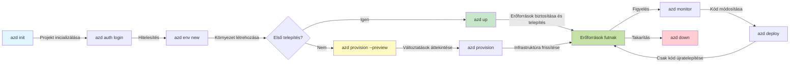
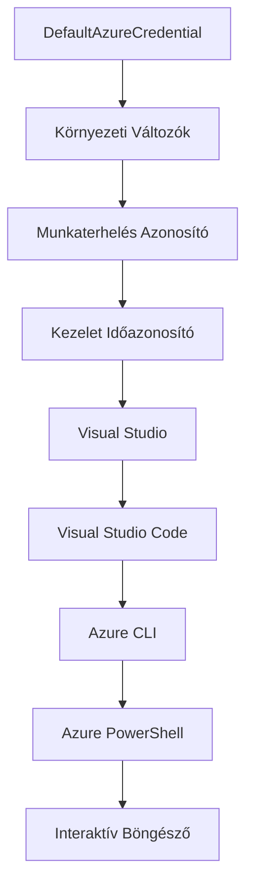

# AZD Alapok - Az Azure Developer CLI megértése

# AZD Alapok - Alapvető fogalmak és alapelvek

**Fejezet Navigáció:**
- **📚 Tanfolyam Főoldal**: [AZD kezdőknek](../../README.md)
- **📖 Aktuális fejezet**: 1. Fejezet - Alapok & Gyors indulás
- **⬅️ Előző**: [Tanfolyam áttekintése](../../README.md#-chapter-1-foundation--quick-start)
- **➡️ Következő**: [Telepítés & Beállítás](installation.md)
- **🚀 Következő fejezet**: [2. Fejezet: AI-Központú Fejlesztés](../chapter-02-ai-development/microsoft-foundry-integration.md)

## Bevezetés

Ez a lecke megismertet az Azure Developer CLI-vel (azd), egy erőteljes parancssori eszközzel, amely felgyorsítja az utadat a helyi fejlesztéstől az Azure-ba történő telepítésig. Megismered az alapfogalmakat, a főbb funkciókat, és megérted, hogyan egyszerűsíti az azd a felhőnatív alkalmazások telepítését.

## Tanulási célok

A lecke végére:
- Megérted, mi az Azure Developer CLI és mi a fő célja
- Megtudod az sablonok, környezetek és szolgáltatások alapfogalmait
- Felfedezed a főbb funkciókat, beleértve a sablon-alapú fejlesztést és az Infrastructure as Code-ot
- Megérteted az azd projekt szerkezetét és munkafolyamatát
- Felkészülsz az azd telepítésére és konfigurálására a fejlesztői környezetedben

## Tanulási eredmények

A lecke elvégzése után képes leszel:
- Elmagyarázni az azd szerepét a modern felhőfejlesztési munkafolyamatokban
- Azonosítani az azd projekt szerkezetének összetevőit
- Leírni, hogyan működnek együtt a sablonok, környezetek és szolgáltatások
- Megérteni az Infrastructure as Code előnyeit az azddal
- Felismerni a különböző azd parancsokat és azok célját

## Mi az Azure Developer CLI (azd)?

Az Azure Developer CLI (azd) egy parancssori eszköz, amely a helyi fejlesztéstől az Azure-ba történő telepítésig felgyorsítja az utadat. Egyszerűsíti a felhőnatív alkalmazások építését, telepítését és kezelését az Azure-on.

### Mit telepíthetsz az azddal?

Az azd széles körű terheléseket támogat—és a lista folyamatosan bővül. Ma az azddal telepítheted:

| Terheléstípus | Példák | Ugyanaz a munkafolyamat? |
|---------------|----------|----------------|
| **Hagyományos alkalmazások** | Webalkalmazások, REST API-k, statikus oldalak | ✅ `azd up` |
| **Szolgáltatások és mikroszolgáltatások** | Konténeralkalmazások, Function Apps, többszolgáltatásos backendek | ✅ `azd up` |
| **AI-alapú alkalmazások** | Chat alkalmazások Microsoft Foundry modellekkel, RAG megoldások AI Search-csel | ✅ `azd up` |
| **Intelligens ügynökök** | Foundry gazdálkodott ügynökök, többügynökös koordinációk | ✅ `azd up` |

A kulcsfontosságú felismerés az, hogy **az azd életciklus minden telepítésnél ugyanaz marad**. Inicializálsz egy projektet, előkészíted az infrastruktúrát, telepíted a kódot, figyeled az alkalmazást, és kitakarítasz—akár egyszerű weboldal, akár fejlett AI-ügynök.

Ez a folytonosság tervezett. Az azd az AI képességeket egy másik szolgáltatásnak tekinti, amit az alkalmazásod használhat, nem pedig alapvetően különböző dolognak. Egy Microsoft Foundry modellek által támogatott chat végpont az azd szemszögéből csak egy újabb konfigurálandó és telepítendő szolgáltatás.

### 🎯 Miért használjuk az AZD-t? Egy valós összehasonlítás

Nézzük meg egy egyszerű webalkalmazás adatbázissal való telepítését:

#### ❌ AZD NÉLKÜL: Manuális Azure telepítés (30+ perc)

```bash
# 1. lépés: Erőforráscsoport létrehozása
az group create --name myapp-rg --location eastus

# 2. lépés: Alkalmazásszolgáltatási terv létrehozása
az appservice plan create --name myapp-plan \
  --resource-group myapp-rg \
  --sku B1 --is-linux

# 3. lépés: Webalkalmazás létrehozása
az webapp create --name myapp-web-unique123 \
  --resource-group myapp-rg \
  --plan myapp-plan \
  --runtime "NODE:18-lts"

# 4. lépés: Cosmos DB fiók létrehozása (10-15 perc)
az cosmosdb create --name myapp-cosmos-unique123 \
  --resource-group myapp-rg \
  --kind MongoDB

# 5. lépés: Adatbázis létrehozása
az cosmosdb mongodb database create \
  --account-name myapp-cosmos-unique123 \
  --resource-group myapp-rg \
  --name tododb

# 6. lépés: Gyűjtemény létrehozása
az cosmosdb mongodb collection create \
  --account-name myapp-cosmos-unique123 \
  --resource-group myapp-rg \
  --database-name tododb \
  --name todos

# 7. lépés: Kapcsolati karakterlánc lekérése
CONN_STR=$(az cosmosdb keys list \
  --name myapp-cosmos-unique123 \
  --resource-group myapp-rg \
  --type connection-strings \
  --query "connectionStrings[0].connectionString" -o tsv)

# 8. lépés: Alkalmazásbeállítások konfigurálása
az webapp config appsettings set \
  --name myapp-web-unique123 \
  --resource-group myapp-rg \
  --settings MONGODB_URI="$CONN_STR"

# 9. lépés: Naplózás engedélyezése
az webapp log config --name myapp-web-unique123 \
  --resource-group myapp-rg \
  --application-logging filesystem \
  --detailed-error-messages true

# 10. lépés: Application Insights beállítása
az monitor app-insights component create \
  --app myapp-insights \
  --location eastus \
  --resource-group myapp-rg

# 11. lépés: App Insights összekapcsolása a Webalkalmazással
INSTRUMENTATION_KEY=$(az monitor app-insights component show \
  --app myapp-insights \
  --resource-group myapp-rg \
  --query "instrumentationKey" -o tsv)

az webapp config appsettings set \
  --name myapp-web-unique123 \
  --resource-group myapp-rg \
  --settings APPINSIGHTS_INSTRUMENTATIONKEY="$INSTRUMENTATION_KEY"

# 12. lépés: Az alkalmazás helyi fordítása
npm install
npm run build

# 13. lépés: Telepítési csomag készítése
zip -r app.zip . -x "*.git*" "node_modules/*"

# 14. lépés: Alkalmazás telepítése
az webapp deployment source config-zip \
  --resource-group myapp-rg \
  --name myapp-web-unique123 \
  --src app.zip

# 15. lépés: Várj és imádkozz, hogy működjön 🙏
# (Nincs automatikus ellenőrzés, manuális tesztelés szükséges)
```

**Problémák:**
- ❌ Több mint 15 parancsot kell megjegyezni és megfelelő sorrendben végrehajtani
- ❌ 30-45 perc manuális munka
- ❌ Könnyű hibázni (elgépelés, hibás paraméterek)
- ❌ Kapcsolati karakterláncok kikerülnek a terminál előzménybe
- ❌ Nincs automatikus visszaállítás hiba esetén
- ❌ Nehéz reprodukálni csapattagok számára
- ❌ Mindig más (nem reprodukálható)

#### ✅ AZD-vel: Automatizált telepítés (5 parancs, 10-15 perc)

```bash
# 1. lépés: Inicializálás sablonból
azd init --template todo-nodejs-mongo

# 2. lépés: Hitelesítés
azd auth login

# 3. lépés: Környezet létrehozása
azd env new dev

# 4. lépés: Változások előnézete (opcionális, de ajánlott)
azd provision --preview

# 5. lépés: Minden telepítése
azd up

# ✨ Kész! Minden telepítve, konfigurálva és figyelve van
```

**Előnyök:**
- ✅ **5 parancs** vs. több mint 15 kézi lépés
- ✅ **10-15 perc** összesen (főként Azure várakozás)
- ✅ **Kevesebb kézi hiba** - konzisztens, sablonvezérelt munkafolyamat
- ✅ **Biztonságos titkos kezelés** - sok sablon Azure által kezelt titkos tárolót használ
- ✅ **Ismételhető telepítések** - ugyanaz a munkafolyamat mindig
- ✅ **Teljesen reprodukálható** - mindig ugyanaz az eredmény
- ✅ **Csapatbarát** - bárki telepíthet ugyanazokkal a parancsokkal
- ✅ **Infrastructure as Code** - verziózott Bicep sablonok
- ✅ **Beépített monitorozás** - automatán beállított Application Insights

### 📊 Idő- és hibacsökkenés

| Mutató | Manuális telepítés | AZD telepítés | Javulás |
|:-------|:------------------|:---------------|:------------|
| **Parancsok száma** | 15+ | 5 | 67% kevesebb |
| **Idő** | 30-45 perc | 10-15 perc | 60%-kal gyorsabb |
| **Hibaarány** | ~40% | <5% | 88%-kal kevesebb |
| **Konzisztencia** | Alacsony (manuális) | 100% (automatizált) | Tökéletes |
| **Csapat bevezetés** | 2-4 óra | 30 perc | 75%-kal gyorsabb |
| **Visszaállítási idő** | 30+ perc (manuális) | 2 perc (automatizált) | 93%-kal gyorsabb |

## Alapfogalmak

### Sablonok
A sablonok az azd alapjai. Tartalmazzák:
- **Alkalmazáskód** - A forráskód és függőségek
- **Infrastruktúra definíciók** - Azure-erőforrások Bicep vagy Terraform-ban definiálva
- **Konfigurációs fájlok** - Beállítások és környezeti változók
- **Telepítési szkriptek** - Automatizált telepítési munkafolyamatok

### Környezetek
A környezetek a különböző telepítési célpontokat jelölik:
- **Fejlesztés** - Teszteléshez és fejlesztéshez
- **Stage** - Előgyártási környezet
- **Éles** - Élő, termelési környezet

Minden környezet saját:
- Azure erőforráscsoportot
- Konfigurációs beállításokat
- Telepítési állapotot tart fenn

### Szolgáltatások
A szolgáltatások az alkalmazásod építőelemei:
- **Frontend** - Webalkalmazások, SPA-k
- **Backend** - API-k, mikroszolgáltatások
- **Adatbázis** - Adattároló megoldások
- **Tárolás** - Fájl- és blob tárolás

## Főbb funkciók

### 1. Sablonvezérelt fejlesztés
```bash
# Elérhető sablonok böngészése
azd template list

# Kezdés egy sablonból
azd init --template <template-name>
```

### 2. Infrastructure as Code
- **Bicep** - Azure domain-specifikus nyelve
- **Terraform** - Többfelhős infrastruktúra eszköz
- **ARM sablonok** - Azure Resource Manager sablonok

### 3. Integrált munkafolyamatok
```bash
# Teljes telepítési munkafolyamat
azd up            # Létrehozás + telepítés, ez az első beállításhoz kéz nélküli

# 🧪 ÚJ: Előnézet az infrastruktúra változásairól telepítés előtt (BIZTONSÁGOS)
azd provision --preview    # Az infrastruktúra telepítés szimulálása változtatások nélkül

azd provision     # Azure-erőforrások létrehozása, ha frissíted az infrastruktúrát, használd ezt
azd deploy        # Alkalmazáskód telepítése vagy újratelepítése frissítés után
azd down          # Erőforrások megtisztítása
```

#### 🛡️ Biztonságos infrastruktúra tervezés előnézettel
Az `azd provision --preview` parancs forradalmi a biztonságos telepítésekhez:
- **Dry-run elemzés** - Megmutatja, mi jön létre, módosul vagy törlődik
- **Nulla kockázat** - Nem történik tényleges változás az Azure környezetben
- **Csapatmunka** - Megosztható az előnézeti eredmény telepítés előtt
- **Költségbecslés** - Megértheted az erőforrások költségét elköteleződés előtt

```bash
# Példa előnézeti munkafolyamat
azd provision --preview           # Nézze meg, mi fog változni
# Ellenőrizze az eredményt, beszélje meg a csapattal
azd provision                     # Alkalmazza a változtatásokat magabiztosan
```

### 📊 Ábra: AZD fejlesztési munkafolyamat



**Munkafolyamat magyarázat:**
1. **Init** - Kezted sablonnal vagy új projekttel
2. **Auth** - Azure hitelesítés
3. **Environment** - Elkülönített telepítési környezet létrehozása
4. **Preview** - 🆕 Mindig előnézeti módon ellenőrizd az infrastruktúramódosításokat (biztonságos gyakorlat)
5. **Provision** - Azure erőforrások létrehozása/frissítése
6. **Deploy** - Alkalmazáskód feltöltése
7. **Monitor** - Alkalmazás teljesítményének figyelése
8. **Iterate** - Változtatások, majd újratelepítés
9. **Cleanup** - Erőforrások eltávolítása, ha végzett

### 4. Környezetkezelés
```bash
# Környezetek létrehozása és kezelése
azd env new <environment-name>
azd env select <environment-name>
azd env list
```

### 5. Bővítmények és AI parancsok

Az azd bővítményrendszert használ a mag CLI-n túlmenő képességekhez. Ez különösen hasznos AI feladatokhoz:

```bash
# Elérhető kiterjesztések listázása
azd extension list

# A Foundry ügynökök kiterjesztés telepítése
azd extension install azure.ai.agents

# AI ügynök projekt inicializálása egy manifesztből
azd ai agent init -m agent-manifest.yaml

# Telepített ügynök tesztelése (késleltetés és első bájtig eltelt idő megjelenítése)
azd ai agent invoke

# Az MCP szerver indítása AI-támogatott fejlesztéshez (Alfa)
azd mcp start
```

**Az ügynök életciklusa végponttól végpontig.** Miután telepítetted a `azure.ai.agents`-t, egyetlen munkafolyamat visz el az ötlettől egy futó, figyelt ügynökig. Nem kell azonnal mindezt használnod – csak tudd, hogy léteznek:

| Fázis | Parancs | Mi a feladata? |
|-------|---------|--------------|
| **Scaffold** | `azd ai agent init -m <manifest>` | Ügynök projekt generálása manifestből |
| **Teszt** | `azd ai agent invoke` | Ügynök hívása és válaszidő megtekintése |
| **Mérés** | `azd ai agent eval generate` | Értékelő adatkészlet létrehozása az ügynökhöz |
| **Javítás** | `azd ai agent optimize` | Ügynök utasításainak optimalizálása adataid alapján |
| **Ellenőrzés** | `azd ai agent endpoint show` | Éles végpont konfiguráció megtekintése |
| **Takarítás** | `azd ai agent delete` | Gazdált ügynök és összes verziójának törlése |

> A bővítményekről részletesen a [2. Fejezet: AI-Központú Fejlesztés](../chapter-02-ai-development/agents.md) és az [AZD AI CLI parancsok](../chapter-08-production/production-ai-practices.md#azd-ai-cli-commands-and-extensions) referencia szól.

## 📁 Projekt szerkezet

Egy tipikus azd projekt szerkezete:
```
my-app/
├── .azd/                    # azd configuration
│   └── config.json
├── .azure/                  # Azure deployment artifacts
├── .devcontainer/          # Development container config
├── .github/workflows/      # GitHub Actions
├── .vscode/               # VS Code settings
├── infra/                 # Infrastructure code
│   ├── main.bicep        # Main infrastructure template
│   ├── main.parameters.json
│   └── modules/          # Reusable modules
├── src/                  # Application source code
│   ├── api/             # Backend services
│   └── web/             # Frontend application
├── azure.yaml           # azd project configuration
└── README.md
```

## 🔧 Konfigurációs fájlok

### azure.yaml
A fő projekt konfigurációs fájlja:
```yaml
name: my-awesome-app
metadata:
  template: my-template@1.0.0

services:
  web:
    project: ./src/web
    language: js
    host: appservice
  api:
    project: ./src/api
    language: js
    host: appservice

hooks:
  preprovision:
    shell: pwsh
    run: echo "Preparing to provision..."
```

### .azure/config.json
Környezetspecifikus konfiguráció:
```json
{
  "version": 1,
  "defaultEnvironment": "dev",
  "environments": {
    "dev": {
      "subscriptionId": "your-subscription-id",
      "location": "eastus"
    }
  }
}
```

## 🎪 Gyakori munkafolyamatok gyakorlati feladatokkal

> **💡 Tanulási tipp:** Kövesd ezeket a gyakorlatokat sorrendben, hogy fokozatosan fejleszd az AZD képességeidet.

### 🎯 Gyakorlat 1: Első projekt inicializálása

**Cél:** Hozz létre AZD projektet és fedezd fel a szerkezetét

**Lépések:**
```bash
# Használjon bevált sablont
azd init --template todo-nodejs-mongo

# Fedezze fel a generált fájlokat
ls -la  # Tekintse meg az összes fájlt, beleértve a rejtetteket is

# Létrehozott kulcsfontosságú fájlok:
# - azure.yaml (fő konfiguráció)
# - infra/ (infrastruktúra kód)
# - src/ (alkalmazás kód)
```

**✅ Siker:** Megvannak az azure.yaml, infra/ és src/ könyvtárak

---

### 🎯 Gyakorlat 2: Telepítés Azure-ba

**Cél:** Teljes körű telepítés végrehajtása

**Lépések:**
```bash
# 1. Hitelesítés
az login && azd auth login

# 2. Környezet létrehozása
azd env new dev
azd env set AZURE_LOCATION eastus

# 3. Változtatások előnézete (AJÁNLOTT)
azd provision --preview

# 4. Minden telepítése
azd up

# 5. Telepítés ellenőrzése
azd show    # Nézd meg az alkalmazásod URL-jét
```

**Várható idő:** 10-15 perc  
**✅ Siker:** Az alkalmazás URL-je megnyílik a böngészőben

---

### 🎯 Gyakorlat 3: Több környezet

**Cél:** Telepítés dev és stage környezetbe

**Lépések:**
```bash
# Már van dev, hozzon létre staginget
azd env new staging
azd env set AZURE_LOCATION westus2
azd up

# Váltás közöttük
azd env list
azd env select dev
```

**✅ Siker:** Két különálló erőforráscsoport az Azure Portalon

---

### 🛡️ Tiszta lap: `azd down --force --purge`

Amikor teljesen újra kell kezdened:

```bash
azd down --force --purge
```

**Mit csinál:**
- `--force`: Nincs megerősítő kérdés
- `--purge`: Törli az összes helyi állapotot és Azure erőforrást

**Használat amikor:**
- A telepítés félbeszakadt
- Projektet váltasz
- Új kezdés szükséges

---

## 🎪 Eredeti munkafolyamat referenciája

### Új projekt indítása
```bash
# 1. módszer: Használja a meglévő sablont
azd init --template todo-nodejs-mongo

# 2. módszer: Kezdje az elejéről
azd init

# 3. módszer: Használja a jelenlegi könyvtárat
azd init .
```

### Fejlesztési ciklus
```bash
# Fejlesztési környezet beállítása
azd auth login
azd env new dev
azd env select dev

# Minden telepítése
azd up

# Változtatások végrehajtása és újratelepítés
azd deploy

# Takarítás a befejezés után
azd down --force --purge # Az Azure Developer CLI parancsa **kemény visszaállítás** a környezetedhez – különösen hasznos, ha sikertelen telepítések hibakeresésén dolgozol, elhagyott erőforrásokat takarítasz, vagy új telepítésre készülsz.
```

## Az `azd down --force --purge` megértése
Az `azd down --force --purge` parancs egy hatékony mód arra, hogy teljesen eltávolítsd az azd környezetedet és minden kapcsolódó erőforrást. Íme, mit csinál minden jelző:
```
--force
```
- Megkerüli a megerősítést kérő üzeneteket.
- Hasznos automatizálás vagy szkriptelés esetén, mikor a manuális bevitel nem opció.
- Biztosítja a megszakítás nélküli lebontást, még akkor is, ha a CLI inkonzisztenciákat érzékel.

```
--purge
```
Töröl **minden kapcsolódó metaadatot**, beleértve:
A környezeti állapotot
A helyi `.azure` mappát
Gyorsított telepítési adatokat
Megakadályozza, hogy az azd "emlékezzen" az előző telepítésekre, ami okozhat hibákat, mint pl. erőforráscsoport eltérések vagy elavult regisztrációs hivatkozások.

### Miért használjuk mindkettőt?
Ha az `azd up` nem működik a megmaradt állapot vagy részleges telepítés miatt, ez a kombináció biztosítja a **tiszta kezdést**.

Különösen hasznos kézi erőforrás törlések után az Azure portálon, vagy sablon, környezet vagy erőforráscsoport névkonvenciók váltásakor.

### Több környezet kezelése
```bash
# Létrehozás élesítés előtti környezet
azd env new staging
azd env select staging
azd up

# Visszakapcsolás fejlesztői környezetbe
azd env select dev

# Környezetek összehasonlítása
azd env list
```

## 🔐 Hitelesítés és hitelesítési adatok

A hitelesítés megértése kulcsfontosságú a sikeres azd telepítésekhez. Az Azure több hitelesítési módot használ, és az azd ugyanazt a hitelesítő láncot alkalmazza, amit más Azure eszközök is használnak.

### Azure CLI hitelesítés (`az login`)

Mielőtt azdot használnád, be kell jelentkezned az Azure-ba. A leggyakoribb módszer az Azure CLI használata:

```bash
# Interaktív bejelentkezés (megnyitja a böngészőt)
az login

# Bejelentkezés adott bérlővel
az login --tenant <tenant-id>

# Bejelentkezés szolgáltatási azonosítóval
az login --service-principal -u <app-id> -p <password> --tenant <tenant-id>

# Aktuális bejelentkezési állapot ellenőrzése
az account show

# Elérhető előfizetések listázása
az account list --output table

# Alapértelmezett előfizetés beállítása
az account set --subscription <subscription-id>
```

### Hitelesítési folyamat
1. **Interaktív bejelentkezés**: Alapértelmezett böngésző megnyílik a hitelesítéshez
2. **Eszköz kód folyamat**: Böngésző nélküli környezetekhez
3. **Szolgáltatói fiók**: Automatizálás és CI/CD forgatókönyvekhez
4. **Kezelt identitás**: Azure-on futó alkalmazásokhoz

### DefaultAzureCredential lánc

A `DefaultAzureCredential` egy hitelesítési típus, amely leegyszerűsíti a hitelesítést azzal, hogy automatikusan kipróbál több hitelesítési forrást egy adott sorrendben:

#### Hitelesítési lánc sorrendje


#### 1. Környezeti változók
```bash
# Környezeti változók beállítása a szolgáltatási főnök számára
export AZURE_CLIENT_ID="<app-id>"
export AZURE_CLIENT_SECRET="<password>"
export AZURE_TENANT_ID="<tenant-id>"
```

#### 2. Workload Identity (Kubernetes/GitHub Actions)
Automatikusan használja:
- Azure Kubernetes Service (AKS) Workload Identity-vel
- GitHub Actions OIDC federációval
- Más federált identitás forgatókönyvek

#### 3. Kezelt identitás
Azure erőforrások esetén, mint:
- Virtuális gépek
- App Service
- Azure Functions
- Konténer példányok

```bash
# Ellenőrizze, hogy Azure erőforráson fut-e kezelt identitással
az account show --query "user.type" --output tsv
# Visszatérés: "servicePrincipal", ha kezelt identitás van használatban
```

#### 4. Fejlesztői eszközök integrációja
- **Visual Studio**: Automatikusan használja a bejelentkezett fiókot
- **VS Code**: Azure Account bővítmény hitelesítő adatait használja
- **Azure CLI**: `az login` hitelesítő adatait használja (leggyakoribb helyi fejlesztésnél)

### AZD hitelesítés beállítása

```bash
# 1. módszer: Azure CLI használata (fejlesztéshez ajánlott)
az login
azd auth login  # Meglévő Azure CLI hitelesítő adatok használata

# 2. módszer: Közvetlen azd hitelesítés
azd auth login --use-device-code  # Fej nélküli környezetekhez

# 3. módszer: Hitelesítési állapot ellenőrzése
azd auth login --check-status

# 4. módszer: Kijelentkezés és újra hitelesítés
azd auth logout
azd auth login
```

### Hitelesítési legjobb gyakorlatok

#### Helyi fejlesztéshez
#### CI/CD folyamatokhoz
#### Éles környezetekhez
- Használjon **menedzselt identitást**, amikor Azure erőforrásokon futtatja
- Automatizálási forgatókönyvekhez használjon **szolgáltatási főnököt**
- Kerülje a hitelesítő adatok tárolását kódban vagy konfigurációs fájlokban
- Használja az érzékeny konfigurációhoz az **Azure Key Vault**-ot

### Gyakori hitelesítési problémák és megoldások

#### Probléma: "Nem található előfizetés"
#### Probléma: "Nincs elegendő jogosultság"
#### Probléma: "A token lejárt"
### Hitelesítés különféle helyzetekben

#### Helyi fejlesztés
#### Csapatfejlesztés
#### Több bérlős forgatókönyvek
### Biztonsági megfontolások

1. **Hitelesítő adatok tárolása**: Soha ne tároljon hitelesítő adatokat forráskódban
2. **Jogosultságok korlátozása**: Szolgáltatási főnökök esetén alkalmazza a legkisebb jogosultság elvét
3. **Token forgatás**: Rendszeresen forgassa a szolgáltatási főnök titkait
4. **Ellenőrzési napló**: Kövesse nyomon a hitelesítési és telepítési tevékenységeket
5. **Hálózati biztonság**: Lehetőség szerint használjon privát végpontokat

### Hitelesítési hibakeresés

## `azd down --force --purge` megértése

### Felfedezés
### Projektmenedzsment
### Megfigyelés
## Legjobb gyakorlatok

### 1. Értelmes nevek használata
### 2. Sablonok kihasználása
- Kezdjen meglévő sablonokkal
- Igényei szerint testreszabhatja
- Hozzon létre újrahasznosítható sablonokat szervezete számára

### 3. Környezet izolálása
- Használjon külön fejlesztő, teszt és éles környezeteket
- Soha ne telepítsen közvetlenül helyi gépről éles környezetbe
- Éles telepítésekhez használjon CI/CD folyamatokat

### 4. Konfiguráció menedzsment
- Használjon környezeti változókat érzékeny adatokhoz
- Tartsa a konfigurációt verziókövetés alatt
- Dokumentálja a környezetre jellemző beállításokat

## Tanulási ütemterv

### Kezdő (1-2. hét)
1. Telepítse az azd-t és hitelesítse magát
2. Telepítsen egy egyszerű sablont
3. Értse meg a projekt struktúráját
4. Tanulja meg az alapvető parancsokat (up, down, deploy)

### Középhaladó (3-4. hét)
1. Testreszabja a sablonokat
2. Több környezetet kezel
3. Értse meg az infrastruktúra kódot
4. Állítson be CI/CD folyamatokat

### Haladó (5. hét+)
1. Hozzon létre egyedi sablonokat
2. Haladó infrastruktúra minták
3. Több régiós telepítések
4. Vállalati szintű konfigurációk

## Következő lépések

**📖 Folytassa az 1. fejezet tanulását:**
- [Telepítés és beállítás](installation.md) - Szerezze be és konfigurálja az azd-t
- [Az első projektje](first-project.md) - Teljes, gyakorlati útmutató
- [Konfigurációs útmutató](configuration.md) - Haladó konfigurációs lehetőségek

**🎯 Készen áll a következő fejezetre?**
- [2. fejezet: AI-alapú fejlesztés](../chapter-02-ai-development/microsoft-foundry-integration.md) - Kezdjen el AI alkalmazásokat fejleszteni

## További források

- [Azure Developer CLI áttekintés](https://learn.microsoft.com/en-us/azure/developer/azure-developer-cli/)
- [Sablon galéria](https://azure.github.io/awesome-azd/)
- [Közösségi minták](https://github.com/Azure-Samples)

---

## 🙋 Gyakran ismételt kérdések

### Általános kérdések

**K: Mi a különbség az AZD és az Azure CLI között?**

V: Az Azure CLI (`az`) az egyedi Azure erőforrások kezelésére szolgál. Az AZD (`azd`) egész alkalmazások kezelésére használható:

**Ezt így képzelje el:**
- `az` = Egyes Lego kockák kezelése
- `azd` = Teljes Lego készletek kezelése

---

**K: Kell Bicep vagy Terraform ismeret az AZD használatához?**

V: Nem! Kezdje sablonokkal:
Később megtanulhat Bicep-et az infrastruktúra testreszabásához. A sablonok működő példákat nyújtanak a tanuláshoz.

---

**K: Mennyibe kerül az AZD sablonok futtatása?**

V: A költségek sablontól függően változnak. A legtöbb fejlesztési sablon havi 50-150 dollárba kerül:

**Pro tipp:** Használja a rendelkezésre álló ingyenes szinteket:
- App Service: F1 (ingyenes) szint
- Microsoft Foundry Modellek: Azure OpenAI 50 000 token/hó ingyen
- Cosmos DB: 1000 RU/s ingyenes szint

---

**K: Használhatom az AZD-t meglévő Azure erőforrásokkal?**

V: Igen, de egyszerűbb új projektként kezdeni. Az AZD akkor működik a legjobban, ha az egész életciklust kezeli. Meglévő erőforrások esetén:

---

**K: Hogyan oszthatom meg a projektet a csapattagokkal?**

V: Kövesse el a projektet Git-be (de NEM a .azure mappát):

Mindenki ugyanazt az infrastruktúrát kapja ugyanazokból a sablonokból.

---

### Hibakeresési kérdések

**K: Az "azd up" félúton meghiúsult. Mit tegyek?**

V: Nézze meg a hibát, javítsa, majd próbálja újra:

**Leggyakoribb probléma:** Rossz Azure előfizetés lett kiválasztva

---

**K: Hogyan telepíthetek csak kódváltozásokat újratelepítés nélkül?**

V: Használja az `azd deploy` parancsot az `azd up` helyett:

Gyors összehasonlítás:
- `azd up`: 10-15 perc (infrastruktúra telepítése)
- `azd deploy`: 2-5 perc (csak kód)

---

**K: Személyre szabhatom az infrastruktúra sablonokat?**

V: Igen! Szerkessze a Bicep fájlokat az `infra/` mappában:

**Tipp:** Kezdje kicsiben - először változtassa meg az SKU-kat:

---

**K: Hogyan töröljem az AZD által létrehozott összes erőforrást?**

V: Egyetlen parancs eltávolít mindent:

**Mindig futtassa, amikor:**
- Tesztelés befejeződött egy sablonon
- Másik projektre vált
- Újrakezdést szeretne

**Költségmegtakarítás:** Nem használt erőforrások törlése = 0 díj

---

**K: Mi történt, ha véletlenül töröltem erőforrásokat az Azure Portalon?**

V: Az AZD állapota összeakadhat. Tiszta lap megközelítés:

---

### Haladó kérdések

**K: Használhatom az AZD-t CI/CD folyamatokban?**

V: Igen! GitHub Actions példa:

---

**K: Hogyan kezelem a titkokat és érzékeny adatokat?**

V: Az AZD automatikusan integrálódik az Azure Key Vault-tal:

**Soha ne kövesse el:**
- `.azure/` mappa (tartalmazza a környezeti adatokat)
- `.env` fájlok (helyi titkok)
- Kapcsolati karakterláncok

---

**K: Telepíthetek több régióba?**

V: Igen, hozzon létre minden régióhoz külön környezetet:

Többrégiós alkalmazásokhoz testreszabhatja a Bicep sablonokat úgy, hogy egyszerre több régióba telepítsen.

---

**K: Hol kaphatok segítséget, ha elakadok?**

1. **AZD dokumentáció:** https://learn.microsoft.com/azure/developer/azure-developer-cli/
2. **GitHub Issues:** https://github.com/Azure/azure-dev/issues
3. **Discord:** [Azure Discord](https://discord.gg/microsoft-azure) - #azure-developer-cli csatorna
4. **Stack Overflow:** `azure-developer-cli` címke
5. **Ez a kurzus:** [Hibakeresési útmutató](../chapter-07-troubleshooting/common-issues.md)

**Pro tipp:** Kérdezés előtt futtassa:
Tartalmazza ezt az infót a kérdésében a gyorsabb segítségért.

---

## 🎓 Mi következik?

Most már érti az AZD alapjait. Válassza ki az útját:

### 🎯 Kezdőknek:
1. **Következő:** [Telepítés és beállítás](installation.md) - Telepítse az AZD-t a gépére
2. **Aztán:** [Az első projektje](first-project.md) - Telepítse első alkalmazását
3. **Gyakoroljon:** Teljesítse a lecke mindhárom gyakorlati feladatát

### 🚀 AI fejlesztőknek:
1. **Ugorjon a:** [2. fejezet: AI-alapú fejlesztés](../chapter-02-ai-development/microsoft-foundry-integration.md)
2. **Telepítsen:** Kezdje az `azd init --template get-started-with-ai-chat` parancsal
3. **Tanuljon:** Építsen miközben telepít

### 🏗️ Tapasztalt fejlesztőknek:
1. **Nézze át:** [Konfigurációs útmutató](configuration.md) - Haladó beállítások
2. **Fedezze fel:** [Infrastructure as Code](../chapter-04-infrastructure/provisioning.md) - Mély Bicep ismertető
3. **Építsen:** Hozzon létre egyedi sablonokat saját stack-jéhez

---

**Fejezet navigáció:**
- **📚 Kurzus kezdőlap:** [AZD Kezdőknek](../../README.md)
- **📖 Aktuális fejezet:** 1. fejezet - Alapok és gyors indulás  
- **⬅️ Előző:** [Kurzus áttekintés](../../README.md#-chapter-1-foundation--quick-start)
- **➡️ Következő:** [Telepítés és beállítás](installation.md)
- **🚀 Következő fejezet:** [2. fejezet: AI-alapú fejlesztés](../chapter-02-ai-development/microsoft-foundry-integration.md)

---

<!-- CO-OP TRANSLATOR DISCLAIMER START -->
**Jogi nyilatkozat**:
Ez a dokumentum az AI fordítási szolgáltatás, a [Co-op Translator](https://github.com/Azure/co-op-translator) segítségével készült. Bár az pontosságra törekszünk, kérjük, vegye figyelembe, hogy az automatikus fordítások hibákat vagy pontatlanságokat tartalmazhatnak. Az eredeti dokumentum az anyanyelvén tekintendő hiteles forrásnak. Fontos információk esetén professzionális emberi fordítást javasolunk. Nem vállalunk felelősséget semmilyen félreértésért vagy téves értelmezésért, amely ebből a fordításból ered.
<!-- CO-OP TRANSLATOR DISCLAIMER END -->