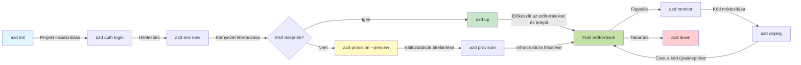
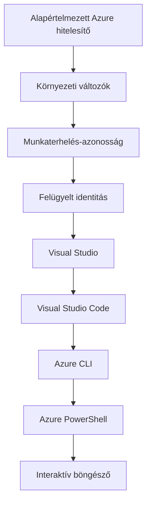

# AZD Alapok - Az Azure Developer CLI megértése

# AZD Alapok - Alapfogalmak és alapok

**Fejezet navigáció:**
- **📚 Tanfolyam kezdőlap**: [AZD Kezdőknek](../../README.md)
- **📖 Aktuális fejezet**: 1. fejezet - Alapok és Gyors kezdés
- **⬅️ Előző**: [A tanfolyam áttekintése](../../README.md#-chapter-1-foundation--quick-start)
- **➡️ Következő**: [Telepítés és beállítás](installation.md)
- **🚀 Következő fejezet**: [2. fejezet: AI-első fejlesztés](../chapter-02-ai-development/microsoft-foundry-integration.md)

## Bevezetés

Ez a lecke bemutatja az Azure Developer CLI-t (azd), egy erőteljes parancssori eszközt, amely felgyorsítja az útadat a helyi fejlesztéstől az Azure-ra történő telepítésig. Megismered az alapvető fogalmakat, a főbb funkciókat, és azt, hogyan egyszerűsíti az azd a felhőnatív alkalmazások telepítését.

## Tanulási célok

A lecke végére:
- Megérteni, mi az Azure Developer CLI és mi a fő célja
- Megismerni a sablonok, környezetek és szolgáltatások alapfogalmait
- Felfedezni a főbb funkciókat, beleértve a sablonvezérelt fejlesztést és az infrastruktúrát kódként (Infrastructure as Code)
- Megérteni az azd projekt struktúráját és munkafolyamatát
- Felkészülni az azd telepítésére és konfigurálására a fejlesztési környezetedben

## Tanulási eredmények

A lecke elvégzése után képes leszel:
- Elmagyarázni az azd szerepét a modern felhőfejlesztési munkafolyamatokban
- Azonosítani az azd projekt struktúrájának elemeit
- Leírni, hogyan működnek együtt a sablonok, környezetek és szolgáltatások
- Megérteni az Infrastruktúra kódként előnyeit az azd használatával
- Felismerni az azd különböző parancsait és azok célját

## Mi az Azure Developer CLI (azd)?

Az Azure Developer CLI (azd) egy parancssori eszköz, amelyet arra terveztek, hogy felgyorsítsa az utadat a helyi fejlesztéstől az Azure-ra történő telepítésig. Egyszerűsíti a felhőnatív alkalmazások Azure-on történő felépítését, telepítését és kezelését.

### 🎯 Miért használjuk az AZD-t? Egy valós világbeli összehasonlítás

Hasonlítsuk össze egy egyszerű webalkalmazás és adatbázis telepítését:

#### ❌ AZD NÉLKÜL: Manuális Azure telepítés (30+ perc)

```bash
# 1. lépés: Erőforráscsoport létrehozása
az group create --name myapp-rg --location eastus

# 2. lépés: App Service-terv létrehozása
az appservice plan create --name myapp-plan \
  --resource-group myapp-rg \
  --sku B1 --is-linux

# 3. lépés: Webalkalmazás létrehozása
az webapp create --name myapp-web-unique123 \
  --resource-group myapp-rg \
  --plan myapp-plan \
  --runtime "NODE:18-lts"

# 4. lépés: Cosmos DB-fiók létrehozása (10-15 perc)
az cosmosdb create --name myapp-cosmos-unique123 \
  --resource-group myapp-rg \
  --kind MongoDB

# 5. lépés: Adatbázis létrehozása
az cosmosdb mongodb database create \
  --account-name myapp-cosmos-unique123 \
  --resource-group myapp-rg \
  --name tododb

# 6. lépés: Gyűjtemény létrehozása
az cosmosdb mongodb collection create \
  --account-name myapp-cosmos-unique123 \
  --resource-group myapp-rg \
  --database-name tododb \
  --name todos

# 7. lépés: Kapcsolati karakterlánc lekérése
CONN_STR=$(az cosmosdb keys list \
  --name myapp-cosmos-unique123 \
  --resource-group myapp-rg \
  --type connection-strings \
  --query "connectionStrings[0].connectionString" -o tsv)

# 8. lépés: Alkalmazásbeállítások konfigurálása
az webapp config appsettings set \
  --name myapp-web-unique123 \
  --resource-group myapp-rg \
  --settings MONGODB_URI="$CONN_STR"

# 9. lépés: Naplózás engedélyezése
az webapp log config --name myapp-web-unique123 \
  --resource-group myapp-rg \
  --application-logging filesystem \
  --detailed-error-messages true

# 10. lépés: Application Insights beállítása
az monitor app-insights component create \
  --app myapp-insights \
  --location eastus \
  --resource-group myapp-rg

# 11. lépés: App Insights összekapcsolása a Webalkalmazással
INSTRUMENTATION_KEY=$(az monitor app-insights component show \
  --app myapp-insights \
  --resource-group myapp-rg \
  --query "instrumentationKey" -o tsv)

az webapp config appsettings set \
  --name myapp-web-unique123 \
  --resource-group myapp-rg \
  --settings APPINSIGHTS_INSTRUMENTATIONKEY="$INSTRUMENTATION_KEY"

# 12. lépés: Alkalmazás helyi felépítése
npm install
npm run build

# 13. lépés: Telepítési csomag létrehozása
zip -r app.zip . -x "*.git*" "node_modules/*"

# 14. lépés: Alkalmazás telepítése
az webapp deployment source config-zip \
  --resource-group myapp-rg \
  --name myapp-web-unique123 \
  --src app.zip

# 15. lépés: Várj, és imádkozz, hogy működjön 🙏
# (Nincs automatizált ellenőrzés, kézi tesztelés szükséges)
```

**Problémák:**
- ❌ Több mint 15 parancs, amit meg kell jegyezni és sorrendben végrehajtani
- ❌ 30–45 perc kézi munka
- ❌ Könnyű hibázni (elgépelés, hibás paraméterek)
- ❌ Kapcsolati karakterláncok láthatóak a terminál előzményeiben
- ❌ Nincs automatikus visszagörgetés hiba esetén
- ❌ Nehéz reprodukálni a csapattagok számára
- ❌ Minden alkalommal más (nem reprodukálható)

#### ✅ AZD-VEL: Automatizált telepítés (5 parancs, 10-15 perc)

```bash
# 1. lépés: Inicializálás sablon alapján
azd init --template todo-nodejs-mongo

# 2. lépés: Hitelesítés
azd auth login

# 3. lépés: Környezet létrehozása
azd env new dev

# 4. lépés: Változtatások előnézete (opcionális, de ajánlott)
azd provision --preview

# 5. lépés: Minden telepítése
azd up

# ✨ Kész! Minden telepítve, konfigurálva és felügyelve
```

**Előnyök:**
- ✅ **5 parancs** vs. több mint 15 kézi lépés
- ✅ **10–15 perc** összidő (többnyire Azure-re várakozás)
- ✅ **Nulla hiba** - automatizált és tesztelt
- ✅ **Titkok biztonságosan kezelve** az Azure Key Vault segítségével
- ✅ **Automatikus visszagörgetés** hibák esetén
- ✅ **Teljesen reprodukálható** - minden alkalommal ugyanaz az eredmény
- ✅ **Csapatbarát** - bárki telepíthet ugyanazokkal a parancsokkal
- ✅ **Infrastruktúra kódként** - verziókezelt Bicep sablonok
- ✅ **Beépített monitorozás** - Application Insights automatikusan konfigurálva

### 📊 Idő- és hibacsökkenés

| Mérőszám | Manuális telepítés | AZD telepítés | Javulás |
|:-------|:------------------|:---------------|:------------|
| **Parancsok** | 15+ | 5 | 67%-kal kevesebb |
| **Idő** | 30–45 perc | 10–15 perc | 60%-kal gyorsabb |
| **Hibaarány** | ~40% | <5% | 88%-os csökkenés |
| **Konzisztencia** | Alacsony (kézi) | 100% (automatizált) | Tökéletes |
| **Csapat belső képzése** | 2–4 óra | 30 perc | 75%-kal gyorsabb |
| **Visszagörgetés ideje** | 30+ perc (kézi) | 2 perc (automatizált) | 93%-kal gyorsabb |

## Alapfogalmak

### Sablonok
A sablonok az azd alapjai. Tartalmazzák:
- **Alkalmazáskód** - Forráskódod és függőségei
- **Infrastruktúra definíciók** - Azure erőforrások, amelyek Bicep-ben vagy Terraform-ban vannak meghatározva
- **Konfigurációs fájlok** - Beállítások és környezeti változók
- **Telepítési scriptek** - Automatizált telepítési munkafolyamatok

### Környezetek
A környezetek különböző telepítési célpontokat jelentenek:
- **Fejlesztés** - Tesztelésre és fejlesztésre
- **Staging** - Élesbe állítás előtti környezet
- **Production** - Éles környezet

Minden környezet saját:
- Azure erőforráscsoport
- Konfigurációs beállítások
- Telepítési állapot

### Szolgáltatások
A szolgáltatások az alkalmazásod építőelemei:
- **Frontend** - Webalkalmazások, egylapos alkalmazások (SPA)
- **Backend** - API-k, mikroszolgáltatások
- **Adatbázis** - Adattárolási megoldások
- **Tárolás** - Fájl- és blob-tárolás

## Főbb jellemzők

### 1. Sablonvezérelt fejlesztés
```bash
# Elérhető sablonok böngészése
azd template list

# Inicializálás sablonból
azd init --template <template-name>
```

### 2. Infrastruktúra kódként
- **Bicep** - Az Azure domain-specifikus nyelve
- **Terraform** - Többfelhős infrastruktúra eszköz
- **ARM sablonok** - Azure Resource Manager sablonok

### 3. Integrált munkafolyamatok
```bash
# Teljes telepítési munkafolyamat
azd up            # Erőforrások előkészítése + Telepítés — ez az első beállításhoz kézi beavatkozás nélkül

# 🧪 ÚJ: Infrastrukturális változtatások előnézete telepítés előtt (BIZTONSÁGOS)
azd provision --preview    # Infrastruktúra telepítésének szimulálása anélkül, hogy változtatásokat végeznénk

azd provision     # Azure-erőforrások létrehozása — ha frissíted az infrastruktúrát, használd ezt
azd deploy        # Alkalmazáskód telepítése vagy újbóli telepítése frissítés után
azd down          # Erőforrások törlése
```

#### 🛡️ Biztonságos infrastruktúra tervezés előnézettel
Az `azd provision --preview` parancs igazi mérföldkő a biztonságos telepítésekhez:
- **Szárazfutás elemzés** - Megmutatja, mi lesz létrehozva, módosítva vagy törölve
- **Zéró kockázat** - Nem történik tényleges változtatás az Azure környezetedben
- **Csapatmunka** - Megoszthatod az előnézet eredményeit telepítés előtt
- **Költségbecslés** - Ismerd meg az erőforrások költségeit a kötelezettségvállalás előtt

```bash
# Példa előnézeti munkafolyamat
azd provision --preview           # Tekintse meg, mi fog változni
# Tekintse át a kimenetet, beszélje meg a csapattal
azd provision                     # Alkalmazza a változtatásokat magabiztosan
```

### 📊 Vizualizáció: AZD fejlesztési munkafolyamat


**Munkafolyamat magyarázata:**
1. **Init** - Kezdés sablonnal vagy új projekttel
2. **Auth** - Hitelesítés Azure-ral
3. **Environment** - Izolált telepítési környezet létrehozása
4. **Preview** - 🆕 Mindig előnézetben tekintsd meg először az infrastruktúra változásait (biztonságos gyakorlat)
5. **Provision** - Azure erőforrások létrehozása/frissítése
6. **Deploy** - Az alkalmazáskód feltöltése
7. **Monitor** - Figyeld az alkalmazás teljesítményét
8. **Iterate** - Végezz módosításokat és telepítsd újra a kódot
9. **Cleanup** - Erőforrások eltávolítása, ha végeztél

### 4. Környezetkezelés
```bash
# Környezetek létrehozása és kezelése
azd env new <environment-name>
azd env select <environment-name>
azd env list
```

## 📁 Projekt szerkezet

Egy tipikus azd projekt szerkezete:
```
my-app/
├── .azd/                    # azd configuration
│   └── config.json
├── .azure/                  # Azure deployment artifacts
├── .devcontainer/          # Development container config
├── .github/workflows/      # GitHub Actions
├── .vscode/               # VS Code settings
├── infra/                 # Infrastructure code
│   ├── main.bicep        # Main infrastructure template
│   ├── main.parameters.json
│   └── modules/          # Reusable modules
├── src/                  # Application source code
│   ├── api/             # Backend services
│   └── web/             # Frontend application
├── azure.yaml           # azd project configuration
└── README.md
```

## 🔧 Konfigurációs fájlok

### azure.yaml
A fő projekt konfigurációs fájl:
```yaml
name: my-awesome-app
metadata:
  template: my-template@1.0.0

services:
  web:
    project: ./src/web
    language: js
    host: appservice
  api:
    project: ./src/api
    language: js
    host: appservice

hooks:
  preprovision:
    shell: pwsh
    run: echo "Preparing to provision..."
```

### .azure/config.json
Környezet-specifikus konfiguráció:
```json
{
  "version": 1,
  "defaultEnvironment": "dev",
  "environments": {
    "dev": {
      "subscriptionId": "your-subscription-id",
      "location": "eastus"
    }
  }
}
```

## 🎪 Gyakori munkafolyamatok gyakorlati feladatokkal

> **💡 Tanulási tipp:** Kövesd ezeket a gyakorlatokat sorrendben, hogy fokozatosan építsd az AZD képességeidet.

### 🎯 1. Gyakorlat: Az első projekt inicializálása

**Cél:** Hozz létre egy AZD projektet és fedezd fel annak struktúráját

**Lépések:**
```bash
# Használj egy bevált sablont
azd init --template todo-nodejs-mongo

# Vizsgáld meg a generált fájlokat
ls -la  # Tekintsd meg az összes fájlt, beleértve a rejtett fájlokat

# Létrehozott kulcsfontosságú fájlok:
# - azure.yaml (fő konfiguráció)
# - infra/ (infrastruktúra-kód)
# - src/ (alkalmazás kódja)
```

**✅ Siker:** Megvannak az azure.yaml, infra/ és src/ könyvtárak

---

### 🎯 2. Gyakorlat: Telepítés Azure-ra

**Cél:** Teljes körű telepítés végrehajtása

**Lépések:**
```bash
# 1. Hitelesítés
az login && azd auth login

# 2. Környezet létrehozása
azd env new dev
azd env set AZURE_LOCATION eastus

# 3. Változtatások előnézete (AJÁNLOTT)
azd provision --preview

# 4. Minden telepítése
azd up

# 5. A telepítés ellenőrzése
azd show    # Az alkalmazás URL-jének megtekintése
```

**Várható idő:** 10–15 perc  
**✅ Siker:** Az alkalmazás URL-je megnyílik a böngészőben

---

### 🎯 3. Gyakorlat: Több környezet

**Cél:** Telepítés dev és staging környezetekbe

**Lépések:**
```bash
# Már van dev, hozz létre egy staging ágat
azd env new staging
azd env set AZURE_LOCATION westus2
azd up

# Váltás közöttük
azd env list
azd env select dev
```

**✅ Siker:** Két külön erőforráscsoport az Azure Portalon

---

### 🛡️ Tiszta lap: `azd down --force --purge`

Amikor teljesen vissza kell állítanod:

```bash
azd down --force --purge
```

**Mit csinál:**
- `--force`: Nem kér megerősítést
- `--purge`: Törli az összes helyi állapotot és Azure erőforrásokat

**Használat esetén:**
- A telepítés félbeszakadt
- Projektet váltasz
- Szükség van tiszta kezdésre

---

## 🎪 Eredeti munkafolyamat hivatkozás

### Új projekt indítása
```bash
# Módszer 1: Használja a meglévő sablont
azd init --template todo-nodejs-mongo

# Módszer 2: Kezdje elölről
azd init

# Módszer 3: Használja az aktuális könyvtárat
azd init .
```

### Fejlesztési ciklus
```bash
# Állítsd be a fejlesztői környezetet
azd auth login
azd env new dev
azd env select dev

# Telepíts mindent
azd up

# Végezz módosításokat és telepítsd újra
azd deploy

# Takarítsd el, ha kész
azd down --force --purge # Az Azure Developer CLI-ben lévő parancs a környezeted számára **teljes visszaállítást** jelent—különösen hasznos, amikor sikertelen telepítéseket hibakeresel, elhagyott erőforrásokat takarítasz el, vagy egy tiszta újratelepítésre készülsz.
```

## Az `azd down --force --purge` megértése
Az `azd down --force --purge` parancs erőteljes módja annak, hogy teljesen lebontsuk az azd környezetedet és az összes kapcsolódó erőforrást. Itt egy bontás arról, mit csinál egy-egy kapcsoló:
```
--force
```
- Kihagyja a megerősítési kéréseket.
- Hasznos automatizáláshoz vagy scriptekhez, ahol a kézi bevitel nem kivitelezhető.
- Biztosítja, hogy a leállítás megszakítás nélkül folytatódjon, még akkor is, ha a CLI inkonzisztenciákat észlel.

```
--purge
```
Törli az összes kapcsolódó metaadatot, beleértve:
Környezet állapota
Helyi `.azure` mappa
Gyorsítótárazott telepítési információk
Megakadályozza, hogy az azd "emlékezzen" a korábbi telepítésekre, ami problémákat okozhat, például nem egyező erőforráscsoportokat vagy elavult regisztrációs hivatkozásokat.


### Miért használd mindkettőt?
Ha elakad az `azd up` a fennmaradó állapot vagy részleges telepítések miatt, ez a kombináció biztosítja a **tiszta lapot**.

Különösen hasznos manuális erőforrás-törlések után az Azure portálon, vagy amikor sablonokat, környezeteket vagy erőforráscsoport elnevezési konvenciókat váltasz.

### Több környezet kezelése
```bash
# Staging környezet létrehozása
azd env new staging
azd env select staging
azd up

# Visszaváltás a dev-re
azd env select dev

# Környezetek összehasonlítása
azd env list
```

## 🔐 Hitelesítés és hitelesítő adatok

A hitelesítés megértése kulcsfontosságú a sikeres azd telepítésekhez. Az Azure több hitelesítési módszert használ, és az azd ugyanazt a hitelesítő láncot használja, mint más Azure eszközök.

### Azure CLI hitelesítés (`az login`)

Az azd használata előtt hitelesítened kell az Azure felé. A leggyakoribb módszer az Azure CLI használata:
```bash
# Interaktív bejelentkezés (megnyitja a böngészőt)
az login

# Bejelentkezés konkrét bérlővel
az login --tenant <tenant-id>

# Bejelentkezés szolgáltatás-principal használatával
az login --service-principal -u <app-id> -p <password> --tenant <tenant-id>

# Aktuális bejelentkezési állapot ellenőrzése
az account show

# Elérhető előfizetések listázása
az account list --output table

# Alapértelmezett előfizetés beállítása
az account set --subscription <subscription-id>
```

### Hitelesítési folyamat
1. **Interaktív bejelentkezés**: Megnyitja az alapértelmezett böngészőt a hitelesítéshez
2. **Eszközkódos folyamat**: Olyan környezetekhez, ahol nincs böngésző-hozzáférés
3. **Service Principal**: Automatizálási és CI/CD forgatókönyvekhez
4. **Managed Identity**: Azure-on futó alkalmazásokhoz

### DefaultAzureCredential lánc

`DefaultAzureCredential` egy olyan hitelesítő típus, amely egyszerűsített hitelesítési élményt nyújt azáltal, hogy automatikusan több hitelesítési forrást próbál ki egy adott sorrendben:

#### Hitelesítő lánc sorrendje

#### 1. Környezeti változók
```bash
# Állítsa be a környezeti változókat a szolgáltatás alapú azonosító számára.
export AZURE_CLIENT_ID="<app-id>"
export AZURE_CLIENT_SECRET="<password>"
export AZURE_TENANT_ID="<tenant-id>"
```

#### 2. Workload Identity (Kubernetes/GitHub Actions)
Automatikusan használatos:
- Azure Kubernetes Service (AKS) Workload Identity-vel
- GitHub Actions OIDC federációval
- Egyéb federált identitás forgatókönyvek

#### 3. Managed Identity
Azure erőforrások esetén, mint például:
- Virtuális gépek
- App Service
- Azure Functions
- Konténerpéldányok

```bash
# Ellenőrizze, hogy egy Azure-erőforráson fut-e kezelt identitással
az account show --query "user.type" --output tsv
# Visszatér: "servicePrincipal", ha kezelt identitást használ
```

#### 4. Fejlesztői eszközök integrációja
- **Visual Studio**: Automatikusan a bejelentkezett fiókot használja
- **VS Code**: Az Azure Account kiterjesztés hitelesítő adatait használja
- **Azure CLI**: Az `az login` hitelesítő adatait használja (a leggyakoribb helyi fejlesztéshez)

### AZD hitelesítési beállítás
```bash
# Módszer 1: Azure CLI használata (Fejlesztéshez ajánlott)
az login
azd auth login  # Használja a meglévő Azure CLI hitelesítő adatokat

# Módszer 2: Közvetlen azd-hitelesítés
azd auth login --use-device-code  # Fej nélküli környezetekhez

# Módszer 3: A hitelesítési állapot ellenőrzése
azd auth login --check-status

# Módszer 4: Kijelentkezés és újbóli hitelesítés
azd auth logout
azd auth login
```

### Hitelesítési legjobb gyakorlatok

#### Helyi fejlesztéshez
```bash
# 1. Jelentkezzen be az Azure CLI-vel
az login

# 2. Ellenőrizze a megfelelő előfizetést
az account show
az account set --subscription "Your Subscription Name"

# 3. Használja az azd-t a meglévő hitelesítő adatokkal
azd auth login
```

#### CI/CD folyamatokhoz
```yaml
# GitHub Actions example
- name: Azure Login
  uses: azure/login@v1
  with:
    creds: ${{ secrets.AZURE_CREDENTIALS }}

- name: Deploy with azd
  run: |
    azd auth login --client-id ${{ secrets.AZURE_CLIENT_ID }} \
                    --client-secret ${{ secrets.AZURE_CLIENT_SECRET }} \
                    --tenant-id ${{ secrets.AZURE_TENANT_ID }}
    azd up --no-prompt
```

#### Éles környezetekhez
- Használj **Managed Identity**-t, amikor Azure erőforrásokon futtatod
- Használj **Service Principal**-t automatizálási esetekben
- Kerüld a hitelesítő adatok kódba vagy konfigurációs fájlokba történő tárolását
- Használj **Azure Key Vault**-ot érzékeny konfigurációkhoz

### Gyakori hitelesítési problémák és megoldások

#### Probléma: "No subscription found"
```bash
# Megoldás: Állítsa be az alapértelmezett előfizetést
az account list --output table
az account set --subscription "<subscription-id>"
azd env set AZURE_SUBSCRIPTION_ID "<subscription-id>"
```

#### Probléma: "Insufficient permissions"
```bash
# Megoldás: Ellenőrizze és rendelje hozzá a szükséges szerepköröket
az role assignment list --assignee $(az account show --query user.name --output tsv)

# Gyakori szükséges szerepkörök:
# - Contributor (erőforrás-kezeléshez)
# - User Access Administrator (szerepkör-hozzárendelésekhez)
```

#### Probléma: "Token expired"
```bash
# Megoldás: Újrahitelesítés
az logout
az login
azd auth logout
azd auth login
```

### Hitelesítés különböző forgatókönyvekben

#### Helyi fejlesztés
```bash
# Személyes fejlesztési fiók
az login
azd auth login
```

#### Csapat fejlesztés
```bash
# Használjon konkrét tenantot a szervezet számára.
az login --tenant contoso.onmicrosoft.com
azd auth login
```

#### Többbérlős forgatókönyvek
```bash
# Bérlők közötti váltás
az login --tenant tenant1.onmicrosoft.com
# Telepítés az 1. bérlőhöz
azd up

az login --tenant tenant2.onmicrosoft.com  
# Telepítés a 2. bérlőhöz
azd up
```

### Biztonsági megfontolások

1. **Hitelesítő adatok tárolása**: Soha ne tárold a hitelesítő adatokat a forráskódban
2. **Jogkör korlátozása**: Alkalmazd a legkisebb jogosultság elvét a service principaloknál
3. **Token forgatás**: Rendszeresen cseréld a service principal titkait
4. **Audit napló**: Figyeld a hitelesítési és telepítési tevékenységeket
5. **Hálózati biztonság**: Használj privát végpontokat, amikor lehetséges

### Hibakeresés hitelesítésnél

```bash
# Hitelesítési problémák hibakeresése
azd auth login --check-status
az account show
az account get-access-token

# Gyakori diagnosztikai parancsok
whoami                          # Jelenlegi felhasználói kontextus
az ad signed-in-user show      # Azure AD felhasználó részletei
az group list                  # Erőforrás-hozzáférés tesztelése
```

## Az `azd down --force --purge` megértése

### Felfedezés
```bash
azd template list              # Sablonok böngészése
azd template show <template>   # Sablon részletei
azd init --help               # Inicializálási beállítások
```

### Projektkezelés
```bash
azd show                     # Projekt áttekintés
azd env show                 # Aktuális környezet
azd config list             # Konfigurációs beállítások
```

### Monitorozás
```bash
azd monitor                  # Azure portál megnyitása a monitorozáshoz
azd monitor --logs           # Alkalmazásnaplók megtekintése
azd monitor --live           # Valós idejű metrikák megtekintése
azd pipeline config          # CI/CD beállítása
```

## Legjobb gyakorlatok

### 1. Használj értelmes neveket
```bash
# Jó
azd env new production-east
azd init --template web-app-secure

# Kerülje
azd env new env1
azd init --template template1
```

### 2. Használd a sablonokat
- Kezdd meglévő sablonokkal
- Testreszabás az igényeid szerint
- Hozz létre újrahasználható sablonokat a szervezeted számára

### 3. Környezetszigetelés
- Használj külön környezeteket dev/staging/prod számára
- Soha ne telepíts közvetlenül éles környezetbe a helyi gépről
- Használj CI/CD folyamatokat éles telepítésekhez

### 4. Konfigurációkezelés
- Használj környezeti változókat érzékeny adatokhoz
- Tartsd a konfigurációt verziókezelés alatt
- Dokumentáld a környezet-specifikus beállításokat

## Tanulási előrehaladás

### Kezdő (1–2. hét)
1. Telepítsd az azd-t és hitelesíts
2. Telepíts egy egyszerű sablont
3. Értsd meg a projekt struktúráját
4. Tanuld meg az alapvető parancsokat (up, down, deploy)

### Középhaladó (3–4. hét)
1. Sablonok testreszabása
2. Több környezet kezelése
3. Ismerd meg az infrastruktúra kódját
4. CI/CD folyamatok beállítása

### Haladó (5. hét+)
1. Egyedi sablonok létrehozása
2. Fejlett infrastruktúra minták
3. Több régióba történő telepítések
4. Vállalati szintű konfigurációk

## Következő lépések

**📖 Folytasd az 1. fejezet tanulását:**
- [Telepítés és beállítás](installation.md) - Telepítsd és konfiguráld az azd-t
- [Az első projekted](first-project.md) - Teljes gyakorlati útmutató
- [Konfigurációs útmutató](configuration.md) - Haladó konfigurációs lehetőségek

**🎯 Készen áll a következő fejezetre?**
- [2. fejezet: AI-központú fejlesztés](../chapter-02-ai-development/microsoft-foundry-integration.md) - Kezdj el AI-alkalmazásokat építeni

## További források

- [Azure Developer CLI áttekintés](https://learn.microsoft.com/en-us/azure/developer/azure-developer-cli/)
- [Sablon galéria](https://azure.github.io/awesome-azd/)
- [Közösségi példák](https://github.com/Azure-Samples)

---

## 🙋 Gyakran ismételt kérdések

### Általános kérdések

**Q: Mi a különbség az AZD és az Azure CLI között?**

A: Azure CLI (`az`) az egyes Azure-erőforrások kezelésére szolgál. AZD (`azd`) az egész alkalmazások kezelésére szolgál:

```bash
# Azure CLI - Alacsony szintű erőforrás-kezelés
az webapp create --name myapp --resource-group rg
az sql server create --name myserver --resource-group rg
# ...sok további parancs szükséges

# AZD - Alkalmazásszintű kezelés
azd up  # Telepíti a teljes alkalmazást az összes erőforrással
```

**Gondolj rá így:**
- `az` = Egyedi Lego téglákkal végzett műveletek
- `azd` = Teljes Lego készletekkel való munka

---

**Q: Szükséges Bicep vagy Terraform ismerete az AZD használatához?**

A: Nem! Kezdj sablonokkal:
```bash
# Használja a meglévő sablont - nincs szükség IaC ismeretekre
azd init --template todo-nodejs-mongo
azd up
```

Később megtanulhatod a Bicep-et az infrastruktúra testreszabásához. A sablonok működő példákat nyújtanak, amelyekből tanulhatsz.

---

**Q: Mennyibe kerül az AZD sablonok futtatása?**

A: A költségek sablontól függnek. A legtöbb fejlesztési sablon havi $50–150 közötti költséggel jár:

```bash
# Költségek megtekintése telepítés előtt
azd provision --preview

# Mindig takarítsd el, ha nem használod
azd down --force --purge  # Minden erőforrást eltávolít
```

**Hasznos tipp:** Használd a rendelkezésre álló ingyenes szinteket:
- App Service: F1 (ingyenes) szint
- Azure OpenAI: havi 50 000 token ingyen
- Cosmos DB: 1000 RU/s ingyenes szint

---

**Q: Használhatom az AZD-t meglévő Azure-erőforrásokkal?**

A: Igen, de egyszerűbb újonnan kezdeni. Az AZD akkor működik a legjobban, ha az egész életciklust kezeli. Meglévő erőforrások esetén:

```bash
# Opció 1: Meglévő erőforrások importálása (haladó)
azd init
# Ezután módosítsa az infra/ mappát, hogy a meglévő erőforrásokra hivatkozzon

# Opció 2: Kezdje tiszta lappal (ajánlott)
azd init --template matching-your-stack
azd up  # Új környezet létrehozása
```

---

**Q: Hogyan oszthatom meg a projektem a csapattársakkal?**

A: Tedd közzé az AZD-projektet Gitben (de NE a .azure mappát):

```bash
# Már alapértelmezetten szerepel a .gitignore-ban
.azure/        # Titkokat és környezeti adatokat tartalmaz
*.env          # Környezeti változók

# A csapattagok akkor:
git clone <your-repo>
azd auth login
azd env new <their-name>-dev
azd up
```

Mindenki ugyanazt az infrastruktúrát kapja ugyanazokból a sablonokból.

---

### Hibaelhárítási kérdések

**Q: Az "azd up" félúton meghiúsult. Mit tegyek?**

A: Nézd meg a hibát, javítsd, majd próbáld újra:

```bash
# Részletes naplók megtekintése
azd show

# Gyakori javítások:

# 1. Ha a kvóta túllépve van:
azd env set AZURE_LOCATION "westus2"  # Próbáljon másik régiót

# 2. Ha az erőforrás neve ütközik:
azd down --force --purge  # Kezdje tiszta lappal
azd up  # Próbálja újra

# 3. Ha a hitelesítés lejárt:
az login
azd auth login
azd up
```

**Leggyakoribb probléma:** Rossz Azure-előfizetés van kiválasztva
```bash
az account list --output table
az account set --subscription "<correct-subscription>"
```

---

**Q: Hogyan telepítsek csak kódváltoztatásokat az infrastruktúra újbóli létrehozása nélkül?**

A: Használd a `azd deploy` parancsot a `azd up` helyett:

```bash
azd up          # Első alkalommal: erőforrások előkészítése + telepítés (lassú)

# Végezd el a kód módosításait...

azd deploy      # Később: csak telepítés (gyors)
```

Sebesség-összehasonlítás:
- `azd up`: 10–15 perc (infrastruktúra létrehozása)
- `azd deploy`: 2–5 perc (csak kód)

---

**Q: Személyre szabhatom az infrastruktúra sablonjait?**

A: Igen! Szerkeszd a Bicep fájlokat az `infra/` mappában:

```bash
# azd init után
cd infra/
code main.bicep  # Szerkesztés a VS Code-ban

# Változtatások előnézete
azd provision --preview

# Változtatások alkalmazása
azd provision
```

**Tipp:** Kezdd kicsiben - először a SKU-kat változtasd:
```bicep
// infra/main.bicep
sku: {
  name: 'B1'  // Change to 'P1V2' for production
}
```

---

**Q: Hogyan törölhetek mindent, amit az AZD létrehozott?**

A: Egy parancs eltávolít minden erőforrást:

```bash
azd down --force --purge

# Ez törli:
# - az összes Azure-erőforrást
# - az erőforráscsoportot
# - a helyi környezet állapotát
# - a gyorsítótárban tárolt telepítési adatokat
```

**Mindig futtasd ezt, amikor:**
- Befejezted egy sablon tesztelését
- Más projektbe váltasz
- Szeretnél tiszta lappal kezdeni

**Költségmegtakarítás:** A nem használt erőforrások törlése = $0 költség

---

**Q: Mi történik, ha véletlenül töröltem erőforrásokat az Azure Portalon?**

A: Az AZD állapota kicsúszhat a szinkronból. Tiszta lapos megközelítés:

```bash
# 1. Távolítsa el a helyi állapotot
azd down --force --purge

# 2. Kezdjen tiszta lappal
azd up

# Alternatíva: Engedje, hogy az AZD észlelje és javítsa
azd provision  # Létrehozza a hiányzó erőforrásokat
```

---

### Haladó kérdések

**Q: Használhatom az AZD-t CI/CD pipeline-okban?**

A: Igen! GitHub Actions példa:

```yaml
# .github/workflows/deploy.yml
name: Deploy with AZD

on:
  push:
    branches: [main]

jobs:
  deploy:
    runs-on: ubuntu-latest
    steps:
      - uses: actions/checkout@v2
      
      - name: Install azd
        run: curl -fsSL https://aka.ms/install-azd.sh | bash
      
      - name: Azure Login
        run: |
          azd auth login \
            --client-id ${{ secrets.AZURE_CLIENT_ID }} \
            --client-secret ${{ secrets.AZURE_CLIENT_SECRET }} \
            --tenant-id ${{ secrets.AZURE_TENANT_ID }}
      
      - name: Deploy
        run: azd up --no-prompt
```

---

**Q: Hogyan kezelem a titkokat és érzékeny adatokat?**

A: Az AZD automatikusan integrálódik az Azure Key Vault-tal:

```bash
# Titkok a Key Vaultban vannak tárolva, nem a kódban
azd env set DATABASE_PASSWORD "$(openssl rand -base64 32)"

# Az AZD automatikusan:
# 1. Létrehozza a Key Vaultot
# 2. Tárolja a titkot
# 3. Hozzáférést ad az alkalmazásnak Managed Identity-n keresztül
# 4. Futásidőben injektálja
```

**Soha ne töltsd fel a következőket a commitba:**
- `.azure/` mappa (környezeti adatok találhatók benne)
- `.env` fájlok (helyi titkok)
- Kapcsolati karakterláncok

---

**Q: Telepíthetek több régióba?**

A: Igen, hozz létre környezetet régiónként:

```bash
# Kelet-USA környezet
azd env new prod-eastus
azd env set AZURE_LOCATION eastus
azd up

# Nyugat-Európa környezet
azd env new prod-westeurope
azd env set AZURE_LOCATION westeurope
azd up

# Minden környezet független
azd env list
```

Valódi több régiós alkalmazásokhoz testreszabhatod a Bicep sablonokat, hogy egyszerre több régióba telepítsenek.

---

**Q: Hol kaphatok segítséget, ha elakadok?**

1. **AZD dokumentáció:** https://learn.microsoft.com/azure/developer/azure-developer-cli/
2. **GitHub Issues:** https://github.com/Azure/azure-dev/issues
3. **Discord:** [Azure Discord](https://discord.gg/microsoft-azure) - #azure-developer-cli csatorna
4. **Stack Overflow:** Használj `azure-developer-cli` címkét
5. **Ez a tanfolyam:** [Hibaelhárítási útmutató](../chapter-07-troubleshooting/common-issues.md)

**Hasznos tipp:** Mielőtt kérdeznél, futtasd:
```bash
azd show       # Megjeleníti a jelenlegi állapotot
azd version    # Megjeleníti a verziódat
```
Add meg ezeket az információkat a kérdésedben a gyorsabb segítségért.

---

## 🎓 Mi következik?

Most már érted az AZD alapjait. Válaszd ki az utadat:

### 🎯 Kezdőknek:
1. **Következő:** [Telepítés és beállítás](installation.md) - Telepítsd az AZD-t a gépedre
2. **A következő lépés:** [Az első projekted](first-project.md) - Telepítsd az első alkalmazásodat
3. **Gyakorlat:** Teljesítsd a 3 gyakorlatot ebben a leckében

### 🚀 AI fejlesztőknek:
1. **Ugrás ide:** [2. fejezet: AI-központú fejlesztés](../chapter-02-ai-development/microsoft-foundry-integration.md)
2. **Telepítés:** Kezdd ezzel: `azd init --template get-started-with-ai-chat`
3. **Tanulás:** Építs miközben telepítesz

### 🏗️ Tapasztalt fejlesztőknek:
1. **Áttekintés:** [Konfigurációs útmutató](configuration.md) - Haladó beállítások
2. **Felfedezés:** [Infrastruktúra mint kód](../chapter-04-infrastructure/provisioning.md) - Bicep mélyebb bemutatás
3. **Építés:** Hozz létre egyedi sablonokat a stackedhez

---

**Fejezet navigáció:**
- **📚 Tanfolyam kezdőlap**: [AZD kezdőknek](../../README.md)
- **📖 Jelenlegi fejezet**: 1. fejezet - Alapok és gyors kezdés  
- **⬅️ Előző**: [Tanfolyam áttekintése](../../README.md#-chapter-1-foundation--quick-start)
- **➡️ Következő**: [Telepítés és beállítás](installation.md)
- **🚀 Következő fejezet**: [2. fejezet: AI-központú fejlesztés](../chapter-02-ai-development/microsoft-foundry-integration.md)

---

<!-- CO-OP TRANSLATOR DISCLAIMER START -->
**Felelősségkizárás**:
Ezt a dokumentumot a [Co-op Translator](https://github.com/Azure/co-op-translator) mesterséges intelligencia alapú fordító szolgáltatásával fordítottuk. Bár igyekszünk a pontosságra, kérjük, vegye figyelembe, hogy az automatikus fordítások hibákat vagy pontatlanságokat tartalmazhatnak. Az eredeti, anyanyelvi dokumentum tekintendő hiteles forrásnak. Kritikus információk esetén szakmai, emberi fordítást javasolunk. Nem vállalunk felelősséget a fordítás használatából eredő félreértésekért vagy téves értelmezésekért.
<!-- CO-OP TRANSLATOR DISCLAIMER END -->