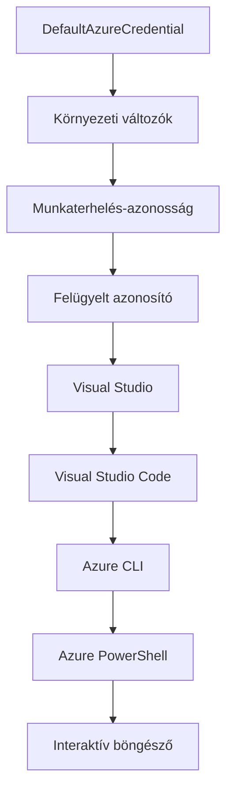

# AZD Alapok - Az Azure Developer CLI megértése

# AZD Alapok - Alapfogalmak és Alapelvek

**Fejezet navigáció:**
- **📚 Tanfolyam kezdőoldala**: [AZD Kezdőknek](../../README.md)
- **📖 Jelen fejezet**: 1. fejezet - Alapok és Gyors Kezdet
- **⬅️ Előző**: [Tanfolyam áttekintése](../../README.md#-chapter-1-foundation--quick-start)
- **➡️ Következő**: [Telepítés és Beállítás](installation.md)
- **🚀 Következő fejezet**: [2. fejezet: AI-első fejlesztés](../chapter-02-ai-development/microsoft-foundry-integration.md)

## Bevezetés

Ez az óra megismertet az Azure Developer CLI-vel (azd), egy olyan hatékony parancssori eszközzel, amely felgyorsítja az utadat a helyi fejlesztéstől az Azure-ba történő telepítésig. Meg fogod érteni az alapfogalmakat, a fő funkciókat, és azt, hogyan egyszerűsíti az azd a felhő natív alkalmazások telepítését.

## Tanulási célok

Az óra végére a következőket fogod tudni:
- Megérteni, mi az Azure Developer CLI és mi a fő célja
- Megismerni a sablonok, környezetek és szolgáltatások alapfogalmait
- Felfedezni a kulcsfontosságú funkciókat, beleértve a sablonvezérelt fejlesztést és az Infrastrukturát Kódként
- Megérteni az azd projekt szerkezetét és munkafolyamatát
- Felkészülni az azd telepítésére és konfigurálására a fejlesztői környezetedben

## Tanulási eredmények

Az óra elvégzése után képes leszel:
- Elmagyarázni az azd szerepét a modern felhőfejlesztési munkafolyamatokban
- Azonosítani az azd projekt szerkezetének elemeit
- Leírni, hogyan működnek együtt a sablonok, környezetek és szolgáltatások
- Megérteni az Infrastrukturakód előnyeit az azd-vel
- Felismerni az azd parancsokat és azok céljait

## Mi az Azure Developer CLI (azd)?

Az Azure Developer CLI (azd) egy parancssori eszköz, amely felgyorsítja az utadat a helyi fejlesztéstől az Azure-ba történő telepítésig. Egyszerűsíti a felhő natív alkalmazások építésének, telepítésének és kezelésének folyamatát az Azure-on.

### Mit lehet telepíteni az azd-vel?

Az azd sokféle munkaterhelést támogat - és a lista folyamatosan bővül. Ma az azd segítségével telepíthetsz:

| Munkaterhelés típusa | Példák | Ugyanaz a munkafolyamat? |
|---------------------|---------|--------------------------|
| **Hagyományos alkalmazások** | Webalkalmazások, REST API-k, statikus oldalak | ✅ `azd up` |
| **Szolgáltatások és mikroszolgáltatások** | Konténeralkalmazások, Funkcióalkalmazások, többszolgáltatásos hátterek | ✅ `azd up` |
| **Mesterséges intelligenciával támogatott alkalmazások** | Chat alkalmazások Microsoft Foundry modellekkel, RAG megoldások AI kereséssel | ✅ `azd up` |
| **Intelligens ügynökök** | Foundry által hosztolt ügynökök, többügynökös ügyvitel | ✅ `azd up` |

A kulcsfontosságú meglátás, hogy **az azd életciklusa ugyanaz marad attól függetlenül, mit telepítesz**. Inicializálsz egy projektet, előkészíted az infrastruktúrát, telepíted a kódot, figyelemmel kíséred az alkalmazást, majd takarítasz - akár egy egyszerű weboldalról, akár egy kifinomult AI ügynökről van szó.

Ez a folyamat szándékosan így van kialakítva. Az azd az AI képességeket egy másik szolgáltatásfajtának tekinti, amelyet az alkalmazás használhat, nem pedig alapvetően eltérő dolognak. Egy, a Microsoft Foundry modellekkel mögöttesen működő chat végpont az azd szemszögéből egy egyszerűen konfigurálandó és telepítendő szolgáltatás.

### 🎯 Miért használjuk az AZD-t? Egy valós összehasonlítás

Hasonlítsuk össze egy egyszerű webalkalmazás adatbázissal történő telepítését:

#### ❌ AZD NÉLKÜL: Manuális Azure telepítés (30+ perc)

```bash
# 1. lépés: Erőforráscsoport létrehozása
az group create --name myapp-rg --location eastus

# 2. lépés: App Service terv létrehozása
az appservice plan create --name myapp-plan \
  --resource-group myapp-rg \
  --sku B1 --is-linux

# 3. lépés: Webalkalmazás létrehozása
az webapp create --name myapp-web-unique123 \
  --resource-group myapp-rg \
  --plan myapp-plan \
  --runtime "NODE:18-lts"

# 4. lépés: Cosmos DB fiók létrehozása (10-15 perc)
az cosmosdb create --name myapp-cosmos-unique123 \
  --resource-group myapp-rg \
  --kind MongoDB

# 5. lépés: Adatbázis létrehozása
az cosmosdb mongodb database create \
  --account-name myapp-cosmos-unique123 \
  --resource-group myapp-rg \
  --name tododb

# 6. lépés: Gyűjtemény létrehozása
az cosmosdb mongodb collection create \
  --account-name myapp-cosmos-unique123 \
  --resource-group myapp-rg \
  --database-name tododb \
  --name todos

# 7. lépés: Kapcsolati karakterlánc lekérése
CONN_STR=$(az cosmosdb keys list \
  --name myapp-cosmos-unique123 \
  --resource-group myapp-rg \
  --type connection-strings \
  --query "connectionStrings[0].connectionString" -o tsv)

# 8. lépés: Alkalmazásbeállítások konfigurálása
az webapp config appsettings set \
  --name myapp-web-unique123 \
  --resource-group myapp-rg \
  --settings MONGODB_URI="$CONN_STR"

# 9. lépés: Naplózás engedélyezése
az webapp log config --name myapp-web-unique123 \
  --resource-group myapp-rg \
  --application-logging filesystem \
  --detailed-error-messages true

# 10. lépés: Application Insights beállítása
az monitor app-insights component create \
  --app myapp-insights \
  --location eastus \
  --resource-group myapp-rg

# 11. lépés: App Insights összekapcsolása a Webalkalmazással
INSTRUMENTATION_KEY=$(az monitor app-insights component show \
  --app myapp-insights \
  --resource-group myapp-rg \
  --query "instrumentationKey" -o tsv)

az webapp config appsettings set \
  --name myapp-web-unique123 \
  --resource-group myapp-rg \
  --settings APPINSIGHTS_INSTRUMENTATIONKEY="$INSTRUMENTATION_KEY"

# 12. lépés: Alkalmazás helyi építése
npm install
npm run build

# 13. lépés: Telepítési csomag létrehozása
zip -r app.zip . -x "*.git*" "node_modules/*"

# 14. lépés: Alkalmazás telepítése
az webapp deployment source config-zip \
  --resource-group myapp-rg \
  --name myapp-web-unique123 \
  --src app.zip

# 15. lépés: Várj és imádkozz, hogy működjön 🙏
# (Nincs automatikus érvényesítés, kézi tesztelés szükséges)
```

**Problémák:**
- ❌ Több mint 15 parancsot kell megjegyezni és sorrendben végrehajtani
- ❌ 30-45 percnyi kézi munka
- ❌ Könnyű hibázni (elírások, helytelen paraméterek)
- ❌ Kapcsolati adatok a terminál előzményekben is megtalálhatók
- ❌ Nem automatikus visszavonás hiba esetén
- ❌ Nehéz ismételni csapattagok számára
- ❌ Minden alkalommal más és más (nem reprodukálható)

#### ✅ AZD-VEL: Automatizált telepítés (5 parancs, 10-15 perc)

```bash
# 1. lépés: Inicializálás sablonból
azd init --template todo-nodejs-mongo

# 2. lépés: Hitelesítés
azd auth login

# 3. lépés: Környezet létrehozása
azd env new dev

# 4. lépés: Változások előnézete (opcionális, de ajánlott)
azd provision --preview

# 5. lépés: Minden telepítése
azd up

# ✨ Kész! Minden telepítve, konfigurálva és figyelve van
```

**Előnyök:**
- ✅ Csak **5 parancs** a 15+ kézi lépés helyett
- ✅ Teljes idő: **10-15 perc** (főleg Azure várakozás)
- ✅ Kevesebb kézi hiba - egységes, sablonvezérelt munkafolyamat
- ✅ Biztonságos titokkezelés - sok sablon Azure-kezelt titoktárolót használ
- ✅ Ismételhető telepítések - mindig ugyanaz a munkafolyamat
- ✅ Teljesen reprodukálható - mindig ugyanolyan eredmény
- ✅ Csapatbarát - bárki telepíthet ugyanazokkal a parancsokkal
- ✅ Infrastrukturakód - verziókezelt Bicep sablonok
- ✅ Beépített monitorozás - Application Insights automatikusan beállítva

### 📊 Idő- és hibacsökkenés

| Mutató | Manuális Telepítés | AZD Telepítés | Javulás |
|:-------|:-------------------|:--------------|:--------|
| **Parancsok száma** | 15+ | 5 | 67%-kal kevesebb |
| **Idő** | 30-45 perc | 10-15 perc | 60%-kal gyorsabb |
| **Hibaarány** | ~40% | <5% | 88%-os csökkenés |
| **Konzisztencia** | Alacsony (kézi) | 100% (automatizált) | Tökéletes |
| **Csapat bekapcsolás** | 2-4 óra | 30 perc | 75%-kal gyorsabb |
| **Visszavonás ideje** | 30+ perc (kézi) | 2 perc (automatizált) | 93%-kal gyorsabb |

## Alapfogalmak

### Sablonok
A sablonok az azd alapjai. Tartalmazzák:
- **Alkalmazáskód** - Forráskód és függőségek
- **Infrastruktúra definíciók** - Azure erőforrások Bicep vagy Terraform használatával definiálva
- **Konfigurációs fájlok** - Beállítások és környezeti változók
- **Telepítési szkriptek** - Automatizált telepítési munkafolyamatok

### Környezetek
A környezetek a különböző telepítési célállomásokat képviselik:
- **Fejlesztési** - Teszteléshez és fejlesztéshez
- **Tesztelési (Staging)** - Előgyártási környezet
- **Éles** - Éles, élő környezet

Minden környezet saját:
- Azure erőforráscsoporttal
- Konfigurációs beállításokkal
- Telepítési állapottal rendelkezik

### Szolgáltatások
A szolgáltatások az alkalmazás építőelemei:
- **Frontend** - Webalkalmazások, SPA-k
- **Backend** - API-k, mikroszolgáltatások
- **Adatbázis** - Adattárolási megoldások
- **Tárhely** - Fájl- és objektumtárolás

## Fő funkciók

### 1. Sablonvezérelt fejlesztés
```bash
# Böngészés a rendelkezésre álló sablonok között
azd template list

# Inicializálás egy sablon alapján
azd init --template <template-name>
```

### 2. Infrastrukturakód
- **Bicep** - Az Azure domain-specifikus nyelve
- **Terraform** - Többfelhős infrastruktúra eszköz
- **ARM Templates** - Azure Resource Manager sablonok

### 3. Integrált munkafolyamatok
```bash
# Teljes telepítési munkafolyamat
azd up            # Előkészítés + Telepítés, ez első alkalommal automatikus

# 🧪 ÚJ: Tekintsd át az infrastruktúra változásait telepítés előtt (BIZTONSÁGOS)
azd provision --preview    # Szimuláld az infrastruktúra telepítését anélkül, hogy változtatnál

azd provision     # Hozz létre Azure-erőforrásokat, ha frissíted az infrastruktúrát, használd ezt
azd deploy        # Alkalmazáskód telepítése vagy újratelepítése frissítés után
azd down          # Erőforrások takarítása
```

#### 🛡️ Biztonságos infrastruktúra-tervezés előnézettel
Az `azd provision --preview` parancs forradalmi a biztonságos telepítésekhez:
- **Próbafutás elemzés** - Megmutatja, mi fog létrejönni, módosulni vagy törlődni
- **Zéró kockázat** - Nem történik tényleges változtatás az Azure környezetben
- **Csapatmunka** - Megoszthatod az előnézeti eredményeket telepítés előtt
- **Költségbecslés** - Előzetesen átláthatod az erőforrásköltségeket

```bash
# Példa előnézeti munkafolyamat
azd provision --preview           # Nézd meg, mi fog változni
# Ellenőrizd a kimenetet, beszéld meg a csapattal
azd provision                     # Alkalmazd a változtatásokat magabiztosan
```

### 📊 Ábra: AZD fejlesztési munkafolyamat


**Munkafolyamat magyarázat:**
1. **Init** - Sablonnal vagy új projekttel kezdés
2. **Auth** - Azure-ba történő hitelesítés
3. **Environment** - Elkülönített telepítési környezet létrehozása
4. **Preview** - 🆕 Mindig előnézet a infrastruktúraváltoztatásokhoz (biztonságos gyakorlat)
5. **Provision** - Azure erőforrások létrehozása/frissítése
6. **Deploy** - Alkalmazáskód feltöltése
7. **Monitor** - Alkalmazás teljesítményének figyelése
8. **Iterate** - Változtatás és újratelepítés
9. **Cleanup** - Erőforrások eltávolítása munka végeztével

### 4. Környezetkezelés
```bash
# Környezetek létrehozása és kezelése
azd env new <environment-name>
azd env select <environment-name>
azd env list
```

### 5. Bővítmények és AI parancsok

Az azd bővítményrendszert használ a központi CLI képességein túlmutató funkciók hozzáadására. Ez különösen hasznos AI munkaterhelésekhez:

```bash
# Bővítmények listázása
azd extension list

# A Foundry Agents bővítmény telepítése
azd extension install azure.ai.agents

# AI ügynök projekt inicializálása egy manifeszt alapján
azd ai agent init -m agent-manifest.yaml

# MCP szerver indítása AI-támogatott fejlesztéshez (Alfa)
azd mcp start
```

> A bővítményeket részletesen tárgyalja a [2. fejezet: AI-első fejlesztés](../chapter-02-ai-development/agents.md) és az [AZD AI CLI Parancsok](../chapter-08-production/production-ai-practices.md#azd-ai-cli-commands-and-extensions) dokumentáció.

## 📁 Projekt szerkezete

Egy tipikus azd projekt szerkezete:
```
my-app/
├── .azd/                    # azd configuration
│   └── config.json
├── .azure/                  # Azure deployment artifacts
├── .devcontainer/          # Development container config
├── .github/workflows/      # GitHub Actions
├── .vscode/               # VS Code settings
├── infra/                 # Infrastructure code
│   ├── main.bicep        # Main infrastructure template
│   ├── main.parameters.json
│   └── modules/          # Reusable modules
├── src/                  # Application source code
│   ├── api/             # Backend services
│   └── web/             # Frontend application
├── azure.yaml           # azd project configuration
└── README.md
```

## 🔧 Konfigurációs fájlok

### azure.yaml
A fő projekt konfigurációs fájlja:
```yaml
name: my-awesome-app
metadata:
  template: my-template@1.0.0

services:
  web:
    project: ./src/web
    language: js
    host: appservice
  api:
    project: ./src/api
    language: js
    host: appservice

hooks:
  preprovision:
    shell: pwsh
    run: echo "Preparing to provision..."
```

### .azure/config.json
Környezet-specifikus konfiguráció:
```json
{
  "version": 1,
  "defaultEnvironment": "dev",
  "environments": {
    "dev": {
      "subscriptionId": "your-subscription-id",
      "location": "eastus"
    }
  }
}
```

## 🎪 Gyakori munkafolyamatok gyakorlati feladatokkal

> **💡 Tanulási tipp:** Kövesd ezeket a feladatokat sorrendben, hogy fokozatosan fejleszd AZD képességeidet.

### 🎯 1. gyakorlat: Első projektem inicializálása

**Cél:** Hozz létre egy AZD projektet és fedezd fel a szerkezetét

**Lépések:**
```bash
# Használjon bevált sablont
azd init --template todo-nodejs-mongo

# Fedezze fel a generált fájlokat
ls -la  # Tekintse meg az összes fájlt, beleértve a rejtetteket is

# Létrehozott kulcsfájlok:
# - azure.yaml (fő konfiguráció)
# - infra/ (infrastruktúra kód)
# - src/ (alkalmazás kód)
```

**✅ Siker:** Megvannak az azure.yaml, infra/ és src/ könyvtárak

---

### 🎯 2. gyakorlat: Telepítés Azure-ba

**Cél:** Teljes körű telepítés végrehajtása

**Lépések:**
```bash
# 1. Hitelesítés
az login && azd auth login

# 2. Környezet létrehozása
azd env new dev
azd env set AZURE_LOCATION eastus

# 3. Változtatások előnézete (AJÁNLOTT)
azd provision --preview

# 4. Minden telepítése
azd up

# 5. A telepítés ellenőrzése
azd show    # Az alkalmazás URL-jének megtekintése
```

**Várt idő:** 10-15 perc  
**✅ Siker:** Az alkalmazás URL-je megnyílik a böngészőben

---

### 🎯 3. gyakorlat: Több környezet

**Cél:** Telepítés fejlesztési és tesztelési környezetbe

**Lépések:**
```bash
# Már van dev, létrehoz staging
azd env new staging
azd env set AZURE_LOCATION westus2
azd up

# Váltás közöttük
azd env list
azd env select dev
```

**✅ Siker:** Két külön erőforráscsoport az Azure portálban

---

### 🛡️ Tiszta lap: `azd down --force --purge`

Amikor teljes visszaállításra van szükség:

```bash
azd down --force --purge
```

**Mit csinál:**
- `--force`: Nincs megerősítés kérése
- `--purge`: Minden helyi állapotot és Azure erőforrást töröl

**Használat amikor:**
- A telepítés félbeszakadt menet közben
- Projektet váltasz
- Friss kezdés kell

---

## 🎪 Eredeti munkafolyamat hivatkozás

### Új projekt indítása
```bash
# Módszer 1: Használja a meglévő sablont
azd init --template todo-nodejs-mongo

# Módszer 2: Kezdje nulláról
azd init

# Módszer 3: Használja a jelenlegi könyvtárat
azd init .
```

### Fejlesztési ciklus
```bash
# Fejlesztési környezet beállítása
azd auth login
azd env new dev
azd env select dev

# Minden telepítése
azd up

# Változtatások végrehajtása és újratelepítés
azd deploy

# Takarítás a befejezés után
azd down --force --purge # Az Azure Developer CLI parancsa egy **kemény visszaállítás** a környezeted számára – különösen hasznos, amikor sikertelen telepítéseket hibakeresel, elhagyott erőforrásokat takarítasz vagy friss újratelepítésre készülsz.
```

## Az `azd down --force --purge` megértése
Az `azd down --force --purge` egy erőteljes parancs az azd környezet és az összes kapcsolódó erőforrás teljes lebontására. Íme, mit csinál az egyes kapcsoló:
```
--force
```
- Kihagyja a megerősítés kéréseket.
- Hasznos automatizálás vagy szkriptelés esetén, ahol nem lehet kézi beavatkozás.
- Biztosítja, hogy a bontás megszakítás nélkül folyjon, még ha a CLI észlel is inkonzisztenciákat.

```
--purge
```
Töröl **minden kapcsolódó metaadatot**, beleértve:
- Környezet állapotát
- A helyi `.azure` mappát
- Gyorsítótárazott telepítési infofájlokat
- Megakadályozza, hogy az azd "emlékezzen" a korábbi telepítésekre, amelyek problémákat okozhatnak, mint például eltérő erőforrás csoportok vagy elavult regisztrációs hivatkozások.

### Miért használjuk mindkettőt?
Ha az `azd up` parancs félrecsúszik a maradvány állapot vagy részleges telepítések miatt, ez a kombináció biztosítja a **tiszta lapot**.

Különösen hasznos kézi erőforrás törlések után az Azure portálon vagy sablon, környezet, illetve erőforrás csoport elnevezési konvenciók váltásakor.

### Több környezet kezelése
```bash
# Staging környezet létrehozása
azd env new staging
azd env select staging
azd up

# Visszaváltás a fejlesztői környezetre
azd env select dev

# Környezetek összehasonlítása
azd env list
```

## 🔐 Hitelesítés és Hitelesítő adatok

A hitelesítés megértése kulcsfontosságú az sikeres azd telepítésekhez. Az Azure több hitelesítési módszert használ, és az azd ugyanazt a hitelesítő láncot használja, mint más Azure eszközök.

### Azure CLI hitelesítés (`az login`)

Az azd használata előtt autentikálnod kell az Azure-ba. A leggyakoribb módszer az Azure CLI használata:

```bash
# Interaktív bejelentkezés (megnyitja a böngészőt)
az login

# Bejelentkezés konkrét bérlővel
az login --tenant <tenant-id>

# Bejelentkezés szolgáltatásfiókkal
az login --service-principal -u <app-id> -p <password> --tenant <tenant-id>

# Jelenlegi bejelentkezési állapot ellenőrzése
az account show

# Elérhető előfizetések listázása
az account list --output table

# Alapértelmezett előfizetés beállítása
az account set --subscription <subscription-id>
```

### Hitelesítési folyamat
1. **Interaktív bejelentkezés**: Megnyitja az alapértelmezett böngészőt a hitelesítéshez
2. **Eszközkódos folyamat**: Böngésző nélküli környezetekhez
3. **Szolgáltatásfiók (Service Principal)**: Automatizálás és CI/CD forgatókönyvekhez
4. **Kezelt identitás**: Azure hosztolt alkalmazásokhoz

### DefaultAzureCredential lánc

A `DefaultAzureCredential` egy hitelesítő típus, amely leegyszerűsíti a hitelesítést azzal, hogy automatikusan több hitelesítő forrást próbál sorban:

#### Hitelesítő lánc sorrendje

#### 1. Környezeti változók
```bash
# Környezeti változók beállítása a szolgáltatás-principal számára
export AZURE_CLIENT_ID="<app-id>"
export AZURE_CLIENT_SECRET="<password>"
export AZURE_TENANT_ID="<tenant-id>"
```

#### 2. Munkaterhelés-azonosító (Kubernetes/GitHub Actions)
Automatikusan használva:
- Azure Kubernetes Service (AKS) Workload Identity-vel
- GitHub Actions OIDC szövetségi hitelesítéssel
- Más szövetségi identitás forgatókönyvekben

#### 3. Kezelt identitás
Azure erőforrásoknál, mint:
- Virtuális gépek
- App Service
- Azure Functions
- Konténerpéldányok

```bash
# Ellenőrizze, hogy az Azure erőforrás kezelt identitással fut-e
az account show --query "user.type" --output tsv
# Visszatérés: "servicePrincipal", ha kezelt identitást használ
```

#### 4. Fejlesztői eszközök integrációja
- **Visual Studio**: Automatikusan használja a bejelentkezett fiókot
- **VS Code**: Azure Account kiterjesztés hitelesítő adatait
- **Azure CLI**: Az `az login` hitelesítő adatait használja (leggyakoribb helyi fejlesztéshez)

### AZD hitelesítési beállítás

```bash
# 1. módszer: Azure CLI használata (Fejlesztéshez ajánlott)
az login
azd auth login  # Meglévő Azure CLI hitelesítő adatok használata

# 2. módszer: Közvetlen azd hitelesítés
azd auth login --use-device-code  # Fej nélküli környezetekhez

# 3. módszer: Hitelesítési állapot ellenőrzése
azd auth login --check-status

# 4. módszer: Kijelentkezés és újbóli hitelesítés
azd auth logout
azd auth login
```

### Hitelesítési legjobb gyakorlatok

#### Helyi fejlesztéshez
```bash
# 1. Jelentkezzen be az Azure CLI-vel
az login

# 2. Ellenőrizze a helyes előfizetést
az account show
az account set --subscription "Your Subscription Name"

# 3. Használja az azd-t a meglévő hitelesítő adatokkal
azd auth login
```

#### CI/CD folyamatokhoz
```yaml
# GitHub Actions example
- name: Azure Login
  uses: azure/login@v1
  with:
    creds: ${{ secrets.AZURE_CREDENTIALS }}

- name: Deploy with azd
  run: |
    azd auth login --client-id ${{ secrets.AZURE_CLIENT_ID }} \
                    --client-secret ${{ secrets.AZURE_CLIENT_SECRET }} \
                    --tenant-id ${{ secrets.AZURE_TENANT_ID }}
    azd up --no-prompt
```

#### Éles környezetekhez
- Használj **Kezelt identitást** Azure erőforrásokon futtatva
- Használj **Szolgáltatásfiókot** automatizált forgatókönyvekhez
- Kerüld a hitelesítő adatok kódba vagy konfigurációs fájlba mentését
- Használd az **Azure Key Vaultot** érzékeny konfigurációkhoz

### Gyakori hitelesítési problémák és megoldások

#### Probléma: "Nem található előfizetés"
```bash
# Megoldás: Állítsa be az alapértelmezett előfizetést
az account list --output table
az account set --subscription "<subscription-id>"
azd env set AZURE_SUBSCRIPTION_ID "<subscription-id>"
```

#### Probléma: "Nincs elegendő jogosultság"
```bash
# Megoldás: Ellenőrizze és adja hozzá a szükséges szerepköröket
az role assignment list --assignee $(az account show --query user.name --output tsv)

# Általános szükséges szerepkörök:
# - Közreműködő (erőforrás kezeléshez)
# - Felhasználói hozzáférés adminisztrátor (szerepkör hozzárendelésekhez)
```

#### Probléma: "Token lejárt"
```bash
# Megoldás: Újra hitelesítés
az logout
az login
azd auth logout
azd auth login
```

### Hitelesítés különböző forgatókönyvekben

#### Helyi fejlesztés
```bash
# Személyes fejlesztési számla
az login
azd auth login
```

#### Csapatmunka fejlesztése
```bash
# Használjon konkrét bérlőt a szervezethez
az login --tenant contoso.onmicrosoft.com
azd auth login
```

#### Több bérlős forgatókönyvek
```bash
# Váltás bérlők között
az login --tenant tenant1.onmicrosoft.com
# Telepítés az 1-es bérlőhöz
azd up

az login --tenant tenant2.onmicrosoft.com  
# Telepítés a 2-es bérlőhöz
azd up
```

### Biztonsági szempontok
1. **Hitelesítő adatok tárolása**: Soha ne tárolj hitelesítő adatokat a forráskódban  
2. **Hatókör korlátozása**: Használd a legkisebb jogosultság elvét a szolgáltatás-főszereplők esetén  
3. **Token forgatás**: Rendszeresen cseréld a szolgáltatás-főszereplő titkait  
4. **Ellenőrzési napló**: Kövesd nyomon a hitelesítési és telepítési műveleteket  
5. **Hálózati biztonság**: Használj privát végpontokat, ahol csak lehet  

### Hitelesítési hibakeresés  

```bash
# Hitelesítési problémák hibakeresése
azd auth login --check-status
az account show
az account get-access-token

# Gyakori diagnosztikai parancsok
whoami                          # Jelenlegi felhasználói környezet
az ad signed-in-user show      # Azure AD felhasználói adatok
az group list                  # Erőforrás-hozzáférés tesztelése
```
  
## Az `azd down --force --purge` megértése  

### Felfedezés  
```bash
azd template list              # Sablonok böngészése
azd template show <template>   # Sablon részletei
azd init --help               # Inicializálási lehetőségek
```
  
### Projektkezelés  
```bash
azd show                     # Projekt áttekintés
azd env list                # Elérhető környezetek és kiválasztott alapértelmezett
azd config show            # Konfigurációs beállítások
```
  
### Megfigyelés  
```bash
azd monitor                  # Azure portál megnyitása a felügyelethez
azd monitor --logs           # Alkalmazásnaplók megtekintése
azd monitor --live           # Élő metrikák megtekintése
azd pipeline config          # CI/CD beállítása
```
  
## Legjobb gyakorlatok  

### 1. Használj értelmes neveket  
```bash
# Jó
azd env new production-east
azd init --template web-app-secure

# Kerülje
azd env new env1
azd init --template template1
```
  
### 2. Használj sablonokat  
- Indulj meglévő sablonokkal  
- Testreszabás a saját igényeid szerint  
- Készíts újrahasználható sablonokat szervezeted számára  

### 3. Környezetek elkülönítése  
- Használj külön környezeteket fejlesztéshez, teszteléshez és éles használathoz  
- Soha ne telepíts közvetlenül helyi gépről éles környezetbe  
- Használj CI/CD folyamatokat az éles telepítéshez  

### 4. Konfiguráció menedzsment  
- Érzékeny adatokhoz használj környezeti változókat  
- Tartsd a konfigurációt verziókezelés alatt  
- Dokumentáld a környezetspecifikus beállításokat  

## Tanulási folyamat  

### Kezdő (1-2. hét)  
1. Telepítsd az azd-t és hitelesíts  
2. Telepíts egy egyszerű sablont  
3. Ismerd meg a projekt szerkezetét  
4. Tanuld meg az alapvető parancsokat (up, down, deploy)  

### Középhaladó (3-4. hét)  
1. Testreszabott sablonok  
2. Több környezet kezelése  
3. Infrastruktúra kód megértése  
4. CI/CD folyamatok beállítása  

### Haladó (5+ hét)  
1. Egyedi sablonok készítése  
2. Haladó infrastruktúra minták  
3. Több régiós telepítések  
4. Vállalati szintű konfigurációk  

## Következő lépések  

**📖 Folytasd az 1. fejezet tanulását:**  
- [Telepítés és beállítás](installation.md) – Az azd telepítése és konfigurálása  
- [Az első projekted](first-project.md) – Gyakorlati lépésről lépésre útmutató  
- [Konfigurációs útmutató](configuration.md) – Haladó konfigurációs lehetőségek  

**🎯 Kész a következő fejezetre?**  
- [2. fejezet: AI-első fejlesztés](../chapter-02-ai-development/microsoft-foundry-integration.md) – Kezdj AI alkalmazások fejlesztésébe  

## További források  

- [Azure Developer CLI áttekintés](https://learn.microsoft.com/en-us/azure/developer/azure-developer-cli/)  
- [Sablongyűjtemény](https://azure.github.io/awesome-azd/)  
- [Közösségi példák](https://github.com/Azure-Samples)  

---  

## 🙋 Gyakori kérdések  

### Általános kérdések  

**K: Mi a különbség az AZD és az Azure CLI között?**  

V: Az Azure CLI (`az`) egyedi Azure erőforrások kezelésére szolgál. Az AZD (`azd`) egész alkalmazások kezelésére:  

```bash
# Azure CLI - Alacsony szintű erőforrás-kezelés
az webapp create --name myapp --resource-group rg
az sql server create --name myserver --resource-group rg
# ...még sok más parancs szükséges

# AZD - Alkalmazás szintű kezelés
azd up  # Az egész alkalmazás telepítése az összes erőforrással együtt
```
  
**Így gondolj rá:**  
- `az` = Egyéni LEGO elemekkel dolgozol  
- `azd` = Teljes LEGO készleteket építesz  

---  

**K: Kell-e ismernem a Bicep-et vagy Terraformot az AZD használatához?**  

V: Nem! Kezdj sablonokkal:  
```bash
# Használja a meglévő sablont - nincs szükség IaC ismeretre
azd init --template todo-nodejs-mongo
azd up
```
  
Később megtanulhatod a Bicep-et az infrastruktúra testreszabásához. A sablonok kész példákat adnak.  

---  

**K: Mennyibe kerül az AZD sablonok futtatása?**  

V: A költség sablononként változik. A legtöbb fejlesztői sablon havi 50-150 USD között van:  

```bash
# Előnézet a költségekről a telepítés előtt
azd provision --preview

# Mindig takarítsd el, ha nem használod
azd down --force --purge  # Minden erőforrást eltávolít
```
  
**Profitanács:** Használd az ingyenes szinteket, ahol elérhetőek:  
- App Service: F1 (ingyenes) szint  
- Microsoft Foundry modellek: Azure OpenAI havi 50 000 token ingyen  
- Cosmos DB: 1000 RU/s ingyenes szint  

---  

**K: Használhatom-e az AZD-t meglévő Azure erőforrásokkal?**  

V: Igen, de könnyebb tiszta lappal kezdeni. Az AZD akkor működik a legjobban, ha teljes életciklust kezel. Meglévő erőforrásokhoz:  

```bash
# 1. lehetőség: Létező erőforrások importálása (haladó)
azd init
# Ezután módosítsa az infra/-t, hogy hivatkozzon a meglévő erőforrásokra

# 2. lehetőség: Kezdje elölről (ajánlott)
azd init --template matching-your-stack
azd up  # Új környezet létrehozása
```
  
---  

**K: Hogyan oszthatom meg a projektet a csapattársakkal?**  

V: Az AZD projektet Gitbe kell commitálni (de a .azure mappát NEM):  

```bash
# Alapértelmezetten már a .gitignore-ban van
.azure/        # Titkokat és környezeti adatokat tartalmaz
*.env          # Környezeti változók

# Csapattagok akkor:
git clone <your-repo>
azd auth login
azd env new <their-name>-dev
azd up
```
  
Mindenki ugyanazt az infrastruktúrát kapja ugyanabból a sablonból.  

---  

### Hibakeresési kérdések  

**K: Az „azd up” félúton hibát dobott. Mit tegyek?**  

V: Nézd meg a hibát, javítsd, majd próbáld újra:  

```bash
# Részletes naplók megtekintése
azd show

# Gyakori javítások:

# 1. Ha kvóta túllépve:
azd env set AZURE_LOCATION "westus2"  # Próbáljon másik régiót

# 2. Ha erőforrásnév konfliktus van:
azd down --force --purge  # Tiszta lap
azd up  # Próbálja újra

# 3. Ha az authentikáció lejárt:
az login
azd auth login
azd up
```
  
**Leggyakoribb probléma:** Rossz Azure előfizetés van kiválasztva  
```bash
az account list --output table
az account set --subscription "<correct-subscription>"
```
  
---  

**K: Hogyan telepíthetek csak kódváltozásokat újraprovisionálás nélkül?**  

V: Használd az `azd deploy` parancsot az `azd up` helyett:  

```bash
azd up          # Első alkalommal: előkészítés + telepítés (lassú)

# Kód módosítások...

azd deploy      # Következő alkalommal: csak telepítés (gyors)
```
  
Sebesség összehasonlítás:  
- `azd up`: 10-15 perc (infrastruktúra kiépítése)  
- `azd deploy`: 2-5 perc (csak kód)  

---  

**K: Személyre szabhatom az infrastruktúra sablonokat?**  

V: Igen! Szerkeszd a Bicep fájlokat az `infra/` mappában:  

```bash
# Azd init után
cd infra/
code main.bicep  # Szerkesztés VS Code-ban

# Változtatások előnézete
azd provision --preview

# Változtatások alkalmazása
azd provision
```
  
**Tipp:** Kezdd kicsiben – először a SKU-k módosítása:  
```bicep
// infra/main.bicep
sku: {
  name: 'B1'  // Change to 'P1V2' for production
}
```
  
---  

**K: Hogyan töröljem az összes AZD által létrehozott erőforrást?**  

V: Egyetlen parancs minden forrást eltávolít:  

```bash
azd down --force --purge

# Ez törli:
# - Minden Azure erőforrást
# - Erőforráscsoportot
# - Helyi környezeti állapotot
# - Gyorsítótárazott telepítési adatokat
```
  
**Mindig futtasd, ha:**  
- Tesztelés után befejezted a sablont  
- Másik projektre váltasz  
- Tiszta lappal szeretnél kezdeni  

**Költségmegtakarítás:** Nem használt erőforrások törlése = 0 költség  

---  

**K: Mi van, ha véletlenül töröltem erőforrásokat az Azure portálon?**  

V: Az AZD állapota eltérhet. Indíts tiszta lappal:  

```bash
# 1. Távolítsa el a helyi állapotot
azd down --force --purge

# 2. Kezdje tiszta lappal
azd up

# Alternatíva: Engedje, hogy az AZD felismerje és kijavítsa
azd provision  # Létrehozza a hiányzó erőforrásokat
```
  
---  

### Haladó kérdések  

**K: Használhatom az AZD-t CI/CD folyamatokban?**  

V: Igen! GitHub Actions példa:  

```yaml
# .github/workflows/deploy.yml
name: Deploy with AZD

on:
  push:
    branches: [main]

jobs:
  deploy:
    runs-on: ubuntu-latest
    steps:
      - uses: actions/checkout@v2
      
      - name: Install azd
        run: curl -fsSL https://aka.ms/install-azd.sh | bash
      
      - name: Azure Login
        run: |
          azd auth login \
            --client-id ${{ secrets.AZURE_CLIENT_ID }} \
            --client-secret ${{ secrets.AZURE_CLIENT_SECRET }} \
            --tenant-id ${{ secrets.AZURE_TENANT_ID }}
      
      - name: Deploy
        run: azd up --no-prompt
```
  
---  

**K: Hogyan kezeljem a titkokat és érzékeny adatokat?**  

V: Az AZD automatikusan integrálódik az Azure Key Vault-tal:  

```bash
# Titkok a Key Vaultban vannak tárolva, nem a kódban
azd env set DATABASE_PASSWORD "$(openssl rand -base64 32)"

# Az AZD automatikusan:
# 1. Létrehozza a Key Vaultot
# 2. Tárolja a titkot
# 3. Hozzáférést ad az alkalmazásnak Kezelt Identitáson keresztül
# 4. Futásidőben injektálja
```
  
**Soha ne commitáld:**  
- `.azure/` mappa (környezeti adatok)  
- `.env` fájlok (helyi titkok)  
- Kapcsolati karakterláncok  

---  

**K: Telepíthetek több régióba egyszerre?**  

V: Igen, hozz létre környezetet régiónként:  

```bash
# Kelet US környezet
azd env new prod-eastus
azd env set AZURE_LOCATION eastus
azd up

# Nyugat Európa környezet
azd env new prod-westeurope
azd env set AZURE_LOCATION westeurope
azd up

# Minden környezet független
azd env list
```
  
Több régiós alkalmazásoknál testre kell szabni a Bicep sablonokat, hogy párhuzamosan telepítsenek több régióba.  

---  

**K: Hol kaphatok segítséget, ha elakadok?**  

1. **AZD dokumentáció:** https://learn.microsoft.com/azure/developer/azure-developer-cli/  
2. **GitHub Issues:** https://github.com/Azure/azure-dev/issues  
3. **Discord:** [Azure Discord](https://discord.gg/microsoft-azure) - #azure-developer-cli csatorna  
4. **Stack Overflow:** `azure-developer-cli` címke  
5. **Ez a kurzus:** [Hibakeresési útmutató](../chapter-07-troubleshooting/common-issues.md)  

**Profitanács:** Kérdés előtt futtasd a következőt:  
```bash
azd show       # Megjeleníti az aktuális állapotot
azd version    # Megjeleníti a verziódat
```
  
Így gyorsabban kaphatsz segítséget.  

---  

## 🎓 Mi következik?  

Most már érted az AZD alapjait. Válaszd ki az utadat:  

### 🎯 Kezdőknek:  
1. **Következő:** [Telepítés és beállítás](installation.md) – Az AZD telepítése a gépeden  
2. **Ezután:** [Az első projekted](first-project.md) – Telepítsd első alkalmazásod  
3. **Gyakorolj:** Tedd meg mindhárom feladatot ebben a leckében  

### 🚀 AI fejlesztőknek:  
1. **Ugorj:** [2. fejezet: AI-első fejlesztés](../chapter-02-ai-development/microsoft-foundry-integration.md)  
2. **Telepíts:** Kezdd az `azd init --template get-started-with-ai-chat` sablonnal  
3. **Tanulj:** Építs miközben telepítesz  

### 🏗️ Tapasztalt fejlesztőknek:  
1. **Ismételd át:** [Konfigurációs útmutató](configuration.md) – Haladó beállítások  
2. **Fedezd fel:** [Infrastruktúra kódként](../chapter-04-infrastructure/provisioning.md) – Mély Bicep tanulmányozás  
3. **Építs:** Készíts egyedi sablonokat a saját stackedhez  

---  

**Fejezet navigáció:**  
- **📚 Kurzus kezdőlap:** [AZD kezdőknek](../../README.md)  
- **📖 Jelenlegi fejezet:** 1. fejezet - Alapok és gyors indulás  
- **⬅️ Előző:** [Kurzus áttekintés](../../README.md#-chapter-1-foundation--quick-start)  
- **➡️ Következő:** [Telepítés és beállítás](installation.md)  
- **🚀 Következő fejezet:** [2. fejezet: AI-első fejlesztés](../chapter-02-ai-development/microsoft-foundry-integration.md)

---

<!-- CO-OP TRANSLATOR DISCLAIMER START -->
**Jogi nyilatkozat**:  
Ez a dokumentum az [Co-op Translator](https://github.com/Azure/co-op-translator) AI fordító szolgáltatásával készült. Bár a pontosságra törekszünk, kérjük, vegye figyelembe, hogy az automatikus fordítások hibákat vagy pontatlanságokat tartalmazhatnak. Az eredeti dokumentum az anyanyelvén tekintendő irányadónak. Fontos információk esetén szakmai emberi fordítás javasolt. Nem vállalunk felelősséget a fordítás használatából eredő félreértésekért vagy értelmezési hibákért.
<!-- CO-OP TRANSLATOR DISCLAIMER END -->