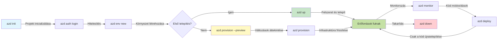
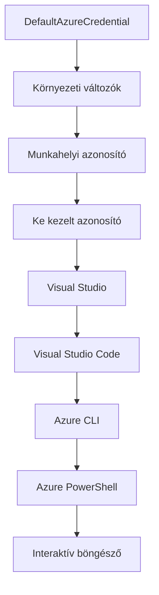

# AZD Alapok - Az Azure Developer CLI megértése

# AZD Alapok - Alapfogalmak és alapelvek

**Fejezet navigáció:**
- **📚 Tanfolyam főoldal**: [AZD Kezdőknek](../../README.md)
- **📖 Aktuális fejezet**: 1. fejezet - Alapok és gyorsindítás
- **⬅️ Előző**: [Tanfolyam áttekintése](../../README.md#-chapter-1-foundation--quick-start)
- **➡️ Következő**: [Telepítés és beállítás](installation.md)
- **🚀 Következő fejezet**: [2. fejezet: AI-első fejlesztés](../chapter-02-ai-development/microsoft-foundry-integration.md)

## Bevezetés

Ez a lecke bemutatja az Azure Developer CLI-t (azd), egy hatékony parancssori eszközt, amely felgyorsítja az utadat a helyi fejlesztéstől az Azure telepítésig. Megtudhatod az alapvető fogalmakat, a főbb funkciókat, és megértheted, hogyan egyszerűsíti az azd a felhőnatív alkalmazások telepítését.

## Tanulási célok

A lecke végére képes leszel:
- Megérteni, mi az Azure Developer CLI és mi a fő célja
- Megismerni a sablonok, környezetek és szolgáltatások alapfogalmait
- Felfedezni a kulcsfontosságú funkciókat, beleértve a sablonvezérelt fejlesztést és az infrastruktúrát kód formájában
- Megérteni az azd projektstruktúrát és munkafolyamatot
- Felkészülni az azd telepítésére és konfigurálására a fejlesztői környezetedben

## Tanulási eredmények

A lecke elvégzése után képes leszel:
- Elmagyarázni az azd szerepét a modern felhőfejlesztési munkafolyamatokban
- Azonosítani az azd projekt struktúrájának összetevőit
- Leírni, hogyan működnek együtt a sablonok, környezetek és szolgáltatások
- Megérteni az Infrastructure as Code előnyeit az azddal
- Felismerni az azd különböző parancsait és azok célját

## Mi az Azure Developer CLI (azd)?

Az Azure Developer CLI (azd) egy parancssori eszköz, amely felgyorsítja az utadat a helyi fejlesztéstől az Azure telepítésig. Egyszerűsíti a felhőnatív alkalmazások építését, telepítését és kezelését az Azure-on.

### Mit telepíthetsz az azddal?

Az azd sokféle munkaterhelést támogat – és a lista folyamatosan bővül. Ma az azd használható például:

| Munkaterhelés típusa | Példák | Ugyanaz a munkafolyamat? |
|----------------------|--------|--------------------------|
| **Hagyományos alkalmazások** | Webalkalmazások, REST API-k, statikus oldalak | ✅ `azd up` |
| **Szolgáltatások és mikroszolgáltatások** | Konténeralkalmazások, Function Apps, több szolgáltatásos backendek | ✅ `azd up` |
| **AI-alapú alkalmazások** | Chat alkalmazások Microsoft Foundry modellekkel, RAG megoldások AI kereséssel | ✅ `azd up` |
| **Intelligens ügynökök** | Foundry hosztolt ügynökök, több ügynökös koordinációk | ✅ `azd up` |

A legfontosabb felismerés, hogy **az azd életciklusa ugyanaz marad, függetlenül attól, hogy mit telepítesz**. Elindítod a projektet, előkészíted az infrastruktúrát, telepíted a kódod, figyelemmel kíséred az alkalmazást, és takarítasz – akár egyszerű weboldal, akár fejlett AI ügynök.

Ez a folytonosság szándékos. Az azd az AI képességeket egy másik szolgáltatásként kezeli, amit az alkalmazásod használhat, nem pedig alapvetően különbözőként. Egy Microsoft Foundry modellekkel támogatott chat végpont az azd szemszögéből egy egyszerűen konfigurálandó és telepítendő szolgáltatás.

### 🎯 Miért használd az AZD-t? Egy valós összehasonlítás

Nézzük meg egy egyszerű webalkalmazás adatbázissal történő telepítését:

#### ❌ AZD NÉLKÜL: Manuális Azure telepítés (30+ perc)

```bash
# 1. lépés: Hozzon létre erőforráscsoportot
az group create --name myapp-rg --location eastus

# 2. lépés: Hozzon létre App Service tervet
az appservice plan create --name myapp-plan \
  --resource-group myapp-rg \
  --sku B1 --is-linux

# 3. lépés: Hozzon létre Webalkalmazást
az webapp create --name myapp-web-unique123 \
  --resource-group myapp-rg \
  --plan myapp-plan \
  --runtime "NODE:18-lts"

# 4. lépés: Hozzon létre Cosmos DB fiókot (10-15 perc)
az cosmosdb create --name myapp-cosmos-unique123 \
  --resource-group myapp-rg \
  --kind MongoDB

# 5. lépés: Hozzon létre adatbázist
az cosmosdb mongodb database create \
  --account-name myapp-cosmos-unique123 \
  --resource-group myapp-rg \
  --name tododb

# 6. lépés: Hozzon létre gyűjteményt
az cosmosdb mongodb collection create \
  --account-name myapp-cosmos-unique123 \
  --resource-group myapp-rg \
  --database-name tododb \
  --name todos

# 7. lépés: Szerezze be a kapcsolati karakterláncot
CONN_STR=$(az cosmosdb keys list \
  --name myapp-cosmos-unique123 \
  --resource-group myapp-rg \
  --type connection-strings \
  --query "connectionStrings[0].connectionString" -o tsv)

# 8. lépés: Állítsa be az alkalmazás beállításait
az webapp config appsettings set \
  --name myapp-web-unique123 \
  --resource-group myapp-rg \
  --settings MONGODB_URI="$CONN_STR"

# 9. lépés: Engedélyezze a naplózást
az webapp log config --name myapp-web-unique123 \
  --resource-group myapp-rg \
  --application-logging filesystem \
  --detailed-error-messages true

# 10. lépés: Állítsa be az Application Insights szolgáltatást
az monitor app-insights component create \
  --app myapp-insights \
  --location eastus \
  --resource-group myapp-rg

# 11. lépés: Kapcsolja össze az App Insights-ot a Webalkalmazással
INSTRUMENTATION_KEY=$(az monitor app-insights component show \
  --app myapp-insights \
  --resource-group myapp-rg \
  --query "instrumentationKey" -o tsv)

az webapp config appsettings set \
  --name myapp-web-unique123 \
  --resource-group myapp-rg \
  --settings APPINSIGHTS_INSTRUMENTATIONKEY="$INSTRUMENTATION_KEY"

# 12. lépés: Építse meg az alkalmazást helyileg
npm install
npm run build

# 13. lépés: Hozzon létre telepítési csomagot
zip -r app.zip . -x "*.git*" "node_modules/*"

# 14. lépés: Telepítse az alkalmazást
az webapp deployment source config-zip \
  --resource-group myapp-rg \
  --name myapp-web-unique123 \
  --src app.zip

# 15. lépés: Várjon és imádkozzon, hogy működik 🙏
# (Nincs automatikus ellenőrzés, kézi tesztelés szükséges)
```

**Problémák:**
- ❌ 15+ parancs megjegyzése és sorrendben végrehajtása
- ❌ 30-45 perc manuális munka
- ❌ Hibázás könnyen előfordul (elírások, rossz paraméterek)
- ❌ Kapcsolati adatok a terminál előzményeiben láthatóak
- ❌ Nincs automatikus visszagörgetés hiba esetén
- ❌ Nehéz lemásolni más csapattagoknak
- ❌ Minden alkalommal más (nem reprodukálható)

#### ✅ AZD-vel: Automatizált telepítés (5 parancs, 10-15 perc)

```bash
# 1. lépés: Inicializálás sablonból
azd init --template todo-nodejs-mongo

# 2. lépés: Hitelesítés
azd auth login

# 3. lépés: Környezet létrehozása
azd env new dev

# 4. lépés: Változtatások előnézete (opcionális, de ajánlott)
azd provision --preview

# 5. lépés: Minden telepítése
azd up

# ✨ Kész! Minden telepítve, konfigurálva és figyelve van
```

**Előnyök:**
- ✅ **5 parancs** vs. 15+ manuális lépés
- ✅ **10-15 perc** összesen (főként Azure várakozás)
- ✅ **Kevesebb manuális hiba** - következetes, sablonvezérelt munkafolyamat
- ✅ **Biztonságos titkok kezelése** - sok sablon használ Azure által kezelt titoktárolót
- ✅ **Ismételhető telepítések** - minden alkalommal ugyanaz a munkafolyamat
- ✅ **Teljesen reprodukálható** - minden alkalommal ugyanaz az eredmény
- ✅ **Csapatbarát** - bárki telepíthet ugyanazokkal a parancsokkal
- ✅ **Infrastructure as Code** - verziókövetett Bicep sablonok
- ✅ **Beépített monitoring** - Application Insights automatikusan konfigurálva

### 📊 Idő- és hibacsökkentés

| Mutató | Manuális telepítés | AZD telepítés | Fejlesztés |
|:--------|:------------------|:--------------|:-----------|
| **Parancsok száma** | 15+ | 5 | 67%-kal kevesebb |
| **Idő** | 30-45 perc | 10-15 perc | 60%-kal gyorsabb |
| **Hibaarány** | ~40% | <5% | 88%-kal kevesebb |
| **Következetesség** | Alacsony (manuális) | 100% (automatizált) | Tökéletes |
| **Csapat bevonás** | 2-4 óra | 30 perc | 75%-kal gyorsabb |
| **Visszagörgetési idő** | 30+ perc (manuális) | 2 perc (automatizált) | 93%-kal gyorsabb |

## Alapfogalmak

### Sablonok
A sablonok az azd alapjai. Tartalmazzák:
- **Alkalmazáskód** - Forráskódod és függőségek
- **Infrastruktúra definíciók** - Azure erőforrások Bicep vagy Terraform formában
- **Konfigurációs fájlok** - Beállítások és környezeti változók
- **Telepítési szkriptek** - Automatizált telepítési munkafolyamatok

### Környezetek
A környezetek különböző célra történő telepítési célpontokat jelentenek:
- **Fejlesztés** - Teszteléshez és fejlesztéshez
- **Teszt (Staging)** - Előéles környezet
- **Éles (Production)** - Élő éles környezet

Minden környezet saját:
- Azure erőforráscsoportot tart fenn
- Konfigurációs beállításokat
- Telepítési állapotot

### Szolgáltatások
A szolgáltatások az alkalmazásod építőelemei:
- **Frontend** - Webalkalmazások, SPA-k
- **Backend** - API-k, mikroszolgáltatások
- **Adatbázis** - Adattároló megoldások
- **Tárhely** - Fájl- és blobtárolás

## Főbb funkciók

### 1. Sablonvezérelt fejlesztés
```bash
# Elérhető sablonok böngészése
azd template list

# Inicializálás sablon alapján
azd init --template <template-name>
```

### 2. Infrastructure as Code
- **Bicep** - Azure domain-specifikus nyelv
- **Terraform** - Többfelhős infrastruktúra eszköz
- **ARM sablonok** - Azure Resource Manager sablonok

### 3. Integrált munkafolyamatok
```bash
# Teljes telepítési munkafolyamat
azd up            # Előkészítés + Telepítés, ez automatikus az első beállításkor

# 🧪 ÚJ: Tekintse meg az infrastruktúra változásait telepítés előtt (BIZTONSÁGOS)
azd provision --preview    # Infrastruktúra telepítésének szimulálása változtatások nélkül

azd provision     # Azure erőforrások létrehozása, ha frissíti az infrastruktúrát, ezt használja
azd deploy        # Alkalmazáskód telepítése vagy újbóli telepítése frissítés után
azd down          # Erőforrások tisztítása
```

#### 🛡️ Biztonságos infrastruktúra-tervezés előnézettel
Az `azd provision --preview` parancs nagy előrelépés a biztonságos telepítésekhez:
- **Száraz futtatás elemzés** - Megmutatja, mi lesz létrehozva, módosítva vagy törölve
- **Zéró kockázat** - Nincs tényleges változtatás az Azure környezetben
- **Csapatmunka** - Az előnézeti eredmények megoszthatók telepítés előtt
- **Költségbecslés** - Megérted az erőforrás költségeket előzetesen

```bash
# Példa előnézeti munkafolyamat
azd provision --preview           # Lásd, mi fog változni
# Tekintsd át az eredményt, beszéljétek meg a csapattal
azd provision                     # Alkalmazd a változtatásokat magabiztosan
```

### 📊 Ábra: AZD fejlesztési munkafolyamat



**Munkafolyamat magyarázat:**
1. **Init** - Kezdd sablonnal vagy új projekttel
2. **Auth** - Hitelesítés az Azure-hoz
3. **Environment** - Izolált telepítési környezet létrehozása
4. **Preview** - 🆕 Mindig előnézet az infrastruktúra változásokra (biztonságos gyakorlat)
5. **Provision** - Azure erőforrások létrehozása/frissítése
6. **Deploy** - Alkalmazáskód feltöltése
7. **Monitor** - Alkalmazás teljesítményének figyelése
8. **Iterate** - Változtatások végrehajtása és újratelepítés
9. **Cleanup** - Erőforrások eltávolítása befejezéskor

### 4. Környezetkezelés
```bash
# Környezetek létrehozása és kezelése
azd env new <environment-name>
azd env select <environment-name>
azd env list
```

### 5. Bővítmények és AI parancsok

Az azd bővítményrendszeren keresztül tud további képességeket hozzáadni a CLI-hez. Ez különösen hasznos AI munkaterhelésekhez:

```bash
# Elérhető kiterjesztések listázása
azd extension list

# Telepítse a Foundry agents kiterjesztést
azd extension install azure.ai.agents

# AI ügynök projekt inicializálása egy manifestből
azd ai agent init -m agent-manifest.yaml

# Telepített ügynök tesztelése (késleltetés és első bájt idejének megjelenítése)
azd ai agent invoke

# MCP szerver indítása AI-támogatott fejlesztéshez (Alpha)
azd mcp start
```

**Az ügynök életciklusa, lépésről lépésre.** Miután telepítetted az `azure.ai.agents`-t, egyetlen munkafolyamat vitt el az ötlettől egy futó, figyelt ügynökig. Nem kell az összeset az első napon használni – csak tudd, hogy léteznek:

| Fázis | Parancs | Funkció |
|-------|---------|---------|
| **Sablon generálása** | `azd ai agent init -m <manifest>` | Ügynök projekt generálása manifestből |
| **Tesztelés** | `azd ai agent invoke` | Ügynök meghívása és válaszidő megtekintése |
| **Mérés** | `azd ai agent eval generate` | Értékelési adatállomány létrehozása |
| **Javítás** | `azd ai agent optimize` | Az ügynök utasításainak optimalizálása az adatok alapján |
| **Ellenőrzés** | `azd ai agent endpoint show` | Élő végpont konfiguráció megtekintése |
| **Takarítás** | `azd ai agent delete` | Hosztolt ügynök és minden verzió törlése |

> A bővítmények részletesen tárgyalva vannak a [2. fejezet: AI-első fejlesztés](../chapter-02-ai-development/agents.md) és az [AZD AI CLI parancsok](../chapter-08-production/production-ai-practices.md#azd-ai-cli-commands-and-extensions) referencia fejezetekben.

## 📁 Projektstruktúra

Egy tipikus azd projektstruktúra:
```
my-app/
├── .azd/                    # azd configuration
│   └── config.json
├── .azure/                  # Azure deployment artifacts
├── .devcontainer/          # Development container config
├── .github/workflows/      # GitHub Actions
├── .vscode/               # VS Code settings
├── infra/                 # Infrastructure code
│   ├── main.bicep        # Main infrastructure template
│   ├── main.parameters.json
│   └── modules/          # Reusable modules
├── src/                  # Application source code
│   ├── api/             # Backend services
│   └── web/             # Frontend application
├── azure.yaml           # azd project configuration
└── README.md
```

## 🔧 Konfigurációs fájlok

### azure.yaml
A fő projekt konfigurációs fájl:
```yaml
name: my-awesome-app
metadata:
  template: my-template@1.0.0

services:
  web:
    project: ./src/web
    language: js
    host: appservice
  api:
    project: ./src/api
    language: js
    host: appservice

hooks:
  preprovision:
    shell: pwsh
    run: echo "Preparing to provision..."
```

### .azure/config.json
Környezetspecifikus konfiguráció:
```json
{
  "version": 1,
  "defaultEnvironment": "dev",
  "environments": {
    "dev": {
      "subscriptionId": "your-subscription-id",
      "location": "eastus"
    }
  }
}
```

## 🎪 Gyakori munkafolyamatok gyakorlattal

> **💡 Tanulási tipp:** Végezze el ezeket a gyakorlatokat sorrendben, hogy fokozatosan fejlessze AZD képességeit.

### 🎯 Gyakorlat 1: Az első projekt inicializálása

**Cél:** Hozz létre egy AZD projektet és fedezd fel a szerkezetét

**Lépések:**
```bash
# Használjon bevált sablont
azd init --template todo-nodejs-mongo

# Vizsgálja meg a generált fájlokat
ls -la  # Tekintse meg az összes fájlt, beleértve a rejtetteket is

# Létrehozott kulcsfájlok:
# - azure.yaml (fő konfiguráció)
# - infra/ (infrastruktúra kód)
# - src/ (alkalmazáskód)
```

**✅ Siker:** Megvannak az azure.yaml, infra/ és src/ mappák

---

### 🎯 Gyakorlat 2: Telepítés Azure-ba

**Cél:** Teljes körű telepítés végrehajtása

**Lépések:**
```bash
# 1. Hitelesítés
az login && azd auth login

# 2. Környezet létrehozása
azd env new dev
azd env set AZURE_LOCATION eastus

# 3. Változások előnézete (AJÁNLOTT)
azd provision --preview

# 4. Minden telepítése
azd up

# 5. A telepítés ellenőrzése
azd show    # Az alkalmazásod URL-címének megtekintése
```

**Várt idő:** 10-15 perc  
**✅ Siker:** Az alkalmazás URL megnyílik a böngészőben

---

### 🎯 Gyakorlat 3: Több környezet

**Cél:** Telepíts dev és staging környezetekbe

**Lépések:**
```bash
# Már létezik fejlesztés, létrehozás előkészítés
azd env new staging
azd env set AZURE_LOCATION westus2
azd up

# Váltás közöttük
azd env list
azd env select dev
```

**✅ Siker:** Két különálló erőforráscsoport az Azure portálban

---

### 🛡️ Tiszta lap: `azd down --force --purge`

Ha teljes resetre van szükség:

```bash
azd down --force --purge
```

**Funkciói:**
- `--force`: Nincs megerősítő kérdés
- `--purge`: Törli az összes helyi állapotot és Azure erőforrást

**Használat esetén:**
- Sikertelen telepítés félúton
- Projektváltáskor
- Friss kezdéshez

---

## 🎪 Eredeti munkafolyamat hivatkozás

### Új projekt indítása
```bash
# Módszer 1: Használjon meglévő sablont
azd init --template todo-nodejs-mongo

# Módszer 2: Kezdje nulláról
azd init

# Módszer 3: Használja a jelenlegi könyvtárat
azd init .
```

### Fejlesztési ciklus
```bash
# Fejlesztői környezet beállítása
azd auth login
azd env new dev
azd env select dev

# Minden telepítése
azd up

# Változtatások végrehajtása és újratelepítés
azd deploy

# Takarítás befejezéskor
azd down --force --purge # Az Azure Developer CLI parancsa egy **kemény visszaállítás** a környezeted számára – különösen hasznos, ha hibás telepítéseket hibaelhárítasz, elhagyott erőforrásokat tisztítasz, vagy friss újratelepítésre készülsz.
```

## Az `azd down --force --purge` megértése
Az `azd down --force --purge` parancs egy erőteljes módja annak, hogy teljesen leszedd az azd környezetedet és minden hozzá kapcsolódó erőforrást. Íme, mit csinál minden kapcsoló:
```
--force
```
- Megkerüli a megerősítő kérdéseket.
- Hasznos automatizálás vagy szkriptelés esetén, amikor nem lehetséges a manuális beavatkozás.
- Biztosítja, hogy a bontás megszakítás nélkül folytatódjon, még ha a CLI inkonzisztenciákat is észlel.

```
--purge
```
Törli **összes kapcsolódó metaadatot**, beleértve:
- Környezeti állapotot
- Helyi `.azure` mappát
- Gyorsított telepítési információkat
Megakadályozza, hogy az azd "emlékezzen" az előző telepítésekre, amelyek problémákat okozhatnak, például eltérő erőforráscsoportokat vagy elavult regisztrációs hivatkozásokat.

### Miért használjuk mindkettőt?
Ha megakadsz az `azd up`-pal az ott maradt állapot vagy részleges telepítések miatt, ez a kombináció biztosítja a **tiszta lapot**.

Ez különösen hasznos kézi erőforrás-törlések után az Azure portálban vagy sablonok, környezetek, illetve erőforráscsoport elnevezési konvenciók váltásakor.

### Több környezet kezelése
```bash
# Létrehozás előkészítő környezetet
azd env new staging
azd env select staging
azd up

# Visszaváltás fejlesztői környezetre
azd env select dev

# Környezetek összehasonlítása
azd env list
```

## 🔐 Hitelesítés és hitelesítő adatok

A hitelesítés megértése létfontosságú a sikeres azd telepítésekhez. Az Azure több hitelesítési módot használ, és az azd ugyanazt a hitelesítő láncot használja, mint más Azure eszközök.

### Azure CLI hitelesítés (`az login`)

Az azd használata előtt hitelesítened kell az Azure-ban. A leggyakrabban használt módszer az Azure CLI:

```bash
# Interaktív bejelentkezés (megnyitja a böngészőt)
az login

# Bejelentkezés egy adott bérlővel
az login --tenant <tenant-id>

# Bejelentkezés szolgáltatói főfelhasználóval
az login --service-principal -u <app-id> -p <password> --tenant <tenant-id>

# Aktuális bejelentkezési státusz ellenőrzése
az account show

# Elérhető előfizetések listázása
az account list --output table

# Alapértelmezett előfizetés beállítása
az account set --subscription <subscription-id>
```

### Hitelesítési folyamat
1. **Interaktív bejelentkezés**: Megnyitja az alapértelmezett böngészőt hitelesítéshez
2. **Eszközkódos folyamat**: Böngésző nélküli környezetekhez
3. **Szolgáltatás főnök (Service Principal)**: Automatizáláshoz és CI/CD esetén
4. **Kezelt identitás**: Azure-ban hosztolt alkalmazásokhoz

### DefaultAzureCredential lánc

A `DefaultAzureCredential` egy olyan hitelesítő típus, amely egyszerűsített bejelentkezést biztosít azáltal, hogy automatikusan több hitelesítő forrást próbál meg egy adott sorrendben:

#### Hitelesítő lánc sorrend


#### 1. Környezeti változók
```bash
# Környezeti változók beállítása a szolgáltatás fiókhoz
export AZURE_CLIENT_ID="<app-id>"
export AZURE_CLIENT_SECRET="<password>"
export AZURE_TENANT_ID="<tenant-id>"
```

#### 2. Workload Identity (Kubernetes/GitHub Actions)
Automatikusan használva:
- Azure Kubernetes Service (AKS) Workload Identity-vel
- GitHub Actions OIDC szövetséggel
- Egyéb szövetséges identitás helyzetekben

#### 3. Kezelt identitás
Azure erőforrásokra, mint pl.:
- Virtuális gépek
- App Service
- Azure Functions
- Konténer példányok

```bash
# Ellenőrizze, hogy Azure erőforráson fut-e kezelt identitással
az account show --query "user.type" --output tsv
# Visszatérési érték: "servicePrincipal" ha kezelt identitás van használatban
```

#### 4. Fejlesztői eszközök integrációja
- **Visual Studio**: Automatikusan használja a bejelentkezett fiókot
- **VS Code**: Az Azure Account bővítmény hitelesítő adatait használja
- **Azure CLI**: Használja az `az login` hitelesítő adatait (leggyakoribb helyi fejlesztéshez)

### AZD hitelesítési beállítás

```bash
# 1. módszer: Azure CLI használata (Fejlesztéshez ajánlott)
az login
azd auth login  # Meglévő Azure CLI hitelesítő adatok használata

# 2. módszer: Közvetlen azd hitelesítés
azd auth login --use-device-code  # Fej nélküli környezetekhez

# 3. módszer: Hitelesítési állapot ellenőrzése
azd auth login --check-status

# 4. módszer: Kijelentkezés és újbóli hitelesítés
azd auth logout
azd auth login
```

### Hitelesítési bevált gyakorlatok

#### Helyi fejlesztéshez
```bash
# 1. Bejelentkezés az Azure CLI-vel
az login

# 2. Az előfizetés helyességének ellenőrzése
az account show
az account set --subscription "Your Subscription Name"

# 3. Az azd használata meglévő hitelesítő adatokkal
azd auth login
```

#### CI/CD folyamatokhoz
```yaml
# GitHub Actions example
- name: Azure Login
  uses: azure/login@v1
  with:
    creds: ${{ secrets.AZURE_CREDENTIALS }}

- name: Deploy with azd
  run: |
    azd auth login --client-id ${{ secrets.AZURE_CLIENT_ID }} \
                    --client-secret ${{ secrets.AZURE_CLIENT_SECRET }} \
                    --tenant-id ${{ secrets.AZURE_TENANT_ID }}
    azd up --no-prompt
```

#### Éles környezetekhez
- Használja a **Kezelt Identitást**, amikor Azure erőforrásokon futtatja
- Automatizálási forgatókönyvekhez használjon **Szolgáltatás-princípiumot**
- Kerülje a hitelesítő adatok kódba vagy konfigurációs fájlokba való tárolását
- Használja az érzékeny konfigurációhoz az **Azure Key Vault**-ot

### Gyakori hitelesítési problémák és megoldások

#### Probléma: „Nincs előfizetés”
```bash
# Megoldás: Állítsa be az alapértelmezett előfizetést
az account list --output table
az account set --subscription "<subscription-id>"
azd env set AZURE_SUBSCRIPTION_ID "<subscription-id>"
```

#### Probléma: „Elégtelen jogosultságok”
```bash
# Megoldás: Ellenőrizze és rendelje hozzá a szükséges szerepköröket
az role assignment list --assignee $(az account show --query user.name --output tsv)

# Gyakori szükséges szerepkörök:
# - Közreműködő (erőforrás-kezeléshez)
# - Felhasználói hozzáférés-kezelo (szerepkör-hozzárendelésekhez)
```

#### Probléma: „A token lejárt”
```bash
# Megoldás: Újra hitelesítés
az logout
az login
azd auth logout
azd auth login
```

### Hitelesítés különböző forgatókönyvekben

#### Helyi fejlesztés
```bash
# Személyes fejlesztési számla
az login
azd auth login
```

#### Csapatfejlesztés
```bash
# Használjon specifikus bérlőt a szervezethez
az login --tenant contoso.onmicrosoft.com
azd auth login
```

#### Többbérlős forgatókönyvek
```bash
# Váltás bérlők között
az login --tenant tenant1.onmicrosoft.com
# Telepítés az 1-es bérlőhöz
azd up

az login --tenant tenant2.onmicrosoft.com  
# Telepítés a 2-es bérlőhöz
azd up
```

### Biztonsági szempontok

1. **Hitelesítő adatok tárolása**: Soha ne tárolja hitelesítő adatait forráskódban
2. **Hatókör korlátozása**: A szolgáltatás-princípiumok esetén használja a legkisebb jogosultság elvét
3. **Token forgatás**: Rendszeresen forgassa a szolgáltatás-princípium titkait
4. **Ellenőrzési nyom**: Figyelje a hitelesítési és telepítési tevékenységeket
5. **Hálózati biztonság**: Használjon privát végpontokat, ahol csak lehetséges

### Hitelesítési hibakeresés

```bash
# Hitelesítési problémák hibakeresése
azd auth login --check-status
az account show
az account get-access-token

# Gyakori diagnosztikai parancsok
whoami                          # Jelenlegi felhasználói kontextus
az ad signed-in-user show      # Microsoft Entra ID felhasználói adatok
az group list                  # Erőforrás-hozzáférés tesztelése
```

## Az `azd down --force --purge` parancs megértése

### Felderítés
```bash
azd template list              # Sablonok böngészése
azd template show <template>   # Sablon részletei
azd init --help               # Inicializálási beállítások
```

### Projektkezelés
```bash
azd show                     # Projekt áttekintése
azd env list                # Elérhető környezetek és kiválasztott alapértelmezett
azd config show            # Konfigurációs beállítások
```

### Monitorozás
```bash
azd monitor                  # Azure portál megnyitása a felügyelethez
azd monitor --logs           # Alkalmazás naplók megtekintése
azd monitor --live           # Élő metrikák megtekintése
azd pipeline config          # CI/CD beállítása
```

## Legjobb gyakorlatok

### 1. Jelentőségteljes nevek használata
```bash
# Jó
azd env new production-east
azd init --template web-app-secure

# Kerülje
azd env new env1
azd init --template template1
```

### 2. Sablonok kihasználása
- Kezdje meglévő sablonokkal
- Testreszabás igényei szerint
- Hozzon létre újrafelhasználható sablonokat szervezete számára

### 3. Környezetek izolálása
- Használjon külön környezeteket fejlesztéshez/teszteléshez/éleshez
- Soha ne telepítsen közvetlenül éles környezetbe a helyi gépről
- Éles telepítéshez használjon CI/CD folyamatokat

### 4. Konfigurációkezelés
- Az érzékeny adatokhoz használjon környezeti változókat
- Tartsa a konfigurációt verziókezelés alatt
- Dokumentálja a környezetspecifikus beállításokat

## Tanulási folyamat

### Kezdő (1–2. hét)
1. Telepítse az azd-t és hitelesítsen
2. Telepítsen egy egyszerű sablont
3. Értse meg a projekt felépítését
4. Tanulja meg az alapvető parancsokat (up, down, deploy)

### Középhaladó (3–4. hét)
1. Testreszabja a sablonokat
2. Több környezetet kezel
3. Értse az infrastruktúra-kódot
4. Állítsa be a CI/CD folyamatokat

### Haladó (5. hét+)
1. Hozzon létre egyedi sablonokat
2. Haladó infrastruktúra minták
3. Több régióba telepítés
4. Vállalati szintű konfigurációk

## Következő lépések

**📖 Folytassa az 1. fejezet tanulását:**
- [Telepítés & Beállítás](installation.md) – Az azd telepítése és konfigurálása
- [Az első projektje](first-project.md) – Gyakorlati útmutató
- [Konfigurációs útmutató](configuration.md) – Haladó konfigurációs lehetőségek

**🎯 Készen áll a következő fejezetre?**
- [2. fejezet: AI-első fejlesztés](../chapter-02-ai-development/microsoft-foundry-integration.md) – AI alkalmazások építése

## További források

- [Azure Developer CLI áttekintés](https://learn.microsoft.com/en-us/azure/developer/azure-developer-cli/)
- [Sablon galéria](https://azure.github.io/awesome-azd/)
- [Közösségi példák](https://github.com/Azure-Samples)

---

## 🙋 Gyakran ismételt kérdések

### Általános kérdések

**K: Mi a különbség az AZD és az Azure CLI között?**

V: Az Azure CLI (`az`) az egyedi Azure erőforrások kezelésére szolgál. Az AZD (`azd`) az egész alkalmazás kezelésére szolgál:

```bash
# Azure CLI - Alacsony szintű erőforrás-kezelés
az webapp create --name myapp --resource-group rg
az sql server create --name myserver --resource-group rg
# ...sok más parancs is szükséges

# AZD - Alkalmazásszintű menedzsment
azd up  # Az egész alkalmazás telepítése az összes erőforrással
```

**Így gondoljon rá:**
- `az` = Egyedi Lego kockákkal dolgozni
- `azd` = Teljes Lego készletekkel dolgozni

---

**K: Kell-e ismernem a Bicep-et vagy a Terraform-ot az AZD használatához?**

V: Nem! Kezdje sablonokkal:
```bash
# Használja a meglévő sablont - IaC ismeretek nem szükségesek
azd init --template todo-nodejs-mongo
azd up
```

Később tanulhat Bicep-et az infrastruktúra testreszabásához. A sablonok működő példákat nyújtanak tanuláshoz.

---

**K: Mennyibe kerül az AZD sablonok futtatása?**

V: A költségek sablononként változnak. A legtöbb fejlesztői sablon havi 50-150 USD-be kerül:

```bash
# Költségek előnézete telepítés előtt
azd provision --preview

# Mindig takarítsd el, ha nem használod
azd down --force --purge  # Minden erőforrást eltávolít
```

**Pro tipp:** Használja a rendelkezésre álló ingyenes szinteket:
- App Service: F1 (ingyenes) szint
- Microsoft Foundry Modellek: Azure OpenAI havi 50 000 token ingyen
- Cosmos DB: 1000 RU/s ingyenes szint

---

**K: Használhatom AZD-t meglévő Azure erőforrásokkal?**

V: Igen, de könnyebb újonnan kezdeni. Az AZD akkor működik legjobban, ha a teljes életciklust kezeli. Meglévő erőforrások esetén:

```bash
# 1. lehetőség: Létező erőforrások importálása (haladó)
azd init
# Ezután módosítsa az infra/ könyvtárat, hogy hivatkozzon a létező erőforrásokra

# 2. lehetőség: Új kezdés (ajánlott)
azd init --template matching-your-stack
azd up  # Új környezet létrehozása
```

---

**K: Hogyan oszthatom meg a projektemet a csapattagokkal?**

V: Kötelezze el az AZD projektet Git-ben (DE NE a .azure mappát):

```bash
# Alapértelmezés szerint már a .gitignore-ban van
.azure/        # Titkokat és környezeti adatokat tartalmaz
*.env          # Környezeti változók

# A csapattagok akkor:
git clone <your-repo>
azd auth login
azd env new <their-name>-dev
azd up
```

Mindenki azonos infrastruktúrát kap ugyanabból a sablonból.

---

### Hibakeresési kérdések

**K: Az „azd up” parancs félig lefutott. Mit tegyek?**

V: Ellenőrizze a hibát, javítsa ki, majd próbálja újra:

```bash
# Részletes naplók megtekintése
azd show

# Gyakori javítások:

# 1. Ha túllépte a kvótát:
azd env set AZURE_LOCATION "westus2"  # Próbáljon meg más régiót

# 2. Ha erőforrásnév ütközés van:
azd down --force --purge  # Tiszta lap
azd up  # Próbálkozzon újra

# 3. Ha az engedély lejárt:
az login
azd auth login
azd up
```

**Leggyakoribb probléma:** Rossz Azure előfizetés van kiválasztva
```bash
az account list --output table
az account set --subscription "<correct-subscription>"
```

---

**K: Hogyan telepíthetek csak kódváltozásokat anélkül, hogy újra létrehoznám az infrastruktúrát?**

V: Használja az `azd deploy` parancsot az `azd up` helyett:

```bash
azd up          # Első alkalom: előkészítés + telepítés (lassú)

# Kód módosítása...

azd deploy      # Következő alkalmak: csak telepítés (gyors)
```

Gyorsasági összehasonlítás:
- `azd up`: 10-15 perc (infrastruktúra létrehozása)
- `azd deploy`: 2-5 perc (csak kód)

---

**K: Testreszabhatom az infrastruktúra sablonokat?**

V: Igen! Szerkessze a Bicep fájlokat az `infra/` mappában:

```bash
# Azd init után
cd infra/
code main.bicep  # Szerkesztés VS Code-ban

# Változások előnézete
azd provision --preview

# Változtatások alkalmazása
azd provision
```

**Tipp:** Kezdje kicsiben - először módosítsa az SKU-kat:
```bicep
// infra/main.bicep
sku: {
  name: 'B1'  // Change to 'P1V2' for production
}
```

---

**K: Hogyan törölhetem az összes AZD által létrehozott erőforrást?**

V: Egy parancs eltávolít minden erőforrást:

```bash
azd down --force --purge

# Ez törli:
# - Minden Azure erőforrást
# - Erőforráscsoportot
# - Helyi környezeti állapotot
# - Gyorsítótárazott telepítési adatokat
```

**Ezt mindig futtassa, ha:**
- Végez a sablon tesztelésével
- Más projektre vált
- Frissen szeretne kezdeni

**Költségmegtakarítás:** Használaton kívüli erőforrások törlése = 0 Ft költség

---

**K: Mi van, ha véletlenül töröltem erőforrásokat az Azure Portálon?**

V: Az AZD állapota szinkronizálatlan lehet. Alapos tisztítás:

```bash
# 1. Távolítsa el a helyi állapotot
azd down --force --purge

# 2. Induljon tiszta lappal
azd up

# Alternatíva: Hagyja, hogy az AZD észlelje és javítsa
azd provision  # Létrehozza a hiányzó erőforrásokat
```

---

### Haladó kérdések

**K: Használhatom az AZD-t CI/CD folyamatokban?**

V: Igen! GitHub Actions példa:

```yaml
# .github/workflows/deploy.yml
name: Deploy with AZD

on:
  push:
    branches: [main]

jobs:
  deploy:
    runs-on: ubuntu-latest
    steps:
      - uses: actions/checkout@v2
      
      - name: Install azd
        run: curl -fsSL https://aka.ms/install-azd.sh | bash
      
      - name: Azure Login
        run: |
          azd auth login \
            --client-id ${{ secrets.AZURE_CLIENT_ID }} \
            --client-secret ${{ secrets.AZURE_CLIENT_SECRET }} \
            --tenant-id ${{ secrets.AZURE_TENANT_ID }}
      
      - name: Deploy
        run: azd up --no-prompt
```

---

**K: Hogyan kezelem a titkokat és érzékeny adatokat?**

V: Az AZD automatikusan integrálódik az Azure Key Vault-tal:

```bash
# A titkokat a Key Vault tárolja, nem a kódban
azd env set DATABASE_PASSWORD "$(openssl rand -base64 32)"

# AZD automatikusan:
# 1. Létrehozza a Key Vaultot
# 2. Elmenti a titkot
# 3. Hozzáférést ad az alkalmazásnak Managed Identity-n keresztül
# 4. Futtatás közben beilleszti
```

**Soha ne kötelezzen el:**
- `.azure/` mappa (környezeti adatok)
- `.env` fájlok (helyi titkok)
- Kapcsolati karakterláncok

---

**K: Telepíthetek több régióba?**

V: Igen, hozzon létre környezetet régiónként:

```bash
# Kelet USA környezet
azd env new prod-eastus
azd env set AZURE_LOCATION eastus
azd up

# Nyugat Európa környezet
azd env new prod-westeurope
azd env set AZURE_LOCATION westeurope
azd up

# Minden környezet független
azd env list
```

Tényleges több régiós alkalmazásokhoz testreszabhatja a Bicep sablonokat, hogy egyszerre több régióba telepítsen.

---

**K: Hol kaphatok segítséget, ha elakadok?**

1. **AZD dokumentáció:** https://learn.microsoft.com/azure/developer/azure-developer-cli/
2. **GitHub Issues:** https://github.com/Azure/azure-dev/issues
3. **Discord:** [Azure Discord](https://discord.gg/microsoft-azure) – #azure-developer-cli csatorna
4. **Stack Overflow:** `azure-developer-cli` címke
5. **Ez a tanfolyam:** [Hibakeresési útmutató](../chapter-07-troubleshooting/common-issues.md)

**Pro tipp:** Kérdezés előtt futtassa:
```bash
azd show       # Jelenlegi állapot megjelenítése
azd version    # A te verziód megjelenítése
```
Gyorsabb segítség érdekében adja meg ezt az információt kérdésében.

---

## 🎓 Mi a következő?

Most már érti az AZD alapjait. Válassza ki az Ön útját:

### 🎯 Kezdőknek:
1. **Következő:** [Telepítés & Beállítás](installation.md) – Telepítse az AZD-t gépére
2. **Utána:** [Az első projektje](first-project.md) – Telepítse első alkalmazását
3. **Gyakorlat:** Teljesítse a lecke összes 3 feladatát

### 🚀 AI fejlesztőknek:
1. **Ugorjon:** [2. fejezet: AI-első fejlesztés](../chapter-02-ai-development/microsoft-foundry-integration.md)
2. **Telepítsen:** Kezdje az `azd init --template get-started-with-ai-chat` paranccsal
3. **Tanuljon:** Építsen miközben telepít

### 🏗️ Tapasztalt fejlesztőknek:
1. **Ismétlés:** [Konfigurációs útmutató](configuration.md) – Haladó beállítások
2. **Felfedezés:** [Infrastruktúra kódként](../chapter-04-infrastructure/provisioning.md) – Mély Bicep áttekintés
3. **Építés:** Készítsen egyedi sablonokat stackjéhez

---

**Fejezet navigáció:**
- **📚 Tanfolyam kezdőlap**: [AZD kezdőknek](../../README.md)
- **📖 Aktuális fejezet**: 1. fejezet – Alapok és gyors indulás  
- **⬅️ Előző**: [Tanfolyam áttekintés](../../README.md#-chapter-1-foundation--quick-start)
- **➡️ Következő**: [Telepítés & Beállítás](installation.md)
- **🚀 Következő fejezet**: [2. fejezet: AI-első fejlesztés](../chapter-02-ai-development/microsoft-foundry-integration.md)

---

<!-- CO-OP TRANSLATOR DISCLAIMER START -->
**Jogi nyilatkozat**:
Ez a dokumentum az AI fordítási szolgáltatás, a [Co-op Translator](https://github.com/Azure/co-op-translator) segítségével készült. Bár az pontosságra törekszünk, kérjük, vegye figyelembe, hogy az automatikus fordítások hibákat vagy pontatlanságokat tartalmazhatnak. Az eredeti dokumentum az anyanyelvén tekintendő hiteles forrásnak. Fontos információk esetén professzionális emberi fordítást javasolunk. Nem vállalunk felelősséget semmilyen félreértésért vagy téves értelmezésért, amely ebből a fordításból ered.
<!-- CO-OP TRANSLATOR DISCLAIMER END -->