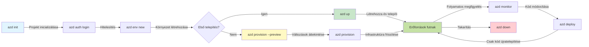
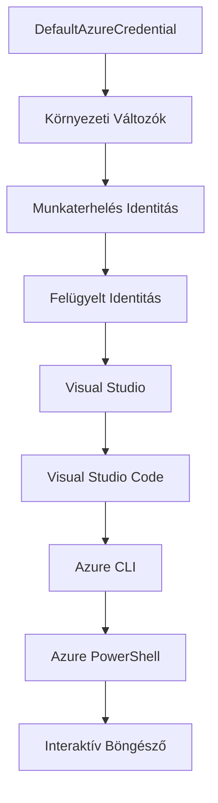

# AZD Basics - Az Azure Developer CLI megértése

# AZD Basics - Alapfogalmak és Alapelvek

**Fejezet navigáció:**
- **📚 Tanfolyam kezdőlap:** [AZD kezdőknek](../../README.md)
- **📖 Aktuális fejezet:** 1. fejezet - Alapok és Gyors indulás
- **⬅️ Előző:** [Tanfolyam áttekintése](../../README.md#-chapter-1-foundation--quick-start)
- **➡️ Következő:** [Telepítés és beállítás](installation.md)
- **🚀 Következő fejezet:** [2. fejezet: AI-First Fejlesztés](../chapter-02-ai-development/microsoft-foundry-integration.md)

## Bevezetés

Ez az órarész az Azure Developer CLI-t (azd) mutatja be, egy erőteljes parancssori eszközt, amely felgyorsítja az utadat a helyi fejlesztéstől az Azure-ba történő telepítésig. Megismered az alapfogalmakat, a főbb funkciókat, és megérted, hogyan egyszerűsíti az azd a felhőnatív alkalmazások telepítését.

## Tanulási célok

A lecke végére képes leszel:
- Megérteni, mi az Azure Developer CLI és elsődleges célját
- Megtanulni a sémák, környezetek és szolgáltatások alapfogalmait
- Felfedezni a fő jellemzőket, beleértve a séma-alapú fejlesztést és az infrastruktúra kód formájában koncepciót
- Megérteni az azd projekt struktúráját és munkafolyamatát
- Felkészülni az azd telepítésére és konfigurálására a fejlesztési környezetedben

## Tanulási eredmények

A lecke elvégzése után képes leszel:
- Elmagyarázni az azd szerepét a modern felhőfejlesztési munkafolyamatokban
- Azonosítani az azd projekt struktúrájának elemeit
- Leírni, hogyan működnek együtt a sémák, környezetek és szolgáltatások
- Megérteni az Infrastructure as Code előnyeit az azd használatával
- Felismerni az azd különböző parancsait és azok funkcióit

## Mi az Azure Developer CLI (azd)?

Az Azure Developer CLI (azd) egy parancssori eszköz, amelyet a helyi fejlesztéstől az Azure-ba történő telepítés felgyorsítására terveztek. Egyszerűsíti a felhőnatív alkalmazások építésének, telepítésének és kezelésének folyamatát az Azure-on.

### Mit telepíthetsz az azd-vel?

Az azd sokféle munkaterhelést támogat – és a lista folyamatosan bővül. Ma az azd-vel telepíthetsz:

| Munkaterhelés típusa | Példák | Ugyanaz a munkafolyamat? |
|----------------------|---------|--------------------------|
| **Hagyományos alkalmazások** | Webalkalmazások, REST API-k, statikus oldalak | ✅ `azd up` |
| **Szolgáltatások és mikroszolgáltatások** | Konténeres alkalmazások, Function Apps, többszolgáltatásos háttérrendszerek | ✅ `azd up` |
| **MI-vezérelt alkalmazások** | Chat alkalmazások Microsoft Foundry modellekkel, RAG megoldások AI kereséssel | ✅ `azd up` |
| **Intelligens ügynökök** | Foundry által hosztolt ügynökök, több ügynökös koordináció | ✅ `azd up` |

A lényeg, hogy **az azd életciklusa változatlan attól függetlenül, hogy mit telepítesz**. Inicializálsz egy projektet, előkészíted az infrastruktúrát, telepíted a kódodat, figyeled az alkalmazásodat, és törlöd a környezetet – legyen az egy egyszerű weboldal vagy egy kifinomult MI ügynök.

Ez a folytonosság tudatos tervezés eredménye. Az azd az MI képességeket egy másik szolgáltatásként kezeli, amelyet az alkalmazásod használhat, nem pedig alapvetően más dologként. Egy Microsoft Foundry modellekkel hátterezett chat végpont az azd szemszögéből csak egy újabb szolgáltatás, amit konfigurálni és telepíteni kell.

### 🎯 Miért használjuk az AZD-t? Egy tényleges példa

Nézzük meg egy egyszerű webalkalmazás adatbázissal történő telepítését:

#### ❌ AZD NÉLKÜL: Manuális Azure telepítés (30+ perc)

```bash
# 1. lépés: Erőforráscsoport létrehozása
az group create --name myapp-rg --location eastus

# 2. lépés: App Service terv létrehozása
az appservice plan create --name myapp-plan \
  --resource-group myapp-rg \
  --sku B1 --is-linux

# 3. lépés: Webalkalmazás létrehozása
az webapp create --name myapp-web-unique123 \
  --resource-group myapp-rg \
  --plan myapp-plan \
  --runtime "NODE:18-lts"

# 4. lépés: Cosmos DB fiók létrehozása (10-15 perc)
az cosmosdb create --name myapp-cosmos-unique123 \
  --resource-group myapp-rg \
  --kind MongoDB

# 5. lépés: Adatbázis létrehozása
az cosmosdb mongodb database create \
  --account-name myapp-cosmos-unique123 \
  --resource-group myapp-rg \
  --name tododb

# 6. lépés: Gyűjtemény létrehozása
az cosmosdb mongodb collection create \
  --account-name myapp-cosmos-unique123 \
  --resource-group myapp-rg \
  --database-name tododb \
  --name todos

# 7. lépés: Kapcsolati karakterlánc lekérése
CONN_STR=$(az cosmosdb keys list \
  --name myapp-cosmos-unique123 \
  --resource-group myapp-rg \
  --type connection-strings \
  --query "connectionStrings[0].connectionString" -o tsv)

# 8. lépés: Alkalmazásbeállítások konfigurálása
az webapp config appsettings set \
  --name myapp-web-unique123 \
  --resource-group myapp-rg \
  --settings MONGODB_URI="$CONN_STR"

# 9. lépés: Naplózás engedélyezése
az webapp log config --name myapp-web-unique123 \
  --resource-group myapp-rg \
  --application-logging filesystem \
  --detailed-error-messages true

# 10. lépés: Application Insights beállítása
az monitor app-insights component create \
  --app myapp-insights \
  --location eastus \
  --resource-group myapp-rg

# 11. lépés: App Insights összekapcsolása a Webalkalmazással
INSTRUMENTATION_KEY=$(az monitor app-insights component show \
  --app myapp-insights \
  --resource-group myapp-rg \
  --query "instrumentationKey" -o tsv)

az webapp config appsettings set \
  --name myapp-web-unique123 \
  --resource-group myapp-rg \
  --settings APPINSIGHTS_INSTRUMENTATIONKEY="$INSTRUMENTATION_KEY"

# 12. lépés: Alkalmazás helyi fordítása
npm install
npm run build

# 13. lépés: Telepítési csomag létrehozása
zip -r app.zip . -x "*.git*" "node_modules/*"

# 14. lépés: Alkalmazás telepítése
az webapp deployment source config-zip \
  --resource-group myapp-rg \
  --name myapp-web-unique123 \
  --src app.zip

# 15. lépés: Várj és imádkozz, hogy működjön 🙏
# (Nincs automatikus ellenőrzés, kézi tesztelés szükséges)
```

**Problémák:**
- ❌ 15+ parancs, amit meg kell jegyezni és helyes sorrendben végrehajtani
- ❌ 30-45 perc manuális munka
- ❌ Könnyű hibázni (elgépelés, rossz paraméterek)
- ❌ Kapcsolati karakterláncok a terminál történelemben láthatók
- ❌ Nincs automatikus visszagörgetés hiba esetén
- ❌ Nehéz reprodukálni csapattagok számára
- ❌ Minden alkalommal eltérő (nem reprodukálható)

#### ✅ AZD-VEL: Automatizált telepítés (5 parancs, 10-15 perc)

```bash
# 1. lépés: Inicializálás sablonból
azd init --template todo-nodejs-mongo

# 2. lépés: Hitelesítés
azd auth login

# 3. lépés: Környezet létrehozása
azd env new dev

# 4. lépés: Változások előnézete (opcionális, de ajánlott)
azd provision --preview

# 5. lépés: Minden telepítése
azd up

# ✨ Kész! Minden telepítve, konfigurálva és figyelve van
```

**Előnyök:**
- ✅ **5 parancs** szemben a 15+ manuális lépéssel
- ✅ **10-15 perc** összidő (főleg az Azure várakozás)
- ✅ **0 hiba** - automatizált és tesztelt
- ✅ **Titkosítás biztonságos kezelése** Key Vault-on keresztül
- ✅ **Automatikus visszagörgetés** hibák esetén
- ✅ **Teljesen reprodukálható** - ugyanaz az eredmény minden alkalommal
- ✅ **Csapatbarát** - bárki telepítheti ugyanazokkal a parancsokkal
- ✅ **Infrastructure as Code** - verziókezelés alatt álló Bicep sémák
- ✅ **Beépített megfigyelés** - Application Insights automatikus konfigurálással

### 📊 Idő és hibacsökkentés

| Mutató | Manuális telepítés | AZD telepítés | Javulás |
|:-------|:------------------|:--------------|:--------|
| **Parancsok száma** | 15+ | 5 | 67%-kal kevesebb |
| **Idő** | 30-45 perc | 10-15 perc | 60%-kal gyorsabb |
| **Hibaarány** | ~40% | <5% | 88%-os csökkenés |
| **Következetesség** | Alacsony (kézi) | 100% (automatizált) | Tökéletes |
| **Csapat betanulás** | 2-4 óra | 30 perc | 75%-kal gyorsabb |
| **Rollback idő** | 30+ perc (kézi) | 2 perc (automatizált) | 93%-kal gyorsabb |

## Alapfogalmak

### Sémák
A sémák az azd alapját képezik. Tartalmazzák:
- **Alkalmazás kód** - Forráskódod és függőségek
- **Infrastruktúra definíciók** - Azure erőforrások Bicep vagy Terraform formátumban
- **Konfigurációs fájlok** - Beállítások és környezeti változók
- **Telepítési scriptek** - Automatizált telepítési munkafolyamatok

### Környezetek
A környezet a különböző telepítési célpontokat jelenti:
- **Fejlesztés** - Teszteléshez és fejlesztéshez
- **Tesztelés** - Előprodukciós környezet
- **Éles** - Élő, gyártási környezet

Minden környezet saját:
- Azure erőforráscsoport
- Konfigurációs beállítások
- Telepítési állapot

### Szolgáltatások
A szolgáltatások az alkalmazásod építőelemei:
- **Frontend** - Webalkalmazások, egylapos alkalmazások (SPA)
- **Backend** - API-k, mikroszolgáltatások
- **Adatbázis** - Adattároló megoldások
- **Tárolás** - Fájl- és blob tárolás

## Főbb jellemzők

### 1. Séma-alapú fejlesztés
```bash
# Böngészés a rendelkezésre álló sablonok között
azd template list

# Inicializálás egy sablonból
azd init --template <template-name>
```

### 2. Infrastructure as Code
- **Bicep** - Azure domain-specifikus nyelv
- **Terraform** - Többfelhős infrastruktúra eszköz
- **ARM Sémák** - Azure Resource Manager sémák

### 3. Integrált munkafolyamatok
```bash
# Teljes telepítési munkafolyamat
azd up            # Előkészítés + Telepítés, ez az első beállításkor automatikus

# 🧪 ÚJ: Infrastruktúra változások előnézete telepítés előtt (BIZTONSÁGOS)
azd provision --preview    # Infrastruktúra telepítés szimulálása anélkül, hogy változtatásokat végeznénk

azd provision     # Azure erőforrások létrehozása, ha frissíted az infrastruktúrát, használd ezt
azd deploy        # Alkalmazáskód telepítése vagy újratelepítése frissítés után
azd down          # Erőforrások megtisztítása
```

#### 🛡️ Biztonságos infrastruktúra tervezés előnézettel
Az `azd provision --preview` parancs mérföldkő a biztonságos telepítésekhez:
- **Száraz futás elemzés** – megmutatja, mi fog létrejönni, módosulni vagy törlődni
- **Nulla kockázat** – az Azure környezeteden nem történik tényleges változtatás
- **Csapat együttműködés** – megoszthatod az előnézet eredményét telepítés előtt
- **Költségbecslés** – láthatod az erőforrás költségeket a kötelezettségvállalás előtt

```bash
# Példa előnézeti munkafolyamat
azd provision --preview           # Nézze meg, mi fog változni
# Tekintse át az eredményt, beszélje meg a csapattal
azd provision                     # Alkalmazza a változtatásokat magabiztosan
```

### 📊 Ábra: AZD fejlesztési munkafolyamat


**Munkafolyamat magyarázat:**
1. **Init** - Indíts meglévő séma alapján vagy új projektet
2. **Auth** - Hitelesítés Azure-ba
3. **Environment** - Izolált telepítési környezet létrehozása
4. **Preview** - 🆕 Mindig előnézet a infrastruktúra változásokról (biztonságos gyakorlat)
5. **Provision** - Azure erőforrások létrehozása/frissítése
6. **Deploy** - Alkalmazáskód feltöltése
7. **Monitor** - Alkalmazás teljesítményének figyelése
8. **Iterate** - Változtatások végrehajtása és újratelepítés
9. **Cleanup** - Erőforrások törlése a munka befejeztével

### 4. Környezetkezelés
```bash
# Környezetek létrehozása és kezelése
azd env new <environment-name>
azd env select <environment-name>
azd env list
```

### 5. Bővítmények és MI parancsok

Az azd kiterjesztéses rendszert használ, hogy a CLI alap funkcionalitását bővítse. Ez különösen hasznos MI munkaterhelésekhez:

```bash
# Elérhető kiterjesztések listázása
azd extension list

# Telepítse a Foundry agents kiterjesztést
azd extension install azure.ai.agents

# AI ügynök projekt inicializálása manifest alapján
azd ai agent init -m agent-manifest.yaml

# Indítsa el az MCP szervert AI által támogatott fejlesztéshez (Alfa)
azd mcp start
```

> A bővítményeket részletesen tárgyalja a [2. fejezet: AI-First fejlődés](../chapter-02-ai-development/agents.md) és az [AZD MI CLI parancsok](../chapter-08-production/production-ai-practices.md#azd-ai-cli-commands-and-extensions) referenciája.

## 📁 Projekt struktúra

Egy tipikus azd projekt struktúrája:
```
my-app/
├── .azd/                    # azd configuration
│   └── config.json
├── .azure/                  # Azure deployment artifacts
├── .devcontainer/          # Development container config
├── .github/workflows/      # GitHub Actions
├── .vscode/               # VS Code settings
├── infra/                 # Infrastructure code
│   ├── main.bicep        # Main infrastructure template
│   ├── main.parameters.json
│   └── modules/          # Reusable modules
├── src/                  # Application source code
│   ├── api/             # Backend services
│   └── web/             # Frontend application
├── azure.yaml           # azd project configuration
└── README.md
```

## 🔧 Konfigurációs fájlok

### azure.yaml
A fő projekt konfigurációs fájl:
```yaml
name: my-awesome-app
metadata:
  template: my-template@1.0.0

services:
  web:
    project: ./src/web
    language: js
    host: appservice
  api:
    project: ./src/api
    language: js
    host: appservice

hooks:
  preprovision:
    shell: pwsh
    run: echo "Preparing to provision..."
```

### .azure/config.json
Környezet specifikus konfiguráció:
```json
{
  "version": 1,
  "defaultEnvironment": "dev",
  "environments": {
    "dev": {
      "subscriptionId": "your-subscription-id",
      "location": "eastus"
    }
  }
}
```

## 🎪 Gyakori munkafolyamatok gyakorlati feladatokkal

> **💡 Tanulási tipp:** Kövesd ezeket a gyakorlatokat sorrendben, hogy fokozatosan fejleszd az AZD képességeidet.

### 🎯 Gyakorlat 1: Első projekt inicializálása

**Cél:** Készíts egy AZD projektet és fedezd fel a struktúráját

**Lépések:**
```bash
# Használjon bevált sablont
azd init --template todo-nodejs-mongo

# Tekintse meg a generált fájlokat
ls -la  # Nézze meg az összes fájlt, beleértve a rejtetteket is

# Létrehozott kulcsfájlok:
# - azure.yaml (fő konfiguráció)
# - infra/ (infrastruktúra kód)
# - src/ (alkalmazáskód)
```

**✅ Siker:** Megvannak az azure.yaml, infra/ és src/ könyvtárak

---

### 🎯 Gyakorlat 2: Telepítés Azure-ba

**Cél:** Végezze el az end-to-end telepítést

**Lépések:**
```bash
# 1. Hitelesítés
az login && azd auth login

# 2. Környezet létrehozása
azd env new dev
azd env set AZURE_LOCATION eastus

# 3. Változások előnézete (AJÁNLOTT)
azd provision --preview

# 4. Minden telepítése
azd up

# 5. Telepítés ellenőrzése
azd show    # Tekintse meg az alkalmazás URL-jét
```

**Elvárt idő:** 10-15 perc  
**✅ Siker:** Az alkalmazás URL megnyílik a böngészőben

---

### 🎯 Gyakorlat 3: Több környezet használata

**Cél:** Telepíts a fejlesztés és a tesztelési környezetekbe

**Lépések:**
```bash
# Már van dev, hozz létre staginget
azd env new staging
azd env set AZURE_LOCATION westus2
azd up

# Váltás közöttük
azd env list
azd env select dev
```

**✅ Siker:** Két különálló erőforráscsoport az Azure portálon

---

### 🛡️ Tiszta lap: `azd down --force --purge`

Ha teljesen újrakezdésre van szükség:

```bash
azd down --force --purge
```

**Mit tesz:**
- `--force`: Nincsenek megerősítésre felszólító kérdések
- `--purge`: Törli az összes helyi állapotot és Azure erőforrást

**Használat:**
- Ha félbeszakadt a telepítés
- Ha projektet váltasz
- Ha teljesen friss kezdésre van szükség

---

## 🎪 Eredeti munkafolyamat referencia

### Új projekt indítása
```bash
# Módszer 1: Használja a meglévő sablont
azd init --template todo-nodejs-mongo

# Módszer 2: Kezdje az elejéről
azd init

# Módszer 3: Használja az aktuális könyvtárat
azd init .
```

### Fejlesztési ciklus
```bash
# Fejlesztési környezet beállítása
azd auth login
azd env new dev
azd env select dev

# Minden telepítése
azd up

# Változtatások végrehajtása és újratelepítés
azd deploy

# Takarítás a befejezéskor
azd down --force --purge # Az Azure Developer CLI parancsa egy **kemény visszaállítás** a környezetedhez – különösen hasznos, ha hibás telepítések problémáinak elhárításán dolgozol, elhagyott erőforrásokat takarítasz, vagy egy friss újratelepítésre készülsz.
```

## Az `azd down --force --purge` megértése
Az `azd down --force --purge` parancs egy erőteljes módja annak, hogy teljes egészében felszámold az azd környezeted és minden kapcsolódó erőforrásodat. Íme a zászlók részletes bemutatása:
```
--force
```
- Kihagyja a megerősítő üzeneteket.
- Automatizálás vagy script esetén hasznos, ahol nincs lehetőség kézi beavatkozásra.
- Biztosítja, hogy a felszámolás megszakítás nélkül folytatódjon, még ha a CLI eltéréseket is észlel.

```
--purge
```
Törli **az összes kapcsolódó metaadatot**, beleértve:
Környezeti állapot
Lokális `.azure` mappa
Gyorsítótárazott telepítési információ
Megakadályozza, hogy az azd "emlékezzen" korábbi telepítésekre, melyek problémákhoz vezethetnek, mint például eltérő erőforráscsoportok vagy elavult regisztrációs hivatkozások.


### Miért használjuk mindkettőt?
Ha elakadsz az `azd up` során a maradvány állapot vagy részleges telepítés miatt, ez a kombináció biztosítja a **tiszta lap** élményt.

Különösen hasznos, ha manuálisan töröltél erőforrásokat az Azure portálon, vagy ha sémákat, környezeteket vagy erőforráscsoport neveket váltasz.


### Több környezet kezelése
```bash
# Létrehozás staging környezet
azd env new staging
azd env select staging
azd up

# Váltás vissza fejlesztői környezetre
azd env select dev

# Környezetek összehasonlítása
azd env list
```

## 🔐 Hitelesítés és Bizonylatok

A hitelesítés megértése kulcsfontosságú az azd telepítések sikeréhez. Az Azure több hitelesítési módot használ, és az azd az azonos hitelesítési láncot alkalmazza, mint más Azure eszközök.

### Azure CLI hitelesítés (`az login`)

Az azd használata előtt hitelesíteni kell az Azure-ba. A leggyakoribb módszer az Azure CLI használata:

```bash
# Interaktív bejelentkezés (megnyitja a böngészőt)
az login

# Bejelentkezés konkrét bérlővel
az login --tenant <tenant-id>

# Bejelentkezés szolgáltatási főnökkel
az login --service-principal -u <app-id> -p <password> --tenant <tenant-id>

# Aktuális bejelentkezési állapot ellenőrzése
az account show

# Elérhető előfizetések listázása
az account list --output table

# Alapértelmezett előfizetés beállítása
az account set --subscription <subscription-id>
```

### Hitelesítési folyamat
1. **Interaktív bejelentkezés**: Megnyitja az alapértelmezett böngésződet a hitelesítéshez
2. **Eszközkódos folyamat**: Böngésző nélküli környezetekhez
3. **Szolgáltatói főnök**: Automatizálási és CI/CD helyzetekhez
4. **Kezelt identitás**: Azure hosztolt alkalmazásokhoz

### DefaultAzureCredential láncolat

A `DefaultAzureCredential` egy olyan hitelesítő típus, amely egyszerűsíti a hitelesítést több hitelesítő forrás automatikus, sorrend szerinti kipróbálásával:

#### Hitelesítő lánc sorrend

#### 1. Környezeti változók
```bash
# Környezeti változók beállítása a szolgáltatás-névre szóló fiókhoz
export AZURE_CLIENT_ID="<app-id>"
export AZURE_CLIENT_SECRET="<password>"
export AZURE_TENANT_ID="<tenant-id>"
```

#### 2. Workload Identity (Kubernetes/GitHub Actions)
Automatikusan használva itt:
- Azure Kubernetes Service (AKS) Workload Identity-vel
- GitHub Actions OIDC federációval
- Egyéb federált identitási forgatókönyvekben

#### 3. Kezelt identitás
Azure erőforrások esetén, mint például:
- Virtuális gépek
- App Service
- Azure Functions
- Konténer példányok

```bash
# Ellenőrizze, hogy Azure erőforráson fut-e kezelt identitással
az account show --query "user.type" --output tsv
# Visszatérési érték: "servicePrincipal", ha kezelt identitást használ
```

#### 4. Fejlesztői eszköz integráció
- **Visual Studio**: Automatikusan használja a bejelentkezett fiókot
- **VS Code**: Az Azure Account kiterjesztés hitelesítő adatait használja
- **Azure CLI**: Az `az login` hitelesítést használja (leggyakoribb helyi fejlesztéshez)

### AZD hitelesítési beállítása

```bash
# 1. módszer: Azure CLI használata (Fejlesztéshez ajánlott)
az login
azd auth login  # Meglévő Azure CLI hitelesítő adatok használata

# 2. módszer: Közvetlen azd hitelesítés
azd auth login --use-device-code  # Fej nélküli környezetekhez

# 3. módszer: Hitelesítési állapot ellenőrzése
azd auth login --check-status

# 4. módszer: Kijelentkezés és újra hitelesítés
azd auth logout
azd auth login
```

### Hitelesítési legjobb gyakorlatok

#### Helyi fejlesztéshez
```bash
# 1. Jelentkezzen be az Azure CLI-vel
az login

# 2. Ellenőrizze a helyes előfizetést
az account show
az account set --subscription "Your Subscription Name"

# 3. Használja az azd-t meglévő hitelesítő adatokkal
azd auth login
```

#### CI/CD folyamatokhoz
```yaml
# GitHub Actions example
- name: Azure Login
  uses: azure/login@v1
  with:
    creds: ${{ secrets.AZURE_CREDENTIALS }}

- name: Deploy with azd
  run: |
    azd auth login --client-id ${{ secrets.AZURE_CLIENT_ID }} \
                    --client-secret ${{ secrets.AZURE_CLIENT_SECRET }} \
                    --tenant-id ${{ secrets.AZURE_TENANT_ID }}
    azd up --no-prompt
```

#### Éles környezetekhez
- Használj **Kezelt identitást**, ha Azure erőforrásokon fut
- Használj **Szolgáltatói főnököt** automatizáláshoz
- Kerüld hitelesítő adatok kódba vagy konfigurációba írását
- Használj **Azure Key Vault**-ot érzékeny konfigurációhoz

### Gyakori hitelesítési problémák és megoldások

#### Probléma: "Nincs előfizetés"
```bash
# Megoldás: Állítsa be az alapértelmezett előfizetést
az account list --output table
az account set --subscription "<subscription-id>"
azd env set AZURE_SUBSCRIPTION_ID "<subscription-id>"
```

#### Probléma: "Nincs megfelelő jogosultság"
```bash
# Megoldás: Ellenőrizze és rendelje hozzá a szükséges szerepköröket
az role assignment list --assignee $(az account show --query user.name --output tsv)

# Általános szükséges szerepkörök:
# - Közreműködő (erőforrás-menedzsmenthez)
# - Felhasználói hozzáférés-ellenőrző (szerepkör hozzárendelésekhez)
```

#### Probléma: "Token lejárt"
```bash
# Megoldás: Újra hitelesítés
az logout
az login
azd auth logout
azd auth login
```

### Hitelesítés különböző helyzetekben

#### Helyi fejlesztés
```bash
# Személyes fejlesztési számla
az login
azd auth login
```

#### Csapatfejlesztés
```bash
# Használjon konkrét bérlőt a szervezethez
az login --tenant contoso.onmicrosoft.com
azd auth login
```

#### Többlakóhelyes forgatókönyvek
```bash
# Váltás bérlők között
az login --tenant tenant1.onmicrosoft.com
# Telepítés az 1. bérlőhöz
azd up

az login --tenant tenant2.onmicrosoft.com  
# Telepítés a 2. bérlőhöz
azd up
```

### Biztonsági megfontolások
1. **Hitelesítő adatok tárolása**: Soha ne tárold a hitelesítő adatokat a forráskódban  
2. **Hatókör korlátozása**: Használd a legkisebb jogosultság elvét a szolgáltatásprincípiumoknál  
3. **Token forgatás**: Rendszeresen forgasd a szolgáltatásprincípium titkokat  
4. **Audit nyomvonal**: Figyeld az autentikációs és telepítési tevékenységeket  
5. **Hálózatbiztonság**: Használj privát végpontokat, ahol csak lehet  

### Hitelesítés hibakeresése

```bash
# Hitelesítési problémák hibakeresése
azd auth login --check-status
az account show
az account get-access-token

# Gyakori diagnosztikai parancsok
whoami                          # Aktuális felhasználói környezet
az ad signed-in-user show      # Azure AD felhasználói adatok
az group list                  # Erőforrás-hozzáférés tesztelése
```
  
## Az `azd down --force --purge` megértése  

### Felfedezés  
```bash
azd template list              # Böngésszen a sablonok között
azd template show <template>   # Sablon részletei
azd init --help               # Inicializálási beállítások
```
  
### Projektek kezelése  
```bash
azd show                     # Projekt áttekintése
azd env show                 # Jelenlegi környezet
azd config list             # Konfigurációs beállítások
```
  
### Megfigyelés  
```bash
azd monitor                  # Nyissa meg az Azure portál megfigyelését
azd monitor --logs           # Alkalmazásnaplók megtekintése
azd monitor --live           # Élő metrikák megtekintése
azd pipeline config          # CI/CD beállítása
```
  
## Legjobb gyakorlatok  

### 1. Használj értelmes neveket  
```bash
# Jó
azd env new production-east
azd init --template web-app-secure

# Kerülje
azd env new env1
azd init --template template1
```
  
### 2. Használd a sablonokat  
- Kezdd meglévő sablonokkal  
- Igazítsd a saját igényeidhez  
- Hozz létre újrafelhasználható sablonokat a szervezeted számára  

### 3. Környezet izolálása  
- Használj külön környezeteket fejlesztéshez, teszteléshez, éleshez  
- Soha ne telepíts egyből az éles környezetbe helyi gépről  
- Használj CI/CD pipeline-okat az éles telepítésekhez  

### 4. Konfiguráció kezelés  
- Használj környezeti változókat érzékeny adatokhoz  
- Tartsd a konfigurációt verziókezelés alatt  
- Dokumentáld a környezet-specifikus beállításokat  

## Tanulási ütemterv  

### Kezdő (1-2. hét)  
1. Telepítsd az azd-t és hitelesíts  
2. Telepíts egy egyszerű sablont  
3. Ismerd meg a projekt struktúráját  
4. Tanuld meg az alapvető parancsokat (up, down, deploy)  

### Középhaladó (3-4. hét)  
1. Igazítsd a sablonokat  
2. Kezeld a több környezetet  
3. Értsd meg a infrastruktúra kódot  
4. Állítsd be a CI/CD pipeline-okat  

### Haladó (5. hét+)  
1. Készíts egyedi sablonokat  
2. Haladó infrastruktúra minták  
3. Több régiós telepítések  
4. Vállalati szintű konfigurációk  

## Következő lépések  

**📖 Folytasd az 1. fejezet tanulását:**  
- [Telepítés és beállítás](installation.md) – Telepítsd és konfiguráld az azd-t  
- [Az első projekted](first-project.md) – Készítsd el a gyakorlati útmutatót  
- [Konfigurációs útmutató](configuration.md) – Haladó konfigurációs lehetőségek  

**🎯 Készen állsz a következő fejezetre?**  
- [2. fejezet: AI-első fejlesztés](../chapter-02-ai-development/microsoft-foundry-integration.md) – Kezdd el az AI alkalmazások fejlesztését  

## További források  

- [Azure Developer CLI áttekintés](https://learn.microsoft.com/en-us/azure/developer/azure-developer-cli/)  
- [Sablon galéria](https://azure.github.io/awesome-azd/)  
- [Közösségi példák](https://github.com/Azure-Samples)  

---

## 🙋 Gyakran ismételt kérdések

### Általános kérdések

**K: Mi a különbség az AZD és az Azure CLI között?**

V: Az Azure CLI (`az`) egyéni Azure erőforrások kezelésére szolgál. Az AZD (`azd`) teljes alkalmazások kezelésére:  

```bash
# Azure CLI - Alacsony szintű erőforrás-kezelés
az webapp create --name myapp --resource-group rg
az sql server create --name myserver --resource-group rg
# ...sok további parancs szükséges

# AZD - Alkalmazás szintű kezelés
azd up  # Az egész alkalmazás telepítése az összes erőforrással együtt
```
  
**Így gondolj rá:**  
- `az` = Egyedi Lego építőkockák kezelése  
- `azd` = Teljes Lego készletek kezelése  

---

**K: Kell-e tudnom Bicep-et vagy Terraform-ot az AZD használatához?**

V: Nem! Kezdd sablonokkal:  
```bash
# Használjon meglévő sablont - nincs szükség IaC ismeretre
azd init --template todo-nodejs-mongo
azd up
```
  
Később megtanulhatod a Bicep-et, hogy testre szabd az infrastruktúrát. A sablonok működő példák, amikből tanulhatsz.  

---

**K: Mennyibe kerül az AZD sablonok futtatása?**

V: A költségek sablontól függnek. A legtöbb fejlesztői sablon havi 50-150 dollár között van:  

```bash
# Költségek előnézete telepítés előtt
azd provision --preview

# Mindig takarítsd el, ha nem használod
azd down --force --purge  # Minden erőforrást eltávolít
```
  
**Pro tipp:** Használd az ingyenes szinteket, ahol lehet:  
- App Service: F1 (ingyenes) szint  
- Microsoft Foundry modellek: Azure OpenAI havi 50 000 token ingyen  
- Cosmos DB: 1000 RU/s ingyenes szint  

---

**K: Használhatom-e az AZD-t meglévő Azure erőforrásokkal?**

V: Igen, de könnyebb újrakezdeni. AZD akkor a leghatékonyabb, ha az életciklust teljeskörűen kezeli. Meglévő erőforrások esetén:  

```bash
# 1. lehetőség: Létező erőforrások importálása (haladó)
azd init
# Ezután módosítsa az infra/ könyvtárat, hogy hivatkozzon a létező erőforrásokra

# 2. lehetőség: Újrakezdés (ajánlott)
azd init --template matching-your-stack
azd up  # Új környezet létrehozása
```
  
---

**K: Hogyan oszthatom meg a projektem a csapattársakkal?**

V: Commitáld az AZD projektet a Git-be (de NEM a .azure mappát):  

```bash
# Már alapértelmezettként szerepel a .gitignore-ban
.azure/        # Titkokat és környezeti adatokat tartalmaz
*.env          # Környezeti változók

# Csapattagok akkor:
git clone <your-repo>
azd auth login
azd env new <their-name>-dev
azd up
```
  
Mindenki azonos infrastruktúrát kap ugyanabból a sablonból.  

---

### Hibakeresési kérdések

**K: Az "azd up" félúton hibásodott meg. Mit tegyek?**

V: Nézd meg a hibát, javítsd, majd próbáld újra:  

```bash
# Részletes naplók megtekintése
azd show

# Általános javítások:

# 1. Ha kvóta túllépve:
azd env set AZURE_LOCATION "westus2"  # Próbáljon másik régiót

# 2. Ha erőforrásnév ütközés van:
azd down --force --purge  # Tiszta lappal
azd up  # Próbálja újra

# 3. Ha azonosítás lejárt:
az login
azd auth login
azd up
```
  
**Leggyakoribb hiba:** Rossz Azure előfizetés van kiválasztva  
```bash
az account list --output table
az account set --subscription "<correct-subscription>"
```
  
---

**K: Hogyan telepítsek csak kódváltozást újratelepítés nélkül?**

V: Használd az `azd deploy` parancsot az `azd up` helyett:  

```bash
azd up          # Első alkalommal: előkészítés + telepítés (lassú)

# Kódváltoztatások végrehajtása...

azd deploy      # Következő alkalommal: csak telepítés (gyors)
```
  
Sebesség összehasonlítás:  
- `azd up`: 10-15 perc (infrastruktúra foglalás)  
- `azd deploy`: 2-5 perc (csak kód)  

---

**K: Testre szabhatom az infrastruktúra sablonokat?**

V: Igen! Szerkeszd az `infra/` mappában a Bicep fájlokat:  

```bash
# Az azd init után
cd infra/
code main.bicep  # Szerkesztés a VS Code-ban

# Változtatások előnézete
azd provision --preview

# Változtatások alkalmazása
azd provision
```
  
**Tipp:** Kezdd kicsiben – elsőként a SKU-k módosításával:  
```bicep
// infra/main.bicep
sku: {
  name: 'B1'  // Change to 'P1V2' for production
}
```
  
---

**K: Hogyan törölhetem az AZD által létrehozott összes erőforrást?**

V: Egy parancs eltávolít mindent:  

```bash
azd down --force --purge

# Ez törli:
# - Az összes Azure erőforrást
# - Az erőforráscsoportot
# - A helyi környezet állapotát
# - A gyorsítótárazott telepítési adatokat
```
  
**Mindig futtasd, ha:**  
- Befejezted egy sablon tesztelését  
- Másik projektre váltasz  
- Újrakezdést akarsz  

**Költségmegtakarítás:** Nem használt erőforrások törlése = 0 költség  

---

**K: Mi történik, ha véletlenül töröltem erőforrásokat az Azure Portálon?**

V: Az AZD állapota ilyenkor szinkronból kikerülhet. Tiszta lappal kezdhetsz:  

```bash
# 1. Távolítsa el a helyi állapotot
azd down --force --purge

# 2. Kezdje tiszta lappal
azd up

# Alternatíva: Hagyja, hogy az AZD észlelje és javítsa
azd provision  # Hiányzó erőforrásokat hoz létre
```
  
---

### Haladó kérdések

**K: Használhatom az AZD-t CI/CD pipeline-okban?**

V: Igen! GitHub Actions példa:  

```yaml
# .github/workflows/deploy.yml
name: Deploy with AZD

on:
  push:
    branches: [main]

jobs:
  deploy:
    runs-on: ubuntu-latest
    steps:
      - uses: actions/checkout@v2
      
      - name: Install azd
        run: curl -fsSL https://aka.ms/install-azd.sh | bash
      
      - name: Azure Login
        run: |
          azd auth login \
            --client-id ${{ secrets.AZURE_CLIENT_ID }} \
            --client-secret ${{ secrets.AZURE_CLIENT_SECRET }} \
            --tenant-id ${{ secrets.AZURE_TENANT_ID }}
      
      - name: Deploy
        run: azd up --no-prompt
```
  
---

**K: Hogyan kezelem a titkokat és érzékeny adatokat?**

V: Az AZD automatikusan integrálódik az Azure Key Vault-tal:  

```bash
# Titkok a Key Vault-ban vannak tárolva, nem a kódban
azd env set DATABASE_PASSWORD "$(openssl rand -base64 32)"

# Az AZD automatikusan:
# 1. Létrehozza a Key Vault-ot
# 2. Tárolja a titkot
# 3. Hozzáférést ad az alkalmazásnak Managed Identity-n keresztül
# 4. Befecskendezi futásidőben
```
  
**Soha ne commitáld:**  
- `.azure/` mappát (környezeti adatokat tartalmaz)  
- `.env` fájlokat (helyi titkok)  
- Kapcsolati stringeket  

---

**K: Telepíthetek több régióba?**

V: Igen, hozz létre egy környezetet régiónként:  

```bash
# Kelet US környezet
azd env new prod-eastus
azd env set AZURE_LOCATION eastus
azd up

# Nyugat Európa környezet
azd env new prod-westeurope
azd env set AZURE_LOCATION westeurope
azd up

# Minden környezet független
azd env list
```
  
Valódi több régiós alkalmazásokhoz testre szabhatod a Bicep sablonokat, hogy egyszerre több régióba telepíts.  

---

**K: Hol kaphatok segítséget, ha elakadok?**

1. **AZD dokumentáció:** https://learn.microsoft.com/azure/developer/azure-developer-cli/  
2. **GitHub Issues:** https://github.com/Azure/azure-dev/issues  
3. **Discord:** [Azure Discord](https://discord.gg/microsoft-azure) - #azure-developer-cli csatorna  
4. **Stack Overflow:** `azure-developer-cli` címke  
5. **Ez a tanfolyam:** [Hibakeresési útmutató](../chapter-07-troubleshooting/common-issues.md)  

**Pro tipp:** Mielőtt kérdeznél, futtasd:  
```bash
azd show       # Aktuális állapot megjelenítése
azd version    # A te verziódat mutatja
```
  
Add meg ezt az infót a kérdésedben a gyorsabb segítségért.  

---

## 🎓 Mi a következő lépés?

Most már érted az AZD alapjait. Válaszd ki a számodra megfelelő utat:

### 🎯 Kezdőknek:  
1. **Következő:** [Telepítés és beállítás](installation.md) – Telepítsd az AZD-t a gépedre  
2. **Azután:** [Az első projekted](first-project.md) – Telepítsd az első alkalmazásodat  
3. **Gyakorolj:** Teljesítsd mindhárom gyakorlati feladatot ebben a leckében  

### 🚀 AI fejlesztőknek:  
1. **Ugorj:** [2. fejezet: AI-első fejlesztés](../chapter-02-ai-development/microsoft-foundry-integration.md)  
2. **Telepíts:** Kezdd az `azd init --template get-started-with-ai-chat` paranccsal  
3. **Tanulj:** Fejlessz a telepítés közben  

### 🏗️ Tapasztalt fejlesztőknek:  
1. **Nézz át:** [Konfigurációs útmutató](configuration.md) – Haladó beállítások  
2. **Fedezd fel:** [Infrastructure as Code](../chapter-04-infrastructure/provisioning.md) – Mély Bicep betekintés  
3. **Építs:** Készíts egyedi sablonokat a saját stack-edhez  

---

**Fejezet navigáció:**  
- **📚 Tanfolyam kezdőoldal:** [AZD Kezdőknek](../../README.md)  
- **📖 Aktuális fejezet:** 1. fejezet – Alapok és gyors kezdés  
- **⬅️ Előző:** [Tanfolyam áttekintése](../../README.md#-chapter-1-foundation--quick-start)  
- **➡️ Következő:** [Telepítés és beállítás](installation.md)  
- **🚀 Következő fejezet:** [2. fejezet: AI-első fejlesztés](../chapter-02-ai-development/microsoft-foundry-integration.md)

---

<!-- CO-OP TRANSLATOR DISCLAIMER START -->
**Felelősségkizárás**:
Ez a dokumentum az AI fordító szolgáltatás [Co-op Translator](https://github.com/Azure/co-op-translator) segítségével készült. Bár a pontosságra törekszünk, kérjük, vegye figyelembe, hogy az automatikus fordítások hibákat vagy pontatlanságokat tartalmazhatnak. A dokumentum eredeti, anyanyelvi változata tekintendő hiteles forrásnak. Kritikus információk esetén profi, emberi fordítást javasolunk. Nem vállalunk felelősséget az ebből eredő félreértésekért vagy félreértelmezésekért.
<!-- CO-OP TRANSLATOR DISCLAIMER END -->