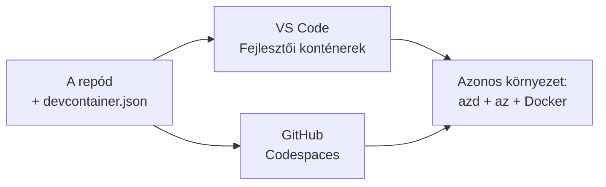

# Dev Containers & GitHub Codespaces azd-hez

**Fejezet navigáció:**
- **📚 Tanfolyam kezdőoldal**: [AZD For Beginners](../../README.md)
- **📖 Aktuális fejezet**: 1. fejezet - Alapok és Gyors kezdés
- **⬅️ Előző**: [Hozd a saját alkalmazásodat](bring-your-own-app.md)
- **🚀 Következő fejezet**: [2. fejezet: AI-első fejlesztés](../chapter-02-ai-development/README.md)

> Érvényesítve az `azd 1.25.6`-tal 2026 júniusában.

## Bevezetés

Az azd, a megfelelő nyelvi futtatókörnyezet, a Docker és az Azure CLI mindenkire történő telepítése fáradságos — és ez az elsődleges oka annak, hogy egy "nálam működik" oktatóanyag máshol nem. Egy dev container ezt úgy oldja meg, hogy egy fájlban leírja az egész eszközkészletedet. Bárki, aki megnyitja a projektet VS Code-ban vagy GitHub Codespaces-ben, ugyanazt a környezetet kapja, az azd már telepítve. Ez a lecke megmutatja, hogyan adhatod hozzá.

## Tanulási célok

A lecke végére képes leszel:
- Megérteni, mi az a dev container és miért segít az azd-vel
- Hozzáadni egy minimális `.devcontainer/devcontainer.json` fájlt egy projekthez
- Tartalmazni az azd-t, az Azure CLI-t és a Dockert Dev Container *features*-ként
- Megnyitni a projektet GitHub Codespaces-ben vagy VS Code-ban

## Tanulási eredmények

A lecke elvégzése után képes leszel:
- `devcontainer.json` szerkesztésére egy azd projekthez
- Az azd és az Azure eszközök hozzáadására manuális telepítések nélkül
- `azd up` futtatására konténerből vagy Codespace-ből

---

## Mi az a Dev Container?

A dev container egy Docker-alapú fejlesztőkörnyezet, amelyet a `.devcontainer/devcontainer.json` fájl határoz meg a tárolódban. Amikor megnyitod a projektet:

- **VS Code** (a Dev Containers kiterjesztéssel) felépíti a konténert és csatlakozik hozzá.
- **GitHub Codespaces** felépíti ugyanazt a konténert a felhőben és egy böngészőalapú szerkesztőt ad.

Akárhogy is, minden hozzájáruló ugyanazokat az eszközöket kapja — nincs több „telepítetted az azd-t?” típusú hibaelhárítás.



---

## 1. lépés: Hozd létre a devcontainer fájlt

Hozd létre a `.devcontainer/devcontainer.json` fájlt a projekt gyökerében:

```json
{
  "name": "azd-project",
  "image": "mcr.microsoft.com/devcontainers/base:bookworm",
  "features": {
    "ghcr.io/devcontainers/features/azure-cli:1": {},
    "ghcr.io/azure/azure-dev/azd:latest": {},
    "ghcr.io/devcontainers/features/docker-in-docker:2": {},
    "ghcr.io/devcontainers/features/node:1": {}
  },
  "customizations": {
    "vscode": {
      "extensions": [
        "ms-azuretools.azure-dev",
        "ms-azuretools.vscode-bicep"
      ]
    }
  },
  "forwardPorts": [3000],
  "postCreateCommand": "azd version"
}
```

Mit csinál egyes részek:

| Kulcs | Cél |
|-----|---------|
| `image` | A konténer alap operációs rendszere |
| `features` | Előre elkészített telepítők—itt: Azure CLI, **azd**, Docker és Node.js |
| `customizations.vscode.extensions` | Automatikusan telepíti az azd és a Bicep VS Code kiterjesztéseket |
| `forwardPorts` | Elérhetővé teszi az alkalmazás portját a böngészőben |
| `postCreateCommand` | Egyszer lefut a konténer felépítése után (itt egy épségellenőrzés) |

> A `ghcr.io/azure/azure-dev/azd:latest` feature az hivatalos módja annak, hogy az azd bekerüljön egy konténerbe. Rögzíts egy konkrét verziót (például `azd:1.25.6`), ha reprodukálhatóságra van szükséged.

---

## 2. lépés: Illeszd a feature-t az alkalmazásod nyelvéhez

Cseréld le a `node` feature-t arra, amit az alkalmazásod használ:

```jsonc
// Python project
"ghcr.io/devcontainers/features/python:1": {},

// .NET project
"ghcr.io/devcontainers/features/dotnet:2": {},

// Java project
"ghcr.io/devcontainers/features/java:1": {},

// Go project
"ghcr.io/devcontainers/features/go:1": {}
```

Tartsd meg a `docker-in-docker`-t, ha a `host` értéke `containerapp`, `aks`, vagy bármilyen olyan, ami konténerképet épít — az azd-nek Dockerre van szüksége a képek építéséhez és feltöltéséhez.

---

## 3. lépés: Nyisd meg

**VS Code-ban:**
1. Telepítsd a **Dev Containers** kiterjesztést.
2. Nyisd meg a projekt mappáját.
3. Kattints a felkérésnél a **Reopen in Container** gombra (vagy futtasd a *Dev Containers: Reopen in Container* parancsot).

**GitHub Codespaces-ben:**
1. Push-old a repo-t GitHubra.
2. Kattints a **Code → Codespaces → Create codespace on main** opcióra.
3. Várd meg, amíg a konténer felépül — az azd készen áll a terminálban.

---

## 4. lépés: Telepítés a konténeren belülről

A konténerben előre telepítve van az azd, így a szokásos munkafolyamat egyszerűen működik:

```bash
azd auth login --use-device-code   # a device-kód hasznos a Codespacesben
azd up
```

> **Miért `--use-device-code`?** Egy távoli konténerben vagy Codespace-ben nincs helyi böngésző, ahová átirányíthatna, ezért a device-code beléptetés a megbízható út. Egy kódot kell beillesztened egy böngészőfülbe a bejelentkezés befejezéséhez.

---

## Gyakori buktatók

| Probléma | Megoldás |
|---------|-----|
| `azd up` nem tud képet építeni | Add hozzá a `docker-in-docker` feature-t |
| Böngészős bejelentkezés elakad Codespaces-ben | Használd az `azd auth login --use-device-code` parancsot |
| Az eszközök eltérnek a csapattagok között | Rögzítsd a feature verziókat (pl. `azd:1.25.6`) |
| Az alkalmazás nem elérhető a böngészőben | Add hozzá a portot a `forwardPorts`-hoz |

---

## Összefoglalás

- Egy dev container reprodukálhatóvá teszi az azd eszközkészleted mindenki számára.
- Add hozzá az azd-t, az Azure CLI-t és a Dockert Dev Container *features*-ként.
- Illeszd a nyelvi feature-t az alkalmazásodhoz, és tartsd meg a `docker-in-docker`-t konténer hosztoknál.
- Használd a device-code beléptetést, amikor Codespaces-ben futsz.

---

## 🔗 Navigáció

| Irány | Erőforrás |
|-----------|----------|
| **Előző** | [Hozd a saját alkalmazásodat](bring-your-own-app.md) |
| **Fejezet kezdőoldal** | [1. fejezet: Alapok és Gyors kezdés](README.md) |
| **Következő fejezet** | [2. fejezet: AI-első fejlesztés](../chapter-02-ai-development/README.md) |

## 📖 Kapcsolódó források

- [Telepítés és beállítás](installation.md)
- [Parancs gyorssegéd](../../resources/cheat-sheet.md)
- [Hivatalos Dev Containers specifikáció](https://containers.dev/)
- [azd Dev Container feature](https://github.com/Azure/azure-dev/tree/main/ext/devcontainer)

---

<!-- CO-OP TRANSLATOR DISCLAIMER START -->
**Jogi nyilatkozat**:
Ez a dokumentum az AI fordítási szolgáltatás, a [Co-op Translator](https://github.com/Azure/co-op-translator) segítségével készült. Bár az pontosságra törekszünk, kérjük, vegye figyelembe, hogy az automatikus fordítások hibákat vagy pontatlanságokat tartalmazhatnak. Az eredeti dokumentum az anyanyelvén tekintendő hiteles forrásnak. Fontos információk esetén professzionális emberi fordítást javasolunk. Nem vállalunk felelősséget semmilyen félreértésért vagy téves értelmezésért, amely ebből a fordításból ered.
<!-- CO-OP TRANSLATOR DISCLAIMER END -->