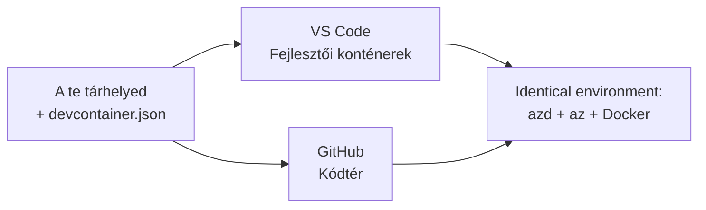

# Dev Containerek és GitHub Codespaces az azd-hez

**Fejezet navigáció:**
- **📚 Kurzus kezdőlap**: [AZD kezdőknek](../../README.md)
- **📖 Jelenlegi fejezet**: 1. fejezet - Alapok és gyors kezdés
- **⬅️ Előző**: [Hozd a saját alkalmazásod](bring-your-own-app.md)
- **🚀 Következő fejezet**: [2. fejezet: AI-első fejlesztés](../chapter-02-ai-development/README.md)

> Érvényesítve az `azd 1.27.1` verzióval 2026 júliusában.

## Bevezetés

Az azd, a megfelelő nyelvi futtatókörnyezet, a Docker és az Azure CLI telepítése minden gépen fáradságos munka — és ez az első számú oka annak, hogy az a "nálam működik" oktatóanyag másnál nem. Egy **dev container** ezt úgy oldja meg, hogy a teljes eszköztáradat egy fájlban írja le. Bárki, aki megnyitja a projektet VS Code-ban vagy GitHub Codespaces-ben, pontosan ugyanazt a környezetet kapja, azzal, hogy az azd már telepítve van benne. Ez a lecke megmutatja, hogyan adj hozzá egyet.

## Tanulási célok

A lecke végére:
- Megérted, mi az a dev container és miért segít az azd-vel
- Hozzáadsz egy minimális `.devcontainer/devcontainer.json` fájlt egy projekthez
- Az azd, az Azure CLI és a Docker bekerül a Dev Container *funkcióin* keresztül
- Megnyitod a projektet GitHub Codespaces-ben vagy VS Code-ban

## Eredmények

A lecke elvégzése után képes leszel:
- Szerkeszteni egy `devcontainer.json` fájlt egy azd projekthez
- Hozzáadni az azd-t és az Azure eszközöket manuális telepítés nélkül
- Futtatni az `azd up` parancsot konténerből vagy Codespace-ből

---

## Mi az a Dev Container?

A dev container egy Docker-alapú fejlesztői környezet, amelyet egy `.devcontainer/devcontainer.json` fájl határoz meg a repódban. Amikor megnyitod a projektet:

- **VS Code** (a Dev Containers bővítménnyel) felépíti a konténert és csatlakozik hozzá.
- **GitHub Codespaces** ugyanazt a konténert építi fel a felhőben, és böngésző alapú szerkesztőt biztosít.

Bármelyik esetben minden hozzájáruló azonos eszközöket kap — nincs többé, hogy "feltelepítetted az azd-t?" hibakeresés.


```mermaid
graph LR
    Repo[A te tárhelyed<br/>+ devcontainer.json] --> VSCode[VS Code<br/>Fejlesztői konténerek]
    Repo --> Codespaces[GitHub<br/>Kódtér]
    VSCode --> Env[Identical environment:<br/>azd + az + Docker]
    Codespaces --> Env
```

---

## 1. lépés: Hozd létre a devcontainer fájlt

Hozd létre a `.devcontainer/devcontainer.json` fájlt a projekt gyökerében:

```json
{
  "name": "azd-project",
  "image": "mcr.microsoft.com/devcontainers/base:bookworm",
  "features": {
    "ghcr.io/devcontainers/features/azure-cli:1": {},
    "ghcr.io/azure/azure-dev/azd:latest": {},
    "ghcr.io/devcontainers/features/docker-in-docker:2": {},
    "ghcr.io/devcontainers/features/node:1": {}
  },
  "customizations": {
    "vscode": {
      "extensions": [
        "ms-azuretools.azure-dev",
        "ms-azuretools.vscode-bicep"
      ]
    }
  },
  "forwardPorts": [3000],
  "postCreateCommand": "azd version"
}
```

Mit csinál egyes részek:

| Kulcs | Cél |
|-----|--------|
| `image` | A konténer alapvető operációs rendszere |
| `features` | Előre kész telepítők — itt: Azure CLI, **azd**, Docker és Node.js |
| `customizations.vscode.extensions` | Automatikusan telepíti az azd és Bicep VS Code kiterjesztéseket |
| `forwardPorts` | Kiteszi az alkalmazás portját a böngésződhöz |
| `postCreateCommand` | Egyszer lefut a konténer összeállítása után (itt egy ellenőrzés) |

> A `ghcr.io/azure/azure-dev/azd:latest` funkció az hivatalos módja, hogy az azd bekerüljön a konténerbe. Ha reprodukálhatóság kell, tűzd le egy konkrét verzióra (például `azd:1.27.1`).

---

## 2. lépés: Illeszd a funkciót az alkalmazásod nyelvéhez

Cseréld le a `node` funkciót arra, amit az alkalmazásod használ:

```jsonc
// Python project
"ghcr.io/devcontainers/features/python:1": {},

// .NET project
"ghcr.io/devcontainers/features/dotnet:2": {},

// Java project
"ghcr.io/devcontainers/features/java:1": {},

// Go project
"ghcr.io/devcontainers/features/go:1": {}
```

Hagyd meg a `docker-in-docker`-t, ha a `host` értéke `containerapp`, `aks`, vagy bármi, ami konténerképet épít — az azd-nek Docker kell képfelépítéshez és toláshoz.

---

## 3. lépés: Nyisd meg

**VS Code-ban:**
1. Telepítsd a **Dev Containers** bővítményt.
2. Nyisd meg a projekt mappáját.
3. Kattints a **Megnyitás konténerben** felhívásra (vagy futtasd a *Dev Containers: Reopen in Container* parancsot).

**GitHub Codespaces-ben:**
1. Push-old fel a repót GitHub-ra.
2. Kattints a **Code → Codespaces → Create codespace on main** opcióra.
3. Várd meg, amíg a konténer felépül — az azd készen áll a terminálban.

---

## 4. lépés: Telepítés a konténerből

A konténer előre telepítve tartalmazza az azd-t, így a normál munkafolyamat működik:

```bash
azd auth login --use-device-code   # az eszközkód hasznos a Codespaces-en belül
azd up
```

> **Miért `--use-device-code`?** Távoli konténerben vagy Codespace-ben nincs helyi böngésző átirányításhoz, így a device-code bejelentkezés megbízható mód. Beillesztesz egy kódot egy böngészőfülbe a bejelentkezés befejezéséhez.

---

## Gyakori buktatók

| Buktató | Megoldás |
|---------|---------|
| Az `azd up` nem tud képet építeni | Add hozzá a `docker-in-docker` funkciót |
| Böngészős bejelentkezés akad Codespaces-ben | Használd az `azd auth login --use-device-code` parancsot |
| Az eszközök különböznek a csapattagok között | Rögzítsd a funkcióverziókat (pl. `azd:1.27.1`) |
| Az alkalmazás nem elérhető böngészőben | Add hozzá a portot a `forwardPorts`-hoz |

---

## Összegzés

- A dev container mindenki számára reprodukálhatóvá teszi az azd eszköztáradat.
- Add hozzá az azd-t, az Azure CLI-t és a Dockert Dev Container *funkciókon* keresztül.
- Illeszd az alkalmazásod nyelvéhez a nyelv funkciót, és tartsd meg a `docker-in-docker`-t konténerhostoknak.
- Használj device-code bejelentkezést, amikor Codespaces-ben futsz.

---

## 🔗 Navigáció

| Irány | Erőforrás |
|--------|-----------|
| **Előző** | [Hozd a saját alkalmazásod](bring-your-own-app.md) |
| **Fejezet kezdőlap** | [1. fejezet: Alapok és gyors kezdés](README.md) |
| **Következő fejezet** | [2. fejezet: AI-első fejlesztés](../chapter-02-ai-development/README.md) |

## 📖 Kapcsolódó források

- [Telepítés és beállítás](installation.md)
- [Parancs összefoglaló](../../resources/cheat-sheet.md)
- [Hivatalos Dev Containers specifikáció](https://containers.dev/)
- [azd Dev Container funkció](https://github.com/Azure/azure-dev/tree/main/ext/devcontainer)

---

<!-- CO-OP TRANSLATOR DISCLAIMER START -->
**Jogi nyilatkozat**:
Ez a dokumentum az AI fordítási szolgáltatás, a [Co-op Translator](https://github.com/Azure/co-op-translator) segítségével készült. Bár az pontosságra törekszünk, kérjük, vegye figyelembe, hogy az automatikus fordítások hibákat vagy pontatlanságokat tartalmazhatnak. Az eredeti dokumentum az anyanyelvén tekintendő hiteles forrásnak. Fontos információk esetén professzionális emberi fordítást javasolunk. Nem vállalunk felelősséget semmilyen félreértésért vagy téves értelmezésért, amely ebből a fordításból ered.
<!-- CO-OP TRANSLATOR DISCLAIMER END -->