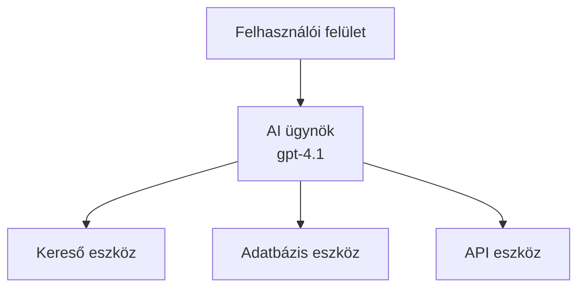
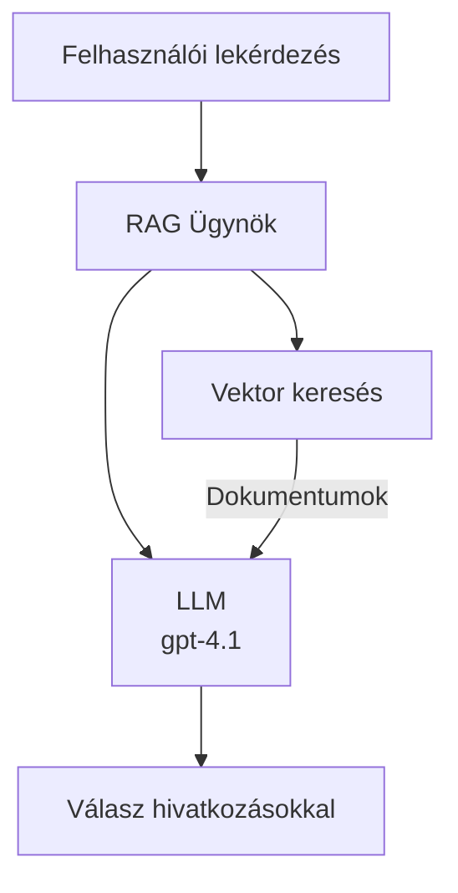
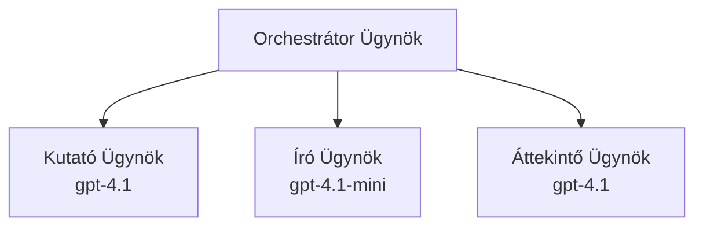

# AI ügynökök az Azure Developer CLI-vel

**Fejezet navigáció:**
- **📚 Kurzus kezdőoldal**: [AZD kezdőknek](../../README.md)
- **📖 Aktuális fejezet**: 2. fejezet - AI-első fejlesztés
- **⬅️ Előző**: [Microsoft Foundry integráció](microsoft-foundry-integration.md)
- **➡️ Következő**: [AI modell telepítés](ai-model-deployment.md)
- **🚀 Haladó**: [Többügynökös megoldások](../../examples/retail-scenario.md)

---

## Bevezetés

Az AI ügynökök autonóm programok, amelyek képesek érzékelni a környezetüket, döntéseket hozni, és cselekedni adott célok elérése érdekében. Ellentétben az egyszerű chatbotokkal, amelyek csak válaszolnak a kérésekre, az ügynökök képesek:

- **Eszközöket használni** – API-k meghívása, adatbázisok keresése, kód végrehajtása
- **Tervezni és érvelni** – Összetett feladatokat lépésekre bontani
- **A kontextusból tanulni** – Emlékezetet fenntartani és a viselkedést adaptálni
- **Együttműködni** – Más ügynökökkel dolgozni (többügynökös rendszerek)

Ez az útmutató megmutatja, hogyan telepíthetsz AI ügynököket az Azure-ra az Azure Developer CLI (azd) segítségével.

> **Érvényességi megjegyzés (2026-03-25):** Az útmutatót az `azd` `1.23.12` és `azure.ai.agents` `0.1.18-preview` verziók alapján áttekintettük. Az `azd ai` funkciók továbbra is előzetes verziójúak, ezért ellenőrizd a bővítmény súgóját, ha a telepített zászlóid eltérnek.

## Tanulási célok

Az útmutató elvégzése után:
- Megérted, mik az AI ügynökök, és miben különböznek a chatbotoktól
- Képes leszel előre elkészített AI ügynöksablonokat telepíteni az AZD-vel
- Beállítod a Foundry ügynököket egyedi ügynökökhöz
- Megvalósítasz alapvető ügynökmintákat (eszközhasználat, RAG, többügynök)
- Figyelemmel kíséred és hibakeresed a telepített ügynököket

## Tanulási eredmények

A tananyag végére:
- Egyetlen parancssal telepítesz AI ügynökalkalmazásokat az Azure-ra
- Konfigurálod az ügynökök eszközeit és képességeit
- Megvalósítod a lekérdezés-alapú generálást (RAG) az ügynökökkel
- Megtervezed a többügynökös architektúrákat összetett munkafolyamatokhoz
- Hibaelhárítod az ügynökök telepítésével kapcsolatos gyakori problémákat

---

## 🤖 Miben különbözik az ügynök a chatbot-tól?

| Tulajdonság | Chatbot | AI ügynök |
|-------------|---------|-----------|
| **Viselkedés** | Válaszol a kérésekre | Autonóm cselekvések |
| **Eszközök** | Nincs | Képes API-k hívására, keresésre, kód futtatásra |
| **Emlékezet** | Csak munkamenetre korlátozott | Állandó, munkamenetek közötti emlékezet |
| **Tervezés** | Egyetlen válasz | Többlépcsős érvelés |
| **Együttműködés** | Egyedüli entitás | Más ügynökökkel együttműködik |

### Egyszerű analógia

- **Chatbot** = Egy segítőkész személy, aki kérdésekre válaszol az információs pultnál
- **AI ügynök** = Egy személyi asszisztens, aki telefonál, időpontot foglal, és elvégzi a feladatokat helyetted

---

## 🚀 Gyors kezdés: Telepítsd első ügynöködet

### 1. lehetőség: Foundry Agents sablon (ajánlott)

```bash
# Az AI ügynökök sablonjának inicializálása
azd init --template get-started-with-ai-agents

# Telepítés Azure-ra
azd up
```

**Ami települ:**
- ✅ Foundry Ügynökök
- ✅ Microsoft Foundry modellek (gpt-4.1)
- ✅ Azure AI Search (RAG-hez)
- ✅ Azure Container Apps (webes felület)
- ✅ Application Insights (monitorozás)

**Idő:** kb. 15-20 perc  
**Költség:** kb. 100-150 USD/hónap (fejlesztési környezet)

### 2. lehetőség: OpenAI ügynök Prompty-val

```bash
# Inicializálja a Prompty-alapú ügynök sablonját
azd init --template agent-openai-python-prompty

# Telepítés Azure-ra
azd up
```

**Ami települ:**
- ✅ Azure Functions (szerver nélküli ügynök futtatás)
- ✅ Microsoft Foundry modellek
- ✅ Prompty konfigurációs fájlok
- ✅ Minta ügynök implementáció

**Idő:** kb. 10-15 perc  
**Költség:** kb. 50-100 USD/hónap (fejlesztési környezet)

### 3. lehetőség: RAG Chat ügynök

```bash
# RAG csevegési sablon inicializálása
azd init --template azure-search-openai-demo

# Telepítés Azure-ra
azd up
```

**Ami települ:**
- ✅ Microsoft Foundry modellek
- ✅ Azure AI Search mintaadatokkal
- ✅ Dokumentumfeldolgozó csővezeték
- ✅ Chat felület hivatkozásokkal

**Idő:** kb. 15-25 perc  
**Költség:** kb. 80-150 USD/hónap (fejlesztési környezet)

### 4. lehetőség: AZD AI Agent Init (Manifest- vagy sablonalapú előzetes verzió)

Ha rendelkezel ügynök manifest fájllal, az `azd ai` paranccsal egyenesen scaffoldingelhetsz Foundry Agent Service projektet. A legújabb előzetes verziók sablonalapú inicializálást is támogatnak, így a pontos promptfolyamat verziótól függően eltérhet.

```bash
# Telepítse az AI ügynökök kiterjesztést
azd extension install azure.ai.agents

# Opcionális: ellenőrizze a telepített előzetes verziót
azd extension show azure.ai.agents

# Inicializálás egy ügynök manifesztből
azd ai agent init -m agent-manifest.yaml

# Telepítés az Azure-ra
azd up
```

**Mikor használd az `azd ai agent init` vs `azd init --template` parancsot:**

| Módszer | Legjobb | Hogyan működik |
|---------|---------|----------------|
| `azd init --template` | Egy működő mintaprojektből indulás | Teljes sablonrepo klónozása kóddal és infrastruktúrával |
| `azd ai agent init -m` | Saját ügynök manifestből építés | Projektstruktúrát scaffoldingel az ügynökdefinícióból |

> **Tipp:** Tanuláshoz használd az `azd init --template` parancsot (1-3. opció fent). Éles ügynökök fejlesztéséhez a saját manifestjeiddel az `azd ai agent init` a javasolt. Teljes hivatkozásért lásd: [AZD AI CLI parancsok](../chapter-08-production/production-ai-practices.md#azd-ai-cli-commands-and-extensions).

---

## 🏗️ Ügynök architektúra minták

### Minta 1: Egyetlen ügynök eszközökkel

A legegyszerűbb minta – egy ügynök, amely több eszközt tud használni.


**Leginkább alkalmas:**
- Ügyfélszolgálati chatbotok
- Kutatási asszisztensek
- Adat elemző ügynökök

**AZD sablon:** `azure-search-openai-demo`

### Minta 2: RAG ügynök (Retrieval-Augmented Generation)

Olyan ügynök, amely releváns dokumentumokat keres mielőtt válaszokat generál.


**Leginkább alkalmas:**
- Vállalati tudásbázisokhoz
- Dokumentumos kérdés-válasz rendszerekhez
- Megfelelőségi és jogi kutatáshoz

**AZD sablon:** `azure-search-openai-demo`

### Minta 3: Többügynökös rendszer

Több specializált ügynök dolgozik együtt összetett feladatokon.


**Leginkább alkalmas:**
- Összetett tartalomgeneráláshoz
- Többlépcsős munkafolyamatokhoz
- Különböző szakértelmet igénylő feladatokhoz

**További tudnivalók:** [Többügynökös koordinációs minták](../chapter-06-pre-deployment/coordination-patterns.md)

---

## ⚙️ Ügynök eszközök konfigurálása

Az ügynökök akkor erősek, ha eszközöket használnak. Íme a gyakori eszközök konfigurálása:

### Eszközkonfiguráció a Foundry ügynökökben

```python
# agent_config.py
from azure.ai.projects import AIProjectClient
from azure.ai.projects.models import FunctionTool, CodeInterpreterTool

# Egyedi eszközök definiálása
search_tool = FunctionTool(
    name="search_knowledge_base",
    description="Search the company knowledge base for relevant documents",
    parameters={
        "type": "object",
        "properties": {
            "query": {
                "type": "string",
                "description": "The search query"
            }
        },
        "required": ["query"]
    }
)

# Ügynök létrehozása eszközökkel
agent = project_client.agents.create_agent(
    model="gpt-4.1",
    name="Support Agent",
    instructions="You are a helpful support agent. Use the search tool to find relevant information.",
    tools=[search_tool, CodeInterpreterTool()]
)
```

### Környezet konfiguráció

```bash
# Állítsa be az ügynökre jellemző környezeti változókat
azd env set AZURE_OPENAI_MODEL "gpt-4.1"
azd env set AGENT_INSTRUCTIONS "You are a helpful assistant..."
azd env set ENABLE_CODE_INTERPRETER "true"
azd env set ENABLE_FILE_SEARCH "true"

# Telepítés frissített konfigurációval
azd deploy
```

---

## 📊 Ügynökök monitorozása

### Application Insights integráció

Minden AZD ügynöksablon tartalmazza az Application Insights monitorozáshoz:

```bash
# Nyissa meg a figyelő irányítópultot
azd monitor --overview

# Élő naplók megtekintése
azd monitor --logs

# Élő metrikák megtekintése
azd monitor --live
```

### Követendő kulcsmutatók

| Mutató | Leírás | Célérték |
|--------|--------|----------|
| Válasz késleltetés | Mennyi idő a válasz generálása | < 5 másodperc |
| Tokenhasználat | Tokenek kérésenként | Figyeld a költségek miatt |
| Eszközhívás sikeressége | Eszközmeghívások %-a sikeres | > 95% |
| Hibaarány | Sikertelen ügynök kérések | < 1% |
| Felhasználói elégedettség | Visszajelzési értékelések | > 4.0/5.0 |

### Egyedi naplózás ügynököknek

```python
import os
from azure.monitor.opentelemetry import configure_azure_monitor
from opentelemetry import trace

# Azure Monitor konfigurálása OpenTelemetry-vel
configure_azure_monitor(
    connection_string=os.environ["APPLICATIONINSIGHTS_CONNECTION_STRING"]
)

tracer = trace.get_tracer(__name__)

def log_agent_interaction(user_query, agent_response, tools_used, latency_ms):
    with tracer.start_as_current_span("agent_interaction") as span:
        span.set_attributes({
            "user_query": user_query,
            "response_length": len(agent_response),
            "tools_used": tools_used,
            "latency_ms": latency_ms
        })
```

> **Megjegyzés:** Telepítsd a szükséges csomagokat: `pip install azure-monitor-opentelemetry opentelemetry`

---

## 💰 Költségmeggondolások

### Becsült havi költségek minták szerint

| Minta | Fejlesztési környezet | Éles környezet |
|-------|-----------------------|----------------|
| Egyetlen ügynök | 50-100 USD | 200-500 USD |
| RAG ügynök | 80-150 USD | 300-800 USD |
| Többügynök (2-3 ügynök) | 150-300 USD | 500-1500 USD |
| Vállalati többügynök | 300-500 USD | 1500-5000+ USD |

### Költségoptimalizálási tippek

1. **Használd a gpt-4.1-mini modellt egyszerű feladatokra**
   ```bash
   azd env set AZURE_OPENAI_MODEL "gpt-4.1-mini"
   ```

2. **Cache-elj ismétlődő lekérdezéseket**
   ```python
   from functools import lru_cache
   
   @lru_cache(maxsize=1000)
   def get_cached_response(query_hash):
       return agent.run(query_hash)
   ```

3. **Állíts be token-limitet futásonként**
   ```python
   # Állítsa be a max_completion_tokens értéket az ügynök futtatásakor, ne a létrehozás során
   run = project_client.agents.create_run(
       thread_id=thread.id,
       agent_id=agent.id,
       max_completion_tokens=1000  # Korlátozza a válasz hosszát
   )
   ```

4. **Skálázz nullára, ha nincs használatban**
   ```bash
   # A Container Apps automatikusan nullára skálázódik
   azd env set MIN_REPLICAS "0"
   ```

---

## 🔧 Ügynökök hibakeresése

### Gyakori problémák és megoldások

<details>
<summary><strong>❌ Az ügynök nem válaszol az eszközhívásokra</strong></summary>

```bash
# Ellenőrizze, hogy az eszközök megfelelően vannak-e regisztrálva
azd show

# Ellenőrizze az OpenAI telepítését
az cognitiveservices account deployment list \
  --name $AZURE_OPENAI_NAME \
  --resource-group $RG_NAME

# Ellenőrizze az ügynök naplóit
azd monitor --logs
```

**Gyakori okok:**
- Az eszköz függvény aláírása nem egyezik
- Hiányzó szükséges jogosultságok
- API végpont nem elérhető
</details>

<details>
<summary><strong>❌ Az ügynök válaszai magas késleltetésűek</strong></summary>

```bash
# Ellenőrizze az Application Insightsot szűk keresztmetszetekért
azd monitor --live

# Fontolja meg egy gyorsabb modell használatát
azd env set AZURE_OPENAI_MODEL "gpt-4.1-mini"
azd deploy
```

**Optimalizálási tippek:**
- Használj streamelt válaszokat
- Implementálj válaszcache-t
- Csökkentsd a kontextusablak méretét
</details>

<details>
<summary><strong>❌ Az ügynök helytelen vagy kitalált információkat ad vissza</strong></summary>

```python
# Fejlessze jobb rendszerparancsokkal
instructions = """
You are a helpful assistant. IMPORTANT:
- Only answer based on provided context
- If you don't know, say "I don't know"
- Always cite your sources
- Never make up information
"""

# Adjon hozzá lekérést az alátámasztáshoz
agent = project_client.agents.create_agent(
    model="gpt-4.1",
    instructions=instructions,
    tools=[FileSearchTool()]  # Alapozza meg a válaszokat dokumentumokban
)
```
</details>

<details>
<summary><strong>❌ Token limit túllépési hibák</strong></summary>

```python
# Kontextusablak-kezelés megvalósítása
def truncate_context(messages, max_tokens=8000, model="gpt-4.1"):
    """Keep only recent messages within token limit."""
    import tiktoken
    encoding = tiktoken.encoding_for_model(model)
    total_tokens = 0
    truncated = []
    
    for msg in reversed(messages):
        msg_tokens = len(encoding.encode(msg.content))
        if total_tokens + msg_tokens > max_tokens:
            break
        truncated.insert(0, msg)
        total_tokens += msg_tokens
    
    return truncated
```
</details>

---

## 🎓 Gyakorlati feladatok

### Feladat 1: Alap ügynök telepítése (20 perc)

**Cél:** Az első AI ügynök telepítése az AZD-vel

```bash
# 1. lépés: Sablon inicializálása
azd init --template get-started-with-ai-agents

# 2. lépés: Bejelentkezés az Azure-ba
azd auth login
# Ha több bérlővel dolgozik, adja hozzá a --tenant-id <tenant-id> opciót

# 3. lépés: Telepítés
azd up

# 4. lépés: Az ügynök tesztelése
# Várható kimenet a telepítés után:
#   Telepítés befejeződött!
#   Végpont: https://<app-name>.<region>.azurecontainerapps.io
# Nyissa meg a kimenetben megjelenő URL-t, és próbáljon meg kérdést feltenni

# 5. lépés: Felügyelet megtekintése
azd monitor --overview

# 6. lépés: Takarítás
azd down --force --purge
```

**Siker kritériumok:**
- [ ] Az ügynök válaszol a kérdésekre
- [ ] Hozzáfér az `azd monitor` által a monitor dashboardhoz
- [ ] Erőforrások sikeresen törölve

### Feladat 2: Egyedi eszköz hozzáadása (30 perc)

**Cél:** Kiterjeszteni az ügynököt egy egyedi eszközzel

1. Telepítsd az ügynök sablont:  
   ```bash
   azd init --template get-started-with-ai-agents
   azd up
   ```
2. Készíts új eszközfüggvényt az ügynök kódjában:  
   ```python
   def get_weather(location: str) -> str:
       """Get current weather for a location."""
       # API hívás az időjárási szolgáltatáshoz
       return f"Weather in {location}: Sunny, 72°F"
   ```
3. Regisztráld az eszközt az ügynöknél:  
   ```python
   from azure.ai.projects.models import FunctionTool

   weather_tool = FunctionTool(
       name="get_weather",
       description="Get current weather for a location",
       parameters={
           "type": "object",
           "properties": {
               "location": {"type": "string", "description": "City name"}
           },
           "required": ["location"]
       }
   )

   agent = project_client.agents.create_agent(
       model="gpt-4.1",
       name="Weather Agent",
       tools=[weather_tool]
   )
   ```
4. Újratelepítés és tesztelés:  
   ```bash
   azd deploy
   # Kérdezze meg: "Milyen az idő Seattle-ben?"
   # Várt eredmény: Az ügynök meghívja a get_weather("Seattle") függvényt, és visszaadja az időjárási információkat
   ```

**Siker kritériumok:**
- [ ] Az ügynök felismeri az időjárással kapcsolatos lekérdezéseket
- [ ] Az eszközt helyesen hívják meg
- [ ] A válasz tartalmazza az időjárási információkat

### Feladat 3: RAG ügynök építése (45 perc)

**Cél:** Olyan ügynök létrehozása, amely dokumentumaidból válaszol kérdésekre

```bash
# 1. lépés: RAG sablon telepítése
azd init --template azure-search-openai-demo
azd up

# 2. lépés: A dokumentumok feltöltése
# Helyezze a PDF/TXT fájlokat a data/ könyvtárba, majd futtassa:
python scripts/prepdocs.py

# 3. lépés: Tesztelés témaspecifikus kérdésekkel
# Nyissa meg a webalkalmazás URL-jét az azd up kimenetből
# Tegyen fel kérdéseket a feltöltött dokumentumairól
# A válaszoknak tartalmazniuk kell a hivatkozási forrásokat, például [doc.pdf]
```

**Siker kritériumok:**
- [ ] Az ügynök a feltöltött dokumentumokból válaszol
- [ ] A válaszok tartalmazzák a hivatkozásokat
- [ ] Nincs téves, kitalált válasz a hatáskörön kívüli kérdésekre

---

## 📚 Következő lépések

Most, hogy megismerted az AI ügynököket, fedezd fel ezeket a haladó témákat:

| Téma | Leírás | Hivatkozás |
|-------|---------|-----------|
| **Többügynökös rendszerek** | Több együttműködő ügynök rendszerének felépítése | [Kiskereskedelmi többügynökös példa](../../examples/retail-scenario.md) |
| **Koordinációs minták** | Orkesztrációs és kommunikációs minták tanulása | [Koordinációs minták](../chapter-06-pre-deployment/coordination-patterns.md) |
| **Éles telepítés** | Vállalati szintű ügynök telepítés | [Éles AI gyakorlatok](../chapter-08-production/production-ai-practices.md) |
| **Ügynök értékelés** | Ügynök teljesítményének tesztelése és értékelése | [AI hibakeresés](../chapter-07-troubleshooting/ai-troubleshooting.md) |
| **AI Workshop labor** | Gyakorlati: Tegye AI megoldását AZD-készre | [AI Workshop labor](ai-workshop-lab.md) |

---

## 📖 További források

### Hivatalos dokumentáció
- [Azure AI Agent Service](https://learn.microsoft.com/azure/ai-services/agents/)
- [Azure AI Foundry Agent Service Gyorsindítás](https://learn.microsoft.com/azure/ai-services/agents/quickstart)
- [Semantic Kernel Agent Framework](https://learn.microsoft.com/semantic-kernel/)

### AZD sablonok ügynökökhöz
- [Kezdés AI ügynökökkel](https://github.com/Azure-Samples/get-started-with-ai-agents)
- [Agent OpenAI Python Prompty](https://github.com/Azure-Samples/agent-openai-python-prompty)
- [Azure Search OpenAI Demo](https://github.com/Azure-Samples/azure-search-openai-demo)

### Közösségi források
- [Awesome AZD - Ügynöksablonok](https://azure.github.io/awesome-azd/?tags=ai-agents)
- [Azure AI Discord](https://discord.gg/microsoft-azure)
- [Microsoft Foundry Discord](https://discord.gg/nTYy5BXMWG)

### Ügynök képességek szerkesztődbe
- [**Microsoft Azure Agent Skills**](https://skills.sh/microsoft/github-copilot-for-azure) – Telepíts újrahasználható AI ügynök képességeket Azure fejlesztéshez GitHub Copilot, Cursor vagy bármely támogatott ügynök számára. Tartalmaz képességeket az [Azure AI](https://skills.sh/microsoft/github-copilot-for-azure/azure-ai), [Microsoft Foundry](https://skills.sh/microsoft/github-copilot-for-azure/microsoft-foundry), [telepítés](https://skills.sh/microsoft/github-copilot-for-azure/azure-deploy) és [diagnosztika](https://skills.sh/microsoft/github-copilot-for-azure/azure-diagnostics) területeken:  
  ```bash
  npx skills add microsoft/github-copilot-for-azure
  ```

---

**Navigáció**  
- **Előző lecke**: [Microsoft Foundry integráció](microsoft-foundry-integration.md)  
- **Következő lecke**: [AI modell telepítés](ai-model-deployment.md)

---

<!-- CO-OP TRANSLATOR DISCLAIMER START -->
**Felelősség kizárása**:  
Ez a dokumentum az [Co-op Translator](https://github.com/Azure/co-op-translator) AI fordító szolgáltatásával készült. Bár az pontosságra törekszünk, kérjük, vegye figyelembe, hogy az automatikus fordítások hibákat vagy pontatlanságokat tartalmazhatnak. Az eredeti dokumentum a saját nyelvén tekintendő tekinthető hiteles forrásnak. Kritikus információk esetén szakmai emberi fordítást javaslunk. Nem vállalunk felelősséget az ebből származó félreértésekért vagy félreértelmezésekért.
<!-- CO-OP TRANSLATOR DISCLAIMER END -->