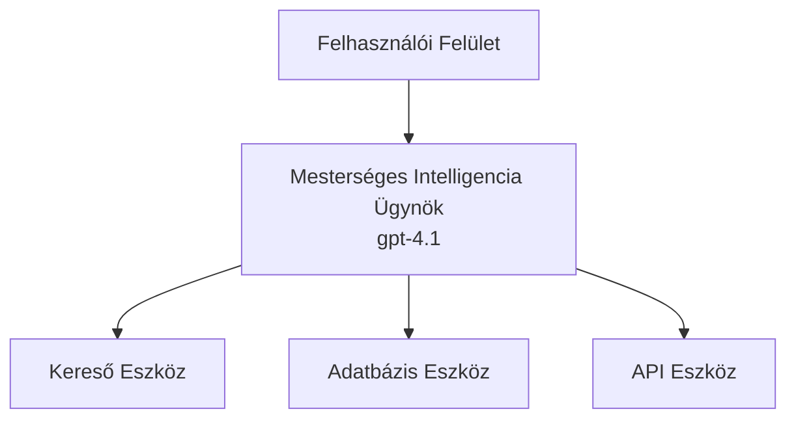
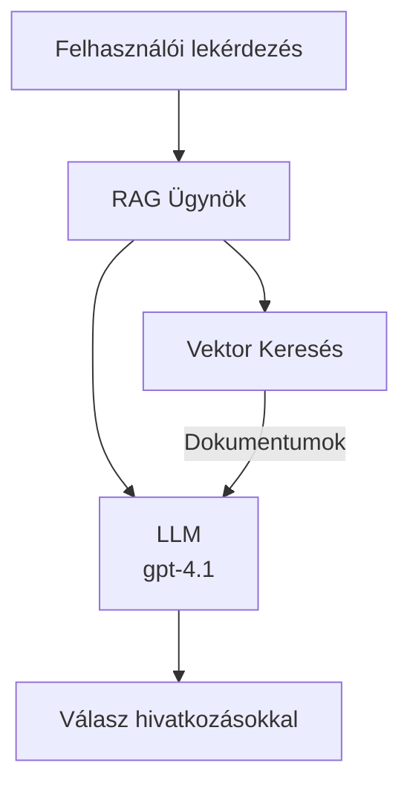
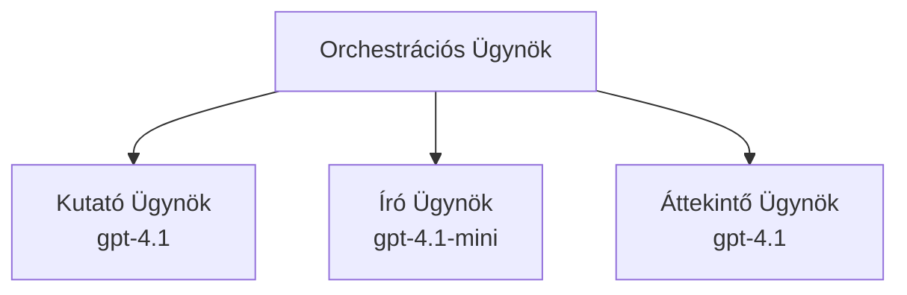

# AI ügynökök az Azure Developer CLI-vel

**Fejezet navigáció:**
- **📚 Tanfolyam kezdőlap**: [AZD Kezdőknek](../../README.md)
- **📖 Jelenlegi fejezet**: 2. fejezet - AI-első fejlesztés
- **⬅️ Előző**: [Microsoft Foundry integráció](microsoft-foundry-integration.md)
- **➡️ Következő**: [AI modell telepítése](ai-model-deployment.md)
- **🚀 Haladó**: [Többügynökös megoldások](../../examples/retail-scenario.md)

---

## Bevezetés

Az AI ügynökök önálló programok, amelyek érzékelni tudják környezetüket, döntéseket hoznak, és cselekvéseket hajtanak végre konkrét célok elérése érdekében. Ellentétben az egyszerű chatbotokkal, amelyek csak parancsokra válaszolnak, az ügynökök képesek:

- **Eszközöket használni** – API-k hívása, adatbázisok keresése, kód végrehajtása
- **Tervezni és érvelni** – Összetett feladatokat lépésekre bontani
- **Tanulni a kontextusból** – Memóriát fenntartani és a viselkedést alkalmazkodni
- **Együttműködni** – Más ügynökökkel (többügynökös rendszerek)

Ez az útmutató megmutatja, hogyan telepíthetsz AI ügynököket az Azure-ra az Azure Developer CLI (azd) használatával.

## Tanulási célok

Az útmutató elvégzése után:
- Megérted, mik azok az AI ügynökök és miben különböznek a chatbotoktól
- Telepítesz előre elkészített AI ügynök sablonokat az AZD segítségével
- Konfigurálod a Foundry ügynököket egyedi ügynökökhöz
- Megvalósítasz alapvető ügynök mintákat (eszközhasználat, RAG, többügynök)
- Figyelemmel kíséred és hibakeresed a telepített ügynököket

## Elért eredmények

A kurzus elvégzése után képes leszel:
- Egyetlen paranccsal AI ügynök alkalmazásokat telepíteni az Azure-ra
- Konfigurálni az ügynök eszközeit és képességeit
- Megvalósítani retrieval-augmented generation (RAG) ügynökökkel
- Tervezni többügynökös architektúrákat összetett munkafolyamatokhoz
- Hibakeresni gyakori ügynök telepítési problémákat

---

## 🤖 Mi különbözteti meg az ügynököt a chatbottól?

| Tulajdonság | Chatbot | AI ügynök |
|-------------|---------|-----------|
| **Viselkedés** | Parancsokra válaszol | Önálló cselekvést hajt végre |
| **Eszközök** | Nincs | API-kat hívhat, kereshet, kódot futtathat |
| **Memória** | Csak munkamenetre korlátozódik | Állandó memória a munkamenetek között |
| **Tervezés** | Egyetlen válasz | Többlépéses érvelés |
| **Együttműködés** | Egyedüli entitás | Más ügynökökkel együtt dolgozhat |

### Egyszerű hasonlat

- **Chatbot** = Egy segítőkész személy az információs pultnál, aki kérdésekre válaszol
- **AI ügynök** = Egy személyi asszisztens, aki képes telefonálni, időpontot foglalni és feladatokat elvégezni helyetted

---

## 🚀 Gyors kezdés: Telepítsd első ügynöködet

### 1. lehetőség: Foundry Agents sablon (ajánlott)

```bash
# Inicializálja az AI ügynökök sablonját
azd init --template get-started-with-ai-agents

# Telepítés Azure-ra
azd up
```

**Telepítve lesz:**
- ✅ Foundry Agents
- ✅ Microsoft Foundry modellek (gpt-4.1)
- ✅ Azure AI Search (RAG-hez)
- ✅ Azure Container Apps (webes felület)
- ✅ Application Insights (figyelés)

**Idő:** kb. 15-20 perc  
**Költség:** kb. 100-150 USD/hó (fejlesztés)

### 2. lehetőség: OpenAI ügynök Prompty-val

```bash
# Inicializálja a Prompty-alapú ügynök sablont
azd init --template agent-openai-python-prompty

# Telepítés az Azure-ra
azd up
```

**Telepítve lesz:**
- ✅ Azure Functions (szerver nélküli ügynök végrehajtás)
- ✅ Microsoft Foundry modellek
- ✅ Prompty konfigurációs fájlok
- ✅ Példa ügynök implementáció

**Idő:** kb. 10-15 perc  
**Költség:** kb. 50-100 USD/hó (fejlesztés)

### 3. lehetőség: RAG Chat ügynök

```bash
# RAG csevegési sablon inicializálása
azd init --template azure-search-openai-demo

# Telepítés Azure-ba
azd up
```

**Telepítve lesz:**
- ✅ Microsoft Foundry modellek
- ✅ Azure AI Search mintapéldákkal
- ✅ Dokumentumfeldolgozó csővezeték
- ✅ Csevegőfelület idézetekkel

**Idő:** kb. 15-25 perc  
**Költség:** kb. 80-150 USD/hó (fejlesztés)

### 4. lehetőség: AZD AI ügynök indítás (manifesztalapú)

Ha van ügynök manifest fájlod, a `azd ai` parancs segítségével közvetlenül létrehozhatsz Foundry Agent Service projektet:

```bash
# Telepítse az AI ügynökök bővítményt
azd extension install azure.ai.agents

# Inicializálás egy ügynök manifesztumból
azd ai agent init -m agent-manifest.yaml

# Telepítés Azure-ba
azd up
```

**Mikor használd az `azd ai agent init` és mikor az `azd init --template` parancsot:**

| Megközelítés | Legjobb alkalmazás | Működés módja |
|--------------|--------------------|---------------|
| `azd init --template` | Működő mintaalkalmazásból indulás | Teljes sablon repo klónozása kóddal és infrastruktúrával |
| `azd ai agent init -m` | Saját ügynök manifestből építkezés | Projektstruktúra létrehozása az ügynök definíció alapján |

> **Tipp:** Tanuláshoz használd az `azd init --template` (1-3. opció fenti). Termelésbe szánt ügynökök létrehozásához a saját manifestekkel az `azd ai agent init` javasolt. Lásd [AZD AI CLI parancsok](../chapter-08-production/production-ai-practices.md#azd-ai-cli-commands-and-extensions) a teljes hivatkozáshoz.

---

## 🏗️ Ügynök architektúra minták

### Minta 1: Egyetlen ügynök eszközökkel

A legegyszerűbb ügynökminta — egy ügynök, amely több eszközt használhat.


**Legjobb alkalmazás:**
- Ügyfélszolgálati botok
- Kutatási asszisztensek
- Adat elemző ügynökök

**AZD sablon:** `azure-search-openai-demo`

### Minta 2: RAG ügynök (Retrieval-Augmented Generation)

Egy ügynök, amely releváns dokumentumokat keres elő válaszadás előtt.


**Legjobb alkalmazás:**
- Vállalati tudásbázisok
- Dokumentum alapú kérdés-válasz rendszerek
- Megfelelőségi és jogi kutatások

**AZD sablon:** `azure-search-openai-demo`

### Minta 3: Többügynökös rendszer

Több, specializált ügynök együttes munkája összetett feladatokhoz.


**Legjobb alkalmazás:**
- Összetett tartalom generálás
- Többlépéses munkafolyamatok
- Különböző szakértelmet igénylő feladatok

**További információ:** [Többügynökös koordinációs minták](../chapter-06-pre-deployment/coordination-patterns.md)

---

## ⚙️ Ügynök eszközök konfigurálása

Az ügynökök akkor válnak erőssé, ha eszközöket használhatnak. Íme, hogyan konfigurálhatod a gyakori eszközöket:

### Eszköz konfiguráció Foundry ügynökökben

```python
# agent_config.py
from azure.ai.projects import AIProjectClient
from azure.ai.projects.models import FunctionTool, CodeInterpreterTool

# Egyedi eszközök definiálása
search_tool = FunctionTool(
    name="search_knowledge_base",
    description="Search the company knowledge base for relevant documents",
    parameters={
        "type": "object",
        "properties": {
            "query": {
                "type": "string",
                "description": "The search query"
            }
        },
        "required": ["query"]
    }
)

# Ügynök létrehozása eszközökkel
agent = project_client.agents.create_agent(
    model="gpt-4.1",
    name="Support Agent",
    instructions="You are a helpful support agent. Use the search tool to find relevant information.",
    tools=[search_tool, CodeInterpreterTool()]
)
```

### Környezeti beállítások

```bash
# Ügynök-specifikus környezeti változók beállítása
azd env set AZURE_OPENAI_MODEL "gpt-4.1"
azd env set AGENT_INSTRUCTIONS "You are a helpful assistant..."
azd env set ENABLE_CODE_INTERPRETER "true"
azd env set ENABLE_FILE_SEARCH "true"

# Frissített konfigurációval történő telepítés
azd deploy
```

---

## 📊 Ügynökök figyelése

### Application Insights integráció

Minden AZD ügynök sablon tartalmaz Application Insights-ot a figyeléshez:

```bash
# Nyisd meg a figyelő műszerfalat
azd monitor --overview

# Élő naplók megtekintése
azd monitor --logs

# Élő metrikák megtekintése
azd monitor --live
```

### Fontos mérőszámok

| Mérőszám | Leírás | Célérték |
|----------|--------|----------|
| Válaszidő késleltetés | A válasz generálásához szükséges idő | < 5 másodperc |
| Token használat | Tokenek egy kérésre | Költség figyelése |
| Eszközhívás sikeressége | Az eszközök sikeres végrehajtásának aránya | > 95% |
| Hibaarány | Sikertelen ügynök kérések aránya | < 1% |
| Felhasználói elégedettség | Visszajelzési értékelések | > 4.0/5.0 |

### Egyedi naplózás ügynökök számára

```python
import os
from azure.monitor.opentelemetry import configure_azure_monitor
from opentelemetry import trace

# Azure Monitor konfigurálása OpenTelemetry-vel
configure_azure_monitor(
    connection_string=os.environ["APPLICATIONINSIGHTS_CONNECTION_STRING"]
)

tracer = trace.get_tracer(__name__)

def log_agent_interaction(user_query, agent_response, tools_used, latency_ms):
    with tracer.start_as_current_span("agent_interaction") as span:
        span.set_attributes({
            "user_query": user_query,
            "response_length": len(agent_response),
            "tools_used": tools_used,
            "latency_ms": latency_ms
        })
```

> **Megjegyzés:** Telepítsd a szükséges csomagokat: `pip install azure-monitor-opentelemetry opentelemetry`

---

## 💰 Költség szempontok

### Becslés havi költségekre mintánként

| Minta | Fejlesztői környezet | Termelés |
|-------|----------------------|----------|
| Egyetlen ügynök | 50-100 USD | 200-500 USD |
| RAG ügynök | 80-150 USD | 300-800 USD |
| Többügynök (2-3 ügynök) | 150-300 USD | 500-1,500 USD |
| Vállalati többügynök | 300-500 USD | 1,500-5,000+ USD |

### Költségoptimalizálási tippek

1. **Használd a gpt-4.1-mini modellt egyszerű feladatokhoz**  
   ```bash
   azd env set AZURE_OPENAI_MODEL "gpt-4.1-mini"
   ```
  
2. **Valósíts meg gyorsítótárazást ismétlődő lekérdezésekhez**  
   ```python
   from functools import lru_cache
   
   @lru_cache(maxsize=1000)
   def get_cached_response(query_hash):
       return agent.run(query_hash)
   ```
  
3. **Állíts be tokenkorlátokat egy-egy futtatáshoz**  
   ```python
   # Állítsa be a max_completion_tokens értéket az ügynök futtatásakor, ne létrehozáskor
   run = project_client.agents.create_run(
       thread_id=thread.id,
       agent_id=agent.id,
       max_completion_tokens=1000  # Korlátozza a válasz hosszát
   )
   ```
  
4. **Méretezd nullára, amikor nincs használatban**  
   ```bash
   # A Container Apps automatikusan nullára skálázódik
   azd env set MIN_REPLICAS "0"
   ```
  
---

## 🔧 Ügynök hibakeresés

### Gyakori problémák és megoldások

<details>
<summary><strong>❌ Az ügynök nem reagál az eszközhívásokra</strong></summary>

```bash
# Ellenőrizze, hogy az eszközök megfelelően vannak-e regisztrálva
azd show

# Ellenőrizze az OpenAI telepítését
az cognitiveservices account deployment list \
  --name $AZURE_OPENAI_NAME \
  --resource-group $RG_NAME

# Ellenőrizze az ügynök naplóit
azd monitor --logs
```
  
**Gyakori okok:**  
- Az eszköz függvény szignatúrája nem egyezik  
- Hiányzó szükséges jogosultságok  
- Az API végpont nem elérhető  
</details>

<details>
<summary><strong>❌ Nagy késleltetés az ügynök válaszaiban</strong></summary>

```bash
# Ellenőrizze az Application Insights-ot a szűk keresztmetszetekért
azd monitor --live

# Fontolja meg egy gyorsabb modell használatát
azd env set AZURE_OPENAI_MODEL "gpt-4.1-mini"
azd deploy
```
  
**Optimalizálási tippek:**  
- Használj streaming válaszokat  
- Valósíts meg válaszgyorsítótárazást  
- Csökkentsd a kontextus méretét  
</details>

<details>
<summary><strong>❌ Az ügynök helytelen vagy kitalált információt ad vissza</strong></summary>

```python
# Javítsa jobb rendszerutasításokkal
instructions = """
You are a helpful assistant. IMPORTANT:
- Only answer based on provided context
- If you don't know, say "I don't know"
- Always cite your sources
- Never make up information
"""

# Adjon hozzá lekérdezést a megalapozáshoz
agent = project_client.agents.create_agent(
    model="gpt-4.1",
    instructions=instructions,
    tools=[FileSearchTool()]  # Alapozza meg a válaszokat dokumentumokban
)
```
</details>

<details>
<summary><strong>❌ Token limit túllépési hibák</strong></summary>

```python
# A kontextusablak kezelésének megvalósítása
def truncate_context(messages, max_tokens=8000, model="gpt-4.1"):
    """Keep only recent messages within token limit."""
    import tiktoken
    encoding = tiktoken.encoding_for_model(model)
    total_tokens = 0
    truncated = []
    
    for msg in reversed(messages):
        msg_tokens = len(encoding.encode(msg.content))
        if total_tokens + msg_tokens > max_tokens:
            break
        truncated.insert(0, msg)
        total_tokens += msg_tokens
    
    return truncated
```
</details>

---

## 🎓 Gyakorlati feladatok

### Feladat 1: Alap ügynök telepítése (20 perc)

**Cél:** Az első AI ügynök telepítése AZD-vel

```bash
# 1. lépés: Sablon inicializálása
azd init --template get-started-with-ai-agents

# 2. lépés: Bejelentkezés az Azure-ba
azd auth login

# 3. lépés: Telepítés
azd up

# 4. lépés: Az ügynök tesztelése
# A telepítés utáni várható kimenet:
#   Telepítés befejezve!
#   Végpont: https://<app-name>.<region>.azurecontainerapps.io
# Nyissa meg a kimenetben megadott URL-t, és próbáljon meg kérdést feltenni

# 5. lépés: Megfigyelés megtekintése
azd monitor --overview

# 6. lépés: Takarítás
azd down --force --purge
```
  
**Siker kritériumok:**  
- [ ] Az ügynök kérdésekre válaszol  
- [ ] Eléri a monitorozó irányítópultot `azd monitor`-ral  
- [ ] Az erőforrások sikeresen törölve

### Feladat 2: Egyedi eszköz hozzáadása (30 perc)

**Cél:** Egy ügynök kiterjesztése egyedi eszközzel

1. Telepítsd az ügynök sablonját:  
   ```bash
   azd init --template get-started-with-ai-agents
   azd up
   ```
  
2. Hozz létre új eszköz függvényt az ügynök kódjában:  
   ```python
   def get_weather(location: str) -> str:
       """Get current weather for a location."""
       # API hívás az időjárási szolgáltatáshoz
       return f"Weather in {location}: Sunny, 72°F"
   ```
  
3. Regisztráld az eszközt az ügynöknél:  
   ```python
   from azure.ai.projects.models import FunctionTool

   weather_tool = FunctionTool(
       name="get_weather",
       description="Get current weather for a location",
       parameters={
           "type": "object",
           "properties": {
               "location": {"type": "string", "description": "City name"}
           },
           "required": ["location"]
       }
   )

   agent = project_client.agents.create_agent(
       model="gpt-4.1",
       name="Weather Agent",
       tools=[weather_tool]
   )
   ```
  
4. Telepítsd újra és teszteld:  
   ```bash
   azd deploy
   # Kérdés: "Milyen az időjárás Seattle-ben?"
   # Várt eredmény: Az ügynök meghívja a get_weather("Seattle") függvényt, és visszaadja az időjárási információkat
   ```
  
**Siker kritériumok:**  
- [ ] Az ügynök felismeri az időjárással kapcsolatos kérdéseket  
- [ ] Az eszköz helyesen van meghívva  
- [ ] A válasz tartalmazza az időjárási információkat

### Feladat 3: RAG ügynök építése (45 perc)

**Cél:** Egy ügynök létrehozása, amely a dokumentumaidból válaszol a kérdésekre

```bash
# 1. lépés: RAG sablon telepítése
azd init --template azure-search-openai-demo
azd up

# 2. lépés: Dokumentumok feltöltése
# Helyezze a PDF/TXT fájlokat a data/ könyvtárba, majd futtassa:
python scripts/prepdocs.py

# 3. lépés: Tesztelés domain-specifikus kérdésekkel
# Nyissa meg a webalkalmazás URL-jét az azd up kimenetből
# Tegyen fel kérdéseket a feltöltött dokumentumairól
# A válaszoknak tartalmazniuk kell hivatkozásokat, például [doc.pdf]
```
  
**Siker kritériumok:**  
- [ ] Az ügynök az feltöltött dokumentumokból válaszol  
- [ ] A válaszok idézeteket tartalmaznak  
- [ ] Nincs téves vagy kitalált válasz a képességek körén kívüli kérdésekre

---

## 📚 Következő lépések

Most, hogy érted az AI ügynököket, fedezd fel ezeket a haladó témákat:

| Téma | Leírás | Link |
|-------|-------------|------|
| **Többügynökös rendszerek** | Több, együttműködő ügynök rendszerének építése | [Kiskereskedelmi többügynökös példa](../../examples/retail-scenario.md) |
| **Koordinációs minták** | Orkesztrációs és kommunikációs minták tanulása | [Koordinációs minták](../chapter-06-pre-deployment/coordination-patterns.md) |
| **Termelési telepítés** | Vállalati szintű ügynök telepítés | [Termelési AI gyakorlatok](../chapter-08-production/production-ai-practices.md) |
| **Ügynökértékelés** | Ügynök teljesítményének tesztelése és értékelése | [AI hibakeresés](../chapter-07-troubleshooting/ai-troubleshooting.md) |
| **AI Workshop Labor** | Gyakorlati feladat: AZD-kompatibilis AI megoldás készítése | [AI Workshop Labor](ai-workshop-lab.md) |

---

## 📖 További források

### Hivatalos dokumentáció
- [Azure AI Agent Service](https://learn.microsoft.com/azure/ai-services/agents/)
- [Azure AI Foundry Agent Service gyorstalpaló](https://learn.microsoft.com/azure/ai-services/agents/quickstart)
- [Semantic Kernel Agent Framework](https://learn.microsoft.com/semantic-kernel/)

### AZD sablonok ügynökökhöz
- [Kezdés AI ügynökökkel](https://github.com/Azure-Samples/get-started-with-ai-agents)
- [Agent OpenAI Python Prompty](https://github.com/Azure-Samples/agent-openai-python-prompty)
- [Azure Search OpenAI Demo](https://github.com/Azure-Samples/azure-search-openai-demo)

### Közösségi források
- [Awesome AZD - Ügynök sablonok](https://azure.github.io/awesome-azd/?tags=ai-agents)
- [Azure AI Discord](https://discord.gg/microsoft-azure)
- [Microsoft Foundry Discord](https://discord.gg/nTYy5BXMWG)

### Ügynök készségek a szerkesztődnek
- [**Microsoft Azure Agent Skills**](https://skills.sh/microsoft/github-copilot-for-azure) – Telepíts újrahasznosítható AI ügynök képességeket az Azure fejlesztéshez GitHub Copilot, Cursor vagy bármely támogatott ügynök számára. Tartalmaz képességeket az [Azure AI](https://skills.sh/microsoft/github-copilot-for-azure/azure-ai), [Microsoft Foundry](https://skills.sh/microsoft/github-copilot-for-azure/microsoft-foundry), [telepítés](https://skills.sh/microsoft/github-copilot-for-azure/azure-deploy), és [diagnosztika](https://skills.sh/microsoft/github-copilot-for-azure/azure-diagnostics) területén:  
  ```bash
  npx skills add microsoft/github-copilot-for-azure
  ```

---

**Navigáció**
- **Előző lecke**: [Microsoft Foundry integráció](microsoft-foundry-integration.md)
- **Következő lecke**: [AI modell telepítése](ai-model-deployment.md)

---

<!-- CO-OP TRANSLATOR DISCLAIMER START -->
**Felelősségkizárás**:  
Ezt a dokumentumot az AI fordító szolgáltatás [Co-op Translator](https://github.com/Azure/co-op-translator) segítségével fordítottuk. Bár a pontosságra törekszünk, kérjük, vegye figyelembe, hogy az automatikus fordítások tartalmazhatnak hibákat vagy pontatlanságokat. Az eredeti dokumentum a saját nyelvén tekintendő hivatalos forrásnak. Kritikus információk esetén szakmai, emberi fordítást javaslunk. Nem vállalunk felelősséget az ebből származó félreértésekért vagy félreértelmezésekért.
<!-- CO-OP TRANSLATOR DISCLAIMER END -->