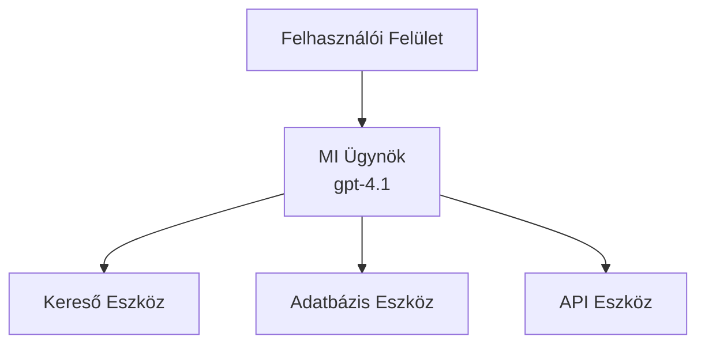
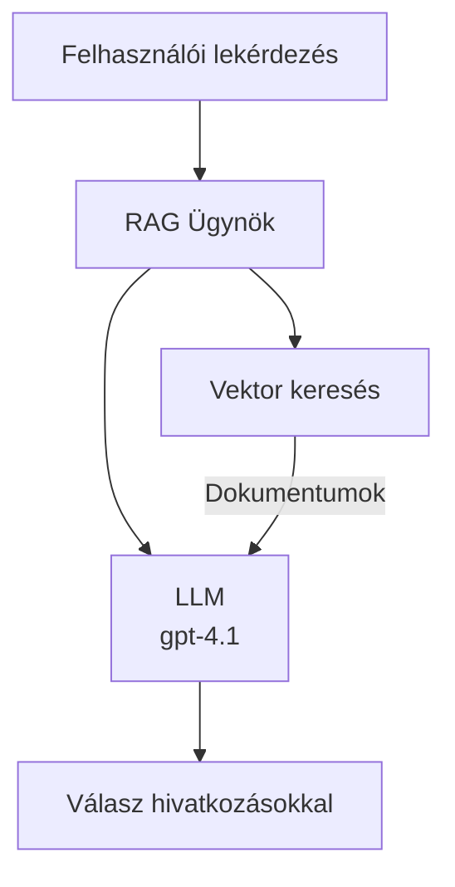
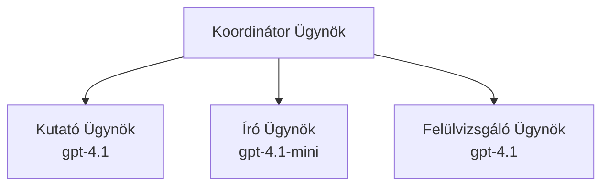

# AI Ügynökök az Azure Developer CLI-vel

**Fejezet navigáció:**
- **📚 Tanfolyam kezdőlap**: [AZD Kezdőknek](../../README.md)
- **📖 Jelenlegi fejezet**: 2. fejezet - AI-első fejlesztés
- **⬅️ Előző**: [Microsoft Foundry integráció](microsoft-foundry-integration.md)
- **➡️ Következő**: [AI modell telepítés](ai-model-deployment.md)
- **🚀 Haladó**: [Több ügynökös megoldások](../../examples/retail-scenario.md)

---

## Bevezetés

Az AI ügynökök önálló programok, amelyek képesek érzékelni környezetüket, döntéseket hozni és cselekedni meghatározott célok elérése érdekében. Ellentétben az egyszerű chatbotokkal, amelyek a bemenetekre válaszolnak, az ügynökök képesek:

- **Eszközöket használni** - API-kat hívni, adatbázisokat keresni, kódot végrehajtani
- **Terveket és érvelést készíteni** - Összetett feladatokat lépésekre bontani
- **Környezeti tanulásra** - Memóriát fenntartani és alkalmazkodni a viselkedéssel
- **Együttműködni** - Más ügynökökkel dolgozni (több ügynökös rendszerek)

Ez az útmutató megmutatja, hogyan telepíthet AI ügynököket Azure-ra az Azure Developer CLI (azd) használatával.

> **Érvényességi megjegyzés (2026-03-25):** Ezt az útmutatót az `azd` `1.23.12` és az `azure.ai.agents` `0.1.18-preview` verziók alapján ellenőrizték. Az `azd ai` élmény még előzetes állapotban van, így ha a telepített bővítményflagjei eltérnek, ellenőrizze a súgót.

## Tanulási célok

Az útmutató végére:
- Megérti, mik az AI ügynökök és miben különböznek a chatbotoktól
- Telepíti előre elkészített AI ügynök sablonokat az AZD segítségével
- Konfigurálja a Foundry ügynököket egyedi ügynökökhöz
- Megvalósítja az alapvető ügynök mintákat (eszközhasználat, RAG, több ügynök)
- Monitorozza és hibakeresést végez a telepített ügynökökön

## Tanulási eredmények

A befejezés után képes lesz:
- Egyszerű parancssal telepíteni AI ügynök alkalmazásokat Azure-ra
- Konfigurálni az ügynök eszközeit és képességeit
- Megvalósítani a leképezéssel bővített generálást (RAG) ügynökökkel
- Több ügynökös architektúrát tervezni összetett munkafolyamatokhoz
- Hibakeresni az ügynök telepítési problémákat

---

## 🤖 Miben más egy ügynök egy chatbothoz képest?

| Jellemző | Chatbot | AI ügynök |
|---------|---------|----------|
| **Viselkedés** | Kérdésekre válaszol | Önálló cselekvést hajt végre |
| **Eszközök** | Nincs | Tud API-kat hívni, keresni, kódot futtatni |
| **Memória** | Csak munkamenet alapú | Állandó memória a munkamenetek között |
| **Tervezés** | Egyszeri válasz | Többlépcsős érvelés |
| **Együttműködés** | Egyedüli entitás | Tud más ügynökökkel dolgozni |

### Egyszerű hasonlat

- **Chatbot** = egy segítőkész ember, aki információs pultnál válaszol kérdésekre
- **AI ügynök** = egy személyi asszisztens, aki hívásokat intéz, időpontokat foglal és feladatokat végez el helyetted

---

## 🚀 Gyors kezdés: Telepítsd első ügynököd

### 1. Opció: Foundry Agents sablon (ajánlott)

```bash
# AI ügynökök sablonjának inicializálása
azd init --template get-started-with-ai-agents

# Telepítés Azure-ra
azd up
```

**Mi kerül telepítésre:**
- ✅ Foundry ügynökök
- ✅ Microsoft Foundry modellek (gpt-4.1)
- ✅ Azure AI Search (RAG-hoz)
- ✅ Azure Container Apps (web felület)
- ✅ Application Insights (monitorozás)

**Idő:** kb. 15-20 perc
**Költség:** kb. 100-150 USD/hónap (fejlesztés)

### 2. Opció: OpenAI ügynök Prompty-val

```bash
# Inicializálja a Prompty-alapú ügynök sablont
azd init --template agent-openai-python-prompty

# Telepítés Azure-ra
azd up
```

**Mi kerül telepítésre:**
- ✅ Azure Functions (szerver nélküli ügynök futtatás)
- ✅ Microsoft Foundry modellek
- ✅ Prompty konfigurációs fájlok
- ✅ Minta ügynök implementáció

**Idő:** kb. 10-15 perc
**Költség:** kb. 50-100 USD/hónap (fejlesztés)

### 3. Opció: RAG chat ügynök

```bash
# RAG chat sablon inicializálása
azd init --template azure-search-openai-demo

# Telepítés Azure-ra
azd up
```

**Mi kerül telepítésre:**
- ✅ Microsoft Foundry modellek
- ✅ Azure AI Search mintaadatokkal
- ✅ Dokumentum feldolgozó csővezeték
- ✅ Chat felület idézetekkel

**Idő:** kb. 15-25 perc
**Költség:** kb. 80-150 USD/hónap (fejlesztés)

### 4. Opció: AZD AI ügynök inicializálás (Manifeszt vagy sablon-alapú előzetes)

Ha van ügynök manifeszt fájlod, az `azd ai` parancs segítségével közvetlenül scaffoldingelhetsz Foundry Agent Service projektet. A legújabb előzetes kiadások sablon-alapú inicializálást is támogatnak, így az adott bővítmény verziójától függően az interakció kissé eltérhet.

```bash
# Telepítse az AI ügynökök bővítményét
azd extension install azure.ai.agents

# Opcionális: Ellenőrizze a telepített előzetes verziót
azd extension show azure.ai.agents

# Inicializálás egy ügynök leírásból
azd ai agent init -m agent-manifest.yaml

# Telepítés az Azure-ra
azd up

# Tesztelje a telepített ügynököt (mutatja a késleltetést és az első bájtig eltelt időt)
azd ai agent invoke
```

**Mikor használd az `azd ai agent init` és mikor az `azd init --template` parancsot:**

| Megközelítés | Legjobb | Hogyan működik |
|----------|----------|------|
| `azd init --template` | Már működő mintaealkalmazásból indul | Teljes sablon repo klónozása kóddal + infrával |
| `azd ai agent init -m` | Saját ügynök manifeszt alapján építés | Projektstruktúra scaffolding az ügynök definícióból |

> **Tipp:** Tanuláshoz használd az `azd init --template` parancsot (1-3 opció fent). Termelési ügynökökhöz saját manifeszt esetén használd az `azd ai agent init` parancsot.

Az `azd up` után az ugyanazon bővítmény végigvezet az ügynök életciklusán: `azd ai agent invoke` tesztelésre, `azd ai agent eval generate` és `azd ai agent optimize` minőségjavításra, majd `azd ai agent delete` takarításra. Lásd [AZD AI CLI parancsok](../chapter-08-production/production-ai-practices.md#azd-ai-cli-commands-and-extensions) a teljes hivatkozásért.

---

## 🏗️ Ügynök architektúra minták

### Minta 1: Egyedüli ügynök eszközökkel

A legegyszerűbb minta - egy ügynök, amely több eszközt tud használni.



**Legjobb erre:**
- Ügyfélszolgálati botok
- Kutatási asszisztensek
- Adat elemző ügynökök

**AZD sablon:** `azure-search-openai-demo`

### Minta 2: RAG ügynök (Kereséssel bővített generálás)

Egy olyan ügynök, amely releváns dokumentumokat keres elő válaszkészítés előtt.



**Legjobb erre:**
- Vállalati tudásbázisok
- Dokumentum Q&A rendszerek
- Megfelelőségi és jogi kutatások

**AZD sablon:** `azure-search-openai-demo`

### Minta 3: Több ügynökös rendszer

Több, specializált ügynök, amelyek együtt dolgoznak összetett feladatokon.



**Legjobb erre:**
- Összetett tartalomgenerálás
- Többlépcsős munkafolyamatok
- Különböző szakértelmet igénylő feladatok

**Tudj meg többet:** [Több ügynökös koordinációs minták](../chapter-06-pre-deployment/coordination-patterns.md)

---

## ⚙️ Ügynök eszközök konfigurálása

Az ügynökök hatékonyak lesznek, ha képesek eszközöket használni. Íme a gyakori eszközök konfigurálása:

### Eszköz konfiguráció a Foundry ügynökökben

```python
# agent_config.py
from azure.ai.projects import AIProjectClient
from azure.ai.projects.models import FunctionTool, CodeInterpreterTool

# Egyedi eszközök definiálása
search_tool = FunctionTool(
    name="search_knowledge_base",
    description="Search the company knowledge base for relevant documents",
    parameters={
        "type": "object",
        "properties": {
            "query": {
                "type": "string",
                "description": "The search query"
            }
        },
        "required": ["query"]
    }
)

# Agent létrehozása eszközökkel
agent = project_client.agents.create_agent(
    model="gpt-4.1",
    name="Support Agent",
    instructions="You are a helpful support agent. Use the search tool to find relevant information.",
    tools=[search_tool, CodeInterpreterTool()]
)
```

### Környezeti beállítások

```bash
# Állítsa be az ügynök-specifikus környezeti változókat
azd env set AZURE_OPENAI_MODEL "gpt-4.1"
azd env set AGENT_INSTRUCTIONS "You are a helpful assistant..."
azd env set ENABLE_CODE_INTERPRETER "true"
azd env set ENABLE_FILE_SEARCH "true"

# Frissített konfigurációval telepítés
azd deploy
```

---

## 📊 Ügynökök monitorozása

### Application Insights integráció

Minden AZD ügynök sablon tartalmazza az Application Insights-ot a monitorozáshoz:

```bash
# Nyissa meg a felügyeleti műszerfalat
azd monitor --overview

# Élő naplók megtekintése
azd monitor --logs

# Élő metrikák megtekintése
azd monitor --live
```

### Fontos mérőszámok nyomon követése

| Mérőszám | Leírás | Célérték |
|--------|-------------|--------|
| Válasz késleltetés | Válasz generálásának ideje | < 5 másodperc |
| Token használat | Tokenek kérésenként | Költségfigyelés |
| Eszköz hívás sikeressége | Sikeres eszközvégrehajtások % | > 95% |
| Hibaarány | Sikertelen ügynöki kérések | < 1% |
| Felhasználói elégedettség | Visszajelzési pontszámok | > 4.0/5.0 |

### Egyedi naplózás az ügynökök számára

```python
import os
from azure.monitor.opentelemetry import configure_azure_monitor
from opentelemetry import trace

# Az Azure Monitor konfigurálása OpenTelemetry-vel
configure_azure_monitor(
    connection_string=os.environ["APPLICATIONINSIGHTS_CONNECTION_STRING"]
)

tracer = trace.get_tracer(__name__)

def log_agent_interaction(user_query, agent_response, tools_used, latency_ms):
    with tracer.start_as_current_span("agent_interaction") as span:
        span.set_attributes({
            "user_query": user_query,
            "response_length": len(agent_response),
            "tools_used": tools_used,
            "latency_ms": latency_ms
        })
```

> **Megjegyzés:** Telepítsd a szükséges csomagokat: `pip install azure-monitor-opentelemetry opentelemetry`

---

## 💰 Költségszempontok

### Becsült havi költségek mintánként

| Minta | Fejlesztői környezet | Termelés |
|---------|-----------------|------------|
| Egyedüli ügynök | 50-100 USD | 200-500 USD |
| RAG ügynök | 80-150 USD | 300-800 USD |
| Több ügynök (2-3 ügynök) | 150-300 USD | 500-1,500 USD |
| Vállalati több ügynök | 300-500 USD | 1,500-5,000+ USD |

### Költség optimalizálási tippek

1. **Használd a gpt-4.1-mini verziót egyszerű feladatokra**
   ```bash
   azd env set AZURE_OPENAI_MODEL "gpt-4.1-mini"
   ```

2. **Alkalmazz gyorsítótárazást ismétlődő lekérdezésekhez**
   ```python
   from functools import lru_cache
   
   @lru_cache(maxsize=1000)
   def get_cached_response(query_hash):
       return agent.run(query_hash)
   ```

3. **Állíts be tokenlimit maximumokat lefutásonként**
   ```python
   # Állítsa be a max_completion_tokens értéket az ügynök futtatásakor, ne létrehozáskor
   run = project_client.agents.create_run(
       thread_id=thread.id,
       agent_id=agent.id,
       max_completion_tokens=1000  # Korlátozza a válasz hosszát
   )
   ```

4. **Skálázz nullára, ha nem használod**
   ```bash
   # A Container Apps automatikusan nullára méreteződnek
   azd env set MIN_REPLICAS "0"
   ```

---

## 🔧 Ügynök hibakeresés

### Gyakori problémák és megoldások

<details>
<summary><strong>❌ Nem válaszol az ügynök az eszköz hívásokra</strong></summary>

```bash
# Ellenőrizze, hogy az eszközök megfelelően vannak-e regisztrálva
azd show

# Ellenőrizze az OpenAI telepítést
az cognitiveservices account deployment list \
  --name $AZURE_OPENAI_NAME \
  --resource-group $RG_NAME

# Ellenőrizze az ügynök naplóit
azd monitor --logs
```

**Gyakori okok:**
- Eszközfüggvény szignatúra eltérés
- Hiányzó jogosultságok
- API végpont nem elérhető
</details>

<details>
<summary><strong>❌ Magas válasz késleltetés az ügynöknél</strong></summary>

```bash
# Ellenőrizze az Application Insights-ot a szűk keresztmetszetek miatt
azd monitor --live

# Fontolja meg egy gyorsabb modell használatát
azd env set AZURE_OPENAI_MODEL "gpt-4.1-mini"
azd deploy
```

**Optimalizálási tippek:**
- Használj streaming válaszokat
- Válasz gyorsítótárazás bevezetése
- Csökkentsd a kontextusablak méretét
</details>

<details>
<summary><strong>❌ Hibás vagy "hallucinált" információ az ügynöktől</strong></summary>

```python
# Fejlessze jobb rendszerparancsokkal
instructions = """
You are a helpful assistant. IMPORTANT:
- Only answer based on provided context
- If you don't know, say "I don't know"
- Always cite your sources
- Never make up information
"""

# Adjon hozzá lekérdezést az alapozáshoz
agent = project_client.agents.create_agent(
    model="gpt-4.1",
    instructions=instructions,
    tools=[FileSearchTool()]  # Alapozza a válaszokat dokumentumokra
)
```
</details>

<details>
<summary><strong>❌ Token limit túllépési hibák</strong></summary>

```python
# Kontextus ablak kezelésének megvalósítása
def truncate_context(messages, max_tokens=8000, model="gpt-4.1"):
    """Keep only recent messages within token limit."""
    import tiktoken
    encoding = tiktoken.encoding_for_model(model)
    total_tokens = 0
    truncated = []
    
    for msg in reversed(messages):
        msg_tokens = len(encoding.encode(msg.content))
        if total_tokens + msg_tokens > max_tokens:
            break
        truncated.insert(0, msg)
        total_tokens += msg_tokens
    
    return truncated
```
</details>

---

## 🎓 Gyakorlati feladatok

### 1. feladat: Alap ügynök telepítése (20 perc)

**Cél:** Első AI ügynök telepítése AZD-vel

```bash
# 1. lépés: Sablon inicializálása
azd init --template get-started-with-ai-agents

# 2. lépés: Bejelentkezés az Azure-ba
azd auth login
# Ha több bérlő között dolgozik, adja hozzá a --tenant-id <tenant-id> paramétert

# 3. lépés: Telepítés
azd up

# 4. lépés: Ügynök tesztelése
# Várható kimenet a telepítés után:
#   A telepítés befejeződött!
#   Végpont: https://<app-name>.<region>.azurecontainerapps.io
# Nyissa meg a kimenetben megjelenő URL-t, és próbáljon kérdést feltenni

# 5. lépés: Megfigyelés megtekintése
azd monitor --overview

# 6. lépés: Takarítás
azd down --force --purge
```

**Siker kritériumok:**
- [ ] Az ügynök válaszol a kérdésekre
- [ ] Eléri a monitorozó műszerfalat az `azd monitor` paranccsal
- [ ] Erőforrások sikeres tisztítása

### 2. feladat: Egyedi eszköz hozzáadása (30 perc)

**Cél:** Bővíts egy ügynököt egy egyedi eszközzel

1. Telepítsd az ügynök sablont:
   ```bash
   azd init --template get-started-with-ai-agents
   azd up
   ```
2. Hozz létre egy új eszközfüggvényt az ügynök kódjában:
   ```python
   def get_weather(location: str) -> str:
       """Get current weather for a location."""
       # API hívás az időjárási szolgáltatáshoz
       return f"Weather in {location}: Sunny, 72°F"
   ```
3. Regisztráld az eszközt az ügynöknél:
   ```python
   from azure.ai.projects.models import FunctionTool

   weather_tool = FunctionTool(
       name="get_weather",
       description="Get current weather for a location",
       parameters={
           "type": "object",
           "properties": {
               "location": {"type": "string", "description": "City name"}
           },
           "required": ["location"]
       }
   )

   agent = project_client.agents.create_agent(
       model="gpt-4.1",
       name="Weather Agent",
       tools=[weather_tool]
   )
   ```
4. Ismét telepítsd és teszteld:
   ```bash
   azd deploy
   # Kérdés: "Milyen az időjárás Seattle-ben?"
   # Várt: Az ügynök meghívja a get_weather("Seattle") függvényt és visszaadja az időjárási információkat
   ```

**Siker kritériumok:**
- [ ] Az ügynök felismeri az időjárással kapcsolatos kérdéseket
- [ ] Az eszköz helyesen hívódik meg
- [ ] A válasz tartalmaz időjárás-információt

### 3. feladat: RAG ügynök építése (45 perc)

**Cél:** Olyan ügynök létrehozása, amely dokumentumaidból válaszol kérdésekre

```bash
# 1. lépés: RAG sablon telepítése
azd init --template azure-search-openai-demo
azd up

# 2. lépés: Dokumentumok feltöltése
# Helyezze a PDF/TXT fájlokat a data/ könyvtárba, majd futtassa:
python scripts/prepdocs.py

# 3. lépés: Tesztelés domain-specifikus kérdésekkel
# Nyissa meg a webalkalmazás URL-jét az azd up kimenetéből
# Tegyen fel kérdéseket a feltöltött dokumentumairól
# A válaszok tartalmazzanak hivatkozási hivatkozásokat, például [doc.pdf]
```

**Siker kritériumok:**
- [ ] Az ügynök válaszol a feltöltött dokumentumok alapján
- [ ] A válaszok tartalmaznak hivatkozásokat
- [ ] Nincs téves vagy "hallucinált" válasz a témakörön kívüli kérdésekre

---

## 📚 Következő lépések

Most, hogy érted az AI ügynököket, fedezd fel ezeket a haladó témákat:

| Téma | Leírás | Link |
|-------|-------------|------|
| **Több ügynökös rendszerek** | Több együttműködő ügynökből álló rendszerek építése | [Kiskereskedelmi több ügynökös példa](../../examples/retail-scenario.md) |
| **Koordinációs minták** | Harmonizációs és kommunikációs minták tanulása | [Koordinációs minták](../chapter-06-pre-deployment/coordination-patterns.md) |
| **Termelési telepítés** | Vállalati szintű ügynök telepítés | [Termelési AI gyakorlatok](../chapter-08-production/production-ai-practices.md) |
| **Ügynök értékelés** | Teszteld és értékeld az ügynök teljesítményét | [AI hibakeresés](../chapter-07-troubleshooting/ai-troubleshooting.md) |
| **AI műhely labor** | Gyakorlati: Tedd AI megoldásod AZD-kompatibilissé | [AI műhely labor](ai-workshop-lab.md) |

---

## 📖 További források

### Hivatalos dokumentáció
- [Microsoft Foundry Agent Service](https://learn.microsoft.com/azure/ai-services/agents/)
- [Microsoft Foundry Agent Service Gyorskezdés](https://learn.microsoft.com/azure/ai-services/agents/quickstart)
- [Semantic Kernel Agent keretrendszer](https://learn.microsoft.com/semantic-kernel/)

### AZD sablonok ügynökökhöz
- [Kezdés AI ügynökökkel](https://github.com/Azure-Samples/get-started-with-ai-agents)
- [Agent OpenAI Python Prompty](https://github.com/Azure-Samples/agent-openai-python-prompty)
- [Azure Search OpenAI Demo](https://github.com/Azure-Samples/azure-search-openai-demo)

### Közösségi források
- [Awesome AZD - Ügynök sablonok](https://azure.github.io/awesome-azd/?tags=ai-agents)
- [Azure AI Discord](https://discord.gg/microsoft-azure)
- [Microsoft Foundry Discord](https://discord.gg/nTYy5BXMWG)

### Ügynök készségek szerkesztőd számára
- [**Microsoft Azure Agent Skills**](https://skills.sh/microsoft/github-copilot-for-azure) - Telepíts újrahasznosítható AI ügynök készségeket Azure fejlesztéshez GitHub Copilotba, Cursorba vagy bármilyen támogatott ügynökbe. Tartalmaz készségeket az [Azure AI](https://skills.sh/microsoft/github-copilot-for-azure/azure-ai), [Microsoft Foundry](https://skills.sh/microsoft/github-copilot-for-azure/microsoft-foundry), [telepítés](https://skills.sh/microsoft/github-copilot-for-azure/azure-deploy) és [diagnosztika](https://skills.sh/microsoft/github-copilot-for-azure/azure-diagnostics) területekről:
  ```bash
  npx skills add microsoft/github-copilot-for-azure
  ```

---

**Navigáció**
- **Előző lecke**: [Microsoft Foundry integráció](microsoft-foundry-integration.md)
- **Következő lecke**: [AI modell telepítés](ai-model-deployment.md)

---

<!-- CO-OP TRANSLATOR DISCLAIMER START -->
**Jogi nyilatkozat**:
Ez a dokumentum az AI fordítási szolgáltatás, a [Co-op Translator](https://github.com/Azure/co-op-translator) segítségével készült. Bár az pontosságra törekszünk, kérjük, vegye figyelembe, hogy az automatikus fordítások hibákat vagy pontatlanságokat tartalmazhatnak. Az eredeti dokumentum az anyanyelvén tekintendő hiteles forrásnak. Fontos információk esetén professzionális emberi fordítást javasolunk. Nem vállalunk felelősséget semmilyen félreértésért vagy téves értelmezésért, amely ebből a fordításból ered.
<!-- CO-OP TRANSLATOR DISCLAIMER END -->