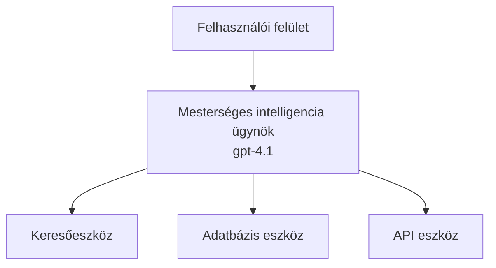
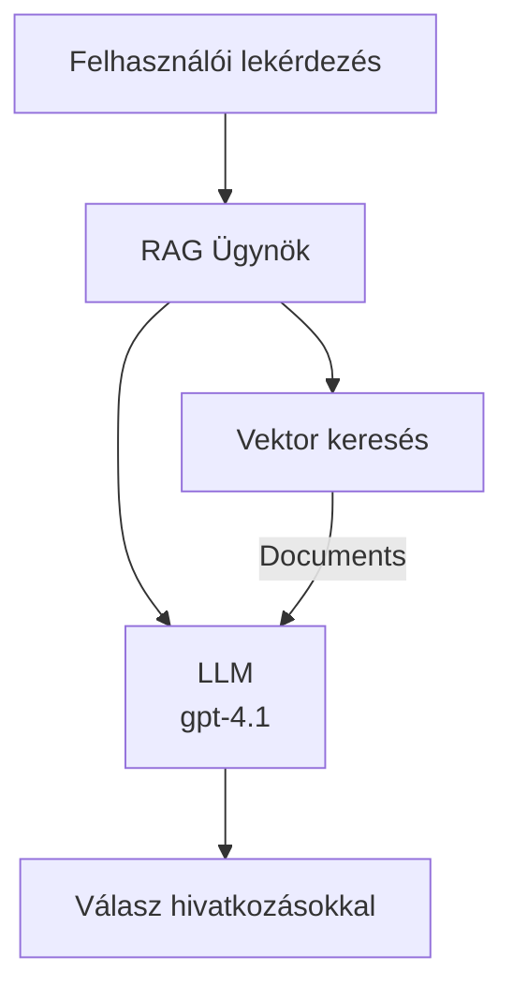
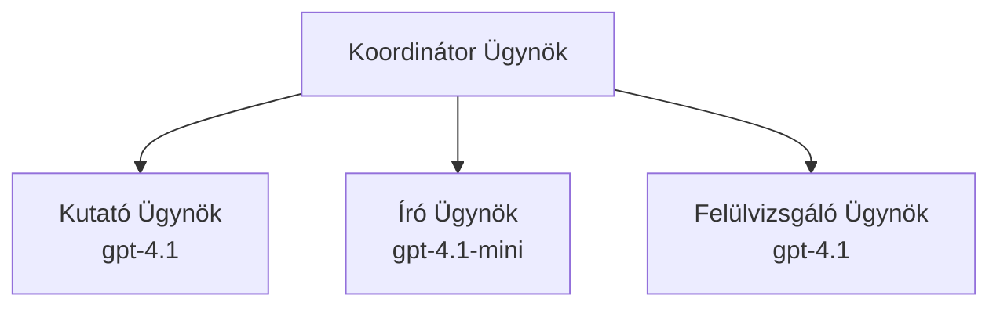

# AI Ügynökök az Azure Developer CLI-vel

**Fejezet Navigáció:**
- **📚 Tanfolyam Kezdőlap**: [AZD Kezdőknek](../../README.md)
- **📖 Aktuális Fejezet**: 2. fejezet - AI-első Fejlesztés
- **⬅️ Előző**: [Microsoft Foundry Integráció](microsoft-foundry-integration.md)
- **➡️ Következő**: [AI Modell Bevetés](ai-model-deployment.md)
- **🚀 Haladó**: [Többügynökös Megoldások](../../examples/retail-scenario.md)

---

## Bevezetés

Az AI ügynökök önálló programok, amelyek képesek érzékelni környezetüket, döntéseket hozni és cselekedni meghatározott célok elérése érdekében. Ellentétben az egyszerű chatbotokkal, amelyek válaszolnak a kérdésekre, az ügynökök képesek:

- **Eszközök használata** - API-k hívása, adatbázisok keresése, kód végrehajtása
- **Tervezni és következtetni** - Bonyolult feladatokat lépésekre bontani
- **Környezetből tanulni** - Memóriát fenntartani és alkalmazkodni a viselkedéshez
- **Együttműködni** - Más ügynökökkel dolgozni (többügynökös rendszerek)

Ez az útmutató megmutatja, hogyan telepíthetsz AI ügynököket az Azure-ra az Azure Developer CLI (azd) segítségével.

> **Érvényességi megjegyzés (2026-07-13):** Ez az útmutató az `azd` `1.27.1` és az `azure.ai.agents` `1.0.0-beta.5` verzióival került ellenőrzésre. Az `azd ai` élmény még mindig előzetes, ezért ellenőrizd a kiterjesztés súgóját, ha a telepített zászlóid eltérnek.

## Tanulási Célok

Az útmutató elvégzésével:
- Megérted, mik azok az AI ügynökök és hogyan különböznek a chatbotoktól
- Képes leszel előre elkészített AI ügynök sablonokat telepíteni AZD-vel
- Beállítod a Foundry ügynököket egyedi ügynökökhez
- Megvalósítasz alapvető ügynökmintákat (eszközhasználat, RAG, többügynökös)
- Figyeled és hibakeresed a telepített ügynököket

## Tanulási Eredmények

A végére képes leszel:
- AI ügynök alkalmazásokat egyetlen paranccsal telepíteni az Azure-ra
- Ügynök eszközök és képességek konfigurálása
- Végrehajtani a lekérés-alapú generálást (RAG) ügynökökkel
- Többügynökös architektúrák tervezése összetett munkafolyamatokhoz
- Általános hibák elhárítása az ügynök telepítésében

---

## 🤖 Miben különbözik az ügynök a chatbotól?

| Jellemző | Chatbot | AI Ügynök |
|---------|---------|----------|
| **Viselkedés** | Válaszol a kérdésekre | Autonóm cselekvéseket hajt végre |
| **Eszközök** | Nincs | Képes API-kat hívni, keresni, kódot futtatni |
| **Memória** | Csak munkamenet alapú | Állandó memória a munkamenetek között |
| **Tervezés** | Egyszeri válasz | Többlépcsős következtetés |
| **Együttműködés** | Egyetlen entitás | Tud más ügynökökkel együtt dolgozni |

### Egyszerű Hasonlat

- **Chatbot** = Egy segítőkész személy, aki válaszol a kérdésekre egy információs pulton
- **AI Ügynök** = Egy személyi asszisztens, aki képes telefonálni, időpontot foglalni és feladatokat elvégezni helyetted

---

## 🚀 Gyors Kezdés: Telepítsd az Első Ügynöködet

### Opció 1: Foundry Ügynökök Sablon (Ajánlott)

```bash
# Inicializálja az AI ügynökök sablonját
azd init --template get-started-with-ai-agents

# Telepítés Azure-ra
azd up
```

**Mi kerül telepítésre:**
- ✅ Foundry Ügynökök
- ✅ Microsoft Foundry Modellek (gpt-4.1)
- ✅ Azure AI Keresés (RAG-hez)
- ✅ Azure Konténer Alkalmazások (webes felület)
- ✅ Application Insights (felügyelet)

**Idő:** ~15-20 perc
**Költség:** ~$100-150/hónap (fejlesztés)

### Opció 2: OpenAI Ügynök Prompty-val

```bash
# Inicializáld a Prompty-alapú ügynök sablont
azd init --template agent-openai-python-prompty

# Telepítés Azure-ra
azd up
```

**Mi kerül telepítésre:**
- ✅ Azure Functions (szerver nélküli ügynök futtatás)
- ✅ Microsoft Foundry Modellek
- ✅ Prompty konfigurációs fájlok
- ✅ Minta ügynök megvalósítás

**Idő:** ~10-15 perc
**Költség:** ~$50-100/hónap (fejlesztés)

### Opció 3: RAG Csevegő Ügynök

```bash
# RAG csevegési sablon inicializálása
azd init --template azure-search-openai-demo

# Telepítés Azure-ba
azd up
```

**Mi kerül telepítésre:**
- ✅ Microsoft Foundry Modellek
- ✅ Azure AI Keresés mintad adatokkal
- ✅ Dokumentum feldolgozó folyamat
- ✅ Csevegőfelület hivatkozásokkal

**Idő:** ~15-25 perc
**Költség:** ~$80-150/hónap (fejlesztés)

### Opció 4: AZD AI Ügynök Inicializálás (Manifeszt vagy Sablon Alapú Előzetes)

Ha rendelkezel ügynök manifeszt fájllal, használhatod az `azd ai` parancsot a Foundry Agent Service projekt közvetlen előkészítésére. A legújabb előzetes kiadások sablon alapú inicializálást is támogatnak, így a pontos folyamat enyhén eltérhet a telepített kiterjesztés verziójától függően.

```bash
# Telepítse az AI ügynökök bővítményt
azd extension install azure.ai.agents

# Opcionális: ellenőrizze a telepített előzetes verziót
azd extension show azure.ai.agents

# Inicializálás egy ügynök manifesztumból
azd ai agent init -m agent-manifest.yaml

# Telepítés az Azure-ra
azd up

# Tesztelje a telepített ügynököt (mutatja a késleltetést + az első bájtig eltelt időt)
azd ai agent invoke
```

**Mikor használd az `azd ai agent init`-et a `azd init --template` helyett:**

| Megközelítés | Legjobb hasznosítás | Működés |
|----------|----------|------|
| `azd init --template` | Egy működő mintaalkalmazásból indulva | Teljes sablon repo klónozása kóddal + infrastruktúrával |
| `azd ai agent init -m` | Saját ügynök manifeszt alapján építkezve | Projektstruktúra építése az ügynök definíciód alapján |

> **Tipp:** Tanuláshoz használd az `azd init --template` opciókat (1-3 fent). Éles ügynökök építéséhez használd az `azd ai agent init`-et saját manifesztjeiddel.

Az `azd up` után ugyanaz a kiterjesztés végigvezeti az ügynök élettartamán: `azd ai agent invoke` a teszthez, `azd ai agent eval generate` és `azd ai agent optimize` a minőség méréséhez és javításához, valamint `azd ai agent delete` a takarításhoz. Teljes lista az [AZD AI CLI parancsok](../chapter-08-production/production-ai-practices.md#azd-ai-cli-commands-and-extensions) oldalon.

---

## 🏗️ Ügynök Architektúra Minták

### Minta 1: Egyetlen Ügynök Eszközökkel

A legegyszerűbb ügynökminta - egy ügynök, amely több eszközt is tud használni.



**Legjobb használatra:**
- Ügyfélszolgálati robotok
- Kutatási asszisztensek
- Adat elemző ügynökök

**AZD sablon:** `azure-search-openai-demo`

### Minta 2: RAG Ügynök (Lekérdezés-alapú Generálás)

Egy olyan ügynök, amely releváns dokumentumokat keres elő a válaszok generálása előtt.



**Legjobb használatra:**
- Vállalati tudásbázisok
- Dokumentum alapú kérdés-válasz rendszerek
- Jogszabályi és megfelelőségi kutatás

**AZD sablon:** `azure-search-openai-demo`

### Minta 3: Többügynökös Rendszer

Több specializált ügynök együtt dolgozik összetett feladatokon.



**Legjobb használatra:**
- Összetett tartalom generálás
- Többlépcsős munkafolyamatok
- Különböző szakterületi tudást igénylő feladatok

**További információ:** [Többügynökös koordinációs minták](../chapter-06-pre-deployment/coordination-patterns.md)

---

## ⚙️ Ügynök Eszközök Konfigurálása

Az ügynökök erősek lesznek, ha eszközöket tudnak használni. Íme a gyakori eszközök beállítása:

### Eszközök beállítása Foundry Ügynökökben

```python
# agent_config.py
from azure.ai.projects import AIProjectClient
from azure.ai.projects.models import FunctionTool, CodeInterpreterTool

# Egyedi eszközök definiálása
search_tool = FunctionTool(
    name="search_knowledge_base",
    description="Search the company knowledge base for relevant documents",
    parameters={
        "type": "object",
        "properties": {
            "query": {
                "type": "string",
                "description": "The search query"
            }
        },
        "required": ["query"]
    }
)

# Ügynök létrehozása eszközökkel
agent = project_client.agents.create_agent(
    model="gpt-4.1",
    name="Support Agent",
    instructions="You are a helpful support agent. Use the search tool to find relevant information.",
    tools=[search_tool, CodeInterpreterTool()]
)
```

### Környezeti beállítások

```bash
# Ügynökspecifikus környezeti változók beállítása
azd env set AZURE_OPENAI_MODEL "gpt-4.1"
azd env set AGENT_INSTRUCTIONS "You are a helpful assistant..."
azd env set ENABLE_CODE_INTERPRETER "true"
azd env set ENABLE_FILE_SEARCH "true"

# Telepítés frissített konfigurációval
azd deploy
```

---

## 📊 Ügynökök Felügyelete

### Application Insights Integráció

Minden AZD ügynöksablon tartalmazza az Application Insights-t a figyeléshez:

```bash
# Nyisd meg a megfigyelő irányítópultot
azd monitor --overview

# Élő naplók megtekintése
azd monitor --logs

# Élő mérőszámok megtekintése
azd monitor --live
```

### Követendő Fontos Mutatók

| Mutató | Leírás | Cél |
|--------|-------------|--------|
| Válasz Késleltetés | Idő a válasz generálásáig | < 5 másodperc |
| Token Használat | Tokenek lekérelésenként | Költségfigyelés |
| Eszköz Hívás Sikerességi Arány | Eszközök sikeres futtatásának %-a | > 95% |
| Hibaarány | Sikertelen ügynök kérések | < 1% |
| Felhasználói Elégedettség | Visszajelzések pontszámai | > 4.0/5.0 |

### Egyedi Naplózás Ügynököknek

```python
import os
from azure.monitor.opentelemetry import configure_azure_monitor
from opentelemetry import trace

# Azure Monitor konfigurálása OpenTelemetry-vel
configure_azure_monitor(
    connection_string=os.environ["APPLICATIONINSIGHTS_CONNECTION_STRING"]
)

tracer = trace.get_tracer(__name__)

def log_agent_interaction(user_query, agent_response, tools_used, latency_ms):
    with tracer.start_as_current_span("agent_interaction") as span:
        span.set_attributes({
            "user_query": user_query,
            "response_length": len(agent_response),
            "tools_used": tools_used,
            "latency_ms": latency_ms
        })
```

> **Megjegyzés:** Telepítsd a szükséges csomagokat: `pip install azure-monitor-opentelemetry opentelemetry`

---

## 💰 Költség Megfontolások

### Becslések havi költségekre mintánként

| Minta | Fejlesztői Környezet | Éles környezet |
|---------|-----------------|------------|
| Egyetlen Ügynök | $50-100 | $200-500 |
| RAG Ügynök | $80-150 | $300-800 |
| Többügynökös (2-3 ügynök) | $150-300 | $500-1,500 |
| Vállalati Többügynökös | $300-500 | $1,500-5,000+ |

### Költségoptimalizálási Tippek

1. **Egyszerű feladatokhoz használd a gpt-4.1-mini-t**
   ```bash
   azd env set AZURE_OPENAI_MODEL "gpt-4.1-mini"
   ```

2. **Ismétlődő lekérdezésekhez alkalmazz gyorsítótárazást**
   ```python
   from functools import lru_cache
   
   @lru_cache(maxsize=1000)
   def get_cached_response(query_hash):
       return agent.run(query_hash)
   ```

3. **Állíts be token limiteket lefutásonként**
   ```python
   # Állítsa be a max_completion_tokens értéket az ügynök futtatásakor, ne a létrehozáskor
   run = project_client.agents.create_run(
       thread_id=thread.id,
       agent_id=agent.id,
       max_completion_tokens=1000  # Válasz hosszának korlátozása
   )
   ```

4. **Használaton kívül zero skálázás**
   ```bash
   # A Container Apps automatikusan skálázódik nullára
   azd env set MIN_REPLICAS "0"
   ```

---

## 🔧 Ügynökök Hibakeresése

### Gyakori Problémák és Megoldások

<details>
<summary><strong>❌ Ügynök nem reagál az eszköz hívásokra</strong></summary>

```bash
# Ellenőrizze, hogy az eszközök megfelelően vannak-e regisztrálva
azd show

# Ellenőrizze az OpenAI telepítést
az cognitiveservices account deployment list \
  --name $AZURE_OPENAI_NAME \
  --resource-group $RG_NAME

# Ellenőrizze az ügynök naplóit
azd monitor --logs
```

**Gyakori okok:**
- Az eszköz függvény aláírása nem egyezik
- Hiányzó szükséges engedélyek
- API végpont nem elérhető
</details>

<details>
<summary><strong>❌ Magas késleltetés az ügynök válaszaiban</strong></summary>

```bash
# Ellenőrizze az Application Insights-t a szűk keresztmetszetekért
azd monitor --live

# Fontolja meg egy gyorsabb modell használatát
azd env set AZURE_OPENAI_MODEL "gpt-4.1-mini"
azd deploy
```

**Optimalizálási tippek:**
- Használj folyamatos válaszokat (streaming)
- Válaszg közötti gyorsítótárazás alkalmazása
- Kontex ablak méretének csökkentése
</details>

<details>
<summary><strong>❌ Ügynök helytelen vagy hamis információt ad vissza</strong></summary>

```python
# Fejlessze jobb rendszer utasításokkal
instructions = """
You are a helpful assistant. IMPORTANT:
- Only answer based on provided context
- If you don't know, say "I don't know"
- Always cite your sources
- Never make up information
"""

# Adjon hozzá lekérést az igazításhoz
agent = project_client.agents.create_agent(
    model="gpt-4.1",
    instructions=instructions,
    tools=[FileSearchTool()]  # Igazítsa a válaszokat dokumentumokhoz
)
```
</details>

<details>
<summary><strong>❌ Token limit túllépése okozta hibák</strong></summary>

```python
# Kontextusablak kezelésének megvalósítása
def truncate_context(messages, max_tokens=8000, model="gpt-4.1"):
    """Keep only recent messages within token limit."""
    import tiktoken
    encoding = tiktoken.encoding_for_model(model)
    total_tokens = 0
    truncated = []
    
    for msg in reversed(messages):
        msg_tokens = len(encoding.encode(msg.content))
        if total_tokens + msg_tokens > max_tokens:
            break
        truncated.insert(0, msg)
        total_tokens += msg_tokens
    
    return truncated
```
</details>

---

## 🎓 Gyakorlati Feladatok

### Gyakorlat 1: Alap ügynök telepítése (20 perc)

**Cél:** Az első AI ügynök telepítése AZD-vel

```bash
# 1. lépés: Sablon inicializálása
azd init --template get-started-with-ai-agents

# 2. lépés: Bejelentkezés az Azure-ba
azd auth login
# Ha több bérlő között dolgozik, adja hozzá a --tenant-id <tenant-id> paramétert

# 3. lépés: Telepítés
azd up

# 4. lépés: Ügynök tesztelése
# Várt kimenet a telepítés után:
#   Telepítés befejezve!
#   Végpont: https://<app-name>.<region>.azurecontainerapps.io
# Nyissa meg a kimenetben megjelenő URL-t, és próbáljon kérdést feltenni

# 5. lépés: Megfigyelés megtekintése
azd monitor --overview

# 6. lépés: Takarítás
azd down --force --purge
```

**Siker kritériumok:**
- [ ] Az ügynök válaszol a kérdésekre
- [ ] Elérhető a figyelő műszerfal az `azd monitor` paranccsal
- [ ] Az erőforrások sikeresen takarítva

### Gyakorlat 2: Egyedi eszköz hozzáadása (30 perc)

**Cél:** Egy ügynök bővítése egy egyedi eszközzel

1. Telepítsd az ügynök sablont:
   ```bash
   azd init --template get-started-with-ai-agents
   azd up
   ```
2. Hozz létre egy új eszköz függvényt az ügynök kódjában:
   ```python
   def get_weather(location: str) -> str:
       """Get current weather for a location."""
       # API hívás az időjárási szolgáltatáshoz
       return f"Weather in {location}: Sunny, 72°F"
   ```
3. Regisztráld az eszközt az ügynöknél:
   ```python
   from azure.ai.projects.models import FunctionTool

   weather_tool = FunctionTool(
       name="get_weather",
       description="Get current weather for a location",
       parameters={
           "type": "object",
           "properties": {
               "location": {"type": "string", "description": "City name"}
           },
           "required": ["location"]
       }
   )

   agent = project_client.agents.create_agent(
       model="gpt-4.1",
       name="Weather Agent",
       tools=[weather_tool]
   )
   ```
4. Újratelepítés és teszt:
   ```bash
   azd deploy
   # Kérdezd meg: "Milyen az idő Seattle-ben?"
   # Várt eredmény: Az ügynök meghívja a get_weather("Seattle") függvényt és visszaadja az időjárási információkat
   ```

**Siker kritériumok:**
- [ ] Az ügynök felismeri az időjárással kapcsolatos lekérdezéseket
- [ ] Az eszköz helyesen hívódik meg
- [ ] A válasz tartalmazza az időjárási információkat

### Gyakorlat 3: RAG Ügynök építése (45 perc)

**Cél:** Olyan ügynök készítése, amely dokumentumaidból válaszol kérdésekre

```bash
# 1. lépés: RAG sablon telepítése
azd init --template azure-search-openai-demo
azd up

# 2. lépés: Dokumentumok feltöltése
# Helyezze a PDF/TXT fájlokat a data/ könyvtárba, majd futtassa:
python scripts/prepdocs.py

# 3. lépés: Tesztelés domain-specifikus kérdésekkel
# Nyissa meg a webalkalmazás URL-jét az azd up kimenetéből
# Tegyen fel kérdéseket a feltöltött dokumentumokról
# A válaszok tartalmazzanak hivatkozásokat, például [doc.pdf]
```

**Siker kritériumok:**
- [ ] Az ügynök az feltöltött dokumentumok alapján válaszol
- [ ] A válaszok hivatkozásokat tartalmaznak
- [ ] Nincs téves válasz hatáskörön kívüli kérdésekre

---

## 📚 Következő lépések

Most, hogy megértetted az AI ügynököket, fedezd fel ezeket a haladó témákat:

| Téma | Leírás | Link |
|-------|-------------|------|
| **Többügynökös Rendszerek** | Több együttműködő ügynök rendszereinek építése | [Kiskereskedelmi Többügynökös Példa](../../examples/retail-scenario.md) |
| **Koordinációs Minták** | Tanulj meg összehangolási és kommunikációs mintákat | [Koordinációs Minták](../chapter-06-pre-deployment/coordination-patterns.md) |
| **Éles Telepítés** | Vállalati igényeknek megfelelő ügynök telepítés | [Prod AI Gyakorlatok](../chapter-08-production/production-ai-practices.md) |
| **Ügynök Értékelés** | Ügynök teljesítmény tesztelése és értékelése | [AI Hibakeresés](../chapter-07-troubleshooting/ai-troubleshooting.md) |
| **AI Műhely Labor** | Gyakorlati: Készítsd AI megoldásod AZD-kompatibilissé | [AI Műhely Labor](ai-workshop-lab.md) |

---

## 📖 További Források

### Hivatalos Dokumentáció
- [Microsoft Foundry Ügynök Szolgáltatás](https://learn.microsoft.com/azure/ai-services/agents/)
- [Microsoft Foundry Ügynök Szolgáltatás Gyors Start](https://learn.microsoft.com/azure/ai-services/agents/quickstart)
- [Semantic Kernel Ügynök Keretrendszer](https://learn.microsoft.com/semantic-kernel/)

### AZD Sablonok Ügynökökhöz
- [AI Ügynökök Kezdése](https://github.com/Azure-Samples/get-started-with-ai-agents)
- [Agent OpenAI Python Prompty](https://github.com/Azure-Samples/agent-openai-python-prompty)
- [Azure Search OpenAI Demo](https://github.com/Azure-Samples/azure-search-openai-demo)

### Közösségi Források
- [Szuper AZD - Ügynök Sablonok](https://azure.github.io/awesome-azd/?tags=ai-agents)
- [Azure AI Discord](https://discord.gg/microsoft-azure)
- [Microsoft Foundry Discord](https://discord.gg/nTYy5BXMWG)

### Ügynök Képességek a Szerkesztődbe
- [**Microsoft Azure Ügynök Képességek**](https://skills.sh/microsoft/github-copilot-for-azure) - Telepíts újrahasználható AI ügynök képességeket Azure fejlesztéshez GitHub Copilot-ban, Cursor-ban vagy bármely támogatott ügynökben. Tartalmaz képességeket [Azure AI](https://skills.sh/microsoft/github-copilot-for-azure/azure-ai), [Microsoft Foundry](https://skills.sh/microsoft/github-copilot-for-azure/microsoft-foundry), [telepítés](https://skills.sh/microsoft/github-copilot-for-azure/azure-deploy) és [diagnosztika](https://skills.sh/microsoft/github-copilot-for-azure/azure-diagnostics) témakörökben:
  ```bash
  npx skills add microsoft/github-copilot-for-azure
  ```

---

**Navigáció**
- **Előző Lecke**: [Microsoft Foundry Integráció](microsoft-foundry-integration.md)
- **Következő Lecke**: [AI Modell Bevetés](ai-model-deployment.md)

---

<!-- CO-OP TRANSLATOR DISCLAIMER START -->
**Jogi nyilatkozat**:
Ez a dokumentum az AI fordítási szolgáltatás, a [Co-op Translator](https://github.com/Azure/co-op-translator) segítségével készült. Bár az pontosságra törekszünk, kérjük, vegye figyelembe, hogy az automatikus fordítások hibákat vagy pontatlanságokat tartalmazhatnak. Az eredeti dokumentum az anyanyelvén tekintendő hiteles forrásnak. Fontos információk esetén professzionális emberi fordítást javasolunk. Nem vállalunk felelősséget semmilyen félreértésért vagy téves értelmezésért, amely ebből a fordításból ered.
<!-- CO-OP TRANSLATOR DISCLAIMER END -->