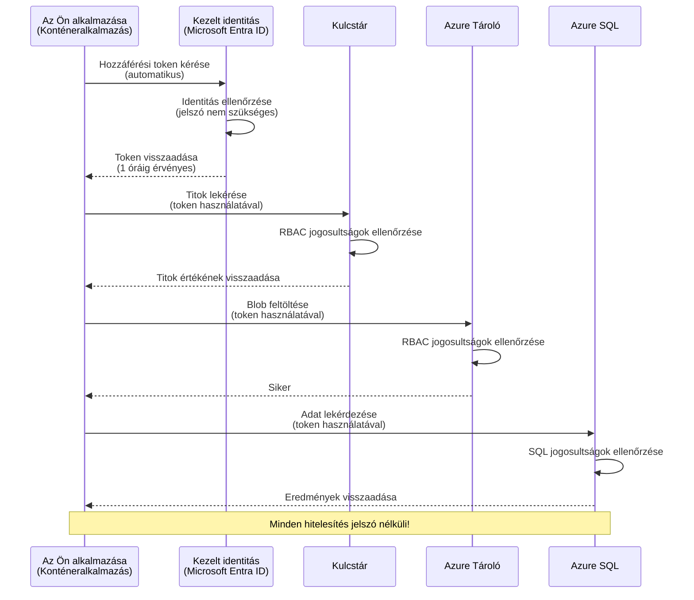
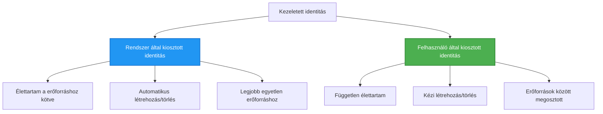

# Hitelesítési minták és kezelt identitás

⏱️ **Várható idő**: 45-60 perc | 💰 **Költséghatás**: Ingyenes (nincs további díj) | ⭐ **Bonyolultság**: Középhaladó

**📚 Tanulási út:**
- ← Előző: [Konfigurációkezelés](configuration.md) - Környezeti változók és titkok kezelése
- 🎯 **Jelenleg itt tartasz**: Hitelesítés és biztonság (Kezelt identitás, Key Vault, biztonságos minták)
- → Következő: [Első projekt](first-project.md) - Készítsd el első AZD alkalmazásodat
- 🏠 [Tanfolyam kezdőlap](../../README.md)

---

## Amit megtanulsz

A leckét teljesítve:
- Megérted az Azure hitelesítési mintáit (kulcsok, kapcsolati karakterláncok, kezelt identitás)
- Megvalósítod a **Kezelt identitást** jelszó nélküli hitelesítéshez
- Biztonságos lesz a titkok kezelése **Azure Key Vault** integrációval
- Beállítod az **RBAC (szerepkör-alapú hozzáférés-vezérlés)**-t az AZD telepítésekhez
- Alkalmazod a biztonsági legjobb gyakorlatokat Container App-ekben és Azure szolgáltatásokban
- Átállsz a kulcsalapú hitelesítésről az identitás alapúra

## Miért fontos a Kezelt identitás

### A probléma: hagyományos hitelesítés

**A Kezelt identitás előtt:**
```javascript
// ❌ BIZTONSÁGI KOCKÁZAT: Keménykódolt titkok a kódban
const connectionString = "Server=mydb.database.windows.net;User=admin;Password=P@ssw0rd123";
const storageKey = "xK7mN9pQ2wR5tY8uI0oP3aS6dF1gH4jK...";
const cosmosKey = "C2x7B9n4M1p8Q5w3E6r0T2y5U8i1O4p7...";
```

**Problémák:**
- 🔴 **Titkok kiszivárgása** a kódban, konfigurációs fájlokban, környezeti változókban
- 🔴 **Hitelesítő adatok forgatása** kódmódosítást és újratelepítést igényel
- 🔴 **Audit rémálom** - Ki, mikor, mit használt?
- 🔴 **Széttöredezettség** - titkok szétszórva több rendszerben
- 🔴 **Megfelelési kockázatok** - biztonsági auditokon megbukik

### A megoldás: Kezelt identitás

**A Kezelt identitás után:**
```javascript
// ✅ BIZTONSÁGOS: Nincsenek titkok a kódban
const credential = new DefaultAzureCredential();
const client = new BlobServiceClient(
  "https://mystorageaccount.blob.core.windows.net",
  credential  // Az Azure automatikusan kezeli az hitelesítést
);
```

**Előnyök:**
- ✅ **Nulla titok** a kódban vagy konfigurációban
- ✅ **Automatikus forgatás** - ezt az Azure végzi
- ✅ **Teljes audit nyomvonal** a Microsoft Entra ID naplókban
- ✅ **Központosított biztonság** - az Azure Portálon keresztül kezelhető
- ✅ **Megfelelőségi kész** - megfelel a biztonsági előírásoknak

**Példa**: A hagyományos hitelesítés olyan, mintha több fizikai kulcsot hordoznál különböző ajtókhoz. A Kezelt identitás olyan, mintha lenne egy biztonsági belépőkártyád, amely automatikusan engedélyt ad a személyed alapján – nincs kulcsot elveszteni, másolni vagy forgatni.

---

## Architektúra áttekintése

### Hitelesítési folyamat Kezelt identitással



### Kezelt identity típusok



| Tulajdonság | Rendszer által kiosztott | Felhasználó által kiosztott |
|-------------|---------------------------|----------------------------|
| **Élettartam** | Erőforráshoz kötött | Független |
| **Létrehozás** | Automatikus az erőforrással | Manuális |
| **Törlés** | Törlődik az erőforrással | Megmarad az erőforrás törlése után is |
| **Megosztás** | Egy erőforráshoz | Több erőforráshoz |
| **Felhasználási eset** | Egyszerű helyzetek | Bonyolult, több erőforrást érintő helyzetek |
| **AZD alapértelmezett** | ✅ Ajánlott | Opcionális |

---

## Előfeltételek

### Szükséges eszközök

Ezeket már telepítened kell, a korábbi leckékből:

```bash
# Ellenőrizze az Azure Developer CLI-t
azd version
# ✅ Elvárt: azd verzió 1.0.0 vagy újabb

# Ellenőrizze az Azure CLI-t
az --version
# ✅ Elvárt: azure-cli 2.50.0 vagy újabb
```

### Azure követelmények

- Aktív Azure előfizetés
- Jogosultságok:
  - Kezelt identitások létrehozásához
  - RBAC szerepkörök hozzárendeléséhez
  - Key Vault erőforrások létrehozásához
  - Container App-ek telepítéséhez

### Tudás előfeltételek

Teljesítened kell:
- [Telepítési útmutató](installation.md) - AZD beállítása
- [AZD alapok](azd-basics.md) - Alapfogalmak
- [Konfigurációkezelés](configuration.md) - Környezeti változók

---

## 1. lecke: Hitelesítési minták megértése

### Minta 1: Kapcsolati karakterláncok (Régi, kerülendő)

**Működés:**
```bash
# A kapcsolati karakterlánc tartalmaz hitelesítő adatokat
STORAGE_CONNECTION_STRING="DefaultEndpointsProtocol=https;AccountName=myaccount;AccountKey=xK7mN9pQ2wR5..."
COSMOS_CONNECTION_STRING="AccountEndpoint=https://myaccount.documents.azure.com:443/;AccountKey=C2x7..."
SQL_CONNECTION_STRING="Server=myserver.database.windows.net;User=admin;Password=P@ssw0rd..."
```

**Problémák:**
- ❌ Titkok láthatóak a környezeti változókban
- ❌ Naplózódnak a telepítési rendszerekben
- ❌ Nehéz forgatni
- ❌ Nincs audit nyomvonal

**Mikor használjuk:** Csak lokális fejlesztéshez, soha ne éles környezetben.

---

### Minta 2: Key Vault hivatkozások (Jobb)

**Működés:**
```bicep
// Store secret in Key Vault
resource keyVault 'Microsoft.KeyVault/vaults@2023-02-01' = {
  name: 'mykv'
  properties: {
    enableRbacAuthorization: true
  }
}

// Reference in Container App
env: [
  {
    name: 'STORAGE_KEY'
    secretRef: 'storage-key'  // References Key Vault
  }
]
```

**Előnyök:**
- ✅ Titkok biztonságosan tárolva a Key Vault-ban
- ✅ Központosított titokkezelés
- ✅ Forgatás kódmódosítás nélkül

**Korlátozások:**
- ⚠️ Még mindig kulcsokat/jelszavakat használ
- ⚠️ Kezelni kell a Key Vault hozzáférést

**Mikor használjuk:** Átmeneti lépés a kapcsolati karakterláncokról a kezelt identitásra.

---

### Minta 3: Kezelt identitás (Legjobb gyakorlat)

**Működés:**
```bicep
// Enable managed identity
resource containerApp 'Microsoft.App/containerApps@2023-05-01' = {
  name: 'myapp'
  identity: {
    type: 'SystemAssigned'  // Automatically creates identity
  }
}

// Grant permissions
resource roleAssignment 'Microsoft.Authorization/roleAssignments@2022-04-01' = {
  scope: storageAccount
  properties: {
    roleDefinitionId: storageBlobDataContributorRole
    principalId: containerApp.identity.principalId
  }
}
```

**Alkalmazás kód:**
```javascript
// Nincsenek szükséges titkok!
const { DefaultAzureCredential } = require('@azure/identity');
const { BlobServiceClient } = require('@azure/storage-blob');

const credential = new DefaultAzureCredential();
const blobServiceClient = new BlobServiceClient(
  'https://mystorageaccount.blob.core.windows.net',
  credential
);
```

**Előnyök:**
- ✅ Nulla titok kódban/környezetben
- ✅ Automatikus hitelesítő adatok forgatása
- ✅ Teljes audit nyomvonal
- ✅ RBAC alapú jogosultságok
- ✅ Megfelelőségi kész

**Mikor használjuk:** Mindig, éles alkalmazásokhoz.

---

### Minta 4: Szolgáltatói főfelhasználók (CI/CD és automatizálás)

A kezelt identitás az arany szabvány *az Azure-ban futó erőforrásokhoz*. De mi a helyzet azzal, ami **külsőleg** fut – például CI/CD pipeline egy build agenten, vagy egy szkript a laptopodon, amely nem használhat interaktív bejelentkezést? Ilyenkor kell egy **szolgáltatói főfelhasználó**: nem emberi identitás a saját hitelesítő adatokkal, amivel egy automatizált folyamat bejelentkezhet.

**Működés:**

Hozz létre szolgáltatói főfelhasználót egy erőforráscsoporthoz (legkisebb jogosultságot alkalmazva):

```bash
az ad sp create-for-rbac \
  --name "myapp-cicd" \
  --role contributor \
  --scopes /subscriptions/<sub-id>/resourceGroups/<rg-name>
```

Ez kibocsát egy kliensazonosítót, kliens titkot és tenant azonosítót. az azd képes nem interaktív bejelentkezésre velük:

```bash
azd auth login \
  --client-id "<appId>" \
  --client-secret "<password>" \
  --tenant-id "<tenant>"
```

**Előnyben részesítsd a federált hitelesítést (OIDC) a titkok helyett.** Hosszú élettartamú kliens titok helyett állíts be federált hitelesítést, így a pipeline rövid élettartamú tokent cserél – nincs titok, ami kiszivároghat vagy forgatható:

```bash
azd auth login \
  --client-id "<appId>" \
  --federated-credential-provider "github" \
  --tenant-id "<tenant>"
```

> Az `azd pipeline config` automatikusan beállítja ezt számodra. Lásd a CI/CD részletes leírásokat a [8. fejezetben](../chapter-08-production/production-ai-practices.md).

**Előnyök:**
- ✅ Működik az Azure-on kívül (build agentek, helyszíni, más felhők)
- ✅ Egy erőforráscsoporthoz korlátozható egy szerepkörrel
- ✅ A federált (OIDC) variáns nem tárol titkot

**Hátrányok:**
- ⚠️ A titkos alapú variáns gondos tárolást és forgatást igényel
- ⚠️ Egy kiszivárgott titok mindent megenged, amit az SP is megtehet – tartsd szorosra a hatókört

**Mikor használjuk:** CI/CD pipeline-okhoz és automatizáláshoz, ami nem használhat kezelt identitást. Mindig preferáld a **federált/OIDC** variánst kliens titok helyett, és használj kezelt identitást, ha a munka az Azure-ban fut.

**Titkok biztonságos tárolása:**
- Soha ne kötelezd el a titkokat – használd a pipeline titoktárolóját (GitHub Actions secrets, Azure DevOps változócsoportok / Key Vault).
- Szűkítsd le az SP jogosultságát a legkisebbre és erőforráscsoportra.
- Állíts be lejáratot, forgasd vagy számolj le a titokkal OIDC-vel.

---

## 2. lecke: Kezelt identitás implementálása AZD-vel

### Lépésről lépésre megvalósítás

Készítsünk egy biztonságos Container App-et, amely kezelt identitást használ Azure Storage-hoz és Key Vault-höz való hozzáféréshez.

### Projekt struktúra

```
secure-app/
├── azure.yaml                 # AZD configuration
├── infra/
│   ├── main.bicep            # Main infrastructure
│   ├── core/
│   │   ├── identity.bicep    # Managed identity setup
│   │   ├── keyvault.bicep    # Key Vault configuration
│   │   └── storage.bicep     # Storage with RBAC
│   └── app/
│       └── container-app.bicep
└── src/
    ├── app.js                # Application code
    ├── package.json
    └── Dockerfile
```

### 1. AZD konfigurálása (azure.yaml)

```yaml
name: secure-app
metadata:
  template: secure-app@1.0.0

services:
  api:
    project: ./src
    language: js
    host: containerapp

# Enable managed identity (AZD handles this automatically)
```

### 2. Infrastruktúra: Kezelt identitás engedélyezése

**Fájl: `infra/main.bicep`**

```bicep
targetScope = 'subscription'

param environmentName string
param location string = 'eastus'

var tags = { 'azd-env-name': environmentName }

// Resource group
resource rg 'Microsoft.Resources/resourceGroups@2021-04-01' = {
  name: 'rg-${environmentName}'
  location: location
  tags: tags
}

// Storage Account
module storage './core/storage.bicep' = {
  name: 'storage'
  scope: rg
  params: {
    name: 'st${uniqueString(rg.id)}'
    location: location
    tags: tags
  }
}

// Key Vault
module keyVault './core/keyvault.bicep' = {
  name: 'keyvault'
  scope: rg
  params: {
    name: 'kv-${uniqueString(rg.id)}'
    location: location
    tags: tags
  }
}

// Container App with Managed Identity
module containerApp './app/container-app.bicep' = {
  name: 'container-app'
  scope: rg
  params: {
    name: 'ca-${environmentName}'
    location: location
    tags: tags
    storageAccountName: storage.outputs.name
    keyVaultName: keyVault.outputs.name
  }
}

// Grant Container App access to Storage
module storageRoleAssignment './core/role-assignment.bicep' = {
  name: 'storage-role'
  scope: rg
  params: {
    principalId: containerApp.outputs.identityPrincipalId
    roleDefinitionId: 'ba92f5b4-2d11-453d-a403-e96b0029c9fe'  // Storage Blob Data Contributor
    targetResourceId: storage.outputs.id
  }
}

// Grant Container App access to Key Vault
module kvRoleAssignment './core/role-assignment.bicep' = {
  name: 'kv-role'
  scope: rg
  params: {
    principalId: containerApp.outputs.identityPrincipalId
    roleDefinitionId: '4633458b-17de-408a-b874-0445c86b69e6'  // Key Vault Secrets User
    targetResourceId: keyVault.outputs.id
  }
}

// Outputs
output AZURE_STORAGE_ACCOUNT_NAME string = storage.outputs.name
output AZURE_KEY_VAULT_NAME string = keyVault.outputs.name
output APP_URL string = containerApp.outputs.url
```

### 3. Container App rendszer által kiosztott identitással

**Fájl: `infra/app/container-app.bicep`**

```bicep
param name string
param location string
param tags object = {}
param storageAccountName string
param keyVaultName string

resource containerApp 'Microsoft.App/containerApps@2023-05-01' = {
  name: name
  location: location
  tags: tags
  identity: {
    type: 'SystemAssigned'  // 🔑 Enable managed identity
  }
  properties: {
    configuration: {
      ingress: {
        external: true
        targetPort: 3000
      }
    }
    template: {
      containers: [
        {
          name: 'api'
          image: 'myregistry.azurecr.io/api:latest'
          resources: {
            cpu: json('0.5')
            memory: '1Gi'
          }
          env: [
            {
              name: 'AZURE_STORAGE_ACCOUNT_NAME'
              value: storageAccountName
            }
            {
              name: 'AZURE_KEY_VAULT_NAME'
              value: keyVaultName
            }
            // 🔑 No secrets - managed identity handles authentication!
          ]
        }
      ]
    }
  }
}

// Output the identity for RBAC assignments
output identityPrincipalId string = containerApp.identity.principalId
output id string = containerApp.id
output url string = 'https://${containerApp.properties.configuration.ingress.fqdn}'
```

### 4. RBAC szerepkör-hozzárendelési modul

**Fájl: `infra/core/role-assignment.bicep`**

```bicep
param principalId string
param roleDefinitionId string  // Azure built-in role ID
param targetResourceId string

resource roleAssignment 'Microsoft.Authorization/roleAssignments@2022-04-01' = {
  name: guid(principalId, roleDefinitionId, targetResourceId)
  scope: resourceId('Microsoft.Resources/resourceGroups', resourceGroup().name)
  properties: {
    roleDefinitionId: subscriptionResourceId('Microsoft.Authorization/roleDefinitions', roleDefinitionId)
    principalId: principalId
    principalType: 'ServicePrincipal'
  }
}

output id string = roleAssignment.id
```

### 5. Alkalmazás kódja kezelt identitással

**Fájl: `src/app.js`**

```javascript
const express = require('express');
const { DefaultAzureCredential } = require('@azure/identity');
const { BlobServiceClient } = require('@azure/storage-blob');
const { SecretClient } = require('@azure/keyvault-secrets');

const app = express();
const PORT = process.env.PORT || 3000;

// 🔑 Hitelesítő adatok inicializálása (automatikusan működik kezelt identitással)
const credential = new DefaultAzureCredential();

// Azure Storage beállítása
const storageAccountName = process.env.AZURE_STORAGE_ACCOUNT_NAME;
const blobServiceClient = new BlobServiceClient(
  `https://${storageAccountName}.blob.core.windows.net`,
  credential  // Nem szükséges kulcs!
);

// Key Vault beállítása
const keyVaultName = process.env.AZURE_KEY_VAULT_NAME;
const secretClient = new SecretClient(
  `https://${keyVaultName}.vault.azure.net`,
  credential  // Nem szükséges kulcs!
);

// Egészségügyi ellenőrzés
app.get('/health', (req, res) => {
  res.json({ status: 'healthy', authentication: 'managed-identity' });
});

// Fájl feltöltése blob tárolóba
app.post('/upload', async (req, res) => {
  try {
    const containerClient = blobServiceClient.getContainerClient('uploads');
    await containerClient.createIfNotExists();
    
    const blobName = `file-${Date.now()}.txt`;
    const blockBlobClient = containerClient.getBlockBlobClient(blobName);
    
    await blockBlobClient.upload('Hello from managed identity!', 30);
    
    res.json({
      success: true,
      blobName: blobName,
      message: 'File uploaded using managed identity!'
    });
  } catch (error) {
    console.error('Upload error:', error);
    res.status(500).json({ error: error.message });
  }
});

// Titok lekérése a Key Vaultból
app.get('/secret/:name', async (req, res) => {
  try {
    const secretName = req.params.name;
    const secret = await secretClient.getSecret(secretName);
    
    res.json({
      name: secretName,
      value: secret.value,
      message: 'Secret retrieved using managed identity!'
    });
  } catch (error) {
    console.error('Secret error:', error);
    res.status(500).json({ error: error.message });
  }
});

// Blob tárolók listázása (az olvasási hozzáférés bemutatása)
app.get('/containers', async (req, res) => {
  try {
    const containers = [];
    for await (const container of blobServiceClient.listContainers()) {
      containers.push(container.name);
    }
    
    res.json({
      containers: containers,
      count: containers.length,
      message: 'Containers listed using managed identity!'
    });
  } catch (error) {
    console.error('List error:', error);
    res.status(500).json({ error: error.message });
  }
});

app.listen(PORT, () => {
  console.log(`Secure API listening on port ${PORT}`);
  console.log('Authentication: Managed Identity (passwordless)');
});
```

**Fájl: `src/package.json`**

```json
{
  "name": "secure-app",
  "version": "1.0.0",
  "dependencies": {
    "express": "^4.18.2",
    "@azure/identity": "^4.0.0",
    "@azure/storage-blob": "^12.17.0",
    "@azure/keyvault-secrets": "^4.7.0"
  },
  "scripts": {
    "start": "node app.js"
  }
}
```

### 6. Telepítés és tesztelés

```bash
# Inicializálja az AZD környezetet
azd init

# Telepítse az infrastruktúrát és az alkalmazást
azd up

# Szerezze be az alkalmazás URL-jét
APP_URL=$(azd env get-values | grep APP_URL | cut -d '=' -f2 | tr -d '"')

# Tesztelje az egészségügyi ellenőrzést
curl $APP_URL/health
```

**✅ Várt eredmény:**
```json
{
  "status": "healthy",
  "authentication": "managed-identity"
}
```

**Blob feltöltés teszt:**
```bash
curl -X POST $APP_URL/upload
```

**✅ Várt eredmény:**
```json
{
  "success": true,
  "blobName": "file-1700404800000.txt",
  "message": "File uploaded using managed identity!"
}
```

**Konténer lista lekérése:**
```bash
curl $APP_URL/containers
```

**✅ Várt eredmény:**
```json
{
  "containers": ["uploads"],
  "count": 1,
  "message": "Containers listed using managed identity!"
}
```

---

## Gyakori Azure RBAC szerepkörök

### Beépített szerepkör-azonosítók Kezelt identitáshoz

| Szolgáltatás | Szerepkör neve | Szerepkör azonosító | Jogosultságok |
|--------------|----------------|--------------------|---------------|
| **Storage** | Storage Blob Data Reader | `2a2b9908-6b94-4a3d-8e5a-a7d8f8cc8a12` | Olvassa a blobokat és konténereket |
| **Storage** | Storage Blob Data Contributor | `ba92f5b4-2d11-453d-a403-e96b0029c9fe` | Olvassa, írja, törli a blobokat |
| **Storage** | Storage Queue Data Contributor | `974c5e8b-45b9-4653-ba55-5f855dd0fb88` | Olvassa, írja, törli a sor üzeneteit |
| **Key Vault** | Key Vault Secrets User | `4633458b-17de-408a-b874-0445c86b69e6` | Titkok olvasása |
| **Key Vault** | Key Vault Secrets Officer | `b86a8fe4-44ce-4948-aee5-eccb2c155cd7` | Titkok olvasása, írása, törlése |
| **Cosmos DB** | Cosmos DB Built-in Data Reader | `00000000-0000-0000-0000-000000000001` | Cosmos DB adatainak olvasása |
| **Cosmos DB** | Cosmos DB Built-in Data Contributor | `00000000-0000-0000-0000-000000000002` | Cosmos DB adatainak olvasása és írása |
| **SQL Database** | SQL DB Contributor | `9b7fa17d-e63e-47b0-bb0a-15c516ac86ec` | SQL adatbázisok kezelése |
| **Service Bus** | Azure Service Bus Data Owner | `090c5cfd-751d-490a-894a-3ce6f1109419` | Üzenetek küldése, fogadása és kezelése |

### Hogyan találjuk meg a szerepkör azonosítókat

```bash
# Minden beépített szerepkör felsorolása
az role definition list --query "[].{Name:roleName, ID:name}" --output table

# Keresés meghatározott szerepkörre
az role definition list --query "[?contains(roleName, 'Storage Blob')].{Name:roleName, ID:name}" --output table

# Szerepkör részleteinek lekérése
az role definition list --name "Storage Blob Data Contributor"
```

---

## Gyakorlati feladatok

### 1. feladat: Kezelt identitás engedélyezése meglévő alkalmazáshoz ⭐⭐ (Középhaladó)

**Cél**: Kezelt identitás hozzáadása meglévő Container App telepítéshez

**Forgatókönyv**: Egy Container App-et használsz kapcsolati karakterláncokkal, alakítsd át kezelt identitásra.

**Kiindulópont**: Container App ezzel a konfigurációval:

```bicep
// ❌ Current: Using connection string
env: [
  {
    name: 'STORAGE_CONNECTION_STRING'
    secretRef: 'storage-connection'
  }
]
```

**Lépések**:

1. **Kezelt identitás engedélyezése Bicep-ben:**

```bicep
resource containerApp 'Microsoft.App/containerApps@2023-05-01' = {
  name: 'myapp'
  identity: {
    type: 'SystemAssigned'  // Add this
  }
  // ... rest of configuration
}
```

2. **Storage hozzáférés engedélyezése:**

```bicep
// Get storage account reference
resource storageAccount 'Microsoft.Storage/storageAccounts@2023-01-01' existing = {
  name: storageAccountName
}

// Assign role
resource roleAssignment 'Microsoft.Authorization/roleAssignments@2022-04-01' = {
  name: guid(containerApp.id, 'ba92f5b4-2d11-453d-a403-e96b0029c9fe', storageAccount.id)
  scope: storageAccount
  properties: {
    roleDefinitionId: subscriptionResourceId('Microsoft.Authorization/roleDefinitions', 'ba92f5b4-2d11-453d-a403-e96b0029c9fe')
    principalId: containerApp.identity.principalId
    principalType: 'ServicePrincipal'
  }
}
```

3. **Alkalmazás kód frissítése:**

**Előtte (kapcsolati karakterlánc):**
```javascript
const { BlobServiceClient } = require('@azure/storage-blob');

const blobServiceClient = BlobServiceClient.fromConnectionString(
  process.env.STORAGE_CONNECTION_STRING
);
```

**Utána (kezelt identitás):**
```javascript
const { DefaultAzureCredential } = require('@azure/identity');
const { BlobServiceClient } = require('@azure/storage-blob');

const credential = new DefaultAzureCredential();
const blobServiceClient = new BlobServiceClient(
  `https://${process.env.STORAGE_ACCOUNT_NAME}.blob.core.windows.net`,
  credential
);
```

4. **Környezeti változók módosítása:**

```bicep
env: [
  {
    name: 'STORAGE_ACCOUNT_NAME'
    value: storageAccountName  // Just the name, no secrets!
  }
  // Remove STORAGE_CONNECTION_STRING
]
```

5. **Telepítés és tesztelés:**

```bash
# Újratelepítés
azd up

# Teszteld, hogy még mindig működik-e
curl https://myapp.azurecontainerapps.io/upload
```

**✅ Sikerkritériumok:**
- ✅ Az alkalmazás hibamentesen települ
- ✅ Tárolási műveletek működnek (feltöltés, lista, letöltés)
- ✅ Nincsenek kapcsolati karakterláncok a környezeti változókban
- ✅ Az identitás látható az Azure Portál "Identitás" paneljén

**Ellenőrzés:**

```bash
# Ellenőrizze, hogy az kezelt identitás engedélyezve van-e
az containerapp show \
  --name myapp \
  --resource-group rg-myapp \
  --query "identity.type"
# ✅ Elvárt: "SystemAssigned"

# Ellenőrizze a szerepkör-hozzárendelést
az role assignment list \
  --assignee $(az containerapp show --name myapp --resource-group rg-myapp --query "identity.principalId" -o tsv) \
  --scope /subscriptions/{sub-id}/resourceGroups/rg-myapp/providers/Microsoft.Storage/storageAccounts/mystorageaccount
# ✅ Elvárt: Megjeleníti a "Storage Blob Data Contributor" szerepkört
```

**Idő**: 20-30 perc

---

### 2. feladat: Több szolgáltatás hozzáférése felhasználó által kiosztott identitással ⭐⭐⭐ (Haladó)

**Cél**: Hozz létre egy felhasználó által kiosztott identitást, amelyet több Container App is használ

**Forgatókönyv**: Három mikroszolgáltatásnak van szüksége ugyanahhoz a Storage fiókhoz és Key Vault-hoz.

**Lépések**:

1. **Felhasználó által kiosztott identitás létrehozása:**

**Fájl: `infra/core/identity.bicep`**

```bicep
param name string
param location string
param tags object = {}

resource userAssignedIdentity 'Microsoft.ManagedIdentity/userAssignedIdentities@2023-01-31' = {
  name: name
  location: location
  tags: tags
}

output id string = userAssignedIdentity.id
output principalId string = userAssignedIdentity.properties.principalId
output clientId string = userAssignedIdentity.properties.clientId
```

2. **Szerepkörök hozzárendelése a felhasználó által kiosztott identitáshoz:**

```bicep
// In main.bicep
module userIdentity './core/identity.bicep' = {
  name: 'user-identity'
  scope: rg
  params: {
    name: 'id-${environmentName}'
    location: location
    tags: tags
  }
}

// Grant Storage access
resource storageRoleAssignment 'Microsoft.Authorization/roleAssignments@2022-04-01' = {
  name: guid(userIdentity.outputs.principalId, 'storage-contributor')
  scope: storageAccount
  properties: {
    roleDefinitionId: subscriptionResourceId('Microsoft.Authorization/roleDefinitions', 'ba92f5b4-2d11-453d-a403-e96b0029c9fe')
    principalId: userIdentity.outputs.principalId
    principalType: 'ServicePrincipal'
  }
}

// Grant Key Vault access
resource kvRoleAssignment 'Microsoft.Authorization/roleAssignments@2022-04-01' = {
  name: guid(userIdentity.outputs.principalId, 'kv-secrets-user')
  scope: keyVault
  properties: {
    roleDefinitionId: subscriptionResourceId('Microsoft.Authorization/roleDefinitions', '4633458b-17de-408a-b874-0445c86b69e6')
    principalId: userIdentity.outputs.principalId
    principalType: 'ServicePrincipal'
  }
}
```

3. **Identitás hozzárendelése több Container App-hez:**

```bicep
resource apiGateway 'Microsoft.App/containerApps@2023-05-01' = {
  name: 'api-gateway'
  identity: {
    type: 'UserAssigned'
    userAssignedIdentities: {
      '${userIdentity.outputs.id}': {}
    }
  }
  // ... rest of config
}

resource productService 'Microsoft.App/containerApps@2023-05-01' = {
  name: 'product-service'
  identity: {
    type: 'UserAssigned'
    userAssignedIdentities: {
      '${userIdentity.outputs.id}': {}
    }
  }
  // ... rest of config
}

resource orderService 'Microsoft.App/containerApps@2023-05-01' = {
  name: 'order-service'
  identity: {
    type: 'UserAssigned'
    userAssignedIdentities: {
      '${userIdentity.outputs.id}': {}
    }
  }
  // ... rest of config
}
```

4. **Alkalmazás kód (minden szolgáltatás ugyanazt a mintát használja):**

```javascript
const { DefaultAzureCredential, ManagedIdentityCredential } = require('@azure/identity');

// Felhasználó által hozzárendelt identitás esetén adja meg az ügyfélazonosítót
const credential = new ManagedIdentityCredential(
  process.env.AZURE_CLIENT_ID  // Felhasználó által hozzárendelt identitás ügyfélazonosítója
);

// Vagy használja a DefaultAzureCredential-t (automatikusan észleli)
const credential = new DefaultAzureCredential();

const blobServiceClient = new BlobServiceClient(
  `https://${process.env.STORAGE_ACCOUNT_NAME}.blob.core.windows.net`,
  credential
);
```

5. **Telepítés és ellenőrzés:**

```bash
azd up

# Teszteld, hogy az összes szolgáltatás hozzáfér-e a tárhelyhez
curl https://api-gateway.azurecontainerapps.io/upload
curl https://product-service.azurecontainerapps.io/upload
curl https://order-service.azurecontainerapps.io/upload
```

**✅ Sikerkritériumok:**
- ✅ Egy identitást használnak a 3 szolgáltatás
- ✅ Mindhárom szolgáltatás hozzáfér a Storage-hoz és Key Vault-hoz
- ✅ Az identitás megmarad, ha törölsz egy szolgáltatást
- ✅ Központosított jogosultságkezelés

**Felhasználó által kiosztott identitás előnyei:**
- Egy identitás kezelése
- Konzekvens jogosultságok a szolgáltatások között
- Megmarad szolgáltatás törlése után is
- Jobb összetett architektúrák esetén

**Idő**: 30-40 perc

---

### 3. feladat: Key Vault titok forgatás megvalósítása ⭐⭐⭐ (Haladó)

**Cél**: Tárolj harmadik féltől származó API kulcsokat Key Vault-ban és érj hozzájuk kezelt identitással

**Forgatókönyv**: Az alkalmazásnak külső API-kat (OpenAI, Stripe, SendGrid) kell hívnia, amelyek API kulcsokat igényelnek.

**Lépések**:

1. **Key Vault létrehozása RBAC-kal:**

**Fájl: `infra/core/keyvault.bicep`**

```bicep
param name string
param location string
param tags object = {}

resource keyVault 'Microsoft.KeyVault/vaults@2023-02-01' = {
  name: name
  location: location
  tags: tags
  properties: {
    enableRbacAuthorization: true  // Use RBAC instead of access policies
    sku: {
      family: 'A'
      name: 'standard'
    }
    tenantId: subscription().tenantId
    enableSoftDelete: true
    softDeleteRetentionInDays: 90
  }
}

// Allow Container App to read secrets
output id string = keyVault.id
output name string = keyVault.name
output uri string = keyVault.properties.vaultUri
```

2. **Titkok tárolása Key Vault-ban:**

```bash
# Szerezze be a Key Vault nevét
KV_NAME=$(azd env get-values | grep AZURE_KEY_VAULT_NAME | cut -d '=' -f2 | tr -d '"')

# Tárolja a harmadik féltől származó API kulcsokat
az keyvault secret set \
  --vault-name $KV_NAME \
  --name "OpenAI-ApiKey" \
  --value "sk-proj-xxxxxxxxxxxxx"

az keyvault secret set \
  --vault-name $KV_NAME \
  --name "Stripe-ApiKey" \
  --value "sk_live_xxxxxxxxxxxxx"

az keyvault secret set \
  --vault-name $KV_NAME \
  --name "SendGrid-ApiKey" \
  --value "SG.xxxxxxxxxxxxx"
```

3. **Alkalmazás kód a titkok lekéréséhez:**

**Fájl: `src/config.js`**

```javascript
const { DefaultAzureCredential } = require('@azure/identity');
const { SecretClient } = require('@azure/keyvault-secrets');

class Config {
  constructor() {
    this.credential = new DefaultAzureCredential();
    this.secretClient = new SecretClient(
      `https://${process.env.AZURE_KEY_VAULT_NAME}.vault.azure.net`,
      this.credential
    );
    this.cache = {};
  }

  async getSecret(secretName) {
    // Először a gyorsítótárat ellenőrizze
    if (this.cache[secretName]) {
      return this.cache[secretName];
    }

    try {
      const secret = await this.secretClient.getSecret(secretName);
      this.cache[secretName] = secret.value;
      console.log(`✅ Retrieved secret: ${secretName}`);
      return secret.value;
    } catch (error) {
      console.error(`❌ Failed to get secret ${secretName}:`, error.message);
      throw error;
    }
  }

  async getOpenAIKey() {
    return this.getSecret('OpenAI-ApiKey');
  }

  async getStripeKey() {
    return this.getSecret('Stripe-ApiKey');
  }

  async getSendGridKey() {
    return this.getSecret('SendGrid-ApiKey');
  }
}

module.exports = new Config();
```

4. **Titkok használata az alkalmazásban:**

**Fájl: `src/app.js`**

```javascript
const express = require('express');
const config = require('./config');
const { OpenAI } = require('openai');

const app = express();

// Az OpenAI inicializálása a Key Vault kulcsával
let openaiClient;

async function initializeServices() {
  const openaiKey = await config.getOpenAIKey();
  openaiClient = new OpenAI({ apiKey: openaiKey });
  console.log('✅ Services initialized with secrets from Key Vault');
}

// Hívás indításkor
initializeServices().catch(console.error);

app.post('/chat', async (req, res) => {
  try {
    const completion = await openaiClient.chat.completions.create({
      model: 'gpt-4.1',
      messages: [{ role: 'user', content: 'Hello!' }]
    });
    
    res.json({
      response: completion.choices[0].message.content,
      authentication: 'Key from Key Vault via Managed Identity'
    });
  } catch (error) {
    res.status(500).json({ error: error.message });
  }
});

app.listen(3000, () => {
  console.log('Secure API with Key Vault integration running');
});
```

5. **Telepítés és tesztelés:**

```bash
azd up

# Tesztelje, hogy az API kulcsok működnek-e
curl -X POST https://myapp.azurecontainerapps.io/chat \
  -H "Content-Type: application/json" \
  -d '{"message":"Hello AI"}'
```

**✅ Sikerkritériumok:**
- ✅ Nincsenek API kulcsok a kódban vagy környezeti változókban
- ✅ Az alkalmazás a kulcsokat a Key Vaultból szerzi be
- ✅ A harmadik féltől származó API-k megfelelően működnek
- ✅ Lehet kulcsokat forgatni kódmódosítás nélkül

**Titok forgatása:**

```bash
# Titok frissítése a Key Vaultban
az keyvault secret set \
  --vault-name $KV_NAME \
  --name "OpenAI-ApiKey" \
  --value "sk-proj-NEW_KEY_HERE"

# Az alkalmazás újraindítása az új kulcs alkalmazásához
az containerapp revision restart \
  --name myapp \
  --resource-group rg-myapp
```

**Időtartam**: 25-35 perc

---

## Tudásellenőrzés

### 1. Hitelesítési minták ✓

Teszteld a tudásod:

- [ ] **K1**: Mik a három fő hitelesítési minták?  
  - **V**: Kapcsolati karakterláncok (régi), Key Vault hivatkozások (átmeneti), Managed Identity (legjobb)

- [ ] **K2**: Miért jobb a managed identity, mint a kapcsolati karakterláncok?  
  - **V**: Nincsenek titkok a kódban, automatikus forgatás, teljes ellenőrzési nyomvonal, RBAC jogosultságok

- [ ] **K3**: Mikor használnál user-assigned identity-t a system-assigned helyett?  
  - **V**: Ha azonosítót több erőforráson szeretnél megosztani, vagy ha az azonosító életciklusa független az erőforrás élettartamától

**Gyakorlati ellenőrzés:**  
```bash
# Ellenőrizze, hogy milyen típusú identitást használ az alkalmazása
az containerapp show \
  --name myapp \
  --resource-group rg-myapp \
  --query "identity.type"

# Sorolja fel az összes szerepkör-hozzárendelést az identitáshoz
az role assignment list \
  --assignee $(az containerapp show --name myapp --resource-group rg-myapp --query "identity.principalId" -o tsv)
```

---

### 2. RBAC és jogosultságok ✓

Teszteld a tudásod:

- [ ] **K1**: Mi a szerepkör azonosítója a "Storage Blob Data Contributor" jogosultságnak?  
  - **V**: `ba92f5b4-2d11-453d-a403-e96b0029c9fe`

- [ ] **K2**: Milyen jogosultságokat nyújt a "Key Vault Secrets User"?  
  - **V**: Csak olvasási hozzáférést biztosít a titkokhoz (nem hozhat létre, nem frissíthet, nem törölhet)

- [ ] **K3**: Hogyan adsz hozzáférést egy Container App-nak az Azure SQL-hez?  
  - **V**: "SQL DB Contributor" szerepkör hozzárendelése vagy Microsoft Entra ID hitelesítés konfigurálása SQL-hez

**Gyakorlati ellenőrzés:**  
```bash
# Konkrét szerep keresése
az role definition list --name "Storage Blob Data Contributor"

# Ellenőrizze, hogy milyen szerepek vannak hozzárendelve az Ön azonosítójához
PRINCIPAL_ID=$(az containerapp show --name myapp --resource-group rg-myapp --query "identity.principalId" -o tsv)
az role assignment list --assignee $PRINCIPAL_ID --output table
```

---

### 3. Key Vault integráció ✓

Teszteld a tudásod:

- [ ] **K1**: Hogyan engedélyezed az RBAC-t a Key Vaulton az elérési házirendek helyett?  
  - **V**: Beállítod a `enableRbacAuthorization: true` értéket Bicep-ben

- [ ] **K2**: Melyik Azure SDK könyvtár kezeli a managed identity hitelesítést?  
  - **V**: `@azure/identity` a `DefaultAzureCredential` osztállyal

- [ ] **K3**: Meddig maradnak a Key Vault titkok a cache-ben?  
  - **V**: Alkalmazásfüggő; saját tárolóstratégiát kell megvalósítani

**Gyakorlati ellenőrzés:**  
```bash
# Kulcs tároló hozzáférés tesztelése
az keyvault secret show \
  --vault-name $KV_NAME \
  --name "OpenAI-ApiKey" \
  --query "value"

# Ellenőrizze, hogy az RBAC engedélyezve van-e
az keyvault show \
  --name $KV_NAME \
  --query "properties.enableRbacAuthorization"
# ✅ Várt eredmény: igaz
```

---

## Biztonsági legjobb gyakorlatok

### ✅ Tedd:

1. **Mindig használd a managed identity-t éles környezetben**  
   ```bicep
   identity: {
     type: 'SystemAssigned'
   }
   ```

2. **Használj legkisebb jogosultság elvén alapuló RBAC szerepköröket**  
   - Lehetőleg "Reader" szerepkörök használata  
   - Kerüld az "Owner" vagy "Contributor" szerepköröket, ha nem szükséges  

3. **Tárold a harmadik féltől származó kulcsokat Key Vaultban**  
   ```javascript
   const apiKey = await secretClient.getSecret('ThirdPartyApiKey');
   ```

4. **Engedélyezd az audit naplózást**  
   ```bicep
   diagnosticSettings: {
     logs: [{ category: 'AuditEvent', enabled: true }]
   }
   ```

5. **Használj különböző azonosítókat fejlesztéshez, teszteléshez és éles környezethez**  
   ```bash
   azd env new dev
   azd env new staging
   azd env new prod
   ```

6. **Rendszeresen forgasd a titkokat**  
   - Állíts be lejárati dátumokat a Key Vault titkokon  
   - Automatizáld a forgatást Azure Functions segítségével  

### ❌ Ne tedd:

1. **Soha ne kódolj titkokat keményen**  
   ```javascript
   // ❌ ROSSZ
   const apiKey = "sk-proj-xxxxxxxxxxxxx";
   ```

2. **Ne használj kapcsolati karakterláncokat éles környezetben**  
   ```javascript
   // ❌ ROSSZ
   BlobServiceClient.fromConnectionString(process.env.STORAGE_CONNECTION_STRING)
   ```

3. **Ne adj túlzott jogosultságokat**  
   ```bicep
   // ❌ BAD - too much access
   roleDefinitionId: 'Owner'
   
   // ✅ GOOD - least privilege
   roleDefinitionId: 'Storage Blob Data Reader'
   ```

4. **Ne naplózz titkokat**  
   ```javascript
   // ❌ ROSSZ
   console.log('API Key:', apiKey);
   
   // ✅ JÓ
   console.log('API Key retrieved successfully');
   ```

5. **Ne oszd meg az éles azonosítókat különböző környezetek között**  
   ```bicep
   // ❌ BAD - same identity for dev and prod
   // ✅ GOOD - separate identities per environment
   ```

---

## Hibakeresési útmutató

### Probléma: "Unauthorized" hiba az Azure Storage elérésekor

**Tünetek:**  
```
Error: Unauthorized (403)
AuthorizationPermissionMismatch: This request is not authorized to perform this operation
```
  
**Diagnózis:**  

```bash
# Ellenőrizze, hogy az kezelt identitás engedélyezve van-e
az containerapp show \
  --name myapp \
  --resource-group rg-myapp \
  --query "identity.type"
# ✅ Elvárt: "SystemAssigned" vagy "UserAssigned"

# Ellenőrizze a szerepkör hozzárendeléseket
PRINCIPAL_ID=$(az containerapp show --name myapp --resource-group rg-myapp --query "identity.principalId" -o tsv)
az role assignment list --assignee $PRINCIPAL_ID

# Elvárt: Látnia kell a "Storage Blob Data Contributor" vagy hasonló szerepkört
```
  
**Megoldások:**  

1. **Adj megfelelő RBAC szerepkört:**  
```bash
STORAGE_ID=$(az storage account show --name mystorageaccount --resource-group rg-myapp --query "id" -o tsv)
az role assignment create \
  --assignee $PRINCIPAL_ID \
  --role "Storage Blob Data Contributor" \
  --scope $STORAGE_ID
```
  
2. **Várj a propagációra (5-10 percig is eltarthat):**  
```bash
# Ellenőrizze a szerepkör hozzárendelésének állapotát
az role assignment list --assignee $PRINCIPAL_ID --scope $STORAGE_ID
```
  
3. **Ellenőrizd, hogy az alkalmazás kódja a megfelelő hitelesítést használja:**  
```javascript
// Győződj meg róla, hogy a DefaultAzureCredential-t használod
const credential = new DefaultAzureCredential();
```
  
---

### Probléma: Hozzáférés megtagadva a Key Vaulthoz

**Tünetek:**  
```
Error: Forbidden (403)
The user, group or application does not have secrets get permission
```
  
**Diagnózis:**  

```bash
# Ellenőrizze, hogy a Key Vault RBAC engedélyezve van-e
az keyvault show \
  --name $KV_NAME \
  --query "properties.enableRbacAuthorization"
# ✅ Várható: igaz

# Ellenőrizze a szerepkör hozzárendeléseket
az role assignment list \
  --assignee $PRINCIPAL_ID \
  --scope /subscriptions/{sub-id}/resourceGroups/rg-myapp/providers/Microsoft.KeyVault/vaults/$KV_NAME
```
  
**Megoldások:**  

1. **Engedélyezd az RBAC-t a Key Vaulton:**  
```bash
az keyvault update \
  --name $KV_NAME \
  --enable-rbac-authorization true
```
  
2. **Adj Key Vault Secrets User szerepkört:**  
```bash
KV_ID=$(az keyvault show --name $KV_NAME --query "id" -o tsv)
az role assignment create \
  --assignee $PRINCIPAL_ID \
  --role "Key Vault Secrets User" \
  --scope $KV_ID
```
  
---

### Probléma: DefaultAzureCredential helyi hiba

**Tünetek:**  
```
Error: DefaultAzureCredential failed to retrieve a token
CredentialUnavailableError: No credential available
```
  
**Diagnózis:**  

```bash
# Ellenőrizze, hogy be van-e jelentkezve
az account show

# Ellenőrizze az Azure CLI hitelesítését
az ad signed-in-user show
```
  
**Megoldások:**  

1. **Jelentkezz be az Azure CLI-be:**  
```bash
az login
```
  
2. **Állítsd be az Azure előfizetést:**  
```bash
az account set --subscription "Your Subscription Name"
```
  
3. **Helyi fejlesztéshez használd környezeti változókat:**  
```bash
export AZURE_TENANT_ID="your-tenant-id"
export AZURE_CLIENT_ID="your-client-id"
export AZURE_CLIENT_SECRET="your-client-secret"
```
  
4. **Vagy használj más hitelesítést helyileg:**  
```javascript
const { DefaultAzureCredential, AzureCliCredential } = require('@azure/identity');

// Használja az AzureCliCredential-t helyi fejlesztéshez
const credential = process.env.NODE_ENV === 'production' 
  ? new DefaultAzureCredential()
  : new AzureCliCredential();
```
  
---

### Probléma: A szerepkör-hozzárendelés propagációja túl hosszú

**Tünetek:**  
- Szerepkör sikeresen hozzárendelve  
- Mégis 403-as hibák jelennek meg  
- Időszakos hozzáférés (néha működik, néha nem)  

**Magyarázat:**  
Az Azure RBAC változások globális propagációja 5-10 percet is igénybe vehet.  

**Megoldás:**  

```bash
# Várjon és próbálja újra
echo "Waiting for RBAC propagation..."
sleep 300  # Várjon 5 percet

# Hozzáférés tesztelése
curl https://myapp.azurecontainerapps.io/upload

# Ha még mindig sikertelen, indítsa újra az alkalmazást
az containerapp revision restart \
  --name myapp \
  --resource-group rg-myapp
```
  
---

## Költségszempontok

### Managed Identity költségek

| Erőforrás | Költség |
|----------|---------|
| **Managed Identity** | 🆓 **INGYENES** - Nincs díj |
| **RBAC szerepkör-hozzárendelések** | 🆓 **INGYENES** - Nincs díj |
| **Microsoft Entra ID token kérések** | 🆓 **INGYENES** - Tartalmazva |
| **Key Vault műveletek** | 0,03 USD 10 000 műveletenként |
| **Key Vault tárolás** | 0,024 USD titkonként havonta |

**A managed identity spórol a következők által:**  
- ✅ Megszünteti a Key Vault műveletek szükségességét szolgáltatás-szolgáltatás hitelesítésénél  
- ✅ Csökkenti a biztonsági incidenseket (nincsenek kiszivárgott hitelesítők)  
- ✅ Csökkenti az üzemeltetési terheket (nincs kézi forgatás)  

**Példa költség összehasonlítás (havonta):**

| Forgatókönyv | Kapcsolati karakterláncok | Managed Identity | Megtakarítás |
|--------------|---------------------------|-----------------|--------------|
| Kis app (1M kérés) | kb. 50 USD (Key Vault + műveletek) | kb. 0 USD | 50 USD/hó |
| Közepes app (10M kérés) | kb. 200 USD | kb. 0 USD | 200 USD/hó |
| Nagy app (100M kérés) | kb. 1500 USD | kb. 0 USD | 1500 USD/hó |

---

## További információk

### Hivatalos dokumentáció  
- [Azure Managed Identity](https://learn.microsoft.com/entra/identity/managed-identities-azure-resources/overview)  
- [Azure RBAC](https://learn.microsoft.com/azure/role-based-access-control/overview)  
- [Azure Key Vault](https://learn.microsoft.com/azure/key-vault/general/overview)  
- [DefaultAzureCredential](https://learn.microsoft.com/dotnet/api/azure.identity.defaultazurecredential)  

### SDK dokumentáció  
- [@azure/identity (Node.js)](https://www.npmjs.com/package/@azure/identity)  
- [Azure.Identity (C#)](https://www.nuget.org/packages/Azure.Identity/)  
- [azure-identity (Python)](https://pypi.org/project/azure-identity/)  

### Következő lépések ebben a tanfolyamban  
- ← Előző: [Konfiguráció kezelése](configuration.md)  
- → Következő: [Első projekt](first-project.md)  
- 🏠 [Tanfolyam kezdőoldal](../../README.md)  

### Kapcsolódó példák  
- [Microsoft Foundry Models Chat példa](../../../../examples/azure-openai-chat) - Managed identity használata Microsoft Foundry Models-hez  
- [Microservices példa](../../../../examples/microservices) - Többszolgáltatásos hitelesítési minták  

---

## Összefoglalás

**Megtanultad:**  
- ✅ Három hitelesítési minta (kapcsolati karakterláncok, Key Vault, managed identity)  
- ✅ Hogyan engedélyezd és konfiguráld a managed identity-t AZD-ben  
- ✅ RBAC szerepkör-hozzárendelések Azure szolgáltatásokhoz  
- ✅ Key Vault integráció harmadik féltől származó titkokhoz  
- ✅ User-assigned és system-assigned azonosítók  
- ✅ Biztonsági legjobb gyakorlatok és hibakeresés  

**Kulcsfontosságú tanulságok:**  
1. **Mindig használd a managed identity-t éles környezetben** - Nincsenek titkok, automatikus forgatás  
2. **Használj legkisebb jogosultság elvén alapuló RBAC szerepköröket** - Csak a szükséges jogosultságokat add meg  
3. **Tárold harmadik fél kulcsokat a Key Vaultban** - Központosított titokkezelés  
4. **Különítsd el az azonosítókat környezetenként** - Fejlesztés, tesztelés, éles elkülönítés  
5. **Engedélyezd az audit naplózást** - Kövesd, ki mit ért el hozzáféréssel  

**Következő lépések:**  
1. Fejezd be a fenti gyakorlati feladatokat  
2. Migrálj egy meglévő alkalmazást kapcsolati karakterláncokról managed identity-re  
3. Építsd meg az első AZD projekted biztonsággal az első naptól: [Első projekt](first-project.md)

---

<!-- CO-OP TRANSLATOR DISCLAIMER START -->
**Jogi nyilatkozat**:
Ez a dokumentum az AI fordítási szolgáltatás, a [Co-op Translator](https://github.com/Azure/co-op-translator) segítségével készült. Bár az pontosságra törekszünk, kérjük, vegye figyelembe, hogy az automatikus fordítások hibákat vagy pontatlanságokat tartalmazhatnak. Az eredeti dokumentum az anyanyelvén tekintendő hiteles forrásnak. Fontos információk esetén professzionális emberi fordítást javasolunk. Nem vállalunk felelősséget semmilyen félreértésért vagy téves értelmezésért, amely ebből a fordításból ered.
<!-- CO-OP TRANSLATOR DISCLAIMER END -->