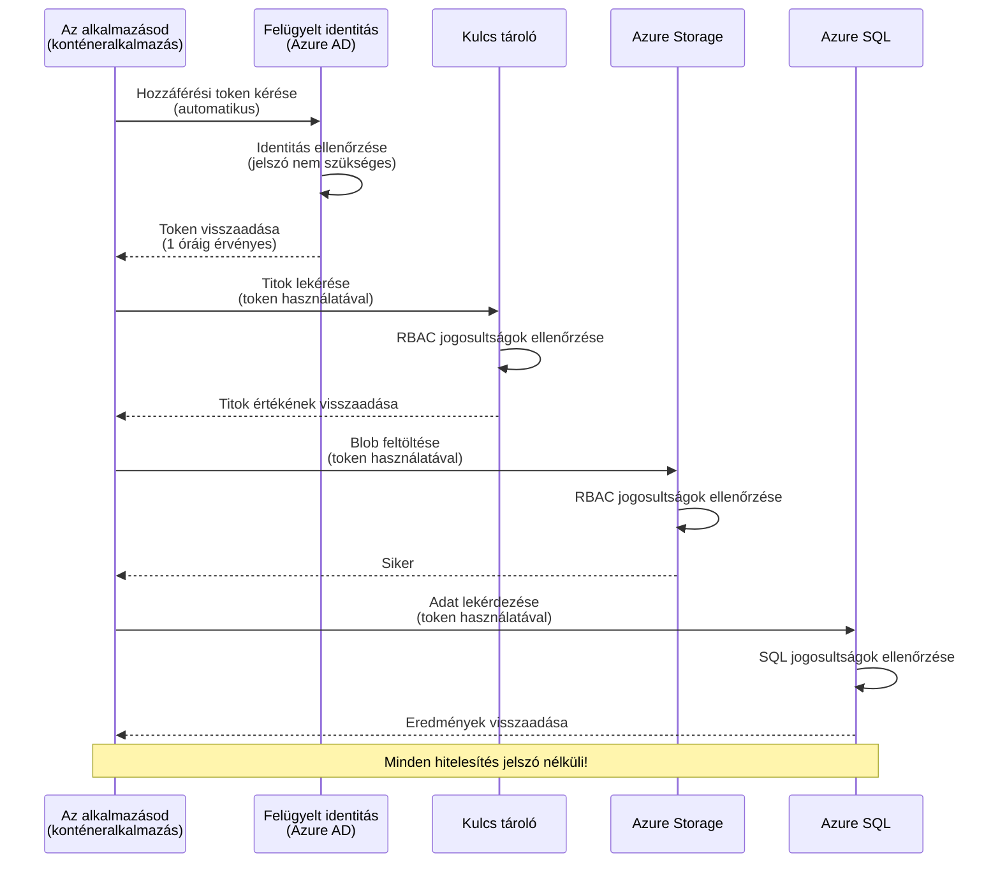
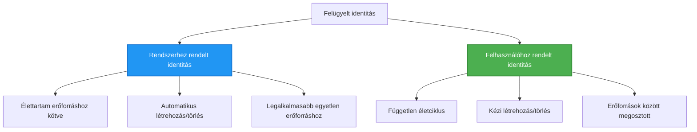

# Hitelesítési minták és kezelt identitás

⏱️ **Becsült idő**: 45-60 perc | 💰 **Költséghatás**: Ingyenes (nincs további díj) | ⭐ **Bonyolultság**: Középhaladó

**📚 Tanulási útvonal:**
- ← Előző: [Konfiguráció-kezelés](configuration.md) - Környezeti változók és titkok kezelése
- 🎯 **Jelenleg itt**: Hitelesítés és biztonság (kezelt identitás, Key Vault, biztonságos minták)
- → Következő: [Első projekt](first-project.md) - Építsd meg az első AZD alkalmazásodat
- 🏠 [Kurzus főoldal](../../README.md)

---

## Mit fogsz megtanulni

Ennek a leckének a befejezésével:
- Megérteni az Azure hitelesítési mintáit (kulcsok, kapcsolati karakterláncok, kezelt identitás)
- Megvalósítani a **Kezelt identitást** jelszó nélküli hitelesítéshez
- Titkok védelme az **Azure Key Vault** integrációjával
- A szerepalapú hozzáférés-vezérlés (**RBAC**) konfigurálása az AZD telepítésekhez
- Biztonsági legjobb gyakorlatok alkalmazása a Container Apps és az Azure szolgáltatások esetében
- Áttérés kulcsalapú hitelesítésről identitásalapú hitelesítésre

## Miért fontos a kezelt identitás

### A probléma: Hagyományos hitelesítés

**A kezelt identitás előtt:**
```javascript
// ❌ BIZTONSÁGI KOCKÁZAT: Kódban keményen kódolt titkok
const connectionString = "Server=mydb.database.windows.net;User=admin;Password=P@ssw0rd123";
const storageKey = "xK7mN9pQ2wR5tY8uI0oP3aS6dF1gH4jK...";
const cosmosKey = "C2x7B9n4M1p8Q5w3E6r0T2y5U8i1O4p7...";
```

**Problémák:**
- 🔴 **Kiszivárgott titkok** a kódban, konfigurációs fájlokban és környezeti változókban
- 🔴 **Hitelesítő adatok forgatása** kódváltoztatást és újratelepítést igényel
- 🔴 **Audit rémálmok** - ki, mikor és mihez fér hozzá?
- 🔴 **Szétterjedés** - titkok szétszórva több rendszeren
- 🔴 **Megfelelőségi kockázatok** - sikertelen biztonsági auditok

### A megoldás: Kezelt identitás

**A kezelt identitás után:**
```javascript
// ✅ BIZTONSÁGOS: Nincsenek titkok a kódban
const credential = new DefaultAzureCredential();
const client = new BlobServiceClient(
  "https://mystorageaccount.blob.core.windows.net",
  credential  // Azure automatikusan kezeli a hitelesítést
);
```

**Előnyök:**
- ✅ **Nincsenek titkok** a kódban vagy konfigurációban
- ✅ **Automatikus forgatás** - az Azure kezeli
- ✅ **Teljes audit nyomvonal** az Azure AD naplóiban
- ✅ **Központosított biztonság** - kezelhető az Azure Portalon
- ✅ **Megfelelőségre készen** - megfelel a biztonsági szabványoknak

**Párhuzam**: A hagyományos hitelesítés olyan, mintha több fizikai kulcsot cipelnének különböző ajtókhoz. A kezelt identitás olyan, mint egy biztonsági belépőkártya, amely automatikusan engedélyt ad a személyazonosság alapján — nincs kulcs, amit elveszíthetünk, lemásolhatunk vagy forgathatunk.

---

## Architektúra áttekintése

### Hitelesítési folyamat kezelt identitással


### Kezelt identitások típusai


| Jellemző | Rendszerhez rendelt | Felhasználóhoz rendelt |
|---------|----------------|---------------|
| **Életciklus** | Az erőforráshoz kötött | Független |
| **Létrehozás** | Automatikus az erőforrással | Kézi létrehozás |
| **Törlés** | Törlődik az erőforrással | Megmarad az erőforrás törlése után |
| **Megosztás** | Csak egy erőforrás | Több erőforrás |
| **Használati eset** | Egyszerű helyzetek | Összetett több erőforrásos helyzetek |
| **AZD alapértelmezés** | ✅ Ajánlott | Opcionális |

---

## Előfeltételek

### Szükséges eszközök

Ezeknek már telepítve kell lenniük az előző leckék alapján:

```bash
# Ellenőrizze az Azure Developer CLI-t
azd version
# ✅ Várható: azd verzió 1.0.0 vagy újabb

# Ellenőrizze az Azure CLI-t
az --version
# ✅ Várható: azure-cli 2.50.0 vagy újabb
```

### Azure követelmények

- Aktív Azure-előfizetés
- Engedélyek a következőkhöz:
  - Kezelt identitások létrehozása
  - RBAC szerepek hozzárendelése
  - Key Vault erőforrások létrehozása
  - Container Apps telepítése

### Tudásbeli előfeltételek

Teljesítened kell a következőket:
- [Telepítési útmutató](installation.md) - AZD beállítása
- [AZD alapok](azd-basics.md) - Alapfogalmak
- [Konfiguráció-kezelés](configuration.md) - Környezeti változók

---

## Lecke 1: A hitelesítési minták megértése

### Minta 1: Kapcsolati karakterláncok (Hagyományos - Kerülendő)

**Hogyan működik:**
```bash
# Kapcsolati karakterlánc hitelesítő adatokat tartalmaz
STORAGE_CONNECTION_STRING="DefaultEndpointsProtocol=https;AccountName=myaccount;AccountKey=xK7mN9pQ2wR5..."
COSMOS_CONNECTION_STRING="AccountEndpoint=https://myaccount.documents.azure.com:443/;AccountKey=C2x7..."
SQL_CONNECTION_STRING="Server=myserver.database.windows.net;User=admin;Password=P@ssw0rd..."
```

**Problémák:**
- ❌ Titkok láthatók a környezeti változókban
- ❌ Naplózódnak a telepítési rendszerekben
- ❌ Nehéz forgatni
- ❌ Nincs audit nyomvonal a hozzáférésről

**Mikor használd:** Csak helyi fejlesztéshez, soha ne éles környezetben.

---

### Minta 2: Key Vault hivatkozások (Jobb)

**Hogyan működik:**
```bicep
// Store secret in Key Vault
resource keyVault 'Microsoft.KeyVault/vaults@2023-02-01' = {
  name: 'mykv'
  properties: {
    enableRbacAuthorization: true
  }
}

// Reference in Container App
env: [
  {
    name: 'STORAGE_KEY'
    secretRef: 'storage-key'  // References Key Vault
  }
]
```

**Előnyök:**
- ✅ Titkok biztonságosan tárolva a Key Vaultban
- ✅ Központosított titokkezelés
- ✅ Forgatás kódváltoztatás nélkül

**Korlátozások:**
- ⚠️ Még mindig kulcsokat/jelszavakat használ
- ⚠️ Kezelni kell a Key Vault hozzáférését

**Mikor használd:** Átmeneti lépés a kapcsolati karakterláncokról a kezelt identitásra.

---

### Minta 3: Kezelt identitás (Legjobb gyakorlat)

**Hogyan működik:**
```bicep
// Enable managed identity
resource containerApp 'Microsoft.App/containerApps@2023-05-01' = {
  name: 'myapp'
  identity: {
    type: 'SystemAssigned'  // Automatically creates identity
  }
}

// Grant permissions
resource roleAssignment 'Microsoft.Authorization/roleAssignments@2022-04-01' = {
  scope: storageAccount
  properties: {
    roleDefinitionId: storageBlobDataContributorRole
    principalId: containerApp.identity.principalId
  }
}
```

**Alkalmazáskód:**
```javascript
// Nincs szükség titokra!
const { DefaultAzureCredential } = require('@azure/identity');
const { BlobServiceClient } = require('@azure/storage-blob');

const credential = new DefaultAzureCredential();
const blobServiceClient = new BlobServiceClient(
  'https://mystorageaccount.blob.core.windows.net',
  credential
);
```

**Előnyök:**
- ✅ Nincsenek titkok a kódban/konfigurációban
- ✅ Automatikus hitelesítő adat forgatás
- ✅ Teljes audit nyomvonal
- ✅ Szerepalapú (RBAC) engedélyek
- ✅ Megfelelőségre készen

**Mikor használd:** Mindig, éles alkalmazásoknál.

---

## Lecke 2: Kezelt identitás megvalósítása AZD-vel

### Lépésről lépésre megvalósítás

Építsünk egy biztonságos Container Appet, amely kezelt identitást használ az Azure Storage és a Key Vault eléréséhez.

### Projekt struktúra

```
secure-app/
├── azure.yaml                 # AZD configuration
├── infra/
│   ├── main.bicep            # Main infrastructure
│   ├── core/
│   │   ├── identity.bicep    # Managed identity setup
│   │   ├── keyvault.bicep    # Key Vault configuration
│   │   └── storage.bicep     # Storage with RBAC
│   └── app/
│       └── container-app.bicep
└── src/
    ├── app.js                # Application code
    ├── package.json
    └── Dockerfile
```

### 1. AZD konfigurálása (azure.yaml)

```yaml
name: secure-app
metadata:
  template: secure-app@1.0.0

services:
  api:
    project: ./src
    language: js
    host: containerapp

# Enable managed identity (AZD handles this automatically)
```

### 2. Infrastruktúra: Kezelt identitás engedélyezése

**Fájl: `infra/main.bicep`**

```bicep
targetScope = 'subscription'

param environmentName string
param location string = 'eastus'

var tags = { 'azd-env-name': environmentName }

// Resource group
resource rg 'Microsoft.Resources/resourceGroups@2021-04-01' = {
  name: 'rg-${environmentName}'
  location: location
  tags: tags
}

// Storage Account
module storage './core/storage.bicep' = {
  name: 'storage'
  scope: rg
  params: {
    name: 'st${uniqueString(rg.id)}'
    location: location
    tags: tags
  }
}

// Key Vault
module keyVault './core/keyvault.bicep' = {
  name: 'keyvault'
  scope: rg
  params: {
    name: 'kv-${uniqueString(rg.id)}'
    location: location
    tags: tags
  }
}

// Container App with Managed Identity
module containerApp './app/container-app.bicep' = {
  name: 'container-app'
  scope: rg
  params: {
    name: 'ca-${environmentName}'
    location: location
    tags: tags
    storageAccountName: storage.outputs.name
    keyVaultName: keyVault.outputs.name
  }
}

// Grant Container App access to Storage
module storageRoleAssignment './core/role-assignment.bicep' = {
  name: 'storage-role'
  scope: rg
  params: {
    principalId: containerApp.outputs.identityPrincipalId
    roleDefinitionId: 'ba92f5b4-2d11-453d-a403-e96b0029c9fe'  // Storage Blob Data Contributor
    targetResourceId: storage.outputs.id
  }
}

// Grant Container App access to Key Vault
module kvRoleAssignment './core/role-assignment.bicep' = {
  name: 'kv-role'
  scope: rg
  params: {
    principalId: containerApp.outputs.identityPrincipalId
    roleDefinitionId: '4633458b-17de-408a-b874-0445c86b69e6'  // Key Vault Secrets User
    targetResourceId: keyVault.outputs.id
  }
}

// Outputs
output AZURE_STORAGE_ACCOUNT_NAME string = storage.outputs.name
output AZURE_KEY_VAULT_NAME string = keyVault.outputs.name
output APP_URL string = containerApp.outputs.url
```

### 3. Container App rendszerhez rendelt identitással

**Fájl: `infra/app/container-app.bicep`**

```bicep
param name string
param location string
param tags object = {}
param storageAccountName string
param keyVaultName string

resource containerApp 'Microsoft.App/containerApps@2023-05-01' = {
  name: name
  location: location
  tags: tags
  identity: {
    type: 'SystemAssigned'  // 🔑 Enable managed identity
  }
  properties: {
    configuration: {
      ingress: {
        external: true
        targetPort: 3000
      }
    }
    template: {
      containers: [
        {
          name: 'api'
          image: 'myregistry.azurecr.io/api:latest'
          resources: {
            cpu: json('0.5')
            memory: '1Gi'
          }
          env: [
            {
              name: 'AZURE_STORAGE_ACCOUNT_NAME'
              value: storageAccountName
            }
            {
              name: 'AZURE_KEY_VAULT_NAME'
              value: keyVaultName
            }
            // 🔑 No secrets - managed identity handles authentication!
          ]
        }
      ]
    }
  }
}

// Output the identity for RBAC assignments
output identityPrincipalId string = containerApp.identity.principalId
output id string = containerApp.id
output url string = 'https://${containerApp.properties.configuration.ingress.fqdn}'
```

### 4. RBAC szerepkiosztási modul

**Fájl: `infra/core/role-assignment.bicep`**

```bicep
param principalId string
param roleDefinitionId string  // Azure built-in role ID
param targetResourceId string

resource roleAssignment 'Microsoft.Authorization/roleAssignments@2022-04-01' = {
  name: guid(principalId, roleDefinitionId, targetResourceId)
  scope: resourceId('Microsoft.Resources/resourceGroups', resourceGroup().name)
  properties: {
    roleDefinitionId: subscriptionResourceId('Microsoft.Authorization/roleDefinitions', roleDefinitionId)
    principalId: principalId
    principalType: 'ServicePrincipal'
  }
}

output id string = roleAssignment.id
```

### 5. Alkalmazáskód kezelt identitással

**Fájl: `src/app.js`**

```javascript
const express = require('express');
const { DefaultAzureCredential } = require('@azure/identity');
const { BlobServiceClient } = require('@azure/storage-blob');
const { SecretClient } = require('@azure/keyvault-secrets');

const app = express();
const PORT = process.env.PORT || 3000;

// 🔑 Hitelesítő inicializálása (a kezelt identitással automatikusan működik)
const credential = new DefaultAzureCredential();

// Azure Storage beállítása
const storageAccountName = process.env.AZURE_STORAGE_ACCOUNT_NAME;
const blobServiceClient = new BlobServiceClient(
  `https://${storageAccountName}.blob.core.windows.net`,
  credential  // Nincs szükség kulcsokra!
);

// Key Vault beállítása
const keyVaultName = process.env.AZURE_KEY_VAULT_NAME;
const secretClient = new SecretClient(
  `https://${keyVaultName}.vault.azure.net`,
  credential  // Nincs szükség kulcsokra!
);

// Egészségellenőrzés
app.get('/health', (req, res) => {
  res.json({ status: 'healthy', authentication: 'managed-identity' });
});

// Fájl feltöltése a blob-tárolóba
app.post('/upload', async (req, res) => {
  try {
    const containerClient = blobServiceClient.getContainerClient('uploads');
    await containerClient.createIfNotExists();
    
    const blobName = `file-${Date.now()}.txt`;
    const blockBlobClient = containerClient.getBlockBlobClient(blobName);
    
    await blockBlobClient.upload('Hello from managed identity!', 30);
    
    res.json({
      success: true,
      blobName: blobName,
      message: 'File uploaded using managed identity!'
    });
  } catch (error) {
    console.error('Upload error:', error);
    res.status(500).json({ error: error.message });
  }
});

// Titok lekérése a Key Vaultból
app.get('/secret/:name', async (req, res) => {
  try {
    const secretName = req.params.name;
    const secret = await secretClient.getSecret(secretName);
    
    res.json({
      name: secretName,
      value: secret.value,
      message: 'Secret retrieved using managed identity!'
    });
  } catch (error) {
    console.error('Secret error:', error);
    res.status(500).json({ error: error.message });
  }
});

// Blob-tárolók felsorolása (az olvasási hozzáférést bemutatja)
app.get('/containers', async (req, res) => {
  try {
    const containers = [];
    for await (const container of blobServiceClient.listContainers()) {
      containers.push(container.name);
    }
    
    res.json({
      containers: containers,
      count: containers.length,
      message: 'Containers listed using managed identity!'
    });
  } catch (error) {
    console.error('List error:', error);
    res.status(500).json({ error: error.message });
  }
});

app.listen(PORT, () => {
  console.log(`Secure API listening on port ${PORT}`);
  console.log('Authentication: Managed Identity (passwordless)');
});
```

**Fájl: `src/package.json`**

```json
{
  "name": "secure-app",
  "version": "1.0.0",
  "dependencies": {
    "express": "^4.18.2",
    "@azure/identity": "^4.0.0",
    "@azure/storage-blob": "^12.17.0",
    "@azure/keyvault-secrets": "^4.7.0"
  },
  "scripts": {
    "start": "node app.js"
  }
}
```

### 6. Telepítés és tesztelés

```bash
# AZD környezet inicializálása
azd init

# Infrastruktúra és alkalmazás telepítése
azd up

# Alkalmazás URL lekérése
APP_URL=$(azd env get-values | grep APP_URL | cut -d '=' -f2 | tr -d '"')

# Egészségellenőrzés tesztelése
curl $APP_URL/health
```

**✅ Várt kimenet:**
```json
{
  "status": "healthy",
  "authentication": "managed-identity"
}
```

**Teszt blob feltöltés:**
```bash
curl -X POST $APP_URL/upload
```

**✅ Várt kimenet:**
```json
{
  "success": true,
  "blobName": "file-1700404800000.txt",
  "message": "File uploaded using managed identity!"
}
```

**Teszt konténerlista:**
```bash
curl $APP_URL/containers
```

**✅ Várt kimenet:**
```json
{
  "containers": ["uploads"],
  "count": 1,
  "message": "Containers listed using managed identity!"
}
```

---

## Gyakori Azure RBAC szerepek

### Beépített szerepazonosítók a kezelt identitáshoz

| Szolgáltatás | Szerep neve | Szerepazonosító | Jogosultságok |
|---------|-----------|---------|-------------|
| **Storage** | Storage Blob Data Reader | `2a2b9908-6b94-4a3d-8e5a-a7d8f8cc8a12` | Blobok és konténerek olvasása |
| **Storage** | Storage Blob Data Contributor | `ba92f5b4-2d11-453d-a403-e96b0029c9fe` | Blobok olvasása, írása és törlése |
| **Storage** | Storage Queue Data Contributor | `974c5e8b-45b9-4653-ba55-5f855dd0fb88` | Sorüzenetek olvasása, írása és törlése |
| **Key Vault** | Key Vault Secrets User | `4633458b-17de-408a-b874-0445c86b69e6` | Titkok olvasása |
| **Key Vault** | Key Vault Secrets Officer | `b86a8fe4-44ce-4948-aee5-eccb2c155cd7` | Titkok olvasása, írása és törlése |
| **Cosmos DB** | Cosmos DB Built-in Data Reader | `00000000-0000-0000-0000-000000000001` | Cosmos DB adatok olvasása |
| **Cosmos DB** | Cosmos DB Built-in Data Contributor | `00000000-0000-0000-0000-000000000002` | Cosmos DB adatok olvasása és írása |
| **SQL Database** | SQL DB Contributor | `9b7fa17d-e63e-47b0-bb0a-15c516ac86ec` | SQL adatbázisok kezelése |
| **Service Bus** | Azure Service Bus Data Owner | `090c5cfd-751d-490a-894a-3ce6f1109419` | Üzenetek küldése, fogadása és kezelése |

### Hogyan találhatók meg a szerepazonosítók

```bash
# Az összes beépített szerep listázása
az role definition list --query "[].{Name:roleName, ID:name}" --output table

# Egy adott szerep keresése
az role definition list --query "[?contains(roleName, 'Storage Blob')].{Name:roleName, ID:name}" --output table

# Szerep részleteinek lekérése
az role definition list --name "Storage Blob Data Contributor"
```

---

## Gyakorlati feladatok

### Feladat 1: Kezelt identitás engedélyezése meglévő alkalmazáshoz ⭐⭐ (Közepes)

**Cél**: Kezelt identitás hozzáadása egy meglévő Container App telepítéshez

**Forgatókönyv**: Van egy Container App-ed, amely kapcsolati karakterláncokat használ. Alakítsd át kezelt identitásra.

**Kezdő állapot**: Container App ezzel a konfigurációval:

```bicep
// ❌ Current: Using connection string
env: [
  {
    name: 'STORAGE_CONNECTION_STRING'
    secretRef: 'storage-connection'
  }
]
```

**Lépések**:

1. **Engedélyezd a kezelt identitást a Bicep-ben:**

```bicep
resource containerApp 'Microsoft.App/containerApps@2023-05-01' = {
  name: 'myapp'
  identity: {
    type: 'SystemAssigned'  // Add this
  }
  // ... rest of configuration
}
```

2. **Adj Storage hozzáférést:**

```bicep
// Get storage account reference
resource storageAccount 'Microsoft.Storage/storageAccounts@2023-01-01' existing = {
  name: storageAccountName
}

// Assign role
resource roleAssignment 'Microsoft.Authorization/roleAssignments@2022-04-01' = {
  name: guid(containerApp.id, 'ba92f5b4-2d11-453d-a403-e96b0029c9fe', storageAccount.id)
  scope: storageAccount
  properties: {
    roleDefinitionId: subscriptionResourceId('Microsoft.Authorization/roleDefinitions', 'ba92f5b4-2d11-453d-a403-e96b0029c9fe')
    principalId: containerApp.identity.principalId
    principalType: 'ServicePrincipal'
  }
}
```

3. **Frissítsd az alkalmazáskódot:**

**Előtte (kapcsolati karakterlánc):**
```javascript
const { BlobServiceClient } = require('@azure/storage-blob');

const blobServiceClient = BlobServiceClient.fromConnectionString(
  process.env.STORAGE_CONNECTION_STRING
);
```

**Utána (kezelt identitás):**
```javascript
const { DefaultAzureCredential } = require('@azure/identity');
const { BlobServiceClient } = require('@azure/storage-blob');

const credential = new DefaultAzureCredential();
const blobServiceClient = new BlobServiceClient(
  `https://${process.env.STORAGE_ACCOUNT_NAME}.blob.core.windows.net`,
  credential
);
```

4. **Frissítsd a környezeti változókat:**

```bicep
env: [
  {
    name: 'STORAGE_ACCOUNT_NAME'
    value: storageAccountName  // Just the name, no secrets!
  }
  // Remove STORAGE_CONNECTION_STRING
]
```

5. **Telepítsd és teszteld:**

```bash
# Telepítsd újra
azd up

# Ellenőrizd, hogy továbbra is működik
curl https://myapp.azurecontainerapps.io/upload
```

**✅ Siker kritériumok:**
- ✅ Az alkalmazás hibamentesen települ
- ✅ A Storage műveletek működnek (feltöltés, listázás, letöltés)
- ✅ Nincsenek kapcsolati karakterláncok a környezeti változókban
- ✅ Az identitás látható az Azure Portalon az "Identity" lapon

**Ellenőrzés:**

```bash
# Ellenőrizze, hogy a kezelt identitás engedélyezve van-e
az containerapp show \
  --name myapp \
  --resource-group rg-myapp \
  --query "identity.type"
# ✅ Várható: "SystemAssigned"

# Ellenőrizze a szerepkiosztást
az role assignment list \
  --assignee $(az containerapp show --name myapp --resource-group rg-myapp --query "identity.principalId" -o tsv) \
  --scope /subscriptions/{sub-id}/resourceGroups/rg-myapp/providers/Microsoft.Storage/storageAccounts/mystorageaccount
# ✅ Várható: Mutatja a "Storage Blob Data Contributor" szerepet
```

**Idő**: 20-30 perc

---

### Feladat 2: Többszolgáltatásos hozzáférés felhasználóhoz rendelt identitással ⭐⭐⭐ (Haladó)

**Cél**: Hozz létre egy felhasználóhoz rendelt identitást, amelyet több Container App is megoszt

**Forgatókönyv**: 3 mikroszolgáltatásod van, amelyeknek mind hozzá kell férniük ugyanahhoz a Storage-fiókhoz és Key Vaulthoz.

**Lépések**:

1. **Hozz létre felhasználóhoz rendelt identitást:**

**Fájl: `infra/core/identity.bicep`**

```bicep
param name string
param location string
param tags object = {}

resource userAssignedIdentity 'Microsoft.ManagedIdentity/userAssignedIdentities@2023-01-31' = {
  name: name
  location: location
  tags: tags
}

output id string = userAssignedIdentity.id
output principalId string = userAssignedIdentity.properties.principalId
output clientId string = userAssignedIdentity.properties.clientId
```

2. **Szerepek hozzárendelése a felhasználóhoz rendelt identitáshoz:**

```bicep
// In main.bicep
module userIdentity './core/identity.bicep' = {
  name: 'user-identity'
  scope: rg
  params: {
    name: 'id-${environmentName}'
    location: location
    tags: tags
  }
}

// Grant Storage access
resource storageRoleAssignment 'Microsoft.Authorization/roleAssignments@2022-04-01' = {
  name: guid(userIdentity.outputs.principalId, 'storage-contributor')
  scope: storageAccount
  properties: {
    roleDefinitionId: subscriptionResourceId('Microsoft.Authorization/roleDefinitions', 'ba92f5b4-2d11-453d-a403-e96b0029c9fe')
    principalId: userIdentity.outputs.principalId
    principalType: 'ServicePrincipal'
  }
}

// Grant Key Vault access
resource kvRoleAssignment 'Microsoft.Authorization/roleAssignments@2022-04-01' = {
  name: guid(userIdentity.outputs.principalId, 'kv-secrets-user')
  scope: keyVault
  properties: {
    roleDefinitionId: subscriptionResourceId('Microsoft.Authorization/roleDefinitions', '4633458b-17de-408a-b874-0445c86b69e6')
    principalId: userIdentity.outputs.principalId
    principalType: 'ServicePrincipal'
  }
}
```

3. **Identitás hozzárendelése több Container Apphez:**

```bicep
resource apiGateway 'Microsoft.App/containerApps@2023-05-01' = {
  name: 'api-gateway'
  identity: {
    type: 'UserAssigned'
    userAssignedIdentities: {
      '${userIdentity.outputs.id}': {}
    }
  }
  // ... rest of config
}

resource productService 'Microsoft.App/containerApps@2023-05-01' = {
  name: 'product-service'
  identity: {
    type: 'UserAssigned'
    userAssignedIdentities: {
      '${userIdentity.outputs.id}': {}
    }
  }
  // ... rest of config
}

resource orderService 'Microsoft.App/containerApps@2023-05-01' = {
  name: 'order-service'
  identity: {
    type: 'UserAssigned'
    userAssignedIdentities: {
      '${userIdentity.outputs.id}': {}
    }
  }
  // ... rest of config
}
```

4. **Alkalmazáskód (minden szolgáltatás ugyanazt a mintát használja):**

```javascript
const { DefaultAzureCredential, ManagedIdentityCredential } = require('@azure/identity');

// Felhasználóhoz rendelt identitás esetén adja meg az ügyfélazonosítót
const credential = new ManagedIdentityCredential(
  process.env.AZURE_CLIENT_ID  // Felhasználóhoz rendelt identitás ügyfélazonosítója
);

// Vagy használja a DefaultAzureCredential-et (automatikusan észleli)
const credential = new DefaultAzureCredential();

const blobServiceClient = new BlobServiceClient(
  `https://${process.env.STORAGE_ACCOUNT_NAME}.blob.core.windows.net`,
  credential
);
```

5. **Telepítés és ellenőrzés:**

```bash
azd up

# Ellenőrizze, hogy minden szolgáltatás hozzáfér-e a tárolóhoz
curl https://api-gateway.azurecontainerapps.io/upload
curl https://product-service.azurecontainerapps.io/upload
curl https://order-service.azurecontainerapps.io/upload
```

**✅ Siker kritériumok:**
- ✅ Egy identitás megosztva a 3 szolgáltatás között
- ✅ Minden szolgáltatás hozzáfér a Storage-hoz és a Key Vaulthoz
- ✅ Az identitás megmarad, ha törölsz egy szolgáltatást
- ✅ Központosított jogosultságkezelés

**Előnyei a felhasználóhoz rendelt identitásnak:**
- Egyetlen identitás kezelése
- Konzisztens jogosultságok a szolgáltatások között
- Megmarad a szolgáltatás törlése után
- Jobb összetett architektúrák esetén

**Idő**: 30-40 perc

---

### Feladat 3: Key Vault titok forgatás megvalósítása ⭐⭐⭐ (Haladó)

**Cél**: Harmadik fél API kulcsainak tárolása a Key Vaultban és azok elérése kezelt identitással

**Forgatókönyv**: Az alkalmazásodnak külső API-t (OpenAI, Stripe, SendGrid) kell hívnia, amely API kulcsokat igényel.

**Lépések**:

1. **Key Vault létrehozása RBAC-kal:**

**Fájl: `infra/core/keyvault.bicep`**

```bicep
param name string
param location string
param tags object = {}

resource keyVault 'Microsoft.KeyVault/vaults@2023-02-01' = {
  name: name
  location: location
  tags: tags
  properties: {
    enableRbacAuthorization: true  // Use RBAC instead of access policies
    sku: {
      family: 'A'
      name: 'standard'
    }
    tenantId: subscription().tenantId
    enableSoftDelete: true
    softDeleteRetentionInDays: 90
  }
}

// Allow Container App to read secrets
output id string = keyVault.id
output name string = keyVault.name
output uri string = keyVault.properties.vaultUri
```

2. **Titkok tárolása a Key Vaultban:**

```bash
# Key Vault nevének lekérése
KV_NAME=$(azd env get-values | grep AZURE_KEY_VAULT_NAME | cut -d '=' -f2 | tr -d '"')

# Harmadik fél API-kulcsainak tárolása
az keyvault secret set \
  --vault-name $KV_NAME \
  --name "OpenAI-ApiKey" \
  --value "sk-proj-xxxxxxxxxxxxx"

az keyvault secret set \
  --vault-name $KV_NAME \
  --name "Stripe-ApiKey" \
  --value "sk_live_xxxxxxxxxxxxx"

az keyvault secret set \
  --vault-name $KV_NAME \
  --name "SendGrid-ApiKey" \
  --value "SG.xxxxxxxxxxxxx"
```

3. **Alkalmazáskód a titkok lekéréséhez:**

**Fájl: `src/config.js`**

```javascript
const { DefaultAzureCredential } = require('@azure/identity');
const { SecretClient } = require('@azure/keyvault-secrets');

class Config {
  constructor() {
    this.credential = new DefaultAzureCredential();
    this.secretClient = new SecretClient(
      `https://${process.env.AZURE_KEY_VAULT_NAME}.vault.azure.net`,
      this.credential
    );
    this.cache = {};
  }

  async getSecret(secretName) {
    // Először ellenőrizd a gyorsítótárat
    if (this.cache[secretName]) {
      return this.cache[secretName];
    }

    try {
      const secret = await this.secretClient.getSecret(secretName);
      this.cache[secretName] = secret.value;
      console.log(`✅ Retrieved secret: ${secretName}`);
      return secret.value;
    } catch (error) {
      console.error(`❌ Failed to get secret ${secretName}:`, error.message);
      throw error;
    }
  }

  async getOpenAIKey() {
    return this.getSecret('OpenAI-ApiKey');
  }

  async getStripeKey() {
    return this.getSecret('Stripe-ApiKey');
  }

  async getSendGridKey() {
    return this.getSecret('SendGrid-ApiKey');
  }
}

module.exports = new Config();
```

4. **Titkok használata az alkalmazásban:**

**Fájl: `src/app.js`**

```javascript
const express = require('express');
const config = require('./config');
const { OpenAI } = require('openai');

const app = express();

// Inicializálja az OpenAI-t a Key Vault kulcsával
let openaiClient;

async function initializeServices() {
  const openaiKey = await config.getOpenAIKey();
  openaiClient = new OpenAI({ apiKey: openaiKey });
  console.log('✅ Services initialized with secrets from Key Vault');
}

// Indításkor hívandó
initializeServices().catch(console.error);

app.post('/chat', async (req, res) => {
  try {
    const completion = await openaiClient.chat.completions.create({
      model: 'gpt-4',
      messages: [{ role: 'user', content: 'Hello!' }]
    });
    
    res.json({
      response: completion.choices[0].message.content,
      authentication: 'Key from Key Vault via Managed Identity'
    });
  } catch (error) {
    res.status(500).json({ error: error.message });
  }
});

app.listen(3000, () => {
  console.log('Secure API with Key Vault integration running');
});
```

5. **Telepítés és tesztelés:**

```bash
azd up

# Ellenőrizze, hogy az API-kulcsok működnek
curl -X POST https://myapp.azurecontainerapps.io/chat \
  -H "Content-Type: application/json" \
  -d '{"message":"Hello AI"}'
```

**✅ Siker kritériumok:**
- ✅ Nincsenek API kulcsok a kódban vagy a környezeti változókban
- ✅ Az alkalmazás a Key Vaultból szerzi be a kulcsokat
- ✅ A harmadik fél API-k megfelelően működnek
- ✅ A kulcsok forgathatók kódváltoztatás nélkül

**Titok forgatása:**

```bash
# Titok frissítése a Key Vaultban
az keyvault secret set \
  --vault-name $KV_NAME \
  --name "OpenAI-ApiKey" \
  --value "sk-proj-NEW_KEY_HERE"

# Indítsa újra az alkalmazást, hogy felvegye az új kulcsot
az containerapp revision restart \
  --name myapp \
  --resource-group rg-myapp
```

**Idő**: 25-35 perc

---

## Tudásellenőrzés

### 1. Hitelesítési minták ✓

Teszteld a megértésedet:

- [ ] **Q1**: Mik a három fő hitelesítési minta? 
  - **A**: Kapcsolati karakterláncok (hagyományos), Key Vault hivatkozások (átmeneti), Kezelt identitás (legjobb)

- [ ] **Q2**: Miért jobb a kezelt identitás a kapcsolati karakterláncoknál?
  - **A**: Nincsenek titkok a kódban, automatikus forgatás, teljes audit nyomvonal, RBAC alapú jogosultságok

- [ ] **Q3**: Mikor használnál felhasználóhoz rendelt identitást rendszerhez rendelt helyett?
  - **A**: Amikor az identitást több erőforrás között szeretnéd megosztani, vagy amikor az identitás életciklusa független az erőforrás életciklusától

**Gyakorlati ellenőrzés:**
```bash
# Ellenőrizze, hogy az alkalmazás milyen típusú identitást használ
az containerapp show \
  --name myapp \
  --resource-group rg-myapp \
  --query "identity.type"

# Sorolja fel az identitás összes szerepkör-hozzárendelését
az role assignment list \
  --assignee $(az containerapp show --name myapp --resource-group rg-myapp --query "identity.principalId" -o tsv)
```

---

### 2. RBAC és jogosultságok ✓

Teszteld a megértésedet:

- [ ] **Q1**: Mi a szerepazonosító a "Storage Blob Data Contributor" szerephez?
  - **A**: `ba92f5b4-2d11-453d-a403-e96b0029c9fe`

- [ ] **Q2**: Milyen jogosultságokat ad a "Key Vault Secrets User"?
  - **A**: Csak olvasási hozzáférés a titkokhoz (nem hozhat létre, frissíthet vagy törölhet)

- [ ] **Q3**: Hogyan adsz egy Container Appnek hozzáférést Azure SQL-hez?
  - **A**: Rendeld hozzá a "SQL DB Contributor" szerepet vagy konfiguráld az Azure AD hitelesítést SQL-hez

**Gyakorlati ellenőrzés:**
```bash
# Konkrét szerep keresése
az role definition list --name "Storage Blob Data Contributor"

# Ellenőrizd, mely szerepek vannak hozzárendelve az identitásodhoz
PRINCIPAL_ID=$(az containerapp show --name myapp --resource-group rg-myapp --query "identity.principalId" -o tsv)
az role assignment list --assignee $PRINCIPAL_ID --output table
```

---

### 3. Key Vault integráció ✓

Teszteld a megértésedet:
- [ ] **Q1**: Hogyan engedélyezed a RBAC-ot a Key Vault számára a hozzáférési házirendek helyett?
  - **A**: Set `enableRbacAuthorization: true` in Bicep

- [ ] **Q2**: Melyik Azure SDK könyvtár kezeli a managed identity hitelesítést?
  - **A**: `@azure/identity` a `DefaultAzureCredential` osztállyal

- [ ] **Q3**: Mennyi ideig maradnak a Key Vault titkok a gyorsítótárban?
  - **A**: Az alkalmazástól függ; valósítsd meg a saját gyorsítótár-stratégiádat

**Gyakorlati ellenőrzés:**
```bash
# Key Vault hozzáférés tesztelése
az keyvault secret show \
  --vault-name $KV_NAME \
  --name "OpenAI-ApiKey" \
  --query "value"

# Ellenőrizze, hogy az RBAC engedélyezve van-e
az keyvault show \
  --name $KV_NAME \
  --query "properties.enableRbacAuthorization"
# ✅ Elvárt: true
```

---

## Biztonsági legjobb gyakorlatok

### ✅ AJÁNLOTT:

1. **Mindig használj managed identity-t éles környezetben**
   ```bicep
   identity: {
     type: 'SystemAssigned'
   }
   ```

2. **Használj legkisebb jogosultság elvén alapuló RBAC szerepköröket**
   - Használd a "Reader" szerepkört, amikor lehetséges
   - Kerüld az "Owner" vagy "Contributor" szerepköröket, ha nem szükséges

3. **Harmadik fél kulcsait tárold a Key Vault-ban**
   ```javascript
   const apiKey = await secretClient.getSecret('ThirdPartyApiKey');
   ```

4. **Engedélyezd az audit naplózást**
   ```bicep
   diagnosticSettings: {
     logs: [{ category: 'AuditEvent', enabled: true }]
   }
   ```

5. **Használj külön identitásokat dev/staging/prod számára**
   ```bash
   azd env new dev
   azd env new staging
   azd env new prod
   ```

6. **Rendszeresen cseréld a titkokat**
   - Állíts lejárati dátumokat a Key Vault titkoknál
   - Automatizáld a forgatást Azure Functions-szal

### ❌ NE:

1. **Soha ne keménykódold a titkokat**
   ```javascript
   // ❌ ROSSZ
   const apiKey = "sk-proj-xxxxxxxxxxxxx";
   ```

2. **Ne használj connection stringeket éles környezetben**
   ```javascript
   // ❌ ROSSZ
   BlobServiceClient.fromConnectionString(process.env.STORAGE_CONNECTION_STRING)
   ```

3. **Ne adj túlzott jogosultságokat**
   ```bicep
   // ❌ BAD - too much access
   roleDefinitionId: 'Owner'
   
   // ✅ GOOD - least privilege
   roleDefinitionId: 'Storage Blob Data Reader'
   ```

4. **Ne naplózd a titkokat**
   ```javascript
   // ❌ ROSSZ
   console.log('API Key:', apiKey);
   
   // ✅ JÓ
   console.log('API Key retrieved successfully');
   ```

5. **Ne oszd meg az éles identitásokat környezetek között**
   ```bicep
   // ❌ BAD - same identity for dev and prod
   // ✅ GOOD - separate identities per environment
   ```

---

## Hibakeresési útmutató

### Probléma: "Unauthorized" az Azure Storage elérésekor

**Tünetek:**
```
Error: Unauthorized (403)
AuthorizationPermissionMismatch: This request is not authorized to perform this operation
```

**Diagnózis:**

```bash
# Ellenőrizze, hogy a kezelt identitás engedélyezve van-e
az containerapp show \
  --name myapp \
  --resource-group rg-myapp \
  --query "identity.type"
# ✅ Várható: "SystemAssigned" vagy "UserAssigned"

# Ellenőrizze a szerepkör-hozzárendeléseket
PRINCIPAL_ID=$(az containerapp show --name myapp --resource-group rg-myapp --query "identity.principalId" -o tsv)
az role assignment list --assignee $PRINCIPAL_ID

# Várható: Látni kell a "Storage Blob Data Contributor" vagy hasonló szerepet
```

**Megoldások:**

1. **Adj meg megfelelő RBAC szerepkört:**
```bash
STORAGE_ID=$(az storage account show --name mystorageaccount --resource-group rg-myapp --query "id" -o tsv)
az role assignment create \
  --assignee $PRINCIPAL_ID \
  --role "Storage Blob Data Contributor" \
  --scope $STORAGE_ID
```

2. **Várj a propagációra (5-10 percet is igénybe vehet):**
```bash
# Ellenőrizze a szerepkör hozzárendelés állapotát
az role assignment list --assignee $PRINCIPAL_ID --scope $STORAGE_ID
```

3. **Ellenőrizd, hogy az alkalmazáskód a megfelelő hitelesítőt használja:**
```javascript
// Győződj meg róla, hogy a DefaultAzureCredential-t használod.
const credential = new DefaultAzureCredential();
```

---

### Probléma: Hozzáférés megtagadva a Key Vault-hoz

**Tünetek:**
```
Error: Forbidden (403)
The user, group or application does not have secrets get permission
```

**Diagnózis:**

```bash
# Ellenőrizze, hogy a Key Vault RBAC engedélyezve van-e
az keyvault show \
  --name $KV_NAME \
  --query "properties.enableRbacAuthorization"
# ✅ Elvárt: true

# Ellenőrizze a szerepkör-hozzárendeléseket
az role assignment list \
  --assignee $PRINCIPAL_ID \
  --scope /subscriptions/{sub-id}/resourceGroups/rg-myapp/providers/Microsoft.KeyVault/vaults/$KV_NAME
```

**Megoldások:**

1. **Engedélyezd az RBAC-ot a Key Vaulton:**
```bash
az keyvault update \
  --name $KV_NAME \
  --enable-rbac-authorization true
```

2. **Add meg a Key Vault Secrets User szerepkört:**
```bash
KV_ID=$(az keyvault show --name $KV_NAME --query "id" -o tsv)
az role assignment create \
  --assignee $PRINCIPAL_ID \
  --role "Key Vault Secrets User" \
  --scope $KV_ID
```

---

### Probléma: DefaultAzureCredential helyi használatkor meghiúsul

**Tünetek:**
```
Error: DefaultAzureCredential failed to retrieve a token
CredentialUnavailableError: No credential available
```

**Diagnózis:**

```bash
# Ellenőrizze, hogy be van-e jelentkezve
az account show

# Ellenőrizze az Azure CLI hitelesítését
az ad signed-in-user show
```

**Megoldások:**

1. **Jelentkezz be az Azure CLI-be:**
```bash
az login
```

2. **Állítsd be az Azure előfizetést:**
```bash
az account set --subscription "Your Subscription Name"
```

3. **Helyi fejlesztéshez használj környezeti változókat:**
```bash
export AZURE_TENANT_ID="your-tenant-id"
export AZURE_CLIENT_ID="your-client-id"
export AZURE_CLIENT_SECRET="your-client-secret"
```

4. **Vagy használj más hitelesítőt helyileg:**
```javascript
const { DefaultAzureCredential, AzureCliCredential } = require('@azure/identity');

// Használja az AzureCliCredentialt helyi fejlesztéshez
const credential = process.env.NODE_ENV === 'production' 
  ? new DefaultAzureCredential()
  : new AzureCliCredential();
```

---

### Probléma: A szerepkör-hozzárendelések propagálása túl sokáig tart

**Tünetek:**
- A szerepkört sikeresen hozzárendelték
- Még mindig 403-as hibákat kapsz
- Időszakos hozzáférés (néha működik, néha nem)

**Magyarázat:**
Az Azure RBAC-változások globális propagációja 5-10 percet is igénybe vehet.

**Megoldás:**

```bash
# Várjon és próbálja újra
echo "Waiting for RBAC propagation..."
sleep 300  # Várjon 5 percet

# Tesztelje a hozzáférést
curl https://myapp.azurecontainerapps.io/upload

# Ha még mindig nem működik, indítsa újra az alkalmazást
az containerapp revision restart \
  --name myapp \
  --resource-group rg-myapp
```

---

## Költségszempontok

### Kezelt identitás költségek

| Erőforrás | Költség |
|----------|------|
| **Managed Identity** | 🆓 **INGYEN** - Nincs díj |
| **RBAC szerepkör-hozzárendelések** | 🆓 **INGYEN** - Nincs díj |
| **Azure AD tokenkérések** | 🆓 **INGYEN** - Tartalmazva |
| **Key Vault műveletek** | $0.03 10,000 műveletenként |
| **Key Vault tárolás** | $0.024 titkonként havonta |

**A kezelt identitás pénzt takarít meg az alábbiak révén:**
- ✅ Eliminálja a Key Vault műveleteket szolgáltatás-közi hitelesítés esetén
- ✅ Csökkenti a biztonsági incidenseket (nincsenek kiszivárgott hitelesítő adatok)
- ✅ Csökkenti az üzemeltetési terheket (nincs kézi forgatás)

**Példa költségösszehasonlítás (havonta):**

| Forgatókönyv | Connection stringek | Kezelt identitás | Megtakarítás |
|----------|-------------------|-----------------|---------|
| Kis alkalmazás (1M kérések) | ~$50 (Key Vault + műveletek) | ~$0 | $50/hó |
| Közepes alkalmazás (10M kérések) | ~$200 | ~$0 | $200/hó |
| Nagy alkalmazás (100M kérések) | ~$1,500 | ~$0 | $1,500/hó |

---

## További információ

### Hivatalos dokumentáció
- [Azure kezelt identitások](https://learn.microsoft.com/entra/identity/managed-identities-azure-resources/overview)
- [Azure RBAC](https://learn.microsoft.com/azure/role-based-access-control/overview)
- [Azure Key Vault](https://learn.microsoft.com/azure/key-vault/general/overview)
- [DefaultAzureCredential](https://learn.microsoft.com/dotnet/api/azure.identity.defaultazurecredential)

### SDK dokumentáció
- [@azure/identity (Node.js)](https://www.npmjs.com/package/@azure/identity)
- [Azure.Identity (C#)](https://www.nuget.org/packages/Azure.Identity/)
- [azure-identity (Python)](https://pypi.org/project/azure-identity/)

### Következő lépések a kurzusban
- ← Előző: [Konfiguráció kezelése](configuration.md)
- → Következő: [Első projekt](first-project.md)
- 🏠 [Kurzus főoldal](../../README.md)

### Kapcsolódó példák
- [Azure OpenAI Chat példa](../../../../examples/azure-openai-chat) - Managed identity-t használ az Azure OpenAI-hoz
- [Microservices példa](../../../../examples/microservices) - Több szolgáltatásos hitelesítési minták

---

## Összegzés

**Amit megtanultál:**
- ✅ Három hitelesítési minta (connection stringek, Key Vault, managed identity)
- ✅ Hogyan engedélyezd és konfiguráld a managed identity-t AZD-ben
- ✅ RBAC szerepkör-hozzárendelések Azure szolgáltatásokhoz
- ✅ Key Vault integráció harmadik fél titkaihoz
- ✅ Felhasználó által hozzárendelt vs rendszer által hozzárendelt identitások
- ✅ Biztonsági legjobb gyakorlatok és hibakeresés

**Fő tanulságok:**
1. **Mindig használj managed identity-t éles környezetben** - Nincsenek titkok, automatikus forgatás
2. **Használj legkisebb jogosultság elvén alapuló RBAC szerepköröket** - Adj csak szükséges jogosultságokat
3. **Harmadik fél kulcsait tárold a Key Vault-ban** - Központosított titokkezelés
4. **Szétválasztott identitások környezetenként** - Dev, staging, prod elkülönítés
5. **Kapcsold be az audit naplózást** - Kövesd nyomon, ki mihez fér hozzá

**Következő lépések:**
1. Fejezd be a fenti gyakorlati feladatokat
2. Migrálj egy meglévő alkalmazást connection stringekről managed identity-re
3. Építsd meg az első AZD projektedet biztonsággal az első naptól: [Első projekt](first-project.md)

---

<!-- CO-OP TRANSLATOR DISCLAIMER START -->
Felelősségkizárás:
Ezt a dokumentumot az AI fordítószolgáltatás, a Co-op Translator (https://github.com/Azure/co-op-translator) használatával fordították le. Bár törekszünk a pontosságra, kérjük, vegye figyelembe, hogy az automatikus fordítások hibákat vagy pontatlanságokat tartalmazhatnak. Az eredeti dokumentum eredeti nyelvű változata tekintendő a hiteles forrásnak. Kritikus jelentőségű információk esetén szakmai, emberi fordítás ajánlott. Nem vállalunk felelősséget az e fordítás használatából eredő félreértésekért vagy téves értelmezésekért.
<!-- CO-OP TRANSLATOR DISCLAIMER END -->