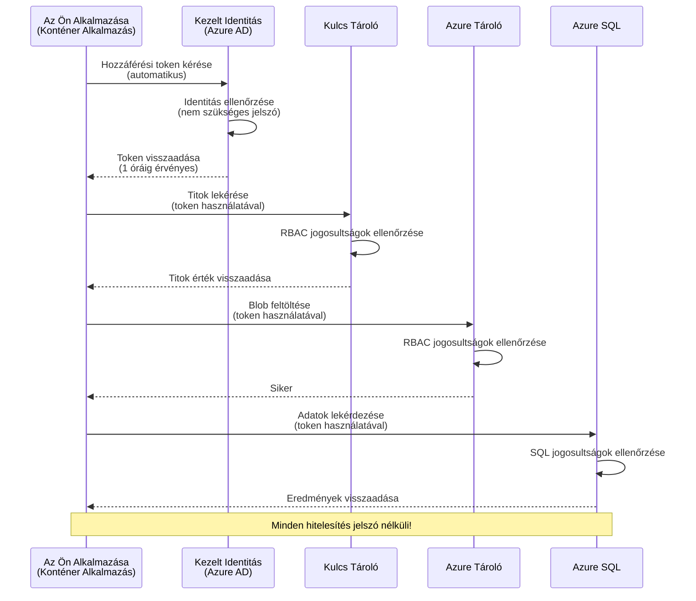
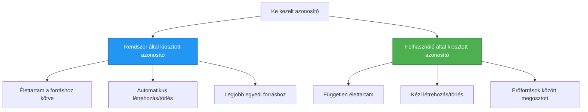

# Hitelesítési minták és kezelt identitás

⏱️ **Becsült idő**: 45-60 perc | 💰 **Költség hatás**: Ingyenes (további díjak nélkül) | ⭐ **Bonyolultság**: Középhaladó

**📚 Tanulási út:**
- ← Előző: [Konfigurációkezelés](configuration.md) - Környezeti változók és titkok kezelése
- 🎯 **Itt vagy**: Hitelesítés és biztonság (Kezelt identitás, Key Vault, biztonságos minták)
- → Következő: [Első projekt](first-project.md) - Első AZD alkalmazásod felépítése
- 🏠 [Tanfolyam főoldal](../../README.md)

---

## Amit megtanulsz

A lecke elvégzésével:
- Megérted az Azure hitelesítési mintákat (kulcsok, kapcsolati láncok, kezelt identitás)
- Megvalósítod a **Kezelt identitás** használatát jelszó nélküli hitelesítéshez
- Biztonságosan kezeled a titkokat az **Azure Key Vault** integrációval
- Beállítod a **szerepalapú hozzáférés-vezérlést (RBAC)** AZD telepítésekhez
- Alkalmazod a biztonsági legjobb gyakorlatokat a Container Apps és Azure szolgáltatások esetén
- Átállsz kulcs alapúról identitás alapú hitelesítésre

## Miért fontos a kezelt identitás

### A probléma: Hagyományos hitelesítés

**Kezelt identitás előtt:**
```javascript
// ❌ BIZTONSÁGI KOCKÁZAT: Keménykódolt titkok a kódban
const connectionString = "Server=mydb.database.windows.net;User=admin;Password=P@ssw0rd123";
const storageKey = "xK7mN9pQ2wR5tY8uI0oP3aS6dF1gH4jK...";
const cosmosKey = "C2x7B9n4M1p8Q5w3E6r0T2y5U8i1O4p7...";
```

**Problémák:**
- 🔴 **Kiszivárgó titkok** kódban, konfigurációs fájlokban, környezeti változókban
- 🔴 **Hitelesítő adatok cseréje** kódmódosítást és újratelepítést igényel
- 🔴 **Ellenőrzési rémálmok** - ki mikor mit ért el?
- 🔴 **Szóródás** - titkok szétszóródnak több rendszerben
- 🔴 **Megfelelési kockázatok** - nem felel meg a biztonsági auditoknak

### A megoldás: Kezelt identitás

**Kezelt identitás után:**
```javascript
// ✅ BIZTONSÁGOS: Nincsenek titkok a kódban
const credential = new DefaultAzureCredential();
const client = new BlobServiceClient(
  "https://mystorageaccount.blob.core.windows.net",
  credential  // Az Azure automatikusan kezeli az autentikációt
);
```

**Előnyök:**
- ✅ **Nincsenek titkok** a kódban vagy beállításokban
- ✅ **Automatikus forgatás** - az Azure kezeli
- ✅ **Teljes audit nyomvonal** az Azure AD naplókban
- ✅ **Központosított biztonság** - az Azure Portalon kezelhető
- ✅ **Megfelelésre kész** - biztonsági előírásoknak megfelel

**Hasonlat**: A hagyományos hitelesítés olyan, mintha több fizikai kulcsot cipelnének külön ajtókhoz. A Kezelt identitás olyan, mint egy biztonsági kártya, amely automatikusan hozzáférést ad személy alapján – nincs több elhagyott, másolt vagy cserélt kulcs.

---

## Architektúra áttekintés

### Hitelesítési folyamat kezelten


### Kezelt identitások típusai


| Jellemző | Erőforráshoz rendelt | Felhasználó által rendelt |
|---------|---------------------|--------------------------|
| **Élettartam** | Erőforráshoz kötött | Független |
| **Létrehozás** | Automatikus az erőforrással | Kézi létrehozás |
| **Törlés** | Erőforrással törlődik | Megmarad erőforrás törlése után |
| **Megosztás** | Csak egy erőforráshoz | Több erőforráshoz |
| **Használati eset** | Egyszerű helyzetek | Összetett több erőforrásos helyzetek |
| **AZD alapértelmezett** | ✅ Ajánlott | Választható |

---

## Előfeltételek

### Szükséges eszközök

Már telepítve kell legyenek az előző leckékből:

```bash
# Ellenőrizze az Azure Developer CLI-t
azd version
# ✅ Elvárt: azd verzió 1.0.0 vagy újabb

# Ellenőrizze az Azure CLI-t
az --version
# ✅ Elvárt: azure-cli 2.50.0 vagy újabb
```

### Azure követelmények

- Aktív Azure előfizetés
- Engedélyek a következőkhöz:
  - Kezelt identitások létrehozása
  - RBAC szerepek hozzárendelése
  - Key Vault erőforrások létrehozása
  - Container Apps telepítése

### Tudás előfeltételek

Teljesítettnek kell lennie:
- [Telepítési útmutató](installation.md) - AZD beállítás
- [AZD alapok](azd-basics.md) - Alapfogalmak
- [Konfigurációkezelés](configuration.md) - Környezeti változók

---

## 1. lecke: Hitelesítési minták megértése

### Minta 1: Kapcsolati láncok (régi - kerülendő)

**Hogyan működik:**
```bash
# A kapcsolati karakterlánc tartalmaz hitelesítő adatokat
STORAGE_CONNECTION_STRING="DefaultEndpointsProtocol=https;AccountName=myaccount;AccountKey=xK7mN9pQ2wR5..."
COSMOS_CONNECTION_STRING="AccountEndpoint=https://myaccount.documents.azure.com:443/;AccountKey=C2x7..."
SQL_CONNECTION_STRING="Server=myserver.database.windows.net;User=admin;Password=P@ssw0rd..."
```

**Problémák:**
- ❌ Titkok látszanak környezeti változókban
- ❌ Naplózódik a telepítési rendszerben
- ❌ Nehéz cserélni
- ❌ Nincs audit nyomvonal

**Mikor használd:** Csak helyi fejlesztéshez, sose éles környezetben.

---

### Minta 2: Key Vault hivatkozások (jobb)

**Hogyan működik:**
```bicep
// Store secret in Key Vault
resource keyVault 'Microsoft.KeyVault/vaults@2023-02-01' = {
  name: 'mykv'
  properties: {
    enableRbacAuthorization: true
  }
}

// Reference in Container App
env: [
  {
    name: 'STORAGE_KEY'
    secretRef: 'storage-key'  // References Key Vault
  }
]
```

**Előnyök:**
- ✅ Titkok biztonságosan tárolva Key Vault-ban
- ✅ Központosított titkkezelés
- ✅ Forgatás kódmódosítás nélkül

**Korlátozások:**
- ⚠️ Még mindig kulcsokat/jelszavakat használ
- ⚠️ Key Vault hozzáférést kezelni kell

**Mikor használd:** Átmeneti lépés a kapcsolati láncokról a kezelt identitásra.

---

### Minta 3: Kezelt identitás (legjobb gyakorlat)

**Hogyan működik:**
```bicep
// Enable managed identity
resource containerApp 'Microsoft.App/containerApps@2023-05-01' = {
  name: 'myapp'
  identity: {
    type: 'SystemAssigned'  // Automatically creates identity
  }
}

// Grant permissions
resource roleAssignment 'Microsoft.Authorization/roleAssignments@2022-04-01' = {
  scope: storageAccount
  properties: {
    roleDefinitionId: storageBlobDataContributorRole
    principalId: containerApp.identity.principalId
  }
}
```

**Alkalmazáskód:**
```javascript
// Nincsenek szükséges titkok!
const { DefaultAzureCredential } = require('@azure/identity');
const { BlobServiceClient } = require('@azure/storage-blob');

const credential = new DefaultAzureCredential();
const blobServiceClient = new BlobServiceClient(
  'https://mystorageaccount.blob.core.windows.net',
  credential
);
```

**Előnyök:**
- ✅ Nincs titok a kódban vagy beállításban
- ✅ Automatikus hitelesítő adat forgatás
- ✅ Teljes audit nyomvonal
- ✅ RBAC-alapú jogosultságok
- ✅ Megfelelésre kész

**Mikor használd:** Mindig, éles alkalmazások esetén.

---

## 2. lecke: Kezelt identitás megvalósítása AZD-vel

### Lépésről lépésre megvalósítás

Készítsünk biztonságos Container App-et, amely kezelt identitást használ Azure Storage és Key Vault eléréséhez.

### Projekt struktúra

```
secure-app/
├── azure.yaml                 # AZD configuration
├── infra/
│   ├── main.bicep            # Main infrastructure
│   ├── core/
│   │   ├── identity.bicep    # Managed identity setup
│   │   ├── keyvault.bicep    # Key Vault configuration
│   │   └── storage.bicep     # Storage with RBAC
│   └── app/
│       └── container-app.bicep
└── src/
    ├── app.js                # Application code
    ├── package.json
    └── Dockerfile
```

### 1. AZD konfigurálása (azure.yaml)

```yaml
name: secure-app
metadata:
  template: secure-app@1.0.0

services:
  api:
    project: ./src
    language: js
    host: containerapp

# Enable managed identity (AZD handles this automatically)
```

### 2. Infrastruktúra: Kezelt identitás engedélyezése

**Fájl: `infra/main.bicep`**

```bicep
targetScope = 'subscription'

param environmentName string
param location string = 'eastus'

var tags = { 'azd-env-name': environmentName }

// Resource group
resource rg 'Microsoft.Resources/resourceGroups@2021-04-01' = {
  name: 'rg-${environmentName}'
  location: location
  tags: tags
}

// Storage Account
module storage './core/storage.bicep' = {
  name: 'storage'
  scope: rg
  params: {
    name: 'st${uniqueString(rg.id)}'
    location: location
    tags: tags
  }
}

// Key Vault
module keyVault './core/keyvault.bicep' = {
  name: 'keyvault'
  scope: rg
  params: {
    name: 'kv-${uniqueString(rg.id)}'
    location: location
    tags: tags
  }
}

// Container App with Managed Identity
module containerApp './app/container-app.bicep' = {
  name: 'container-app'
  scope: rg
  params: {
    name: 'ca-${environmentName}'
    location: location
    tags: tags
    storageAccountName: storage.outputs.name
    keyVaultName: keyVault.outputs.name
  }
}

// Grant Container App access to Storage
module storageRoleAssignment './core/role-assignment.bicep' = {
  name: 'storage-role'
  scope: rg
  params: {
    principalId: containerApp.outputs.identityPrincipalId
    roleDefinitionId: 'ba92f5b4-2d11-453d-a403-e96b0029c9fe'  // Storage Blob Data Contributor
    targetResourceId: storage.outputs.id
  }
}

// Grant Container App access to Key Vault
module kvRoleAssignment './core/role-assignment.bicep' = {
  name: 'kv-role'
  scope: rg
  params: {
    principalId: containerApp.outputs.identityPrincipalId
    roleDefinitionId: '4633458b-17de-408a-b874-0445c86b69e6'  // Key Vault Secrets User
    targetResourceId: keyVault.outputs.id
  }
}

// Outputs
output AZURE_STORAGE_ACCOUNT_NAME string = storage.outputs.name
output AZURE_KEY_VAULT_NAME string = keyVault.outputs.name
output APP_URL string = containerApp.outputs.url
```

### 3. Container App rendszer által rendelt identitással

**Fájl: `infra/app/container-app.bicep`**

```bicep
param name string
param location string
param tags object = {}
param storageAccountName string
param keyVaultName string

resource containerApp 'Microsoft.App/containerApps@2023-05-01' = {
  name: name
  location: location
  tags: tags
  identity: {
    type: 'SystemAssigned'  // 🔑 Enable managed identity
  }
  properties: {
    configuration: {
      ingress: {
        external: true
        targetPort: 3000
      }
    }
    template: {
      containers: [
        {
          name: 'api'
          image: 'myregistry.azurecr.io/api:latest'
          resources: {
            cpu: json('0.5')
            memory: '1Gi'
          }
          env: [
            {
              name: 'AZURE_STORAGE_ACCOUNT_NAME'
              value: storageAccountName
            }
            {
              name: 'AZURE_KEY_VAULT_NAME'
              value: keyVaultName
            }
            // 🔑 No secrets - managed identity handles authentication!
          ]
        }
      ]
    }
  }
}

// Output the identity for RBAC assignments
output identityPrincipalId string = containerApp.identity.principalId
output id string = containerApp.id
output url string = 'https://${containerApp.properties.configuration.ingress.fqdn}'
```

### 4. RBAC szerepkör hozzárendelési modul

**Fájl: `infra/core/role-assignment.bicep`**

```bicep
param principalId string
param roleDefinitionId string  // Azure built-in role ID
param targetResourceId string

resource roleAssignment 'Microsoft.Authorization/roleAssignments@2022-04-01' = {
  name: guid(principalId, roleDefinitionId, targetResourceId)
  scope: resourceId('Microsoft.Resources/resourceGroups', resourceGroup().name)
  properties: {
    roleDefinitionId: subscriptionResourceId('Microsoft.Authorization/roleDefinitions', roleDefinitionId)
    principalId: principalId
    principalType: 'ServicePrincipal'
  }
}

output id string = roleAssignment.id
```

### 5. Alkalmazáskód kezeltt identitással

**Fájl: `src/app.js`**

```javascript
const express = require('express');
const { DefaultAzureCredential } = require('@azure/identity');
const { BlobServiceClient } = require('@azure/storage-blob');
const { SecretClient } = require('@azure/keyvault-secrets');

const app = express();
const PORT = process.env.PORT || 3000;

// 🔑 Hitelesítő adat inicializálása (automatikusan működik kezelt identitással)
const credential = new DefaultAzureCredential();

// Azure Storage beállítása
const storageAccountName = process.env.AZURE_STORAGE_ACCOUNT_NAME;
const blobServiceClient = new BlobServiceClient(
  `https://${storageAccountName}.blob.core.windows.net`,
  credential  // Kulcsok nem szükségesek!
);

// Key Vault beállítása
const keyVaultName = process.env.AZURE_KEY_VAULT_NAME;
const secretClient = new SecretClient(
  `https://${keyVaultName}.vault.azure.net`,
  credential  // Kulcsok nem szükségesek!
);

// Állapot ellenőrzés
app.get('/health', (req, res) => {
  res.json({ status: 'healthy', authentication: 'managed-identity' });
});

// Fájl feltöltése blob tárolóba
app.post('/upload', async (req, res) => {
  try {
    const containerClient = blobServiceClient.getContainerClient('uploads');
    await containerClient.createIfNotExists();
    
    const blobName = `file-${Date.now()}.txt`;
    const blockBlobClient = containerClient.getBlockBlobClient(blobName);
    
    await blockBlobClient.upload('Hello from managed identity!', 30);
    
    res.json({
      success: true,
      blobName: blobName,
      message: 'File uploaded using managed identity!'
    });
  } catch (error) {
    console.error('Upload error:', error);
    res.status(500).json({ error: error.message });
  }
});

// Titok lekérése a Key Vault-ból
app.get('/secret/:name', async (req, res) => {
  try {
    const secretName = req.params.name;
    const secret = await secretClient.getSecret(secretName);
    
    res.json({
      name: secretName,
      value: secret.value,
      message: 'Secret retrieved using managed identity!'
    });
  } catch (error) {
    console.error('Secret error:', error);
    res.status(500).json({ error: error.message });
  }
});

// Blob tárolók listázása (olvasi hozzáférés bemutatása)
app.get('/containers', async (req, res) => {
  try {
    const containers = [];
    for await (const container of blobServiceClient.listContainers()) {
      containers.push(container.name);
    }
    
    res.json({
      containers: containers,
      count: containers.length,
      message: 'Containers listed using managed identity!'
    });
  } catch (error) {
    console.error('List error:', error);
    res.status(500).json({ error: error.message });
  }
});

app.listen(PORT, () => {
  console.log(`Secure API listening on port ${PORT}`);
  console.log('Authentication: Managed Identity (passwordless)');
});
```

**Fájl: `src/package.json`**

```json
{
  "name": "secure-app",
  "version": "1.0.0",
  "dependencies": {
    "express": "^4.18.2",
    "@azure/identity": "^4.0.0",
    "@azure/storage-blob": "^12.17.0",
    "@azure/keyvault-secrets": "^4.7.0"
  },
  "scripts": {
    "start": "node app.js"
  }
}
```

### 6. Telepítés és tesztelés

```bash
# AZD környezet inicializálása
azd init

# Infrastruktúra és alkalmazás telepítése
azd up

# Az alkalmazás URL-jének lekérése
APP_URL=$(azd env get-values | grep APP_URL | cut -d '=' -f2 | tr -d '"')

# Egészségügyi ellenőrzés tesztelése
curl $APP_URL/health
```

**✅ Várt kimenet:**
```json
{
  "status": "healthy",
  "authentication": "managed-identity"
}
```

**Teszt blob feltöltés:**
```bash
curl -X POST $APP_URL/upload
```

**✅ Várt kimenet:**
```json
{
  "success": true,
  "blobName": "file-1700404800000.txt",
  "message": "File uploaded using managed identity!"
}
```

**Teszt konténer lista:**
```bash
curl $APP_URL/containers
```

**✅ Várt kimenet:**
```json
{
  "containers": ["uploads"],
  "count": 1,
  "message": "Containers listed using managed identity!"
}
```

---

## Gyakori Azure RBAC szerepek

### Beépített szerepazonosítók kezelthez

| Szolgáltatás | Szerep neve | Szerepazonosító | Jogosultságok |
|-------------|-------------|-----------------|---------------|
| **Storage** | Storage Blob Data Reader | `2a2b9908-6b94-4a3d-8e5a-a7d8f8cc8a12` | Blobok és konténerek olvasása |
| **Storage** | Storage Blob Data Contributor | `ba92f5b4-2d11-453d-a403-e96b0029c9fe` | Blobok olvasása, írása, törlése |
| **Storage** | Storage Queue Data Contributor | `974c5e8b-45b9-4653-ba55-5f855dd0fb88` | Sorüzenetek olvasása, írása, törlése |
| **Key Vault** | Key Vault Secrets User | `4633458b-17de-408a-b874-0445c86b69e6` | Titkok olvasása |
| **Key Vault** | Key Vault Secrets Officer | `b86a8fe4-44ce-4948-aee5-eccb2c155cd7` | Titkok olvasása, írása, törlése |
| **Cosmos DB** | Cosmos DB Built-in Data Reader | `00000000-0000-0000-0000-000000000001` | Cosmos DB adatok olvasása |
| **Cosmos DB** | Cosmos DB Built-in Data Contributor | `00000000-0000-0000-0000-000000000002` | Cosmos DB adatok olvasása, írása |
| **SQL Database** | SQL DB Contributor | `9b7fa17d-e63e-47b0-bb0a-15c516ac86ec` | SQL adatbázisok kezelése |
| **Service Bus** | Azure Service Bus Data Owner | `090c5cfd-751d-490a-894a-3ce6f1109419` | Üzenetek küldése, fogadása, kezelése |

### Hogyan találjuk meg a szerepazonosítókat

```bash
# Az összes beépített szerep listázása
az role definition list --query "[].{Name:roleName, ID:name}" --output table

# Specifikus szerep keresése
az role definition list --query "[?contains(roleName, 'Storage Blob')].{Name:roleName, ID:name}" --output table

# Szerep részleteinek lekérése
az role definition list --name "Storage Blob Data Contributor"
```

---

## Gyakorlati feladatok

### Feladat 1: Kezelt identitás engedélyezése meglévő alkalmazásnál ⭐⭐ (Középhaladó)

**Cél**: Kezelt identitás hozzáadása egy meglévő Container App telepítéshez

**Forgatókönyv**: Van egy Container App, amely kapcsolati láncot használ. Alakítsd át kezelt identitásra.

**Kiindulási pont**: Container App ezzel a konfigurációval:

```bicep
// ❌ Current: Using connection string
env: [
  {
    name: 'STORAGE_CONNECTION_STRING'
    secretRef: 'storage-connection'
  }
]
```

**Lépések**:

1. **Kezelt identitás engedélyezése Bicep-ben:**

```bicep
resource containerApp 'Microsoft.App/containerApps@2023-05-01' = {
  name: 'myapp'
  identity: {
    type: 'SystemAssigned'  // Add this
  }
  // ... rest of configuration
}
```

2. **Storage hozzáférés megadása:**

```bicep
// Get storage account reference
resource storageAccount 'Microsoft.Storage/storageAccounts@2023-01-01' existing = {
  name: storageAccountName
}

// Assign role
resource roleAssignment 'Microsoft.Authorization/roleAssignments@2022-04-01' = {
  name: guid(containerApp.id, 'ba92f5b4-2d11-453d-a403-e96b0029c9fe', storageAccount.id)
  scope: storageAccount
  properties: {
    roleDefinitionId: subscriptionResourceId('Microsoft.Authorization/roleDefinitions', 'ba92f5b4-2d11-453d-a403-e96b0029c9fe')
    principalId: containerApp.identity.principalId
    principalType: 'ServicePrincipal'
  }
}
```

3. **Alkalmazáskód frissítése:**

**Korábban (kapcsolati lánc):**
```javascript
const { BlobServiceClient } = require('@azure/storage-blob');

const blobServiceClient = BlobServiceClient.fromConnectionString(
  process.env.STORAGE_CONNECTION_STRING
);
```

**Utána (kezelt identitás):**
```javascript
const { DefaultAzureCredential } = require('@azure/identity');
const { BlobServiceClient } = require('@azure/storage-blob');

const credential = new DefaultAzureCredential();
const blobServiceClient = new BlobServiceClient(
  `https://${process.env.STORAGE_ACCOUNT_NAME}.blob.core.windows.net`,
  credential
);
```

4. **Környezeti változók frissítése:**

```bicep
env: [
  {
    name: 'STORAGE_ACCOUNT_NAME'
    value: storageAccountName  // Just the name, no secrets!
  }
  // Remove STORAGE_CONNECTION_STRING
]
```

5. **Telepítés és tesztelés:**

```bash
# Újratelepítés
azd up

# Ellenőrizze, hogy továbbra is működik-e
curl https://myapp.azurecontainerapps.io/upload
```

**✅ Sikerkritériumok:**
- ✅ Hibamentes telepítés
- ✅ Storage műveletek működnek (feltöltés, lista, letöltés)
- ✅ Nincsenek kapcsolati láncok környezeti változókban
- ✅ Identitás látható az Azure Portal "Identitás" panelén

**Ellenőrzés:**

```bash
# Ellenőrizze, hogy a kezelt identitás engedélyezve van-e
az containerapp show \
  --name myapp \
  --resource-group rg-myapp \
  --query "identity.type"
# ✅ Várt eredmény: "SystemAssigned"

# Ellenőrizze a szerepkör-hozzárendelést
az role assignment list \
  --assignee $(az containerapp show --name myapp --resource-group rg-myapp --query "identity.principalId" -o tsv) \
  --scope /subscriptions/{sub-id}/resourceGroups/rg-myapp/providers/Microsoft.Storage/storageAccounts/mystorageaccount
# ✅ Várt eredmény: A "Storage Blob Data Contributor" szerep megjelenik
```

**Idő**: 20-30 perc

---

### Feladat 2: Több szolgáltatás hozzáférés felhasználó által rendelt identitással ⭐⭐⭐ (Haladó)

**Cél**: Felhasználó által rendelt identitás létrehozása, amely több Container App között megosztható

**Forgatókönyv**: Három mikroszolgáltatás van, amelyek ugyanahhoz a Storage fiókhoz és Key Vault-hoz férnek hozzá.

**Lépések**:

1. **Felhasználó által rendelt identitás létrehozása:**

**Fájl: `infra/core/identity.bicep`**

```bicep
param name string
param location string
param tags object = {}

resource userAssignedIdentity 'Microsoft.ManagedIdentity/userAssignedIdentities@2023-01-31' = {
  name: name
  location: location
  tags: tags
}

output id string = userAssignedIdentity.id
output principalId string = userAssignedIdentity.properties.principalId
output clientId string = userAssignedIdentity.properties.clientId
```

2. **Szerepkörök hozzárendelése a felhasználó által rendelt identitáshoz:**

```bicep
// In main.bicep
module userIdentity './core/identity.bicep' = {
  name: 'user-identity'
  scope: rg
  params: {
    name: 'id-${environmentName}'
    location: location
    tags: tags
  }
}

// Grant Storage access
resource storageRoleAssignment 'Microsoft.Authorization/roleAssignments@2022-04-01' = {
  name: guid(userIdentity.outputs.principalId, 'storage-contributor')
  scope: storageAccount
  properties: {
    roleDefinitionId: subscriptionResourceId('Microsoft.Authorization/roleDefinitions', 'ba92f5b4-2d11-453d-a403-e96b0029c9fe')
    principalId: userIdentity.outputs.principalId
    principalType: 'ServicePrincipal'
  }
}

// Grant Key Vault access
resource kvRoleAssignment 'Microsoft.Authorization/roleAssignments@2022-04-01' = {
  name: guid(userIdentity.outputs.principalId, 'kv-secrets-user')
  scope: keyVault
  properties: {
    roleDefinitionId: subscriptionResourceId('Microsoft.Authorization/roleDefinitions', '4633458b-17de-408a-b874-0445c86b69e6')
    principalId: userIdentity.outputs.principalId
    principalType: 'ServicePrincipal'
  }
}
```

3. **Identitás hozzárendelése több Container App-hez:**

```bicep
resource apiGateway 'Microsoft.App/containerApps@2023-05-01' = {
  name: 'api-gateway'
  identity: {
    type: 'UserAssigned'
    userAssignedIdentities: {
      '${userIdentity.outputs.id}': {}
    }
  }
  // ... rest of config
}

resource productService 'Microsoft.App/containerApps@2023-05-01' = {
  name: 'product-service'
  identity: {
    type: 'UserAssigned'
    userAssignedIdentities: {
      '${userIdentity.outputs.id}': {}
    }
  }
  // ... rest of config
}

resource orderService 'Microsoft.App/containerApps@2023-05-01' = {
  name: 'order-service'
  identity: {
    type: 'UserAssigned'
    userAssignedIdentities: {
      '${userIdentity.outputs.id}': {}
    }
  }
  // ... rest of config
}
```

4. **Alkalmazáskód (mindhárom szolgáltatás ugyanazt a mintát használja):**

```javascript
const { DefaultAzureCredential, ManagedIdentityCredential } = require('@azure/identity');

// Felhasználó által hozzárendelt identitás esetén adja meg az ügyfélazonosítót
const credential = new ManagedIdentityCredential(
  process.env.AZURE_CLIENT_ID  // Felhasználó által hozzárendelt identitás ügyfélazonosítója
);

// Vagy használja a DefaultAzureCredential-t (automatikusan felismeri)
const credential = new DefaultAzureCredential();

const blobServiceClient = new BlobServiceClient(
  `https://${process.env.STORAGE_ACCOUNT_NAME}.blob.core.windows.net`,
  credential
);
```

5. **Telepítés és ellenőrzés:**

```bash
azd up

# Tesztelje, hogy az összes szolgáltatás hozzáfér-e a tárolóhoz
curl https://api-gateway.azurecontainerapps.io/upload
curl https://product-service.azurecontainerapps.io/upload
curl https://order-service.azurecontainerapps.io/upload
```

**✅ Sikerkritériumok:**
- ✅ Egy identitás megosztva 3 szolgáltatás között
- ✅ Minden szolgáltatás hozzáfér Storage-hoz és Key Vault-hoz
- ✅ Identitás megmarad, ha törölsz egy szolgáltatást
- ✅ Központosított jogosultságkezelés

**Felhasználó által rendelt identitás előnyei:**
- Egyetlen identitás kezelése
- Egységes engedélyek szolgáltatások között
- Kibírja egy szolgáltatás törlését
- Jobb összetett architektúrákhoz

**Idő**: 30-40 perc

---

### Feladat 3: Key Vault titok forgatás megvalósítása ⭐⭐⭐ (Haladó)

**Cél**: Harmadik fél API kulcsokat tárolni Key Vault-ban és hozzáférni azokhoz kezeltt identitással

**Forgatókönyv**: Az alkalmazásnak külső API-t (OpenAI, Stripe, SendGrid) kell hívnia, amely API kulcsot igényel.

**Lépések**:

1. **Key Vault létrehozása RBAC-kal:**

**Fájl: `infra/core/keyvault.bicep`**

```bicep
param name string
param location string
param tags object = {}

resource keyVault 'Microsoft.KeyVault/vaults@2023-02-01' = {
  name: name
  location: location
  tags: tags
  properties: {
    enableRbacAuthorization: true  // Use RBAC instead of access policies
    sku: {
      family: 'A'
      name: 'standard'
    }
    tenantId: subscription().tenantId
    enableSoftDelete: true
    softDeleteRetentionInDays: 90
  }
}

// Allow Container App to read secrets
output id string = keyVault.id
output name string = keyVault.name
output uri string = keyVault.properties.vaultUri
```

2. **Titkok tárolása Key Vault-ban:**

```bash
# Szerezze be a Key Vault nevét
KV_NAME=$(azd env get-values | grep AZURE_KEY_VAULT_NAME | cut -d '=' -f2 | tr -d '"')

# Harmadik fél API kulcsainak tárolása
az keyvault secret set \
  --vault-name $KV_NAME \
  --name "OpenAI-ApiKey" \
  --value "sk-proj-xxxxxxxxxxxxx"

az keyvault secret set \
  --vault-name $KV_NAME \
  --name "Stripe-ApiKey" \
  --value "sk_live_xxxxxxxxxxxxx"

az keyvault secret set \
  --vault-name $KV_NAME \
  --name "SendGrid-ApiKey" \
  --value "SG.xxxxxxxxxxxxx"
```

3. **Alkalmazáskód a titkok lekéréséhez:**

**Fájl: `src/config.js`**

```javascript
const { DefaultAzureCredential } = require('@azure/identity');
const { SecretClient } = require('@azure/keyvault-secrets');

class Config {
  constructor() {
    this.credential = new DefaultAzureCredential();
    this.secretClient = new SecretClient(
      `https://${process.env.AZURE_KEY_VAULT_NAME}.vault.azure.net`,
      this.credential
    );
    this.cache = {};
  }

  async getSecret(secretName) {
    // Először ellenőrizze a gyorsítótárat
    if (this.cache[secretName]) {
      return this.cache[secretName];
    }

    try {
      const secret = await this.secretClient.getSecret(secretName);
      this.cache[secretName] = secret.value;
      console.log(`✅ Retrieved secret: ${secretName}`);
      return secret.value;
    } catch (error) {
      console.error(`❌ Failed to get secret ${secretName}:`, error.message);
      throw error;
    }
  }

  async getOpenAIKey() {
    return this.getSecret('OpenAI-ApiKey');
  }

  async getStripeKey() {
    return this.getSecret('Stripe-ApiKey');
  }

  async getSendGridKey() {
    return this.getSecret('SendGrid-ApiKey');
  }
}

module.exports = new Config();
```

4. **Titkok használata az alkalmazásban:**

**Fájl: `src/app.js`**

```javascript
const express = require('express');
const config = require('./config');
const { OpenAI } = require('openai');

const app = express();

// Inicializálja az OpenAI-t a Key Vaultból származó kulccsal
let openaiClient;

async function initializeServices() {
  const openaiKey = await config.getOpenAIKey();
  openaiClient = new OpenAI({ apiKey: openaiKey });
  console.log('✅ Services initialized with secrets from Key Vault');
}

// Indításkor hívja meg
initializeServices().catch(console.error);

app.post('/chat', async (req, res) => {
  try {
    const completion = await openaiClient.chat.completions.create({
      model: 'gpt-4.1',
      messages: [{ role: 'user', content: 'Hello!' }]
    });
    
    res.json({
      response: completion.choices[0].message.content,
      authentication: 'Key from Key Vault via Managed Identity'
    });
  } catch (error) {
    res.status(500).json({ error: error.message });
  }
});

app.listen(3000, () => {
  console.log('Secure API with Key Vault integration running');
});
```

5. **Telepítés és teszt:**

```bash
azd up

# Teszteld, hogy az API kulcsok működnek-e
curl -X POST https://myapp.azurecontainerapps.io/chat \
  -H "Content-Type: application/json" \
  -d '{"message":"Hello AI"}'
```

**✅ Sikerkritériumok:**
- ✅ Nincs API kulcs a kódban vagy környezeti változóban
- ✅ Az alkalmazás lekéri a kulcsokat Key Vault-ból
- ✅ Harmadik fél API-k helyesen működnek
- ✅ Kulcsok forgathatók kódmódosítás nélkül

**Titok forgatása:**

```bash
# Titok frissítése a Key Vault-ban
az keyvault secret set \
  --vault-name $KV_NAME \
  --name "OpenAI-ApiKey" \
  --value "sk-proj-NEW_KEY_HERE"

# Az alkalmazás újraindítása az új kulcs érvényesítéséhez
az containerapp revision restart \
  --name myapp \
  --resource-group rg-myapp
```

**Idő**: 25-35 perc

---

## Tudásellenőrzés

### 1. Hitelesítési minták ✓

Teszteld a tudásod:

- [ ] **K1**: Mik a három fő hitelesítési minta? 
  - **V**: Kapcsolati láncok (régi), Key Vault hivatkozások (átmeneti), Kezelt identitás (legjobb)

- [ ] **K2**: Miért jobb a kezelt identitás a kapcsolati láncoknál?
  - **V**: Nincsenek titkok a kódban, automatikus forgatás, teljes audit nyomvonal, RBAC jogosultságok

- [ ] **K3**: Mikor használsz felhasználó által rendelt identitást rendszer által rendelt helyett?
  - **V**: Ha identitást osztasz meg több erőforrás között, vagy az identitás élettartama független az erőforrásétól

**Gyakorlati ellenőrzés:**
```bash
# Ellenőrizze, hogy az alkalmazás milyen típusú identitást használ
az containerapp show \
  --name myapp \
  --resource-group rg-myapp \
  --query "identity.type"

# Sorolja fel az identitáshoz tartozó összes szerepkör-hozzárendelést
az role assignment list \
  --assignee $(az containerapp show --name myapp --resource-group rg-myapp --query "identity.principalId" -o tsv)
```

---

### 2. RBAC és jogosultságok ✓

Teszteld a tudásod:

- [ ] **K1**: Mi a szerepazonosítója a "Storage Blob Data Contributor"-nak?
  - **V**: `ba92f5b4-2d11-453d-a403-e96b0029c9fe`

- [ ] **K2**: Mit enged a "Key Vault Secrets User"?
  - **V**: Csak olvasási hozzáférés a titkokhoz (nem hozhat létre, nem módosíthat, nem törölhet)

- [ ] **K3**: Hogyan adsz Container App-nek hozzáférést Azure SQL-hez?
  - **V**: Hozzárendeled az "SQL DB Contributor" szerepet vagy konfigurálod az Azure AD hitelesítést SQL-hez

**Gyakorlati ellenőrzés:**
```bash
# Konkrét szerep keresése
az role definition list --name "Storage Blob Data Contributor"

# Ellenőrizze, milyen szerepek vannak hozzárendelve az identitásához
PRINCIPAL_ID=$(az containerapp show --name myapp --resource-group rg-myapp --query "identity.principalId" -o tsv)
az role assignment list --assignee $PRINCIPAL_ID --output table
```

---

### 3. Key Vault integráció ✓

Teszteld a tudásod:
- [ ] **1. kérdés**: Hogyan engedélyezheted az RBAC használatát Key Vault esetén az hozzáférési házirendek helyett?
  - **Válasz**: Állítsd be az `enableRbacAuthorization: true` értéket Bicep-ben

- [ ] **2. kérdés**: Melyik Azure SDK könyvtár kezeli a kezelt identitás hitelesítést?
  - **Válasz**: `@azure/identity` a `DefaultAzureCredential` osztállyal

- [ ] **3. kérdés**: Meddig maradnak a Key Vault titkok a gyorsítótárban?
  - **Válasz**: Alkalmazástól függően; saját gyorsítótár-kezelési stratégiát kell megvalósítani

**Gyakorlati ellenőrzés:**
```bash
# Kulcs tároló hozzáférés tesztelése
az keyvault secret show \
  --vault-name $KV_NAME \
  --name "OpenAI-ApiKey" \
  --query "value"

# Ellenőrizze, hogy az RBAC engedélyezve van-e
az keyvault show \
  --name $KV_NAME \
  --query "properties.enableRbacAuthorization"
# ✅ Várt eredmény: igaz
```

---

## Biztonsági legjobb gyakorlatok

### ✅ Tedd:

1. **Mindig használj kezelt identitást éles környezetben**
   ```bicep
   identity: {
     type: 'SystemAssigned'
   }
   ```

2. **Használj legkisebb jogosultságú RBAC szerepköröket**
   - Lehetőség szerint használj "Reader" szerepköröket
   - Kerüld az "Owner" vagy "Contributor" szerepköröket, ha nem szükséges

3. **Tárold a harmadik féltől származó kulcsokat Key Vault-ban**
   ```javascript
   const apiKey = await secretClient.getSecret('ThirdPartyApiKey');
   ```

4. **Engedélyezd az audit naplózást**
   ```bicep
   diagnosticSettings: {
     logs: [{ category: 'AuditEvent', enabled: true }]
   }
   ```

5. **Használj külön identitásokat fejlesztéshez, teszteléshez és éles környezethez**
   ```bash
   azd env new dev
   azd env new staging
   azd env new prod
   ```

6. **Rendszeresen forgass titkokat**
   - Állíts be lejárati dátumokat a Key Vault titkoknál
   - Automatizáld a forgatást Azure Function-ökkel

### ❌ Ne tedd:

1. **Sosem kódolj be titkokat**
   ```javascript
   // ❌ ROSSZ
   const apiKey = "sk-proj-xxxxxxxxxxxxx";
   ```

2. **Ne használj kapcsolati karakterláncokat éles környezetben**
   ```javascript
   // ❌ ROSSZ
   BlobServiceClient.fromConnectionString(process.env.STORAGE_CONNECTION_STRING)
   ```

3. **Ne adj túlzott jogosultságokat**
   ```bicep
   // ❌ BAD - too much access
   roleDefinitionId: 'Owner'
   
   // ✅ GOOD - least privilege
   roleDefinitionId: 'Storage Blob Data Reader'
   ```

4. **Ne naplózz titkokat**
   ```javascript
   // ❌ ROSSZ
   console.log('API Key:', apiKey);
   
   // ✅ JÓ
   console.log('API Key retrieved successfully');
   ```

5. **Ne oszd meg az éles identitásokat környezetek között**
   ```bicep
   // ❌ BAD - same identity for dev and prod
   // ✅ GOOD - separate identities per environment
   ```

---

## Hibakeresési útmutató

### Probléma: "Unauthorized" hiba Azure Storage elérésekor

**Tünetek:**
```
Error: Unauthorized (403)
AuthorizationPermissionMismatch: This request is not authorized to perform this operation
```

**Diagnózis:**

```bash
# Ellenőrizze, hogy az kezelt identitás engedélyezve van-e
az containerapp show \
  --name myapp \
  --resource-group rg-myapp \
  --query "identity.type"
# ✅ Várható: "SystemAssigned" vagy "UserAssigned"

# Ellenőrizze a szerepkör-hozzárendeléseket
PRINCIPAL_ID=$(az containerapp show --name myapp --resource-group rg-myapp --query "identity.principalId" -o tsv)
az role assignment list --assignee $PRINCIPAL_ID

# Várható: Látnia kell a "Storage Blob Data Contributor" vagy hasonló szerepkört
```

**Megoldások:**

1. **Adj meg megfelelő RBAC szerepkört:**
```bash
STORAGE_ID=$(az storage account show --name mystorageaccount --resource-group rg-myapp --query "id" -o tsv)
az role assignment create \
  --assignee $PRINCIPAL_ID \
  --role "Storage Blob Data Contributor" \
  --scope $STORAGE_ID
```

2. **Várj a propagációra (5-10 percet is igénybe vehet):**
```bash
# Ellenőrizze a szerepkiósa állapotát
az role assignment list --assignee $PRINCIPAL_ID --scope $STORAGE_ID
```

3. **Ellenőrizd az alkalmazáskód helyes hitelesítést használ:**
```javascript
// Ügyelj rá, hogy a DefaultAzureCredential-t használd
const credential = new DefaultAzureCredential();
```

---

### Probléma: Hozzáférés megtagadva Key Vault-hoz

**Tünetek:**
```
Error: Forbidden (403)
The user, group or application does not have secrets get permission
```

**Diagnózis:**

```bash
# Ellenőrizze, hogy az Key Vault RBAC engedélyezve van-e
az keyvault show \
  --name $KV_NAME \
  --query "properties.enableRbacAuthorization"
# ✅ Elvárt: igaz

# Ellenőrizze a szerepkör hozzárendeléseket
az role assignment list \
  --assignee $PRINCIPAL_ID \
  --scope /subscriptions/{sub-id}/resourceGroups/rg-myapp/providers/Microsoft.KeyVault/vaults/$KV_NAME
```

**Megoldások:**

1. **Engedélyezd az RBAC-ot a Key Vault-on:**
```bash
az keyvault update \
  --name $KV_NAME \
  --enable-rbac-authorization true
```

2. **Adj meg Key Vault Secrets User szerepkört:**
```bash
KV_ID=$(az keyvault show --name $KV_NAME --query "id" -o tsv)
az role assignment create \
  --assignee $PRINCIPAL_ID \
  --role "Key Vault Secrets User" \
  --scope $KV_ID
```

---

### Probléma: DefaultAzureCredential helyi hiba

**Tünetek:**
```
Error: DefaultAzureCredential failed to retrieve a token
CredentialUnavailableError: No credential available
```

**Diagnózis:**

```bash
# Ellenőrizze, hogy be van-e jelentkezve
az account show

# Ellenőrizze az Azure CLI hitelesítést
az ad signed-in-user show
```

**Megoldások:**

1. **Jelentkezz be Azure CLI-val:**
```bash
az login
```

2. **Állítsd be az Azure előfizetést:**
```bash
az account set --subscription "Your Subscription Name"
```

3. **Helyi fejlesztéshez használd a környezeti változókat:**
```bash
export AZURE_TENANT_ID="your-tenant-id"
export AZURE_CLIENT_ID="your-client-id"
export AZURE_CLIENT_SECRET="your-client-secret"
```

4. **Vagy használj helyileg más hitelesítést:**
```javascript
const { DefaultAzureCredential, AzureCliCredential } = require('@azure/identity');

// Használja az AzureCliCredential-t helyi fejlesztéshez
const credential = process.env.NODE_ENV === 'production' 
  ? new DefaultAzureCredential()
  : new AzureCliCredential();
```

---

### Probléma: Szerepkör-hozzárendelés késleltetve propagálódik

**Tünetek:**
- Szerepkör sikeresen hozzárendelve
- Mégis 403 hibákat kapsz
- Időszakos hozzáférés (néha működik, néha nem)

**Magyarázat:**
Az Azure RBAC változtatások globális propagációja 5-10 percet is igénybe vehet.

**Megoldás:**

```bash
# Várj és próbáld újra
echo "Waiting for RBAC propagation..."
sleep 300  # Várj 5 percet

# Hozzáférés tesztelése
curl https://myapp.azurecontainerapps.io/upload

# Ha még mindig sikertelen, indítsd újra az alkalmazást
az containerapp revision restart \
  --name myapp \
  --resource-group rg-myapp
```

---

## Költségszempontok

### Kezelt identitás költségek

| Erőforrás | Költség |
|----------|------|
| **Kezelt identitás** | 🆓 **INGYENES** - Nincs díj |
| **RBAC szerepkör-hozzárendelések** | 🆓 **INGYENES** - Nincs díj |
| **Azure AD token kérelmek** | 🆓 **INGYENES** - Beletartozik |
| **Key Vault műveletek** | 0,03 USD / 10 000 művelet |
| **Key Vault tárolás** | 0,024 USD / titok havonta |

**A kezelt identitás pénzt takarít meg így:**
- ✅ Megszünteti a Key Vault műveletek költségét szolgáltatás-szolgáltatás hitelesítésnél
- ✅ Csökkenti a biztonsági incidenseket (nincsenek kiszivárgó hitelesítő adatok)
- ✅ Csökkenti az üzemeltetési terheket (nincs kézi forgatás)

**Költség összehasonlítás példa (havonta):**

| Forgatókönyv | Kapcsolati karakterláncok | Kezelt identitás | Megtakarítás |
|----------|-------------------|-----------------|---------|
| Kis alkalmazás (1 millió kérés) | kb. 50 USD (Key Vault + műveletek) | kb. 0 USD | 50 USD/hónap |
| Közepes alkalmazás (10 millió kérés) | kb. 200 USD | kb. 0 USD | 200 USD/hónap |
| Nagy alkalmazás (100 millió kérés) | kb. 1500 USD | kb. 0 USD | 1500 USD/hónap |

---

## További információk

### Hivatalos dokumentáció
- [Azure Kezelt Identitás](https://learn.microsoft.com/entra/identity/managed-identities-azure-resources/overview)
- [Azure RBAC](https://learn.microsoft.com/azure/role-based-access-control/overview)
- [Azure Key Vault](https://learn.microsoft.com/azure/key-vault/general/overview)
- [DefaultAzureCredential](https://learn.microsoft.com/dotnet/api/azure.identity.defaultazurecredential)

### SDK dokumentáció
- [@azure/identity (Node.js)](https://www.npmjs.com/package/@azure/identity)
- [Azure.Identity (C#)](https://www.nuget.org/packages/Azure.Identity/)
- [azure-identity (Python)](https://pypi.org/project/azure-identity/)

### Következő lépések ebben a tanfolyamban
- ← Előző: [Konfiguráció Kezelés](configuration.md)
- → Következő: [Első Projekt](first-project.md)
- 🏠 [Tanfolyam kezdőlap](../../README.md)

### Kapcsolódó példák
- [Microsoft Foundry Models Chat példa](../../../../examples/azure-openai-chat) - Microsoft Foundry Models kezelt identitás használatával
- [Mikroszolgáltatások példa](../../../../examples/microservices) - Több szolgáltatás hitelesítési minták

---

## Összefoglaló

**Megtanultad:**
- ✅ Három hitelesítési mintát (kapcsolati karakterláncok, Key Vault, kezelt identitás)
- ✅ Hogyan engedélyezd és konfiguráld a kezelt identitást AZD-ben
- ✅ RBAC szerepkör-hozzárendeléseket Azure szolgáltatásokhoz
- ✅ Key Vault integrációját harmadik fél titkokhoz
- ✅ Felhasználó-hozzárendelt vs rendszer-hozzárendelt identitások
- ✅ Biztonsági legjobb gyakorlatokat és hibakeresést

**Fő tanulságok:**
1. **Mindig használj kezelt identitást éles környezetben** - Nincsenek titkok, automatikus forgatás
2. **Használj legkisebb jogosultságú RBAC szerepköröket** - Csak a szükséges jogosultságokat add meg
3. **Tárold a harmadik féltől származó kulcsokat Key Vault-ban** - Központosított titokkezelés
4. **Használj külön identitásokat minden környezethez** - Fejlesztés, tesztelés, éles elkülönítés
5. **Engedélyezd az audit naplózást** - Kövesd nyomon, ki mikor fér hozzá

**Következő lépések:**
1. Fejezd be a fenti gyakorlati feladatokat
2. Migrálj egy meglévő alkalmazást kapcsolati karakterláncokról kezelt identitásra
3. Építsd meg első AZD projektedet biztonsággal az első naptól: [Első Projekt](first-project.md)

---

<!-- CO-OP TRANSLATOR DISCLAIMER START -->
**Jogi nyilatkozat**:  
Ezt a dokumentumot az AI fordító szolgáltatás, a [Co-op Translator](https://github.com/Azure/co-op-translator) használatával fordítottuk. Bár a pontosságra törekszünk, kérjük, vegye figyelembe, hogy az automatikus fordítások hibákat vagy pontatlanságokat tartalmazhatnak. Az eredeti dokumentum a saját nyelvén tekintendő hiteles forrásnak. Kritikus információk esetén javasolt szakmai, emberi fordítás igénybevétele. Nem vállalunk felelősséget a fordítás használatából eredő félreértésekért vagy félreértelmezésekért.
<!-- CO-OP TRANSLATOR DISCLAIMER END -->