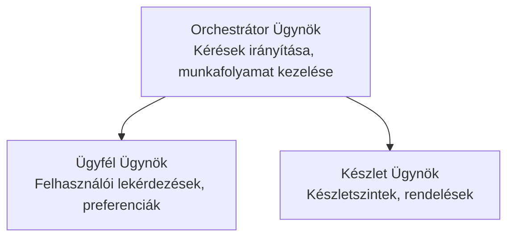

# 5. fejezet: Többügynökös MI megoldások

**📚 Tanfolyam**: [AZD kezdőknek](../../README.md) | **⏱️ Időtartam**: 2-3 óra | **⭐ Bonyolultság**: Haladó

---

## Áttekintés

Ez a fejezet haladó többügynökös architektúra mintákat, ügynökök összehangolását és termelésre kész MI telepítéseket fed le összetett forgatókönyvekhez.

> Ellenőrizve `azd 1.27.1` verzióval 2026 júliusában.

## Tanulási célok

Ennek a fejezetnek a teljesítésével:
- Megérted a többügynökös architektúra mintákat
- Telepítesz koordinált MI ügynök rendszereket
- Megvalósítod az ügynök-ügynök közti kommunikációt
- Felépítesz termelésre kész többügynökös megoldásokat

---

## 📚 Tananyagok

| # | Lecke | Leírás | Idő |
|---|--------|---------|-----|
| 1 | [Többügynökös alapok](multi-agent-basics.md) | Gyakorlati: működő többügynökös alkalmazás telepítése `azd up` paranccsal | 45 perc |
| 2 | [Összehangolási minták](../chapter-06-pre-deployment/coordination-patterns.md) | Ügynökök összehangolási stratégiái (folytatódik a 6. fejezetben) | 30 perc |
| 3 | [ARM sablon telepítés](../../examples/retail-multiagent-arm-template/README.md) | Egykattintásos telepítési példa | 30 perc |

> **Kezdd az 1. leckével.** Ez az egyetlen teljesen gyakorlati, telepíthető lecke ebben a fejezetben. A 2. lecke a 6. fejezetben található (közös a telepítés előtti tervezéssel), és a [Kiskereskedelmi Többügynökös Megoldás](../../examples/retail-scenario.md) egy architektúra tervrajz — egy tervezési referencia, nem egy parancsra kész sablon.

---

## 🚀 Gyorskezdés

```bash
# 1. lehetőség: Telepítés sablonból
azd init --template agent-openai-python-prompty
azd up

# 2. lehetőség: Telepítés agent manifestből (az azure.ai.agents kiterjesztés szükséges)
azd extension install azure.ai.agents
azd ai agent init -m agent-manifest.yaml
azd up
```

> **Melyik megközelítést?** Használd az `azd init --template` parancsot egy működő mintából való induláshoz. Használd az `azd ai agent init` parancsot, ha saját ügynök manifeszted van. Lásd a [AZD MI CLI hivatkozást](../chapter-08-production/production-ai-practices.md#azd-ai-cli-commands-and-extensions) a teljes részletekért.

---

## 🤖 Többügynökös architektúra



---

## 🎯 Kiemelt megoldás: Kiskereskedelmi Többügynökös

A [Kiskereskedelmi Többügynökös Megoldás](../../examples/retail-scenario.md) bemutatja:

- **Ügyfélügynök**: Kezeli a felhasználói interakciókat és preferenciákat
- **Leltár Ügynök**: Kezeli a készletet és megrendelés feldolgozást
- **Összehangoló**: Koordinál az ügynökök között
- **Megosztott memória**: Ügynökök közti kontextus kezelés

### Használt szolgáltatások

| Szolgáltatás | Cél |
|---------|---------|
| Microsoft Foundry Modellek | Nyelvi megértés |
| Azure MI Keresés | Termékkatalógus |
| Cosmos DB | Ügynök állapot és memória |
| Container Apps | Ügynök hosztolás |
| Application Insights | Monitorozás |

---

## 🔗 Navigáció

| Irány | Fejezet |
|-----------|---------|
| **Előző** | [4. fejezet: Infrastruktúra](../chapter-04-infrastructure/README.md) |
| **Következő** | [6. fejezet: Telepítés előtti](../chapter-06-pre-deployment/README.md) |

---

## 📖 Kapcsolódó források

- [MI Ügynökök útmutató](../chapter-02-ai-development/agents.md)
- [Termelési MI gyakorlatok](../chapter-08-production/production-ai-practices.md)
- [MI hibakeresés](../chapter-07-troubleshooting/ai-troubleshooting.md)

---

<!-- CO-OP TRANSLATOR DISCLAIMER START -->
**Jogi nyilatkozat**:
Ez a dokumentum az AI fordítási szolgáltatás, a [Co-op Translator](https://github.com/Azure/co-op-translator) segítségével készült. Bár az pontosságra törekszünk, kérjük, vegye figyelembe, hogy az automatikus fordítások hibákat vagy pontatlanságokat tartalmazhatnak. Az eredeti dokumentum az anyanyelvén tekintendő hiteles forrásnak. Fontos információk esetén professzionális emberi fordítást javasolunk. Nem vállalunk felelősséget semmilyen félreértésért vagy téves értelmezésért, amely ebből a fordításból ered.
<!-- CO-OP TRANSLATOR DISCLAIMER END -->