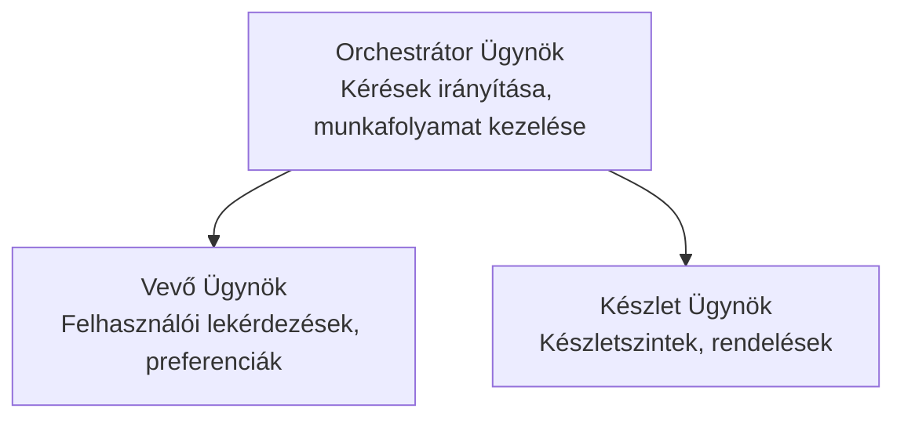

# 5. fejezet: Többügynökös Mesterséges Intelligencia Megoldások

**📚 Tanfolyam**: [AZD Kezdőknek](../../README.md) | **⏱️ Időtartam**: 2-3 óra | **⭐ Bonyolultság**: Haladó

---

## Áttekintés

Ez a fejezet fejlett többügynökös architektúra mintákat, ügynök koordinációt és éles környezetbe szánt mesterséges intelligencia telepítéseket tárgyal összetett helyzetekhez.

## Tanulási célok

A fejezet elvégzése során Ön:
- Megérti a többügynökös architektúra mintákat
- Koordinált MI-ügynök rendszereket telepít
- Ügynökök közötti kommunikációt valósít meg
- Éles környezetben használható többügynökös megoldásokat épít

---

## 📚 Leckék

| # | Lecke | Leírás | Idő |
|---|--------|-------------|------|
| 1 | [Kiskereskedelmi Többügynökös Megoldás](../../examples/retail-scenario.md) | Teljes megvalósítási bemutató | 90 perc |
| 2 | [Koordinációs Minták](../chapter-06-pre-deployment/coordination-patterns.md) | Ügynök összehangolási stratégiák | 30 perc |
| 3 | [ARM Sablon Telepítés](../../examples/retail-multiagent-arm-template/README.md) | Egylépéses telepítés | 30 perc |

---

## 🚀 Gyors Kezdés

```bash
# 1. lehetőség: Kiszolgáló telepítése sablonból
azd init --template agent-openai-python-prompty
azd up

# 2. lehetőség: Kiszolgáló telepítése ügynök manifesztből (az azure.ai.agents bővítményt igényli)
azd extension install azure.ai.agents
azd ai agent init -m agent-manifest.yaml
azd up
```

> **Melyik megközelítés?** Használja az `azd init --template` parancsot egy működő minta alapján való kezdéshez. Az `azd ai agent init` parancsot használja, ha saját ügynök manifesztje van. Részletekért lásd az [AZD AI CLI referencia](../chapter-08-production/production-ai-practices.md#azd-ai-cli-commands-and-extensions) részt.

---

## 🤖 Többügynökös Architektúra


---

## 🎯 Kiemelt Megoldás: Kiskereskedelmi Többügynökös

A [Kiskereskedelmi Többügynökös Megoldás](../../examples/retail-scenario.md) bemutatja:

- **Ügyfél Ügynök**: Felhasználói interakciók és preferenciák kezelése
- **Készlet Ügynök**: Készlet- és rendeléskezelés
- **Orkesztrátor**: Ügynökök közötti koordináció
- **Megosztott Memória**: Ügynökök közötti kontextuskezelés

### Használt Szolgáltatások

| Szolgáltatás | Cél |
|---------|---------|
| Microsoft Foundry Modellek | Nyelvi megértés |
| Azure AI Keresés | Termékkatalógus |
| Cosmos DB | Ügynöki állapot és memória |
| Konténer Alkalmazások | Ügynökök hosztolása |
| Application Insights | Felügyelet |

---

## 🔗 Navigáció

| Irány | Fejezet |
|-----------|---------|
| **Előző** | [4. fejezet: Infrastruktúra](../chapter-04-infrastructure/README.md) |
| **Következő** | [6. fejezet: Előzetes Telepítés](../chapter-06-pre-deployment/README.md) |

---

## 📖 Kapcsolódó Források

- [MI Ügynökök Útmutató](../chapter-02-ai-development/agents.md)
- [Éles Mesterséges Intelligencia Gyakorlatok](../chapter-08-production/production-ai-practices.md)
- [MI Hibakeresés](../chapter-07-troubleshooting/ai-troubleshooting.md)

---

<!-- CO-OP TRANSLATOR DISCLAIMER START -->
**Jogi nyilatkozat**:  
Ez a dokumentum az AI fordítási szolgáltatás, a [Co-op Translator](https://github.com/Azure/co-op-translator) segítségével készült. Bár igyekszünk a pontosságra, kérjük, vegye figyelembe, hogy az automatikus fordítások hibákat vagy pontatlanságokat tartalmazhatnak. Az eredeti dokumentum az anyanyelvén tekinthető hiteles forrásnak. Fontos információk esetén javasolt profi emberi fordítást igénybe venni. Nem vállalunk felelősséget az ebből a fordításból eredő félreértésekért vagy téves értelmezésekért.
<!-- CO-OP TRANSLATOR DISCLAIMER END -->