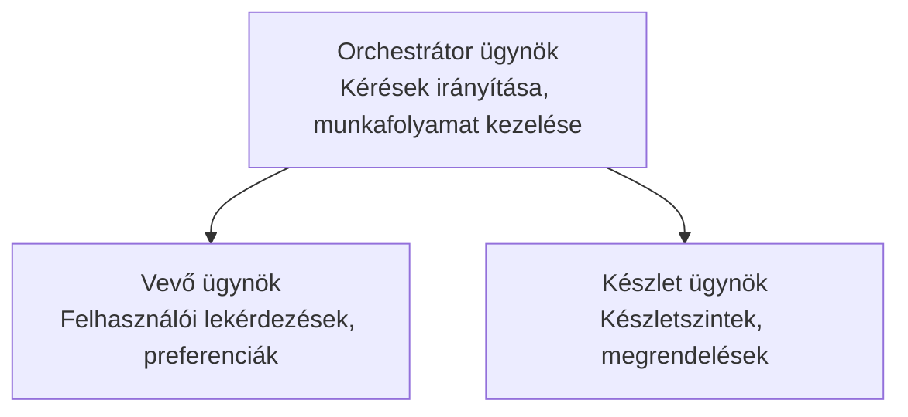

# 5. fejezet: Többügynökös MI megoldások

**📚 Tanfolyam**: [AZD kezdőknek](../../README.md) | **⏱️ Időtartam**: 2-3 óra | **⭐ Bonyolultság**: Haladó

---

## Áttekintés

Ez a fejezet haladó többügynökös architektúra mintákat, ügynökök összehangolását és gyártásra kész MI telepítéseket tárgyal összetett szcenáriókhoz.

> Ellenőrizve `azd 1.23.12` verzióval 2026 márciusában.

## Tanulási célok

A fejezet elvégzése után képes leszel:
- Megérteni a többügynökös architektúra mintákat
- Összehangolt MI ügynökrendszereket telepíteni
- Ügynökök közötti kommunikációt megvalósítani
- Gyártásra kész többügynökös megoldásokat építeni

---

## 📚 Leckék

| # | Lecke | Leírás | Idő |
|---|--------|-------------|------|
| 1 | [Kiskereskedelmi többügynökös megoldás](../../examples/retail-scenario.md) | Teljes implementáció bemutatása | 90 perc |
| 2 | [Összehangolási minták](../chapter-06-pre-deployment/coordination-patterns.md) | Ügynök összehangolási stratégiák | 30 perc |
| 3 | [ARM sablon telepítés](../../examples/retail-multiagent-arm-template/README.md) | Egykattintásos telepítés | 30 perc |

---

## 🚀 Gyors kezdés

```bash
# 1. lehetőség: Telepítés sablonból
azd init --template agent-openai-python-prompty
azd up

# 2. lehetőség: Telepítés ügynök manifestből (az azure.ai.agents kiterjesztést igényli)
azd extension install azure.ai.agents
azd ai agent init -m agent-manifest.yaml
azd up
```

> **Melyik megközelítést válasszam?** Használd az `azd init --template` parancsot, ha működő mintából szeretnél indítani. Használd az `azd ai agent init` parancsot, ha saját ügynök manifest fájlod van. Teljes részletekért lásd az [AZD AI CLI referencia](../chapter-08-production/production-ai-practices.md#azd-ai-cli-commands-and-extensions) dokumentációt.

---

## 🤖 Többügynökös architektúra


---

## 🎯 Kiemelt megoldás: Kiskereskedelmi többügynökös rendszer

A [Kiskereskedelmi többügynökös megoldás](../../examples/retail-scenario.md) bemutatja:

- **Ügyfélügynök**: Ügyfél interakciók és preferenciák kezelése
- **Készletügynök**: Készlet- és rendeléskezelés
- **Koordinátor**: Az ügynökök összehangolása
- **Megosztott memória**: Ügynökök közti kontextuskezelés

### Használt szolgáltatások

| Szolgáltatás | Cél |
|---------|---------|
| Microsoft Foundry Models | Nyelvi megértés |
| Azure AI Search | Termékkatalógus |
| Cosmos DB | Ügynök állapot és memória |
| Container Apps | Ügynök hosztolása |
| Application Insights | Megfigyelés |

---

## 🔗 Navigáció

| Irány | Fejezet |
|-----------|---------|
| **Előző** | [4. fejezet: Infrastruktúra](../chapter-04-infrastructure/README.md) |
| **Következő** | [6. fejezet: Telepítés előtti lépések](../chapter-06-pre-deployment/README.md) |

---

## 📖 Kapcsolódó források

- [MI Ügynökök útmutatója](../chapter-02-ai-development/agents.md)
- [Gyártásra kész MI gyakorlatok](../chapter-08-production/production-ai-practices.md)
- [MI hibakeresés](../chapter-07-troubleshooting/ai-troubleshooting.md)

---

<!-- CO-OP TRANSLATOR DISCLAIMER START -->
**Jogi nyilatkozat**:  
Ez a dokumentum az AI fordító szolgáltatás [Co-op Translator](https://github.com/Azure/co-op-translator) segítségével készült. Bár a pontosságra törekszünk, kérjük, vegye figyelembe, hogy az automatikus fordítások hibákat vagy pontatlanságokat tartalmazhatnak. Az eredeti dokumentum anyanyelvű változata tekintendő hiteles forrásnak. Kritikus információk esetén professzionális emberi fordítást javaslunk. Nem vállalunk felelősséget az ebből a fordításból eredő félreértésekért vagy téves értelmezésekért.
<!-- CO-OP TRANSLATOR DISCLAIMER END -->