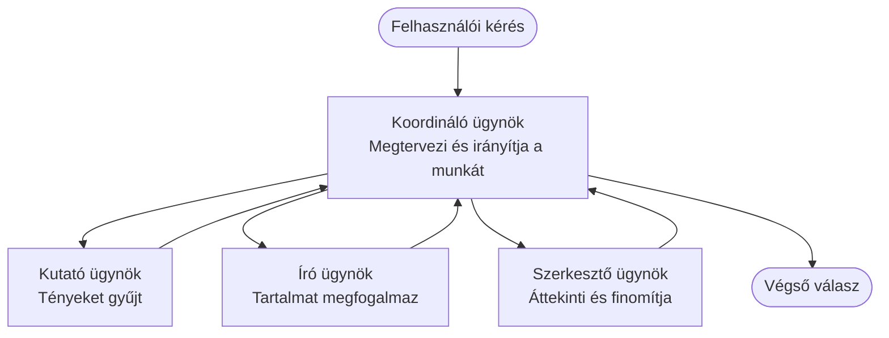

# Multi-Agent Basics - Telepítsd az első koordinált AI rendszeredet

**Chapter Navigation:**
- **📚 Tanfolyam főoldal**: [AZD For Beginners](../../README.md)
- **📖 Aktuális fejezet**: Chapter 5 - Multi-Agent AI Solutions
- **⬅️ Előző**: [Chapter 4: Infrastructure](../chapter-04-infrastructure/README.md)
- **➡️ Következő**: [Coordination Patterns](../chapter-06-pre-deployment/coordination-patterns.md)

> Ellenőrizve az `azd 1.25.6` verzióval, 2026 júniusában.

## Bevezetés

A korábbi fejezetekben egyetlen alkalmazást telepítettél — és a 2. fejezetben egyetlen AI ügynököt telepítettél. Ez a lecke a következő lépést mutatja be: egy **többügynökös rendszert** telepítünk, ahol több, specializált ügynök együtt dolgozik egy olyan problémán, amit egyetlen ügynök önmagában nem tudna jól megoldani.

Jó hír a kezdőknek: **nem kell új parancsokra szükséged.** A többügynökös megoldás továbbra is egy azd projekt. Ugyanúgy végrehajtod az `azd init`, `azd up`, tesztelés és `azd down` lépéseket — pontosan az ismert munkafolyamatot. Ami változik, az az alkalmazáson belüli felépítés.

## Tanulási célok

A lecke végére:
- Megérted, mit jelent a „multi-agent”, és mikor éri meg a plusz komplexitást
- Felismered a többügynökös rendszer gyakori szerepeit (orchestrator + specialisták)
- Telepítesz egy működő, valós többügynökös sablont az `azd up` segítségével
- Megérted az Azure erőforrásokat, amelyek egy többügynökös alkalmazást támogatnak
- Tudod, hogyan ellenőrizd, testreszabd és bontsd le a megoldást biztonságosan

## Tanulási eredmények

A lecke elvégzése után képes leszel:
- Elmagyarázni a különbséget egyetlen ügynök és egy többügynökös rendszer között
- Dönteni egyetlen ügynök eszközökkel történő használata és egy valódi többügynökös architektúra között
- Teljes körűen telepíteni és tesztelni egy többügynökös sablont az azd segítségével
- Azonosítani, hol futnak az egyes ügynökök és hogyan kommunikálnak
- Minden erőforrást eltakarítani a folyamatos költségek elkerülése érdekében

---

## Mi az a többügynökös rendszer?

Egyetlen AI ügynök egy modell, egy készlet utasítással és (opcionálisan) néhány eszközzel. Ez jól működik fókuszált feladatoknál. De ahogy a feladat növekszik — kutatás, majd írás, majd szerkesztés, majd tényellenőrzés — mindent egyetlen promptba tuszkolni lassabbá, kevésbé megbízhatóvá és nehezebben hibakereshetővé teszi az ügynököt.

Egy **többügynökös rendszer** a munkát specialista szerepekre bontja, amelyek mindegyike egy feladatot jól elvégez, azokat egy orchestrator koordinálja:



### The two roles you'll always see

| Role | Job | Example |
|------|-----|---------|
| **Orchestrator** | Decides *what happens next* and routes work between agents | "First research, then write, then edit" |
| **Specialist** | Does one focused job and returns a result | A "researcher" that only gathers facts |

### Szükséged van tényleg több ügynökre?

Kezdj egyszerűen. Többügynököst csak akkor alkalmazz, ha az alábbiak egyike igaz:

- ✅ A feladatnak **különböző szakaszai** vannak, amelyek külön utasításokkal jobban működnek (kutatás vs. írás vs. felülvizsgálat)
- ✅ A specialistákat **párhuzamosan** akarod futtatni az idő megtakarítása érdekében
- ✅ Különböző lépésekhez **más eszközök vagy adatok** kellenek
- ✅ Azt szeretnéd, hogy minden lépés **függetlenül tesztelhető és hibakereshető** legyen

Ha a feladat egy egyszerű kérdés-válasz vagy egy egyszerű eszközhívás, egy **egyetlen ügynök eszközökkel** (2. fejezet) egyszerűbb, olcsóbb és könnyebb üzemeltetni.

> **Kezdő tipp:** „Több ügynök” nem feltétlenül „jobb”. Minden ügynök késleltetést, költséget és egy újabb felügyeleti elemet jelent. Adj ügynököt csak akkor, ha a probléma egyértelműen részekre bontható.

---

## Két mód Azure-on többügynökös rendszer építésére

| Approach | What it is | Best for |
|----------|-----------|----------|
| **Single agent + tools** | One Foundry agent that calls functions/tools | Simple workflows, getting started |
| **Multiple coordinated agents** | Several agents with an orchestrator | Distinct stages, parallel work, specialization |

Ez a lecke a második megközelítésre fókuszál egy **kész sablonnal**, így láthatsz egy valós többügynökös rendszert működés közben, mielőtt a sajátodat építenéd.

---

## Gyakorlat: Telepíts egy működő többügynökös alkalmazást

Telepítjük a **Contoso Creative Writer** alkalmazást, egy hivatalos Azure mintát, amely több ügynököt használ (kutató, író, szerkesztő), és ezeket koordinálva állít elő egy cikket. Jó első többügynökös alkalmazásnak számít, mert a szerepek könnyen érthetőek.

### Step 1: Initialize the template

```bash
# Hozz létre egy munkamappát
mkdir creative-writer && cd creative-writer

# Inicializáld a projektet a hivatalos többügynökös sablon alapján
azd init --template contoso-creative-writer
```

> Nézz meg további többügynökös sablonokat bármikor az [Awesome AZD AI gallery](https://azure.github.io/awesome-azd/?tags=ai) oldalon. Más kezdőbarát lehetőségek: `get-started-with-ai-agents` és `azure-ai-travel-agents`.

### Step 2: Authenticate

```bash
# Szükséges az azd munkafolyamatokhoz
azd auth login
```

### Step 3: Create an environment

```bash
azd env new dev
```

### Step 4: Preview, then deploy

```bash
# Tekintse meg, mi fog létrejönni, mielőtt bármit is költ (ajánlott)
azd provision --preview

# Infrastruktúra kiépítése és az összes ügynök telepítése egy lépésben
azd up
```

`azd up` rákérdez egy előfizetésre és régióra, majd előkészíti az Azure erőforrásokat és telepíti az alkalmazást. Az AI telepítések tovább tarthatnak, mint egy egyszerű webalkalmazás — ha nagyobb modelleket telepítesz, meghosszabbíthatod a telepítési időkorlátot:

```bash
azd deploy --timeout 1800
```

> **Figyelem a költségre és kapacitásra:** A többügynökös alkalmazások AI modelleket telepítenek, amelyek kvótát fogyasztanak és költséget generálnak. Ha az `azd up` model kvóta miatt meghiúsul, lásd az [AI Troubleshooting](../chapter-07-troubleshooting/ai-troubleshooting.md) részt a régió- és kvótamegoldásokhoz, illetve a 6. fejezet [Capacity Planning](../chapter-06-pre-deployment/capacity-planning.md) anyagát.

---

## Amit telepítettél — megértés

Egy tipikus többügynökös alkalmazás ilyen erőforrásokat állít elő, amelyek közvetlenül megfelelnek a fenti felelősségeknek:

| Resource | Why it's there |
|----------|----------------|
| **Microsoft Foundry / Models** | Hosts the language models each agent uses |
| **Azure AI Search** | Gives the researcher agent grounded data to search |
| **Container Apps** (or App Service) | Hosts the orchestrator and agent code |
| **Cosmos DB** (in some samples) | Stores shared state/memory passed between agents |
| **Application Insights** | Traces requests *across* agents so you can debug the flow |

### Hogyan beszélgetnek az ügynökök egymással

A legtöbb azd többügynökös mintában az **orchestrator az alkalmazáskódon belül fut** (például egy olyan keretrendszerrel, mint a Semantic Kernel vagy a Microsoft Agent Framework). Az orchestrator egymás után hívja a specialistákat, továbbadja az eredményeket, és összeállítja a végső választ. Az ügynökök a következő módokon osztanak meg kontextust:

- **Function/tool calls** — az orchestrator meghív egy specialistát és visszakap egy eredményt
- **Shared memory** — egy adatbázis (gyakran Cosmos DB) tárolja az állapotot, amelyet mindkét ügynök olvashat
- **Messages/events** — lazább kapcsolódás esetén az ügynökök soron vagy Service Bus-on keresztül kommunikálnak

> **Miért fontos ez a hibakeresésnél:** mivel minden lépés külön van, az Application Insights megmutatja, *melyik* ügynök volt lassú vagy hibás. Ez az egyik fő oka annak, hogy érdemes a munkát ügynökök között felosztani.

---

## A telepítés ellenőrzése

Győződj meg róla, hogy a rendszer tényleg működik, mielőtt továbbmész:

```bash
# Telepített végpontok megjelenítése
azd show

# Az alkalmazás felügyeleti irányítópultjának megnyitása
azd monitor

# Naplók valós idejű követése, ha valami nem stimmel
azd monitor --logs
```

Ezután nyisd meg az `azd show` által adott alkalmazás URL-jét, és próbálj meg egy olyan kérést, ami az összes ügynököt igénybe veszi (a Creative Writer esetében kérd meg, hogy írjon egy rövid cikket egy témáról). Az Application Insights **transaction search** nézetében látnod kell, hogy a kérés szétterjed a kutató, író és szerkesztő lépések között.

Sikerkritériumok:
- ✅ Az `azd show` egy elérhető végpontot listáz
- ✅ Egy kérés eredménye egyértelműen több szakaszon ment keresztül
- ✅ Az Application Insights több ügynök lépésére vonatkozó trace-eket mutat

---

## Testreszabás: Adj hozzá vagy módosíts egy ügynököt

Mivel minden ügynök csupán utasítások és eszközök kombinációja, a testreszabás megközelíthető:

1. **Keresd meg az ügynök-definíciókat** a sablonban (gyakran `prompts/`, `agents/` vagy `*.prompty` fájlok).
2. **Finomhangold egy ügynök utasításait** — például mondd meg a szerkesztő ügynöknek, hogy tartson egy meghatározott hangnemet vagy szókorlátot.
3. **Csak a kódot telepítsd újra** (az infrastruktúra változatlan):

   ```bash
   azd deploy
   ```

Ha tovább szeretnél menni és a *saját* manifestedből építenél ügynököket, használd az ügynök kiterjesztést és annak teljes életciklusát:

```bash
azd extension install azure.ai.agents
azd ai agent init -m agent-manifest.yaml
azd up
azd ai agent invoke      # teszt, válaszidővel
```

Lásd a [Chapter 2: Agents](../chapter-02-ai-development/agents.md) részt és az [AZD AI CLI reference](../chapter-08-production/production-ai-practices.md#azd-ai-cli-commands-and-extensions) dokumentációt a teljes ügynök életciklushoz (`invoke`, `eval generate`, `optimize`, `delete`).

---

## Eltakarítás

A többügynökös alkalmazások több számlázható szolgáltatást futtatnak. Bontsd le az összeset, amikor végeztél:

```bash
azd down --force --purge
```

A `--purge` kapcsoló eltávolítja a soft-deleted AI erőforrásokat is (például Foundry/Azure AI Services fiókok), így azok nem akadályozzák a jövőbeli újratelepítést és nem generálnak további költséget.

---

## Jegyzet a produkciós többügynökös rendszerekről

A repositoryban található [Retail Multi-Agent Solution](../../examples/retail-scenario.md) egy **architektúra terv**, nem egy egylépéses sablon — dokumentálja, hogyan lehet egy produkciós kiskereskedelmi rendszert felépíteni (és világosan közli, hogy egy teljes építés jelentős erőfeszítést igényel). Használd tervezési referenciaanyagként *miután* telepítettél egy működő példát itt. A produkciós szempontokért (ellenálló képesség, költség, monitorozás, kormányzás) folytasd a [Chapter 8: Production AI Practices](../chapter-08-production/production-ai-practices.md) anyagát.

---

## Összefoglalás

- A többügynökös rendszer a munkát specialisták között osztja meg, amelyeket egy orchestrator koordinál.
- Csak akkor használd, ha a feladatnak külön szakaszai vannak, párhuzamos végrehajtásra van szükség, vagy lépésenként eltérő eszközök kellenek — egyébként részesítsd előnyben az egyetlen ügynököt.
- Az azd munkafolyamat változatlan: `azd init` → `azd up` → teszt → `azd down`.
- Egy valós sablon, mint a `contoso-creative-writer`, lehetővé teszi, hogy ma megtekinthesd és testreszabhasd egy működő többügynökös alkalmazást.
- Az Application Insights átfogó trace-e az ügynökök között az egyik legnagyobb gyakorlati előnye a többügynökös felépítésnek.

---

## 🔗 Navigáció

| Direction | Lesson |
|-----------|--------|
| **Previous** | [Chapter 4: Infrastructure](../chapter-04-infrastructure/README.md) |
| **Next** | [Coordination Patterns](../chapter-06-pre-deployment/coordination-patterns.md) |

## 📖 Kapcsolódó források

- [AI Agents Guide](../chapter-02-ai-development/agents.md)
- [Coordination Patterns](../chapter-06-pre-deployment/coordination-patterns.md)
- [Production AI Practices](../chapter-08-production/production-ai-practices.md)
- [AI Troubleshooting](../chapter-07-troubleshooting/ai-troubleshooting.md)

---

<!-- CO-OP TRANSLATOR DISCLAIMER START -->
**Jogi nyilatkozat**:
Ez a dokumentum az AI fordítási szolgáltatás, a [Co-op Translator](https://github.com/Azure/co-op-translator) segítségével készült. Bár az pontosságra törekszünk, kérjük, vegye figyelembe, hogy az automatikus fordítások hibákat vagy pontatlanságokat tartalmazhatnak. Az eredeti dokumentum az anyanyelvén tekintendő hiteles forrásnak. Fontos információk esetén professzionális emberi fordítást javasolunk. Nem vállalunk felelősséget semmilyen félreértésért vagy téves értelmezésért, amely ebből a fordításból ered.
<!-- CO-OP TRANSLATOR DISCLAIMER END -->