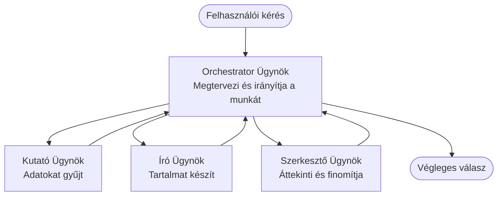

# Többügynökös Alapok - Helyezze üzembe első koordinált MI rendszerét

**Fejezet navigáció:**
- **📚 Tanfolyam kezdőlap**: [AZD kezdőknek](../../README.md)
- **📖 Jelenlegi fejezet**: 5. fejezet - Többügynökös MI megoldások
- **⬅️ Előző**: [4. fejezet: Infrastruktúra](../chapter-04-infrastructure/README.md)
- **➡️ Következő**: [Koordinációs minták](../chapter-06-pre-deployment/coordination-patterns.md)

> Érvényesítve az `azd 1.27.1` verzióval, 2026 júliusában.

## Bevezetés

A korábbi fejezetekben egyetlen alkalmazást helyezett üzembe — és a 2. fejezetben egyetlen MI ügynököt. Ez a lecke a következő lépést veszi: egy **többügynökös rendszert** helyezünk üzembe, ahol több specializált ügynök dolgozik együtt egy olyan probléma megoldásán, amelyet egyetlen ügynök nem tudna jól kezelni egyedül.

Jó hír kezdőknek: **nem kell új parancsokat tanulnia.** Egy többügynökös megoldás továbbra is egy azd projekt. Fogja használni az `azd init`, `azd up`, tesztel, majd `azd down` parancsokat — pontosan ugyanazt a munkafolyamatot, amit már ismer. Ami változik, az az alkalmazás *belső alakja*.

## Tanulási célok

Az óra végére Ön képes lesz:
- Megérteni, mit jelent a "többügynökös" és mikor éri meg a plusz összetettség
- Felismerni a többügynökös rendszer gyakori szerepeit (koordinátor + specialisták)
- Egy valós, működő többügynökös sablon telepítése `azd up` segítségével
- Megérteni az Azure erőforrásokat, amelyek egy többügynökös alkalmazást támogatnak
- Tudni, hogyan ellenőrizze, testre szabja és bontsa le biztonságosan a megoldást

## Tudásgyarapodás után

A lecke elvégzése után képes lesz:
- Kifejteni a különbséget egyetlen ügynök és egy többügynökös rendszer között
- Kiválasztani egyetlen ügynök eszközökkel vagy egy valódi többügynökös kialakítás között
- End-to-end telepíteni és tesztelni egy többügynökös sablont az azd-vel
- Meghatározni, hogy az egyes ügynökök hol futnak és hogyan kommunikálnak
- Tisztítani az összes erőforrást, hogy elkerülje a folyamatos költségeket

---

## Mi az a többügynökös rendszer?

Egyetlen MI ügynök egy modell, amely egy sor utasításból áll és (opcionálisan) néhány eszközből. Ez jól működik fókuszált feladatokra. De amint a feladat nő — kutatás, aztán írás, szerkesztés, majd valóság-ellenőrzés — az összeset egyetlen promptba zsúfolni lassabbá, megbízhatatlanabbá és nehezebben hibakereshetővé teszi az ügynököt.

Egy **többügynökös rendszer** a munkát specialistákra bontja, akik mindegyike jól végzi el a saját feladatát, és ezt egy koordinátor irányítja:



### A két szerep, amit mindig látni fog

| Szerep | Feladat | Példa |
|------|-----|---------|
| **Koordinátor** | Dönt arról, *mi történik ezután* és irányítja a munkát az ügynökök között | "Először kutatás, aztán írás, végül szerkesztés" |
| **Specialista** | Egy adott feladatot végez el és visszaad egy eredményt | Egy "kutató", aki csak adatokat gyűjt |

### Valóban szükség van több ügynökre?

Kezdje egyszerűen. Többügynököst **csak akkor** alkalmazzon, ha az alábbiak közül bármelyik igaz:

- ✅ A feladatnak **megkülönböztetett szakaszai** vannak, amelyek különböző utasításokat igényelnek (kutatás vs. írás vs. áttekintés)
- ✅ Specialistáknak párhuzamosan kell futniuk az idő megtakarítása érdekében
- ✅ Különböző lépéseknek **különböző eszközökre vagy adatforrásokra** van szükségük
- ✅ Minden lépést külön-külön tesztelhetőnek és hibakereshetőnek kell lennie

Ha a feladat egy egyszerű kérdés-válasz vagy eszközhívás, egy **eszközökkel ellátott egyetlen ügynök** (2. fejezet) egyszerűbb, olcsóbb és könnyebben kezelhető.

> **Kezdő tipp:** „Több ügynök” nem jelenti, hogy „jobb.” Minden ügynök késleltetést, költséget és újabb felügyeleti feladatot ad hozzá. Csak akkor adjunk hozzá ügynököket, ha a probléma egyértelműen részekre bontható.

---

## Két módja a többügynökös rendszer építésének Azure-on

| Megközelítés | Mi az | Legjobb alkalom |
|----------|-----------|----------|
| **Egyetlen ügynök + eszközök** | Egy Foundry ügynök hívja a függvényeket/eszközöket | Egyszerű munkafolyamatok, kezdők számára |
| **Több koordinált ügynök** | Több ügynök egy koordinátorral | Különálló szakaszok, párhuzamos munka, specializáció |

Ez a lecke a második megközelítésre fókuszál egy **kész sablon** használatával, hogy Ön láthassa egy valódi többügynökös rendszer működését, mielőtt megépítené a sajátját.

---

## Gyakorlati rész: működő többügynökös alkalmazás telepítése

Üzembe helyezzük a **Contoso Creative Writer** hivatalos Azure mintát, amely több ügynököt (kutató, író, szerkesztő) használ koordináltan cikk készítésére. Ez egy nagyszerű első többügynökös alkalmazás, mert a szerepek könnyen érthetők.

### 1. lépés: Inicializálja a sablont

```bash
# Munkamappa létrehozása
mkdir creative-writer && cd creative-writer

# Inicializálás a hivatalos multi-agent sablonból
azd init --template contoso-creative-writer
```

> Bármikor böngészhet több többügynökös sablont a [Awesome AZD MI galériában](https://azure.github.io/awesome-azd/?tags=ai). Egyéb kezdőbarát lehetőségek: `get-started-with-ai-agents` és az `azure-ai-travel-agents`.

### 2. lépés: Hitelesítés

```bash
# Szükséges az azd munkafolyamatokhoz
azd auth login
```

### 3. lépés: Környezet létrehozása

```bash
azd env new dev
```

### 4. lépés: Előnézet, majd telepítés

```bash
# Nézze meg, mi fog létrejönni, mielőtt bármit is költene (ajánlott)
azd provision --preview

# Infrastruktúra előkészítése és az összes ügynök egy lépésben történő telepítése
azd up
```

Az `azd up` felkéri, hogy válasszon előfizetést és régiót, majd létrehozza az Azure erőforrásokat és telepíti az alkalmazást. A MI alapú telepítések hosszabb ideig tarthatnak, mint egy egyszerű webalkalmazás — ha nagyobb modelleket telepít, meghosszabbíthatja a telepítési időkorlátot:

```bash
azd deploy --timeout 1800
```

> **Figyelem a költség és kapacitás miatt:** A többügynökös alkalmazások AI modelleket telepítenek, amelyek kvótát fogyasztanak és költséget okoznak. Ha az `azd up` modell kvóta miatt meghiúsul, tekintse meg az [MI hibaelhárítást](../chapter-07-troubleshooting/ai-troubleshooting.md) régió- és kvóta javításokra, valamint a 6. fejezetet [Kapacitástervezés](../chapter-06-pre-deployment/capacity-planning.md).

---

## Értse meg, mit telepített

Egy tipikus ilyen többügynökös alkalmazás egy halom Azure erőforrást hoz létre, amelyek közvetlenül megfelelnek a fent ábrázolt felelősségeknek:

| Erőforrás | Miért van ott |
|----------|----------------|
| **Microsoft Foundry / Modellek** | Tárhelye a nyelvi modelleknek, amelyeket az egyes ügynökök használnak |
| **Azure AI Keresés** | Biztosítja a kutató ügynök számára a megalapozott adatokat kereséshez |
| **Konténeralkalmazások** (vagy App Service) | Tárhelye a koordinátor és ügynök kódjának |
| **Cosmos DB** (néhány mintában) | Tárolja az ügynökök között megosztott állapotot/ memóriát |
| **Application Insights** | Leköveti a kéréseket *az ügynökök között*, hogy hibakeresést lehessen végezni |

### Hogyan kommunikálnak az ügynökök egymással

A legtöbb azd többügynökös mintában a **koordinátor az alkalmazáskódban fut** (például egy olyan keretrendszerrel, mint a Semantic Kernel vagy a Microsoft Agent Framework). A koordinátor egymás után hívja meg a specialistákat, átadja az eredményeket, majd összeállítja a végső választ. Az ügynökök a következő módokon osztják meg a kontextust:

- **Függvény/eszköz hívások** — a koordinátor megkeresi a specialistát és visszakapja az eredményt
- **Megosztott memória** — egy adatbázis (gyakran Cosmos DB) tartja az állapotot, amelyet mindkét ügynök olvashat
- **Üzenetek/események** — lazább kapcsolódáshoz az ügynökök queue vagy Service Bus rendszeren keresztül kommunikálnak

> **Miért fontos ez a hibakeresésnél:** mivel a lépések különállóak, az Application Insights megmutatja, hogy *melyik* ügynök volt lassú vagy hibás. Ez az egyik fő oka annak, hogy érdemes a munkát ügynökök között megosztani.

---

## Ellenőrizze a telepítést

Győződjön meg arról, hogy a rendszer valóban működik, mielőtt továbblép:

```bash
# A telepített végpontok megjelenítése
azd show

# Az alkalmazás felügyeleti irányítópultjának megnyitása
azd monitor

# Naplók követése, ha valami furcsa tűnik
azd monitor --logs
```

Ezután nyissa meg az `azd show` által adott alkalmazás URL-jét, és próbáljon ki olyan kérést, amely minden ügynököt érint (a Creative Writer esetén kérje meg, hogy írjon egy rövid cikket egy témáról). Az Application Insights **tranzakció keresésében** látnia kell, hogy a kérés a kutató, író és szerkesztő lépések között terjed szét.

**Siker kritériumok:**
- ✅ Az `azd show` elérhető végpontot listáz
- ✅ Egy kérés eredménye egyértelműen több szakaszon ment keresztül
- ✅ Az Application Insights több ügynök lépésének nyomait mutatja

---

## Testreszabás: Ügynök hozzáadása vagy módosítása

Mivel az egyes ügynökök csak utasítások és eszközök, a testreszabás könnyen megközelíthető:

1. **Keresse meg az ügynök definíciókat** a sablonban (gyakran `prompts/`, `agents/` vagy `*.prompty` fájlok).
2. **Hangolja be egy ügynök utasításait** — például mondja meg a szerkesztőnek, hogy egy adott hangnemet vagy szószámot tartson be.
3. **Csak a kódot telepítse újra** (az infrastruktúra nem változik):

   ```bash
   azd deploy
   ```

Ha tovább akar haladni és saját *manifesztből* akar ügynököket építeni, használja az ügynök bővítményt és annak teljes életciklusát:

```bash
azd extension install azure.ai.agents
azd ai agent init -m agent-manifest.yaml
azd up
azd ai agent invoke      # teszt, válaszidővel
```

Tekintse meg a [2. fejezet: Ügynökök](../chapter-02-ai-development/agents.md) és az [AZD MI CLI referencia](../chapter-08-production/production-ai-practices.md#azd-ai-cli-commands-and-extensions) anyagokat az ügynökök teljes életciklusához (`invoke`, `eval generate`, `optimize`, `delete`).

---

## Takarítás

A többügynökös alkalmazások több számlázott szolgáltatást futtatnak. Amikor végez, bontsa le mindet:

```bash
azd down --force --purge
```

A `--purge` kapcsoló eltávolítja a lágyan törölt MI erőforrásokat (például Foundry/Azure AI szolgáltatás fiókok), így nem akadályozzák a jövőbeni újbóli telepítést és nem generálnak további költséget.

---

## Egy megjegyzés a produkciós többügynökös rendszerekről

A [Retail Multi-Agent Solution](../../examples/retail-scenario.md) ebben a tárházban egy **architekturális terv**, nem egy egylépéses sablon — dokumentálja, hogyan épül fel egy produkciós kereskedelmi rendszer (és egyértelmű, hogy a teljes építés jelentős erőfeszítés). Ezt használja mintatervezési referenciát *miután* telepített egy működő mintát itt. A produkciós kérdésekkel (ellenállóképesség, költség, felügyelet, irányítás) folytassa a [8. fejezet: Produkciós MI gyakorlatok](../chapter-08-production/production-ai-practices.md) anyagot.

---

## Összefoglalás

- Egy többügynökös rendszer a munkát specialisták között osztja meg, akiket egy koordinátor irányít.
- Csak akkor használja, ha a feladatnak megkülönböztetett szakaszai, párhuzamossága vagy különböző eszközei vannak lépésenként — különben egyetlen ügynök ajánlott.
- Az azd munkafolyamat változatlan: `azd init` → `azd up` → tesztelés → `azd down`.
- Egy valós sablon, mint a `contoso-creative-writer` lehetővé teszi, hogy ma azonnal láthassa és testreszabhassa egy működő többügynökös alkalmazást.
- Az Application Insights nyomkövetés az ügynökök között az egyik legnagyobb gyakorlati előnye a többügynökös tervezésnek.

---

## 🔗 Navigáció

| Irány | Lecke |
|-----------|--------|
| **Előző** | [4. fejezet: Infrastruktúra](../chapter-04-infrastructure/README.md) |
| **Következő** | [Koordinációs minták](../chapter-06-pre-deployment/coordination-patterns.md) |

## 📖 Kapcsolódó források

- [MI ügynökök útmutatója](../chapter-02-ai-development/agents.md)
- [Koordinációs minták](../chapter-06-pre-deployment/coordination-patterns.md)
- [Produkciós MI gyakorlatok](../chapter-08-production/production-ai-practices.md)
- [MI hibaelhárítás](../chapter-07-troubleshooting/ai-troubleshooting.md)

---

<!-- CO-OP TRANSLATOR DISCLAIMER START -->
**Jogi nyilatkozat**:
Ez a dokumentum az AI fordítási szolgáltatás, a [Co-op Translator](https://github.com/Azure/co-op-translator) segítségével készült. Bár az pontosságra törekszünk, kérjük, vegye figyelembe, hogy az automatikus fordítások hibákat vagy pontatlanságokat tartalmazhatnak. Az eredeti dokumentum az anyanyelvén tekintendő hiteles forrásnak. Fontos információk esetén professzionális emberi fordítást javasolunk. Nem vállalunk felelősséget semmilyen félreértésért vagy téves értelmezésért, amely ebből a fordításból ered.
<!-- CO-OP TRANSLATOR DISCLAIMER END -->