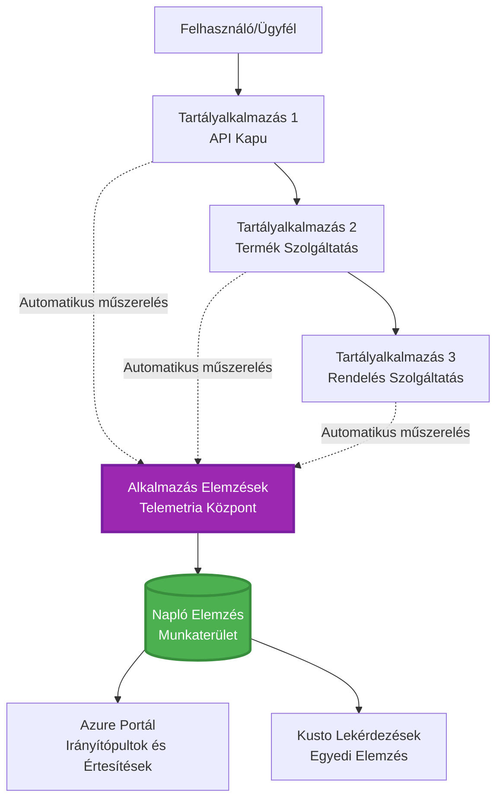
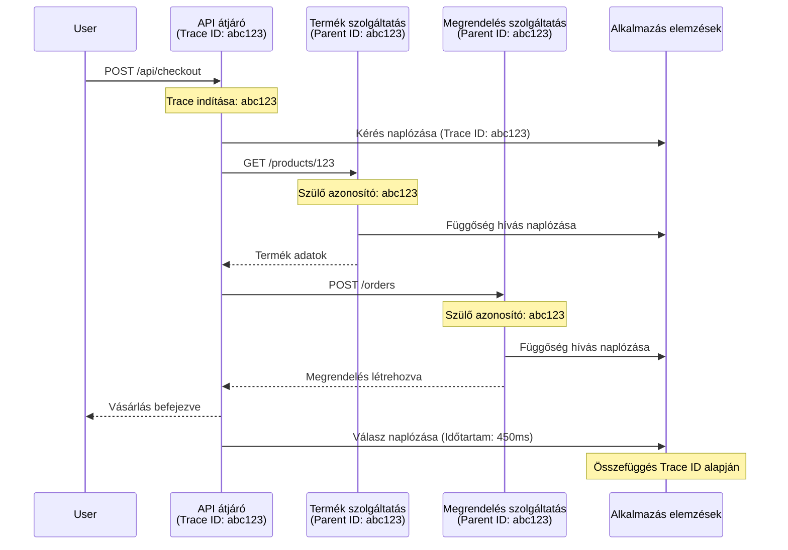

# Application Insights integráció az AZD-vel

⏱️ **Becsült idő**: 40-50 perc | 💰 **Költséghatás**: kb. $5-15/hónap | ⭐ **Bonyolultság**: Középhaladó

**📚 Tanulási útvonal:**
- ← Előző: [Előzetes ellenőrzések](preflight-checks.md) - Telepítés előtti validálás
- 🎯 **Jelenleg itt vagy**: Application Insights integráció (monitorozás, telemetria, hibakeresés)
- → Következő: [Telepítési útmutató](../chapter-04-infrastructure/deployment-guide.md) - Telepítés Azure-ba
- 🏠 [Tanfolyam kezdőlap](../../README.md)

---

## Amit megtanulsz

Ezen lecke elvégzésével:
- Automatikusan integrálod az **Application Insights**-t AZD projektekbe
- Konfigurálod a **elosztott nyomkövetést** mikroservice-ekhez
- Megvalósítod a **egyedi telemetriát** (mérőszámok, események, függőségek)
- Beállítod a **valós idejű metrikákat** a folyamatkövetéshez
- Létrehozol **értesítéseket és műszerfalakat** AZD telepítésekből
- Hibákat hibakeresel **telemetria lekérdezések** segítségével
- Optimalizálod a **költségeket és mintavételezési stratégiákat**
- Monitorozod az **AI/LLM alkalmazásokat** (tokenek, késleltetés, költségek)

## Miért fontos az Application Insights az AZD-vel

### A kihívás: Termelési megfigyelhetőség

**Application Insights nélkül:**
```
❌ No visibility into production behavior
❌ Manual log aggregation across services
❌ Reactive debugging (wait for customer complaints)
❌ No performance metrics
❌ Cannot trace requests across services
❌ Unknown failure rates and bottlenecks
```

**Application Insights + AZD-vel:**
```
✅ Automatic telemetry collection
✅ Centralized logs from all services
✅ Proactive issue detection
✅ End-to-end request tracing
✅ Performance metrics and insights
✅ Real-time dashboards
✅ AZD provisions everything automatically
```

**Hasonlat**: Az Application Insights olyan, mint az alkalmazásod "fekete doboz" repülési naplózója + pilótafülke műszerfala. Mindent valós időben látsz, és bármilyen eseményt visszajátszhatsz.

---

## Architektúra áttekintése

### Application Insights az AZD architektúrában


### Amit automatikusan monitoroz

| Telemetria típus | Mit rögzít | Használat |
|----------------|------------------|----------|
| **Kérések** | HTTP kérések, státuszkódok, időtartam | API teljesítmény monitorozása |
| **Függőségek** | Külső hívások (adatbázis, API-k, tárhely) | Szűk keresztmetszetek azonosítása |
| **Kivételek** | Kezeletlen hibák stack trace-dzsel | Hibák hibakeresése |
| **Egyedi események** | Üzleti események (regisztráció, vásárlás) | Analitika és folyamatok |
| **Mérőszámok** | Teljesítmény számlálók, egyedi mérőszámok | Kapacitástervezés |
| **Nyomok (Traces)** | Log üzenetek súlyossággal | Hibakeresés és audit |
| **Elérhetőség** | Üzemidő és válaszidő tesztek | SLA monitorozás |

---

## Előfeltételek

### Szükséges eszközök

```bash
# Ellenőrizze az Azure Developer CLI-t
azd version
# ✅ Várt: azd verzió 1.0.0 vagy magasabb

# Ellenőrizze az Azure CLI-t
az --version
# ✅ Várt: azure-cli 2.50.0 vagy magasabb
```

### Azure követelmények

- Aktív Azure előfizetés
- Jogosultságok a létrehozáshoz:
  - Application Insights erőforrások
  - Log Analytics munkaterületek
  - Container App-ek
  - Erőforrás csoportok

### Tudás előfeltételek

Előzőleg el kell végezned:
- [AZD alapok](../chapter-01-foundation/azd-basics.md) - AZD alapfogalmak
- [Konfiguráció](../chapter-03-configuration/configuration.md) - Környezet beállítása
- [Első projekt](../chapter-01-foundation/first-project.md) - Alap telepítés

---

## 1. lecke: Automatikus Application Insights az AZD-vel

### Hogyan biztosítja az AZD az Application Insights-ot

AZD automatikusan létrehozza és konfigurálja az Application Insights-ot a telepítéskor. Nézzük meg, hogyan működik.

### Projektszerkezet

```
monitored-app/
├── azure.yaml                     # AZD configuration
├── infra/
│   ├── main.bicep                # Main infrastructure
│   ├── core/
│   │   └── monitoring.bicep      # Application Insights + Log Analytics
│   └── app/
│       └── api.bicep             # Container App with monitoring
└── src/
    ├── app.py                    # Application with telemetry
    ├── requirements.txt
    └── Dockerfile
```

---

### 1. lépés: AZD konfigurálása (azure.yaml)

**Fájl: `azure.yaml`**

```yaml
name: monitored-app
metadata:
  template: monitored-app@1.0.0

services:
  api:
    project: ./src
    language: python
    host: containerapp

# AZD automatically provisions monitoring!
```

**Ennyi az egész!** AZD alapértelmezés szerint létrehozza az Application Insights-ot. Alapmonitorozáshoz nincs szükség plusz konfigurációra.

---

### 2. lépés: Monitorozási infrastruktúra (Bicep)

**Fájl: `infra/core/monitoring.bicep`**

```bicep
param logAnalyticsName string
param applicationInsightsName string
param location string = resourceGroup().location
param tags object = {}

// Log Analytics Workspace (required for Application Insights)
resource logAnalytics 'Microsoft.OperationalInsights/workspaces@2022-10-01' = {
  name: logAnalyticsName
  location: location
  tags: tags
  properties: {
    sku: {
      name: 'PerGB2018'  // Pay-as-you-go pricing
    }
    retentionInDays: 30  // Keep logs for 30 days
    features: {
      enableLogAccessUsingOnlyResourcePermissions: true
    }
  }
}

// Application Insights
resource applicationInsights 'Microsoft.Insights/components@2020-02-02' = {
  name: applicationInsightsName
  location: location
  tags: tags
  kind: 'web'
  properties: {
    Application_Type: 'web'
    WorkspaceResourceId: logAnalytics.id
    IngestionMode: 'LogAnalytics'
    publicNetworkAccessForIngestion: 'Enabled'
    publicNetworkAccessForQuery: 'Enabled'
  }
}

// Outputs for Container Apps
output logAnalyticsWorkspaceId string = logAnalytics.id
output logAnalyticsWorkspaceName string = logAnalytics.name
output applicationInsightsConnectionString string = applicationInsights.properties.ConnectionString
output applicationInsightsInstrumentationKey string = applicationInsights.properties.InstrumentationKey
output applicationInsightsName string = applicationInsights.name
```

---

### 3. lépés: Container App kapcsolása az Application Insights-hoz

**Fájl: `infra/app/api.bicep`**

```bicep
param name string
param location string
param tags object = {}
param containerAppsEnvironmentName string
param applicationInsightsConnectionString string

resource containerApp 'Microsoft.App/containerApps@2023-05-01' = {
  name: name
  location: location
  tags: tags
  properties: {
    configuration: {
      ingress: {
        external: true
        targetPort: 8000
      }
      secrets: [
        {
          name: 'appinsights-connection-string'
          value: applicationInsightsConnectionString
        }
      ]
    }
    template: {
      containers: [
        {
          name: 'api'
          image: 'myregistry.azurecr.io/api:latest'
          resources: {
            cpu: json('0.5')
            memory: '1Gi'
          }
          env: [
            {
              name: 'APPLICATIONINSIGHTS_CONNECTION_STRING'
              secretRef: 'appinsights-connection-string'
            }
            {
              name: 'APPLICATIONINSIGHTS_ENABLED'
              value: 'true'
            }
          ]
        }
      ]
    }
  }
}

output uri string = 'https://${containerApp.properties.configuration.ingress.fqdn}'
```

---

### 4. lépés: Alkalmazáskód telemetriával

**Fájl: `src/app.py`**

```python
from flask import Flask, request, jsonify
from opencensus.ext.azure.log_exporter import AzureLogHandler
from opencensus.ext.azure.trace_exporter import AzureExporter
from opencensus.ext.flask.flask_middleware import FlaskMiddleware
from opencensus.trace.samplers import ProbabilitySampler
import logging
import os

app = Flask(__name__)

# Szerezze be az Application Insights kapcsolati karakterláncát
connection_string = os.environ.get('APPLICATIONINSIGHTS_CONNECTION_STRING')

if connection_string:
    # Elosztott követés konfigurálása
    middleware = FlaskMiddleware(
        app,
        exporter=AzureExporter(connection_string=connection_string),
        sampler=ProbabilitySampler(rate=1.0)  # 100%-os mintavételezés fejlesztéshez
    )
    
    # Naplózás konfigurálása
    logger = logging.getLogger(__name__)
    logger.addHandler(AzureLogHandler(connection_string=connection_string))
    logger.setLevel(logging.INFO)
    
    print("✅ Application Insights enabled")
else:
    logger = logging.getLogger(__name__)
    logger.setLevel(logging.INFO)
    print("⚠️ Application Insights not configured")

@app.route('/health')
def health():
    logger.info('Health check endpoint called')
    return jsonify({'status': 'healthy', 'monitoring': 'enabled'})

@app.route('/api/products')
def get_products():
    logger.info('Fetching products')
    
    # Adatbázis hívás szimulálása (automatikusan követett függőségként)
    products = [
        {'id': 1, 'name': 'Laptop', 'price': 999.99},
        {'id': 2, 'name': 'Mouse', 'price': 29.99},
        {'id': 3, 'name': 'Keyboard', 'price': 79.99}
    ]
    
    logger.info(f'Returned {len(products)} products')
    return jsonify(products)

@app.route('/api/error-test')
def error_test():
    """Test error tracking"""
    logger.error('Testing error tracking')
    try:
        raise ValueError('This is a test exception')
    except Exception as e:
        logger.exception('Exception occurred in error-test endpoint')
        return jsonify({'error': str(e)}), 500

@app.route('/api/slow')
def slow_endpoint():
    """Test performance tracking"""
    import time
    logger.info('Slow endpoint called')
    time.sleep(3)  # Lassú művelet szimulálása
    logger.warning('Endpoint took 3 seconds to respond')
    return jsonify({'message': 'Slow operation completed'})

if __name__ == '__main__':
    app.run(host='0.0.0.0', port=8000)
```

**Fájl: `src/requirements.txt`**

```txt
Flask==3.0.0
opencensus-ext-azure==1.1.13
opencensus-ext-flask==0.8.1
gunicorn==21.2.0
```

---

### 5. lépés: Telepítés és ellenőrzés

```bash
# Inicializálja az AZD-t
azd init

# Telepítés (automatikusan biztosítja az Application Insights szolgáltatást)
azd up

# Az alkalmazás URL-jének lekérése
APP_URL=$(azd env get-values | grep API_URL | cut -d '=' -f2 | tr -d '"')

# Telemetria generálása
curl $APP_URL/health
curl $APP_URL/api/products
curl $APP_URL/api/error-test
curl $APP_URL/api/slow
```

**✅ Várt kimenet:**
```json
{
  "status": "healthy",
  "monitoring": "enabled"
}
```

---

### 6. lépés: Telemetria megtekintése az Azure Portálon

```bash
# Alkalmazásfigyelő részletek lekérése
azd env get-values | grep APPLICATIONINSIGHTS

# Megnyitás az Azure portálon
az monitor app-insights component show \
  --app $(azd env get-values | grep APPLICATIONINSIGHTS_NAME | cut -d '=' -f2 | tr -d '"') \
  --resource-group $(azd env get-values | grep AZURE_RESOURCE_GROUP | cut -d '=' -f2 | tr -d '"') \
  --query "appId" -o tsv
```

**Navigálj Azure Portál → Application Insights → Transaction Search**

Látnod kell:
- ✅ HTTP kérések státuszkódokkal
- ✅ Kérések időtartama (3+ másodperc a `/api/slow` esetén)
- ✅ Kivétel részletek a `/api/error-test`-ből
- ✅ Egyedi log üzenetek

---

## 2. lecke: Egyedi telemetria és események

### Üzleti események követése

Adjunk hozzá egyedi telemetriát üzleti fontosságú eseményekhez.

**Fájl: `src/telemetry.py`**

```python
from opencensus.ext.azure import metrics_exporter
from opencensus.stats import aggregation as aggregation_module
from opencensus.stats import measure as measure_module
from opencensus.stats import stats as stats_module
from opencensus.stats import view as view_module
from opencensus.tags import tag_map as tag_map_module
from opencensus.ext.azure.log_exporter import AzureLogHandler
from opencensus.ext.azure.trace_exporter import AzureExporter
from opencensus.trace import tracer as tracer_module
import logging
import os

class TelemetryClient:
    """Custom telemetry client for Application Insights"""
    
    def __init__(self, connection_string=None):
        self.connection_string = connection_string or os.environ.get('APPLICATIONINSIGHTS_CONNECTION_STRING')
        
        if not self.connection_string:
            print("⚠️ Application Insights connection string not found")
            return
        
        # Naplózó beállítása
        self.logger = logging.getLogger(__name__)
        self.logger.addHandler(AzureLogHandler(connection_string=self.connection_string))
        self.logger.setLevel(logging.INFO)
        
        # Metrikák exportáló beállítása
        self.stats = stats_module.stats
        self.view_manager = self.stats.view_manager
        self.stats_recorder = self.stats.stats_recorder
        
        exporter = metrics_exporter.new_metrics_exporter(
            connection_string=self.connection_string
        )
        self.view_manager.register_exporter(exporter)
        
        # Követő beállítása
        self.tracer = tracer_module.Tracer(
            exporter=AzureExporter(connection_string=self.connection_string)
        )
        
        print("✅ Custom telemetry client initialized")
    
    def track_event(self, event_name: str, properties: dict = None):
        """Track custom business event"""
        properties = properties or {}
        self.logger.info(
            f"CustomEvent: {event_name}",
            extra={
                'custom_dimensions': {
                    'event_name': event_name,
                    **properties
                }
            }
        )
    
    def track_metric(self, metric_name: str, value: float, properties: dict = None):
        """Track custom metric"""
        properties = properties or {}
        self.logger.info(
            f"CustomMetric: {metric_name} = {value}",
            extra={
                'custom_dimensions': {
                    'metric_name': metric_name,
                    'value': value,
                    **properties
                }
            }
        )
    
    def track_dependency(self, name: str, dependency_type: str, duration: float, success: bool):
        """Track external dependency call"""
        with self.tracer.span(name=name) as span:
            span.add_attribute('dependency.type', dependency_type)
            span.add_attribute('duration', duration)
            span.add_attribute('success', success)

# Globális telemetria kliens
telemetry = TelemetryClient()
```

### Alkalmazás frissítése egyedi eseményekkel

**Fájl: `src/app.py` (kibővített)**

```python
from flask import Flask, request, jsonify
from telemetry import telemetry
import time
import random

app = Flask(__name__)

@app.route('/api/purchase', methods=['POST'])
def purchase():
    """Track purchase event with custom telemetry"""
    data = request.json
    product_id = data.get('product_id')
    quantity = data.get('quantity', 1)
    price = data.get('price', 0)
    
    # Üzleti esemény követése
    telemetry.track_event('Purchase', {
        'product_id': product_id,
        'quantity': quantity,
        'total_amount': price * quantity,
        'user_id': request.headers.get('X-User-Id', 'anonymous')
    })
    
    # Bevételek mérőszámának nyomon követése
    telemetry.track_metric('Revenue', price * quantity, {
        'product_id': product_id,
        'currency': 'USD'
    })
    
    return jsonify({
        'order_id': f'ORD-{random.randint(1000, 9999)}',
        'status': 'confirmed',
        'total': price * quantity
    })

@app.route('/api/search')
def search():
    """Track search queries"""
    query = request.args.get('q', '')
    
    start_time = time.time()
    
    # Keresés szimulálása (valódi adatbázis lekérdezés lenne)
    results = [{'id': 1, 'name': f'Result for {query}'}]
    
    duration = (time.time() - start_time) * 1000  # Átváltás ms-re
    
    # Keresési esemény követése
    telemetry.track_event('Search', {
        'query': query,
        'results_count': len(results),
        'duration_ms': duration
    })
    
    # Keresési teljesítménymutató követése
    telemetry.track_metric('SearchDuration', duration, {
        'query_length': len(query)
    })
    
    return jsonify({'results': results, 'count': len(results)})

@app.route('/api/external-call')
def external_call():
    """Track external API dependency"""
    import requests
    
    start_time = time.time()
    success = True
    
    try:
        # Külső API hívás szimulálása
        response = requests.get('https://api.example.com/data', timeout=5)
        result = response.json()
    except Exception as e:
        success = False
        result = {'error': str(e)}
    
    duration = (time.time() - start_time) * 1000
    
    # Függőség követése
    telemetry.track_dependency(
        name='ExternalAPI',
        dependency_type='HTTP',
        duration=duration,
        success=success
    )
    
    return jsonify(result)

if __name__ == '__main__':
    app.run(host='0.0.0.0', port=8000)
```

### Egyedi telemetria tesztelése

```bash
# Vásárlási esemény nyomon követése
curl -X POST $APP_URL/api/purchase \
  -H "Content-Type: application/json" \
  -H "X-User-Id: user123" \
  -d '{"product_id": 1, "quantity": 2, "price": 29.99}'

# Keresési esemény nyomon követése
curl "$APP_URL/api/search?q=laptop"

# Külső függőség nyomon követése
curl $APP_URL/api/external-call
```

**Megtekintés az Azure Portálon:**

Navigálj Application Insights → Logs, majd futtasd:

```kusto
// View purchase events
traces
| where customDimensions.event_name == "Purchase"
| project 
    timestamp,
    product_id = tostring(customDimensions.product_id),
    total_amount = todouble(customDimensions.total_amount),
    user_id = tostring(customDimensions.user_id)
| order by timestamp desc

// View revenue metrics
traces
| where customDimensions.metric_name == "Revenue"
| summarize TotalRevenue = sum(todouble(customDimensions.value)) by bin(timestamp, 1h)
| render timechart

// View search performance
traces
| where customDimensions.event_name == "Search"
| summarize 
    AvgDuration = avg(todouble(customDimensions.duration_ms)),
    SearchCount = count()
  by bin(timestamp, 5m)
| render timechart
```

---

## 3. lecke: Elosztott nyomkövetés mikroservice-ekhez

### Kereszt-szolgáltatás nyomkövetés engedélyezése

Mikroservice-eknél az Application Insights automatikusan összekapcsolja a kéréseket a szolgáltatások között.

**Fájl: `infra/main.bicep`**

```bicep
targetScope = 'subscription'

param environmentName string
param location string = 'eastus'

var tags = { 'azd-env-name': environmentName }

resource rg 'Microsoft.Resources/resourceGroups@2021-04-01' = {
  name: 'rg-${environmentName}'
  location: location
  tags: tags
}

// Monitoring (shared by all services)
module monitoring './core/monitoring.bicep' = {
  name: 'monitoring'
  scope: rg
  params: {
    logAnalyticsName: 'log-${environmentName}'
    applicationInsightsName: 'appi-${environmentName}'
    location: location
    tags: tags
  }
}

// API Gateway
module apiGateway './app/api-gateway.bicep' = {
  name: 'api-gateway'
  scope: rg
  params: {
    name: 'ca-gateway-${environmentName}'
    location: location
    tags: union(tags, { 'azd-service-name': 'gateway' })
    applicationInsightsConnectionString: monitoring.outputs.applicationInsightsConnectionString
  }
}

// Product Service
module productService './app/product-service.bicep' = {
  name: 'product-service'
  scope: rg
  params: {
    name: 'ca-products-${environmentName}'
    location: location
    tags: union(tags, { 'azd-service-name': 'products' })
    applicationInsightsConnectionString: monitoring.outputs.applicationInsightsConnectionString
  }
}

// Order Service
module orderService './app/order-service.bicep' = {
  name: 'order-service'
  scope: rg
  params: {
    name: 'ca-orders-${environmentName}'
    location: location
    tags: union(tags, { 'azd-service-name': 'orders' })
    applicationInsightsConnectionString: monitoring.outputs.applicationInsightsConnectionString
  }
}

output APPLICATIONINSIGHTS_CONNECTION_STRING string = monitoring.outputs.applicationInsightsConnectionString
output GATEWAY_URL string = apiGateway.outputs.uri
```

### Teljes tranzakció megtekintése


**Teljes end-to-end nyomkövetés lekérdezése:**

```kusto
// Find complete request flow
let traceId = "abc123...";  // Get from response header
dependencies
| union requests
| where operation_Id == traceId
| project 
    timestamp,
    type = itemType,
    name,
    duration,
    success,
    cloud_RoleName
| order by timestamp asc
```

---

## 4. lecke: Valós idejű metrikák és monitorozás

### Live Metrics stream engedélyezése

A Live Metrics valós idejű telemetriát szolgáltat <1 másodperces késleltetéssel.

**Live Metrics elérése:**

```bash
# Application Insights erőforrás lekérése
APPI_NAME=$(azd env get-values | grep APPLICATIONINSIGHTS_NAME | cut -d '=' -f2 | tr -d '"')

# Erőforráscsoport lekérése
RG_NAME=$(azd env get-values | grep AZURE_RESOURCE_GROUP | cut -d '=' -f2 | tr -d '"')

echo "Navigate to: Azure Portal → Resource Groups → $RG_NAME → $APPI_NAME → Live Metrics"
```

**Valós időben látható:**
- ✅ Bejövő kérések sebessége (kérések/mp)
- ✅ Kimenő függőség hívások
- ✅ Kivételszám
- ✅ CPU és memória kihasználtság
- ✅ Aktív szerverek száma
- ✅ Minta telemetria

### Teszt terhelés generálása

```bash
# Terhelés generálása az élő metrikák megtekintéséhez
for i in {1..100}; do
  curl $APP_URL/api/products &
  curl $APP_URL/api/search?q=test$i &
done

# Élő metrikák megtekintése az Azure Portalon
# Kérés sebesség csúcsot kell látnod
```

---

## Gyakorlati feladatok

### 1. feladat: Értesítések beállítása ⭐⭐ (Középhaladó)

**Cél:** Értesítések létrehozása magas hibaarány és lassú válaszidő esetére.

**Lépések:**

1. **Értesítés létrehozása hibaarányra:**

```bash
# Az Application Insights erőforrásazonosítójának lekérése
APPI_ID=$(az monitor app-insights component show \
  --app $APPI_NAME \
  --resource-group $RG_NAME \
  --query "id" -o tsv)

# Metriás riasztás létrehozása sikertelen kérésekre
az monitor metrics alert create \
  --name "High-Error-Rate" \
  --resource-group $RG_NAME \
  --scopes $APPI_ID \
  --condition "count requests/failed > 10" \
  --window-size 5m \
  --evaluation-frequency 1m \
  --description "Alert when error rate exceeds 10 per 5 minutes"
```

2. **Értesítés létrehozása lassú válaszokra:**

```bash
az monitor metrics alert create \
  --name "Slow-Responses" \
  --resource-group $RG_NAME \
  --scopes $APPI_ID \
  --condition "avg requests/duration > 3000" \
  --window-size 5m \
  --evaluation-frequency 1m \
  --description "Alert when average response time exceeds 3 seconds"
```

3. **Értesítés létrehozása Bicep-ben (ajánlott AZD-hez):**

**Fájl: `infra/core/alerts.bicep`**

```bicep
param applicationInsightsId string
param actionGroupId string = ''
param location string = resourceGroup().location

// High error rate alert
resource errorRateAlert 'Microsoft.Insights/metricAlerts@2018-03-01' = {
  name: 'high-error-rate'
  location: 'global'
  properties: {
    description: 'Alert when error rate exceeds threshold'
    severity: 2
    enabled: true
    scopes: [
      applicationInsightsId
    ]
    evaluationFrequency: 'PT1M'
    windowSize: 'PT5M'
    criteria: {
      'odata.type': 'Microsoft.Azure.Monitor.SingleResourceMultipleMetricCriteria'
      allOf: [
        {
          name: 'Error rate'
          metricName: 'requests/failed'
          operator: 'GreaterThan'
          threshold: 10
          timeAggregation: 'Count'
        }
      ]
    }
    actions: actionGroupId != '' ? [
      {
        actionGroupId: actionGroupId
      }
    ] : []
  }
}

// Slow response alert
resource slowResponseAlert 'Microsoft.Insights/metricAlerts@2018-03-01' = {
  name: 'slow-responses'
  location: 'global'
  properties: {
    description: 'Alert when response time is too high'
    severity: 3
    enabled: true
    scopes: [
      applicationInsightsId
    ]
    evaluationFrequency: 'PT1M'
    windowSize: 'PT5M'
    criteria: {
      'odata.type': 'Microsoft.Azure.Monitor.SingleResourceMultipleMetricCriteria'
      allOf: [
        {
          name: 'Response duration'
          metricName: 'requests/duration'
          operator: 'GreaterThan'
          threshold: 3000
          timeAggregation: 'Average'
        }
      ]
    }
  }
}

output errorAlertId string = errorRateAlert.id
output slowResponseAlertId string = slowResponseAlert.id
```

4. **Értesítések tesztelése:**

```bash
# Hibákat generál
for i in {1..20}; do
  curl $APP_URL/api/error-test
done

# Lassú válaszokat generál
for i in {1..10}; do
  curl $APP_URL/api/slow
done

# Értesítési státusz ellenőrzése (várjon 5-10 percet)
az monitor metrics alert list \
  --resource-group $RG_NAME \
  --query "[].{Name:name, Enabled:enabled, State:properties.enabled}" \
  --output table
```

**✅ Sikerkritériumok:**
- ✅ Értesítések sikeresen létrejöttek
- ✅ Értesítések aktiválódnak küszöbérték túllépésekor
- ✅ Értesítési előzmények megtekinthetők az Azure Portalon
- ✅ Integrálva AZD telepítéssel

**Idő:** 20-25 perc

---

### 2. feladat: Egyedi műszerfal létrehozása ⭐⭐ (Középhaladó)

**Cél:** Egy műszerfal készítése, amely kulcs alkalmazáshoz kapcsolódó mérőszámokat mutat.

**Lépések:**

1. **Műszerfal létrehozása az Azure Portálon:**

Navigálj: Azure Portal → Műszerfalak → Új műszerfal

2. **Csempék hozzáadása kulcs mérőszámokhoz:**

- Kérések száma (utolsó 24 óra)
- Átlagos válaszidő
- Hibaarány
- 5 leglassabb művelet
- Felhasználók földrajzi eloszlása

3. **Műszerfal létrehozása Bicep-ben:**

**Fájl: `infra/core/dashboard.bicep`**

```bicep
param dashboardName string
param applicationInsightsId string
param location string = resourceGroup().location

resource dashboard 'Microsoft.Portal/dashboards@2020-09-01-preview' = {
  name: dashboardName
  location: location
  properties: {
    lenses: [
      {
        order: 0
        parts: [
          // Request count
          {
            position: { x: 0, y: 0, rowSpan: 4, colSpan: 6 }
            metadata: {
              type: 'Extension/Microsoft_OperationsManagementSuite_Workspace/PartType/LogsDashboardPart'
              inputs: [
                {
                  name: 'resourceId'
                  value: applicationInsightsId
                }
                {
                  name: 'query'
                  value: '''
                    requests
                    | summarize RequestCount = count() by bin(timestamp, 1h)
                    | render timechart
                  '''
                }
              ]
            }
          }
          // Error rate
          {
            position: { x: 6, y: 0, rowSpan: 4, colSpan: 6 }
            metadata: {
              type: 'Extension/Microsoft_OperationsManagementSuite_Workspace/PartType/LogsDashboardPart'
              inputs: [
                {
                  name: 'resourceId'
                  value: applicationInsightsId
                }
                {
                  name: 'query'
                  value: '''
                    requests
                    | summarize 
                        Total = count(),
                        Failed = countif(success == false)
                    | extend ErrorRate = (Failed * 100.0) / Total
                    | project ErrorRate
                  '''
                }
              ]
            }
          }
        ]
      }
    ]
  }
}

output dashboardId string = dashboard.id
```

4. **Műszerfal telepítése:**

```bash
# Hozzáadás a main.bicep fájlhoz
module dashboard './core/dashboard.bicep' = {
  name: 'dashboard'
  scope: rg
  params: {
    dashboardName: 'dashboard-${environmentName}'
    applicationInsightsId: monitoring.outputs.applicationInsightsId
    location: location
  }
}

# Telepítés
azd up
```

**✅ Sikerkritériumok:**
- ✅ A műszerfal mutatja a kulcs mérőszámokat
- ✅ Kitűzhető az Azure Portal kezdőlapjára
- ✅ Valós időben frissül
- ✅ Telepíthető AZD által

**Idő:** 25-30 perc

---

### 3. feladat: AI/LLM alkalmazás monitorozása ⭐⭐⭐ (Haladó)

**Cél:** Microsoft Foundry Modellek használatának követése (tokenek, költségek, késleltetés).

**Lépések:**

1. **AI monitorozó wrapper létrehozása:**

**Fájl: `src/ai_telemetry.py`**

```python
from telemetry import telemetry
from openai import AzureOpenAI
import time

class MonitoredAzureOpenAI:
    """Microsoft Foundry Models client with automatic telemetry"""
    
    def __init__(self, api_key, endpoint, api_version="2024-02-01"):
        self.client = AzureOpenAI(
            api_key=api_key,
            api_version=api_version,
            azure_endpoint=endpoint
        )
    
    def chat_completion(self, model: str, messages: list, **kwargs):
        """Track chat completion with telemetry"""
        start_time = time.time()
        
        try:
            # Microsoft Foundry modellek hívása
            response = self.client.chat.completions.create(
                model=model,
                messages=messages,
                **kwargs
            )
            
            duration = (time.time() - start_time) * 1000  # ms
            
            # Használat kivonása
            usage = response.usage
            prompt_tokens = usage.prompt_tokens
            completion_tokens = usage.completion_tokens
            total_tokens = usage.total_tokens
            
            # Költség kiszámítása (gpt-4.1 árképzés)
            prompt_cost = (prompt_tokens / 1000) * 0.03  # 0,03 USD 1K tokenenként
            completion_cost = (completion_tokens / 1000) * 0.06  # 0,06 USD 1K tokenenként
            total_cost = prompt_cost + completion_cost
            
            # Egyedi esemény követése
            telemetry.track_event('OpenAI_Request', {
                'model': model,
                'prompt_tokens': prompt_tokens,
                'completion_tokens': completion_tokens,
                'total_tokens': total_tokens,
                'duration_ms': duration,
                'cost_usd': total_cost,
                'success': True
            })
            
            # Metrikák követése
            telemetry.track_metric('OpenAI_Tokens', total_tokens, {
                'model': model,
                'type': 'total'
            })
            
            telemetry.track_metric('OpenAI_Cost', total_cost, {
                'model': model,
                'currency': 'USD'
            })
            
            telemetry.track_metric('OpenAI_Duration', duration, {
                'model': model
            })
            
            return response
            
        except Exception as e:
            duration = (time.time() - start_time) * 1000
            
            telemetry.track_event('OpenAI_Request', {
                'model': model,
                'duration_ms': duration,
                'success': False,
                'error': str(e)
            })
            
            raise
```

2. **Monitorozott kliens használata:**

```python
from flask import Flask, request, jsonify
from ai_telemetry import MonitoredAzureOpenAI
import os

app = Flask(__name__)

# Inicializálja a figyelt OpenAI klienst
openai_client = MonitoredAzureOpenAI(
    api_key=os.environ['AZURE_OPENAI_API_KEY'],
    endpoint=os.environ['AZURE_OPENAI_ENDPOINT']
)

@app.route('/api/chat', methods=['POST'])
def chat():
    data = request.json
    user_message = data.get('message')
    
    # Automatikus megfigyeléssel hívja meg
    response = openai_client.chat_completion(
        model='gpt-4.1',
        messages=[
            {'role': 'user', 'content': user_message}
        ]
    )
    
    return jsonify({
        'response': response.choices[0].message.content,
        'tokens': response.usage.total_tokens
    })
```

3. **AI mérőszámok lekérdezése:**

```kusto
// Total AI spend over time
traces
| where customDimensions.event_name == "OpenAI_Request"
| where customDimensions.success == "True"
| summarize TotalCost = sum(todouble(customDimensions.cost_usd)) by bin(timestamp, 1h)
| render timechart

// Token usage by model
traces
| where customDimensions.event_name == "OpenAI_Request"
| summarize 
    TotalTokens = sum(toint(customDimensions.total_tokens)),
    RequestCount = count()
  by Model = tostring(customDimensions.model)

// Average latency
traces
| where customDimensions.event_name == "OpenAI_Request"
| summarize AvgDuration = avg(todouble(customDimensions.duration_ms))
| project AvgDurationSeconds = AvgDuration / 1000

// Cost per request
traces
| where customDimensions.event_name == "OpenAI_Request"
| extend Cost = todouble(customDimensions.cost_usd)
| summarize 
    TotalCost = sum(Cost),
    RequestCount = count(),
    AvgCostPerRequest = avg(Cost)
```

**✅ Sikerkritériumok:**
- ✅ Minden OpenAI hívás automatikusan követve van
- ✅ Tokenhasználat és költségek láthatóak
- ✅ Késleltetés monitorozva
- ✅ Költségkeret értesítések beállíthatók

**Idő:** 35-45 perc

---

## Költségoptimalizálás

### Mintavételezési stratégiák

A költségek szabályozása mintavételezéssel:

```python
from opencensus.trace.samplers import ProbabilitySampler

# Fejlesztés: 100% mintavétel
sampler = ProbabilitySampler(rate=1.0)

# Termelés: 10% mintavétel (költségek 90%-os csökkentése)
sampler = ProbabilitySampler(rate=0.1)

# Adaptív mintavétel (automatikusan állítja)
from opencensus.trace.samplers import AdaptiveSampler
sampler = AdaptiveSampler()
```

**Bicep-ben:**

```bicep
resource applicationInsights 'Microsoft.Insights/components@2020-02-02' = {
  name: applicationInsightsName
  properties: {
    SamplingPercentage: 10  // 10% sampling
  }
}
```

### Adatmegőrzés

```bicep
resource logAnalytics 'Microsoft.OperationalInsights/workspaces@2022-10-01' = {
  name: logAnalyticsName
  properties: {
    retentionInDays: 30  // Minimum (cheapest)
    // Options: 30, 31, 60, 90, 120, 180, 270, 365, 550, 730
  }
}
```

### Havi költségbecslések

| Adatmennyiség | Megőrzési idő | Havi költség |
|-------------|-----------|--------------|
| 1 GB/hó | 30 nap | kb. $2-5 |
| 5 GB/hó | 30 nap | kb. $10-15 |
| 10 GB/hó | 90 nap | kb. $25-40 |
| 50 GB/hó | 90 nap | kb. $100-150 |

**Ingyenes réteg**: havi 5 GB benne van

---

## Tudásellenőrzés

### 1. Alap integráció ✓

Teszteld az ismereteidet:

- [ ] **K1**: Hogyan biztosítja az AZD az Application Insights-ot?
  - **V**: Automatikusan Bicep sablonokkal az `infra/core/monitoring.bicep` fájlban

- [ ] **K2**: Melyik környezeti változó engedélyezi az Application Insights-t?
  - **V**: `APPLICATIONINSIGHTS_CONNECTION_STRING`

- [ ] **K3**: Mik a három fő telemetria típus?
  - **V**: Kérések (HTTP hívások), Függőségek (külső hívások), Kivételek (hibák)

**Gyakorlati ellenőrzés:**
```bash
# Ellenőrizze, hogy az Application Insights be van-e állítva
azd env get-values | grep APPLICATIONINSIGHTS

# Ellenőrizze, hogy a telemetria áramlik-e
az monitor app-insights metrics show \
  --app $APPI_NAME \
  --resource-group $RG_NAME \
  --metric "requests/count"
```

---

### 2. Egyedi telemetria ✓

Teszteld az ismereteidet:

- [ ] **K1**: Hogyan követhetsz üzleti eseményeket?
  - **V**: Logger használatával `custom_dimensions`-sel vagy `TelemetryClient.track_event()`-tel

- [ ] **K2**: Mi a különbség események és mérőszámok között?
  - **V**: Az események diszkrét események, a mérőszámok numerikus mérések

- [ ] **K3**: Hogyan korrelálsz telemetriát szolgáltatások között?
  - **V**: Az Application Insights automatikusan használja az `operation_Id`-t korrelációhoz

**Gyakorlati ellenőrzés:**
```kusto
// Verify custom events
traces
| where customDimensions.event_name != ""
| summarize count() by tostring(customDimensions.event_name)
```

---

### 3. Termelési monitorozás ✓

Teszteld az ismereteidet:

- [ ] **K1**: Mi a mintavételezés és miért használjuk?
  - **V**: A mintavételezés csökkenti az adat mennyiségét (és a költségeket) azáltal, hogy csak egy részt rögzít a telemetriából

- [ ] **K2**: Hogyan állítasz be értesítéseket?
  - **V**: Metric értesítések használata Bicep-ben vagy az Azure Portálon az Application Insights mérőszámai alapján

- [ ] **K3**: Mi a különbség a Log Analytics és az Application Insights között?
  - **V**: Az Application Insights az adatokat Log Analytics munkaterületen tárolja; az App Insights alapvetően az alkalmazás-specifikus nézeteket nyújtja

**Gyakorlati ellenőrzés:**
```bash
# Ellenőrizze a mintavételezési konfigurációt
az monitor app-insights component show \
  --app $APPI_NAME \
  --resource-group $RG_NAME \
  --query "properties.SamplingPercentage"
```

---

## Legjobb gyakorlatok

### ✅ CSINÁLD:

1. **Használj korrelációs azonosítókat**
   ```python
   logger.info('Processing order', extra={
       'custom_dimensions': {
           'order_id': order_id,
           'user_id': user_id
       }
   })
   ```

2. **Állíts be értesítéseket kritikus mérőszámokra**
   ```bicep
   // Error rate, slow responses, availability
   ```

3. **Használj strukturált naplózást**
   ```python
   # ✅ JÓ: Strukturált
   logger.info('User signup', extra={'custom_dimensions': {'user_id': 123}})
   
   # ❌ ROSSZ: Strukturálatlan
   logger.info(f'User 123 signed up')
   ```

4. **Monitorozd a függőségeket**
   ```python
   # Automatikusan követi az adatbázis-hívásokat, HTTP kéréseket stb.
   ```

5. **Használd a Live Metrics-et telepítés alatt**

### ❌ NE TEDD:

1. **Ne naplózz érzékeny adatokat**
   ```python
   # ❌ ROSSZ
   logger.info(f'Login: {username}:{password}')
   
   # ✅ JÓ
   logger.info('Login attempt', extra={'custom_dimensions': {'username': username}})
   ```

2. **Ne használj 100%-os mintavételezést termelésben**
   ```python
   # ❌ Drága
   sampler = ProbabilitySampler(rate=1.0)
   
   # ✅ Költséghatékony
   sampler = ProbabilitySampler(rate=0.1)
   ```

3. **Ne hagyd figyelmen kívül a dead letter queue-kat**

4. **Ne felejtsd el beállítani az adatmegőrzési határokat**

---

## Hibakeresés

### Probléma: Nem jelenik meg telemetria

**Diagnózis:**
```bash
# Ellenőrizze, hogy a kapcsolódási karakterlánc be van-e állítva
azd env get-values | grep APPLICATIONINSIGHTS

# Ellenőrizze az alkalmazás naplóit az Azure Monitor segítségével
azd monitor --logs

# Vagy használja az Azure CLI-t a Konténer Alkalmazásokhoz:
az containerapp logs show --name $APP_NAME --resource-group $RG_NAME --tail 50
```

**Megoldás:**
```bash
# Ellenőrizze a kapcsolati karakterláncot a Konténeralkalmazásban
az containerapp show \
  --name $APP_NAME \
  --resource-group $RG_NAME \
  --query "properties.template.containers[0].env" \
  | grep -i applicationinsights
```

---

### Probléma: Magas költségek

**Diagnózis:**
```bash
# Ellenőrizze az adatok bevitelét
az monitor app-insights metrics show \
  --app $APPI_NAME \
  --resource-group $RG_NAME \
  --metric "availabilityResults/count"
```

**Megoldás:**
- Csökkentsd a mintavételezési arányt
- Rövidítsd az adatmegőrzési időt
- Távolítsd el a bőbeszédű naplózást

---

## További tanulás

### Hivatalos dokumentáció
- [Application Insights áttekintés](https://learn.microsoft.com/azure/azure-monitor/app/app-insights-overview)
- [Application Insights Pythonhoz](https://learn.microsoft.com/azure/azure-monitor/app/opencensus-python)
- [Kusto lekérdező nyelv](https://learn.microsoft.com/azure/data-explorer/kusto/query/)
- [AZD monitorozás](https://learn.microsoft.com/azure/developer/azure-developer-cli/monitor-your-app)

### További lépések a tanfolyamon
- ← Előző: [Előzetes ellenőrzések](preflight-checks.md)
- → Következő: [Telepítési útmutató](../chapter-04-infrastructure/deployment-guide.md)
- 🏠 [Tanfolyam kezdőlap](../../README.md)

### Kapcsolódó példák
- [Microsoft Foundry Models példa](../../../../examples/azure-openai-chat) - AI telemetria
- [Mikroszolgáltatások példa](../../../../examples/microservices) - Elosztott nyomkövetés

---

## Összefoglalás

**Megtanultad:**
- ✅ Automatikus Application Insights biztosítása AZD-vel
- ✅ Egyedi telemetria (események, mérőszámok, függőségek)
- ✅ Elosztott nyomkövetés mikroservice-ek között
- ✅ Valós idejű metrikák és monitorozás
- ✅ Értesítések és műszerfalak
- ✅ AI/LLM alkalmazás monitorozás
- ✅ Költségoptimalizálási stratégiák

**Főbb tanulságok:**
1. **Az AZD előírások automatikus figyelése** - Nincs szükség kézi beállításra  
2. **Használj strukturált naplózást** - Megkönnyíti a lekérdezést  
3. **Kövesd a üzleti eseményeket** - Nem csak a műszaki mutatókat  
4. **Figyeld az AI költségeket** - Kövesd a tokeneket és a kiadásokat  
5. **Állíts be riasztásokat** - Légy proaktív, ne reaktív  
6. **Optimalizáld a költségeket** - Használj mintavételezést és megőrzési korlátokat  

**Következő lépések:**  
1. Fejezd be a gyakorlati feladatokat  
2. Add hozzá az Application Insightsot AZD projektjeidhez  
3. Készíts egyéni irányítópultokat a csapatod számára  
4. Tanulmányozd a [Deployment Guide](../chapter-04-infrastructure/deployment-guide.md) dokumentumot

---

<!-- CO-OP TRANSLATOR DISCLAIMER START -->
**Felmentés**:
Ezt a dokumentumot az AI fordítószolgáltatás [Co-op Translator](https://github.com/Azure/co-op-translator) segítségével fordítottuk le. Bár törekszünk a pontosságra, kérjük, vegye figyelembe, hogy az automatikus fordítások hibákat vagy pontatlanságokat tartalmazhatnak. A dokumentum eredeti nyelvű változata tekintendő hiteles forrásnak. Kritikus információk esetén profi emberi fordítást javaslunk. Nem vállalunk felelősséget az ebből eredő félreértésekért vagy téves értelmezésekért.
<!-- CO-OP TRANSLATOR DISCLAIMER END -->