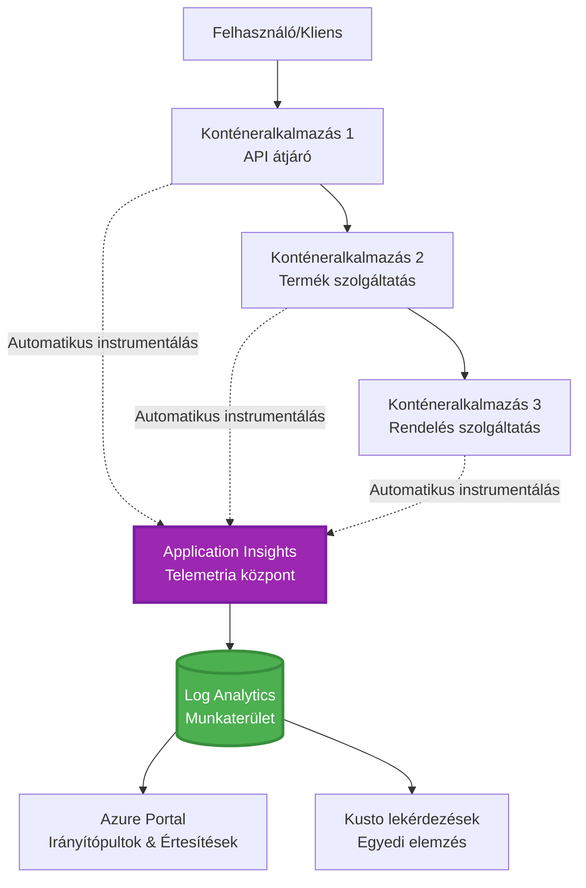
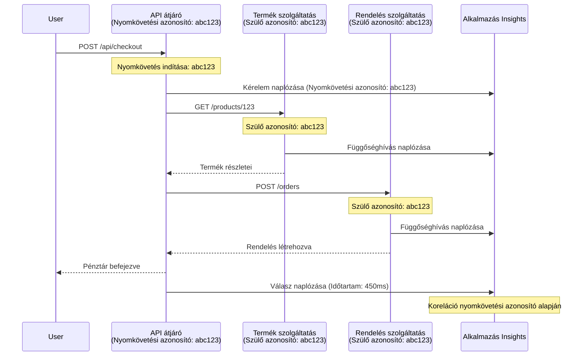

# Application Insights Integration with AZD

⏱️ **Becsült idő**: 40-50 perc | 💰 **Költséghatás**: ~$5-15/hó | ⭐ **Bonyolultság**: Közepes

**📚 Tanulási útvonal:**
- ← Előző: [Előzetes ellenőrzések](preflight-checks.md) - Előtelepítési ellenőrzés
- 🎯 **Itt vagy**: Application Insights integráció (Monitorozás, telemetria, hibakeresés)
- → Következő: [Telepítési útmutató](../chapter-04-infrastructure/deployment-guide.md) - Telepítés Azure-ra
- 🏠 [Tanfolyam kezdőlapja](../../README.md)

---

## Mit tanulsz meg

A lecke elvégzése után:
- Automatikusan integrálod az **Application Insights**-ot AZD projektekbe
- Konfigurálod az **elosztott követést** mikroszolgáltatásokhoz
- Megvalósítasz **egyedi telemetriát** (mérőszámok, események, függőségek)
- Beállítod az **élő mérőszámokat** valós idejű monitorozáshoz
- Létrehozol **riasztásokat és irányítópultokat** AZD telepítésekből
- Hibakeresed az éles problémákat **telemetria lekérdezésekkel**
- Optimalizálod a **költségeket és mintavételt**
- Monitorozod az **AI/LLM alkalmazásokat** (tokenek, késleltetés, költségek)

## Miért fontos az Application Insights az AZD-vel

### A kihívás: éles környezet megfigyelhetősége

**Application Insights nélkül:**
```
❌ No visibility into production behavior
❌ Manual log aggregation across services
❌ Reactive debugging (wait for customer complaints)
❌ No performance metrics
❌ Cannot trace requests across services
❌ Unknown failure rates and bottlenecks
```

**Application Insights + AZD használatával:**
```
✅ Automatic telemetry collection
✅ Centralized logs from all services
✅ Proactive issue detection
✅ End-to-end request tracing
✅ Performance metrics and insights
✅ Real-time dashboards
✅ AZD provisions everything automatically
```

**Párhuzam**: Az Application Insights olyan, mint egy „fekete doboz” repülési adatrögzítő + pilótafülke műszerfala az alkalmazásod számára. Valós időben látod, mi történik, és bármely incidens visszajátszható.

---

## Architektúra áttekintés

### Application Insights az AZD architektúrában


### Mi kerül automatikusan megfigyelésre

| Telemetria típusa | Mit rögzít | Használati eset |
|------------------|------------|-----------------|
| **Kérések** | HTTP-kérések, státuszkódok, időtartam | API teljesítmény monitorozása |
| **Függőségek** | Külső hívások (adatbázis, API-k, tárhely) | Szűk keresztmetszetek azonosítása |
| **Kivételkezelés** | Kezelés nélküli hibák veremnyomokkal | Hibák hibakeresése |
| **Egyedi események** | Üzleti események (regisztráció, vásárlás) | Analitika és tölcsérek |
| **Mérőszámok** | Teljesítményszámlálók, egyedi mérőszámok | Kapacitástervezés |
| **Trace-ek** | Naplóüzenetek súlyossággal | Hibakeresés és audit |
| **Elérhetőség** | Üzemidő és válaszidő tesztek | SLA monitorozás |

---

## Előfeltételek

### Szükséges eszközök

```bash
# Ellenőrizze az Azure Developer CLI-t
azd version
# ✅ Elvárt: azd verzió 1.0.0 vagy újabb

# Ellenőrizze az Azure CLI-t
az --version
# ✅ Elvárt: azure-cli 2.50.0 vagy újabb
```

### Azure követelmények

- Aktív Azure-előfizetés
- Jogosultságok a következők létrehozásához:
  - Application Insights erőforrások
  - Log Analytics munkaterületek
  - Container Apps
  - Erőforráscsoportok

### Szükséges előzetes ismeretek

El kell végezned:
- [AZD alapok](../chapter-01-foundation/azd-basics.md) - AZD alapfogalmak
- [Konfiguráció](../chapter-03-configuration/configuration.md) - Környezet beállítása
- [Első projekt](../chapter-01-foundation/first-project.md) - Alap telepítés

---

## 1. lecke: Application Insights automatikus integrálása AZD-vel

### Hogyan biztosítja az AZD az Application Insights-et

Az AZD automatikusan létrehozza és konfigurálja az Application Insights-et a telepítéskor. Nézzük meg, hogyan működik.

### Projekt szerkezet

```
monitored-app/
├── azure.yaml                     # AZD configuration
├── infra/
│   ├── main.bicep                # Main infrastructure
│   ├── core/
│   │   └── monitoring.bicep      # Application Insights + Log Analytics
│   └── app/
│       └── api.bicep             # Container App with monitoring
└── src/
    ├── app.py                    # Application with telemetry
    ├── requirements.txt
    └── Dockerfile
```

---

### 1. lépés: AZD konfigurálása (azure.yaml)

**Fájl: `azure.yaml`**

```yaml
name: monitored-app
metadata:
  template: monitored-app@1.0.0

services:
  api:
    project: ./src
    language: python
    host: containerapp

# AZD automatically provisions monitoring!
```

**Ennyi!** Az AZD alapértelmezés szerint létrehozza az Application Insights-et. Alapvető monitorozáshoz nincs szükség további beállításra.

---

### 2. lépés: Monitorozási infrastruktúra (Bicep)

**Fájl: `infra/core/monitoring.bicep`**

```bicep
param logAnalyticsName string
param applicationInsightsName string
param location string = resourceGroup().location
param tags object = {}

// Log Analytics Workspace (required for Application Insights)
resource logAnalytics 'Microsoft.OperationalInsights/workspaces@2022-10-01' = {
  name: logAnalyticsName
  location: location
  tags: tags
  properties: {
    sku: {
      name: 'PerGB2018'  // Pay-as-you-go pricing
    }
    retentionInDays: 30  // Keep logs for 30 days
    features: {
      enableLogAccessUsingOnlyResourcePermissions: true
    }
  }
}

// Application Insights
resource applicationInsights 'Microsoft.Insights/components@2020-02-02' = {
  name: applicationInsightsName
  location: location
  tags: tags
  kind: 'web'
  properties: {
    Application_Type: 'web'
    WorkspaceResourceId: logAnalytics.id
    IngestionMode: 'LogAnalytics'
    publicNetworkAccessForIngestion: 'Enabled'
    publicNetworkAccessForQuery: 'Enabled'
  }
}

// Outputs for Container Apps
output logAnalyticsWorkspaceId string = logAnalytics.id
output logAnalyticsWorkspaceName string = logAnalytics.name
output applicationInsightsConnectionString string = applicationInsights.properties.ConnectionString
output applicationInsightsInstrumentationKey string = applicationInsights.properties.InstrumentationKey
output applicationInsightsName string = applicationInsights.name
```

---

### 3. lépés: Container App csatlakoztatása az Application Insights-hez

**Fájl: `infra/app/api.bicep`**

```bicep
param name string
param location string
param tags object = {}
param containerAppsEnvironmentName string
param applicationInsightsConnectionString string

resource containerApp 'Microsoft.App/containerApps@2023-05-01' = {
  name: name
  location: location
  tags: tags
  properties: {
    configuration: {
      ingress: {
        external: true
        targetPort: 8000
      }
      secrets: [
        {
          name: 'appinsights-connection-string'
          value: applicationInsightsConnectionString
        }
      ]
    }
    template: {
      containers: [
        {
          name: 'api'
          image: 'myregistry.azurecr.io/api:latest'
          resources: {
            cpu: json('0.5')
            memory: '1Gi'
          }
          env: [
            {
              name: 'APPLICATIONINSIGHTS_CONNECTION_STRING'
              secretRef: 'appinsights-connection-string'
            }
            {
              name: 'APPLICATIONINSIGHTS_ENABLED'
              value: 'true'
            }
          ]
        }
      ]
    }
  }
}

output uri string = 'https://${containerApp.properties.configuration.ingress.fqdn}'
```

---

### 4. lépés: Alkalmazáskód telemetriával

**Fájl: `src/app.py`**

```python
from flask import Flask, request, jsonify
from opencensus.ext.azure.log_exporter import AzureLogHandler
from opencensus.ext.azure.trace_exporter import AzureExporter
from opencensus.ext.flask.flask_middleware import FlaskMiddleware
from opencensus.trace.samplers import ProbabilitySampler
import logging
import os

app = Flask(__name__)

# Application Insights kapcsolati karakterlánc lekérése
connection_string = os.environ.get('APPLICATIONINSIGHTS_CONNECTION_STRING')

if connection_string:
    # Elosztott nyomon követés konfigurálása
    middleware = FlaskMiddleware(
        app,
        exporter=AzureExporter(connection_string=connection_string),
        sampler=ProbabilitySampler(rate=1.0)  # Fejlesztéshez 100%-os mintavételezés
    )
    
    # Naplózás konfigurálása
    logger = logging.getLogger(__name__)
    logger.addHandler(AzureLogHandler(connection_string=connection_string))
    logger.setLevel(logging.INFO)
    
    print("✅ Application Insights enabled")
else:
    logger = logging.getLogger(__name__)
    logger.setLevel(logging.INFO)
    print("⚠️ Application Insights not configured")

@app.route('/health')
def health():
    logger.info('Health check endpoint called')
    return jsonify({'status': 'healthy', 'monitoring': 'enabled'})

@app.route('/api/products')
def get_products():
    logger.info('Fetching products')
    
    # Adatbázis-hívás szimulálása (automatikusan függőségként követve)
    products = [
        {'id': 1, 'name': 'Laptop', 'price': 999.99},
        {'id': 2, 'name': 'Mouse', 'price': 29.99},
        {'id': 3, 'name': 'Keyboard', 'price': 79.99}
    ]
    
    logger.info(f'Returned {len(products)} products')
    return jsonify(products)

@app.route('/api/error-test')
def error_test():
    """Test error tracking"""
    logger.error('Testing error tracking')
    try:
        raise ValueError('This is a test exception')
    except Exception as e:
        logger.exception('Exception occurred in error-test endpoint')
        return jsonify({'error': str(e)}), 500

@app.route('/api/slow')
def slow_endpoint():
    """Test performance tracking"""
    import time
    logger.info('Slow endpoint called')
    time.sleep(3)  # Lassú művelet szimulálása
    logger.warning('Endpoint took 3 seconds to respond')
    return jsonify({'message': 'Slow operation completed'})

if __name__ == '__main__':
    app.run(host='0.0.0.0', port=8000)
```

**Fájl: `src/requirements.txt`**

```txt
Flask==3.0.0
opencensus-ext-azure==1.1.13
opencensus-ext-flask==0.8.1
gunicorn==21.2.0
```

---

### 5. lépés: Telepítés és ellenőrzés

```bash
# AZD inicializálása
azd init

# Telepítés (az Application Insights szolgáltatást automatikusan biztosítja)
azd up

# Az alkalmazás URL-jének lekérése
APP_URL=$(azd env get-values | grep API_URL | cut -d '=' -f2 | tr -d '"')

# Telemetria generálása
curl $APP_URL/health
curl $APP_URL/api/products
curl $APP_URL/api/error-test
curl $APP_URL/api/slow
```

**✅ Várt kimenet:**
```json
{
  "status": "healthy",
  "monitoring": "enabled"
}
```

---

### 6. lépés: Telemetria megtekintése az Azure Portalon

```bash
# Application Insights részleteinek lekérése
azd env get-values | grep APPLICATIONINSIGHTS

# Megnyitás az Azure Portalon
az monitor app-insights component show \
  --app $(azd env get-values | grep APPLICATIONINSIGHTS_NAME | cut -d '=' -f2 | tr -d '"') \
  --resource-group $(azd env get-values | grep AZURE_RESOURCE_GROUP | cut -d '=' -f2 | tr -d '"') \
  --query "appId" -o tsv
```

**Navigálj az Azure Portal → Application Insights → Transaction Search**

Látnod kell:
- ✅ HTTP-kérések státuszkódokkal
- ✅ Kérések időtartama (3+ másodperc a `/api/slow` esetén)
- ✅ Kivétel részletek a `/api/error-test` hívásból
- ✅ Egyedi naplóüzenetek

---

## 2. lecke: Egyedi telemetria és események

### Üzleti események követése

Adjunk hozzá egyedi telemetriát üzletileg kritikus eseményekhez.

**Fájl: `src/telemetry.py`**

```python
from opencensus.ext.azure import metrics_exporter
from opencensus.stats import aggregation as aggregation_module
from opencensus.stats import measure as measure_module
from opencensus.stats import stats as stats_module
from opencensus.stats import view as view_module
from opencensus.tags import tag_map as tag_map_module
from opencensus.ext.azure.log_exporter import AzureLogHandler
from opencensus.ext.azure.trace_exporter import AzureExporter
from opencensus.trace import tracer as tracer_module
import logging
import os

class TelemetryClient:
    """Custom telemetry client for Application Insights"""
    
    def __init__(self, connection_string=None):
        self.connection_string = connection_string or os.environ.get('APPLICATIONINSIGHTS_CONNECTION_STRING')
        
        if not self.connection_string:
            print("⚠️ Application Insights connection string not found")
            return
        
        # Naplózó beállítása
        self.logger = logging.getLogger(__name__)
        self.logger.addHandler(AzureLogHandler(connection_string=self.connection_string))
        self.logger.setLevel(logging.INFO)
        
        # Metrikák exportálójának beállítása
        self.stats = stats_module.stats
        self.view_manager = self.stats.view_manager
        self.stats_recorder = self.stats.stats_recorder
        
        exporter = metrics_exporter.new_metrics_exporter(
            connection_string=self.connection_string
        )
        self.view_manager.register_exporter(exporter)
        
        # Tracer beállítása
        self.tracer = tracer_module.Tracer(
            exporter=AzureExporter(connection_string=self.connection_string)
        )
        
        print("✅ Custom telemetry client initialized")
    
    def track_event(self, event_name: str, properties: dict = None):
        """Track custom business event"""
        properties = properties or {}
        self.logger.info(
            f"CustomEvent: {event_name}",
            extra={
                'custom_dimensions': {
                    'event_name': event_name,
                    **properties
                }
            }
        )
    
    def track_metric(self, metric_name: str, value: float, properties: dict = None):
        """Track custom metric"""
        properties = properties or {}
        self.logger.info(
            f"CustomMetric: {metric_name} = {value}",
            extra={
                'custom_dimensions': {
                    'metric_name': metric_name,
                    'value': value,
                    **properties
                }
            }
        )
    
    def track_dependency(self, name: str, dependency_type: str, duration: float, success: bool):
        """Track external dependency call"""
        with self.tracer.span(name=name) as span:
            span.add_attribute('dependency.type', dependency_type)
            span.add_attribute('duration', duration)
            span.add_attribute('success', success)

# Globális telemetria kliens
telemetry = TelemetryClient()
```

### Alkalmazás frissítése egyedi eseményekkel

**Fájl: `src/app.py` (kibővített)**

```python
from flask import Flask, request, jsonify
from telemetry import telemetry
import time
import random

app = Flask(__name__)

@app.route('/api/purchase', methods=['POST'])
def purchase():
    """Track purchase event with custom telemetry"""
    data = request.json
    product_id = data.get('product_id')
    quantity = data.get('quantity', 1)
    price = data.get('price', 0)
    
    # Üzleti esemény követése
    telemetry.track_event('Purchase', {
        'product_id': product_id,
        'quantity': quantity,
        'total_amount': price * quantity,
        'user_id': request.headers.get('X-User-Id', 'anonymous')
    })
    
    # Bevételmutató követése
    telemetry.track_metric('Revenue', price * quantity, {
        'product_id': product_id,
        'currency': 'USD'
    })
    
    return jsonify({
        'order_id': f'ORD-{random.randint(1000, 9999)}',
        'status': 'confirmed',
        'total': price * quantity
    })

@app.route('/api/search')
def search():
    """Track search queries"""
    query = request.args.get('q', '')
    
    start_time = time.time()
    
    # Keresés szimulálása (valódi adatbázis-lekérdezés lenne)
    results = [{'id': 1, 'name': f'Result for {query}'}]
    
    duration = (time.time() - start_time) * 1000  # Átváltás ms-re
    
    # Keresési esemény követése
    telemetry.track_event('Search', {
        'query': query,
        'results_count': len(results),
        'duration_ms': duration
    })
    
    # Keresési teljesítménymutató követése
    telemetry.track_metric('SearchDuration', duration, {
        'query_length': len(query)
    })
    
    return jsonify({'results': results, 'count': len(results)})

@app.route('/api/external-call')
def external_call():
    """Track external API dependency"""
    import requests
    
    start_time = time.time()
    success = True
    
    try:
        # Külső API-hívás szimulálása
        response = requests.get('https://api.example.com/data', timeout=5)
        result = response.json()
    except Exception as e:
        success = False
        result = {'error': str(e)}
    
    duration = (time.time() - start_time) * 1000
    
    # Függőség követése
    telemetry.track_dependency(
        name='ExternalAPI',
        dependency_type='HTTP',
        duration=duration,
        success=success
    )
    
    return jsonify(result)

if __name__ == '__main__':
    app.run(host='0.0.0.0', port=8000)
```

### Egyedi telemetria tesztelése

```bash
# Vásárlási esemény nyomon követése
curl -X POST $APP_URL/api/purchase \
  -H "Content-Type: application/json" \
  -H "X-User-Id: user123" \
  -d '{"product_id": 1, "quantity": 2, "price": 29.99}'

# Keresési esemény nyomon követése
curl "$APP_URL/api/search?q=laptop"

# Külső függőség nyomon követése
curl $APP_URL/api/external-call
```

**Megtekintés az Azure Portalon:**

Navigálj az Application Insights → Logs részhez, majd futtasd:

```kusto
// View purchase events
traces
| where customDimensions.event_name == "Purchase"
| project 
    timestamp,
    product_id = tostring(customDimensions.product_id),
    total_amount = todouble(customDimensions.total_amount),
    user_id = tostring(customDimensions.user_id)
| order by timestamp desc

// View revenue metrics
traces
| where customDimensions.metric_name == "Revenue"
| summarize TotalRevenue = sum(todouble(customDimensions.value)) by bin(timestamp, 1h)
| render timechart

// View search performance
traces
| where customDimensions.event_name == "Search"
| summarize 
    AvgDuration = avg(todouble(customDimensions.duration_ms)),
    SearchCount = count()
  by bin(timestamp, 5m)
| render timechart
```

---

## 3. lecke: Elosztott követés mikroszolgáltatásokhoz

### Szolgáltatások közötti követés engedélyezése

Mikroszolgáltatások esetén az Application Insights automatikusan korrelálja a kéréseket a szolgáltatások között.

**Fájl: `infra/main.bicep`**

```bicep
targetScope = 'subscription'

param environmentName string
param location string = 'eastus'

var tags = { 'azd-env-name': environmentName }

resource rg 'Microsoft.Resources/resourceGroups@2021-04-01' = {
  name: 'rg-${environmentName}'
  location: location
  tags: tags
}

// Monitoring (shared by all services)
module monitoring './core/monitoring.bicep' = {
  name: 'monitoring'
  scope: rg
  params: {
    logAnalyticsName: 'log-${environmentName}'
    applicationInsightsName: 'appi-${environmentName}'
    location: location
    tags: tags
  }
}

// API Gateway
module apiGateway './app/api-gateway.bicep' = {
  name: 'api-gateway'
  scope: rg
  params: {
    name: 'ca-gateway-${environmentName}'
    location: location
    tags: union(tags, { 'azd-service-name': 'gateway' })
    applicationInsightsConnectionString: monitoring.outputs.applicationInsightsConnectionString
  }
}

// Product Service
module productService './app/product-service.bicep' = {
  name: 'product-service'
  scope: rg
  params: {
    name: 'ca-products-${environmentName}'
    location: location
    tags: union(tags, { 'azd-service-name': 'products' })
    applicationInsightsConnectionString: monitoring.outputs.applicationInsightsConnectionString
  }
}

// Order Service
module orderService './app/order-service.bicep' = {
  name: 'order-service'
  scope: rg
  params: {
    name: 'ca-orders-${environmentName}'
    location: location
    tags: union(tags, { 'azd-service-name': 'orders' })
    applicationInsightsConnectionString: monitoring.outputs.applicationInsightsConnectionString
  }
}

output APPLICATIONINSIGHTS_CONNECTION_STRING string = monitoring.outputs.applicationInsightsConnectionString
output GATEWAY_URL string = apiGateway.outputs.uri
```

### Vége a tranzakció nyomon követése


**End-to-end trace lekérdezése:**

```kusto
// Find complete request flow
let traceId = "abc123...";  // Get from response header
dependencies
| union requests
| where operation_Id == traceId
| project 
    timestamp,
    type = itemType,
    name,
    duration,
    success,
    cloud_RoleName
| order by timestamp asc
```

---

## 4. lecke: Élő mérőszámok és valós idejű monitorozás

### Élő mérőszám adatfolyam engedélyezése

Az Élő mérőszámok valós idejű telemetriát biztosítanak <1 másodperces késleltetéssel.

**Élő mérőszámok elérése:**

```bash
# Application Insights erőforrás lekérése
APPI_NAME=$(azd env get-values | grep APPLICATIONINSIGHTS_NAME | cut -d '=' -f2 | tr -d '"')

# Erőforráscsoport lekérése
RG_NAME=$(azd env get-values | grep AZURE_RESOURCE_GROUP | cut -d '=' -f2 | tr -d '"')

echo "Navigate to: Azure Portal → Resource Groups → $RG_NAME → $APPI_NAME → Live Metrics"
```

**Amit valós időben látsz:**
- ✅ Bejövő kérés arány (kérések/mp)
- ✅ Kimenő függőség hívások
- ✅ Kivétel darabszám
- ✅ CPU és memória használat
- ✅ Aktív szerverek száma
- ✅ Mintavételi telemetria

### Terhelés generálása teszteléshez

```bash
# Generálj terhelést az élő metrikák megtekintéséhez
for i in {1..100}; do
  curl $APP_URL/api/products &
  curl $APP_URL/api/search?q=test$i &
done

# Figyeld az élő metrikákat az Azure Portalon
# Látnod kell, hogy a kérések száma hirtelen megugrik
```

---

## Gyakorlati feladatok

### Feladat 1: Riasztások beállítása ⭐⭐ (Közepes)

**Cél**: Riasztások létrehozása magas hibaarány és lassú válaszok esetére.

**Lépések:**

1. **Riasztás létrehozása hibaarányra:**

```bash
# Application Insights erőforrásazonosítójának lekérése
APPI_ID=$(az monitor app-insights component show \
  --app $APPI_NAME \
  --resource-group $RG_NAME \
  --query "id" -o tsv)

# Metrika-riasztás létrehozása a sikertelen kérésekhez
az monitor metrics alert create \
  --name "High-Error-Rate" \
  --resource-group $RG_NAME \
  --scopes $APPI_ID \
  --condition "count requests/failed > 10" \
  --window-size 5m \
  --evaluation-frequency 1m \
  --description "Alert when error rate exceeds 10 per 5 minutes"
```

2. **Riasztás létrehozása lassú válaszokra:**

```bash
az monitor metrics alert create \
  --name "Slow-Responses" \
  --resource-group $RG_NAME \
  --scopes $APPI_ID \
  --condition "avg requests/duration > 3000" \
  --window-size 5m \
  --evaluation-frequency 1m \
  --description "Alert when average response time exceeds 3 seconds"
```

3. **Riasztás létrehozása Bicep-ben (ajánlott AZD-hez):**

**Fájl: `infra/core/alerts.bicep`**

```bicep
param applicationInsightsId string
param actionGroupId string = ''
param location string = resourceGroup().location

// High error rate alert
resource errorRateAlert 'Microsoft.Insights/metricAlerts@2018-03-01' = {
  name: 'high-error-rate'
  location: 'global'
  properties: {
    description: 'Alert when error rate exceeds threshold'
    severity: 2
    enabled: true
    scopes: [
      applicationInsightsId
    ]
    evaluationFrequency: 'PT1M'
    windowSize: 'PT5M'
    criteria: {
      'odata.type': 'Microsoft.Azure.Monitor.SingleResourceMultipleMetricCriteria'
      allOf: [
        {
          name: 'Error rate'
          metricName: 'requests/failed'
          operator: 'GreaterThan'
          threshold: 10
          timeAggregation: 'Count'
        }
      ]
    }
    actions: actionGroupId != '' ? [
      {
        actionGroupId: actionGroupId
      }
    ] : []
  }
}

// Slow response alert
resource slowResponseAlert 'Microsoft.Insights/metricAlerts@2018-03-01' = {
  name: 'slow-responses'
  location: 'global'
  properties: {
    description: 'Alert when response time is too high'
    severity: 3
    enabled: true
    scopes: [
      applicationInsightsId
    ]
    evaluationFrequency: 'PT1M'
    windowSize: 'PT5M'
    criteria: {
      'odata.type': 'Microsoft.Azure.Monitor.SingleResourceMultipleMetricCriteria'
      allOf: [
        {
          name: 'Response duration'
          metricName: 'requests/duration'
          operator: 'GreaterThan'
          threshold: 3000
          timeAggregation: 'Average'
        }
      ]
    }
  }
}

output errorAlertId string = errorRateAlert.id
output slowResponseAlertId string = slowResponseAlert.id
```

4. **Riasztások tesztelése:**

```bash
# Hibák generálása
for i in {1..20}; do
  curl $APP_URL/api/error-test
done

# Lassú válaszok generálása
for i in {1..10}; do
  curl $APP_URL/api/slow
done

# Riasztás állapotának ellenőrzése (várjon 5-10 percet)
az monitor metrics alert list \
  --resource-group $RG_NAME \
  --query "[].{Name:name, Enabled:enabled, State:properties.enabled}" \
  --output table
```

**✅ Sikerkritériumok:**
- ✅ Riasztások sikeresen létrehozva
- ✅ Riasztások kiváltódnak, ha a küszöbértékek átlépődnek
- ✅ Megtekinthető a riasztási előzmény az Azure Portalon
- ✅ Integrálva AZD telepítéssel

**Idő**: 20-25 perc

---

### Feladat 2: Egyedi irányítópult létrehozása ⭐⭐ (Közepes)

**Cél**: Irányítópult készítése, ami mutatja az alkalmazás kulcsfontosságú mérőszámait.

**Lépések:**

1. **Irányítópult létrehozása az Azure Portalon:**

Navigálj ide: Azure Portal → Dashboards → New Dashboard

2. **Mozaikok hozzáadása a kulcsfontosságú mérőszámokhoz:**

- Kérések száma (utolsó 24 óra)
- Átlagos válaszidő
- Hibaarány
- Top 5 leglassabb művelet
- Felhasználók földrajzi eloszlása

3. **Irányítópult létrehozása Bicep-ben:**

**Fájl: `infra/core/dashboard.bicep`**

```bicep
param dashboardName string
param applicationInsightsId string
param location string = resourceGroup().location

resource dashboard 'Microsoft.Portal/dashboards@2020-09-01-preview' = {
  name: dashboardName
  location: location
  properties: {
    lenses: [
      {
        order: 0
        parts: [
          // Request count
          {
            position: { x: 0, y: 0, rowSpan: 4, colSpan: 6 }
            metadata: {
              type: 'Extension/Microsoft_OperationsManagementSuite_Workspace/PartType/LogsDashboardPart'
              inputs: [
                {
                  name: 'resourceId'
                  value: applicationInsightsId
                }
                {
                  name: 'query'
                  value: '''
                    requests
                    | summarize RequestCount = count() by bin(timestamp, 1h)
                    | render timechart
                  '''
                }
              ]
            }
          }
          // Error rate
          {
            position: { x: 6, y: 0, rowSpan: 4, colSpan: 6 }
            metadata: {
              type: 'Extension/Microsoft_OperationsManagementSuite_Workspace/PartType/LogsDashboardPart'
              inputs: [
                {
                  name: 'resourceId'
                  value: applicationInsightsId
                }
                {
                  name: 'query'
                  value: '''
                    requests
                    | summarize 
                        Total = count(),
                        Failed = countif(success == false)
                    | extend ErrorRate = (Failed * 100.0) / Total
                    | project ErrorRate
                  '''
                }
              ]
            }
          }
        ]
      }
    ]
  }
}

output dashboardId string = dashboard.id
```

4. **Irányítópult telepítése:**

```bash
# Adja hozzá a main.bicep fájlhoz
module dashboard './core/dashboard.bicep' = {
  name: 'dashboard'
  scope: rg
  params: {
    dashboardName: 'dashboard-${environmentName}'
    applicationInsightsId: monitoring.outputs.applicationInsightsId
    location: location
  }
}

# Telepítés
azd up
```

**✅ Sikerkritériumok:**
- ✅ Az irányítópult megjeleníti a kulcsfontosságú mérőszámokat
- ✅ Rögzíthető az Azure Portal kezdőlapjára
- ✅ Valós időben frissül
- ✅ Telepíthető AZD-vel

**Idő**: 25-30 perc

---

### Feladat 3: AI/LLM alkalmazás monitorozása ⭐⭐⭐ (Haladó)

**Cél**: Azure OpenAI használat követése (tokenek, költségek, késleltetés).

**Lépések:**

1. **AI monitorozó wrapper létrehozása:**

**Fájl: `src/ai_telemetry.py`**

```python
from telemetry import telemetry
from openai import AzureOpenAI
import time

class MonitoredAzureOpenAI:
    """Azure OpenAI client with automatic telemetry"""
    
    def __init__(self, api_key, endpoint, api_version="2024-02-01"):
        self.client = AzureOpenAI(
            api_key=api_key,
            api_version=api_version,
            azure_endpoint=endpoint
        )
    
    def chat_completion(self, model: str, messages: list, **kwargs):
        """Track chat completion with telemetry"""
        start_time = time.time()
        
        try:
            # Azure OpenAI hívása
            response = self.client.chat.completions.create(
                model=model,
                messages=messages,
                **kwargs
            )
            
            duration = (time.time() - start_time) * 1000  # ms
            
            # Használati adatok kinyerése
            usage = response.usage
            prompt_tokens = usage.prompt_tokens
            completion_tokens = usage.completion_tokens
            total_tokens = usage.total_tokens
            
            # Költség kiszámítása (GPT-4 árazása)
            prompt_cost = (prompt_tokens / 1000) * 0.03  # $0.03 1000 tokenenként
            completion_cost = (completion_tokens / 1000) * 0.06  # $0.06 1000 tokenenként
            total_cost = prompt_cost + completion_cost
            
            # Egyéni esemény követése
            telemetry.track_event('OpenAI_Request', {
                'model': model,
                'prompt_tokens': prompt_tokens,
                'completion_tokens': completion_tokens,
                'total_tokens': total_tokens,
                'duration_ms': duration,
                'cost_usd': total_cost,
                'success': True
            })
            
            # Metrikák követése
            telemetry.track_metric('OpenAI_Tokens', total_tokens, {
                'model': model,
                'type': 'total'
            })
            
            telemetry.track_metric('OpenAI_Cost', total_cost, {
                'model': model,
                'currency': 'USD'
            })
            
            telemetry.track_metric('OpenAI_Duration', duration, {
                'model': model
            })
            
            return response
            
        except Exception as e:
            duration = (time.time() - start_time) * 1000
            
            telemetry.track_event('OpenAI_Request', {
                'model': model,
                'duration_ms': duration,
                'success': False,
                'error': str(e)
            })
            
            raise
```

2. **Monitored kliens használata:**

```python
from flask import Flask, request, jsonify
from ai_telemetry import MonitoredAzureOpenAI
import os

app = Flask(__name__)

# Inicializálja a monitorozott OpenAI klienst
openai_client = MonitoredAzureOpenAI(
    api_key=os.environ['AZURE_OPENAI_API_KEY'],
    endpoint=os.environ['AZURE_OPENAI_ENDPOINT']
)

@app.route('/api/chat', methods=['POST'])
def chat():
    data = request.json
    user_message = data.get('message')
    
    # Hívás automatikus monitorozással
    response = openai_client.chat_completion(
        model='gpt-4',
        messages=[
            {'role': 'user', 'content': user_message}
        ]
    )
    
    return jsonify({
        'response': response.choices[0].message.content,
        'tokens': response.usage.total_tokens
    })
```

3. **AI mérőszámok lekérdezése:**

```kusto
// Total AI spend over time
traces
| where customDimensions.event_name == "OpenAI_Request"
| where customDimensions.success == "True"
| summarize TotalCost = sum(todouble(customDimensions.cost_usd)) by bin(timestamp, 1h)
| render timechart

// Token usage by model
traces
| where customDimensions.event_name == "OpenAI_Request"
| summarize 
    TotalTokens = sum(toint(customDimensions.total_tokens)),
    RequestCount = count()
  by Model = tostring(customDimensions.model)

// Average latency
traces
| where customDimensions.event_name == "OpenAI_Request"
| summarize AvgDuration = avg(todouble(customDimensions.duration_ms))
| project AvgDurationSeconds = AvgDuration / 1000

// Cost per request
traces
| where customDimensions.event_name == "OpenAI_Request"
| extend Cost = todouble(customDimensions.cost_usd)
| summarize 
    TotalCost = sum(Cost),
    RequestCount = count(),
    AvgCostPerRequest = avg(Cost)
```

**✅ Sikerkritériumok:**
- ✅ Minden OpenAI hívás automatikusan követve van
- ✅ Tokenhasználat és költségek láthatóak
- ✅ Késleltetés monitorozva
- ✅ Költségkeret riasztások beállíthatók

**Idő**: 35-45 perc

---

## Költségoptimalizálás

### Mintavételi stratégiák

Szabályozd a költségeket a telemetria mintavételezésével:

```python
from opencensus.trace.samplers import ProbabilitySampler

# Fejlesztés: 100% mintavétel
sampler = ProbabilitySampler(rate=1.0)

# Éles környezet: 10% mintavétel (csökkenti a költségeket 90%-kal)
sampler = ProbabilitySampler(rate=0.1)

# Adaptív mintavételezés (automatikusan igazodik)
from opencensus.trace.samplers import AdaptiveSampler
sampler = AdaptiveSampler()
```

**Bicep-ben:**

```bicep
resource applicationInsights 'Microsoft.Insights/components@2020-02-02' = {
  name: applicationInsightsName
  properties: {
    SamplingPercentage: 10  // 10% sampling
  }
}
```

### Adatmegőrzés

```bicep
resource logAnalytics 'Microsoft.OperationalInsights/workspaces@2022-10-01' = {
  name: logAnalyticsName
  properties: {
    retentionInDays: 30  // Minimum (cheapest)
    // Options: 30, 31, 60, 90, 120, 180, 270, 365, 550, 730
  }
}
```

### Havi költségbecslések

| Adatforgalom | Megőrzés | Havi költség |
|-------------|-----------|--------------|
| 1 GB/hó | 30 nap | ~$2-5 |
| 5 GB/hó | 30 nap | ~$10-15 |
| 10 GB/hó | 90 nap | ~$25-40 |
| 50 GB/hó | 90 nap | ~$100-150 |

**Ingyenes csomag**: 5 GB/hó benne foglaltatva

---

## Tudásellenőrzés

### 1. Alap integráció ✓

Ellenőrizd a megértésed:

- [ ] **Q1**: Hogyan biztosítja az AZD az Application Insights-et?
  - **A**: Automatikusan a `infra/core/monitoring.bicep` Bicep sablonok segítségével

- [ ] **Q2**: Mely környezeti változó engedélyezi az Application Insights-ot?
  - **A**: `APPLICATIONINSIGHTS_CONNECTION_STRING`

- [ ] **Q3**: Mik a három fő telemetria típus?
  - **A**: Kérések (HTTP hívások), Függőségek (külső hívások), Kivételkezelés (hibák)

**Gyakorlati ellenőrzés:**
```bash
# Ellenőrizze, hogy az Application Insights konfigurálva van-e
azd env get-values | grep APPLICATIONINSIGHTS

# Ellenőrizze, hogy telemetriaadatok érkeznek
az monitor app-insights metrics show \
  --app $APPI_NAME \
  --resource-group $RG_NAME \
  --metric "requests/count"
```

---

### 2. Egyedi telemetria ✓

Ellenőrizd a megértésed:

- [ ] **Q1**: Hogyan követed az egyedi üzleti eseményeket?
  - **A**: Használj loggert `custom_dimensions`-szel vagy `TelemetryClient.track_event()`-et

- [ ] **Q2**: Mi a különbség események és mérőszámok között?
  - **A**: Az események diszkrét események, a mérőszámok numerikus mérések

- [ ] **Q3**: Hogyan korrelálod a telemetriát a szolgáltatások között?
  - **A**: Az Application Insights automatikusan használja az `operation_Id`-t a korrelációhoz

**Gyakorlati ellenőrzés:**
```kusto
// Verify custom events
traces
| where customDimensions.event_name != ""
| summarize count() by tostring(customDimensions.event_name)
```

---

### 3. Éles monitorozás ✓

Ellenőrizd a megértésed:

- [ ] **Q1**: Mi a mintavétel és miért érdemes használni?
  - **A**: A mintavétel csökkenti az adatmennyiséget (és így a költséget) azzal, hogy csak a telemetria egy százalékát rögzíti

- [ ] **Q2**: Hogyan állítasz be riasztásokat?
  - **A**: Használj metrika riasztásokat Bicep-ben vagy az Azure Portalon az Application Insights mérőszámai alapján

- [ ] **Q3**: Mi a különbség a Log Analytics és az Application Insights között?
  - **A**: Az Application Insights az adatokat egy Log Analytics munkaterületen tárolja; az App Insights alkalmazás-specifikus nézeteket nyújt

**Gyakorlati ellenőrzés:**
```bash
# Ellenőrizze a mintavételi konfigurációt
az monitor app-insights component show \
  --app $APPI_NAME \
  --resource-group $RG_NAME \
  --query "properties.SamplingPercentage"
```

---

## Legjobb gyakorlatok

### ✅ TEENDŐK:

1. **Használj korrelációs azonosítókat**
   ```python
   logger.info('Processing order', extra={
       'custom_dimensions': {
           'order_id': order_id,
           'user_id': user_id
       }
   })
   ```

2. **Állíts be riasztásokat kritikus mérőszámokra**
   ```bicep
   // Error rate, slow responses, availability
   ```

3. **Használj strukturált naplózást**
   ```python
   # ✅ JÓ: Strukturált
   logger.info('User signup', extra={'custom_dimensions': {'user_id': 123}})
   
   # ❌ ROSSZ: Nem strukturált
   logger.info(f'User 123 signed up')
   ```

4. **Monitorozd a függőségeket**
   ```python
   # Automatikusan nyomon követi az adatbázis-hívásokat, a HTTP-kéréseket stb.
   ```

5. **Használd az Élő mérőszámokat a telepítések során**

### ❌ NE:

1. **Ne naplózz érzékeny adatokat**
   ```python
   # ❌ ROSSZ
   logger.info(f'Login: {username}:{password}')
   
   # ✅ JÓ
   logger.info('Login attempt', extra={'custom_dimensions': {'username': username}})
   ```

2. **Ne használd a 100% mintavételt éles környezetben**
   ```python
   # ❌ Drága
   sampler = ProbabilitySampler(rate=1.0)
   
   # ✅ Költséghatékony
   sampler = ProbabilitySampler(rate=0.1)
   ```

3. **Ne hagyd figyelmen kívül a dead letter queue-kat**

4. **Ne felejtsd el beállítani az adatmegőrzési korlátokat**

---

## Hibaelhárítás

### Probléma: Nem jelenik meg telemetria

**Diagnózis:**
```bash
# Ellenőrizze, hogy a kapcsolati karakterlánc be van-e állítva
azd env get-values | grep APPLICATIONINSIGHTS

# Ellenőrizze az alkalmazás naplóit az Azure Monitor segítségével
azd monitor --logs

# Vagy használja az Azure CLI-t a Container Appshez:
az containerapp logs show --name $APP_NAME --resource-group $RG_NAME --tail 50
```

**Megoldás:**
```bash
# Ellenőrizze a csatlakozási karakterláncot a konténeralkalmazásban
az containerapp show \
  --name $APP_NAME \
  --resource-group $RG_NAME \
  --query "properties.template.containers[0].env" \
  | grep -i applicationinsights
```

---

### Probléma: Magas költségek

**Diagnózis:**
```bash
# Ellenőrizze az adatok bevitelét
az monitor app-insights metrics show \
  --app $APPI_NAME \
  --resource-group $RG_NAME \
  --metric "availabilityResults/count"
```

**Megoldás:**
- Csökkentsd a mintavételi arányt
- Csökkentsd az adatmegőrzési időt
- Távolítsd el a részletes naplózást

---

## Tudj meg többet

### Hivatalos dokumentáció
- [Application Insights áttekintése](https://learn.microsoft.com/azure/azure-monitor/app/app-insights-overview)
- [Application Insights Pythonhoz](https://learn.microsoft.com/azure/azure-monitor/app/opencensus-python)
- [Kusto lekérdező nyelv](https://learn.microsoft.com/azure/data-explorer/kusto/query/)
- [AZD monitorozás](https://learn.microsoft.com/azure/developer/azure-developer-cli/monitor-your-app)

### Következő lépések a tanfolyamban
- ← Előző: [Előzetes ellenőrzések](preflight-checks.md)
- → Következő: [Telepítési útmutató](../chapter-04-infrastructure/deployment-guide.md)
- 🏠 [Tanfolyam kezdőlapja](../../README.md)

### Kapcsolódó példák
- [Azure OpenAI példa](../../../../examples/azure-openai-chat) - AI telemetria
- [Mikroszolgáltatások példa](../../../../examples/microservices) - Elosztott követés

---

## Összegzés

**Amit megtanultál:**
- ✅ Application Insights automatikus biztosítása AZD-vel
- ✅ Egyedi telemetria (események, mérőszámok, függőségek)
- ✅ Elosztott követés mikroszolgáltatások között
- ✅ Élő metrikák és valós idejű monitorozás
- ✅ Riasztások és irányítópultok
- ✅ AI/LLM alkalmazások monitorozása
- ✅ Költségoptimalizálási stratégiák

**Főbb tanulságok:**
1. **AZD automatikusan biztosítja a monitorozást** - Nincs szükség kézi beállításra
2. **Használj strukturált naplózást** - Megkönnyíti a lekérdezéseket
3. **Kövesd az üzleti eseményeket** - Ne csak technikai metrikákat
4. **Kövesd nyomon az AI költségeit** - Kövesd a tokenhasználatot és a kiadásokat
5. **Állíts be riasztásokat** - Legyél proaktív, ne reaktív
6. **Optimalizáld a költségeket** - Használj mintavételezést és megőrzési korlátokat

**Következő lépések:**
1. Fejezd be a gyakorlati feladatokat
2. Add hozzá az Application Insights-et az AZD projektjeidhez
3. Hozz létre egyedi irányítópultokat a csapatod számára
4. Tanulmányozd a [Telepítési útmutatót](../chapter-04-infrastructure/deployment-guide.md)

---

<!-- CO-OP TRANSLATOR DISCLAIMER START -->
Felelősségkizárás:
Ez a dokumentum az AI fordítási szolgáltatás, a Co-op Translator (https://github.com/Azure/co-op-translator) segítségével készült. Bár igyekszünk pontos fordítást nyújtani, kérjük, vegye figyelembe, hogy az automatikus fordítások hibákat vagy pontatlanságokat tartalmazhatnak. Az eredeti dokumentum az anyanyelvén tekintendő irányadó forrásnak. Kritikus jelentőségű információk esetén szakmai, emberi fordítást javaslunk. Nem vállalunk felelősséget az ebből a fordításból eredő félreértésekért vagy téves értelmezésekért.
<!-- CO-OP TRANSLATOR DISCLAIMER END -->