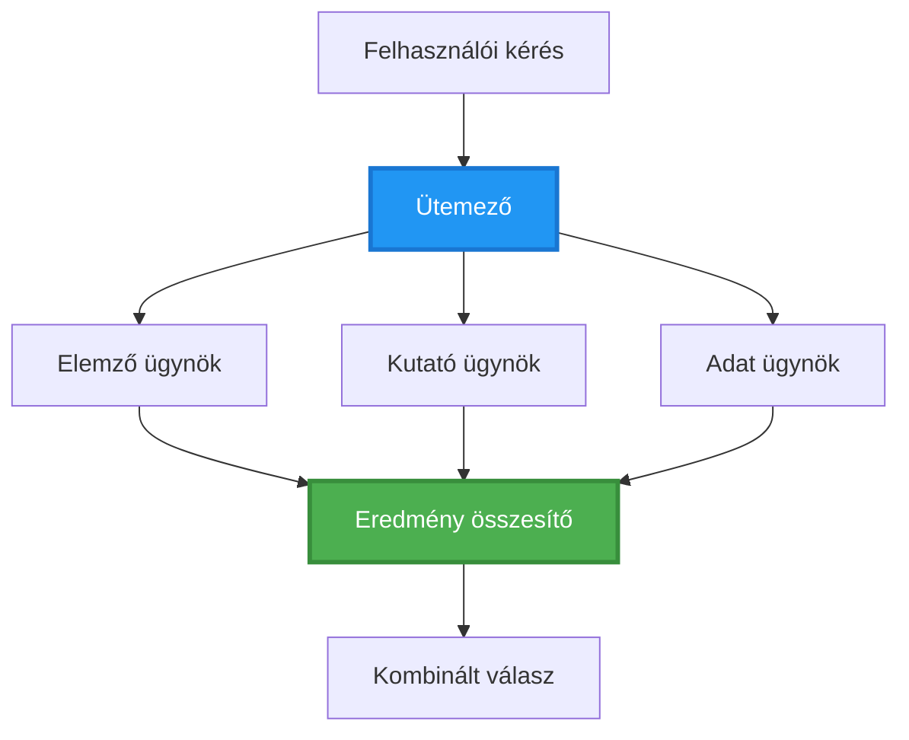
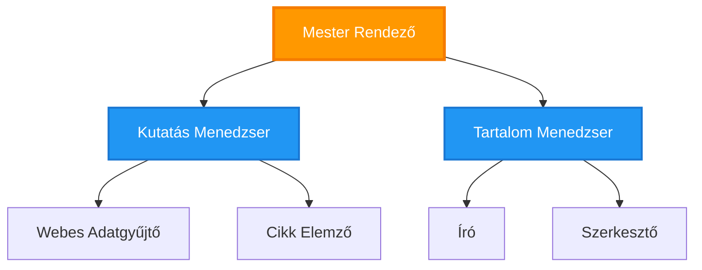
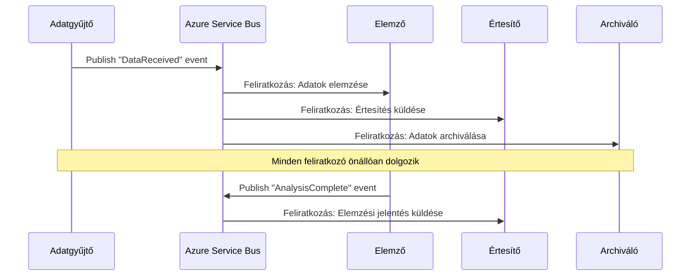
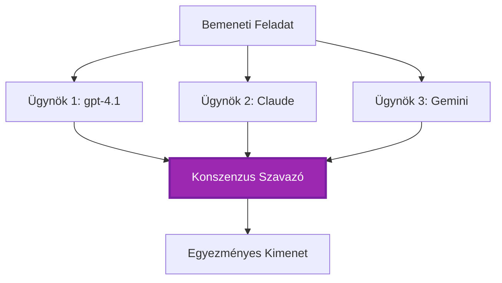
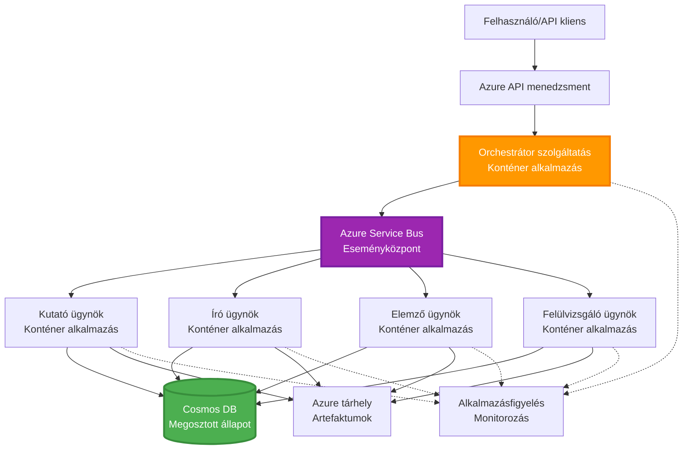

# Többügynökös Koordinációs Minták

⏱️ **Becsült idő**: 60-75 perc | 💰 **Becsült költség**: ~100-300 USD/hónap | ⭐ **Bonyolultság**: Haladó

**📚 Tanulási útvonal:**
- ← Előző: [Kapacitástervezés](capacity-planning.md) - Erőforrás méretezési és skálázási stratégiák
- 🎯 **Jelenleg itt vagy**: Többügynökös koordinációs minták (Orkesztráció, kommunikáció, állapotkezelés)
- → Következő: [SKU kiválasztás](sku-selection.md) - A megfelelő Azure szolgáltatások kiválasztása
- 🏠 [Tanfolyam kezdőlap](../../README.md)

---

## Amit megtanulsz

A lecke elvégzése után képes leszel:
- Megérteni a **többügynökös architektúra** mintáit és azok alkalmazási helyzetét
- Megvalósítani **orkesztrációs mintákat** (központi, decentralizált, hierarchikus)
- Tervezni **ügynöki kommunikációs** stratégiákat (szinkron, aszinkron, eseményvezérelt)
- Kezelni a **megosztott állapotot** elosztott ügynökök között
- Telepíteni **többügynökös rendszereket** Azure-ra AZD-vel
- Alkalmazni **koordinációs mintákat** valós AI forgatókönyvekhez
- Monitorozni és hibakeresni elosztott ügynökrendszereket

## Miért fontos a Többügynökös Koordináció

### Fejlődés: Egyetlen ügynöktől többügynökös rendszerig

**Egyetlen Ügynök (Egyszerű):**  
```
User → Agent → Response
```
- ✅ Könnyen érthető és megvalósítható  
- ✅ Gyors egyszerű feladatokra  
- ❌ Egy modell képességei korlátozzák  
- ❌ Nem képes párhuzamosítani összetett feladatokat  
- ❌ Nincs specializáció  

**Többügynökös Rendszer (Haladó):**  
```mermaid
graph TD
    Orchestrator[Orchestrátor] --> Agent1[Agent1<br/>Terv]
    Orchestrator --> Agent2[Agent2<br/>Kód]
    Orchestrator --> Agent3[Agent3<br/>Áttekintés]
```- ✅ Speciális ügynökök adott feladatokra  
- ✅ Párhuzamos végrehajtás gyorsaságért  
- ✅ Moduláris és karbantartható  
- ✅ Jobb összetett munkafolyamatoknál  
- ⚠️ Koordinációs logikát igényel  

**Analógia**: Az egyetlen ügynök olyan, mint egy ember, aki minden feladatot elvégez. A többügynökös rendszer olyan, mint egy csapat, ahol minden tag specializált (kutató, fejlesztő, ellenőr, író), és együtt dolgoznak.

---

## Alapvető Koordinációs Minták

### Minta 1: Szekvenciális Koordináció (Felelősség Lánca)

**Mikor használd**: A feladatokat meghatározott sorrendben kell végrehajtani, minden ügynök az előző kimenetére épít.

```mermaid
sequenceDiagram
    participant User
    participant Orchestrator
    participant Agent1 as Kutató ügynök
    participant Agent2 as Író ügynök
    participant Agent3 as Szerkesztő ügynök
    
    User->>Orchestrator: "Írj cikket az AI-ról"
    Orchestrator->>Agent1: Kutatási téma
    Agent1-->>Orchestrator: Kutatási eredmények
    Orchestrator->>Agent2: Írd meg a vázlatot (a kutatás alapján)
    Agent2-->>Orchestrator: Cikk tervezet
    Orchestrator->>Agent3: Szerkesztés és javítás
    Agent3-->>Orchestrator: Végleges cikk
    Orchestrator-->>User: Csiszolt cikk
    
    Note over User,Agent3: Sorrend: Minden lépés a korábbira vár
```  
**Előnyök:**  
- ✅ Egyértelmű adatfolyam  
- ✅ Könnyen hibakereshető  
- ✅ Megjósolható végrehajtási rend  

**Korlátok:**  
- ❌ Lassabb (nincs párhuzamosság)  
- ❌ Egy hiba leállíthatja az egész láncot  
- ❌ Nem kezeli az egymásra utalt feladatokat  

**Példák:**  
- Tartalomkészítési folyamat (kutatás → írás → szerkesztés → publikálás)  
- Kódgenerálás (terv → implementáció → teszt → telepítés)  
- Jelentéskészítés (adatgyűjtés → elemzés → vizualizáció → összegzés)  

---

### Minta 2: Párhuzamos Koordináció (Fan-Out/Fan-In)

**Mikor használd**: Független feladatok párhuzamosan futtathatók, eredmények a végén összegezve.


**Előnyök:**  
- ✅ Gyors (párhuzamos végrehajtás)  
- ✅ Hibabiztos (részleges eredmények elfogadhatók)  
- ✅ Vízszintesen skálázható  

**Korlátok:**  
- ⚠️ Az eredmények sorrendje lehet akadozó  
- ⚠️ Összegző logikára van szükség  
- ⚠️ Összetett állapot kezelés  

**Példák:**  
- Több forrásból érkező adatgyűjtés (API-k + adatbázisok + webszkrappolás)  
- Versenyképes elemzés (több modell megoldást generál, a legjobb kiválasztása)  
- Fordító szolgáltatások (egyszerre több nyelvre fordítás)  

---

### Minta 3: Hierarchikus Koordináció (Menedszer-Munkás)

**Mikor használd**: Összetett munkafolyamatok alfeladatokkal, delegálás szükséges.


**Előnyök:**  
- ✅ Kezeli az összetett munkafolyamatokat  
- ✅ Moduláris és karbantartható  
- ✅ Egyértelmű felelősségi körök  

**Korlátok:**  
- ⚠️ Bonyolultabb architektúra  
- ⚠️ Magasabb késleltetés (több koordinációs réteg)  
- ⚠️ Lényeges összetett orkestráció  

**Példák:**  
- Vállalati dokumentumkezelés (osztályozás → útvonal → feldolgozás → archiválás)  
- Többfázisú adatcsővezetékek (befogadás → tisztítás → transzformáció → elemzés → jelentés)  
- Összetett automatizálási folyamatok (tervezés → erőforrás-kiosztás → végrehajtás → monitorozás)  

---

### Minta 4: Eseményvezérelt Koordináció (Publish-Subscribe)

**Mikor használd**: Ügynököknek reagálniuk kell eseményekre, laza kapcsolódás kívánatos.


**Előnyök:**  
- ✅ Laza kapcsolódás az ügynökök között  
- ✅ Egyszerű új ügynökök hozzáadása (csak feliratkozni kell)  
- ✅ Aszinkron feldolgozás  
- ✅ Ellenálló (üzenetmegőrzés)  

**Korlátok:**  
- ⚠️ Idővel konzisztens állapot  
- ⚠️ Nehéz hibakeresés  
- ⚠️ Üzenetrendezési kihívások  

**Példák:**  
- Valós idejű monitorozó rendszerek (riasztások, műszerfalak, naplók)  
- Többcsatornás értesítések (email, SMS, push, Slack)  
- Adatfeldolgozó csővezetékek (több fogyasztó ugyanazon adatból)  

---

### Minta 5: Konszenzus-alapú Koordináció (Szavazás/Kvórum)

**Mikor használd**: Több ügynöktől kell egyetértés a továbblépéshez.


**Előnyök:**  
- ✅ Magasabb pontosság (több vélemény)  
- ✅ Hibabiztos (a kisebbségi hibák elfogadhatók)  
- ✅ Beépített minőségbiztosítás  

**Korlátok:**  
- ❌ Drága (több modell hívás)  
- ❌ Lassabb (minden ügynök megvárása)  
- ⚠️ Konfliktuskezelés szükséges  

**Példák:**  
- Tartalom moderálás (több modell véleményezi a tartalmat)  
- Kódellenőrzés (több elemző/analizáló)  
- Orvosi diagnózis (több AI modell, szakértői validáció)  

---

## Architektúra Áttekintés

### Teljes Többügynökös Rendszer Azure-on


**Fő komponensek:**

| Komponens | Cél | Azure Szolgáltatás |
|-----------|-----|--------------------|
| **API Gateway** | Belépési pont, sebességkorlátozás, hitelesítés | API Management |
| **Orkesztrátor** | Ügynöki munkafolyamatok koordinálása | Container Apps |
| **Üzenetsor** | Aszinkron kommunikáció | Service Bus / Event Hubs |
| **Ügynökök** | Specializált AI munkavégzők | Container Apps / Functions |
| **Állapottároló** | Megosztott állapot, feladatkövetés | Cosmos DB |
| **Melléklet Tároló** | Dokumentumok, eredmények, naplók | Blob Storage |
| **Monitorozás** | Elosztott követés, naplók | Application Insights |

---

## Előfeltételek

### Szükséges Eszközök

```bash
# Ellenőrizze az Azure Developer CLI-t
azd version
# ✅ Várt: azd verzió 1.0.0 vagy újabb

# Ellenőrizze az Azure CLI-t
az --version
# ✅ Várt: azure-cli 2.50.0 vagy újabb

# Ellenőrizze a Dockert (helyi teszteléshez)
docker --version
# ✅ Várt: Docker verzió 20.10 vagy újabb
```
  
### Azure Követelmények

- Aktív Azure előfizetés  
- Jogosultságok a következők létrehozásához:  
  - Container Apps  
  - Service Bus névterek  
  - Cosmos DB fiókok  
  - Tárolófiókok  
  - Application Insights  

### Tudás Előfeltételek

El kell végezned:  
- [Konfigurációkezelés](../chapter-03-configuration/configuration.md)  
- [Hitelesítés és Biztonság](../chapter-03-configuration/authsecurity.md)  
- [Microservices példa](../../../../examples/microservices)  

---

## Megvalósítási Útmutató

### Projektstruktúra

```
multi-agent-system/
├── azure.yaml                    # AZD configuration
├── infra/
│   ├── main.bicep               # Main infrastructure
│   ├── core/
│   │   ├── servicebus.bicep     # Message queue
│   │   ├── cosmos.bicep         # State store
│   │   ├── storage.bicep        # Artifact storage
│   │   └── monitoring.bicep     # Application Insights
│   └── app/
│       ├── orchestrator.bicep   # Orchestrator service
│       └── agent.bicep          # Agent template
└── src/
    ├── orchestrator/            # Orchestration logic
    │   ├── app.py
    │   ├── workflows.py
    │   └── Dockerfile
    ├── agents/
    │   ├── research/            # Research agent
    │   ├── writer/              # Writer agent
    │   ├── analyst/             # Analyst agent
    │   └── reviewer/            # Reviewer agent
    └── shared/
        ├── state_manager.py     # Shared state logic
        └── message_handler.py   # Message handling
```
  
---

## 1. Lecke: Szekvenciális Koordinációs Minta

### Megvalósítás: Tartalomkészítő Csővezeték

Építsünk egy szekvenciális csővezetéket: Kutatás → Írás → Szerkesztés → Publikálás

### 1. AZD Konfiguráció

**Fájl: `azure.yaml`**

```yaml
name: content-pipeline
metadata:
  template: multi-agent-sequential@1.0.0

services:
  orchestrator:
    project: ./src/orchestrator
    language: python
    host: containerapp
  
  research-agent:
    project: ./src/agents/research
    language: python
    host: containerapp
  
  writer-agent:
    project: ./src/agents/writer
    language: python
    host: containerapp
  
  editor-agent:
    project: ./src/agents/editor
    language: python
    host: containerapp
```
  
### 2. Infrastruktúra: Service Bus koordinációhoz

**Fájl: `infra/core/servicebus.bicep`**

```bicep
param name string
param location string
param tags object = {}

resource serviceBusNamespace 'Microsoft.ServiceBus/namespaces@2022-10-01-preview' = {
  name: name
  location: location
  tags: tags
  sku: {
    name: 'Standard'
    tier: 'Standard'
  }
  properties: {
    minimumTlsVersion: '1.2'
  }
}

// Queue for orchestrator → research agent
resource researchQueue 'Microsoft.ServiceBus/namespaces/queues@2022-10-01-preview' = {
  parent: serviceBusNamespace
  name: 'research-tasks'
  properties: {
    maxDeliveryCount: 3
    lockDuration: 'PT5M'
    deadLetteringOnMessageExpiration: true
  }
}

// Queue for research agent → writer agent
resource writerQueue 'Microsoft.ServiceBus/namespaces/queues@2022-10-01-preview' = {
  parent: serviceBusNamespace
  name: 'writer-tasks'
  properties: {
    maxDeliveryCount: 3
    lockDuration: 'PT5M'
  }
}

// Queue for writer agent → editor agent
resource editorQueue 'Microsoft.ServiceBus/namespaces/queues@2022-10-01-preview' = {
  parent: serviceBusNamespace
  name: 'editor-tasks'
  properties: {
    maxDeliveryCount: 3
    lockDuration: 'PT5M'
  }
}

output namespace string = serviceBusNamespace.name
output connectionString string = listKeys('${serviceBusNamespace.id}/AuthorizationRules/RootManageSharedAccessKey', serviceBusNamespace.apiVersion).primaryConnectionString
```
  
### 3. Megosztott állapot kezelő

**Fájl: `src/shared/state_manager.py`**

```python
from azure.cosmos import CosmosClient, PartitionKey
from datetime import datetime
import os

class StateManager:
    """Manages shared state across agents using Cosmos DB"""
    
    def __init__(self):
        endpoint = os.environ['COSMOS_ENDPOINT']
        key = os.environ['COSMOS_KEY']
        
        self.client = CosmosClient(endpoint, key)
        self.database = self.client.get_database_client('agent-state')
        self.container = self.database.get_container_client('tasks')
    
    def create_task(self, task_id: str, task_type: str, input_data: dict):
        """Create a new task"""
        task = {
            'id': task_id,
            'type': task_type,
            'status': 'pending',
            'input': input_data,
            'created_at': datetime.utcnow().isoformat(),
            'steps': []
        }
        self.container.create_item(task)
        return task
    
    def update_task_step(self, task_id: str, step_name: str, result: dict):
        """Update task with completed step"""
        task = self.container.read_item(task_id, partition_key=task_id)
        
        task['steps'].append({
            'name': step_name,
            'completed_at': datetime.utcnow().isoformat(),
            'result': result
        })
        
        self.container.replace_item(task_id, task)
        return task
    
    def complete_task(self, task_id: str, final_result: dict):
        """Mark task as complete"""
        task = self.container.read_item(task_id, partition_key=task_id)
        task['status'] = 'completed'
        task['result'] = final_result
        task['completed_at'] = datetime.utcnow().isoformat()
        self.container.replace_item(task_id, task)
        return task
    
    def get_task(self, task_id: str):
        """Retrieve task state"""
        return self.container.read_item(task_id, partition_key=task_id)
```
  
### 4. Orkesztrátor Szolgáltatás

**Fájl: `src/orchestrator/app.py`**

```python
from flask import Flask, request, jsonify
from azure.servicebus import ServiceBusClient, ServiceBusMessage
import json
import uuid
import os
from shared.state_manager import StateManager

app = Flask(__name__)
state_manager = StateManager()

# Service Bus kapcsolat
servicebus_connection_str = os.environ['SERVICEBUS_CONNECTION_STRING']
servicebus_client = ServiceBusClient.from_connection_string(servicebus_connection_str)

@app.route('/health', methods=['GET'])
def health():
    return jsonify({'status': 'healthy', 'service': 'orchestrator'})

@app.route('/create-content', methods=['POST'])
def create_content():
    """
    Sequential workflow: Research → Write → Edit → Publish
    """
    data = request.json
    topic = data.get('topic')
    
    if not topic:
        return jsonify({'error': 'Topic required'}), 400
    
    # Feladat létrehozása állapot tárolóban
    task_id = str(uuid.uuid4())
    task = state_manager.create_task(
        task_id=task_id,
        task_type='content_creation',
        input_data={'topic': topic}
    )
    
    # Üzenet küldése a kutatási ügynöknek (első lépés)
    sender = servicebus_client.get_queue_sender('research-tasks')
    message = ServiceBusMessage(
        body=json.dumps({
            'task_id': task_id,
            'topic': topic,
            'next_queue': 'writer-tasks'  # Hová küldjük az eredményeket
        }),
        content_type='application/json'
    )
    
    with sender:
        sender.send_messages(message)
    
    return jsonify({
        'task_id': task_id,
        'status': 'started',
        'workflow': 'sequential',
        'steps': ['research', 'write', 'edit', 'publish'],
        'message': 'Content creation pipeline initiated'
    }), 202

@app.route('/task/<task_id>', methods=['GET'])
def get_task_status(task_id):
    """Check task status"""
    try:
        task = state_manager.get_task(task_id)
        return jsonify(task)
    except Exception as e:
        return jsonify({'error': str(e)}), 404

if __name__ == '__main__':
    app.run(host='0.0.0.0', port=8080)
```
  
### 5. Kutató Ügynök

**Fájl: `src/agents/research/app.py`**

```python
from azure.servicebus import ServiceBusClient, ServiceBusMessage
from openai import AzureOpenAI
import json
import os
import time
from shared.state_manager import StateManager

# Inicializálja az ügyfeleket
state_manager = StateManager()
servicebus_client = ServiceBusClient.from_connection_string(
    os.environ['SERVICEBUS_CONNECTION_STRING']
)

openai_client = AzureOpenAI(
    api_key=os.environ['AZURE_OPENAI_API_KEY'],
    api_version="2024-02-01",
    azure_endpoint=os.environ['AZURE_OPENAI_ENDPOINT']
)

def process_research_task(message_data):
    """Process research request and pass to writer"""
    task_id = message_data['task_id']
    topic = message_data['topic']
    next_queue = message_data['next_queue']
    
    print(f"🔬 Researching: {topic}")
    
    # Microsoft Foundry modellek hívása kutatáshoz
    response = openai_client.chat.completions.create(
        model="gpt-4.1",
        messages=[
            {"role": "system", "content": "You are a research assistant. Provide comprehensive research on the given topic."},
            {"role": "user", "content": f"Research this topic thoroughly: {topic}"}
        ],
        max_tokens=1500
    )
    
    research_results = response.choices[0].message.content
    
    # Állapot frissítése
    state_manager.update_task_step(
        task_id=task_id,
        step_name='research',
        result={'research': research_results}
    )
    
    # Küldés a következő ügynöknek (író)
    sender = servicebus_client.get_queue_sender(next_queue)
    message = ServiceBusMessage(
        body=json.dumps({
            'task_id': task_id,
            'topic': topic,
            'research': research_results,
            'next_queue': 'editor-tasks'
        }),
        content_type='application/json'
    )
    
    with sender:
        sender.send_messages(message)
    
    print(f"✅ Research complete for task {task_id}")

def main():
    """Listen to research queue"""
    receiver = servicebus_client.get_queue_receiver('research-tasks')
    
    print("🔬 Research Agent started, listening for tasks...")
    
    with receiver:
        while True:
            messages = receiver.receive_messages(max_wait_time=5)
            for message in messages:
                try:
                    message_data = json.loads(str(message))
                    process_research_task(message_data)
                    receiver.complete_message(message)
                except Exception as e:
                    print(f"❌ Error processing message: {e}")
                    receiver.abandon_message(message)

if __name__ == '__main__':
    main()
```
  
### 6. Író Ügynök

**Fájl: `src/agents/writer/app.py`**

```python
from azure.servicebus import ServiceBusClient, ServiceBusMessage
from openai import AzureOpenAI
import json
import os
from shared.state_manager import StateManager

state_manager = StateManager()
servicebus_client = ServiceBusClient.from_connection_string(
    os.environ['SERVICEBUS_CONNECTION_STRING']
)

openai_client = AzureOpenAI(
    api_key=os.environ['AZURE_OPENAI_API_KEY'],
    api_version="2024-02-01",
    azure_endpoint=os.environ['AZURE_OPENAI_ENDPOINT']
)

def process_writing_task(message_data):
    """Write article based on research"""
    task_id = message_data['task_id']
    topic = message_data['topic']
    research = message_data['research']
    next_queue = message_data['next_queue']
    
    print(f"✍️ Writing article: {topic}")
    
    # Hívja meg a Microsoft Foundry modelljeit cikk írásához
    response = openai_client.chat.completions.create(
        model="gpt-4.1",
        messages=[
            {"role": "system", "content": "You are a professional writer. Write engaging, well-structured articles."},
            {"role": "user", "content": f"Based on this research:\n\n{research}\n\nWrite a comprehensive article about: {topic}"}
        ],
        max_tokens=2000
    )
    
    article_draft = response.choices[0].message.content
    
    # Állapot frissítése
    state_manager.update_task_step(
        task_id=task_id,
        step_name='writing',
        result={'draft': article_draft}
    )
    
    # Küldés a szerkesztőnek
    sender = servicebus_client.get_queue_sender(next_queue)
    message = ServiceBusMessage(
        body=json.dumps({
            'task_id': task_id,
            'topic': topic,
            'draft': article_draft
        }),
        content_type='application/json'
    )
    
    with sender:
        sender.send_messages(message)
    
    print(f"✅ Article draft complete for task {task_id}")

def main():
    """Listen to writer queue"""
    receiver = servicebus_client.get_queue_receiver('writer-tasks')
    
    print("✍️ Writer Agent started, listening for tasks...")
    
    with receiver:
        while True:
            messages = receiver.receive_messages(max_wait_time=5)
            for message in messages:
                try:
                    message_data = json.loads(str(message))
                    process_writing_task(message_data)
                    receiver.complete_message(message)
                except Exception as e:
                    print(f"❌ Error: {e}")
                    receiver.abandon_message(message)

if __name__ == '__main__':
    main()
```
  
### 7. Szerkesztő Ügynök

**Fájl: `src/agents/editor/app.py`**

```python
from azure.servicebus import ServiceBusClient
from openai import AzureOpenAI
import json
import os
from shared.state_manager import StateManager

state_manager = StateManager()
servicebus_client = ServiceBusClient.from_connection_string(
    os.environ['SERVICEBUS_CONNECTION_STRING']
)

openai_client = AzureOpenAI(
    api_key=os.environ['AZURE_OPENAI_API_KEY'],
    api_version="2024-02-01",
    azure_endpoint=os.environ['AZURE_OPENAI_ENDPOINT']
)

def process_editing_task(message_data):
    """Edit and finalize article"""
    task_id = message_data['task_id']
    topic = message_data['topic']
    draft = message_data['draft']
    
    print(f"📝 Editing article: {topic}")
    
    # Microsoft Foundry Modellek hívása szerkesztéshez
    response = openai_client.chat.completions.create(
        model="gpt-4.1",
        messages=[
            {"role": "system", "content": "You are an expert editor. Improve grammar, clarity, and structure."},
            {"role": "user", "content": f"Edit and improve this article:\n\n{draft}"}
        ],
        max_tokens=2000
    )
    
    final_article = response.choices[0].message.content
    
    # Feladat jelölése késznek
    state_manager.complete_task(
        task_id=task_id,
        final_result={
            'topic': topic,
            'final_article': final_article,
            'word_count': len(final_article.split())
        }
    )
    
    print(f"✅ Article finalized for task {task_id}")

def main():
    """Listen to editor queue"""
    receiver = servicebus_client.get_queue_receiver('editor-tasks')
    
    print("📝 Editor Agent started, listening for tasks...")
    
    with receiver:
        while True:
            messages = receiver.receive_messages(max_wait_time=5)
            for message in messages:
                try:
                    message_data = json.loads(str(message))
                    process_editing_task(message_data)
                    receiver.complete_message(message)
                except Exception as e:
                    print(f"❌ Error: {e}")
                    receiver.abandon_message(message)

if __name__ == '__main__':
    main()
```
  
### 8. Telepítés és Tesztelés

```bash
# 1. lehetőség: Sablonalapú telepítés
azd init
azd up

# 2. lehetőség: Ügynök manifest telepítés (kiterjesztés szükséges)
azd extension install azure.ai.agents
azd ai agent init -m agent-manifest.yaml
azd up
```
  
> Lásd a [AZD AI CLI Parancsok](../chapter-08-production/production-ai-practices.md#azd-ai-cli-commands-and-extensions) dokumentációt az összes `azd ai` zászlóval és opcióval kapcsolatban.

```bash
# Az orchestrator URL-jének lekérése
ORCHESTRATOR_URL=$(azd env get-values | grep ORCHESTRATOR_URL | cut -d '=' -f2 | tr -d '"')

# Tartalom létrehozása
curl -X POST $ORCHESTRATOR_URL/create-content \
  -H "Content-Type: application/json" \
  -d '{"topic": "The Future of AI in Healthcare"}'
```
  
**✅ Várt kimenet:**  
```json
{
  "task_id": "a1b2c3d4-e5f6-7890-abcd-ef1234567890",
  "status": "started",
  "workflow": "sequential",
  "steps": ["research", "write", "edit", "publish"],
  "message": "Content creation pipeline initiated"
}
```
  
**Feladat előrehaladásának ellenőrzése:**  
```bash
TASK_ID="a1b2c3d4-e5f6-7890-abcd-ef1234567890"
curl $ORCHESTRATOR_URL/task/$TASK_ID
```
  
**✅ Várt kimenet (kész):**  
```json
{
  "id": "a1b2c3d4-e5f6-7890-abcd-ef1234567890",
  "type": "content_creation",
  "status": "completed",
  "steps": [
    {
      "name": "research",
      "completed_at": "2025-11-19T10:30:00Z",
      "result": {"research": "..."}
    },
    {
      "name": "writing",
      "completed_at": "2025-11-19T10:32:00Z",
      "result": {"draft": "..."}
    }
  ],
  "result": {
    "topic": "The Future of AI in Healthcare",
    "final_article": "...",
    "word_count": 1500
  }
}
```
  
---

## 2. Lecke: Párhuzamos Koordinációs Minta

### Megvalósítás: Többforrású Kutatásgyűjtő

Készítsünk párhuzamos rendszert, ami egyszerre több forrásból gyűjt információt.

### Párhuzamos Orkesztrátor

**Fájl: `src/orchestrator/parallel_workflow.py`**

```python
from flask import Flask, request, jsonify
from azure.servicebus import ServiceBusClient, ServiceBusMessage
import json
import uuid
import os
from shared.state_manager import StateManager

app = Flask(__name__)
state_manager = StateManager()

servicebus_client = ServiceBusClient.from_connection_string(
    os.environ['SERVICEBUS_CONNECTION_STRING']
)

@app.route('/research-parallel', methods=['POST'])
def research_parallel():
    """
    Parallel workflow: Multiple agents work simultaneously
    """
    data = request.json
    query = data.get('query')
    
    task_id = str(uuid.uuid4())
    task = state_manager.create_task(
        task_id=task_id,
        task_type='parallel_research',
        input_data={
            'query': query,
            'agents': ['web', 'academic', 'news', 'social']
        }
    )
    
    # Szétosztás: Egyidejűleg küldje el az összes ügynöknek
    agents = [
        ('web-research-queue', 'web'),
        ('academic-research-queue', 'academic'),
        ('news-research-queue', 'news'),
        ('social-research-queue', 'social')
    ]
    
    for queue_name, agent_type in agents:
        sender = servicebus_client.get_queue_sender(queue_name)
        message = ServiceBusMessage(
            body=json.dumps({
                'task_id': task_id,
                'query': query,
                'agent_type': agent_type,
                'result_queue': 'aggregation-queue'
            }),
            content_type='application/json'
        )
        
        with sender:
            sender.send_messages(message)
    
    return jsonify({
        'task_id': task_id,
        'status': 'started',
        'workflow': 'parallel',
        'agents_dispatched': 4,
        'message': 'Parallel research initiated'
    }), 202

if __name__ == '__main__':
    app.run(host='0.0.0.0', port=8080)
```
  
### Összegző Logika

**Fájl: `src/agents/aggregator/app.py`**

```python
from azure.servicebus import ServiceBusClient
import json
import os
from collections import defaultdict
from shared.state_manager import StateManager

state_manager = StateManager()
servicebus_client = ServiceBusClient.from_connection_string(
    os.environ['SERVICEBUS_CONNECTION_STRING']
)

# Eredmények követése feladatonként
task_results = defaultdict(list)
expected_agents = 4  # web, akadémiai, hírek, közösségi

def process_result(message_data):
    """Aggregate results from parallel agents"""
    task_id = message_data['task_id']
    agent_type = message_data['agent_type']
    result = message_data['result']
    
    # Eredmény tárolása
    task_results[task_id].append({
        'agent': agent_type,
        'data': result
    })
    
    print(f"📊 Received result from {agent_type} agent ({len(task_results[task_id])}/{expected_agents})")
    
    # Ellenőrizze, hogy az összes ügynök befejezte-e (fan-in)
    if len(task_results[task_id]) == expected_agents:
        print(f"✅ All agents completed for task {task_id}. Aggregating...")
        
        # Eredmények kombinálása
        aggregated = {
            'query': message_data['query'],
            'sources': task_results[task_id],
            'summary': generate_summary(task_results[task_id])
        }
        
        # Jelölje be késznek
        state_manager.complete_task(task_id, aggregated)
        
        # Takarítás
        del task_results[task_id]
        
        print(f"✅ Aggregation complete for task {task_id}")

def generate_summary(results):
    """Generate summary from all sources"""
    summaries = [r['data'].get('summary', '') for r in results]
    return '\n\n'.join(summaries)

def main():
    """Listen to aggregation queue"""
    receiver = servicebus_client.get_queue_receiver('aggregation-queue')
    
    print("📊 Aggregator started, listening for results...")
    
    with receiver:
        while True:
            messages = receiver.receive_messages(max_wait_time=5)
            for message in messages:
                try:
                    message_data = json.loads(str(message))
                    process_result(message_data)
                    receiver.complete_message(message)
                except Exception as e:
                    print(f"❌ Error: {e}")
                    receiver.abandon_message(message)

if __name__ == '__main__':
    main()
```
  
**A párhuzamos minta előnyei:**  
- ⚡ **4x gyorsabb** (ügynökök egyszerre futnak)  
- 🔄 **Hibabiztos** (részleges eredmény elfogadható)  
- 📈 **Skálázható** (könnyű új ügynököket hozzáadni)  

---

## Gyakorlati Feladatok

### Feladat 1: Timeout kezelés hozzáadása ⭐⭐ (Közepes)

**Cél**: Timeout logika implementálása, hogy az aggregátor ne várjon örökké a lassú ügynökökre.

**Lépések**:

1. **Timeout követés hozzáadása az aggregátorhoz:**  

```python
from datetime import datetime, timedelta

task_timeouts = {}  # task_id -> lejárati idő

def process_result(message_data):
    task_id = message_data['task_id']
    
    # Időtúllépés beállítása az első eredményre
    if task_id not in task_timeouts:
        task_timeouts[task_id] = datetime.utcnow() + timedelta(seconds=30)
    
    task_results[task_id].append({
        'agent': message_data['agent_type'],
        'data': message_data['result']
    })
    
    # Ellenőrizze, hogy befejeződött-e VAGY lejárt-e az idő
    if len(task_results[task_id]) == expected_agents or \
       datetime.utcnow() > task_timeouts[task_id]:
        
        print(f"📊 Aggregating with {len(task_results[task_id])}/{expected_agents} results")
        
        aggregated = {
            'query': message_data['query'],
            'sources': task_results[task_id],
            'completed_agents': len(task_results[task_id]),
            'timed_out': len(task_results[task_id]) < expected_agents
        }
        
        state_manager.complete_task(task_id, aggregated)
        
        # Takarítás
        del task_results[task_id]
        del task_timeouts[task_id]
```
  
2. **Tesztelés mesterséges késleltetésekkel:**  

```python
# Egy ügynöknél adj hozzá késleltetést a lassú feldolgozás szimulálásához
import time
time.sleep(35)  # Meghaladja a 30 másodperces időkorlátot
```
  
3. **Telepítés és ellenőrzés:**  

```bash
azd deploy aggregator

# Feladat beküldése
curl -X POST $ORCHESTRATOR_URL/research-parallel \
  -H "Content-Type: application/json" \
  -d '{"query": "AI safety research"}'

# Eredmények ellenőrzése 30 másodperc múlva
curl $ORCHESTRATOR_URL/task/$TASK_ID
```
  
**✅ Sikerkritérium:**  
- ✅ A feladat 30 másodperc után befejeződik, még ha az ügynökök nem végzették el teljesen  
- ✅ A válasz jelzi a részleges eredményt (`"timed_out": true`)  
- ✅ Visszatérnek a rendelkezésre álló eredmények (4-ből 3 ügynök)  

**Időigény**: 20-25 perc

---

### Feladat 2: Újrapróbálkozási logika megvalósítása ⭐⭐⭐ (Haladó)

**Cél**: Automatikus újrapróbálkozás az elbukott ügynöki feladatoknál mielőtt feladja.

**Lépések**:

1. **Újrapróbálkozás követésének hozzáadása az orkesztrátorhoz:**  

```python
from dataclasses import dataclass
from typing import Dict

@dataclass
class RetryConfig:
    max_retries: int = 3
    backoff_seconds: int = 5

retry_counts: Dict[str, int] = {}  # message_id -> újrapróbálkozási_szám

def send_with_retry(queue_name: str, message_data: dict, retry_config: RetryConfig):
    """Send message with retry metadata"""
    message_id = message_data.get('message_id', str(uuid.uuid4()))
    message_data['message_id'] = message_id
    message_data['retry_count'] = retry_counts.get(message_id, 0)
    message_data['max_retries'] = retry_config.max_retries
    
    sender = servicebus_client.get_queue_sender(queue_name)
    message = ServiceBusMessage(
        body=json.dumps(message_data),
        content_type='application/json',
        message_id=message_id
    )
    
    with sender:
        sender.send_messages(message)
```
  
2. **Újrapróbálkozás kezelő hozzáadása az ügynökökhöz:**  

```python
def process_with_retry(message, receiver, process_func):
    """Process message with automatic retry on failure"""
    try:
        message_data = json.loads(str(message))
        
        # Üzenet feldolgozása
        process_func(message_data)
        
        # Siker - kész
        receiver.complete_message(message)
        
    except Exception as e:
        message_id = message.message_id
        retry_count = message_data.get('retry_count', 0)
        max_retries = message_data.get('max_retries', 3)
        
        if retry_count < max_retries:
            # Újrapróbálkozás: elvetés és újrafelvétel növelt számlálóval
            print(f"⚠️ Retry {retry_count + 1}/{max_retries} for message {message_id}")
            
            message_data['retry_count'] = retry_count + 1
            
            # Visszaküldés ugyanarra a sorra késleltetéssel
            time.sleep(5 * (retry_count + 1))  # Exponenciális visszalépés
            send_with_retry(queue_name, message_data, RetryConfig())
            
            receiver.complete_message(message)  # Eredeti eltávolítása
        else:
            # Max újrapróbálkozás túllépve - áthelyezés a halott levél sorba
            print(f"❌ Max retries exceeded for message {message_id}")
            receiver.dead_letter_message(
                message,
                reason="MaxRetriesExceeded",
                error_description=str(e)
            )
```
  
3. **Halottlevél sor figyelése:**  

```python
def monitor_dead_letters():
    """Check dead letter queue for failed messages"""
    receiver = servicebus_client.get_queue_receiver(
        'research-queue',
        sub_queue='deadletter'
    )
    
    with receiver:
        messages = receiver.receive_messages(max_wait_time=5)
        for message in messages:
            print(f"☠️ Dead letter: {message.message_id}")
            print(f"Reason: {message.dead_letter_reason}")
            print(f"Description: {message.dead_letter_error_description}")
```
  
**✅ Sikerkritérium:**  
- ✅ A hibás feladatok automatikusan újrapróbálkoznak (maximum 3-szor)  
- ✅ Exponenciális visszavárás újrapróbálkozások között (5s, 10s, 15s)  
- ✅ Max újrapróbálkozás után az üzenetek halottlevél sorba kerülnek  
- ✅ A halottlevél sort monitorozni és újrajátszani lehet  

**Időigény**: 30-40 perc

---

### Feladat 3: Kapcsoló megszakító (Circuit Breaker) megvalósítása ⭐⭐⭐ (Haladó)

**Cél**: Kaszkádhibákat megakadályozni azáltal, hogy megállítjuk a kéréseket a hibás ügynökökhöz.

**Lépések**:

1. **Kapcsoló megszakító osztály létrehozása:**  

```python
from enum import Enum
from datetime import datetime, timedelta

class CircuitState(Enum):
    CLOSED = "closed"      # Normál működés
    OPEN = "open"          # Hibás, kérés visszautasítva
    HALF_OPEN = "half_open"  # Tesztelés, hogy helyreállt-e

class CircuitBreaker:
    def __init__(self, failure_threshold=5, timeout_seconds=60):
        self.failure_threshold = failure_threshold
        self.timeout_seconds = timeout_seconds
        self.failure_count = 0
        self.last_failure_time = None
        self.state = CircuitState.CLOSED
    
    def call(self, func):
        """Execute function with circuit breaker protection"""
        if self.state == CircuitState.OPEN:
            # Ellenőrizze, hogy lejárt-e az időkorlát
            if datetime.utcnow() - self.last_failure_time > timedelta(seconds=self.timeout_seconds):
                self.state = CircuitState.HALF_OPEN
                print("🔄 Circuit breaker: HALF_OPEN (testing)")
            else:
                raise Exception(f"Circuit breaker OPEN for agent. Try again in {self.timeout_seconds}s")
        
        try:
            result = func()
            
            # Siker
            if self.state == CircuitState.HALF_OPEN:
                self.state = CircuitState.CLOSED
                self.failure_count = 0
                print("✅ Circuit breaker: CLOSED (recovered)")
            
            return result
            
        except Exception as e:
            self.failure_count += 1
            self.last_failure_time = datetime.utcnow()
            
            if self.failure_count >= self.failure_threshold:
                self.state = CircuitState.OPEN
                print(f"🔴 Circuit breaker: OPEN (too many failures)")
            
            raise e
```
  
2. **Alkalmazás az ügynökhívásokra:**  

```python
# Az orchestratorban
agent_circuits = {
    'web': CircuitBreaker(failure_threshold=5, timeout_seconds=60),
    'academic': CircuitBreaker(failure_threshold=5, timeout_seconds=60),
    'news': CircuitBreaker(failure_threshold=5, timeout_seconds=60),
    'social': CircuitBreaker(failure_threshold=5, timeout_seconds=60)
}

def send_to_agent(agent_type, message_data):
    """Send with circuit breaker protection"""
    circuit = agent_circuits[agent_type]
    
    try:
        circuit.call(lambda: send_message(agent_type, message_data))
    except Exception as e:
        print(f"⚠️ Skipping {agent_type} agent: {e}")
        # Folytatás más ügynökökkel
```
  
3. **Kapcsoló tesztelése:**  

```bash
# Ismétlődő hibák szimulálása (egy ügynök leállítása)
az containerapp stop --name web-research-agent --resource-group rg-agents

# Többszöri kérés küldése
for i in {1..10}; do
  curl -X POST $ORCHESTRATOR_URL/research-parallel \
    -H "Content-Type: application/json" \
    -d '{"query": "test query '$i'"}'
  sleep 2
done

# Ellenőrizze a naplókat - 5 hiba után meg kell jelennie a nyitott áramkörnek
# Használja az Azure CLI-t a Konténer alkalmazás naplóinak megtekintéséhez:
az containerapp logs show --name orchestrator --resource-group $RG_NAME --tail 50
```
  
**✅ Sikerkritérium:**  
- ✅ 5 sikertelen próbálkozás után a kapcsoló nyit (kérések elutasítása)  
- ✅ 60 másodperc után a kapcsoló félig nyitott állapotba kerül (helyreállítás tesztelése)  
- ✅ Más ügynökök tovább működnek rendesen  
- ✅ A kapcsoló automatikusan záródik, ha az ügynök helyreáll  

**Időigény**: 40-50 perc

---

## Monitorozás és Hibakeresés

### Elosztott követés Application Insights-szal

**Fájl: `src/shared/tracing.py`**

```python
from opencensus.ext.azure.log_exporter import AzureLogHandler
from opencensus.ext.azure.trace_exporter import AzureExporter
from opencensus.trace import config_integration
from opencensus.trace.tracer import Tracer
from opencensus.trace.samplers import AlwaysOnSampler
import logging
import os

# Nyomkövetés konfigurálása
config_integration.trace_integrations(['requests', 'logging'])

connection_string = os.environ.get('APPLICATIONINSIGHTS_CONNECTION_STRING')

# Tracer létrehozása
tracer = Tracer(
    exporter=AzureExporter(connection_string=connection_string),
    sampler=AlwaysOnSampler()
)

# Naplózás beállítása
logger = logging.getLogger(__name__)
logger.addHandler(AzureLogHandler(connection_string=connection_string))
logger.setLevel(logging.INFO)

def trace_agent_call(agent_name, task_id, operation):
    """Trace agent operations"""
    with tracer.span(name=f'{agent_name}.{operation}') as span:
        span.add_attribute('agent', agent_name)
        span.add_attribute('task_id', task_id)
        span.add_attribute('operation', operation)
        
        try:
            result = operation()
            span.add_attribute('status', 'success')
            return result
        except Exception as e:
            span.add_attribute('status', 'error')
            span.add_attribute('error', str(e))
            raise
```
  
### Application Insights Lekérdezések

**Többügynökös munkafolyamatok követése:**  

```kusto
// Trace complete workflow for a task
traces
| where customDimensions.task_id == "a1b2c3d4-..."
| project timestamp, message, customDimensions.agent, customDimensions.operation
| order by timestamp asc
```
  
**Ügynökk teljesítmény összehasonlítás:**  

```kusto
// Compare agent execution times
dependencies
| where name contains "agent"
| summarize 
    avg_duration = avg(duration),
    p95_duration = percentile(duration, 95),
    count = count()
  by agent = tostring(customDimensions.agent)
| order by avg_duration desc
```
  
**Hibák elemzése:**  

```kusto
// Find which agents fail most
exceptions
| where customDimensions.agent != ""
| summarize 
    failure_count = count(),
    unique_errors = dcount(outerMessage)
  by agent = tostring(customDimensions.agent)
| order by failure_count desc
```
  
---

## Költségelemzés

### Többügynökös Rendszer Költségei (Havi becslés)

| Komponens | Konfiguráció | Költség |
|-----------|--------------|---------|
| **Orkesztrátor** | 1 Container App (1 vCPU, 2GB) | 30-50 USD |
| **4 Ügynök** | 4 Container App (0.5 vCPU, 1GB) | 60-120 USD |
| **Service Bus** | Standard szint, 10M üzenet | 10-20 USD |
| **Cosmos DB** | Serverless, 5GB tároló, 1M RU | 25-50 USD |
| **Blob Storage** | 10GB tároló, 100K művelet | 5-10 USD |
| **Application Insights** | 5GB adatbevitel | 10-15 USD |
| **Microsoft Foundry Modellek** | gpt-4.1, 10M token | 100-300 USD |
| **Összesen** | | **240-565 USD/hó** |

### Költségoptimalizációs Stratégiák

1. **Használj serverless megoldásokat, ahol lehet:**  
   ```bicep
   // Cosmos DB serverless (no minimum cost)
   properties: {
     databaseAccountOfferType: 'Standard'
     capabilities: [{ name: 'EnableServerless' }]
   }
   ```
  
2. **Skálázd le az ügynököket nullára, ha inaktívak:**  
   ```bicep
   scale: {
     minReplicas: 0  // Scale to zero when no messages
     maxReplicas: 10
   }
   ```
  
3. **Használj batch-elést Service Bus-hoz:**  
   ```python
   # Üzenetek küldése csomagokban (olcsóbb)
   sender.send_messages([message1, message2, message3])
   ```
  
4. **Cache-eld a gyakran használt eredményeket:**  
   ```python
   # Használja az Azure Cache for Redis szolgáltatást
   if cache.exists(query_hash):
       return cache.get(query_hash)
   ```
  
---

## Legjobb Gyakorlatok

### ✅ CSINÁLD:

1. **Használj idempotens műveleteket**  
   ```python
   # Az ügynök biztonságosan feldolgozhatja ugyanazt az üzenetet többször is
   def process_task(task_id):
       if state_manager.task_exists(task_id):
           print(f"Task {task_id} already processed, skipping")
           return
       # Feladat feldolgozása...
   ```
  
2. **Valósíts meg átfogó naplózást**  
   ```python
   logger.info(f"Agent: {agent_name}, Task: {task_id}, Action: {action}")
   ```
  
3. **Használj korrelációs azonosítókat**  
   ```python
   # Továbbítsd a task_id-t az egész munkafolyamat során
   message_data = {
       'task_id': task_id,  # Korrelációs azonosító
       'timestamp': datetime.utcnow().isoformat()
   }
   ```
  
4. **Állítsd be az üzenetek TTL-jét (élettartamát)**  
   ```bicep
   properties: {
     defaultMessageTimeToLive: 'PT1H'  // 1 hour max
   }
   ```
  
5. **Figyeld a halottlevél sorokat**  
   ```python
   # Rendszeres ellenőrzése a sikertelen üzeneteknek
   monitor_dead_letters()
   ```
  
### ❌ NE CSINÁLD:

1. **Ne hozz létre körkörös függőségeket**  
   ```python
   # ❌ ROSSZ: Ügynök A → Ügynök B → Ügynök A (végtelen ciklus)
   # ✅ JÓ: Egyértelmű, irányított ciklusmentes gráf (DAG) definiálása
   ```
  
2. **Ne blokkolj ügynök szálakat**  
   ```python
   # ❌ ROSSZ: Szinkron várakozás
   while not task_complete:
       time.sleep(1)
   
   # ✅ JÓ: Használj üzenetsor visszahívásokat
   ```
  
3. **Ne hagyd figyelmen kívül a részleges hibákat**
   ```python
   # ❌ ROSSZ: Az egész munkafolyamat meghiúsítása, ha egy ügynök hibázik
   # ✅ JÓ: Részleges eredmények visszaadása hibajelzésekkel
   ```

4. **Ne használj végtelen próbálkozásokat**
   ```python
   # ❌ ROSSZ: végtelen újrapróbálkozás
   # ✅ JÓ: max_retries = 3, majd halott levél
   ```

---

## Hibaelhárítási útmutató

### Probléma: Üzenetek beragadtak a sorban

**Tünetek:**
- Az üzenetek felgyülemlenek a sorban
- Az ügynökök nem dolgoznak
- A feladat állapota "függőben" marad

**Diagnózis:**
```bash
# Sor mélységének ellenőrzése
az servicebus queue show \
  --namespace-name mybus \
  --name research-tasks \
  --query "countDetails"

# Ügynök naplók ellenőrzése az Azure CLI segítségével
az containerapp logs show --name research-agent --resource-group $RG_NAME --tail 50
```

**Megoldások:**

1. **Növeld az ügynökök másolatait:**
   ```bash
   az containerapp update \
     --name research-agent \
     --min-replicas 3 \
     --max-replicas 10
   ```

2. **Ellenőrizd a holt levél sorokat:**
   ```bash
   az servicebus queue show \
     --namespace-name mybus \
     --name research-tasks \
     --query "countDetails.deadLetterMessageCount"
   ```

---

### Probléma: A feladat időtúllépés miatt nem fejeződik be

**Tünetek:**
- A feladat állapota "folyamatban" marad
- Egyes ügynökök befejezik, mások nem
- Nincsenek hibaüzenetek

**Diagnózis:**
```bash
# Ellenőrizze a feladat állapotát
curl $ORCHESTRATOR_URL/task/$TASK_ID

# Ellenőrizze az Application Insights szolgáltatást
# Futtassa a lekérdezést: traces | ahol customDimensions.task_id == "..."
```

**Megoldások:**

1. **Időtúllépés kezelése az aggregátorban (1. gyakorlat)**

2. **Ügynök hibák ellenőrzése Azure Monitorral:**
   ```bash
   # Naplók megtekintése az azd monitorral
   azd monitor --logs
   
   # Vagy használd az Azure CLI-t a specifikus konténeralkalmazás naplóinak ellenőrzéséhez
   az containerapp logs show --name <agent-name> --resource-group $RG_NAME --follow | grep "ERROR\|FAIL"
   ```

3. **Ellenőrizd, hogy minden ügynök fut-e:**
   ```bash
   az containerapp list \
     --resource-group rg-agents \
     --query "[].{name:name, status:properties.runningStatus}"
   ```

---

## További tudnivalók

### Hivatalos dokumentáció
- [Azure Service Bus](https://learn.microsoft.com/azure/service-bus-messaging/service-bus-messaging-overview)
- [Cosmos DB](https://learn.microsoft.com/azure/cosmos-db/introduction)
- [Container Apps DAPR](https://learn.microsoft.com/azure/container-apps/dapr-overview)
- [Többügynökös tervezési minták](https://learn.microsoft.com/azure/architecture/guide/ai/multi-agent-systems)

### Következő lépések a tanfolyamban
- ← Előző: [Kapacitás tervezés](capacity-planning.md)
- → Következő: [SKU kiválasztás](sku-selection.md)
- 🏠 [Tanfolyam kezdőlap](../../README.md)

### Kapcsolódó példák
- [Microservices példa](../../../../examples/microservices) - Szolgáltatás közötti kommunikációs minták
- [Microsoft Foundry Models példa](../../../../examples/azure-openai-chat) - AI integráció

---

## Összefoglaló

**Megtanultad:**
- ✅ Öt koordinációs mintát (szekvenciális, párhuzamos, hierarchikus, eseményvezérelt, konszenzus)
- ✅ Többügynökös architektúrát Azure-on (Service Bus, Cosmos DB, Container Apps)
- ✅ Állapotkezelést elosztott ügynökök között
- ✅ Időtúllépés kezelést, újrapróbálkozásokat és áramkör törőket
- ✅ Elosztott rendszerek monitorozását és hibakeresését
- ✅ Költségoptimalizálási stratégiákat

**Fő tanulságok:**
1. **Válaszd ki a megfelelő mintát** - Szekvenciális az sorrendelt munkafolyamatokhoz, párhuzamos a sebességhez, eseményvezérelt a rugalmassághoz
2. **Kezeld az állapotot gondosan** - Használj Cosmos DB-t vagy hasonlót a megosztott állapothoz
3. **Kezeld a hibákat elegánsan** - Időtúllépések, újrapróbálkozások, áramkör törők, holt levél sorok
4. **Figyelj mindent** - Az elosztott követés elengedhetetlen a hibakereséshez
5. **Optimalizáld a költségeket** - Skálázz nullára, használj szerver nélküli megoldásokat, valósíts meg gyorsítótárazást

**Következő lépések:**
1. Fejezd be a gyakorlati feladatokat
2. Építs többügynökös rendszert a saját esetedhez
3. Tanulmányozd a [SKU kiválasztást](sku-selection.md) a teljesítmény és költség optimalizálásához

---

<!-- CO-OP TRANSLATOR DISCLAIMER START -->
**Nyilatkozat**:  
Ez a dokumentum az AI fordító szolgáltatás [Co-op Translator](https://github.com/Azure/co-op-translator) segítségével készült. Bár a pontosságra törekszünk, kérjük, vegye figyelembe, hogy az automatikus fordítások hibákat vagy pontatlanságokat tartalmazhatnak. Az eredeti dokumentum az anyanyelvén tekintendő hiteles forrásnak. Kritikus információk esetén professzionális, emberi fordítást javaslunk. Nem vállalunk felelősséget az ezen fordítás használatából eredő félreértésekért vagy téves értelmezésekért.
<!-- CO-OP TRANSLATOR DISCLAIMER END -->