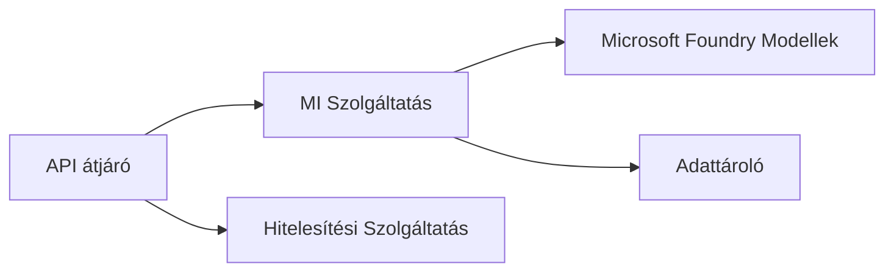
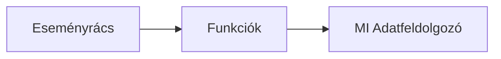

# 8. fejezet: Termelési és vállalati minták

**📚 Tanfolyam**: [AZD kezdőknek](../../README.md) | **⏱️ Időtartam**: 2-3 óra | **⭐ Bonyolultság**: Haladó

---

## Áttekintés

Ez a fejezet vállalati szintű telepítési mintákat, biztonsági megerősítést, megfigyelést és költségoptimalizálást tárgyal termelési AI munkaterhelésekhez.

> Ellenőrizve az `azd 1.25.6` verzióval 2026 júniusában.

## Tanulási célok

A fejezet elvégzése után képes leszel:
- Több régiós, ellenálló alkalmazásokat telepíteni
- Vállalati biztonsági mintákat alkalmazni
- Átfogó megfigyelést konfigurálni
- Költségeket nagyléptékben optimalizálni
- CI/CD folyamatokat beállítani AZD-vel

---

## 📚 Leckék

| # | Lecke | Leírás | Idő |
|---|--------|-------------|------|
| 1 | [Termelési AI munkafolyamatok](production-ai-practices.md) | Vállalati telepítési minták | 90 perc |

---

## 🚀 Termelési ellenőrzőlista

- [ ] Több régiós telepítés az ellenállás érdekében
- [ ] Kezelt identitás az autentikációhoz (kulcsok nélkül)
- [ ] Alkalmazásfigyelés Application Insights használatával
- [ ] Költségkeretek és értesítések beállítva
- [ ] Biztonsági vizsgálatok engedélyezve
- [ ] CI/CD folyamat integrálva
- [ ] Katasztrófa utáni helyreállítási terv

---

## 🏗️ Architektúra minták

### Minta 1: Mikroszolgáltatások AI



### Minta 2: Eseményvezérelt AI



---

## 🔐 Biztonsági legjobb gyakorlatok

```bicep
// Use managed identity
identity: {
  type: 'SystemAssigned'
}

// Private endpoints for AI services
properties: {
  publicNetworkAccess: 'Disabled'
  networkAcls: {
    defaultAction: 'Deny'
  }
}
```

---

## 💰 Költségoptimalizálás

| Stratégia | Megtakarítás |
|----------|--------------|
| Nulla skálázás (Container Apps) | 60-80% |
| Fogyasztási szintek használata fejlesztéshez | 50-70% |
| Ütemezett skálázás | 30-50% |
| Foglalt kapacitás | 20-40% |

```bash
# Költségvetési figyelmeztetések beállítása
az consumption budget create \
  --budget-name "AI-Budget" \
  --amount 500 \
  --category Cost \
  --time-grain Monthly
```

---

## 📊 Megfigyelési beállítások

```bash
# Naplók folyamatos áramlása
azd monitor --logs

# Ellenőrizze az Application Insights szolgáltatást
azd monitor --overview

# Metrikák megtekintése
az monitor metrics list --resource <resource-id>
```

---

## 🔗 Navigáció

| Irány | Fejezet |
|-----------|---------|
| **Előző** | [7. fejezet: Hibakeresés](../chapter-07-troubleshooting/README.md) |
| **Tanfolyam befejezve** | [Tanfolyam kezdőlap](../../README.md) |

---

## 📖 Kapcsolódó források

- [AI ügynökök útmutatója](../chapter-02-ai-development/agents.md)
- [Application Insights](../chapter-06-pre-deployment/application-insights.md)
- [Többügynökös megoldások](../chapter-05-multi-agent/README.md)
- [Mikroszolgáltatások példa](../../examples/microservices/README.md)

---

<!-- CO-OP TRANSLATOR DISCLAIMER START -->
**Jogi nyilatkozat**:
Ez a dokumentum az AI fordítási szolgáltatás, a [Co-op Translator](https://github.com/Azure/co-op-translator) segítségével készült. Bár az pontosságra törekszünk, kérjük, vegye figyelembe, hogy az automatikus fordítások hibákat vagy pontatlanságokat tartalmazhatnak. Az eredeti dokumentum az anyanyelvén tekintendő hiteles forrásnak. Fontos információk esetén professzionális emberi fordítást javasolunk. Nem vállalunk felelősséget semmilyen félreértésért vagy téves értelmezésért, amely ebből a fordításból ered.
<!-- CO-OP TRANSLATOR DISCLAIMER END -->