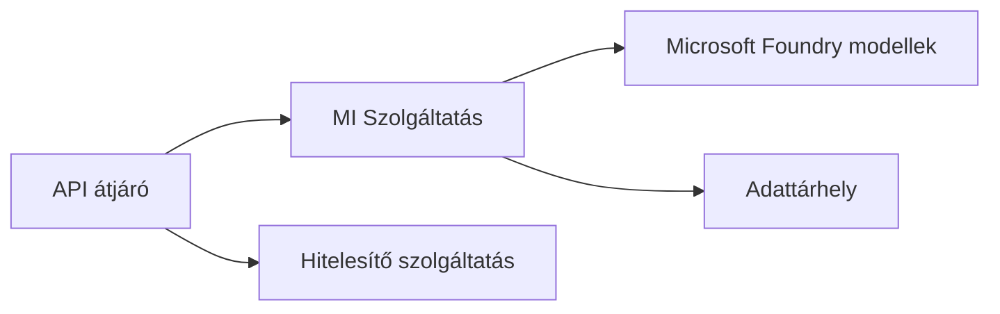
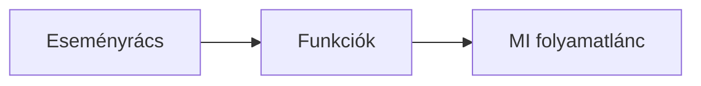

# 8. fejezet: Termelési és vállalati minták

**📚 Tanfolyam**: [AZD kezdőknek](../../README.md) | **⏱️ Időtartam**: 2-3 óra | **⭐ Bonyolultság**: Haladó

---

## Áttekintés

Ez a fejezet vállalati szintű telepítési mintákat, biztonsági megerősítést, megfigyelést és költségoptimalizálást tárgyal az AI termelési munkaterhelésekhez.

> Ellenőrizve az `azd 1.27.1` verzióval 2026 júliusában.

## Tanulási célok

Ennek a fejezetnek a befejezésével Ön:
- Többszörös régiókban reziliens alkalmazásokat telepít
- Vállalati biztonsági mintákat valósít meg
- Átfogó megfigyelést konfigurál
- Költségeket optimalizál nagy léptékben
- AZD-vel állítja be a CI/CD csővezetékeket

---

## 📚 Leckék

| # | Lecke | Leírás | Idő |
|---|--------|-------------|------|
| 1 | [Termelési AI gyakorlatok](production-ai-practices.md) | Vállalati telepítési minták | 90 perc |

---

## 🚀 Termelési ellenőrzőlista

- [ ] Több régióban történő telepítés a reziliencia érdekében
- [ ] Kezelt identitás az hitelesítéshez (nincsenek kulcsok)
- [ ] Application Insights a megfigyeléshez
- [ ] Költségkeretek és riasztások beállítva
- [ ] Biztonsági vizsgálat engedélyezve
- [ ] CI/CD csővezeték integráció
- [ ] Katasztrófa-helyreállítási terv

---

## 🏗️ Architektúra minták

### Minta 1: Mikroszolgáltatások AI



### Minta 2: Eseményvezérelt AI



---

## 🔐 Biztonsági legjobb gyakorlatok

```bicep
// Use managed identity
identity: {
  type: 'SystemAssigned'
}

// Private endpoints for AI services
properties: {
  publicNetworkAccess: 'Disabled'
  networkAcls: {
    defaultAction: 'Deny'
  }
}
```

---

## 💰 Költségoptimalizálás

| Stratégia | Megtakarítás |
|----------|---------|
| Nulla skálázás (Container Apps) | 60-80% |
| Fogyasztási szintek használata fejlesztéshez | 50-70% |
| Ütemezett skálázás | 30-50% |
| Fenntartott kapacitás | 20-40% |

```bash
# Költségvetési riasztások beállítása
az consumption budget create \
  --budget-name "AI-Budget" \
  --amount 500 \
  --category Cost \
  --time-grain Monthly
```

---

## 📊 Megfigyelés beállítása

```bash
# Logok folyamatos közvetítése
azd monitor --logs

# Application Insights ellenőrzése
azd monitor --overview

# Metriák megtekintése
az monitor metrics list --resource <resource-id>
```

---

## 🔗 Navigáció

| Irány | Fejezet |
|-----------|---------|
| **Előző** | [7. fejezet: Hibakeresés](../chapter-07-troubleshooting/README.md) |
| **Tanfolyam vége** | [Tanfolyam kezdőlap](../../README.md) |

---

## 📖 Kapcsolódó források

- [AI ügynökök útmutatója](../chapter-02-ai-development/agents.md)
- [Application Insights](../chapter-06-pre-deployment/application-insights.md)
- [Többügynökös megoldások](../chapter-05-multi-agent/README.md)
- [Mikroszolgáltatások példa](../../examples/microservices/README.md)

---

<!-- CO-OP TRANSLATOR DISCLAIMER START -->
**Jogi nyilatkozat**:
Ez a dokumentum az AI fordítási szolgáltatás, a [Co-op Translator](https://github.com/Azure/co-op-translator) segítségével készült. Bár az pontosságra törekszünk, kérjük, vegye figyelembe, hogy az automatikus fordítások hibákat vagy pontatlanságokat tartalmazhatnak. Az eredeti dokumentum az anyanyelvén tekintendő hiteles forrásnak. Fontos információk esetén professzionális emberi fordítást javasolunk. Nem vállalunk felelősséget semmilyen félreértésért vagy téves értelmezésért, amely ebből a fordításból ered.
<!-- CO-OP TRANSLATOR DISCLAIMER END -->