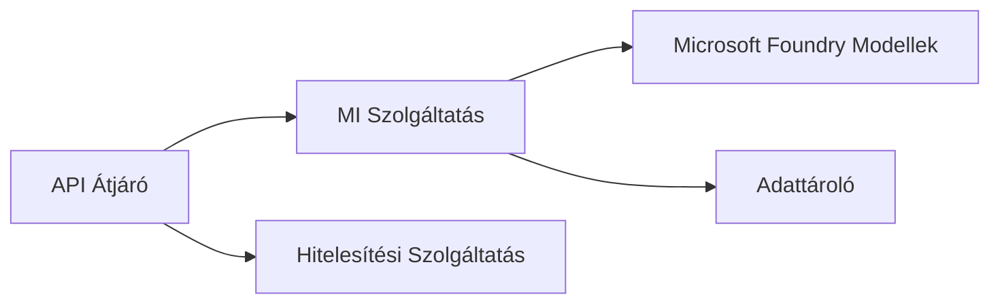
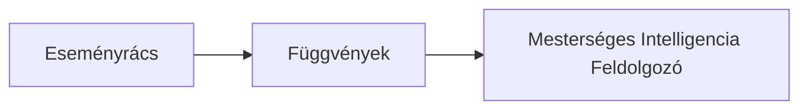

# 8. fejezet: Termelési és Vállalati Minták

**📚 Tanfolyam**: [AZD kezdőknek](../../README.md) | **⏱️ Időtartam**: 2-3 óra | **⭐ Bonyolultság**: Haladó

---

## Áttekintés

Ez a fejezet a vállalati szintű telepítési mintákat, biztonsági merevítést, monitorozást és költségoptimalizálást tárgyalja termelési AI munkafolyamatokhoz.

> Érvényesítve az `azd 1.23.12` verzióval 2026 márciusában.

## Tanulási célok

A fejezet elvégzésével képes lesz:
- Több régióra kiterjedő, ellenálló alkalmazásokat telepíteni
- Vállalati biztonsági mintákat megvalósítani
- Átfogó monitorozást konfigurálni
- Költségeket nagy léptékben optimalizálni
- CI/CD folyamatokat beállítani AZD-vel

---

## 📚 Leckék

| # | Lecke | Leírás | Idő |
|---|--------|-------------|------|
| 1 | [Termelési AI gyakorlatok](production-ai-practices.md) | Vállalati telepítési minták | 90 perc |

---

## 🚀 Termelési ellenőrzőlista

- [ ] Több régióra kiterjedő telepítés az ellenállóságért
- [ ] Kezelői identitás az azonosításhoz (nincs kulcs)
- [ ] Application Insights monitorozáshoz
- [ ] Költségkeretek és riasztások beállítva
- [ ] Engedélyezett biztonsági vizsgálat
- [ ] CI/CD folyamat integráció
- [ ] Katasztrófa utáni helyreállítási terv

---

## 🏗️ Architektúra minták

### Minta 1: Microservices AI


### Minta 2: Esemény-vezérelt AI


---

## 🔐 Biztonsági legjobb gyakorlatok

```bicep
// Use managed identity
identity: {
  type: 'SystemAssigned'
}

// Private endpoints for AI services
properties: {
  publicNetworkAccess: 'Disabled'
  networkAcls: {
    defaultAction: 'Deny'
  }
}
```

---

## 💰 Költségoptimalizálás

| Stratégia | Megtakarítás |
|----------|---------|
| Skálázás nullára (Container Apps) | 60-80% |
| Fogyasztási rétegek használata fejlesztéshez | 50-70% |
| Ütemezett skálázás | 30-50% |
| Foglalt kapacitás | 20-40% |

```bash
# Költségvetési riasztások beállítása
az consumption budget create \
  --budget-name "AI-Budget" \
  --amount 500 \
  --category Cost \
  --time-grain Monthly
```

---

## 📊 Monitorozás beállítása

```bash
# Logok folyamatos megjelenítése
azd monitor --logs

# Alkalmazásfigyelés ellenőrzése
azd monitor --overview

# Mérőszámok megtekintése
az monitor metrics list --resource <resource-id>
```

---

## 🔗 Navigáció

| Irány | Fejezet |
|-----------|---------|
| **Előző** | [7. fejezet: Hibakeresés](../chapter-07-troubleshooting/README.md) |
| **Tanfolyam vége** | [Tanfolyam kezdőlap](../../README.md) |

---

## 📖 Kapcsolódó források

- [AI ügynökök útmutatója](../chapter-02-ai-development/agents.md)
- [Application Insights](../chapter-06-pre-deployment/application-insights.md)
- [Többügynökös megoldások](../chapter-05-multi-agent/README.md)
- [Microservices példa](../../examples/microservices/README.md)

---

<!-- CO-OP TRANSLATOR DISCLAIMER START -->
**Jogi nyilatkozat**:  
Ez a dokumentum az AI fordító szolgáltatás, a [Co-op Translator](https://github.com/Azure/co-op-translator) használatával készült. Bár a pontosságra törekszünk, kérjük, vegye figyelembe, hogy az automatikus fordítások tartalmazhatnak hibákat vagy pontatlanságokat. Az eredeti dokumentum az anyanyelvén tekintendő hiteles forrásnak. Kritikus információk esetén ajánlott szakmai emberi fordítást igénybe venni. Nem vállalunk felelősséget az ebből a fordításból eredő félreértésekért vagy téves értelmezésekért.
<!-- CO-OP TRANSLATOR DISCLAIMER END -->